# `matplotlib\galleries\examples\text_labels_and_annotations\multiline.py` 详细设计文档

该代码使用matplotlib和numpy库创建了一个包含两个子图的图表，展示了多行文本标签、文本对齐、旋转以及子图布局调整的功能，主要用于测试多行文本的渲染效果。

## 整体流程

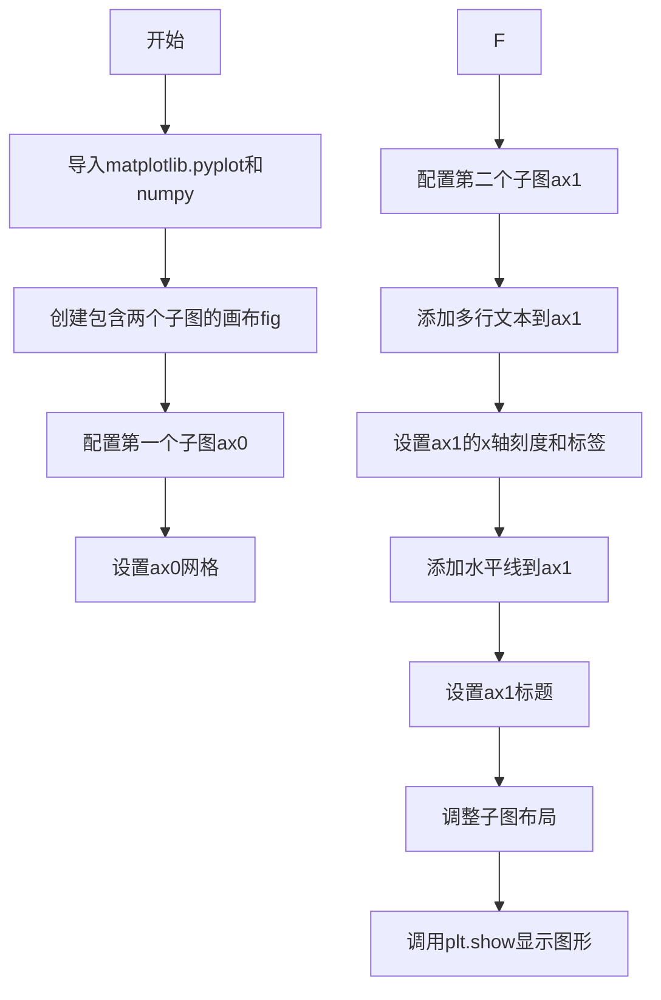

## 类结构

```
无类定义 (纯脚本文件)
直接使用matplotlib.pyplot和numpy库函数
```

## 全局变量及字段


### `fig`
    
整个图形对象，包含所有子图

类型：`matplotlib.figure.Figure`
    


### `ax0`
    
第一个子图对象，用于绘制第一个图表

类型：`matplotlib.axes.Axes`
    


### `ax1`
    
第二个子图对象，用于绘制第二个图表

类型：`matplotlib.axes.Axes`
    


### `np`
    
numpy库别名，用于数值计算和数组操作

类型：`numpy library alias`
    


### `plt`
    
matplotlib.pyplot库别名，用于绘图

类型：`matplotlib.pyplot library alias`
    


    

## 全局函数及方法


### `plt.subplots`

`plt.subplots` 是 Matplotlib 库中用于创建子图布局的核心函数，它创建一个新的图形窗口（或使用现有图形），并在其中生成指定行列数的子图网格，返回图形对象和包含所有子图坐标轴对象的元组。

参数：

- `nrows`：`int`，可选，默认为 1，子图的行数
- `ncols`：`int`，可选，默认为 1，子图的列数
- `sharex`：`bool` 或 `{'none', 'all', 'row', 'col'}`，可选，默认为 False，控制子图之间是否共享 x 轴
- `sharey`：`bool` 或 `{'none', 'all', 'row', 'col'}`，可选，默认为 False，控制子图之间是否共享 y 轴
- `squeeze`：`bool`，可选，默认为 True，如果为 True，则返回的 Axes 对象数组维度会被压缩
- `figsize`：`tuple of floats`，可选，图形尺寸 (宽度, 高度)，单位英寸
- `dpi`：`int`，可选，每英寸点数（分辨率）
- `facecolor`：颜色值，可选，图形背景颜色
- `edgecolor`：颜色值，可选，图形边框颜色
- `frameon`：`bool`，可选，是否绘制框架
- `subplot_kw`：`dict`，可选，传递给每个子图创建函数的关键字参数
- `gridspec_kw`：`dict`，可选，传递给 GridSpec 构造函数的关键字参数
- `**kwargs`：其他关键字参数，传递给 `Figure.subplots` 方法

返回值：`tuple(Figure, Axes or array of Axes)`，返回包含图形对象和子图坐标轴对象（或数组）的元组

#### 流程图

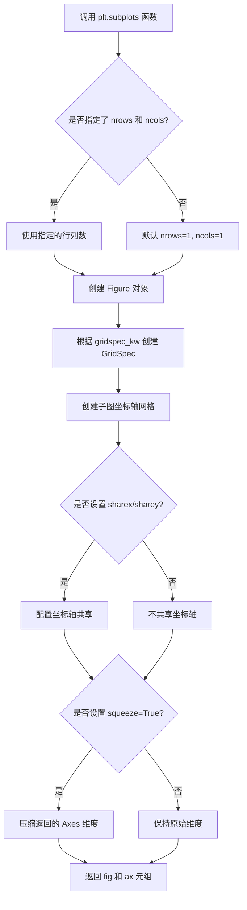

#### 带注释源码

```python
# plt.subplots 函数源码结构（简化版）

def subplots(nrows=1, ncols=1, 
             sharex=False, 
             sharey=False, 
             squeeze=True,
             width_ratios=None, 
             height_ratios=None,
             **kwargs):
    """
    创建子图布局
    
    参数:
        nrows: 子图行数，默认1
        ncols: 子图列数，默认1
        sharex: x轴共享策略
        sharey: y轴共享策略
        squeeze: 是否压缩维度
        width_ratios: 列宽比例
        height_ratios: 行高比例
        **kwargs: 其他图形参数（figsize, dpi等）
    
    返回:
        fig: Figure 对象（整个图形）
        ax: Axes 对象或数组（子图坐标轴）
    """
    
    # 1. 创建 Figure 对象
    fig = plt.figure(**fig_kw)
    
    # 2. 创建 GridSpec 对象用于布局
    gs = GridSpec(nrows, nrows, 
                  figure=fig,
                  width_ratios=width_ratios,
                  height_ratios=height_ratios,
                  **gridspec_kw)
    
    # 3. 根据行列数创建子图
    ax_array = np.empty((nrows, ncols), dtype=object)
    for i in range(nrows):
        for j in range(ncols):
            # 创建每个子图的坐标轴
            ax = fig.add_subplot(gs[i, j], **subplot_kw)
            ax_array[i, j] = ax
    
    # 4. 处理坐标轴共享
    if sharex or sharey:
        # 配置共享策略
        pass
    
    # 5. 处理 squeeze 参数
    if squeeze:
        # 压缩维度：单行或单列时返回一维数组
        ax_array = np.squeeze(ax_array)
    
    # 6. 返回图形和坐标轴
    return fig, ax_array
```


### `Axes.set_aspect`

设置坐标轴的纵横比，决定了 x 轴和 y 轴数据单位在屏幕上的物理长度比例，使得图形在特定方向上进行缩放调整。

参数：

-  `aspect`：`{'auto', 'equal'} or float`，坐标轴的纵横比，'auto' 自动调整，'equal' 强制 x 和 y 轴单位长度相等，浮点数强制特定的 y/x 比例
-  `adjustable`：`str, optional`，调整方式，'box' 调整轴框大小以满足纵横比，'datalim' 调整数据限制以满足纵横比
-  `anchor`：`str or tuple, optional`，锚点位置，用于指定在调整大小时 axes 的哪个位置保持不变，如 'C' 表示居中
-  `share`：`bool, optional`，是否同时将设置应用于所有共享轴，默认为 False

返回值：`matplotlib.axes.Axes`，返回 Axes 对象本身，以支持链式调用

#### 流程图

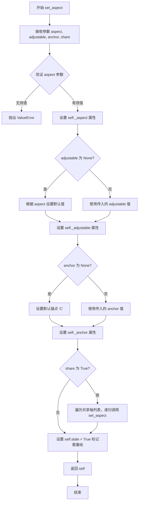

#### 带注释源码

```python
def set_aspect(self, aspect, adjustable=None, anchor=None, share=False):
    """
    设置坐标轴的纵横比。
    
    纵横比决定了 x 轴和 y 轴数据单位在屏幕上的物理长度比例。
    例如，aspect=1 表示 y 轴和 x 轴的单位长度在屏幕上看起来相等。
    
    参数
    ----------
    aspect : {'auto', 'equal'} 或 float
        - 'auto' : 自动调整，不强制特定的纵横比，由数据区域决定显示
        - 'equal' : 强制相等的纵横比，使得 x 和 y 轴的数据单位在屏幕上长度相等
        - float : 强制特定的纵横比，值为 y/x 的比例
    adjustable : str, 可选
        调整哪个参数以满足所需的纵横比：
        - 'box' : 调整 axes 框的大小
        - 'datalim' : 调整数据限制
        默认为 None，当 aspect='equal' 时默认为 'box'，否则为 'datalim'
    anchor : str 或 tuple, 可选
        锚点位置，指定当调整大小时 axes 的哪个点保持固定。
        格式为 'C' (居中), 'SW' (西南角) 等，或 (x, y) 坐标。
        默认为 None，意为 'C' (居中)
    share : bool, 可选
        如果为 True，则将设置应用于所有共享轴。
        默认为 False
    
    返回值
    -------
    self : Axes
        返回 Axes 对象本身，以支持链式调用（如 ax.set_aspect(1).set_xlabel('x')）
    
    示例
    --------
    >>> ax.set_aspect(1)  # 强制 1:1 纵横比
    >>> ax.set_aspect('equal')  # 效果同上
    >>> ax.set_aspect('auto')  # 取消强制纵横比
    """
    # 验证 aspect 参数的有效性
    if aspect not in ('auto', 'equal') and not isinstance(aspect, (int, float)):
        raise ValueError("aspect 必须是 'auto', 'equal' 或浮点数")
    
    # 如果是数值型 aspect，必须为正数
    if isinstance(aspect, (int, float)) and aspect <= 0:
        raise ValueError("aspect 必须为正数")
    
    # 设置内部属性 _aspect，存储纵横比设置
    self._aspect = aspect
    
    # 处理 adjustable 参数
    if adjustable is None:
        # 当 aspect='equal' 时默认调整框大小，否则调整数据限制
        adjustable = 'box' if aspect == 'equal' else 'datalim'
    self._adjustable = adjustable
    
    # 处理 anchor 参数
    if anchor is None:
        anchor = 'C'  # 默认居中锚点
    self._anchor = anchor
    
    # 如果 share 为 True，递归设置所有共享轴的纵横比
    if share:
        # 获取所有共享轴的同级轴
        for ax in self.get_shared_x_axes().get_siblings(self):
            if ax is not self:
                # 递归调用设置其他共享轴，但不再共享以避免无限递归
                ax.set_aspect(aspect, adjustable=adjustable, 
                              anchor=anchor, share=False)
    
    # 标记 axes 状态为 stale（需要重绘），触发图形更新
    self.stale = True
    
    # 返回 self 以支持链式调用
    return self
```


### `ax0.plot`

该方法用于在 matplotlib 的 Axes 对象上绑制线条，是绘制数据序列的核心函数。它接受数据序列和可选的关键字参数，将数据转换为线段并渲染到图表中，同时返回包含 Line2D 对象的列表以便后续定制。

参数：

- `self`：matplotlib.axes.Axes，隐含参数，表示绑制线条的 Axes 实例（代码中为 ax0）。
- `*args`：可变位置参数，通常传入数据序列（如 numpy 数组、列表等）。代码中传入 `np.arange(10)`，表示 0 到 9 的整数序列。
- `**kwargs`：可变关键字参数，用于指定线条样式（如颜色、线型、标记等）。代码中未传入，使用默认样式（蓝色实线）。

返回值：`list of matplotlib.lines.Line2D`，返回一个包含 Line2D 对象的列表，每个对象代表一条绑制的线条。代码中返回的列表包含一个 Line2D 实例。

#### 流程图

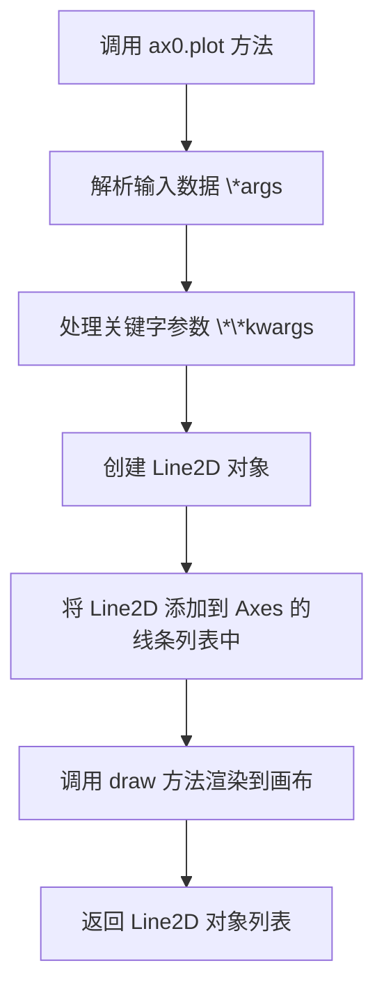

#### 带注释源码

```python
# 导入必要的库
import matplotlib.pyplot as plt
import numpy as np

# 创建一个包含两个子图的图表，fig 是 Figure 对象，ax0 和 ax1 是 Axes 对象
fig, (ax0, ax1) = plt.subplots(ncols=2, figsize=(7, 4))

# 设置 ax0 的纵横比为 1:1
ax0.set_aspect(1)

# 调用 ax0.plot 绑制线条，传入数据 np.arange(10)
# 参数：*args = (np.arange(10),)，表示 y 轴数据，x 轴自动索引
# kwargs 未指定，使用默认线条样式（蓝色实线）
# 返回值：lines = [Line2D 对象]，存储在 ax0.lines 列表中
ax0.plot(np.arange(10))

# 设置 x 轴标签，支持多行文本
ax0.set_xlabel('this is an xlabel\n(with newlines!)')

# 设置 y 轴标签，multialignment='center' 表示多行文本居中对齐
ax0.set_ylabel('this is vertical\ntest', multialignment='center')

# 在指定位置添加文本，支持旋转和多行对齐
ax0.text(2, 7, 'this is\nyet another test',
         rotation=45,
         horizontalalignment='center',
         verticalalignment='top',
         multialignment='center')

# 开启 ax0 的网格线
ax0.grid()

# 以下是 ax1 的文本和图表设置，与 ax0.plot 无关
ax1.text(0.29, 0.4, "Mat\nTTp\n123", size=18,
         va="baseline", ha="right", multialignment="left",
         bbox=dict(fc="none"))

ax1.text(0.34, 0.4, "Mag\nTTT\n123", size=18,
         va="baseline", ha="left", multialignment="left",
         bbox=dict(fc="none"))

ax1.text(0.95, 0.4, "Mag\nTTT$^{A^A}$\n123", size=18,
         va="baseline", ha="right", multialignment="left",
         bbox=dict(fc="none"))

# 设置 x 轴刻度标签，支持多行文本
ax1.set_xticks([0.2, 0.4, 0.6, 0.8, 1.],
               labels=["Jan\n2009", "Feb\n2009", "Mar\n2009", "Apr\n2009",
                       "May\n2009"])

# 在 y=0.4 处添加水平线
ax1.axhline(0.4)
ax1.set_title("test line spacing for multiline text")

# 调整子图布局
fig.subplots_adjust(bottom=0.25, top=0.75)

# 显示图表
plt.show()
```


### `ax0.set_xlabel`

设置x轴的标签（xlabel），用于描述x轴所代表的数据或变量。该方法允许通过字符串参数指定标签文本，并返回创建的`Text`对象，以便进行进一步的样式定制。

参数：

- `xlabel`：`str`，要设置的x轴标签文本内容，支持使用换行符`\n`进行多行显示
- `**kwargs`：可选关键字参数，用于定制标签的样式属性（如`fontsize`、`color`、`rotation`、`multialignment`等）

返回值：`matplotlib.text.Text`，返回创建的文本对象，允许后续对其进行样式调整或动画设置

#### 流程图

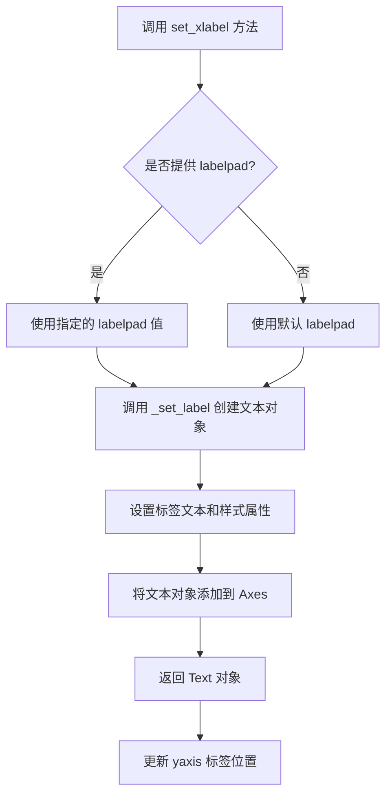

#### 带注释源码

```python
# 源代码位于 matplotlib/axes/_base.py 中的 _AxesBase 类
def set_xlabel(self, xlabel, fontdict=None, labelpad=None, **kwargs):
    """
    Set the label for the x-axis.
    
    参数:
        xlabel : str
            标签文本内容，支持换行符\n实现多行显示
            
        fontdict : dict, optional
            文本字体字典，可用于统一设置字体属性
            
        labelpad : float, optional
            标签与坐标轴之间的间距（磅值）
            
        **kwargs : 
            传递给 Text 类的关键字参数，可用于设置
            字体大小、颜色、旋转角度、对齐方式等
    
    返回值:
        text : matplotlib.text.Text
            创建的标签文本对象
    """
    
    # 如果提供了 fontdict，将其合并到 kwargs 中
    if fontdict is not None:
        kwargs.update(fontdict)
    
    # 处理 labelpad 参数
    # labelpad 定义标签与坐标轴之间的间距
    # 如果未指定，则使用默认的 self._label_position_x
    if labelpad is None:
        labelpad = self._label_position_x  # 默认值
    
    # 调用 _set_label 方法创建标签
    # 该方法会创建 Text 对象并配置其属性
    return self._set_label(xlabel, labelpad, 'x', **kwargs)
```

#### 实际调用示例

```python
# 在给定的代码中，调用方式如下：
ax0.set_xlabel('this is an xlabel\n(with newlines!)')

# 这个调用执行以下操作：
# 1. 将字符串 'this is an xlabel\n(with newlines!)' 作为 xlabel 参数传入
# 2. 创建多行文本标签（因为字符串中包含 \n 换行符）
# 3. 使用默认的 labelpad 值
# 4. 返回一个 Text 对象（虽然在这个例子中未使用返回值）
```

#### 关联的样式属性

在调用 `set_xlabel` 时，常用的 `**kwargs` 参数包括：

| 参数名 | 类型 | 描述 |
|--------|------|------|
| fontsize / size | int 或 float | 字体大小 |
| color | str | 文本颜色 |
| rotation | float | 旋转角度（度） |
| multialignment | str | 多行对齐方式（'left', 'right', 'center'） |
| horizontalalignment / ha | str | 水平对齐方式 |
| verticalalignment / va | str | 垂直对齐方式 |
| fontweight | str 或 int | 字体粗细 |


### `ax0.set_ylabel`

设置y轴的标签文本，可选择多行文本的对齐方式。

参数：

- `ylabel`：`str`，y轴标签的文本内容，支持换行符`\n`实现多行显示
- `**kwargs`：可选关键字参数，用于配置文本样式，常用参数包括：
  - `multialignment`：`str`，多行文本的对齐方式，可选值有`'left'`、`'center'`、`'right'`
  - `fontsize`：`int`或`float`，字体大小
  - `fontweight`：`str`或`int`，字体粗细
  - `color`：`str`，文本颜色
  - `rotation`：`float`，文本旋转角度（度）
  - `labelpad`：`float`，标签与坐标轴的间距

返回值：`matplotlib.text.Text` 或 `None`，返回设置的ylabel文本对象，或在某些情况下返回None。

#### 流程图

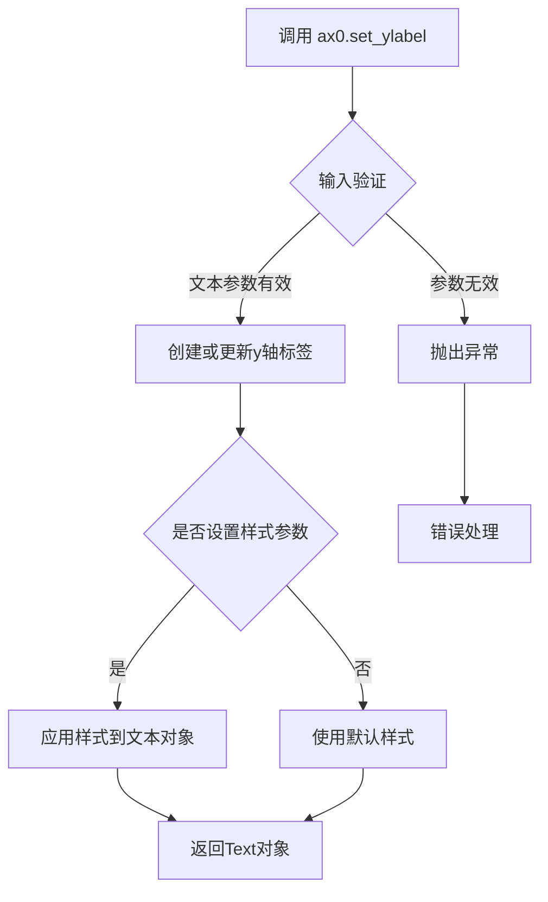

#### 带注释源码

```python
# 源代码为matplotlib库内部实现，此处展示调用示例
# 设置y轴标签，包含多行文本和居中对齐
ax0.set_ylabel('this is vertical\ntest',  # ylabel: 标签文本，使用\n换行
               multialignment='center')   # multialignment: 多行文本对齐方式为居中
```


### `Axes.text`

该方法用于在matplotlib子图（Axes）上指定位置添加文本内容，支持多行文本、对齐方式、旋转角度等丰富的文本格式化选项，是数据可视化中标注关键信息的重要手段。

参数：

- `x`：`float`，文本插入点的X轴坐标（数据坐标）
- `y`：`float`，文本插入点的Y轴坐标（数据坐标）
- `s`：`str`，要显示的文本内容，支持换行符`\n`实现多行文本
- `rotation`：`float`，可选，文本旋转角度（度），默认为0（水平）
- `horizontalalignment`/`ha`：`str`，可选，水平对齐方式，可选值包括`'center'`、`'left'`、`'right'`，默认为`'right'`
- `verticalalignment`/`va`：`str`，可选，垂直对齐方式，可选值包括`'center'`、`'top'`、`'bottom'`、`'baseline'`，默认为`'bottom'`
- `multialignment`：`str`，可选，多行文本的对齐方式，可选值包括`'left'`、`'center'`、`'right'`，仅影响多行文本内部各行的对齐
- `fontdict`：`dict`，可选，字体属性字典，可一次性设置字体大小、颜色、权重等属性
- `**kwargs`：其他可选参数，包括`fontsize`、`color`、`fontweight`、`bbox`（文本框属性）等matplotlib Text对象支持的属性

返回值：`matplotlib.text.Text`，返回创建的Text对象，可用于后续修改文本属性或获取文本位置信息

#### 流程图

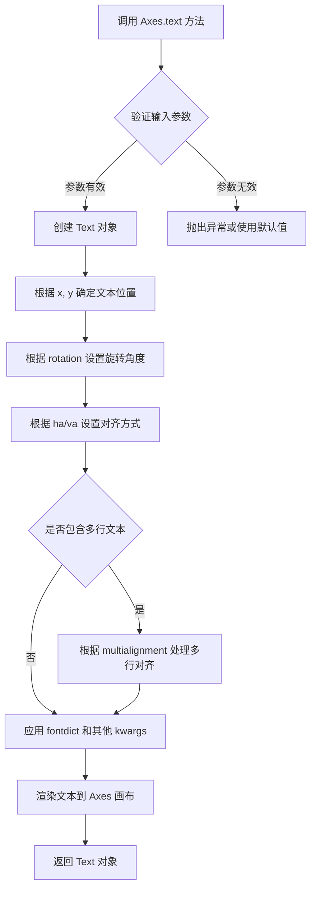

#### 带注释源码

```python
# 示例代码来源于 matplotlib multiline 演示
# 展示了 Axes.text 方法的典型用法

# 在 ax0 子图上添加文本
# 参数说明：
# x=2, y=7: 文本放置在坐标 (2, 7) 位置
# 'this is\nyet another test': 文本内容，\n 表示换行
# rotation=45: 文本逆时针旋转45度
# horizontalalignment='center': 水平居中对齐
# verticalalignment='top': 顶部对齐
# multialignment='center': 多行文本内部居中对齐
ax0.text(
    2, 7,                              # x, y 坐标
    'this is\nyet another test',       # s 文本内容（支持换行）
    rotation=45,                       # rotation 旋转角度
    horizontalalignment='center',      # ha 水平对齐
    verticalalignment='top',           # va 垂直对齐
    multialignment='center'            # 多行文本内部对齐方式
)

# 在 ax1 子图上添加文本示例
# 展示 va='baseline' 和 ha='right' 的组合效果
# bbox=dict(fc='none') 设置无填充的文本框
ax1.text(
    0.29, 0.4,                         # x, y 坐标
    "Mat\nTTp\n123",                  # s 多行文本
    size=18,                           # fontsize=18
    va="baseline",                     # va 垂直对齐方式
    ha="right",                        # ha 水平对齐方式
    multialignment="left",             # 多行文本左对齐
    bbox=dict(fc="none")               # bbox 文本框（fc='none'表示无填充）
)

# 另一个文本示例，包含上标语法
ax1.text(
    0.95, 0.4,                        # x, y 坐标
    "Mag\nTTT$^{A^A}$\n123",          # s 包含LaTeX上标语法的文本
    size=18,
    va="baseline",
    ha="right",
    multialignment="left",
    bbox=dict(fc="none")
)
```


### `ax0.grid`

设置Axes对象的网格线，用于显示图表中的网格线。

参数：

- `b`：布尔值或None，表示是否显示网格线（默认为None，即切换当前状态）
- `which`：字符串，可选值为'major'、'minor'或'both'，表示网格线应用到哪个刻度（默认为'major'）
- `axis`：字符串，可选值为'both'、'x'或'y'，表示网格线应用到哪个轴（默认为'both'）
- `**kwargs`：其他关键字参数，直接传递给`matplotlib.lines.Line2D`对象，用于自定义网格线的样式

返回值：`None`，无返回值，该方法直接修改Axes对象的显示状态

#### 流程图

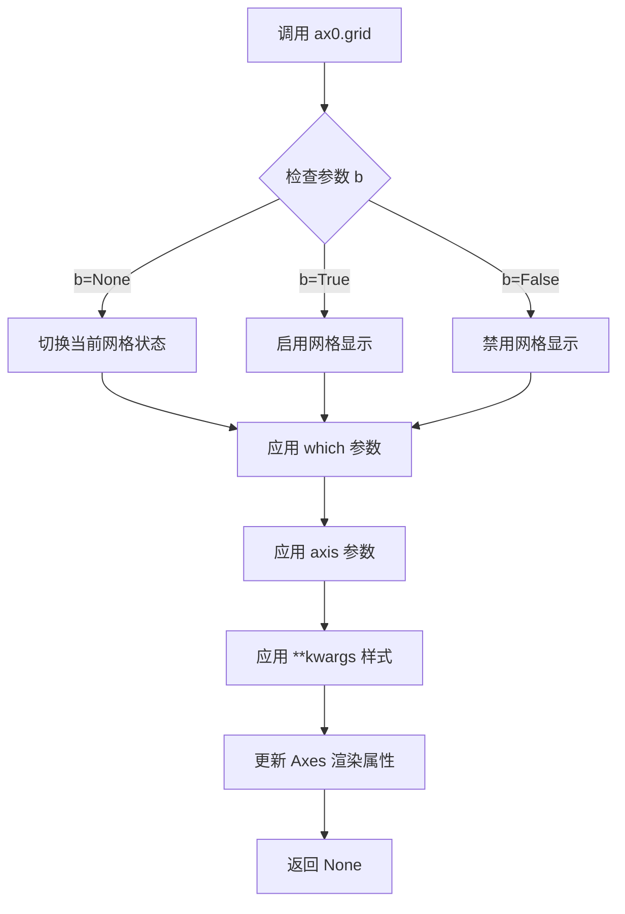

#### 带注释源码

```python
# 在 matplotlib 中，grid() 方法的定义位于 matplotlib.axes._axes.Axes 类中
# 以下是核心实现的简化版本：

def grid(self, b=True, which='major', axis='both', **kwargs):
    """
    设置或切换网格线显示
    
    参数:
        b: 布尔值或None
           - True: 启用网格
           - False: 禁用网格
           - None: 切换当前状态（开->关，关->开）
        
        which: str, 可选 'major', 'minor', 'both'
               控制网格线显示在主刻度还是次刻度
        
        axis: str, 可选 'both', 'x', 'y'
              控制显示哪个方向的网格线
        
        **kwargs: 传递给 Line2D 的样式参数
                  例如: color, linestyle, linewidth, alpha 等
    """
    # 获取或创建网格线集合
    if axis in ['both', 'x']:
        self.xaxis.get_gridlines()  # 获取x轴网格线
        self.yaxis.get_gridlines()  # 获取y轴网格线
    
    # 根据b参数设置网格线的可见性
    # b=None 时，切换当前状态
    # b=True 时，显示网格
    # b=False 时，隐藏网格
    
    # 应用网格线样式（颜色、线型、线宽等）
    # 通过 kwargs 传递给 Line2D
    
    # 更新网格线属性并触发重绘
    self.stale_callback = None  # 标记需要重绘
```

#### 实际调用示例

```python
# 代码中的实际调用
ax0.grid()

# 等效于以下调用（默认参数）：
ax0.grid(b=None, which='major', axis='both')

# 自定义样式的调用示例：
# ax0.grid(color='r', linestyle='--', linewidth=0.5)  # 红色虚线网格
```


### `ax1.text`

该方法用于在 Axes 对象上添加多行文本，并支持水平对齐、垂直对齐和多行对齐方式的设置，常用于图表中的标签、注释或测试文本的展示。

参数：

- `x`：`float`，文本插入的 x 坐标位置
- `y`：`float`，文本插入的 y 坐标位置
- `s`：`str`，要显示的文本内容，支持换行符 `\n` 实现多行文本
- `size`：`int`，字体大小（可选）
- `va`：`str`，垂直对齐方式，可选值包括 'center'、'top'、'bottom'、'baseline'、'center_baseline'（可选）
- `ha`：`str`，水平对齐方式，可选值包括 'center'、'left'、'right'（可选）
- `multialignment`：`str`，多行文本的对齐方式，可选值包括 'left'、'right'、'center'（可选）
- `bbox`：`dict`，文本边框属性字典，可包含 fc（填充颜色）、linewidth（边框宽度）等（可选）

返回值：`matplotlib.text.Text`，返回创建的 Text 对象，可用于后续对文本样式和位置进行修改

#### 流程图

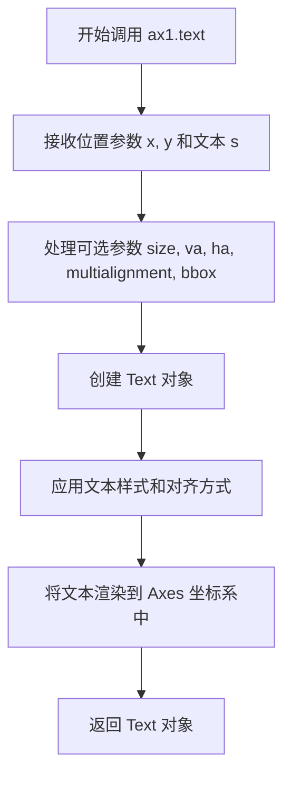

#### 带注释源码

```python
# 在 ax1 (Axes 对象) 上添加第一个多行对齐测试文本
# 参数说明：
# x=0.29: 文本x坐标位置（相对于坐标轴）
# y=0.4: 文本y坐标位置（相对于坐标轴）
# "Mat\nTTp\n123": 文本内容，包含换行符实现多行显示
# size=18: 字体大小为18
# va="baseline": 垂直对齐方式为基线对齐
# ha="right": 水平对齐方式为右对齐
# multialignment="left": 多行文本每行左对齐
# bbox=dict(fc="none"): 设置边框，fc="none"表示无填充（即透明背景）
ax1.text(0.29, 0.4, "Mat\nTTp\n123", size=18,
         va="baseline", ha="right", multialignment="left",
         bbox=dict(fc="none"))

# 第二个文本：左对齐水平位置，演示不同的水平/垂直对齐组合
ax1.text(0.34, 0.4, "Mag\nTTT\n123", size=18,
         va="baseline", ha="left", multialignment="left",
         bbox=dict(fc="none"))

# 第三个文本：包含上标符号$^{A^A}$，测试数学公式渲染
ax1.text(0.95, 0.4, "Mag\nTTT$^{A^A}$\n123", size=18,
         va="baseline", ha="right", multialignment="left",
         bbox=dict(fc="none"))
```


### `Axes.set_xticks`

设置 x 轴刻度位置，可选择性地设置刻度标签。

参数：

- `ticks`：`list`，x 轴刻度的位置列表，指定刻度线在 x 轴上的具体位置
- `labels`：`list`，可选参数，刻度对应的标签文本列表，用于显示在每个刻度位置的文字

返回值：`list`，返回刻度位置的数组

#### 流程图

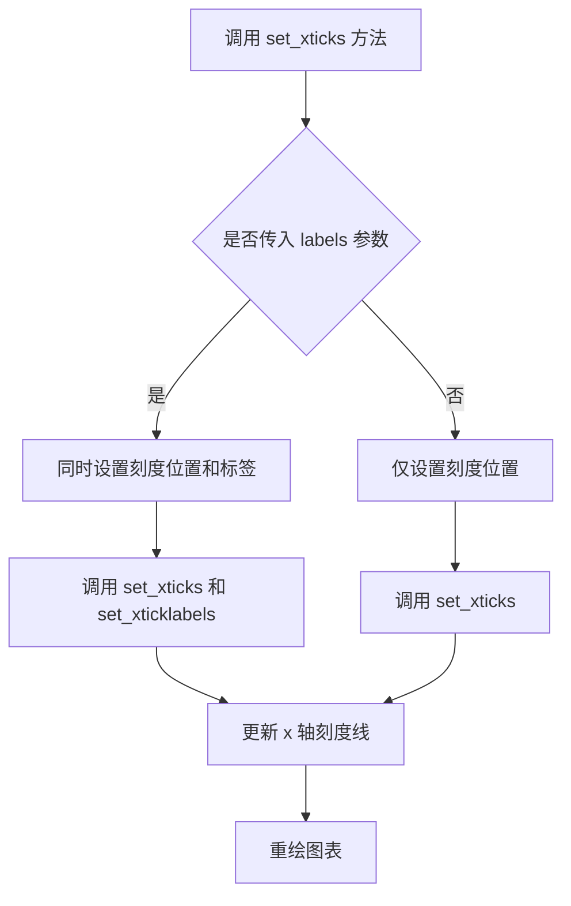

#### 带注释源码

```python
# 示例代码中的调用方式
ax1.set_xticks([0.2, 0.4, 0.6, 0.8, 1.],
               labels=["Jan\n2009", "Feb\n2009", "Mar\n2009", "Apr\n2009",
                       "May\n2009"])

# 方法签名参考（matplotlib 内部实现）
# def set_xticks(self, ticks, labels=None, *, minor=False):
#     """
#     设置 x 轴的刻度位置
#     
#     参数:
#         ticks: 刻度位置数组
#         labels: 可选的刻度标签列表
#         minor: 是否设置次要刻度
#     """
#     
#     # 将刻度位置转换为数组
#     ticks = np.asarray(ticks)
#     
#     # 设置主要或次要刻度
#     if minor:
#         self.xaxis.set_minor_locator(ticker.FixedLocator(ticks))
#     else:
#         self.xaxis.set_major_locator(ticker.FixedLocator(ticks))
#     
#     # 如果提供了标签，则设置刻度标签
#     if labels is not None:
#         self.set_xticklabels(labels, minor=minor)
#     
#     return ticks
```


### `ax1.axhline` (或 `Axes.axhline`)

该方法用于在坐标轴（Axes）上绘制一条水平线，通过指定 y 坐标位置以及可选的 x 范围、颜色、线型等参数，在图表中添加参考线或装饰元素。

参数：

- `y`：`float`，水平线的 y 坐标值，默认值为 0.0。
- `xmin`：`float`，线条起始的相对位置（0 到 1 之间），默认值为 0。
- `xmax`：`float`，线条结束的相对位置（0 到 1 之间），默认值为 1。
- `**kwargs`：可选关键字参数，用于设置线条属性，如 `color`（颜色）、`linestyle`（线型）、`linewidth`（线宽）等。

返回值：`matplotlib.lines.Line2D`，返回创建的水平线对象，可用于进一步定制或获取线条信息。

#### 流程图

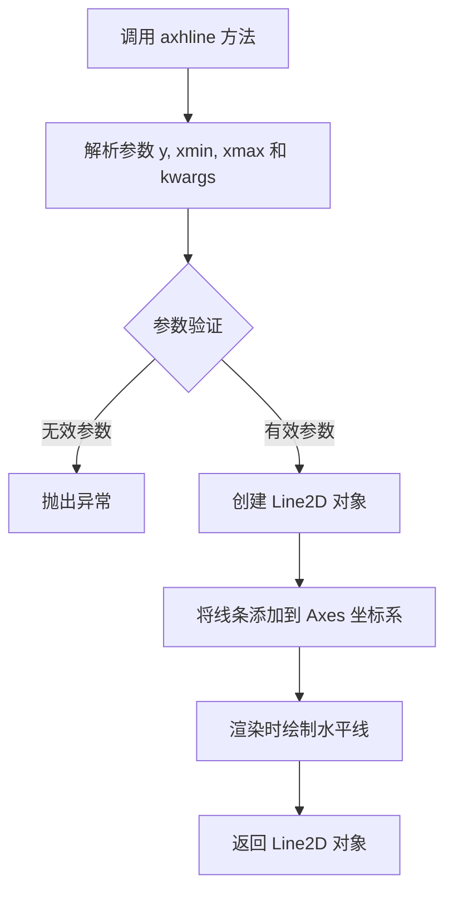

#### 带注释源码

```python
# 在代码中，ax1 是通过 plt.subplots 创建的 Axes 对象
# 调用 axhline 方法绘制一条水平线
ax1.axhline(0.4)  # 在 y=0.4 的位置绘制水平线，默认 x 范围为 0 到 1
# 等效于 ax1.axhline(y=0.4, xmin=0, xmax=1)，可添加更多参数如颜色、线型等
```


### `ax1.set_title`

设置子图（Axes）的标题，用于在图表的顶部显示文本标题。

参数：

- `label`：`str`，要设置的标题文本内容
- `fontdict`：可选参数，`dict`，用于控制标题样式的字典（如 fontsize、fontweight 等）
- `loc`：可选参数，`str`，标题对齐方式（'center'、'left'、'right'）
- `pad`：可选参数，`float`，标题与图表顶部的间距
- `y`：可选参数，`float`，标题的垂直位置（相对于 Axes 顶部）
- `**kwargs`：其他关键字参数，用于传递给 Text 对象

返回值：`Text`，返回创建的标题文本对象

#### 流程图

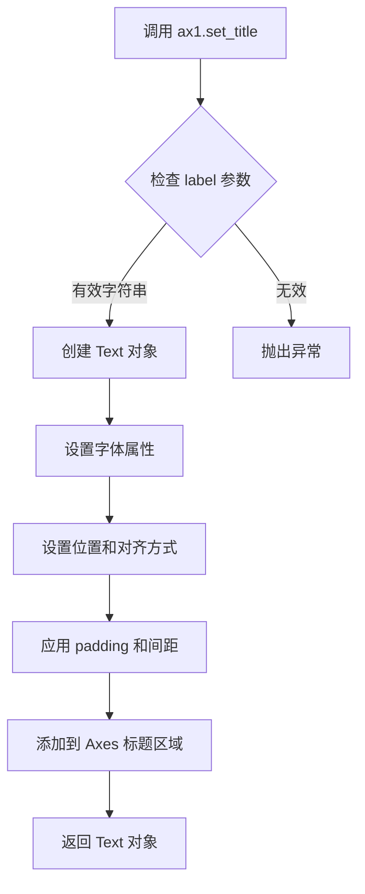

#### 带注释源码

```python
# 示例代码中的实际调用
ax1.set_title("test line spacing for multiline text")

# matplotlib.axes.Axes.set_title 方法的典型实现逻辑：
def set_title(self, label, fontdict=None, loc=None, pad=None, **kwargs):
    """
    Set a title for the Axes.
    
    参数:
        label: str - 标题文本内容
        fontdict: dict - 字体样式字典，可选
        loc: str - 对齐方式，可选 ('center', 'left', 'right')
        pad: float - 标题与 Axes 顶部的间距，可选
        **kwargs: 其他 Text 属性（如 fontsize, fontweight, color 等）
    
    返回:
        Text: 返回创建的标题文本对象
    """
    # 1. 验证 label 参数是否为有效字符串
    # 2. 如果提供了 fontdict，将其应用到标题样式
    # 3. 设置标题的水平对齐方式（loc 参数）
    # 4. 计算并应用标题的垂直位置（考虑 pad 参数）
    # 5. 创建 Text 对象并配置各种属性
    # 6. 将标题添加到 Axes 的标题容器中
    # 7. 返回创建的 Text 对象供后续操作（如修改样式）
```


### `Figure.subplots_adjust`

该方法是matplotlib库中Figure类的成员函数，用于调整图形中子图的布局参数，包括子图与图形边界之间的距离以及子图之间的间距，从而实现对子图位置和大小的精细控制。

参数：

- `left`：`float`（可选），子图区域左侧边界，默认为0.125
- `right`：`float`（可选），子图区域右侧边界，默认为0.9
- `bottom`：`float`（可选），子图区域底部边界，默认为0.11
- `top`：`float`（可选），子图区域顶部边界，默认为0.88
- `wspace`：`float`（可选），子图之间的水平间距，默认为0.2
- `hspace`：`float`（可选），子图之间的垂直间距，默认为0.2

返回值：`None`，该方法直接修改图形对象的布局属性，不返回任何值

#### 流程图

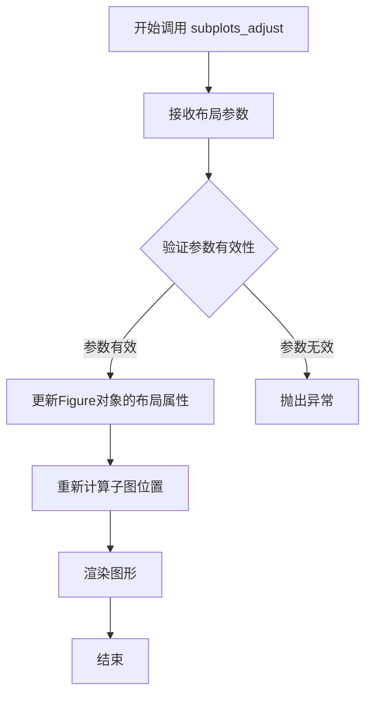

#### 带注释源码

```python
# 在给定的代码示例中调用方式：
fig.subplots_adjust(bottom=0.25, top=0.75)

# 完整的方法签名（参考matplotlib官方文档）：
# Figure.subplots_adjust(left=None, right=None, bottom=None, top=None, 
#                        wspace=None, hspace=None)

# 参数说明：
# - left: 子图区域左侧边界（0.0-1.0之间的浮点数）
# - right: 子图区域右侧边界（0.0-1.0之间的浮点数）  
# - bottom: 子图区域底部边界（0.0-1.0之间的浮点数）
# - top: 子图区域顶部边界（0.0-1.0之间的浮点数）
# - wspace: 子图之间的水平间距（相对于子图宽度的比例）
# - hspace: 子图之间的垂直间距（相对于子图高度的比例）

# 示例代码中：
# - bottom=0.25 表示子图底部距离图形底部25%的距离
# - top=0.75 表示子图顶部距离图形底部75%的距离
# 这意味着子图在垂直方向上占据25%-75%的空间
```


### `plt.show`

`plt.show` 是 Matplotlib 库中的顶层函数，用于显示当前所有打开的图形窗口，并进入事件循环。在本代码中，它负责将之前通过 `plt.subplots()` 创建的包含两个子图的图形渲染并展示给用户。

参数：此函数无参数。

返回值：`None`，无返回值。该函数的主要作用是触发图形的渲染和显示，而非返回数据。

#### 流程图

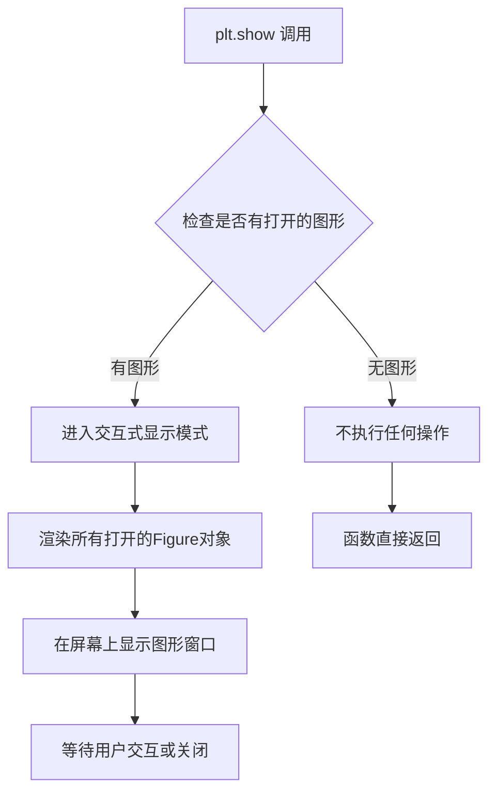

#### 带注释源码

```python
# plt.show() 函数调用
# 位于代码的最后一行，负责显示之前创建的所有图形
plt.show()
```


## 关键组件


### matplotlib.pyplot

Python绘图库，提供创建图形、坐标轴、文本等可视化元素的接口

### numpy

Python数值计算库，用于生成数组数据

### fig, (ax0, ax1)

创建包含两个子图的图形对象，ax0为左图，ax1为右图

### ax0子图（折线图+多行文本）

左侧子图，包含折线图和多行文本标注，支持换行和多行对齐

### ax1子图（多行文本标签）

右侧子图，包含带有多行文本标签的刻度线和水平参考线

### multialignment参数

控制多行文本的对齐方式，支持'left'、'center'、'right'三种模式

### 文本旋转功能

通过rotation参数实现文本45度旋转展示

### bbox参数

用于设置文本框样式，fc="none"设置透明背景

### set_xticks与labels

设置x轴刻度位置和对应的多行文本标签

### fig.subplots_adjust

调整子图布局，bottom=0.25设置底部边距，top=0.75设置顶部边距


## 问题及建议


### 已知问题

-   **无函数封装**：所有代码以脚本形式直接执行，未封装为可复用的函数，导致难以在其他项目中复用和测试
-   **硬编码值泛滥**：坐标值（如0.29, 0.34, 0.95）、字体大小（18）、标签文本等均为硬编码，缺乏配置管理
-   **重复代码**：ax1的三次text调用结构高度相似，仅参数不同，未提取为循环或函数
-   **缺少类型注解**：Python代码未使用类型提示，降低了代码的可读性和静态分析能力
-   **无错误处理**：缺少对matplotlib后端、内存限制、渲染异常等的捕获和处理
-   **文档缺失**：无docstring说明功能、目的或使用场景
-   **魔法数字**：坐标位置（0.2, 0.4, 0.6等）缺乏解释，可读性差

### 优化建议

-   **封装为函数**：将绘图逻辑封装为函数，接受数据、配置等参数，提高复用性
-   **配置字典**：使用配置字典或 dataclass 集中管理颜色、字体、坐标等参数
-   **消除重复**：使用循环或列表推导式生成重复的text调用，配合数据驱动方式
-   **添加类型注解**：为函数参数和返回值添加类型提示
-   **增加文档**：为函数和模块添加docstring，说明功能、参数和返回值
-   **提取常量**：将魔法数字定义为具名常量（如TICK_POSITIONS, TEXT_COORDINATES等）
-   **错误处理**：添加try-except块处理渲染异常，考虑后端兼容性
-   **配置化设计**：将子图数量、布局参数等提取为可配置选项

## 其它


### 设计目标与约束

该代码是一个演示matplotlib多行文本(multiline text)渲染功能的示例程序。设计目标包括：
1. 展示如何在matplotlib中创建包含换行符的多行文本标签
2. 演示不同文本对齐方式(multialignment)的应用场景
3. 验证多行文本在坐标轴标签、标题、任意位置文本中的渲染效果
4. 展示包含LaTeX数学表达式的多行文本处理

主要约束：
- 依赖matplotlib和numpy两个外部库
- 需要GUI后端支持图形显示
- 文本渲染效果可能因字体和后端不同而略有差异

### 错误处理与异常设计

该代码采用简单的异常处理模式：
1. **ImportError处理**：当matplotlib或numpy未安装时，会抛出ImportError并终止程序
2. **图形显示异常**：plt.show()在无图形后端环境下会失败
3. **参数校验异常**：当参数类型不正确时（如ha参数传入无效值），matplotlib会忽略无效值并使用默认值

建议改进：
- 添加try-except块捕获图形显示异常
- 对关键参数进行预校验
- 添加环境检查提示信息

### 数据流与状态机

该代码的数据流向如下：
1. **初始化阶段**：plt.subplots()创建Figure和Axes对象
2. **配置阶段**：通过set_xlabel、set_ylabel、set_title等设置轴属性
3. **绘制阶段**：通过plot、text、axhline等方法绘制图形元素
4. **渲染阶段**：plt.show()调用底层渲染引擎显示图形

状态机描述：
- IDLE：Figure对象已创建但未添加内容
- CONFIGURING：正在设置轴属性和文本样式
- RENDERING：图形正在渲染中
- DISPLAYING：图形窗口已显示

### 外部依赖与接口契约

外部依赖：
1. **matplotlib.pyplot**：图形创建和显示
   - plt.subplots()：创建子图
   - plt.show()：显示图形
   
2. **numpy**：数值计算
   - np.arange()：生成数组

接口契约：
- plt.subplots()返回(Figure, Axes或Axes数组)元组
- Axes对象的text()方法返回Text对象
- 所有set_*方法返回None或调用对象本身（支持链式调用）

### 性能考量

该代码性能特点：
1. **创建开销**：plt.subplots()创建两个子图，有一定初始化开销
2. **渲染开销**：多行文本渲染涉及文本换行计算，比单行文本更耗时
3. **内存占用**：Figure对象会占用一定内存，plt.show()后释放

优化建议：
- 静态参数可预先计算
- 大量文本时可考虑使用缓存
- 避免频繁的Figure创建和销毁

### 配置与参数说明

关键参数配置：
1. **figsize=(7, 4)**：图形大小为7x4英寸
2. **ncols=2**：创建2列子图
3. **rotation=45**：文本旋转45度
4. **multialignment='center'`：多行文本居中对齐
5. **va和ha**：分别控制垂直和水平对齐方式
6. **bbox=dict(fc="none")**：文本边框设置为无填充

参数默认值：
- 默认字体大小由rcParams控制
- 默认字体取决于系统配置

### 使用示例与用例

主要使用场景：
1. **数据可视化报告**：用于创建包含多行标签的专业图表
2. **科学论文图表**：支持LaTeX数学表达式和换行标签
3. **Dashboard开发**：复杂文本布局的信息展示

扩展用例：
- 将输出保存为图片文件（savefig）
- 创建动态更新的动画
- 结合pandas处理数据后可视化

### 扩展性与可维护性

当前代码的问题：
1. 硬编码的数值和位置，缺乏灵活性
2. 重复的文本设置代码可以抽象
3. 缺乏配置接口，难以定制

可扩展性设计：
- 将文本配置提取为配置字典
- 创建辅助函数简化文本添加过程
- 考虑面向对象的封装方式

### 兼容性信息

版本要求：
- Python 3.x
- matplotlib 3.x（推荐）
- numpy 1.x（推荐）

平台兼容性：
- Windows、Linux、macOS均可运行
- 需要图形后端（Qt、TkAgg、 Agg等）


    