# `matplotlib\galleries\examples\text_labels_and_annotations\placing_text_boxes.py` 详细设计文档

This code generates a histogram of a normally distributed random variable and places a text box with statistical information (mean, median, standard deviation) in the upper left corner of the plot.

## 整体流程

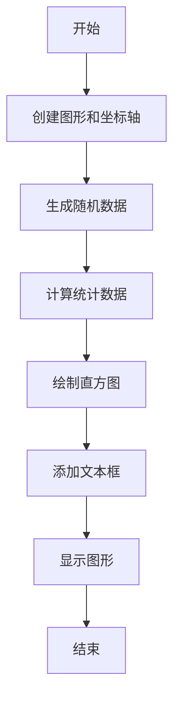

## 类结构

```
matplotlib.pyplot (全局模块)
├── np (全局模块)
│   ├── random (全局模块)
│   └── random.seed
└── fig, ax = plt.subplots()
```

## 全局变量及字段


### `np.random.seed(19680801)`
    
Sets the seed for numpy's random number generator to ensure reproducibility.

类型：`function call`
    


### `fig`
    
The main figure object where all the plot elements are drawn.

类型：`matplotlib.figure.Figure`
    


### `ax`
    
The axes object where the histogram is drawn.

类型：`matplotlib.axes._subplots.AxesSubplot`
    


### `x`
    
The random data array used for plotting the histogram.

类型：`numpy.ndarray`
    


### `mu`
    
The mean of the data array x.

类型：`float`
    


### `median`
    
The median of the data array x.

类型：`float`
    


### `sigma`
    
The standard deviation of the data array x.

类型：`float`
    


### `textstr`
    
The string containing the statistical information to be displayed in the text box.

类型：`str`
    


### `props`
    
The dictionary containing properties for the text box's bounding box style and appearance.

类型：`dict`
    


### `matplotlib.pyplot.fig`
    
The main figure object where all the plot elements are drawn.

类型：`matplotlib.figure.Figure`
    


### `matplotlib.pyplot.ax`
    
The axes object where the histogram is drawn.

类型：`matplotlib.axes._subplots.AxesSubplot`
    


### `np.random`
    
The random number generator instance provided by numpy.

类型：`numpy.random.Generator`
    


### `np.random.seed`
    
The seed value for initializing the random number generator.

类型：`int`
    
    

## 全局函数及方法


### plt.subplots

`plt.subplots` 是一个用于创建一个或多个子图的函数。

参数：

- `figsize`：`tuple`，指定图形的大小（宽度和高度），默认为 (6, 4)。
- `dpi`：`int`，指定图形的分辨率，默认为 100。
- `facecolor`：`color`，图形的背景颜色，默认为白色。
- `edgecolor`：`color`，图形的边缘颜色，默认为 'none'。
- `frameon`：`bool`，是否显示图形的边框，默认为 True。
- `num`：`int`，子图的数量，默认为 1。
- `gridspec_kw`：`dict`，用于定义网格的参数，默认为 None。
- `constrained_layout`：`bool`，是否启用约束布局，默认为 False。

返回值：`Figure`，包含子图的图形对象。

#### 流程图

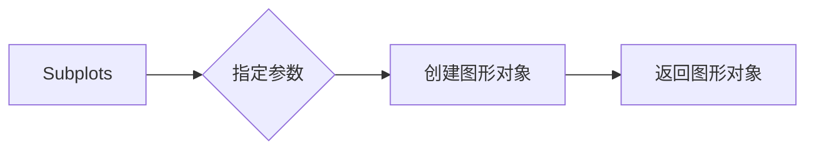

#### 带注释源码

```python
import matplotlib.pyplot as plt

fig, ax = plt.subplots()
```


### np.random.randn

生成具有指定平均值和标准差的正态分布随机样本。

参数：

- `d0, d1, ..., dn`：`int`，指定随机样本的维度。如果只有一个参数，则生成一个具有指定大小的数组。

返回值：`numpy.ndarray`，包含具有指定平均值和标准差的随机样本。

#### 流程图

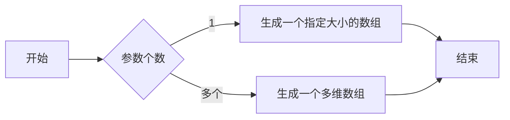

#### 带注释源码

```python
import numpy as np

# 设置随机数种子
np.random.seed(19680801)

# 生成一个包含10000个随机样本的数组，样本来自均值为0，标准差为30的正态分布
x = 30 * np.random.randn(10000)
```


### matplotlib.pyplot.subplots

创建一个图形和一个轴。

参数：

- `figsize`：`tuple`，图形的大小（宽度和高度）。
- `dpi`：`int`，图形的分辨率（每英寸点数）。
- `facecolor`：`color`，图形的背景颜色。
- `num`：`int`，图形的编号。
- `clear`：`bool`，是否清除图形。
- `fig`：`matplotlib.figure.Figure`，如果提供，则使用该图形而不是创建一个新的图形。

返回值：`matplotlib.figure.Figure`，图形对象。
`matplotlib.axes.Axes`，轴对象。

#### 流程图

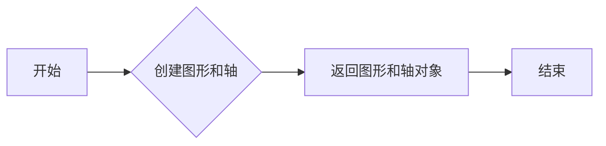

#### 带注释源码

```python
import matplotlib.pyplot as plt

# 创建一个图形和一个轴
fig, ax = plt.subplots()
```


### matplotlib.pyplot.show

显示图形。

参数：

- `block`：`bool`，如果为 `True`，则等待用户关闭图形后继续执行代码。

#### 流程图

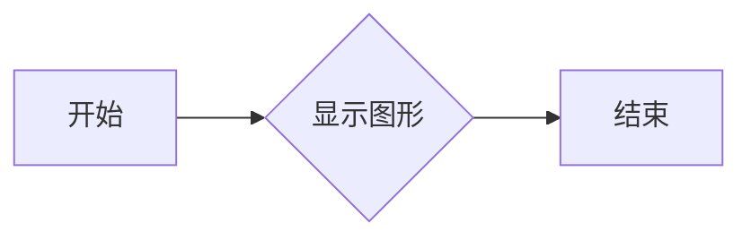

#### 带注释源码

```python
# 显示图形
plt.show()
```


### matplotlib.pyplot.subplots

创建一个图形和一个轴。

参数：

- `figsize`：`tuple`，图形的大小（宽度和高度）。
- `dpi`：`int`，图形的分辨率（每英寸点数）。
- `facecolor`：`color`，图形的背景颜色。
- `num`：`int`，图形的编号。
- `clear`：`bool`，是否清除图形。
- `fig`：`matplotlib.figure.Figure`，如果提供，则使用该图形而不是创建一个新的图形。

返回值：`matplotlib.figure.Figure`，图形对象。
`matplotlib.axes.Axes`，轴对象。

#### 流程图


#### 带注释源码

```python
import matplotlib.pyplot as plt

# 创建一个图形和一个轴
fig, ax = plt.subplots()
```


### matplotlib.pyplot.show

显示图形。

参数：

- `block`：`bool`，如果为 `True`，则等待用户关闭图形后继续执行代码。

#### 流程图


#### 带注释源码

```python
# 显示图形
plt.show()
```


### matplotlib.pyplot.subplots

创建一个图形和一个轴。

参数：

- `figsize`：`tuple`，图形的大小（宽度和高度）。
- `dpi`：`int`，图形的分辨率（每英寸点数）。
- `facecolor`：`color`，图形的背景颜色。
- `num`：`int`，图形的编号。
- `clear`：`bool`，是否清除图形。
- `fig`：`matplotlib.figure.Figure`，如果提供，则使用该图形而不是创建一个新的图形。

返回值：`matplotlib.figure.Figure`，图形对象。
`matplotlib.axes.Axes`，轴对象。

#### 流程图


#### 带注释源码

```python
import matplotlib.pyplot as plt

# 创建一个图形和一个轴
fig, ax = plt.subplots()
```


### matplotlib.pyplot.show

显示图形。

参数：

- `block`：`bool`，如果为 `True`，则等待用户关闭图形后继续执行代码。

#### 流程图


#### 带注释源码

```python
# 显示图形
plt.show()
```


### matplotlib.pyplot.subplots

创建一个图形和一个轴。

参数：

- `figsize`：`tuple`，图形的大小（宽度和高度）。
- `dpi`：`int`，图形的分辨率（每英寸点数）。
- `facecolor`：`color`，图形的背景颜色。
- `num`：`int`，图形的编号。
- `clear`：`bool`，是否清除图形。
- `fig`：`matplotlib.figure.Figure`，如果提供，则使用该图形而不是创建一个新的图形。

返回值：`matplotlib.figure.Figure`，图形对象。
`matplotlib.axes.Axes`，轴对象。

#### 流程图


#### 带注释源码

```python
import matplotlib.pyplot as plt

# 创建一个图形和一个轴
fig, ax = plt.subplots()
```


### matplotlib.pyplot.show

显示图形。

参数：

- `block`：`bool`，如果为 `True`，则等待用户关闭图形后继续执行代码。

#### 流程图


#### 带注释源码

```python
# 显示图形
plt.show()
```


### matplotlib.pyplot.subplots

创建一个图形和一个轴。

参数：

- `figsize`：`tuple`，图形的大小（宽度和高度）。
- `dpi`：`int`，图形的分辨率（每英寸点数）。
- `facecolor`：`color`，图形的背景颜色。
- `num`：`int`，图形的编号。
- `clear`：`bool`，是否清除图形。
- `fig`：`matplotlib.figure.Figure`，如果提供，则使用该图形而不是创建一个新的图形。

返回值：`matplotlib.figure.Figure`，图形对象。
`matplotlib.axes.Axes`，轴对象。

#### 流程图


#### 带注释源码

```python
import matplotlib.pyplot as plt

# 创建一个图形和一个轴
fig, ax = plt.subplots()
```


### matplotlib.pyplot.show

显示图形。

参数：

- `block`：`bool`，如果为 `True`，则等待用户关闭图形后继续执行代码。

#### 流程图


#### 带注释源码

```python
# 显示图形
plt.show()
```


### np.mean

计算输入数组的平均值。

参数：

- `x`：`numpy.ndarray`，输入数组，计算其平均值。

返回值：`float`，输入数组的平均值。

#### 流程图

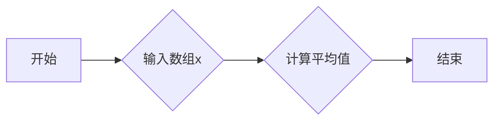

#### 带注释源码

```python
import numpy as np

def np_mean(x):
    """
    计算输入数组的平均值。

    参数：
    - x: numpy.ndarray，输入数组，计算其平均值。

    返回值：
    - float，输入数组的平均值。
    """
    return np.mean(x)
```


### np.median

计算输入数组的中间值。

参数：

- `x`：`numpy.ndarray`，输入数组，必须是一维数组。

返回值：`float`，输入数组的中间值。

#### 流程图

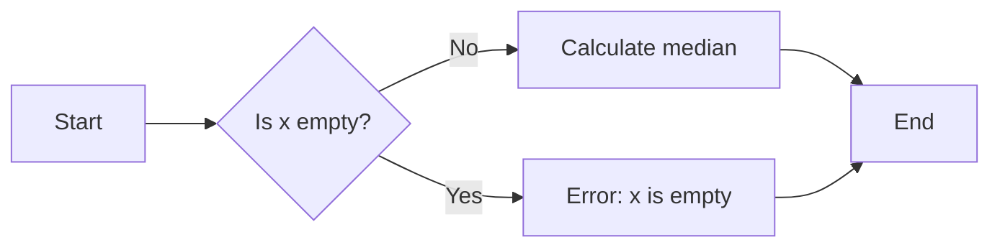

#### 带注释源码

```python
import numpy as np

def median(x):
    # Check if the input array is empty
    if x.size == 0:
        raise ValueError("Input array is empty")
    
    # Calculate the median
    return np.median(x)
```


### np.std

计算输入数组的样本标准差。

参数：

- `x`：`numpy.ndarray`，输入数组，计算标准差的数值。
- `ddof`：`int`，Delta Degrees of Freedom。默认为0，表示使用整个样本的方差计算标准差。如果设置为1，则使用无偏估计（n-1）。

返回值：`float`，输入数组的样本标准差。

#### 流程图

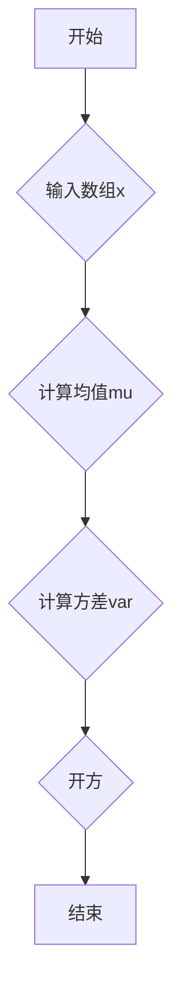

#### 带注释源码

```python
import numpy as np

def np_std(x, ddof=0):
    # 计算均值
    mu = np.mean(x)
    # 计算方差
    var = np.var(x, ddof=ddof)
    # 开方得到标准差
    std = np.sqrt(var)
    return std
```


### ax.hist

该函数用于绘制直方图。

参数：

- `x`：`numpy.ndarray`，输入数据，用于绘制直方图的数据。
- `bins`：`int` 或 `sequence`，可选，直方图的条形数或条形宽度的序列。

返回值：`None`，该函数不返回值，直接在当前轴上绘制直方图。

#### 流程图

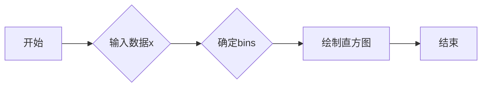

#### 带注释源码

```python
ax.hist(x, 50)
```

在这段代码中，`ax.hist(x, 50)` 调用 `hist` 方法，将 `x` 数据绘制成直方图，其中 `bins=50` 表示直方图有50个条形。


### ax.text

该函数用于在matplotlib的Axes对象上放置文本框。

参数：

- `x`：`float`，文本框在x轴上的位置。
- `y`：`float`，文本框在y轴上的位置。
- `textstr`：`str`，要显示的文本内容。
- `transform`：`matplotlib.transforms.Transform`，用于指定文本的坐标系。
- `fontsize`：`int`，文本的字体大小。
- `verticalalignment`：`str`，垂直对齐方式。
- `bbox`：`dict`，文本框的属性字典。

返回值：`matplotlib.text.Text`，放置的文本对象。

#### 流程图

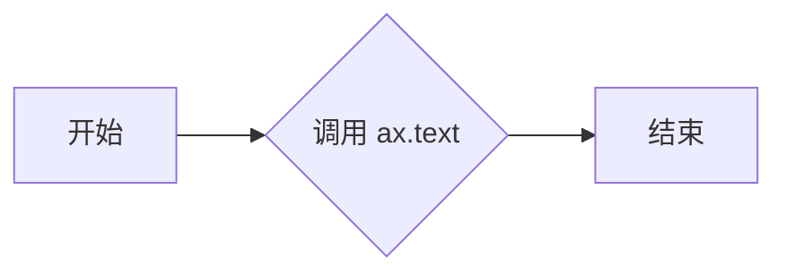

#### 带注释源码

```python
ax.text(0.05, 0.95, textstr, transform=ax.transAxes, fontsize=14,
        verticalalignment='top', bbox=props)
```


### plt.show()

显示当前图形。

参数：

- 无

返回值：无

#### 流程图


#### 带注释源码

```python
"""
Placing text boxes
==================

When decorating Axes with text boxes, two useful tricks are to place the text
in axes coordinates (see :ref:`transforms_tutorial`),
so the text doesn't move around with changes in x or y limits.  You
can also use the ``bbox`` property of text to surround the text with a
`~matplotlib.patches.Patch` instance -- the ``bbox`` keyword argument takes a
dictionary with keys that are Patch properties.
"""

import matplotlib.pyplot as plt
import numpy as np

np.random.seed(19680801)

fig, ax = plt.subplots()
x = 30*np.random.randn(10000)
mu = x.mean()
median = np.median(x)
sigma = x.std()
textstr = '\n'.join((
    r'$\mu=%.2f$' % (mu, ),
    r'$\mathrm{median}=%.2f$' % (median, ),
    r'$\sigma=%.2f$' % (sigma, )))

ax.hist(x, 50)
# these are matplotlib.patch.Patch properties
props = dict(boxstyle='round', facecolor='wheat', alpha=0.5)

# place a text box in upper left in axes coords
ax.text(0.05, 0.95, textstr, transform=ax.transAxes, fontsize=14,
        verticalalignment='top', bbox=props)

plt.show()
```


### plt.subplots()

`subplots` 是 `matplotlib.pyplot` 模块中的一个函数，用于创建一个图形和一个轴（Axes）对象。

参数：

- `figsize`：`tuple`，图形的大小（宽度和高度），默认为 (6, 4)。
- `dpi`：`int`，图形的分辨率，默认为 100。
- `facecolor`：`color`，图形的背景颜色，默认为白色。
- `edgecolor`：`color`，图形的边缘颜色，默认为 'none'。
- `frameon`：`bool`，是否显示图形的边框，默认为 True。
- `num`：`int`，轴的数量，默认为 1。
- `gridspec_kw`：`dict`，用于定义网格的参数，默认为 None。
- `constrained_layout`：`bool`，是否启用约束布局，默认为 False。

返回值：`Figure` 对象和 `Axes` 对象的元组。

返回值描述：`Figure` 对象是图形的容器，`Axes` 对象是图形中的一个轴，用于绘制图形。

#### 流程图

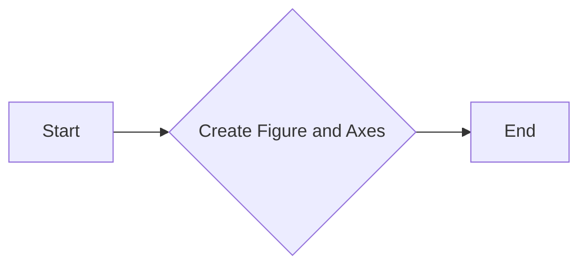

#### 带注释源码

```python
import matplotlib.pyplot as plt

fig, ax = plt.subplots()
# fig: Figure object
# ax: Axes object
```


### plt.show()

显示matplotlib图形。

参数：

- 无

返回值：无

#### 流程图

```mermaid
graph LR
A[开始] --> B[导入matplotlib.pyplot]
B --> C[创建图形和坐标轴]
C --> D[生成随机数据]
D --> E[计算均值、中位数和标准差]
E --> F[创建文本字符串]
F --> G[绘制直方图]
G --> H[设置文本框属性]
H --> I[在坐标轴上放置文本框]
I --> J[显示图形]
J --> K[结束]
```

#### 带注释源码

```python
import matplotlib.pyplot as plt
import numpy as np

np.random.seed(19680801)

fig, ax = plt.subplots()
x = 30*np.random.randn(10000)
mu = x.mean()
median = np.median(x)
sigma = x.std()
textstr = '\n'.join((
    r'$\mu=%.2f$' % (mu, ),
    r'$\mathrm{median}=%.2f$' % (median, ),
    r'$\sigma=%.2f$' % (sigma, )))

ax.hist(x, 50)
# these are matplotlib.patch.Patch properties
props = dict(boxstyle='round', facecolor='wheat', alpha=0.5)

# place a text box in upper left in axes coords
ax.text(0.05, 0.95, textstr, transform=ax.transAxes, fontsize=14,
        verticalalignment='top', bbox=props)

plt.show()
```


### np.random.seed

设置随机数生成器的种子。

参数：

- `seed`：`int`，用于初始化随机数生成器的种子值。

返回值：`None`，没有返回值，只是设置种子。

#### 流程图

```mermaid
graph LR
A[Set Seed] --> B{Is Seed Valid?}
B -- Yes --> C[Initialize Random Number Generator]
B -- No --> D[Error: Invalid Seed]
C --> E[Continue Execution]
```

#### 带注释源码

```python
np.random.seed(19680801)
```

该行代码设置了NumPy随机数生成器的种子为19680801。这意味着每次运行代码时，生成的随机数序列将是相同的，这对于需要可重复结果的科学计算和模拟非常有用。

## 关键组件


### 张量索引

张量索引用于在NumPy数组中定位和访问特定元素。

### 惰性加载

惰性加载是一种编程技术，它延迟对象的初始化，直到实际需要时才进行。

### 反量化支持

反量化支持允许在量化过程中恢复原始数据，以便进行进一步处理。

### 量化策略

量化策略定义了如何将浮点数数据转换为固定点表示，以减少计算资源的使用。


## 问题及建议


### 已知问题

-   **代码复用性低**：代码片段仅用于生成一个特定的直方图和文本框，缺乏通用性，难以在其他图表或分析中复用。
-   **硬编码参数**：例如，随机数生成器的种子、直方图的条数等参数在代码中硬编码，缺乏灵活性。
-   **缺乏注释**：代码中缺乏注释，难以理解代码的意图和实现细节。

### 优化建议

-   **封装成函数**：将代码封装成函数，提高代码的复用性，并允许用户自定义参数，如随机数种子、直方图的条数等。
-   **使用配置文件**：对于一些可能变化的参数，如图表的标题、颜色、字体等，可以使用配置文件来管理，提高代码的可配置性。
-   **添加文档和注释**：为代码添加详细的文档和注释，提高代码的可读性和可维护性。

## 其它


### 设计目标与约束

- 设计目标：实现一个能够根据给定数据生成文本框并显示在matplotlib图形上的功能。
- 约束条件：使用matplotlib库进行图形绘制，使用numpy库进行数据操作。

### 错误处理与异常设计

- 错误处理：在代码中未发现明显的错误处理机制。
- 异常设计：未设计特定的异常处理机制，但应确保代码的健壮性，避免因外部因素导致的异常。

### 数据流与状态机

- 数据流：数据从numpy库生成，经过处理生成文本，最后通过matplotlib库绘制到图形上。
- 状态机：代码中没有明显的状态转换过程。

### 外部依赖与接口契约

- 外部依赖：matplotlib库和numpy库。
- 接口契约：matplotlib库的Axes类和text方法，numpy库的random和statistics模块。


    