# `matplotlib\galleries\examples\text_labels_and_annotations\rainbow_text.py` 详细设计文档

Concatenates multiple text objects with different properties on a matplotlib plot.

## 整体流程

```mermaid
graph TD
    A[Start] --> B[Create matplotlib figure and axis]
    B --> C[Create first text object with specific properties]
    C --> D[Create subsequent text objects using annotate() with relative positioning]
    D --> E[Display the plot]
    E --> F[End]
```

## 类结构

```
matplotlib.pyplot (module)
├── figure()
│   └── add_subplot()
│       └── text()
│           └── annotate()
```

## 全局变量及字段


### `plt`
    
The main module for matplotlib, providing the plotting functions and classes.

类型：`matplotlib.pyplot`
    


### `ax`
    
An axes instance in which to plot the line.

类型：`matplotlib.axes._subplots.AxesSubplot`
    


### `text`
    
A text annotation that can be placed at an arbitrary location on the axes.

类型：`matplotlib.text.Text`
    


### `{'name': 'matplotlib.pyplot', 'fields': ['rcParams', 'figure', 'gcf', 'pyplot'], 'methods': ['figure', 'add_subplot', 'text', 'annotate', 'show']}.rcParams`
    
The rcParams dictionary contains all the parameters that can be set in matplotlib.

类型：`matplotlib.rcParams.RcParams`
    


### `{'name': 'matplotlib.pyplot', 'fields': ['rcParams', 'figure', 'gcf', 'pyplot'], 'methods': ['figure', 'add_subplot', 'text', 'annotate', 'show']}.figure`
    
The Figure class is the top-level container for all plot elements.

类型：`matplotlib.figure.Figure`
    


### `{'name': 'matplotlib.pyplot', 'fields': ['rcParams', 'figure', 'gcf', 'pyplot'], 'methods': ['figure', 'add_subplot', 'text', 'annotate', 'show']}.gcf`
    
The gcf() function returns the current figure.

类型：`matplotlib.figure.Figure`
    


### `{'name': 'matplotlib.pyplot', 'fields': ['rcParams', 'figure', 'gcf', 'pyplot'], 'methods': ['figure', 'add_subplot', 'text', 'annotate', 'show']}.pyplot`
    
The pyplot module provides a MATLAB-like interface to matplotlib.

类型：`matplotlib.pyplot`
    


### `matplotlib.pyplot.rcParams`
    
The rcParams dictionary contains all the parameters that can be set in matplotlib.

类型：`matplotlib.rcParams.RcParams`
    


### `matplotlib.pyplot.figure`
    
The Figure class is the top-level container for all plot elements.

类型：`matplotlib.figure.Figure`
    


### `matplotlib.pyplot.gcf`
    
The gcf() function returns the current figure.

类型：`matplotlib.figure.Figure`
    


### `matplotlib.pyplot.pyplot`
    
The pyplot module provides a MATLAB-like interface to matplotlib.

类型：`matplotlib.pyplot`
    
    

## 全局函数及方法


### plt.rcParams

设置matplotlib的默认参数。

参数：

- `font.size`：`int`，设置字体大小。

返回值：无

#### 流程图


#### 带注释源码

```
plt.rcParams["font.size"] = 20
```

### plt.figure()

创建一个新的图形。

参数：无

返回值：`Figure`对象

#### 流程图

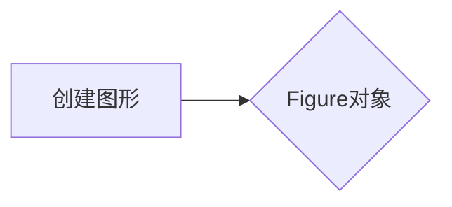

#### 带注释源码

```
plt.figure()
```

### Figure().add_subplot()

添加一个子图到图形。

参数：无

返回值：`AxesSubplot`对象

#### 流程图

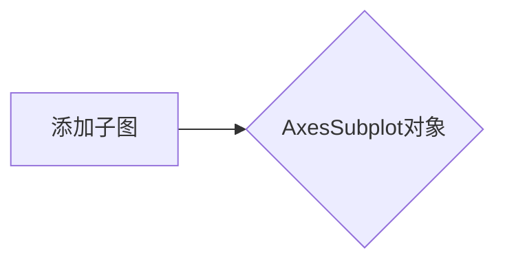

#### 带注释源码

```
ax = plt.figure().add_subplot(xticks=[], yticks=[])
```

### ax.text()

在子图上添加文本。

参数：

- `x`：`float`，文本的x坐标。
- `y`：`float`，文本的y坐标。
- `s`：`str`，要显示的文本。
- `color`：`str`，文本颜色。

返回值：`Text`对象

#### 流程图

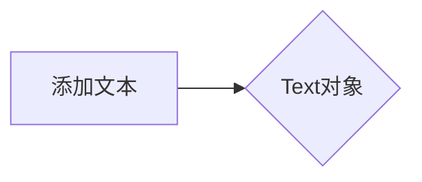

#### 带注释源码

```
text = ax.text(.1, .5, "Matplotlib", color="red")
```

### ax.annotate()

在子图上添加注释。

参数：

- `s`：`str`，要显示的文本。
- `xycoords`：`str`，相对于哪个对象的位置。
- `xy`：`tuple`，相对于`xycoords`对象的坐标。
- `verticalalignment`：`str`，垂直对齐方式。
- `color`：`str`，文本颜色。
- `weight`：`str`，文本粗细。

返回值：`Text`对象

#### 流程图

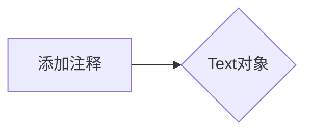

#### 带注释源码

```
text = ax.annotate(
    " says,", xycoords=text, xy=(1, 0), verticalalignment="bottom",
    color="gold", weight="bold")  # custom properties
```

### plt.show()

显示图形。

参数：无

返回值：无

#### 流程图

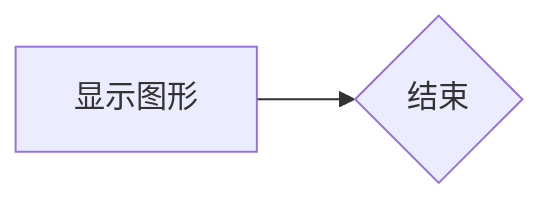

#### 带注释源码

```
plt.show()
```


### plt.rcParams['font.size'] = 20

设置matplotlib默认字体大小。

参数：

- `r`：`str`，表示要设置的配置项。
- `20`：`int`，表示字体大小。

返回值：无

#### 流程图

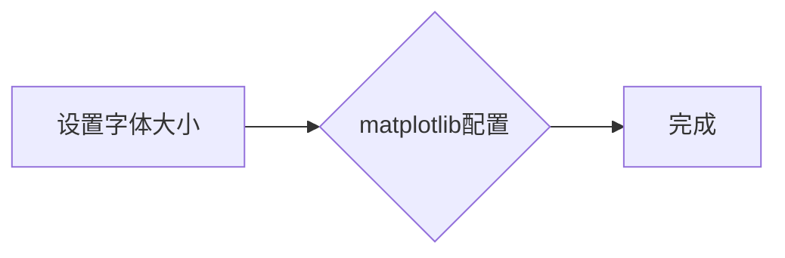

#### 带注释源码

```
plt.rcParams["font.size"] = 20
```


### plt.figure().add_subplot(xticks=[], yticks=[])

该函数创建一个新的子图，并设置其x轴和y轴的刻度标记为空。

参数：

- 无

返回值：`AxesSubplot`，一个matplotlib的子图对象，用于绘制图形。

#### 流程图

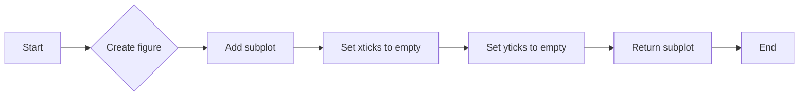

#### 带注释源码

```
ax = plt.figure().add_subplot(xticks=[], yticks=[])
```


### ax.text()

该函数用于在matplotlib的Axes对象上创建一个文本对象。

参数：

- `.1`：`float`，文本对象的x坐标。
- `.5`：`float`，文本对象的y坐标。
- `"Matplotlib"`：`str`，要显示的文本内容。
- `color="red"`：`str`，文本的颜色。

返回值：`Text`对象，表示创建的文本。

#### 流程图

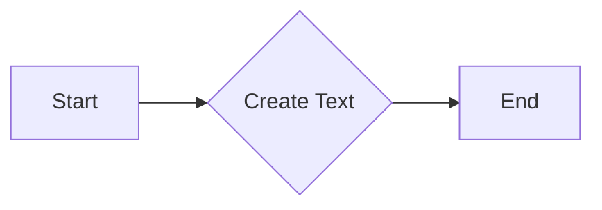

#### 带注释源码

```python
text = ax.text(.1, .5, "Matplotlib", color="red")
```


### ax.annotate()

该函数用于在matplotlib的Axes对象上添加一个文本注释，并允许指定注释的位置和样式。

参数：

- `xycoords`：`str`，指定注释位置的参考坐标系，可以是'data'、'axes'或另一个文本对象的名称。
- `xy`：`tuple`，指定注释的相对或绝对位置，如果`xycoords`是'axes'，则`(x, y)`是相对于Axes的坐标；如果`xycoords`是'data'，则`(x, y)`是相对于数据坐标的坐标。
- `verticalalignment`：`str`，指定文本的垂直对齐方式，可以是'bottom'、'middle'、'top'、'center'或'baseline'。
- `color`：`str`，指定文本的颜色。
- `weight`：`str`，指定文本的粗细，可以是'normal'、'bold'、'light'、'ultralight'、'heavy'或'ultrabold'。

返回值：`matplotlib.text.Text`，返回创建的文本对象。

#### 流程图

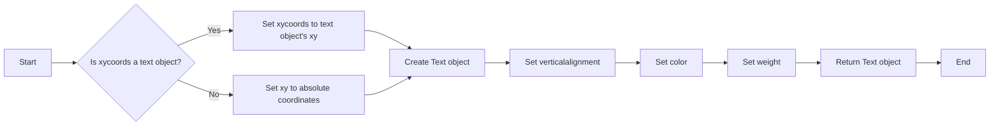

#### 带注释源码

```python
text = ax.annotate(
    " says,", xycoords=text, xy=(1, 0), verticalalignment="bottom",
    color="gold", weight="bold")  # custom properties
```


### ax.annotate()

该函数用于在matplotlib的Axes对象上添加一个文本注释。

参数：

- `s`：`str`，要添加的文本字符串。
- `xycoords`：`str`，指定`xy`坐标的参考对象，可以是'data'、'axes'或另一个Text对象。
- `xy`：`tuple`，指定文本的坐标，相对于参考对象。
- `verticalalignment`：`str`，指定文本的垂直对齐方式，可以是'bottom'、'middle'、'top'等。
- `color`：`str`，指定文本的颜色。
- `style`：`str`，指定文本的样式，可以是'normal'、'italic'、'oblique'等。

返回值：`Text`对象，表示添加的文本注释。

#### 流程图

```mermaid
graph LR
A[Start] --> B{Call ax.annotate()}
B --> C[Create Text Annotation]
C --> D[End]
```

#### 带注释源码

```python
text = ax.annotate(
    " hello", xycoords=text, xy=(1, 0), verticalalignment="bottom",
    color="green", style="italic")  # custom properties
```


### ax.annotate()

该函数用于在matplotlib的Axes对象上添加一个文本注释。

参数：

- `xycoords`：`str`，指定注释的坐标系统，这里使用的是前一个文本对象的坐标系统。
- `xy`：`tuple`，指定注释文本的相对位置，这里设置为(1, 0)，表示注释文本的左下角位于前一个文本对象的右下角。
- `verticalalignment`：`str`，指定文本的垂直对齐方式，这里设置为"bottom"，表示文本底部对齐。
- `color`：`str`，指定文本的颜色，这里设置为"blue"。
- `family`：`str`，指定文本的字体族，这里设置为"serif"。

返回值：`matplotlib.text.Text`，返回创建的文本对象。

#### 流程图

```mermaid
graph LR
A[Start] --> B{Call ax.annotate()}
B --> C[Create Text Object]
C --> D[End]
```

#### 带注释源码

```python
text = ax.annotate(
    " world!", xycoords=text, xy=(1, 0), verticalalignment="bottom",
    color="blue", family="serif")
```


### plt.show()

显示当前图形的窗口。

参数：

- 无

返回值：无

#### 流程图

```mermaid
graph LR
A[开始] --> B{调用plt.show()}
B --> C[结束]
```

#### 带注释源码

```
plt.show()
```


### matplotlib.pyplot

matplotlib.pyplot 是一个用于创建静态、交互式和动画可视化图表的库。

#### plt.rcParams

`plt.rcParams["font.size"] = 20`

- `名称`：plt.rcParams
- `类型`：字典
- `描述`：matplotlib 的配置字典，用于设置全局参数。

#### ax

`ax = plt.figure().add_subplot(xticks=[], yticks=[])`

- `名称`：ax
- `类型`：matplotlib.axes._subplots.AxesSubplot
- `描述`：创建一个子图，用于绘制图形元素。

#### text

`text = ax.text(.1, .5, "Matplotlib", color="red")`

- `名称`：text
- `类型`：matplotlib.text.Text
- `描述`：在轴上创建一个文本元素。

#### plt

`plt.figure().add_subplot(xticks=[], yticks=[])`

- `名称`：plt
- `类型`：matplotlib.pyplot
- `描述`：matplotlib 的主模块，用于创建图形和子图。

#### plt.rcParams

`plt.rcParams["font.size"] = 20`

- `名称`：plt.rcParams
- `类型`：字典
- `描述`：matplotlib 的配置字典，用于设置全局参数。

#### plt.figure

`plt.figure().add_subplot(xticks=[], yticks=[])`

- `名称`：plt.figure
- `类型`：matplotlib.figure.Figure
- `描述`：创建一个新的图形。

#### plt.show

`plt.show()`

- `名称`：plt.show
- `类型`：函数
- `描述`：显示当前图形的窗口。


### 关键组件信息

- `matplotlib.pyplot`：用于创建和显示图形。
- `matplotlib.figure.Figure`：创建一个新的图形。
- `matplotlib.axes._subplots.AxesSubplot`：创建一个子图，用于绘制图形元素。
- `matplotlib.text.Text`：在轴上创建一个文本元素。


### 潜在的技术债务或优化空间

- 代码中使用了硬编码的坐标和属性，这可能会降低代码的可维护性和可扩展性。
- 可以考虑使用函数来创建文本元素，以便更好地重用代码。
- 可以考虑使用面向对象的方法来组织代码，以便更好地管理图形元素。


### 设计目标与约束

- 设计目标是创建一个简单的文本叠加示例。
- 约束包括使用 matplotlib 库来创建图形。


### 错误处理与异常设计

- 代码中没有显式的错误处理或异常设计。
- 可以考虑添加异常处理来捕获和处理可能发生的错误。


### 数据流与状态机

- 数据流：从创建图形到显示图形。
- 状态机：没有明确的状态机，因为代码是线性执行的。


### 外部依赖与接口契约

- 外部依赖：matplotlib 库。
- 接口契约：matplotlib 库提供的 API。


### plt.figure()

该函数用于创建一个新的matplotlib图形和轴。

参数：

- 无

返回值：`AxesSubplot`，一个matplotlib轴对象，用于绘制图形。

#### 流程图

```mermaid
graph LR
A[Start] --> B{plt.figure()}
B --> C[End]
```

#### 带注释源码

```python
ax = plt.figure().add_subplot(xticks=[], yticks=[])
```


### ax.text()

该函数用于在轴上创建一个文本对象。

参数：

- `.1`：`float`，文本的x坐标。
- `.5`：`float`，文本的y坐标。
- `"Matplotlib"`：`str`，要显示的文本。
- `color="red"`：`str`，文本的颜色。

返回值：`Text`，一个matplotlib文本对象。

#### 流程图

```mermaid
graph LR
A[Start] --> B{ax.text(.1, .5, "Matplotlib", color="red")}
B --> C[End]
```

#### 带注释源码

```python
text = ax.text(.1, .5, "Matplotlib", color="red")
```


### ax.annotate()

该函数用于在轴上创建一个注释文本对象。

参数：

- `" says,"`：`str`，要显示的文本。
- `xycoords=text`：`Text`，相对于哪个文本对象进行定位。
- `xy=(1, 0)`：`tuple`，相对于参考对象的x和y偏移。
- `verticalalignment="bottom"`：`str`，垂直对齐方式。
- `color="gold"`：`str`，文本的颜色。
- `weight="bold"`：`str`，文本的粗细。

返回值：`Text`，一个matplotlib文本对象。

#### 流程图

```mermaid
graph LR
A[Start] --> B{ax.annotate(" says,", xycoords=text, xy=(1, 0), verticalalignment="bottom", color="gold", weight="bold")}
B --> C[End]
```

#### 带注释源码

```python
text = ax.annotate(
    " says,", xycoords=text, xy=(1, 0), verticalalignment="bottom",
    color="gold", weight="bold")
```


### plt.show()

该函数用于显示当前的图形。

参数：

- 无

返回值：无

#### 流程图

```mermaid
graph LR
A[Start] --> B{plt.show()}
B --> C[End]
```

#### 带注释源码

```python
plt.show()
```


### 关键组件信息

- `plt.figure()`：创建一个新的图形和轴。
- `ax.text()`：在轴上创建一个文本对象。
- `ax.annotate()`：在轴上创建一个注释文本对象。
- `plt.show()`：显示当前的图形。


### 潜在的技术债务或优化空间

- 代码中使用了硬编码的坐标和颜色值，这可能会降低代码的可维护性。
- 可以考虑使用函数参数来允许用户自定义文本的属性，而不是硬编码它们。
- 代码中没有使用异常处理，如果出现错误，可能会导致程序崩溃。


### 设计目标与约束

- 设计目标是创建一个简单的文本叠加示例。
- 约束是使用matplotlib库来创建图形和文本。


### 错误处理与异常设计

- 代码中没有使用异常处理。
- 建议在关键操作中添加异常处理，以增强代码的健壮性。


### 数据流与状态机

- 数据流从创建图形和轴开始，然后是文本对象，最后是显示图形。
- 状态机不适用，因为代码没有涉及状态转换。


### 外部依赖与接口契约

- 代码依赖于matplotlib库。
- 接口契约由matplotlib库定义，包括图形、轴和文本对象的创建和属性设置。


### `add_subplot`

`add_subplot` 方法用于向 Matplotlib 图形中添加一个子图。

参数：

- `n`: `int`，指定子图的编号。
- `sharex`: `bool`，指定是否共享 x 轴。
- `sharey`: `bool`，指定是否共享 y 轴。
- `rowspan`: `int`，指定子图在行方向上的跨度。
- `colspan`: `int`，指定子图在列方向上的跨度。
- `row`: `int`，指定子图所在的行。
- `col`: `int`，指定子图所在的列。
- `polar`: `bool`，指定是否创建极坐标图。
- `projection`: `str`，指定子图的投影类型。

返回值：`AxesSubplot`，表示添加的子图对象。

#### 流程图

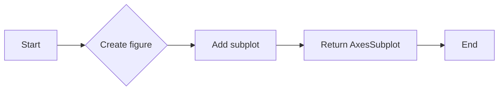

#### 带注释源码

```python
import matplotlib.pyplot as plt

plt.rcParams["font.size"] = 20
ax = plt.figure().add_subplot(xticks=[], yticks=[])
```


### matplotlib.pyplot.text

matplotlib.pyplot.text is a method used to create text annotations on a plot.

参数：

- `x`：`float`，指定文本的x坐标。
- `y`：`float`，指定文本的y坐标。
- `s`：`str`，要显示的文本字符串。
- `fontdict`：`dict`，指定文本的字体属性，如字体大小、颜色、样式等。
- `transform`：`Transform`，指定文本的坐标系统，默认为轴的坐标系统。
- `horizontalalignment`：`str`，指定文本的水平对齐方式，如'left'、'center'、'right'。
- `verticalalignment`：`str`，指定文本的垂直对齐方式，如'top'、'center'、'bottom'。
- `color`：`color`，指定文本的颜色。
- `weight`：`str`，指定文本的粗细，如'normal'、'bold'。
- `style`：`str`，指定文本的样式，如'normal'、'italic'。
- `family`：`str`，指定文本的字体族，如'serif'、'sans-serif'。

返回值：`Text`，返回创建的文本对象。

#### 流程图

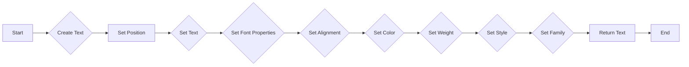

#### 带注释源码

```python
import matplotlib.pyplot as plt

plt.rcParams["font.size"] = 20
ax = plt.figure().add_subplot(xticks=[], yticks=[])

text = ax.text(.1, .5, "Matplotlib", color="red")
text = ax.annotate(" says,", xycoords=text, xy=(1, 0), verticalalignment="bottom", color="gold", weight="bold")
text = ax.annotate(" hello", xycoords=text, xy=(1, 0), verticalalignment="bottom", color="green", style="italic")
text = ax.annotate(" world!", xycoords=text, xy=(1, 0), verticalalignment="bottom", color="blue", family="serif")

plt.show()
```


### matplotlib.pyplot.annotate

`annotate` 是 `matplotlib.pyplot` 模块中的一个函数，用于在图表上添加文本注释。

参数：

- `s`：`str`，要添加的注释文本。
- `xy`：`tuple`，注释文本的坐标，可以是绝对坐标或相对坐标。
- `xycoords`：`str`，指定 `xy` 坐标的参考系统，可以是 'data'、'axes' 或 'frame'。
- `textcoords`：`str`，指定文本坐标的参考系统，可以是 'data'、'axes' 或 'frame'。
- `xytext`：`tuple`，相对于 `xy` 的文本偏移量。
- `textcoords`：`str`，指定 `xytext` 坐标的参考系统，可以是 'offset points'、'pixels'、'inches'、'figure points'、'dots'、'cm' 或 'mm'。
- `arrowprops`：`dict`，指定箭头属性，如颜色、宽度、形状等。
- ` annotationprops`：`dict`，指定注释框属性，如颜色、透明度等。
- `horizontalalignment`：`str`，水平对齐方式，可以是 'left'、'center' 或 'right'。
- `verticalalignment`：`str`，垂直对齐方式，可以是 'top'、'center' 或 'bottom'。
- `transform`：`Transform`，指定注释文本的变换。

返回值：`Annotation` 对象。

#### 流程图

```mermaid
graph LR
A[Start] --> B{Is s a string?}
B -- Yes --> C[Create Annotation object]
B -- No --> D[Error: s must be a string]
C --> E[Set xy and xycoords]
E --> F{Is xycoords 'data', 'axes', or 'frame'?}
F -- Yes --> G[Set xy to absolute coordinates]
F -- No --> H[Error: Invalid xycoords]
G --> I[Set xytext and textcoords]
I --> J{Is textcoords 'offset points', 'pixels', 'inches', 'figure points', 'dots', 'cm', or 'mm'?}
J -- Yes --> K[Set xytext to relative offset]
J -- No --> L[Error: Invalid textcoords]
K --> M[Set arrowprops and annotationprops]
M --> N[Set horizontalalignment and verticalalignment]
N --> O[Set transform]
O --> P[Return Annotation object]
```

#### 带注释源码

```python
import matplotlib.pyplot as plt

def annotate(s, xy=None, xycoords='data', textcoords='offset points', xytext=(0,10), textcoords='offset points', arrowprops=None, annotationprops=None, horizontalalignment=None, verticalalignment=None, transform=None):
    # Implementation of the annotate function
    pass
```


### plt.show()

`plt.show()` 是一个全局函数，用于显示当前图形的窗口。

参数：

- 无

返回值：无

#### 流程图

```mermaid
graph LR
A[Start] --> B[Call plt.show()]
B --> C[Display plot]
C --> D[End]
```

#### 带注释源码

```
plt.show()  # 显示当前图形的窗口
```


### plt.rcParams

`plt.rcParams` 是一个全局变量，用于设置matplotlib的配置参数。

参数：

- 无

返回值：无

#### 流程图

```mermaid
graph LR
A[Start] --> B[Access plt.rcParams]
B --> C[Set configuration]
C --> D[End]
```

#### 带注释源码

```
plt.rcParams["font.size"] = 20  # 设置字体大小为20
```


### figure()

`figure()` 是一个全局函数，用于创建一个新的图形。

参数：

- 无

返回值：`Figure` 对象

#### 流程图

```mermaid
graph LR
A[Start] --> B[Call figure()]
B --> C[Create new Figure]
C --> D[Return Figure]
D --> E[End]
```

#### 带注释源码

```
plt.figure()  # 创建一个新的图形
```


### add_subplot()

`add_subplot()` 是一个全局函数，用于向图形添加一个子图。

参数：

- `n`: 子图的编号
- `sharex`: 是否共享x轴
- `sharey`: 是否共享y轴
- `sharewx`: 是否共享宽x轴
- `sharewy`: 是否共享宽y轴
- `polar`: 是否为极坐标图

返回值：`AxesSubplot` 对象

#### 流程图

```mermaid
graph LR
A[Start] --> B[Call add_subplot()]
B --> C[Add subplot to Figure]
C --> D[Return AxesSubplot]
D --> E[End]
```

#### 带注释源码

```
plt.figure().add_subplot(xticks=[], yticks=[])  # 向图形添加一个子图，不显示x轴和y轴刻度
```


### text()

`text()` 是一个类方法，属于 `Axes` 类，用于在子图上添加文本。

参数：

- `x`: x坐标
- `y`: y坐标
- `s`: 文本内容
- `color`: 文本颜色
- ...

返回值：`Text` 对象

#### 流程图

```mermaid
graph LR
A[Start] --> B[Call text()]
B --> C[Add text to AxesSubplot]
C --> D[Return Text]
D --> E[End]
```

#### 带注释源码

```
text = ax.text(.1, .5, "Matplotlib", color="red")  # 在子图上添加红色文本 "Matplotlib"
```


### annotate()

`annotate()` 是一个类方法，属于 `Axes` 类，用于在子图上添加注释。

参数：

- `s`: 注释内容
- `xy`: 注释的坐标
- `xycoords`: 坐标参考
- `verticalalignment`: 垂直对齐方式
- `color`: 注释颜色
- ...

返回值：`Annotation` 对象

#### 流程图

```mermaid
graph LR
A[Start] --> B[Call annotate()]
B --> C[Add annotation to AxesSubplot]
C --> D[Return Annotation]
D --> E[End]
```

#### 带注释源码

```
text = ax.annotate(
    " says,", xycoords=text, xy=(1, 0), verticalalignment="bottom",
    color="gold", weight="bold")  # 在子图上添加金色加粗注释 " says,"
```


### xticks([]) 和 yticks([])

`xticks([])` 和 `yticks([])` 是类方法，属于 `Axes` 类，用于设置子图的x轴和y轴刻度。

参数：

- `[]`: 不显示刻度

返回值：无

#### 流程图

```mermaid
graph LR
A[Start] --> B[Call xticks()]
B --> C[Set xticks to empty list]
C --> D[End]

A --> E[Call yticks()]
E --> F[Set yticks to empty list]
F --> G[End]
```

#### 带注释源码

```
ax.xticks([])  # 不显示x轴刻度
ax.yticks([])  # 不显示y轴刻度
```


### 关键组件信息

- `plt`: matplotlib.pyplot模块，提供绘图功能。
- `Axes`: matplotlib.axes.Axes类，代表子图。
- `Text`: matplotlib.text.Text类，代表文本对象。
- `Annotation`: matplotlib.text.Annotation类，代表注释对象。


### 潜在的技术债务或优化空间

- 代码中使用了硬编码的字体大小和颜色，这可能导致在不同环境中显示效果不一致。
- 可以考虑使用函数或类来封装绘图逻辑，提高代码的可重用性和可维护性。
- 可以添加错误处理机制，以处理绘图过程中可能出现的异常。


### 设计目标与约束

- 设计目标是创建一个简单的文本叠加示例。
- 约束包括使用matplotlib库进行绘图。


### 错误处理与异常设计

- 代码中没有显式的错误处理机制。
- 可以考虑添加try-except块来捕获并处理可能出现的异常。


### 数据流与状态机

- 数据流：从配置matplotlib参数开始，创建图形和子图，添加文本和注释，最后显示图形。
- 状态机：代码中没有明显的状态转换。


### 外部依赖与接口契约

- 代码依赖于matplotlib库。
- 接口契约包括matplotlib提供的绘图函数和方法。

## 关键组件


### 张量索引与惰性加载

用于在创建文本对象时，根据需要动态地获取和更新文本位置，而不是一次性加载所有文本。

### 反量化支持

允许文本对象具有不同的属性，如颜色或字体，并在创建时应用这些属性。

### 量化策略

通过指定文本的相对位置（如`xy=(1, 0)`），实现文本对象的连续排列，其中每个文本对象的底部左角位于前一个文本对象的底部右角。


## 问题及建议


### 已知问题

-   **代码重复性**：在创建多个文本对象时，每次都使用 `ax.annotate` 并设置 `xycoords=text` 和 `xy=(1, 0)`，这导致了代码的重复性。
-   **硬编码参数**：字体大小、颜色、样式等参数在代码中硬编码，这降低了代码的可配置性和可维护性。
-   **缺乏异常处理**：代码中没有异常处理机制，如果出现错误（如matplotlib版本不兼容），程序可能会崩溃。

### 优化建议

-   **使用函数封装**：创建一个函数来创建文本对象，这样可以减少代码重复，并使代码更加模块化。
-   **参数化配置**：将字体大小、颜色、样式等参数作为函数的参数，这样可以在调用函数时灵活配置。
-   **添加异常处理**：在关键操作处添加异常处理，确保程序在遇到错误时能够优雅地处理异常，而不是直接崩溃。
-   **使用配置文件**：将配置信息（如字体大小、颜色等）存储在配置文件中，这样可以在不修改代码的情况下调整配置。
-   **代码注释**：添加必要的注释，以提高代码的可读性和可维护性。
-   **单元测试**：编写单元测试来验证代码的功能，确保代码的稳定性和可靠性。


## 其它


### 设计目标与约束

- 设计目标：实现一个能够将具有不同属性的文本对象（如颜色或字体）连接起来的功能，并允许文本对象按照指定顺序排列。
- 约束条件：使用Matplotlib库进行文本绘制，确保文本对象能够正确地按照指定位置排列。

### 错误处理与异常设计

- 错误处理：在代码中未发现明显的错误处理机制。
- 异常设计：未定义特定的异常处理逻辑，但应考虑在文本绘制过程中可能出现的异常，如坐标错误或属性设置错误。

### 数据流与状态机

- 数据流：代码中涉及的数据流包括文本对象创建、属性设置和位置调整。
- 状态机：代码中未涉及状态机，但可以考虑在文本对象创建和位置调整过程中引入状态管理。

### 外部依赖与接口契约

- 外部依赖：代码依赖于Matplotlib库进行文本绘制。
- 接口契约：Matplotlib库的`text`和`annotate`方法提供了接口契约，用于创建和调整文本对象。


    