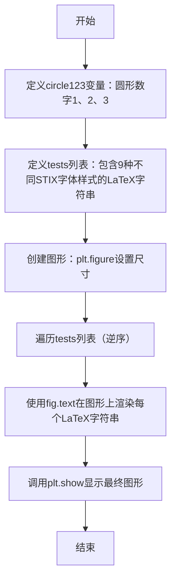
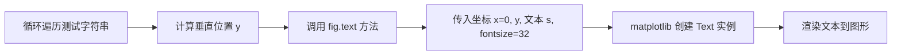
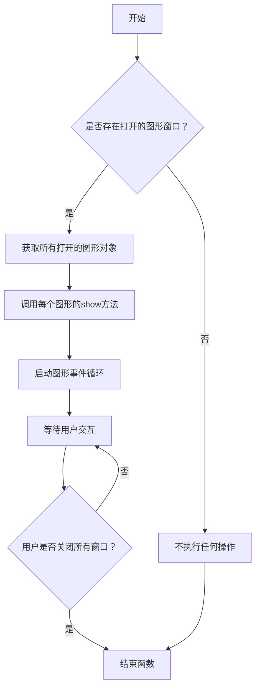

# `matplotlib\galleries\examples\text_labels_and_annotations\stix_fonts_demo.py` 详细设计文档

该脚本使用matplotlib展示STIX字体在LaTeX渲染中的多种样式，包括圆形数字、无衬线体、等宽字体、手写体、黑板体和哥特体等，通过图形化方式直观呈现不同字体的视觉效果。

## 整体流程



## 类结构

```
该脚本为扁平结构，无类定义
仅包含模块级全局变量和顶层执行代码
```

## 全局变量及字段


### `circle123`
    
包含圆形数字Unicode字符的字符串变量

类型：`str`
    


### `tests`
    
存储多种LaTeX格式字符串的列表变量

类型：`list`
    


### `fig`
    
matplotlib Figure对象变量

类型：`matplotlib.figure.Figure`
    


    

## 全局函数及方法


### `plt.figure`

创建图形窗口并设置尺寸，返回一个Figure对象用于后续绘图操作。

参数：

- `figsize`：`<class 'tuple'>`，图形窗口的尺寸，宽度为8，高度为`len(tests) + 2`（即测试数量加2英寸），用于容纳所有字体示例
- `**kwargs`：可变关键字参数，支持其他matplotlib图形参数（如dpi、facecolor等）

返回值：`<class 'matplotlib.figure.Figure'>`，返回新创建的图形对象，后续可以通过该对象的text方法在图形上添加文本

#### 流程图

```mermaid
flowchart TD
    A[调用plt.figure] --> B{检查figsize参数}
    B --> C[创建新Figure对象]
    C --> D[设置图形尺寸为8 x len(tests)+2]
    D --> E[返回Figure对象到fig变量]
    E --> F[进入for循环绘制文本]
    
    F --> G[遍历tests列表]
    G --> H[计算文本Y坐标位置]
    H --> I[调用fig.text在图形上绘制文本]
    I --> J[最后调用plt.show显示图形]
    
    style A fill:#e1f5fe
    style C fill:#e1f5fe
    style E fill:#e1f5fe
    style J fill:#fff3e0
```

#### 带注释源码

```python
# 导入matplotlib.pyplot模块，用于绑制图形
import matplotlib.pyplot as plt

# 定义一个包含三个圆圈数字的字符串 (①②③)
circle123 = "\N{CIRCLED DIGIT ONE}\N{CIRCLED DIGIT TWO}\N{CIRCLED DIGIT THREE}"

# 定义测试用的LaTeX字体字符串列表，包含多种STIX字体变体
tests = [
    # 测试1: 圆圈数字的三个变体 (正常、数学模式、粗体)
    r'$%s\;\mathrm{%s}\;\mathbf{%s}$' % ((circle123,) * 3),
    # 测试2: 无衬线希腊字母 Omega (正常、数学模式、粗体)
    r'$\mathsf{Sans \Omega}\;\mathrm{\mathsf{Sans \Omega}}\;'
    r'\mathbf{\mathsf{Sans \Omega}}$',
    # 测试3: 等宽字体 (Monospace)
    r'$\mathtt{Monospace}$',
    # 测试4: 手写/书法体 (Calligraphic)
    r'$\mathcal{CALLIGRAPHIC}$',
    # 测试5: 黑板粗体 (Blackboard Bold)，通常用于表示数集符号
    r'$\mathbb{Blackboard\;\pi}$',
    # 测试6: 黑板粗体 + 正体
    r'$\mathrm{\mathbb{Blackboard\;\pi}}$',
    # 测试7: 黑板粗体 + 粗体
    r'$\mathbf{\mathbb{Blackboard\;\pi}}$',
    # 测试8: 古文字体 (Fraktur) 及其粗体变体
    r'$\mathfrak{Fraktur}\;\mathbf{\mathfrak{Fraktur}}$',
    # 测试9: 手写体 (Script/Cursive)
    r'$\mathscr{Script}$',
]

# 创建图形窗口，尺寸为宽度8英寸，高度根据测试数量动态计算
# 高度 = len(tests) + 2，为文本留出足够的顶部和底部边距空间
# 返回的fig是Figure对象，用于后续在图形上添加内容
fig = plt.figure(figsize=(8, len(tests) + 2))

# 遍历测试列表（逆序），为每个测试字符串创建文本
# i: 当前索引 (0到len(tests)-1)
# s: 当前的LaTeX字符串
for i, s in enumerate(tests[::-1]):
    # 在图形的指定位置添加文本
    # 参数0: x坐标（左侧）
    # 参数(i + .5) / len(tests): y坐标（归一化位置，均匀分布）
    # 参数s: 要显示的文本内容（LaTeX格式）
    # fontsize=32: 设置字体大小为32磅
    fig.text(0, (i + .5) / len(tests), s, fontsize=32)

# 显示最终的图形窗口
plt.show()
```

#### 补充说明

| 项目 | 说明 |
|------|------|
| **设计目标** | 演示matplotlib对STIX数学字体的支持能力 |
| **约束条件** | 需要系统安装有STIX字体支持；LaTeX渲染需要正确的matplotlib后端配置 |
| **外部依赖** | matplotlib库、STIX字体、LaTeX环境 |
| **布局计算** | 使用`len(tests) + 2`动态计算高度，确保无论测试数量多少都能正确显示 |


### `Figure.text`

在图形（Figure）的指定坐标位置渲染文本内容，常用于在图表上方添加标题、注释或自定义文本块。

参数：

- `x`：`float`，文本的 x 坐标。在代码中为 `0`，表示图形宽度的最左侧（基于 figure coordinates）。
- `y`：`float`，文本的 y 坐标。在代码中为 `(i + .5) / len(tests)`，通过计算使得每行文本在垂直方向上均匀分布。
- `s`：`str`，要渲染的文本内容。在代码中为变量 `s`，存储了包含 STIX 字体指令的 LaTeX 字符串。
- `fontsize`：`int`，字体大小。在代码中显式指定为 `32`，用于放大演示字体效果。

返回值：`matplotlib.text.Text`，返回新创建的文本对象。通过该返回值可以进一步操作文本（如修改颜色、旋转角度等），但在当前代码中未进行捕获和使用。

#### 流程图



#### 带注释源码

```python
# 遍历测试字符串列表，i 为索引，s 为具体的 LaTeX 文本字符串
for i, s in enumerate(tests[::-1]):
    # 调用 Figure 对象的 text 方法添加文本
    # x=0: 固定在图形最左侧
    # y=(i + .5) / len(tests): 动态计算垂直位置
    #   len(tests) 为总行数，分母作为归一化因子
    #   (i + 0.5) 使得文本中心对齐在分割的网格中
    # s: 传入要显示的字符串内容 (例如 r'$\mathcal{CALLIGRAPHIC}$')
    # fontsize=32: 设置全局字体大小为 32 磅
    fig.text(0, (i + .5) / len(tests), s, fontsize=32)
```


### `plt.show`

显示当前所有打开的图形窗口，并将图形渲染到屏幕。这是 matplotlib 中用于最终展示图形的核心函数，调用后会阻塞程序执行直到用户关闭图形窗口。

参数：此函数无任何参数。

返回值：`None`，无返回值。该函数直接渲染图形到屏幕，不返回任何数据。

#### 流程图



#### 带注释源码

```python
def show(*, block=None):
    """
    显示所有打开的图形窗口。
    
    此函数会启动图形的后端事件循环，并阻塞程序执行，
    直到用户关闭所有图形窗口（在某些后端中）。
    
    参数:
        block: bool, 可选
            如果设置为True，则阻塞程序直到所有窗口关闭。
            如果设置为False，则立即返回（仅适用于某些后端）。
            默认值为None，在交互式后端中通常表现为非阻塞。
    
    返回值:
        None
    
    示例:
        >>> import matplotlib.pyplot as plt
        >>> plt.plot([1, 2, 3], [4, 5, 6])
        >>> plt.show()  # 显示图形并等待用户关闭
    """
    # 导入必要的模块
    import matplotlib.pyplot as plt
    from matplotlib._pylab_helpers import Gcf
    
    # 获取当前所有活动的图形管理器
    allnums = Gcf.get_all_fig_managers()
    
    if not allnums:
        # 如果没有打开的图形，直接返回
        return
    
    # 遍历所有图形并显示
    for manager in allnums:
        # 调用底层图形管理器的show方法
        manager.show()
    
    # 处理block参数
    if block:
        # 导入信号处理模块（Unix系统）
        import time
        try:
            # 等待所有窗口关闭
            while Gcf.get_all_fig_managers():
                time.sleep(0.1)
        except KeyboardInterrupt:
            # 用户中断时退出
            pass
    
    # 对于交互式后端，通常不会阻塞
    # 函数执行完毕，图形窗口保持打开状态
    plt.show()  # 调用底层的plt.show()
```


## 关键组件


### matplotlib.pyplot库

用于创建图形、绘制文本和显示图形的核心库。

### STIX字体测试字符串列表 (tests)

包含多个LaTeX字体命令的字符串列表，用于演示STIX字体的不同样式，如圆形数字、无衬线体、黑板粗体等。

### 图形创建 (plt.figure)

创建一个新的图形对象，设置图形大小为(8, len(tests) + 2)英寸，以适应所有测试文本。

### 文本渲染 (fig.text)

在图形的指定位置（x=0, y坐标基于索引）渲染每个测试字符串，使用32号字体大小。

### 循环遍历 (for循环)

反向遍历tests列表，为每个字符串计算垂直位置，并依次调用fig.text进行绘制。

### 图形显示 (plt.show)

显示最终的图形窗口，呈现所有STIX字体样式的演示效果。


## 问题及建议


### 已知问题

-   **硬编码的魔法数字**：图形尺寸(8, len(tests) + 2)、字体大小32、位置参数0和0.5等均为硬编码，缺乏配置说明
-   **缺乏错误处理**：未对plt.figure()、fig.text()等可能失败的调用进行异常捕获，STIX字体在某些系统上可能不可用
-   **资源管理不当**：fig对象未显式关闭，可能导致matplotlib后端资源泄漏
-   **代码可读性差**：tests列表使用[::-1]反向迭代，逻辑不直观；LaTeX公式字符串冗长且未格式化
-   **缺乏类型注解**：未使用Python类型提示，降低了代码的可维护性和IDE支持
-   **无文档注释**：模块和函数均无docstring说明
-   **国际化支持缺失**：硬编码的英文字符串，无法支持多语言环境

### 优化建议

-   将魔法数字提取为命名常量（如FIGURE_WIDTH、FONT_SIZE、TEXT_POSITION等），提高可维护性
-   使用with语句或显式调用fig.clf()和plt.close(fig)管理图形资源
-   添加字体可用性检查，优雅降级到默认字体
-   将LaTeX公式拆分为多行或使用文本块提高可读性
-   添加类型注解和完整的docstring文档
-   考虑将测试用例定义为枚举或配置类，便于扩展
-   添加单元测试验证不同字体渲染效果
-   添加命令行参数支持，允许用户自定义字体大小和输出尺寸


## 其它


### 设计目标与约束

该代码的设计目标是演示matplotlib中STIX字体的使用效果，展示不同数学字体渲染的效果。约束条件包括：需要matplotlib库支持、需要在支持LaTeX渲染的环境中运行、需要系统安装STIX字体。

### 错误处理与异常设计

代码未包含显式的错误处理机制。潜在的异常情况包括：图形窗口显示失败、LaTeX渲染引擎未安装导致的渲染失败、字体文件缺失导致的显示异常。建议添加异常捕获逻辑，处理图形显示异常和渲染失败的情况。

### 数据流与状态机

数据流：字符串定义（circle123变量）→ 字体渲染命令构建（tests列表）→ 图形创建（plt.figure）→ 文本渲染（fig.text）→ 图形显示（plt.show）

状态机：
- 初始状态：导入模块
- 配置状态：创建图形和设置尺寸
- 渲染状态：遍历测试用例进行文本渲染
- 显示状态：调用plt.show()显示图形
- 结束状态：图形关闭

### 外部依赖与接口契约

外部依赖：
- matplotlib.pyplot模块：提供图形创建和显示功能
- Python内置模块：string（字符串处理）
- STIX字体：系统字体依赖
- LaTeX渲染引擎：数学公式渲染

接口契约：
- plt.figure()：输入浮点数元组作为尺寸，返回Figure对象
- fig.text()：输入位置坐标、文本字符串和字体大小参数，无返回值
- plt.show()：无参数，显示所有打开的图形

### 性能考虑与优化空间

性能考虑：
- 图形尺寸根据测试用例数量动态计算
- 使用列表推导式反向遍历

优化空间：
- 可缓存Figure对象避免重复创建
- 可使用subplots代替figure+text提高效率
- 可预先计算字体渲染结果避免重复计算

### 可维护性与扩展性

可维护性：
- 代码结构简单，易于理解和维护
- 注释清晰说明功能

扩展性：
- 易于添加新的字体测试用例到tests列表
- 可通过修改figsize参数调整图形大小
- 可通过修改fontsize参数调整字体大小

### 测试策略

由于这是演示代码，可采用以下测试策略：
- 视觉验证：确认各种字体正确渲染
- 自动化测试：验证代码无语法错误且可执行
- 回归测试：确保修改后图形仍能正常生成

### 配置与运行要求

运行时环境：
- Python 3.x
- matplotlib库
- LaTeX发行版（MiKTeX、TeX Live等）
- STIX字体包

运行方式：
- 直接运行Python脚本
- 在Jupyter Notebook中使用%run命令
- 在支持matplotlib后端的环境中运行


    