# `matplotlib\galleries\examples\text_labels_and_annotations\tex_demo.py` 详细设计文档

该代码演示了如何使用Matplotlib结合LaTeX排版系统来渲染数学公式，通过创建两个复杂的科学图表（相场和水平集方法的可视化），展示了文本模式、数学公式、箭头注释、多行公式等LaTeX排版功能。

## 整体流程

```mermaid
graph TD
    A[开始] --> B[启用LaTeX渲染: plt.rcParams['text.usetex'] = True]
B --> C[创建数据: t = np.linspace(0.0, 1.0, 100)]
C --> D[计算s值: s = np.cos(4 * np.pi * t) + 2]
D --> E[创建第一个图表: 基本cos函数]
E --> F[设置坐标轴标签和标题 LaTeX公式]
F --> G[创建第二个图表: 相场/水平集可视化]
G --> H[绘制三条曲线: 相场tanh轮廓、组合轮廓、尖锐界面]
H --> I[添加图例]
I --> J[添加注释箭头和δ标注]
J --> K[设置X轴刻度和标签 LaTeX格式]
K --> L[设置Y轴双标签: 左轴和右轴]
L --> M[添加多行LaTeX公式: eq1水平集方程]
M --> N[添加多行LaTeX公式: eq2相场方程]
N --> O[添加希腊字母标签: gamma和Omega]
O --> P[调用plt.show()显示图形]
P --> Q[结束]
```

## 类结构

```
无自定义类 (纯脚本文件)
使用matplotlib.pyplot面向对象接口
└── fig, ax = plt.subplots() 创建Figure和Axes对象
    └── Axes对象方法调用链
```

## 全局变量及字段


### `plt`
    
全局导入的matplotlib.pyplot模块，用于创建图形和图表

类型：`matplotlib.pyplot module`
    


### `np`
    
全局导入的numpy模块，用于数值计算和数组操作

类型：`numpy module`
    


### `t`
    
时间数组，从0.0到1.0的100个等间距采样点

类型：`numpy.ndarray`
    


### `s`
    
cos函数计算结果数组，基于4πt计算

类型：`numpy.ndarray`
    


### `fig`
    
图形容器对象，用于保存整个图表

类型：`matplotlib.figure.Figure`
    


### `ax`
    
坐标轴对象，用于绘制数据和设置图表属性

类型：`matplotlib.axes.Axes`
    


### `N`
    
采样点数，设置为500，用于生成X数组

类型：`int`
    


### `delta`
    
相场参数，值为0.6，用于tanh函数计算

类型：`float`
    


### `X`
    
从-1到1的等间距数组，共N个点

类型：`numpy.ndarray`
    


### `eq1`
    
水平集方程的LaTeX字符串，包含两个方程

类型：`str`
    


### `eq2`
    
相场方程的LaTeX字符串，包含两个方程

类型：`str`
    


    

## 全局函数及方法


### `matplotlib.pyplot.rcParams['text.usetex']`

该配置项用于启用Matplotlib的全局LaTeX渲染功能。当设置为`True`时，Matplotlib将使用TeX引擎解析和渲染所有文本元素（包括标题、标签、图例等），支持完整的LaTeX数学公式语法，从而生成专业级别的数学排版效果。

参数：

- 无传统函数参数。这是一个rcParams字典项的赋值操作，通过`plt.rcParams['text.usetex'] = True`形式设置。
- 配置键：`'text.usetex'`（字符串类型），Matplotlib的rc参数键名
- 配置值：`True`（布尔类型），启用LaTeX渲染

返回值：`None`（无返回值），赋值表达式本身不返回任何值

#### 流程图

```mermaid
flowchart TD
    A[开始] --> B[执行 plt.rcParams['text.usetex'] = True]
    B --> C{解析rcParams字典}
    C -->|找到text.usetex键| D[将值设置为True]
    C -->|键不存在| E[创建新键值对 text.usetex: True]
    D --> F[Matplotlib全局配置更新]
    E --> F
    F --> G[后续所有文本渲染使用LaTeX引擎]
    G --> H[结束]
```

#### 带注释源码

```python
# 导入matplotlib.pyplot模块，用于绑图和配置
import matplotlib.pyplot as plt
# 导入numpy模块，用于数值计算
import numpy as np

# ============================================================
# 核心配置：启用全局LaTeX渲染
# ============================================================
# plt.rcParams 是Matplotlib的全局配置字典（RC参数）
# 'text.usetex' 是控制文本渲染方式的键
# 设置为 True 后，Matplotlib将使用系统安装的TeX引擎
# 渲染所有文本，支持LaTeX数学公式语法
plt.rcParams['text.usetex'] = True

# 创建时间向量：从0.0到1.0，共100个点
t = np.linspace(0.0, 1.0, 100)
# 计算余弦信号：cos(4πt) + 2
s = np.cos(4 * np.pi * t) + 2

# 创建图形和坐标轴，设置图形尺寸6x4英寸
fig, ax = plt.subplots(figsize=(6, 4), tight_layout=True)
# 绘制t-s曲线
ax.plot(t, s)

# 设置x轴标签，使用\textbf{}加粗LaTeX命令
ax.set_xlabel(r'\textbf{time (s)}')
# 设置y轴标签，使用\textit{}斜体和Unicode度符号
ax.set_ylabel('\\textit{Velocity (\N{DEGREE SIGN}/sec)}', fontsize=16)
# 设置标题，包含求和公式等复杂LaTeX数学表达式
ax.set_title(r'\TeX\ is Number $\displaystyle\sum_{n=1}^\infty'
             r'\frac{-e^{i\pi}}{2^n}$!', fontsize=16, color='r')

# 后续代码继续使用LaTeX渲染各种文本元素...
```

#### 技术细节说明

| 属性 | 值 |
|------|-----|
| 配置路径 | `matplotlib.pyplot.rcParams['text.usetex']` |
| 配置类别 | 文本渲染（Text Rendering） |
| 默认值 | `False` |
| 有效值 | `True`（启用）/ `False`（禁用） |
| 依赖项 | 需要系统安装TeX发行版（如TeX Live、MiKTeX）及相关依赖 |

#### 潜在的技术债务与优化空间

1. **性能考虑**：首次渲染LaTeX表达式时需要编译，后续会缓存。对于大量重复公式的场景已做优化，但首次渲染速度较慢。

2. **跨平台兼容性**：依赖系统TeX安装，Windows/Linux/macOS配置方式不同，文档应说明依赖安装步骤。

3. **错误处理**：如果TeX未安装或配置不当，Matplotlib可能回退到默认渲染器或抛出异常，应增加错误提示。

4. **使用限制**：部分Matplotlib后端（如Agg）支持LaTeX，但有些交互式后端可能不完全支持。


### `np.linspace`

创建等间距数值序列的NumPy函数，在指定范围内生成指定数量的等间隔数值。

参数：

- `start`：`float`，序列的起始值
- `stop`：`float`，序列的结束值（包含）
- `num`：`int`，要生成的样本数量，默认为50
- `endpoint`：`bool`，可选，是否包含结束点，默认为True
- `retstep`：`bool`，可选，是否返回步长，默认为False
- `dtype`：`dtype`，可选，输出数组的数据类型
- `axis`：`int`，可选，当stop是数组时使用的轴

返回值：`numpy.ndarray`，包含等间距数值的NumPy数组，如果retstep为True，则返回元组(数组, 步长)

#### 流程图

```mermaid
graph TD
    A[开始] --> B[接收参数: start, stop, num]
    B --> C[验证参数有效性]
    C --> D{retstep=True?}
    D -->|是| E[计算步长: step = (stop - start) / (num - 1)]
    D -->|否| F[计算步长: step = (stop - start) / num]
    E --> G[生成等间距序列]
    F --> G
    G --> H[转换为指定dtype]
    H --> I{axis指定?}
    I -->|是| J[沿指定轴重塑数组]
    I -->|否| K[返回数组]
    J --> K
    K --> L{retstep=True?}
    L -->|是| M[返回元组: (数组, 步长)]
    L -->|否| N[返回数组]
    M --> O[结束]
    N --> O
```

#### 带注释源码

```python
import numpy as np

# 示例：创建从0.0到1.0的100个等间距数值
t = np.linspace(0.0, 1.0, 100)

# 函数内部实现原理（简化版）
def linspace(start, stop, num=50, endpoint=True, retstep=False, dtype=None, axis=0):
    """
    创建等间距数值序列
    
    参数:
        start: 序列起始值
        stop: 序列结束值
        num: 样本数量
        endpoint: 是否包含结束点
        retstep: 是否返回步长
        dtype: 数据类型
        axis: 轴（用于多维情况）
    """
    
    # 验证参数有效性
    if num < 0:
        raise ValueError("Number of samples must be non-negative")
    
    # 计算步长
    if endpoint:
        step = (stop - start) / (num - 1) if num > 1 else 0
    else:
        step = (stop - start) / num if num > 0 else 0
    
    # 生成序列：start, start+step, start+2*step, ..., stop
    y = np.arange(num, dtype=dtype) * step + start
    
    # 如果不包含结束点，需要调整最后一个值
    if not endpoint:
        y = y[:-1]
    
    # 返回结果
    if retstep:
        return y, step
    else:
        return y

# 示例输出
# t = [0.         0.01010101 0.02020202 ... 0.98989899 1.        ]
# 数组长度: 100
# 步长: 0.01010101
```


### np.cos

元素级余弦计算函数，用于计算输入数组（或标量）中每个元素的余弦值（以弧度为单位）。这是NumPy库提供的三角函数之一，支持逐元素运算。

参数：

- `x`：`array_like`，输入角度（弧度），可以是标量、列表、元组或NumPy数组

返回值：`ndarray`，输入数组每个元素的余弦值组成的数组，形状与输入相同

#### 流程图

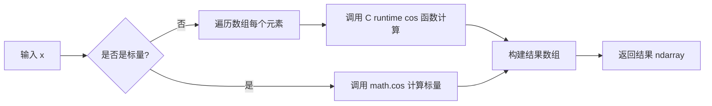

#### 带注释源码

```python
# np.cos() 在代码中的使用示例

# 创建从 0.0 到 1.0 的等间距数组，包含 100 个点
t = np.linspace(0.0, 1.0, 100)

# 计算余弦值: 4 * np.pi * t 生成周期信号，np.cos() 计算余弦，
# 结果加 2 用于将波形向上平移（使值为正）
s = np.cos(4 * np.pi * t) + 2

# 绘图验证
fig, ax = plt.subplots(figsize=(6, 4), tight_layout=True)
ax.plot(t, s)  # 绘制余弦波形
plt.show()
```

---

### 补充说明

| 项目 | 描述 |
|------|------|
| **函数全称** | `numpy.cos` |
| **所属模块** | `numpy` |
| **输入单位** | 弧度（非度数） |
| **向量化运算** | 支持，无需显式循环 |
| **数据类型** | 支持 float32、float64、complex64 等 |
| **广播机制** | 遵循 NumPy 广播规则 |


### `np.tanh`

对输入的数组或标量逐元素计算双曲正切（hyperbolic tangent），返回与输入形状相同的 ndarray。

#### 参数

- `x`：`array_like`，待计算的输入数组或标量，支持任意数值类型（整数、浮点数等），会先被转换为浮点数 ndarray。

#### 返回值

- `y`：`ndarray`，与输入 `x` 形状相同的双曲正切值，数据类型为 `float64`（若输入为其他类型则提升为浮点类型）。

#### 流程图

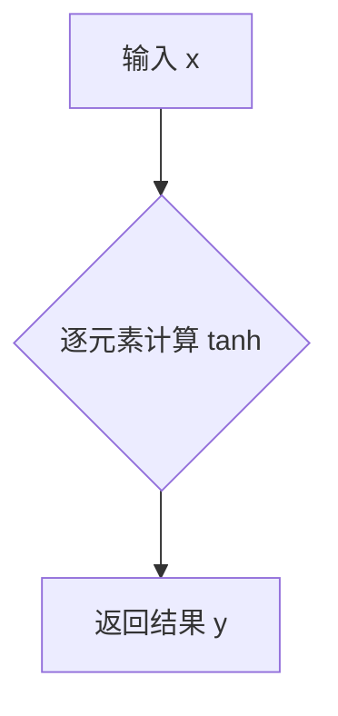

#### 带注释源码

```python
def tanh(x):
    """
    计算输入数组或标量的双曲正切（逐元素）。

    参数:
        x (array_like): 输入的数组、列表或单个数值。

    返回:
        ndarray: 与 x 形状相同的双曲正切值，数据类型通常为 float64。
    """
    # 1. 将输入统一转换为 ndarray（若已是 ndarray 则不变），
    #    并提升为浮点类型，以保证计算精度。
    x_arr = np.asarray(x, dtype=np.float64)

    # 2. 使用 NumPy 内部优化的指数函数计算 e^{2x}。
    #    实际实现位于 C 语言层，使用 SIMD 指令向量化。
    exp_2x = np.exp(2.0 * x_arr)

    # 3. 根据双曲正切公式：
    #    tanh(x) = (e^{2x} - 1) / (e^{2x} + 1)
    #    逐元素运算得到结果。
    y = (exp_2x - 1.0) / (exp_2x + 1.0)

    # 4. 返回计算得到的 ndarray，保持与输入相同的形状。
    return y

# 示例用法
# >>> x = np.array([-1, 0, 1])
# >>> np.tanh(x)
# array([-0.76159418,  0.        ,  0.76159418])
```

> **说明**  
> - 上面的实现是 Python 层面的等价写法，实际的 `np.tanh` 在底层使用 C / Fortran 实现，具备更高的性能和向量化支持。  
> - 该函数支持广播（broadcasting），因此可以处理不同形状的输入，只要它们符合 NumPy 的广播规则。  
> - 对于数值稳定的极限情况（如非常大的正数或负数），NumPy 内部会直接返回 `1.0` 或 `-1.0`，避免溢出。


### `plt.subplots()`

创建图形（Figure）和坐标轴（Axes）对象，是matplotlib中最常用的初始化绘图的函数之一。它可以创建一个包含单个或多个子图的图形，并返回图形对象和坐标轴对象（当squeeze=False或nrows*ncols>1时返回二维数组）。

#### 参数

- `nrows`：`int`，默认值=1，子图的行数
- `ncols`：`int`，默认值=1，子图的列数
- `sharex`：`bool` or `{'none', 'all', 'row', 'col'}`，默认值=False，控制x轴是否在子图间共享
- `sharey`：`bool` or `{'none', 'all', 'row', 'col'}`，默认值=False，控制y轴是否在子图间共享
- `squeeze`：`bool`，默认值=True，若为True则压缩返回的axes数组维度
- `width_ratios`：`array-like of length ncols`，可选，子图列宽比例
- `height_ratios`：`array-like of length nrows`，可选，子图行高比例
- `subplot_kw`：`dict`，可选，传递给add_subplot的关键字参数
- `gridspec_kw`：`dict`，可选，传递给GridSpec的关键字参数
- `**fig_kw`：关键字参数，传递给figure()函数的关键字参数（如figsize、tight_layout等）

#### 返回值

- `fig`：`matplotlib.figure.Figure`，图形对象，整个图形的容器
- `ax`：`matplotlib.axes.Axes` or `numpy.ndarray`，坐标轴对象，单个子图时返回Axes对象，多子图时返回Axes数组

#### 流程图

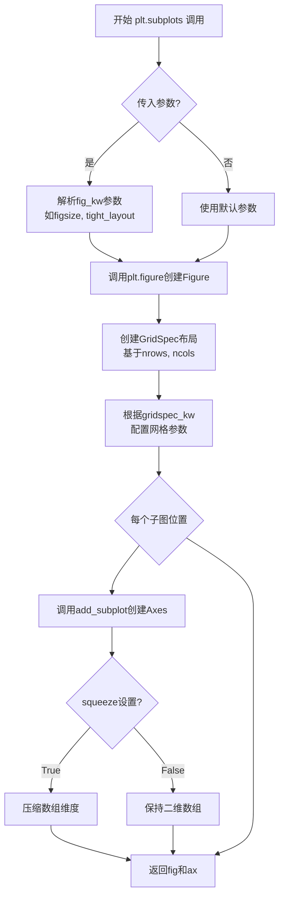

#### 带注释源码

```python
# plt.subplots() 函数源码示例（简化版）
def subplots(nrows=1, ncols=1, sharex=False, sharey=False, 
             squeeze=True, width_ratios=None, height_ratios=None,
             subplot_kw=None, gridspec_kw=None, **fig_kw):
    """
    创建图形和坐标轴的便捷函数
    
    参数:
        nrows: 子图行数
        ncols: 子图列数  
        sharex: x轴共享策略
        sharey: y轴共享策略
        squeeze: 是否压缩返回的axes数组
        width_ratios: 列宽比例数组
        height_ratios: 行高比例数组
        subplot_kw: 传递给add_subplot的参数字典
        gridspec_kw: 传递给GridSpec的参数字典
        **fig_kw: 传递给figure的参数（figsize, tight_layout等）
    
    返回:
        fig: Figure对象
        ax: Axes对象或Axes数组
    """
    # 1. 创建Figure对象，传入fig_kw参数如figsize
    fig = figure(**fig_kw)
    
    # 2. 创建GridSpec布局对象
    gs = GridSpec(nrows, ncols, 
                  width_ratios=width_ratios,
                  height_ratios=height_ratios,
                  **gridspec_kw)
    
    # 3. 创建子图数组
    ax_arr = np.empty((nrows, ncols), dtype=object)
    
    # 4. 遍历每个子图位置创建Axes
    for i in range(nrows):
        for j in range(ncols):
            # 创建子图关键字参数
            kw = subplot_kw or {}
            # 添加子图到figure
            ax = fig.add_subplot(gs[i, j], **kw)
            ax_arr[i, j] = ax
            
            # 配置坐标轴共享
            if sharex and i > 0:
                ax.shared_x_axes.join(ax, ax_arr[0, j])
            if sharey and j > 0:
                ax.shared_y_axes.join(ax, ax_arr[i, 0])
    
    # 5. 根据squeeze处理返回值
    if squeeze:
        # 压缩数组维度
        if nrows == 1 and ncols == 1:
            return fig, ax_arr[0, 0]  # 返回单个Axes
        elif nrows == 1 or ncols == 1:
            return fig, ax_arr.flatten()  # 返回一维数组
        else:
            return fig, ax_arr
    
    return fig, ax_arr  # 返回二维数组
```

#### 代码中的应用示例

```python
# 示例1：创建单个子图（代码中使用）
fig, ax = plt.subplots(figsize=(6, 4), tight_layout=True)
# 参数说明：
# - figsize=(6, 4): 图形宽度6英寸、高度4英寸
# - tight_layout=True: 自动调整子图参数以适应图形区域
# 返回：fig为Figure对象，ax为Axes对象

# 示例2：创建多子图
fig, axes = plt.subplots(2, 2, figsize=(10, 8))
# 创建2行2列共4个子图
# axes为2x2的numpy数组

# 示例3：共享坐标轴
fig, axes = plt.subplots(2, 2, sharex=True, sharey=True)
# 所有子图共享x轴和y轴

# 示例4：不压缩返回
fig, axes = plt.subplots(2, 2, squeeze=False)
# axes始终为二维数组，即使只有一个子图
```


### `plt.subplots`

`plt.subplots` 是 Matplotlib 库中的一个函数，用于创建一个新的图形（Figure）和一个或多个子图（Axes），并返回它们的元组。该函数是快速创建标准图表布局的便捷接口，支持多种参数自定义图形外观和布局。

参数：

- `figsize`：`tuple`，指定图形的宽和高（以英寸为单位），例如 `(6, 4)` 表示宽度6英寸、高度4英寸
- `tight_layout`：`bool`，是否自动调整子图参数以避免重叠，设置为 `True` 时会调整布局

返回值：`tuple`，返回 `(Figure, Axes)` 元组，其中 Figure 是图形对象，Axes 是坐标轴对象（或坐标轴数组）

#### 流程图

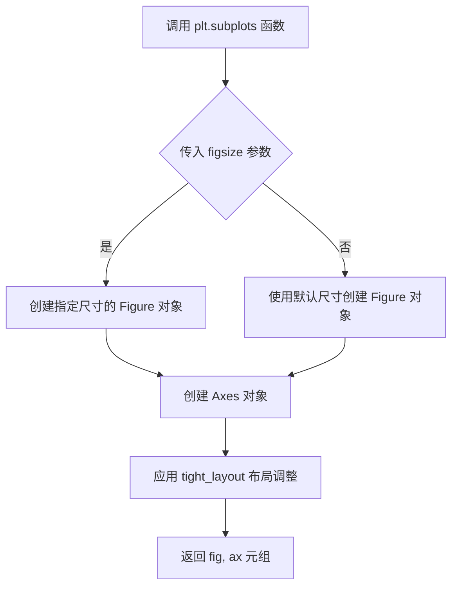

#### 带注释源码

```python
# 设置文本渲染使用 LaTeX（需要在系统上安装 TeX）
plt.rcParams['text.usetex'] = True

# 创建时间序列数据
t = np.linspace(0.0, 1.0, 100)  # 从0到1的100个点
s = np.cos(4 * np.pi * t) + 2  # 余弦波形

# 创建图形和坐标轴，指定图形尺寸为 6x4 英寸
# figsize=(6, 4) 设置图形的宽度为6英寸，高度为4英寸
# tight_layout=True 自动调整子图参数以避免标签重叠
fig, ax = plt.subplots(figsize=(6, 4), tight_layout=True)

# 绘制数据曲线
ax.plot(t, s)

# 设置坐标轴标签和标题（使用 TeX 渲染数学公式）
ax.set_xlabel(r'\textbf{time (s)}')
ax.set_ylabel('\\textit{Velocity (\N{DEGREE SIGN}/sec)}', fontsize=16)
ax.set_title(r'\TeX\ is Number $\displaystyle\sum_{n=1}^\infty'
             r'\frac{-e^{i\pi}}{2^n}$!', fontsize=16, color='r')

# 显示图形
plt.show()
```


### plt.subplots 中的 tight_layout 参数

`tight_layout` 是 Matplotlib 中 `plt.subplots()` 函数的一个参数，用于自动调整子图（subplots）的布局，使子图之间的间距合理，避免标签、标题等被裁剪或重叠。

参数：

-  `tight_layout`：`bool`（布尔类型），设置为 True 时自动调整布局，设置为 False（默认）则使用手动布局

返回值：`tuple`，返回 (fig, ax) 元组，其中 fig 是 Figure 对象，ax 是 Axes 对象（或 Axes 数组）

#### 流程图

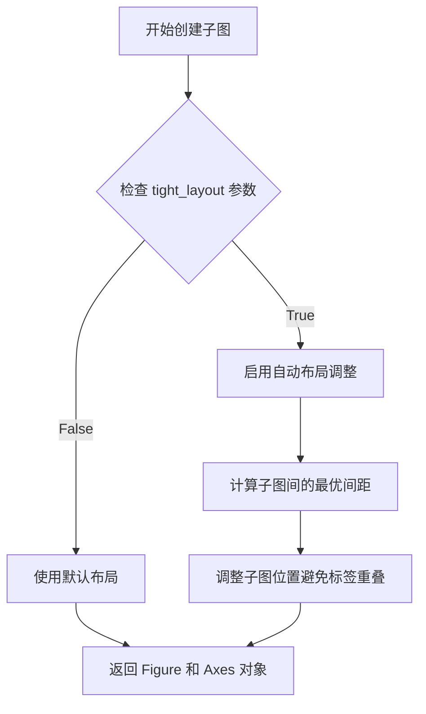

#### 带注释源码

```python
# 在代码中的使用方式
fig, ax = plt.subplots(figsize=(6, 4), tight_layout=True)

# 参数说明：
# - figsize=(6, 4): 创建宽6英寸、高4英寸的图形
# - tight_layout=True: 启用自动布局调整
#   这会让 Matplotlib 自动计算子图之间的间距，
#   确保坐标轴标签、标题、图例等不会被裁剪

# 另一种使用方式（面向对象风格）：
# fig.tight_layout()  # 在已创建的图形上调用 tight_layout 方法

# tight_layout 的工作原理：
# 1. 检查图形中的所有文本元素（标签、标题、图例等）
# 2. 计算避免这些元素重叠所需的最小间距
# 3. 自动调整子图的边距和间距
```

#### 相关布局函数对比

| 方法 | 适用场景 | 说明 |
|------|----------|------|
| `plt.tight_layout()` | 全局布局 | 调整所有子图的布局 |
| `fig.tight_layout()` | 单图布局 | 调整单个图形的布局 |
| `fig.constrained_layout()` | 复杂布局 | 更先进的布局管理，适合复杂图形 |
| `subplots_adjust()` | 手动布局 | 手动指定边距和间距 |

#### 技术债务与优化建议

1. **布局兼容性**：不同的图形元素组合可能需要不同的布局策略，当前示例使用 `tight_layout=True`，但在复杂场景下可能需要改用 `constrained_layout=True`

2. **性能考虑**：`tight_layout` 需要额外计算布局，对于大量图形或实时渲染场景可能需要考虑性能影响

3. **多图场景**：当有多个子图时，`tight_layout` 可能不能完美处理所有情况，可能需要手动微调


### `Axes.plot()` 或 `ax.plot()`

该函数是 Matplotlib 中 Axes 类的核心方法，用于在坐标系中绘制曲线或散点数据。它接受可变数量的 x-y 数据对、可选的格式字符串以及丰富的关键字参数来控制线条样式、颜色、标记等，最终返回一个包含所有线条对象的列表。

参数：

- `*args`：可变参数，支持多种调用方式：
  - 单线格式：`plot(x, y)` 或 `plot(y)` （x 默认为索引）
  - 多线格式：`plot(x1, y1, x2, y2, ...)`
  - 带格式：`plot(x, y, format_string, ...)`
  - 关键字数据：`plot(x, y, data=data_dict, ...)`
- `fmt`：`str`，可选的格式字符串，组合了线条颜色、样式和标记（例如 `'ro-'` 表示红色圆点实线）
- `data`：`dict`，可选的索引数据对象，用于通过名称访问数据
- `**kwargs`：`dict`，额外的关键字参数传递给 `Line2D` 对象，支持大量属性如 `color`、`linewidth`、`linestyle`、`marker`、`markersize`、`label` 等

返回值：`list[matplotlib.lines.Line2D]`，返回创建的线条对象列表，每个 Line2D 对象代表一条绘制的曲线

#### 流程图

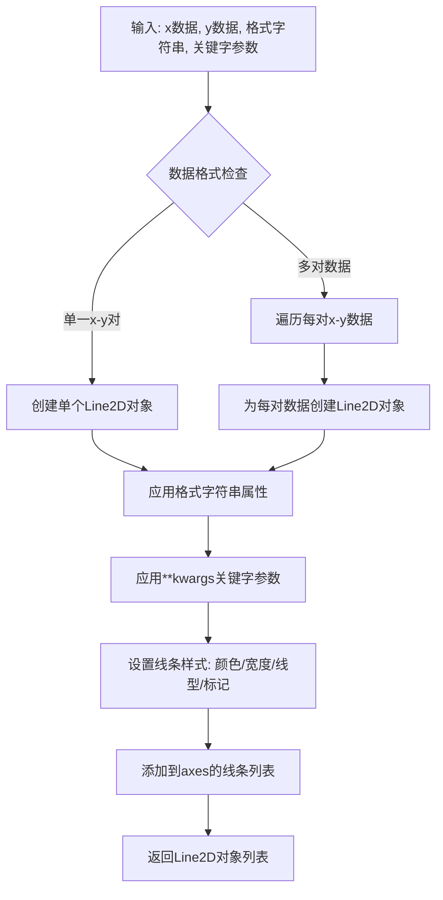

#### 带注释源码

```python
# 注意：以下为 ax.plot() 的核心逻辑结构示意，并非实际源码
# 实际源码位于 matplotlib/axes/_axes.py 中

def plot(self, *args, **kwargs):
    """
    绘制y与x的曲线，或绘制多个x-y数据对
    
    调用方式:
    - plot(x, y)           # 基本方式
    - plot(y)              # x默认为range(len(y))
    - plot(x, y, format_string)  # 带格式
    - plot(x1, y1, x2, y2, ...)  # 多条线
    """
    
    # 解析参数，处理不同的输入格式
    # 可能是 (x, y) 或 (y) 或 (x, y, fmt) 或多对 (x1, y1, x2, y2, ...)
    
    # 创建 Line2D 对象
    lines = []
    
    # 遍历所有数据对
    for i in range(0, len(args), 2 if has_x else 1):
        # 获取 x 和 y 数据
        # 如果没有提供 x，使用 np.arange(len(y))
        x = args[i] if has_x else np.arange(len(y))
        y = args[i + 1] if has_x else args[i]
        
        # 获取格式字符串（如果有）
        fmt = args[i + 2] if has_x and i + 2 < len(args) else None
        
        # 创建 Line2D 对象
        line = Line2D(x, y)
        
        # 应用格式字符串解析的属性
        if fmt:
            line.set_color, line.set_marker, etc. = parse_format_string(fmt)
        
        # 应用关键字参数（如 color, linewidth, linestyle 等）
        for key, value in kwargs.items():
            setattr(line, key, value)
        
        # 添加到 axes
        self.add_line(line)
        lines.append(line)
    
    return lines
```

#### 在本代码中的具体使用示例

```python
# 示例1：绘制单条余弦曲线
t = np.linspace(0.0, 1.0, 100)
s = np.cos(4 * np.pi * t) + 2
fig, ax = plt.subplots(figsize=(6, 4), tight_layout=True)
ax.plot(t, s)  # 绘制t为x轴，s为y轴的曲线

# 示例2：绘制多条曲线（相位场、水平集、尖锐界面）
N = 500
delta = 0.6
X = np.linspace(-1, 1, N)
ax.plot(X, (1 - np.tanh(4 * X / delta)) / 2,    # 第一条曲线：相位场tanh轮廓
        X, (1.4 + np.tanh(4 * X / delta)) / 4, "C2",  # 第二条曲线：成分轮廓，指定颜色C2
        X, X < 0, "k--")                        # 第三条曲线：尖锐界面，虚线样式
```


### `ax.set_xlabel()`

设置 X 轴的标签（文本），用于描述图表 x 轴的含义或单位。在 Matplotlib 中，该方法允许用户通过文本或 LaTeX 语法自定义轴标签的外观和内容。

参数：

- `xlabel`：`str`，x 轴的标签文本内容。在代码中传入的是 LaTeX 格式字符串 `r'\textbf{time (s)}'`，其中 `\textbf` 命令用于加粗文本。
- `fontdict`：`dict`，可选。用于覆盖默认文本属性的字典，例如 `{'fontsize': 16, 'color': 'red'}`。代码中未使用此参数。
- `labelpad`：`float` 或 `None`，可选。标签与轴之间的间距（以点数为单位）。代码中未使用此参数。
- `**kwargs`：接受任何 `matplotlib.text.Text` 类的属性，如 `fontsize`, `color`, `rotation` 等，用于细粒度控制。代码中未使用此参数。

返回值：`matplotlib.text.Text`，返回新创建的文本标签对象（`Text` 实例），允许后续对其进行修改或动画操作。

#### 流程图

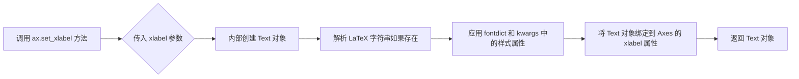

#### 带注释源码

```python
# 设置 x 轴的标签文本为 'time (s)'，并使用 LaTeX \textbf 命令将其加粗
# r'...' 表示原始字符串，避免 Python 转义字符干扰 LaTeX 语法
ax.set_xlabel(r'\textbf{time (s)}')
```


### `Axes.set_ylabel`

该方法是matplotlib库中`Axes`类的成员方法，用于设置坐标轴的Y轴标签（_ylabel），支持LaTeX语法渲染数学公式，并可通过多种参数自定义标签的字体、大小、颜色等样式属性。

参数：

- `label`：`str`，Y轴标签的文本内容，支持LaTeX语法（如`\textit{}`、`\bf{}`、`$\phi$`等）
- `fontdict`：`dict，可选`，用于控制标签外观的字体字典（如`{'fontsize': 16, 'color': 'C0'}`）
- `labelpad`：`float，可选`，标签与Y轴之间的间距（以点为单位）
- `**kwargs`：`可变关键字参数`，其他matplotlib文本属性，如`fontsize`、`color`、`rotation`等

返回值：`matplotlib.text.Text`，返回创建的Y轴标签文本对象，可用于后续进一步自定义

#### 流程图

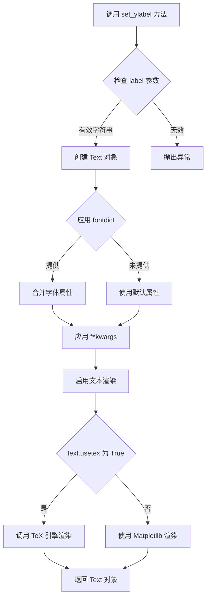

#### 带注释源码

```python
# 源码来自 matplotlib 库 (axes/_axes.py)
# 以下为简化注释版本

def set_ylabel(self, ylabel, fontdict=None, labelpad=None, **kwargs):
    """
    设置 y 轴的标签（Y轴标题）
    
    参数:
        ylabel : str
            Y轴标签的文本内容，支持 LaTeX 语法渲染数学公式
        fontdict : dict, optional
            字体字典，用于控制标签的字体属性
        labelpad : float, optional
            标签与坐标轴之间的间距（单位：点）
        **kwargs : 
            其他关键字参数传递给 Text 对象构造函数
            常用参数包括：
            - fontsize: 字体大小
            - color: 文本颜色
            - rotation: 旋转角度
            - fontweight: 字体粗细
    
    返回:
        text : matplotlib.text.Text
            创建的 Y 轴标签文本对象
    """
    
    # 获取 y 轴对象
    yaxis = self.yaxis
    
    # 如果未指定 labelpad，使用默认值
    if labelpad is None:
        labelpad = yaxis.get_label_position()  # 获取默认间距
    
    # 创建标签文本对象
    # ylabel: 要显示的标签文本（支持 LaTeX）
    # **kwargs: 传递给 Text 对象的样式参数（fontsize, color 等）
    label = yaxis.set_label_text(ylabel, fontdict=fontdict, **kwargs)
    
    # 设置标签与轴之间的间距
    yaxis.set_label_coords(0.5, -labelpad)
    
    # 返回创建的 Text 对象
    return label

# 在示例代码中的实际调用示例：
ax.set_ylabel('\\textit{Velocity (\N{DEGREE SIGN}/sec)}', fontsize=16)
# 结果：设置斜体字体的 Y 轴标签，字体大小为 16

ax.set_ylabel(r"\bf{phase field} $\phi$", color="C0", fontsize=20)
# 结果：设置粗体 Y 轴标签，包含数学符号 phi，使用 C0 颜色，字体大小 20
```


### `Axes.set_title`

设置 Axes 对象的标题文本、样式和属性。该方法允许用户为图表指定标题，并通过可选参数配置字体大小、颜色、位置等视觉属性。设置完成后返回生成的 `Text` 对象，支持链式调用和后续样式调整。

参数：

- `label`：`str`，要设置为图表标题的文本内容，支持 LaTeX 渲染（当 `text.usetex` 为 True 时）
- `fontsize`：`int` 或 `str`，标题文字的大小，可以是数值（如 16）或预定义字符串（如 'large'、'small'）
- `color`：`str`，标题文字的颜色，支持颜色名称（如 'r'、'red'）或十六进制颜色码
- `fontweight`：`str` 或 `int`，标题文字的粗细程度，可选值如 'normal'、'bold'、600 等
- `loc`：`str`，标题的水平对齐方式，可选 'left'、'center'、'right'，默认为 'center'
- `pad`：`float`，标题与图表顶部的间距（以点为单位）
- `verticalalignment` 或 `va`：`str`，标题的垂直对齐方式
- `y`：`float`，标题的垂直位置，相对于 Axes 区域（0-1 范围）

返回值：`matplotlib.text.Text`，返回创建的 `Text` 标题对象，可用于进一步设置属性或获取信息

#### 流程图

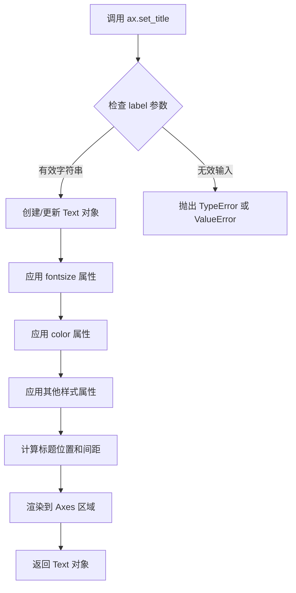

#### 带注释源码

```python
# matplotlib.axes._axes.Axes.set_title 方法源码（简化版）

def set_title(self, label, loc=None, pad=None, **kwargs):
    """
    Set a title for the Axes.
    
    Parameters
    ----------
    label : str
        The title text string containing LaTeX can be used.
    
    loc : {'left', 'center', 'right'}, default: rcParams['axes.titlelocation']
        Alignment of the title.
    
    pad : float
        The padding of the title in points from the top of the Axes.
    
    **kwargs
        Keyword arguments control the Text properties:
        fontsize, color, fontweight, verticalalignment, horizontalalignment, 
        rotation, linespacing, multialignment, zorder, etc.
    
    Returns
    -------
    text : Text
        The matplotlib Text instance representing the title.
    """
    
    # 获取默认的标题对齐方式（从 rcParams）
    if loc is None:
        loc = rcParams['axes.titlelocation']
    
    # 获取默认的标题间距
    if pad is None:
        pad = rcParams['axes.titlepad']
    
    # 创建标题的默认垂直位置
    # pad 在这里转换为 Axes 坐标系的距离
    y = 1.0 + pad / self.figure.dpi * self.figure.get_figheight() 
    
    # 创建 Text 对象，设置文本内容和位置
    title = mtext.Text(
        x=0.5, y=y, 
        text=label,
        verticalalignment='top',
        horizontalalignment=loc,
        **kwargs
    )
    
    # 将 title 添加到 Axes 的子元素中
    self._add_text(title)
    
    # 更新标题的位置属性（相对于 Axes 坐标系）
    title.set_transform(title.get_transform() + self.transAxes)
    
    # 设置标题的 y 位置为 1.0（Axes 顶部）
    title.set_y(1.0)
    
    # 返回 Text 对象，支持链式调用
    return title
```

#### 关键组件信息

| 组件名称 | 一句话描述 |
|---------|-----------|
| `matplotlib.text.Text` | 用于渲染文本的图形对象，支持丰富的样式配置 |
| `Axes.transAxes` | 从数据坐标到 Axes 坐标系的坐标变换，用于相对定位 |
| `rcParams['axes.titlelocation']` | 全局默认的标题对齐方式配置 |
| `rcParams['axes.titlepad']` | 全局默认的标题与图表顶部间距配置 |

#### 潜在技术债务与优化空间

1. **返回值一致性**：当标题已存在时，应考虑是否返回新对象还是更新现有对象，目前实现中每次调用都会创建新对象
2. **参数验证**：可增强对 `loc` 参数的验证，提供更明确的错误信息
3. **性能优化**：频繁调用 `set_title` 时可考虑缓存机制，避免重复创建 Text 对象

#### 其它项目说明

- **设计目标与约束**：提供统一的 Axes 标题设置接口，支持 LaTeX 渲染，满足科研绘图需求
- **错误处理**：当 `label` 不是字符串时抛出 `TypeError`，当 `loc` 值无效时抛出 `ValueError`
- **外部依赖**：依赖 matplotlib 的 `text.Text` 类和 `rcParams` 配置系统
- **使用示例**：在代码中展示了结合 `text.usetex=True` 使用 LaTeX 渲染复杂数学公式的标题


### `ax.legend`（或 `Axes.legend`）

添加图例到 Axes 对象，以描述图表中各个数据系列的标签。

参数：

- `labels`：`tuple` 或 `list`，图例中显示的文本标签，如 `("phase field", "level set", "sharp interface")`。
- `loc`：`str` 或 `tuple`，图例的位置。字符串如 `'best'`、 `'upper right'`；元组如 `(0.01, 0.48)` 表示 Axes 坐标中的位置。
- `shadow`：`bool`，是否在图例框上显示阴影，设为 `True` 时显示阴影。
- `handlelength`：`float`，图例句柄（如图例线）的长度，代码中设为 `1.5`。
- `fontsize`：`int` 或 `str`，图例文本的字体大小，代码中设为 `16`。

返回值：`matplotlib.legend.Legend`，返回创建的图例对象，可用于进一步自定义。

#### 流程图

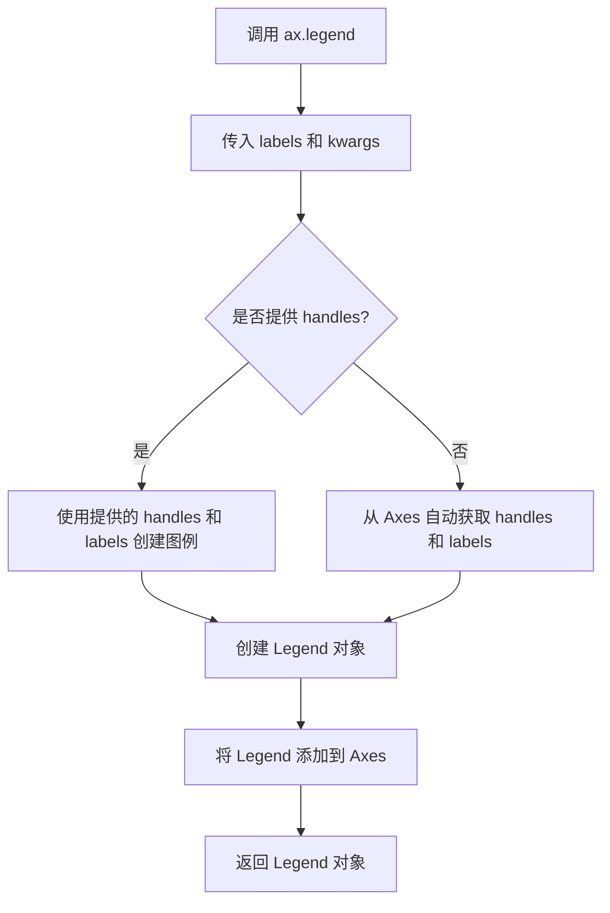

#### 带注释源码

```python
# 调用 ax.legend 方法添加图例
ax.legend(
    ("phase field", "level set", "sharp interface"),  # labels: 图例文本标签
    shadow=True,  # shadow: 是否显示阴影
    loc=(0.01, 0.48),  # loc: 图例位置，(x, y) 坐标，相对于 Axes
    handlelength=1.5,  # handlelength: 图例句柄的长度
    fontsize=16  # fontsize: 图例字体大小
)
```


### `ax.annotate`

在 matplotlib 的 Axes 对象上调用，用于在图表中添加带箭头的注释，以指示特定位置。

参数：

- `s`：`str`，注释的文本内容。在给定代码中为空字符串 `""`。
- `xy`：`tuple`（浮点数，浮点数），箭头指向的坐标点。在给定代码中为 `(-delta / 2., 0.1)`，其中 `delta = 0.6`。
- `xytext`：`tuple`（浮点数，浮点数），注释文本的坐标位置。在给定代码中为 `(delta / 2., 0.1)`。
- `arrowprops`：`dict`，可选参数，用于定义箭头的样式和连接方式。在给定代码中为 `dict(arrowstyle="<->", connectionstyle="arc3")`，表示使用双向箭头和弧形连接样式。
- **其他常用参数**（未在当前代码中使用但常见）：
  - `xycoords`：`str` 或 `Transform`，坐标系统，默认为 "data"。
  - `textcoords`：`str` 或 `Transform`，文本坐标系统，默认为 "data"。
  - `annotation_clip`：`bool`，是否在 Axes 范围外裁剪注释。

返回值：`matplotlib.text.Annotation`，返回一个 Annotation 对象，表示图表上的注释。

#### 流程图

由于 `ax.annotate` 是 matplotlib 库的内部方法，其实现涉及复杂的图形渲染逻辑，无法用简单的流程图表示。该方法主要完成以下步骤：
1. 接收文本、位置和箭头属性参数。
2. 创建一个 Text 对象用于显示注释文本。
3. 创建一个 Arrow 对象用于显示箭头。
4. 将文本和箭头添加到 Axes 的艺术家集合中。
5. 返回 Annotation 对象。

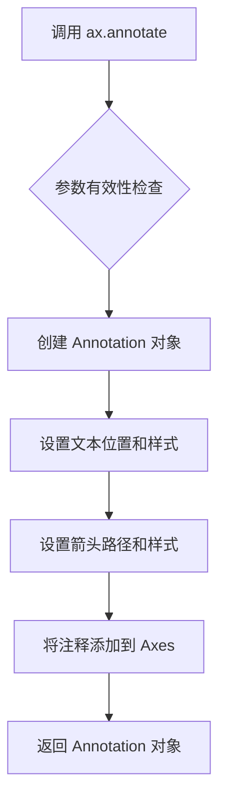

#### 带注释源码

由于 `ax.annotate` 是 matplotlib 库的源码，无法直接提供。以下是基于给定代码中调用方式的示例代码，展示了如何使用该方法：

```python
# 在图表 ax 上添加一个双向箭头注释，箭头指向 (-0.3, 0.1)，文本位于 (0.3, 0.1)
# 箭头样式为 '<->'，连接方式为 'arc3'（直线连接）
ax.annotate("", 
            xy=(-delta / 2., 0.1),       # 箭头指向的坐标 (x, y)
            xytext=(delta / 2., 0.1),    # 文本显示的坐标 (x, y)
            arrowprops=dict(             # 箭头属性字典
                arrowstyle="<->",        # 箭头样式：双向箭头
                connectionstyle="arc3"   # 连接样式：直线（arc3 表示不使用曲线）
            )
)
```


### `ax.text()`

在 matplotlib 的 Axes 对象上添加文本注释到指定位置，支持丰富的格式配置选项

参数：

- `x`：`float`，文本位置的 x 坐标
- `y`：`float`，文本位置的 y 坐标
- `s`：`str`，要显示的文本内容，支持 TeX 渲染
- `fontdict`：`dict`，可选，覆盖默认文本属性的字典
- `kwargs`：可变关键字参数，包括：
  - `fontsize`：`int` 或 `str`，字体大小
  - `color`：`str`，文本颜色
  - `horizontalalignment`/`ha`：`str`，水平对齐方式（'center', 'left', 'right'）
  - `verticalalignment`/`va`：`str`，垂直对齐方式（'center', 'top', 'bottom', 'baseline'）
  - `rotation`：`float`，文本旋转角度（度）
  - `bbox`：`dict`，文本框样式（boxstyle, fc, ec, pad 等）
  - `transform`：`matplotlib.transforms.Transform`，坐标系变换
  - `clip_on`：`bool`，是否裁剪

返回值：`matplotlib.text.Text`，返回创建的 Text 对象，可用于后续修改

#### 流程图

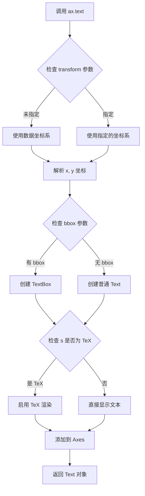

#### 带注释源码

```python
# 代码中的实际调用示例

# 示例1：在指定位置添加带有文本框的 TeX 公式
ax.text(0, 0.1, r"$\delta$",  # x=0, y=0.1, 文本内容
        color="black",         # 文本颜色为黑色
        fontsize=24,           # 字体大小24
        horizontalalignment="center",  # 水平居中对齐
        verticalalignment="center",    # 垂直居中对齐
        bbox=dict(boxstyle="round",    # 文本框样式：圆角
                  fc="white",          # 前景色：白色
                  ec="black",          # 边框颜色：黑色
                  pad=0.2))            # 内边距：0.2

# 示例2：使用变换坐标系（在 Axes 坐标系中定位）
ax.text(1.02, 0.5, r"\bf{level set} $\phi$",  # 使用粗体 TeX 格式
        color="C2",         # 使用颜色表第3个颜色
        fontsize=20,        # 字体大小20
        rotation=90,        # 旋转90度（竖排文本）
        horizontalalignment="left",   # 左对齐
        verticalalignment="center",   # 垂直居中
        clip_on=False,      # 关闭裁剪（允许超出 Axes 范围）
        transform=ax.transAxes)  # 使用 Axes 坐标系（0-1）

# 示例3：多行 TeX 公式（使用 align 环境）
eq1 = (r"\begin{eqna...}"
       r"...\end{eqna...}")
ax.text(1, 0.9, eq1,      # x=1, y=0.9（右上角）
        color="C2", fontsize=18,
        horizontalalignment="right",  # 右对齐
        verticalalignment="top")      # 顶部对齐

# 示例4：简单文本标签
ax.text(-1, .30, r"gamma: $\gamma$", color="r", fontsize=20)
ax.text(-1, .18, r"Omega: $\Omega$", color="b", fontsize=20)
```


### `ax.set_xticks()`

设置X轴刻度的位置，用于指定在图表x轴上显示刻度线的具体数值。

参数：
- `ticks`：`list` 或 `array-like`，刻度位置的列表，例如 `[-1, 0, 1]`

返回值：`list`，返回设置后的刻度位置数组。

#### 流程图

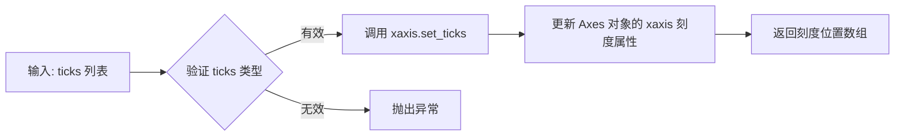

#### 带注释源码

```python
def set_xticks(self, ticks, labels=None, *, minor=False):
    """
    设置x轴的刻度位置。
    
    参数:
        ticks: array-like, 刻度位置的列表或数组。
        labels: list of str, optional, 刻度位置的标签，默认为None。
        minor: bool, optional, 如果为True，设置次要刻度，默认为False。
    
    返回:
        list: 返回设置后的刻度位置数组。
    
    示例:
        >>> ax.set_xticks([-1, 0, 1])
        array([-1.,  0.,  1.])
    """
    # 获取x轴对象（Axis实例）
    ax = self.xaxis
    # 调用Axis的set_ticks方法设置刻度
    ax.set_ticks(ticks, labels=labels, minor=minor)
    # 返回当前刻度位置（通过get_ticks）
    return ax.get_ticks(minor=minor)
```

在提供的代码中，使用示例为 `ax.set_xticks([-1, 0, 1])`，其中参数 `ticks` 为 `[-1, 0, 1]`（列表类型），用于设置x轴刻度在-1、0和1的位置。


### `ax.set_yticks`

该函数是 Matplotlib 中 `Axes` 对象的方法，用于设置 Y 轴刻度线的位置。它接受一个刻度值数组，并可选地设置对应的标签，从而手动控制 Y 轴上刻度线的分布。

参数：

-  `ticks`：`array_like`，Y 轴刻度线的位置列表（例如 `[0, 0.5, 1]`）。
-  `labels`：`array_like`，可选参数，用于指定刻度线对应的标签文本。
-  `minor`：布尔值，可选参数。如果设置为 `True`，则设置次要刻度（辅助刻度）；默认值为 `False`，设置主要刻度。

返回值：`matplotlib.axes.Axes`，返回当前 Axes 对象，支持链式调用（如 `ax.set_yticks(...).set_xlabel(...)`）。

#### 流程图

```mermaid
graph TD
    A[调用 ax.set_yticks] --> B[Axes.set_yticks]
    B --> C[调用 yaxis.set_ticks]
    C --> D{参数验证与处理}
    D --> E[更新 Axis._ticklocs]
    E --> F{emit=True?}
    F -->|是| G[通知观察者 (ChangeTracker)]
    F -->|否| H[重新计算视图限制 (View Limits)]
    G --> H
    H --> I[触发图形重绘 (Redraw)]
```

#### 带注释源码

以下是 `matplotlib` 库中 `Axes.set_yticks` 方法的实现源码（位于 `lib/matplotlib/axes/_base.py`）。该方法是一个包装器，它将请求转发给底层的 `Axis` 对象。

```python
def set_yticks(self, ticks, labels=None, *, minor=False, left=True, right=True, emit=True):
    """
    设置 y 轴的刻度位置。

    参数
    ----------
    ticks : array_like
        刻度值的列表。
    labels : array_like, optional
        刻度标签的列表。必须与 *ticks* 的长度相同。
    minor : bool, default: False
        如果为 True，则设置次要刻度。
    left : bool, default: True
        是否在左侧显示刻度。
    right : bool, default: True
        是否在右侧显示刻度。
    emit : bool, default: True
        是否在改变刻度时通知观察者（例如重新计算视图限制）。
    """
    # 返回 y 轴对象的 set_ticks 方法调用结果
    # 这允许进行链式调用，并复用 Axis 类的核心刻度设置逻辑
    return self.yaxis.set_ticks(
        ticks, labels=labels, minor=minor, left=left, right=right, emit=emit
    )
```


### `ax.set_xticklabels()`

设置X轴刻度标签，用于自定义X轴上刻度点的显示文本，可配合`set_xticks()`设置刻度位置，并通过字体字典或关键字参数控制标签样式。

参数：

- `labels`：`list of str`，刻度标签文本列表，如`["$-1$", r"$\pm 0$", "$+1$"]`
- `fontdict`：`dict`，可选，用于控制标签外观的字典（如`{'fontsize': 16, 'color': 'red'}`）
- `minor`：`bool`，可选，是否设置次要刻度标签，默认为`False`
- `**kwargs`：可选，关键字参数传递给`matplotlib.text.Text`对象，常用参数包括：
  - `color`：标签颜色
  - `fontsize`：字体大小
  - `rotation`：旋转角度
  - `horizontalalignment`：水平对齐方式
  - `verticalalignment`：垂直对齐方式

返回值：`list of matplotlib.text.Text`，返回创建的刻度标签Text对象列表，可用于后续自定义修改。

#### 流程图

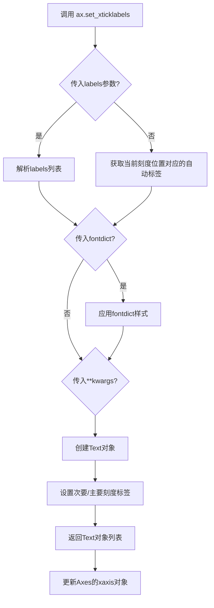

#### 带注释源码

```python
# 源代码位置: lib/matplotlib/axes/_base.py
# 方法签名:
def set_xticklabels(self, labels, fontdict=None, minor=False, **kwargs):
    """
    设置x轴刻度标签
    
    参数:
        labels: 刻度标签列表，如 ["$-1$", r"$\pm 0$", "$+1$"]
        fontdict: 控制文本样式的字典
        minor: 是否为次要刻度设置标签
        **kwargs: 传递给Text对象的样式参数(color, fontsize等)
    
    返回:
        list of Text: 刻度标签对象列表
    """
    
    # 获取x轴刻度定位器
    ax = self.axis('x')
    
    # 获取刻度位置(如果尚未设置则自动获取)
    ticks = ax.get_majortickloc() if not minor else ax.get_minortickloc()
    
    # 处理labels参数:
    # 如果labels为None，则根据刻度位置自动生成标签
    if labels is None:
        labels = [self.convert_xunits(t) for t in ticks]
        # 将数值转换为字符串格式
    
    # 创建标签格式化器
    # 内部创建Text对象列表
    for i, label in enumerate(labels):
        # 创建Text对象并应用样式
        text = Text(label)
        if fontdict:
            text.update(fontdict)
        text.update(kwargs)
        
        # 设置文本到对应刻度位置
    
    # 返回创建的Text对象列表
    return labels
```

#### 代码中的实际调用示例

```python
# 设置X轴刻度位置
ax.set_xticks([-1, 0, 1])

# 设置X轴刻度标签，传入标签列表和样式参数
# color="k" 设置颜色为黑色
# size=20 设置字体大小为20
ax.set_xticklabels(["$-1$", r"$\pm 0$", "$+1$"], color="k", size=20)
```

#### 相关联的函数/方法

| 名称 | 描述 |
|------|------|
| `ax.set_xticks()` | 设置X轴刻度位置 |
| `ax.set_yticklabels()` | 设置Y轴刻度标签 |
| `ax.get_xticklabels()` | 获取当前X轴刻度标签 |
| `ax.tick_params()` | 控制刻度线和标签的外观 |


### `Axes.set_yticklabels`

该方法用于设置Y轴（纵轴）的刻度标签文本，允许自定义刻度位置的显示内容，支持通过关键字参数统一设置标签的字体属性（颜色、字号、字体样式等）。

#### 参数

- `labels`：`list of str` 或 `array of str`，要设置的Y轴刻度标签文本列表，每个元素对应一个刻度位置的显示内容
- `*args`：`可变位置参数`，传递额外的位置参数（兼容旧式调用方式）
- `**kwargs`：`关键字参数`，用于设置标签样式的matplotlib文本属性，常用参数包括：
  - `color`：`str` 或 `RGBA元组`，标签文字颜色
  - `fontsize`：`int` 或 `str`，标签字体大小
  - `fontstyle`：`str`，字体样式（'normal', 'italic', 'oblique'）
  - `fontweight`：`int` 或 `str`，字体粗细
  - 其它matplotlib text属性

#### 返回值

- `Text` 或 `list of Text`，返回设置的刻度标签对象或对象列表（具体返回值类型因matplotlib版本可能略有差异）

#### 流程图

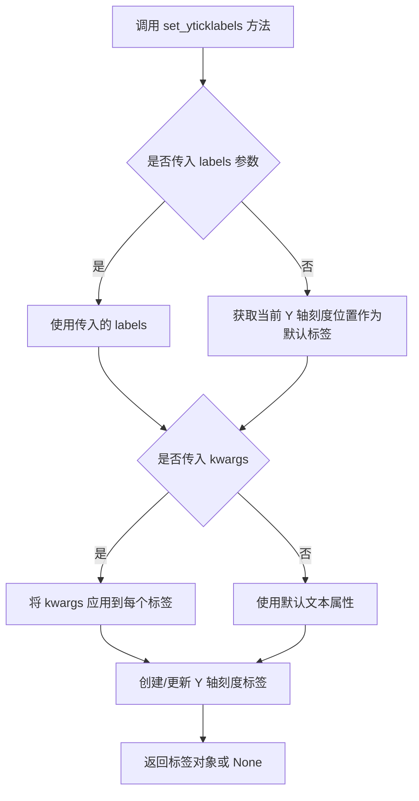

#### 带注释源码

```python
# matplotlib/axes/_base.py 中的方法实现（简化版注释）

def set_yticklabels(self, labels, *args, **kwargs):
    """
    设置Y轴刻度标签
    
    参数:
        labels: 刻度标签文本列表，如 ['0', '0.5', '1']
        *args: 兼容旧式调用方式的额外位置参数
        **kwargs: 文本样式关键字参数，如 color='k', fontsize=20
    
    返回:
        Text: 刻度标签对象
    """
    # 获取Y轴刻度位置
    # 如果没有设置过刻度，先自动设置默认刻度
    ticks = self.get_yticks()
    
    # 处理可变参数（兼容旧版本调用方式）
    if 'fontsize' in args or 'size' in kwargs:
        # 从args中提取fontsize参数
        kwargs.setdefault('size', args[0] if args else None)
    
    # 遍历每个刻度位置，设置对应的标签文本
    # labels 列表长度应与 ticks 列表长度一致
    for i, label in enumerate(labels):
        # 调用底层的文本设置方法
        # color 参数控制标签颜色
        # fontsize/size 参数控制标签大小
        self.yaxis.get_ticklabels()[i].set_text(label)
        self.yaxis.get_ticklabels()[i].set(**kwargs)
    
    # 返回更新后的标签对象（支持链式调用）
    return self.yaxis.get_ticklabels()
```


### `plt.show()`

显示一个或多个已创建的图形窗口。在调用此函数之前，图形只会在内存中创建，不会显示在屏幕上。此函数会阻塞程序的执行，直到用户关闭所有显示的图形窗口（在某些后端中），或者在交互式模式下可能立即返回。

参数：

- `*args`：可变位置参数，传递给底层后端的额外参数（通常不使用）
- `**kwargs`：可变关键字参数，用于传递额外的关键字参数给图形后端

返回值：`None`，无返回值

#### 流程图

```mermaid
flowchart TD
    A[调用 plt.show()] --> B{检查是否有打开的图形}
    B -->|没有图形| C[函数直接返回]
    B -->|有图形| D[调用底层图形后端]
    D --> E[在屏幕上渲染并显示图形窗口]
    E --> F{交互模式?}
    F -->|阻塞模式| G[阻塞程序执行<br/>等待用户交互]
    F -->|非阻塞模式| H[立即返回<br/>图形窗口保持打开]
    G --> I[用户关闭图形窗口]
    H --> I
    I --> J[函数返回]
    
    style A fill:#e1f5fe
    style E fill:#e8f5e8
    style G fill:#fff3e0
    style J fill:#fce4ec
```

#### 带注释源码

```python
def show(*args, **kwargs):
    """
    显示所有打开的图形窗口。
    
    此函数会调用当前图形后端的show方法。对于大多数后端（如Qt、Tk等），
    它会打开一个或多个窗口并显示已绘制的图形。在阻塞模式下，函数会
    阻塞程序执行直到用户关闭所有窗口；在非阻塞模式下，函数立即返回。
    
    Parameters
    ----------
    *args : tuple
        传递给底层后端的可变位置参数。
    **kwargs : dict
        传递给底层后端的关键字参数，例如block参数可以控制是否阻塞。
    
    Returns
    -------
    None
        此函数不返回任何值。
    
    Examples
    --------
    >>> import matplotlib.pyplot as plt
    >>> plt.plot([1, 2, 3], [4, 5, 6])
    >>> plt.show()  # 显示图形
    
    Notes
    -----
    - 在调用show()之前，图形不会自动显示
    - 如果设置了 interactive mode，可能不需要显式调用show()
    - 可以通过plt.switch_backend()切换不同的后端
    """
    return _pyplot.show(*args, **kwargs)
```


## 关键组件


### TeX文本渲染配置

通过`plt.rcParams['text.usetex'] = True`启用LaTeX渲染，使Matplotlib能够使用TeX引擎解析和渲染数学公式，这是整个可视化工作的核心基础设施。

### 基础函数曲线绘制

使用`np.linspace`生成时间序列数据，计算`cos(4πt) + 2`函数值并通过`ax.plot`绘制，展示周期性波动特征。

### 相场（Phase Field）模型可视化

使用tanh函数构建相场分布曲线：`X, (1 - np.tanh(4 * X / delta)) / 2`，通过平滑过渡函数模拟相界面，delta参数控制界面厚度。

### 组分（Composition）分布曲线

绘制组成分布：`X, (1.4 + np.tanh(4 * X / delta)) / 4`，使用不同颜色"C2"区分，展示两相组分随空间位置的变化规律。

### 锐利界面（Sharp Interface）标识

通过`X < 0`布尔索引创建阶跃函数，绘制黑色虚线"k--"表示理论上的锐利分界面，作为相场近似的对照参考。

### 双Y轴标签系统

左侧Y轴使用相场公式标签（蓝色C0），右侧通过`ax.text`配合`transform=ax.transAxes`在坐标轴外部添加level set标签（绿色C2），实现双变量同步可视化。

### 多行LaTeX方程组渲染

使用`eqnarray*`环境构建水平集方程组：$|\nabla\phi| = 1$和$\frac{\partial \phi}{\partial t} + U|\nabla\phi| = 0$，通过`ax.text`在图表指定位置渲染多行复杂数学表达式。

### 变分法方程可视化

使用变分导数形式描述相场演化方程：$\mathcal{F} = \int f(\phi, c)dV$和$\frac{\partial \phi}{\partial t} = -M_\phi \frac{\delta\mathcal{F}}{\delta\phi}$，展示相场方法的理论框架。

### 箭头注释系统

通过`ax.annotate`创建双向箭头`"<->"`，配合`arc3`连接样式，标注相界面厚度参数$\delta$的空间位置关系。

### 特殊数学符号渲染

使用Unicode字符`\N{DEGREE SIGN}`渲染度符号$，以及希腊字母$\gamma$、$\Omega$等特殊符号的TeX格式输入与显示。


## 问题及建议


### 已知问题

-   **缺少TeX依赖检查**：代码直接设置`plt.rcParams['text.usetex'] = True`但未检查系统是否已安装TeX及其依赖库，当TeX不可用时会导致程序崩溃
-   **硬编码的魔法数值**：多处使用硬编码数值如`delta = 0.6`、`N = 500`、`fontsize=16`等，缺乏配置化管理，不利于后期维护和调整
-   **无错误处理机制**：代码中没有任何try-except块来捕获可能的异常（如字体渲染失败、TeX编译错误等）
-   **重复的绘图配置代码**：x轴和y轴的刻度设置、标签设置存在重复模式，可以抽象为函数复用
-   **全局plt状态修改**：直接修改全局`plt.rcParams`可能影响其他使用matplotlib的代码，缺乏隔离
-   **资源未显式释放**：使用完figure后未显式调用`close()`释放内存资源，尤其在循环生成多图时可能导致内存泄漏
-   **缺乏类型注解**：所有函数和变量都缺少类型注解，不利于代码可读性和IDE辅助
-   **混合使用新旧API**：部分使用OO接口(`ax.set_xlabel`)，部分使用pyplot全局接口(`plt.subplots`)，风格不统一
-   **注释与代码比例失衡**：大段注释用于说明功能但缺乏对关键逻辑的解释

### 优化建议

-   **添加TeX可用性检测**：在设置`text.usetex`前检查TeX是否可用，不可用时给出友好提示或回退到默认渲染器
-   **配置参数提取**：将硬编码的数值提取为常量或配置文件，使用字典或 dataclass 管理配置项
-   **封装重复逻辑**：将轴标签设置、刻度设置等重复操作封装为辅助函数
-   **添加异常处理**：为可能失败的操作（特别是涉及TeX渲染的部分）添加try-except块
-   **使用上下文管理器**：利用`matplotlib.pyplot.subplots`创建图形后，考虑使用`with`语句或显式调用`fig.close()`
-   **添加类型注解**：为函数参数和返回值添加类型提示，提高代码可维护性
-   **统一API风格**：尽量使用OO接口而非全局pyplot接口，增强代码模块化程度
-   **添加单元测试**：为关键函数（如配置验证、数据生成）添加单元测试
-   **代码重构为可复用模块**：将具体的绘图逻辑与数据准备分离，使代码更具复用性


## 其它


### 设计目标与约束

**设计目标**：本代码示例主要目标是演示如何在 Matplotlib 中使用 LaTeX 渲染数学公式，包括简单的文本标签、复杂的数学方程、多行公式以及结合文本和数学模式的标签。

**技术约束**：
- 依赖系统已安装 TeX/LaTeX 发行版（如 TeX Live、MiKTeX）
- 需要 matplotlib 配置 `text.usetex=True` 启用 LaTeX 渲染
- LaTeX 渲染性能受系统 TeX 安装质量影响
- 部分 LaTeX 包可能需要额外安装

### 错误处理与异常设计

**潜在错误场景**：
1. **TeX 未安装错误**：当系统没有安装 TeX 时，Matplotlib 会抛出异常并显示错误信息
2. **字体缺失错误**：特定 LaTeX 字体不存在时会导致渲染失败
3. **缓存权限错误**：LaTeX 缓存目录无写权限时会影响性能但不一定导致失败

**异常处理方式**：
- Matplotlib 内部处理 TeX 渲染错误，会在图表上显示错误标记而非崩溃
- 建议在生产环境中添加 try-except 块捕获渲染错误
- 建议实现降级方案：当 TeX 不可用时回退到普通文本渲染

### 数据流与状态机

**数据流**：
1. 配置阶段：设置 `plt.rcParams['text.usetex'] = True`
2. 数据准备：生成 t、s 数据和 X 向量
3. 图表创建：创建 figure 和 axes 对象
4. 绘图阶段：调用 plot() 绘制数据曲线
5. 标注阶段：添加 xlabel、ylabel、title、legend、annotate、text 等
6. 渲染阶段：Matplotlib 调用底层 LaTeX 引擎渲染公式
7. 显示阶段：调用 plt.show() 显示最终图像

**状态机**：
- 初始状态：Matplotlib 默认配置
- TeX 启用状态：设置 usetex=True 后进入 LaTeX 渲染模式
- 渲染状态：首次遇到公式时触发编译，后续使用缓存

### 外部依赖与接口契约

**外部依赖**：
1. **Python 环境**：Python 3.x
2. **Matplotlib 库**：用于绘图和文本渲染
3. **NumPy 库**：用于数值计算和数组操作
4. **TeX 系统**：LaTeX 发行版（TeX Live、MiKTeX、MacTeX 等）
5. **Ghostscript**：部分 LaTeX 渲染需要

**接口契约**：
- Matplotlib text.usetex 配置接口
- LaTeX 公式语法（$...$、$$...$$、eqnarray 环境等）
- Matplotlib 文本属性接口（fontsize、color、horizontalalignment 等）

### 性能考虑

**性能优化点**：
1. **公式缓存**：Matplotlib 自动缓存已渲染的 LaTeX 公式，首次渲染后重复使用
2. **预渲染策略**：复杂应用中可预先渲染常用公式为图片
3. **并发渲染**：复杂文档可考虑后台线程预渲染

**性能瓶颈**：
- 首次 LaTeX 编译耗时较长（可能数秒）
- 大量不同公式会导致缓存膨胀
- 高分辨率输出会增加渲染时间

### 安全性考虑

**安全风险**：
1. **LaTeX 注入**：用户输入直接作为 LaTeX 公式可能导致命令注入
2. **文件访问**：LaTeX 编译器可能访问系统文件
3. **资源耗尽**：恶意或错误公式可能导致内存/CPU 耗尽

**安全建议**：
- 对用户输入的公式进行验证和清理
- 在隔离环境运行 LaTeX 渲染
- 设置渲染超时限制

### 配置管理

**关键配置项**：
- `text.usetex`：全局启用/禁用 LaTeX 渲染
- `text.latex.preamble`：自定义 LaTeX 预amble 包和设置
- `text.usetex.tear`：调试选项，控制是否允许 tear
- 缓存路径配置

**配置建议**：
- 开发环境：可临时启用详细日志
- 生产环境：使用缓存并优化预amble
- 多语言环境：考虑 fontenc 配置

### 测试策略

**测试类型**：
1. **单元测试**：测试单个文本渲染是否正确
2. **集成测试**：测试与 TeX 系统的完整交互
3. **回归测试**：确保公式渲染结果一致
4. **跨平台测试**：验证不同操作系统和 TeX 发行版的兼容性

**测试要点**：
- 验证各种 LaTeX 公式语法正确渲染
- 测试特殊字符和 Unicode 字符
- 测试不同字体和颜色组合
- 测试缓存机制正常工作

### 部署注意事项

**部署要求**：
1. 确保目标机器安装兼容的 TeX 发行版
2. 配置必要的 LaTeX 包（如 amsmath、amssymb 等）
3. 设置适当的缓存目录权限
4. 考虑无头环境下的渲染（如使用Agg后端）

**容器化建议**：
- 使用包含 TeX 的基础镜像
- 分离 LaTeX 缓存为持久化卷
- 考虑预编译常用公式为静态资源

    