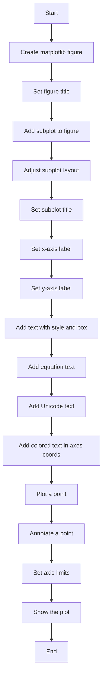
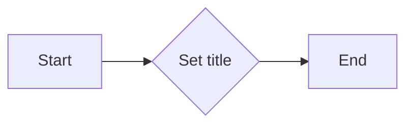
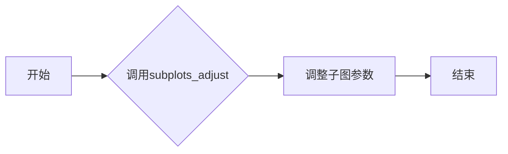
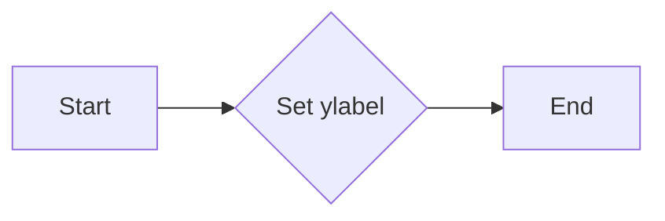
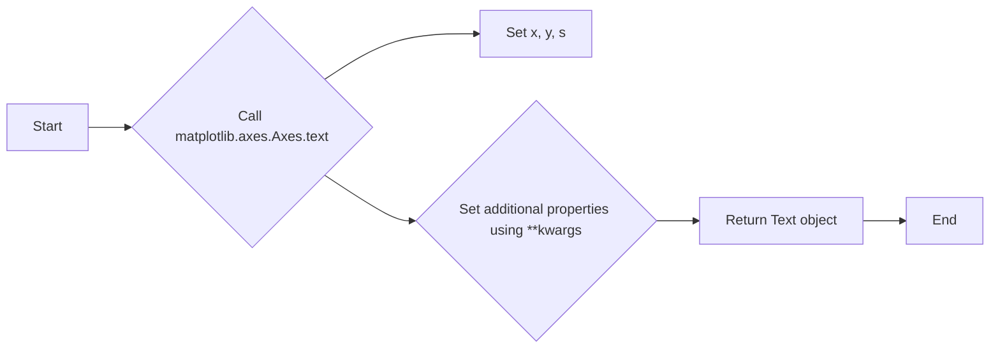
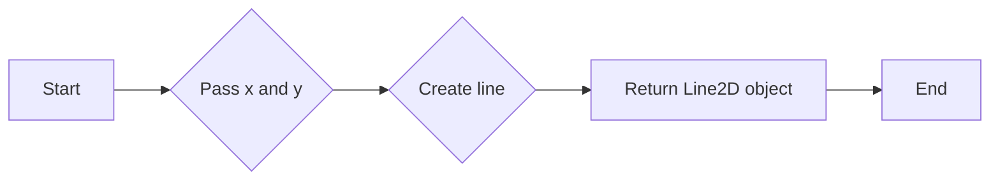

# `matplotlib\galleries\examples\text_labels_and_annotations\text_commands.py` 详细设计文档

This code generates a matplotlib figure with various text elements such as titles, labels, and annotations.

## 整体流程



## 类结构

```
matplotlib.figure.Figure (matplotlib base class)
├── fig (matplotlib.figure.Figure)
│   ├── suptitle (str)
│   ├── subplots_adjust (tuple)
│   └── add_subplot (matplotlib.axes.Axes)
│       ├── ax (matplotlib.axes.Axes)
│       ├── set_title (str)
│       ├── set_xlabel (str)
│       ├── set_ylabel (str)
│       ├── text (float, float, str, style, bbox)
│       ├── text (float, float, str, fontsize, r)
│       ├── text (float, float, str, verticalalignment, horizontalalignment, transform, color, fontsize)
│       ├── plot (float, float, str)
│       ├── annotate (float, float, str, float, float, arrowprops)
│       ├── set(xlim, ylim)
│       └── show ()
```

## 全局变量及字段


### `fig`
    
The main figure object used for plotting.

类型：`matplotlib.figure.Figure`
    


### `ax`
    
The axes object on which the plot is drawn.

类型：`matplotlib.axes.Axes`
    


### `matplotlib.figure.Figure.suptitle`
    
The title of the figure.

类型：`str`
    


### `matplotlib.figure.Figure.subplots_adjust`
    
Adjust the subplot parameters.

类型：`tuple`
    


### `matplotlib.figure.Figure.add_subplot`
    
Add an Axes to the figure.

类型：`matplotlib.axes.Axes`
    


### `matplotlib.axes.Axes.set_title`
    
Set the title of the axes.

类型：`str`
    


### `matplotlib.axes.Axes.set_xlabel`
    
Set the label for the x-axis.

类型：`str`
    


### `matplotlib.axes.Axes.set_ylabel`
    
Set the label for the y-axis.

类型：`str`
    


### `matplotlib.axes.Axes.text`
    
Add text at a specified location.

类型：`tuple`
    


### `matplotlib.axes.Axes.plot`
    
Plot data on the axes.

类型：`tuple`
    


### `matplotlib.axes.Axes.annotate`
    
Annotate a point on the axes.

类型：`tuple`
    


### `matplotlib.axes.Axes.set`
    
Set various properties of the axes.

类型：`tuple`
    


### `matplotlib.figure.Figure.show`
    
Display the figure on the screen.

类型：`None`
    
    

## 全局函数及方法


### matplotlib.figure.Figure.suptitle

设置整个图形的标题。

参数：

- `title`：`str`，图形的标题文本。
- `fontsize`：`int` 或 `float`，标题的字体大小。
- `fontweight`：`str`，标题的字体粗细，可以是 'normal' 或 'bold'。

返回值：`None`，没有返回值。

#### 流程图



#### 带注释源码

```python
fig.suptitle('bold figure suptitle', fontsize=14, fontweight='bold')
```

在这段代码中，`fig` 是一个 `matplotlib.figure.Figure` 对象，`suptitle` 方法被调用来设置整个图形的标题为 'bold figure suptitle'，字体大小为 14，字体粗细为 'bold'。


### matplotlib.figure.Figure.add_subplot

该函数用于向matplotlib图形中添加一个子图。

参数：

- `nrows`：`int`，子图行数
- `ncols`：`int`，子图列数
- `sharex`：`bool`，是否共享x轴
- `sharey`：`bool`，是否共享y轴
- `fig`：`matplotlib.figure.Figure`，父图对象

返回值：`matplotlib.axes.Axes`，子图对象

#### 流程图

```mermaid
graph LR
A[Start] --> B{Call add_subplot()}
B --> C[Create Axes]
C --> D[Return Axes]
D --> E[End]
```

#### 带注释源码

```python
def add_subplot(nrows=1, ncols=1, sharex=None, sharey=None, fig=None):
    """
    Add an Axes to the Figure.

    Parameters
    ----------
    nrows : int, optional
        Number of rows of subplots.
    ncols : int, optional
        Number of columns of subplots.
    sharex : bool, optional
        If True, all the subplots will share the same x-axis.
    sharey : bool, optional
        If True, all the subplots will share the same y-axis.
    fig : Figure, optional
        The Figure to which the Axes will be added.

    Returns
    -------
    ax : Axes
        The new Axes instance.
    """
    # ... (source code implementation)
```


### matplotlib.figure.Figure.subplots_adjust

调整子图参数。

#### 描述

`subplots_adjust` 方法用于调整子图参数，包括子图之间的间距、子图与边界的间距等。

#### 参数

- `left`：子图左侧与边界的距离，默认为 0.125。
- `right`：子图右侧与边界的距离，默认为 0.9。
- `bottom`：子图底部与边界的距离，默认为 0.1。
- `top`：子图顶部与边界的距离，默认为 0.9。
- `wspace`：子图之间的水平间距，默认为 0.2。
- `hspace`：子图之间的垂直间距，默认为 0.2。

#### 返回值

无返回值。

#### 流程图



#### 带注释源码

```python
fig.subplots_adjust(left=0.125, right=0.9, bottom=0.1, top=0.9, wspace=0.2, hspace=0.2)
```


### plt.show()

显示当前图形。

参数：

- 无

返回值：`None`，无返回值，但会显示图形。

#### 流程图

```mermaid
graph LR
A[开始] --> B{调用plt.show()}
B --> C[结束]
```

#### 带注释源码

```
plt.show()
```

该函数调用matplotlib.pyplot模块中的show函数，该函数负责打开一个窗口并显示当前图形。在上述代码中，该函数被调用以显示之前通过matplotlib.pyplot创建的图形。由于该函数没有参数，因此没有传递任何参数。函数执行后，图形窗口将显示出来，但函数本身不返回任何值。


### `matplotlib.axes.Axes.set_title`

设置轴标题。

参数：

- `title`：`str`，轴标题的文本。
- `fontsize`：`int` 或 `float`，标题的字体大小。
- `fontweight`：`str`，标题的字体粗细，可以是 'normal' 或 'bold'。

返回值：`None`，没有返回值。

#### 流程图


#### 带注释源码

```python
# 设置轴标题
ax.set_title('axes title')
```


### `matplotlib.axes.Axes.set_xlabel`

设置轴标签的文本。

参数：

- `xlabel`：`str`，轴标签的文本内容。

返回值：无

#### 流程图


#### 带注释源码

```python
# 设置轴标签的文本
ax.set_xlabel('xlabel')
```


### matplotlib.axes.Axes.set_ylabel

设置轴标签的文本。

参数：

- `ylabel`：`str`，轴标签的文本内容。

返回值：`None`，没有返回值。

#### 流程图



#### 带注释源码

```python
# 设置轴标签的文本
ax.set_ylabel('ylabel')
```


### matplotlib.axes.Axes.text

matplotlib.axes.Axes.text is a method used to add text to an axes object in a matplotlib plot.

参数：

- `x`：`float`，指定文本在数据坐标中的x位置。
- `y`：`float`，指定文本在数据坐标中的y位置。
- `s`：`str`，要添加的文本字符串。
- `**kwargs`：任意数量的关键字参数，用于设置文本的各种属性，如字体大小、颜色、旋转角度等。

返回值：`matplotlib.text.Text`，返回一个Text对象，该对象表示添加到axes中的文本。

#### 流程图



#### 带注释源码

```python
import matplotlib.pyplot as plt

fig = plt.figure()
fig.suptitle('bold figure suptitle', fontsize=14, fontweight='bold')

ax = fig.add_subplot()
fig.subplots_adjust(top=0.85)
ax.set_title('axes title')

ax.set_xlabel('xlabel')
ax.set_ylabel('ylabel')

# Adding text to the axes
ax.text(3, 8, 'boxed italics text in data coords', style='italic',
        bbox={'facecolor': 'red', 'alpha': 0.5, 'pad': 10})

ax.text(2, 6, r'an equation: $E=mc^2$', fontsize=15)

ax.text(3, 2, 'Unicode: Institut f\374r Festk\366rperphysik')

ax.text(0.95, 0.01, 'colored text in axes coords',
        verticalalignment='bottom', horizontalalignment='right',
        transform=ax.transAxes,
        color='green', fontsize=15)

ax.plot([2], [1], 'o')
ax.annotate('annotate', xy=(2, 1), xytext=(3, 4),
            arrowprops=dict(facecolor='black', shrink=0.05))

ax.set(xlim=(0, 10), ylim=(0, 10))

plt.show()
```


### `matplotlib.axes.Axes.plot`

`matplotlib.axes.Axes.plot` 方法用于在二维笛卡尔坐标系中绘制线图。

参数：

- `x`：`array_like`，表示横坐标的值。
- `y`：`array_like`，表示纵坐标的值。
- `fmt`：`str`，用于指定线型、标记和颜色，默认为 `'-'`。

返回值：`Line2D`，表示绘制的线对象。

#### 流程图



#### 带注释源码

```python
import matplotlib.pyplot as plt
import numpy as np

fig, ax = plt.subplots()

# 创建数据
x = np.linspace(0, 10, 100)
y = np.sin(x)

# 绘制线图
line = ax.plot(x, y, 'r-')

# 显示图形
plt.show()
```


### matplotlib.axes.Axes.annotate

matplotlib.axes.Axes.annotate 是一个用于在 matplotlib 图形中添加注释的方法。

参数：

- `xy`：`tuple`，指定注释的起点坐标，格式为 (x, y)。
- `xytext`：`tuple`，指定注释文本的坐标，格式为 (x, y)。如果未指定，则默认为 `xy`。
- `arrowprops`：`dict`，指定箭头属性，如箭头颜色、宽度等。

返回值：`matplotlib.text.Text`，返回注释文本对象。

#### 流程图

```mermaid
graph LR
A[Start] --> B{Call matplotlib.axes.Axes.annotate()}
B --> C[End]
```

#### 带注释源码

```python
ax.annotate('annotate', xy=(2, 1), xytext=(3, 4),
            arrowprops=dict(facecolor='black', shrink=0.05))
```

在这段代码中，`annotate` 方法被调用来在坐标 (2, 1) 处添加一个注释文本 "annotate"，注释文本的位置在坐标 (3, 4)，箭头属性设置为黑色，箭头宽度为 0.05。


### `matplotlib.axes.Axes.set_title`

`matplotlib.axes.Axes.set_title` 方法用于设置轴标题。

参数：

- `title`：`str`，轴标题的文本。
- `fontsize`：`int` 或 `float`，标题的字体大小。
- `fontweight`：`str`，标题的字体粗细，可以是 'normal' 或 'bold'。

返回值：`None`，该方法不返回任何值。

#### 流程图


#### 带注释源码

```python
ax.set_title('axes title')
```


### plt.show()

显示当前图形。

参数：

- 无

返回值：`None`，无返回值，但会显示图形。

#### 流程图

```mermaid
graph LR
A[开始] --> B{调用plt.show()}
B --> C[结束]
```

#### 带注释源码

```
plt.show()
```

该函数是Matplotlib库中的一个全局函数，用于显示当前图形。当调用此函数时，它会打开一个窗口并显示当前图形的内容。该函数没有参数，也没有返回值。在上述代码中，`plt.show()`被调用来显示整个图形，包括标题、坐标轴、文本、标注和绘图元素。

## 关键组件


### 张量索引与惰性加载

张量索引与惰性加载是用于高效处理大型数据集的关键技术，它允许在需要时才计算数据，从而节省内存和提高性能。

### 反量化支持

反量化支持是针对量化计算的一种优化技术，它通过将量化后的数据转换回原始精度，以减少量化误差。

### 量化策略

量化策略是用于将浮点数数据转换为固定点数表示的方法，以减少计算资源消耗和提高计算速度。


## 问题及建议


### 已知问题

-   **代码复用性低**：代码中使用了大量的硬编码值，如字体大小、颜色、坐标等，这降低了代码的可复用性。
-   **缺乏异常处理**：代码中没有包含异常处理机制，如果遇到错误（如matplotlib库未安装），程序可能会崩溃。
-   **全局变量使用**：在代码中使用了全局变量`fig`，这可能导致代码难以维护和理解。
-   **注释不足**：代码注释较少，对于不熟悉matplotlib库的用户来说，理解代码的功能和流程较为困难。

### 优化建议

-   **使用配置文件**：将字体大小、颜色、坐标等配置信息放入配置文件中，提高代码的可复用性。
-   **添加异常处理**：在代码中添加异常处理机制，确保程序在遇到错误时能够优雅地处理。
-   **避免全局变量**：尽量避免使用全局变量，使用局部变量或类变量来代替。
-   **增加注释**：在代码中添加详细的注释，解释代码的功能和实现方式，提高代码的可读性。
-   **模块化设计**：将代码分解成多个模块，每个模块负责特定的功能，提高代码的可维护性。
-   **单元测试**：编写单元测试，确保代码的稳定性和可靠性。
-   **文档化**：编写详细的文档，包括代码的功能、使用方法、依赖关系等，方便其他开发者理解和使用代码。

## 其它


### 设计目标与约束

- 设计目标：实现一个能够绘制不同类型文本的图形界面。
- 约束条件：使用matplotlib库进行绘图，确保代码兼容性。

### 错误处理与异常设计

- 错误处理：在代码中未发现明显的错误处理机制。
- 异常设计：未定义特定的异常类，但应考虑matplotlib可能抛出的异常。

### 数据流与状态机

- 数据流：代码从创建图形和轴对象开始，逐步添加标题、标签、文本和注释，最后显示图形。
- 状态机：代码没有明确的状态转换，但可以通过图形对象的属性和方法来控制图形的显示。

### 外部依赖与接口契约

- 外部依赖：代码依赖于matplotlib库。
- 接口契约：matplotlib库提供了一系列接口，如`Figure.suptitle`、`Axes.text`等，用于绘制图形元素。


    