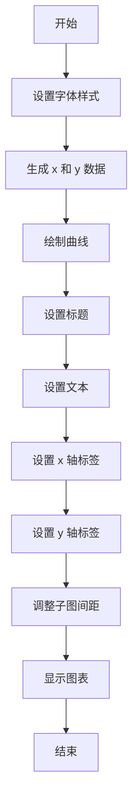
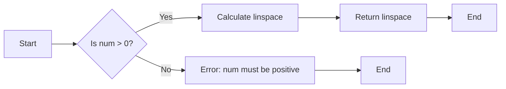
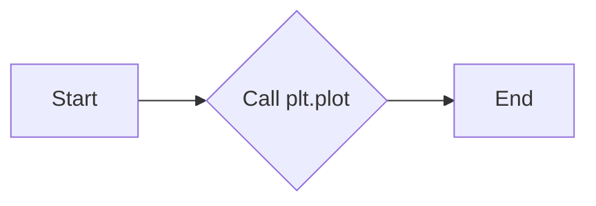
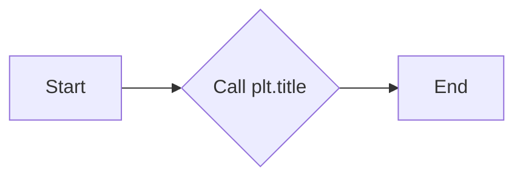
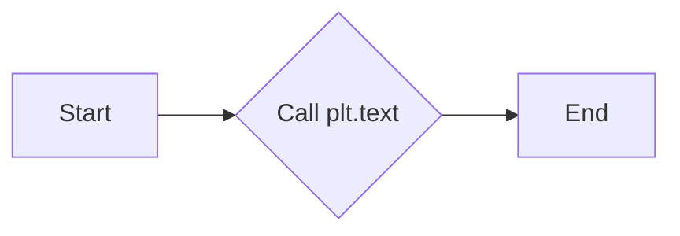
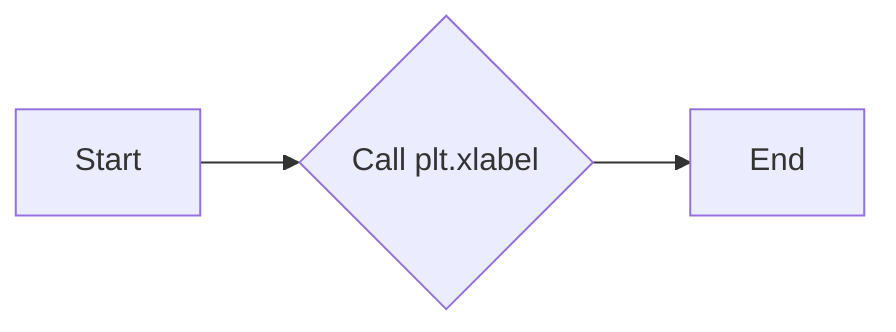
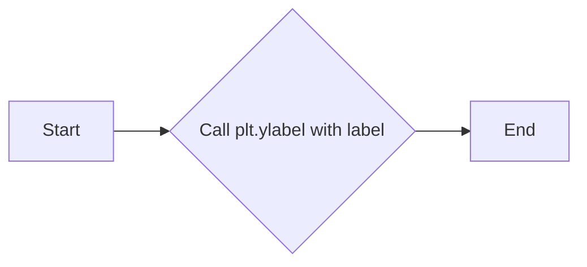
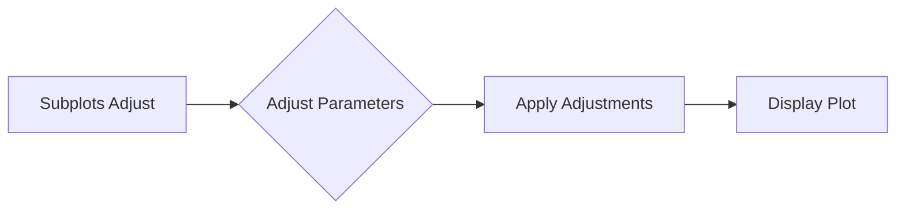
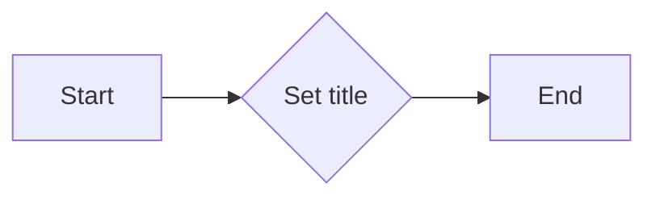
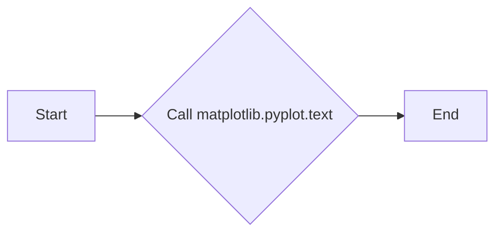

# `matplotlib\galleries\examples\text_labels_and_annotations\text_fontdict.py` 详细设计文档

This code defines a dictionary of font options to be used across multiple text and label objects in a matplotlib plot.

## 整体流程



## 类结构

```
matplotlib.pyplot (matplotlib 库)
├── font (全局变量)
│   ├── family
│   ├── color
│   ├── weight
│   └── size
└── plt (全局变量)
    ├── plot
    ├── title
    ├── text
    ├── xlabel
    ├── ylabel
    ├── subplots_adjust
    └── show
```

## 全局变量及字段


### `font`
    
Dictionary containing font options for matplotlib text and labels.

类型：`dict`
    


### `x`
    
Numpy array representing the x-axis values for the plot.

类型：`numpy.ndarray`
    


### `y`
    
Numpy array representing the y-axis values for the plot.

类型：`numpy.ndarray`
    


### `matplotlib.pyplot.font`
    
Dictionary containing font options for matplotlib text and labels.

类型：`dict`
    


### `matplotlib.pyplot.plt`
    
The matplotlib.pyplot module instance.

类型：`matplotlib.pyplot`
    


### `matplotlib.pyplot.plot`
    
Method to create a line plot.

类型：`None`
    


### `matplotlib.pyplot.title`
    
Method to set the title of the plot.

类型：`None`
    


### `matplotlib.pyplot.text`
    
Method to add text annotations to the plot.

类型：`None`
    


### `matplotlib.pyplot.xlabel`
    
Method to set the label for the x-axis of the plot.

类型：`None`
    


### `matplotlib.pyplot.ylabel`
    
Method to set the label for the y-axis of the plot.

类型：`None`
    


### `matplotlib.pyplot.subplots_adjust`
    
Method to adjust the spacing between subplots.

类型：`None`
    


### `matplotlib.pyplot.show`
    
Method to display the plot.

类型：`None`
    
    

## 全局函数及方法


### np.linspace

`np.linspace` 是 NumPy 库中的一个函数，用于生成线性间隔的数字数组。

参数：

- `start`：`float`，起始值。
- `stop`：`float`，结束值。
- `num`：`int`，生成的数组中的数字数量。

返回值：`numpy.ndarray`，一个包含线性间隔数字的数组。

#### 流程图



#### 带注释源码

```
x = np.linspace(0.0, 5.0, 100)
# x is an array of 100 linearly spaced numbers between 0.0 and 5.0
```


### np.cos

`np.cos` 是 NumPy 库中的一个函数，用于计算输入数组中每个元素的余弦值。

参数：

- `x`：`numpy.ndarray`，输入数组，包含要计算余弦值的数值。

返回值：`numpy.ndarray`，包含输入数组中每个元素的余弦值。

#### 流程图

```mermaid
graph TD
A[Start] --> B[Input: numpy.ndarray x]
B --> C[Calculate cos(x) for each element in x]
C --> D[Return numpy.ndarray of cosines]
D --> E[End]
```

#### 带注释源码

```
import numpy as np

# np.cos is a function that calculates the cosine of each element in the input array x.
# The input array x is a numpy.ndarray containing the values for which the cosine is to be calculated.
x = np.linspace(0.0, 5.0, 100)
y = np.cos(2*np.pi*x) * np.exp(-x)
```


### np.exp

计算自然指数函数的值。

参数：

-  `x`：`numpy.ndarray`，输入数组，表示要计算自然指数的值。

返回值：`numpy.ndarray`，输出数组，包含与输入数组相同形状的自然指数值。

#### 流程图

```mermaid
graph LR
A[Start] --> B{Is x a numpy.ndarray?}
B -- Yes --> C[Calculate exp(x)]
B -- No --> D[Error: x must be a numpy.ndarray]
C --> E[End]
```

#### 带注释源码

```python
import numpy as np

def np_exp(x):
    """
    Calculate the exponential of each element in the input array x.
    
    Parameters:
    x : numpy.ndarray
        Input array to calculate the exponential of.
    
    Returns:
    numpy.ndarray
        Output array containing the exponential of each element in x.
    """
    return np.exp(x)
```


### plt.plot

`plt.plot` 是 Matplotlib 库中的一个函数，用于绘制二维线条图。

参数：

- `x`：`numpy.ndarray`，表示 x 轴的数据点。
- `y`：`numpy.ndarray`，表示 y 轴的数据点。
- `'k'`：`str`，表示线条的颜色，这里使用 `'k'` 表示黑色。

返回值：`Line2D`，表示绘制的线条对象。

#### 流程图



#### 带注释源码

```
plt.plot(x, y, 'k')  # 绘制线条，x 和 y 是数据点，'k' 表示线条颜色为黑色
```


### plt.title

`plt.title` 是一个用于设置图表标题的函数。

参数：

- `title`：`str`，图表的标题文本。
- `fontdict`：`dict`，用于设置标题的字体样式。

返回值：无，该函数不返回任何值。

#### 流程图



#### 带注释源码

```python
plt.title('Damped exponential decay', fontdict=font)
```

在这段代码中，`plt.title` 被调用来设置图表的标题为 `'Damped exponential decay'`，并且使用了一个字体字典 `fontdict` 来定义标题的样式。


### plt.text

`plt.text` 是一个用于在 Matplotlib 图形上添加文本的函数。

参数：

- `x`：`float`，文本的 x 坐标。
- `y`：`float`，文本的 y 坐标。
- `s`：`str`，要显示的文本字符串。
- `fontdict`：`dict`，文本的字体字典，用于定义文本的样式。

返回值：`Text` 对象，表示添加到图形上的文本。

#### 流程图



#### 带注释源码

```python
plt.text(2, 0.65, r'$\cos(2 \pi t) \exp(-t)$', fontdict=font)
```

在这段代码中，`plt.text` 被调用来在坐标 (2, 0.65) 处添加文本 `r'$\cos(2 \pi t) \exp(-t)$'`，使用之前定义的 `font` 字典来设置文本的样式。


### plt.xlabel

`plt.xlabel` 是一个全局函数，用于设置 x 轴标签的文本。

参数：

- `xlabel`：`str`，x 轴标签的文本内容。

返回值：无，该函数不返回任何值。

#### 流程图



#### 带注释源码

```
plt.xlabel('time (s)', fontdict=font)
```

在这个例子中，`plt.xlabel` 被调用以设置 x 轴标签为 "time (s)"，并且使用了之前定义的 `font` 字典来控制文本样式。


### plt.ylabel

`plt.ylabel` 是 Matplotlib 库中的一个函数，用于设置 y 轴标签。

参数：

- `label`：`str`，y 轴标签的文本内容。

返回值：`None`，没有返回值，该函数直接修改当前的 y 轴标签。

#### 流程图



#### 带注释源码

```
plt.ylabel('voltage (mV)')
```

该行代码设置了 y 轴标签为 "voltage (mV)"。


### plt.subplots_adjust

`plt.subplots_adjust` 是一个用于调整子图参数的函数，它允许用户调整子图之间的间距以及子图与边缘之间的间距。

参数：

- `left`：`float`，子图左侧与边缘之间的距离（以小数形式表示的分数）。
- `right`：`float`，子图右侧与边缘之间的距离（以小数形式表示的分数）。
- `top`：`float`，子图顶部与边缘之间的距离（以小数形式表示的分数）。
- `bottom`：`float`，子图底部与边缘之间的距离（以小数形式表示的分数）。
- `wspace`：`float`，子图之间的水平间距（以小数形式表示的分数）。
- `hspace`：`float`，子图之间的垂直间距（以小数形式表示的分数）。

返回值：无

#### 流程图



#### 带注释源码

```
# Tweak spacing to prevent clipping of ylabel
plt.subplots_adjust(left=0.15)
```

在这段代码中，`plt.subplots_adjust(left=0.15)` 调整了子图的左侧间距，确保了 `ylabel` 不会被裁剪。参数 `left=0.15` 表示子图左侧距离边缘的间距是整个图形宽度的 15%。


### plt.show()

显示当前图形。

参数：

- 无

返回值：无

#### 流程图

```mermaid
graph LR
A[开始] --> B{调用plt.show()}
B --> C[结束]
```

#### 带注释源码

```
plt.show()
```


### plt.plot

`plt.plot` 是一个用于绘制二维线条的函数。

参数：

- `x`：`numpy.ndarray`，x轴的数据点。
- `y`：`numpy.ndarray`，y轴的数据点。
- `'k'`：`str`，线条的颜色，这里使用 `'k'` 表示黑色。

返回值：`matplotlib.lines.Line2D`，绘制的线条对象。

#### 流程图


#### 带注释源码

```
plt.plot(x, y, 'k')  # 绘制线条，x和y是数据点，'k'表示线条颜色为黑色
```


### plt.title

`plt.title` 是 `matplotlib.pyplot` 模块中的一个函数，用于设置图表的标题。

参数：

- `title`：`str`，图表的标题文本。
- `fontdict`：`dict`，用于设置标题的字体样式，如字体家族、颜色、粗细和大小。

返回值：无

#### 流程图



#### 带注释源码

```python
plt.title('Damped exponential decay', fontdict=font)
```

在这段代码中，`plt.title` 函数被调用来设置图表的标题为 `'Damped exponential decay'`，并且使用了一个字体字典 `fontdict` 来定义标题的样式。


### matplotlib.pyplot.text

matplotlib.pyplot.text 是一个用于在 matplotlib 图形上添加文本的函数。

参数：

- `x`：`float`，文本的 x 坐标。
- `y`：`float`，文本的 y 坐标。
- `s`：`str`，要显示的文本字符串。
- `fontdict`：`dict`，文本的字体字典，可以包含字体大小、颜色、样式等。

返回值：`Text` 对象，表示添加到图形上的文本。

#### 流程图



#### 带注释源码

```python
plt.text(2, 0.65, r'$\cos(2 \pi t) \exp(-t)$', fontdict=font)
```

在这段代码中，`plt.text` 被调用来在坐标 (2, 0.65) 处添加文本 `r'$\cos(2 \pi t) \exp(-t)$'`，并且使用之前定义的 `font` 字典来设置文本的样式。


### plt.xlabel

`plt.xlabel` 是 `matplotlib.pyplot` 模块中的一个函数，用于设置 x 轴标签的文本。

参数：

- `xlabel`：`str`，x 轴标签的文本内容。

返回值：`None`，没有返回值，直接在图表上设置 x 轴标签。

#### 流程图


#### 带注释源码

```
plt.xlabel('time (s)', fontdict=font)
```

在这个例子中，`plt.xlabel` 被调用以设置 x 轴标签为 "time (s)"，并且使用了之前定义的 `font` 字典来设置文本样式。


### plt.ylabel

`plt.ylabel` 是 `matplotlib.pyplot` 模块中的一个函数，用于设置 y 轴标签。

参数：

- `label`：`str`，y 轴标签的文本内容。
- `fontdict`：`dict`，用于设置标签的字体样式，如字体大小、颜色等。

返回值：`None`，该函数没有返回值。

#### 流程图


#### 带注释源码

```
plt.ylabel('voltage (mV)', fontdict=font)
```

该行代码调用 `plt.ylabel` 函数，设置 y 轴标签为 "voltage (mV)"，并使用之前定义的 `font` 字典来设置标签的字体样式。


### plt.subplots_adjust

`plt.subplots_adjust` 是一个用于调整子图参数的函数，它允许用户调整子图之间的间距以及子图与边缘之间的间距。

参数：

- `left`：`float`，子图左侧与边缘之间的距离（以小数形式表示的分数）。
- `right`：`float`，子图右侧与边缘之间的距离（以小数形式表示的分数）。
- `top`：`float`，子图顶部与边缘之间的距离（以小数形式表示的分数）。
- `bottom`：`float`，子图底部与边缘之间的距离（以小数形式表示的分数）。
- `wspace`：`float`，子图之间的水平间距（以小数形式表示的分数）。
- `hspace`：`float`，子图之间的垂直间距（以小数形式表示的分数）。

返回值：无

#### 流程图


#### 带注释源码

```
plt.subplots_adjust(left=0.15)
```

此行代码将子图左侧与边缘之间的距离设置为15%的图形宽度。


### plt.show()

`plt.show()` 是一个全局函数，用于显示当前图形。

参数：

- 无

返回值：无

#### 流程图

```mermaid
graph LR
A[Start] --> B{plt.show() called?}
B -- Yes --> C[End]
B -- No --> A
```

#### 带注释源码

```
plt.show()  # 显示当前图形
```


## 关键组件


### 张量索引与惰性加载

张量索引与惰性加载允许在处理大型数据集时，只加载和处理需要的数据部分，从而提高效率。

### 反量化支持

反量化支持使得代码能够处理非整数类型的量化数据，增加了代码的灵活性和适用范围。

### 量化策略

量化策略定义了如何将浮点数数据转换为固定点数表示，以减少计算资源消耗，提高运行速度。


## 问题及建议


### 已知问题

-   {问题1}：代码中使用的全局变量`font`定义了文本样式，但在多个地方重复使用，这可能导致维护困难。如果需要修改字体样式，需要在每个使用的地方进行修改。
-   {问题2}：代码中使用了`matplotlib.pyplot`库，但没有进行异常处理，如果出现绘图错误，程序可能会崩溃。
-   {问题3}：代码中没有使用任何设计模式，这可能导致代码的可扩展性和可维护性较差。

### 优化建议

-   {建议1}：将字体样式封装成一个类或函数，以便在需要时可以轻松地修改和重用。
-   {建议2}：在绘图代码中添加异常处理，确保在出现错误时程序能够优雅地处理异常。
-   {建议3}：考虑使用设计模式，如工厂模式或策略模式，来提高代码的可扩展性和可维护性。
-   {建议4}：如果代码需要在不同的环境中运行，考虑使用配置文件来管理字体样式和其他配置，以便于在不同环境中进行适配。
-   {建议5}：如果代码需要处理大量的文本对象和标签，考虑使用样式继承或模板方法模式来减少重复代码。


## 其它


### 设计目标与约束

- 设计目标：实现一个可配置的文本样式控制功能，允许用户通过字典共享样式参数。
- 约束条件：使用matplotlib库进行绘图，确保样式参数在多个文本对象和标签间共享。

### 错误处理与异常设计

- 错误处理：确保在样式参数传递过程中，任何无效的参数类型或值都能被捕获并抛出异常。
- 异常设计：定义自定义异常类，如`InvalidFontStyleError`，以提供更具体的错误信息。

### 数据流与状态机

- 数据流：用户定义的样式参数通过字典传递给matplotlib的绘图函数，如`plot`、`title`、`text`等。
- 状态机：无状态机，因为代码执行流程是线性的，没有循环或分支导致状态变化。

### 外部依赖与接口契约

- 外部依赖：matplotlib库，用于绘图和样式设置。
- 接口契约：matplotlib绘图函数的接口，如`plot`、`title`、`text`等，它们接受样式参数字典。


    