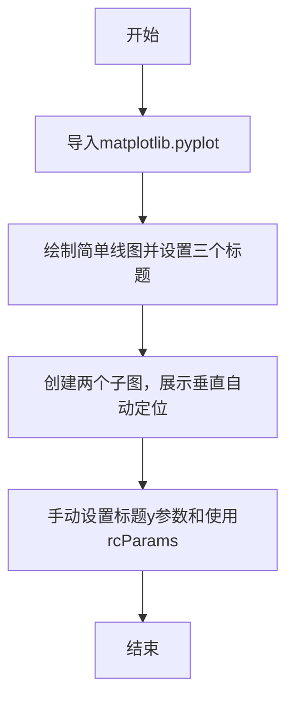

# `matplotlib\galleries\examples\text_labels_and_annotations\titles_demo.py` 详细设计文档

该代码是一个Matplotlib示例脚本，演示了如何设置图表标题的水平位置（居中、左对齐、右对齐）以及垂直位置的自动调整和手动配置，包括使用rcParams。

## 整体流程



## 类结构

```
该代码无自定义类，结构层次为空。
```

## 全局变量及字段


### `plt`
    
matplotlib.pyplot 模块，提供绘图接口

类型：`module`
    


### `fig`
    
matplotlib Figure 对象，表示整个图形窗口

类型：`matplotlib.figure.Figure`
    


### `axs`
    
matplotlib Axes 数组，包含子图

类型：`numpy.ndarray of matplotlib.axes.Axes`
    


### `ax`
    
matplotlib Axes 对象，表示单个子图

类型：`matplotlib.axes.Axes`
    


    

## 全局函数及方法


## 关键组件


### plt.title() / ax.set_title()

设置图表标题的核心方法，支持loc参数控制水平位置（'left'、'center'、'right'），支持y参数手动控制垂直位置，支持pad参数控制标题与图表边缘的间距。

### loc参数

控制标题水平对齐方式，可选'left'（左对齐）、'center'（居中，默认值）、'right'（右对齐）。

### y参数

手动设置标题的垂直位置，使用axes-relative坐标系，1.0表示顶部，0.0表示底部。

### pad参数

设置标题与图表边缘的内边距，单位为points，负值会使标题更靠近图表内容。

### plt.rcParams['axes.titley']

全局配置参数，控制标题的默认y坐标（axes-relative坐标系）。

### plt.rcParams['axes.titlepad']

全局配置参数，控制标题的默认内边距（单位为points）。

### ax.xaxis.set_label_position('top')

将x轴标签位置设置到顶部，用于与顶部标题配合展示。

### ax.xaxis.tick_top()

将x轴刻度线位置设置到图表顶部，创建顶部x轴效果。

### layout='constrained'

图表布局管理器，自动调整子图位置以避免元素重叠，确保标题与轴标签不冲突。


## 问题及建议


### 已知问题

-   **全局状态污染**：使用`plt.rcParams['axes.titley']`修改全局配置后未恢复，可能影响后续代码的渲染行为
-   **资源管理不当**：未显式创建figure且多个`plt.show()`之间未显式关闭figure，可能导致资源泄漏
-   **缺少错误处理**：代码未对可能的异常（如rcParams设置失败、subplots创建失败）进行处理
-   **魔法数字**：如`pad=-14`、`y=1.0`等数值缺乏常量定义或注释说明
-   **混合接口使用**：代码中混用了pyplot接口（plt.title、plt.show）和面向对象接口（ax.set_title），降低了代码一致性

### 优化建议

-   **使用上下文管理器**：利用`plt.rc_context()`或显式figure管理来隔离配置变更，确保rcParams修改后自动恢复
-   **明确资源生命周期**：使用`with plt.rc_context({...}):`包装需要临时修改rcParams的代码块
-   **统一接口风格**：在示例中统一使用面向对象接口（ax.set_title而非plt.title），提高代码可维护性
-   **提取配置常量**：将硬编码的数值（如-14、1.0）提取为命名常量并添加注释说明其含义
-   **添加文档注释**：为关键代码段添加docstring说明其目的和预期行为
-   **改进figure管理**：考虑使用`fig, ax = plt.subplots()`统一管理figure生命周期，避免隐式创建


## 其它


### 设计目标与约束
该代码旨在展示Matplotlib中图表标题的定位功能，包括水平位置（居中、左对齐、右对齐）和垂直位置的自动调整与手动设置。约束条件为必须使用Matplotlib库，且需确保matplotlib已正确安装。

### 错误处理与异常设计
代码中未实现显式的错误处理机制。在实际应用中，可能出现的异常包括：matplotlib未安装导致的ImportError、rcParams参数设置不当导致的警告或无效配置、以及子图索引越界等。建议在实际使用时添加异常捕获，例如try-except块处理ImportError，以及验证rcParams值的合法性。

### 数据流与状态机
该代码的数据流较为简单，主要流程为：初始化图表 → 设置标题和标签 → 渲染显示。没有复杂的状态机，但涉及图表状态的变化，例如通过set_label_position改变轴标签位置，或通过rcParams修改全局配置，这些操作会影响后续的渲染行为。

### 外部依赖与接口契约
代码依赖matplotlib.pyplot模块和matplotlib.rcParams配置。具体接口包括：plt.plot()用于绑制数据，plt.title()和ax.set_title()用于设置标题（参数loc控制水平位置，y控制垂直位置），plt.rcParams用于全局配置（axes.titley和axes.titlepad）。所有接口均遵循Matplotlib官方文档约定。

### 性能考虑
该代码执行时间主要取决于Matplotlib的渲染性能，通常较快。优化建议包括：避免频繁调用plt.show()，在批量生成图表时可使用plt.savefig()直接保存，以减少显示开销。

### 安全性考虑
代码不涉及用户输入或敏感数据处理，安全性风险较低。但需注意在使用plt.rcParams修改全局配置时，可能影响其他图表的渲染，建议在修改后恢复默认配置。

### 可维护性与扩展性
代码结构简单，易于维护。扩展性方面，可通过封装函数实现标题定位的复用，例如创建set_title_position(ax, loc, y)函数来统一处理。此外，可添加参数化配置以支持更多定位选项。

### 测试用例或使用示例
代码本身即为使用示例。进一步测试可包括：验证不同loc参数（'left', 'center', 'right'）的效果、测试y参数范围外的行为、以及验证rcParams修改后的标题位置是否正确。

### 配置与参数说明
关键参数包括：
- loc：标题水平位置，可选'left', 'center', 'right'。
- y：标题垂直位置，默认为'auto'，也可设置为数值（坐标系相对）。
- pad：标题与轴顶部的间距，单位为点。
- axes.titley：rcParams参数，控制垂直位置的自动调整。
- axes.titlepad：rcParams参数，控制标题的间距。

    