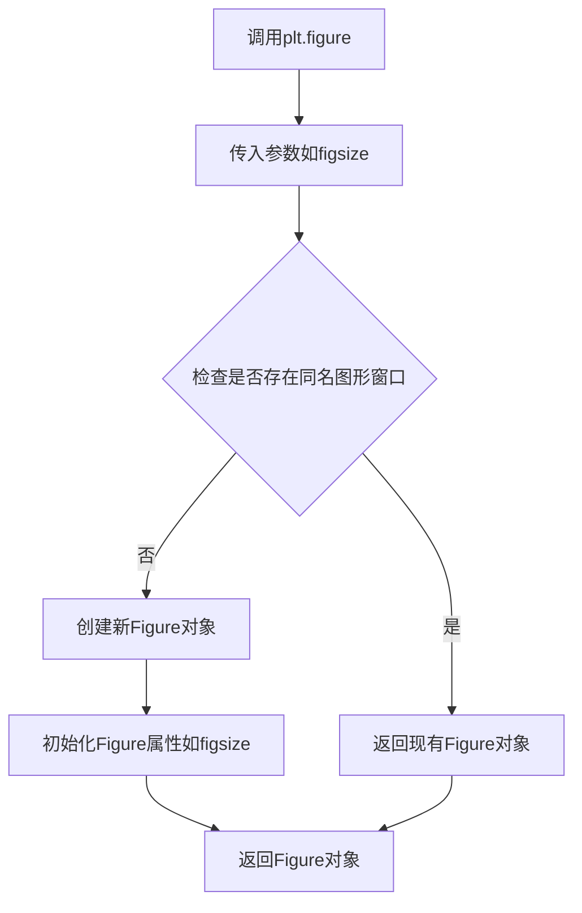
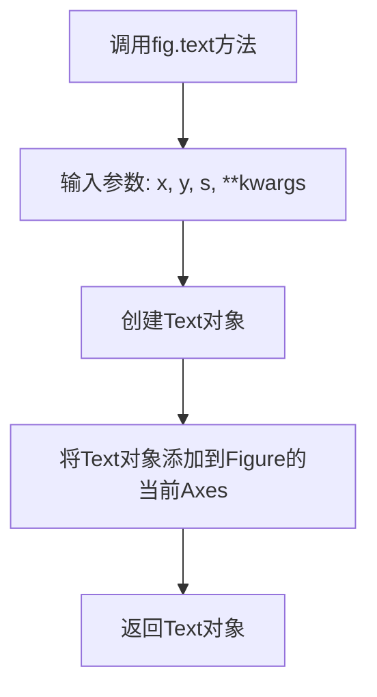
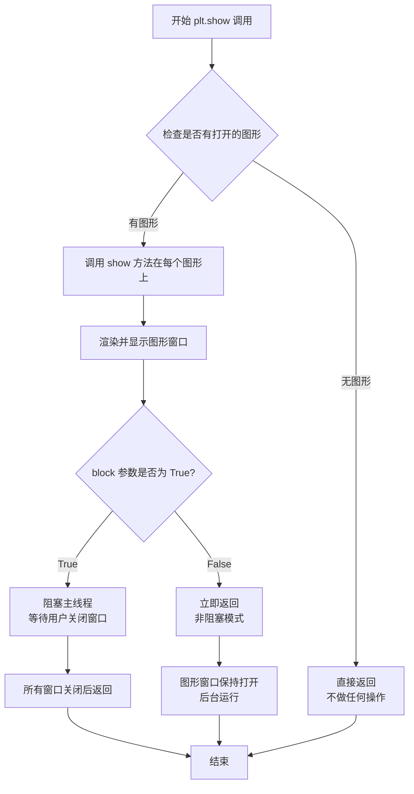
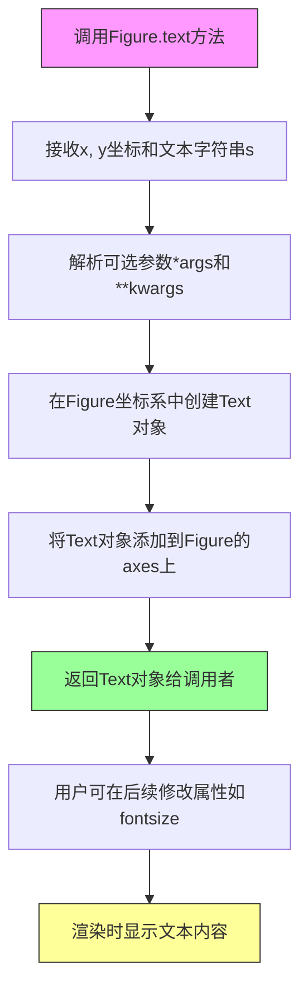

# `matplotlib\galleries\examples\text_labels_and_annotations\unicode_minus.py` 详细设计文档

该脚本通过调用 Matplotlib 库创建了一个图形窗口，并在窗口中分别使用 Unicode 减号符号（U+2212）和 ASCII 连字符（U+002D）展示数字 -1，以直观对比两种字符在当前设置下的渲染效果。

## 整体流程

```mermaid
graph TD
    A[脚本启动] --> B[导入 matplotlib.pyplot as plt]
B --> C[调用 plt.figure 创建图形实例 fig]
C --> D[调用 fig.text 在 (.15, .6) 处添加标签 'Unicode minus:' 和符号 \N{MINUS SIGN}1]
D --> E[调用 fig.text 在 (.15, .3) 处添加标签 'ASCII hyphen:' 和符号 -1]
E --> F[调用 plt.show 渲染并显示图形]
F --> G[用户关闭图形，脚本结束]
```

## 类结构

```
matplotlib.figure.Figure (图形容器类)
└── matplotlib.text.Text (文本渲染类)
```

## 全局变量及字段


### `plt`
    
matplotlib的pyplot模块，提供绘图接口

类型：`matplotlib.pyplot`
    


### `fig`
    
图形对象，表示整个matplotlib图形窗口

类型：`matplotlib.figure.Figure`
    


    

## 全局函数及方法


### plt.figure

创建并返回一个Figure对象，该对象表示一个图形窗口或画布，用于在matplotlib中绑定数据、文本和图形元素，是构建可视化图表的基础。

参数：

- `figsize`：`tuple` (float, float)，指定图形的宽和高（单位：英寸）。代码中传入(4, 2)，表示宽4英寸、高2英寸。
- `facecolor`：`str`，可选参数，指定图形背景色。代码中未使用。
- `edgecolor`：`str`，可选参数，指定图形边框颜色。代码中未使用。
- `dpi`：`float`，可选参数，指定图形的分辨率（每英寸点数）。代码中未使用。
- `figtitle`：`str`，可选参数，指定图形的标题。代码中未使用。

返回值：`matplotlib.figure.Figure`，返回新创建的Figure对象，代码中将其赋值给变量`fig`。

#### 流程图



#### 带注释源码

```python
# 导入matplotlib.pyplot模块，用于创建图形和绘图
import matplotlib.pyplot as plt

# 调用plt.figure函数创建图形
# figsize参数指定图形的宽高尺寸：(4, 2)表示宽度4英寸、高度2英寸
# 返回一个Figure对象，赋值给变量fig
fig = plt.figure(figsize=(4, 2))

# 后续可通过fig对象添加文本、坐标轴、图形等元素
fig.text(.15, .6, "Unicode minus:", fontsize=20)  # 添加文本到图形指定位置
fig.text(.85, .6, "\N{MINUS SIGN}1", ha='right', fontsize=20)
fig.text(.15, .3, "ASCII hyphen:", fontsize=20)
fig.text(.85, .3, "-1", ha='right', fontsize=20)

# 调用plt.show()显示图形（在本例中用于展示Unicode minus和ASCII hyphen的区别）
plt.show()
```


### Figure.text

描述：在matplotlib的Figure对象上添加文本标签，支持指定位置、文本内容、字体大小、对齐方式等参数，返回一个Text对象以便后续操作。

参数：
- x：`float`，文本位置的x坐标（归一化坐标，0.0至1.0之间，相对于图形宽度）
- y：`float`，文本位置的y坐标（归一化坐标，0.0至1.0之间，相对于图形高度）
- s：`str`，要显示的文本字符串
- fontsize：`int`或`str`，可选，文本的字体大小，例如20或'xx-small'，默认值为全局设置
- ha：`str`，可选，水平对齐方式，可选'left'、'center'、'right'，默认值为'left'
- va：`str`，可选，垂直对齐方式，可选'top'、'middle'、'bottom'、'baseline'，默认值为'bottom'
- **kwargs：其他关键字参数，支持matplotlib.text.Text类的属性，如color、fontweight、rotation等

返回值：`matplotlib.text.Text`，返回创建的Text对象，表示图形上的文本元素，可用于进一步自定义。

#### 流程图



#### 带注释源码

```python
import matplotlib.pyplot as plt

# 创建图形对象，设置尺寸为4英寸宽、2英寸高
fig = plt.figure(figsize=(4, 2))

# 使用text方法添加文本标签
# 参数：x坐标0.15，y坐标0.6，文本内容"Unicode minus:"，字体大小20
fig.text(.15, .6, "Unicode minus:", fontsize=20)

# 添加Unicode minus符号文本，x坐标0.85，y坐标0.6，右对齐
fig.text(.85, .6, "\N{MINUS SIGN}1", ha='right', fontsize=20)

# 添加ASCII hyphen标签，x坐标0.15，y坐标0.3
fig.text(.15, .3, "ASCII hyphen:", fontsize=20)

# 添加ASCII hyphen符号文本，x坐标0.85，y坐标0.3，右对齐
fig.text(.85, .3, "-1", ha='right', fontsize=20)

# 调用show方法显示图形
plt.show()
```


### `plt.show`

`plt.show` 是 matplotlib.pyplot 模块中的函数，用于显示所有当前打开的图形窗口，并将图形渲染到屏幕。在调用 `plt.show()` 之前，图形对象被创建并存储在内存中，但不会自动显示；只有调用 `plt.show()` 后，图形才会实际显示在屏幕上。

参数：此函数无位置参数。

- `block`：`bool`，可选参数。默认为 `True`。如果设置为 `True`，则函数会阻塞程序执行直到所有图形窗口关闭；如果设置为 `False`，则函数立即返回，图形窗口保持打开。

返回值：`None`，该函数不返回任何值。

#### 流程图



#### 带注释源码

```python
# 导入 matplotlib.pyplot 模块，通常以 plt 为别名
import matplotlib.pyplot as plt

# 创建一个图形对象，设置大小为 4x2 英寸
fig = plt.figure(figsize=(4, 2))

# 在图形中添加文本：'Unicode minus:'，位于 (0.15, 0.6) 位置，字体大小 20
fig.text(.15, .6, "Unicode minus:", fontsize=20)

# 在图形中添加文本：'\N{MINUS SIGN}1'（Unicode 减号符号 + 1），位于 (0.85, 0.6) 位置，右对齐，字体大小 20
fig.text(.85, .6, "\N{MINUS SIGN}1", ha='right', fontsize=20)

# 在图形中添加文本：'ASCII hyphen:'，位于 (0.15, 0.3) 位置，字体大小 20
fig.text(.15, .3, "ASCII hyphen:", fontsize=20)

# 在图形中添加文本：'-1'（ASCII 连字符），位于 (0.85, 0.3) 位置，右对齐，字体大小 20
fig.text(.85, .3, "-1", ha='right', fontsize=20)

# 显示图形：将所有创建的图形渲染到屏幕并显示出来
# 这是 matplotlib 的标准做法，在绘图完成后调用以显示结果
plt.show()
```


### `Figure.text`

在matplotlib的Figure对象上指定位置添加文本标签，支持自定义字体大小、对齐方式等属性，返回创建的Text对象以便后续操作。

参数：

- `x`：`float`，文本放置的x坐标（相对于Figure坐标系，范围0-1）
- `y`：`float`，文本放置的y坐标（相对于Figure坐标系，范围0-1）
- `s`：`str`，要显示的文本字符串内容
- `*args`：`tuple`，可选的位置参数，将传递给底层的Text对象
- `**kwargs`：可选的关键字参数，支持如`fontsize`（字体大小）、`ha`（水平对齐）、`va`（垂直对齐）等Text属性

返回值：`matplotlib.text.Text`，返回创建的Text对象实例，可用于后续修改文本属性或获取文本位置信息

#### 流程图



#### 带注释源码

```python
import matplotlib.pyplot as plt

# 创建一个新的Figure对象，设置尺寸为4x2英寸
fig = plt.figure(figsize=(4, 2))

# 在Figure上添加"Unicode minus:"文本
# x=.15表示在Figure宽度的15%位置，y=.6表示在Figure高度的60%位置
# fontsize=20设置字体大小为20磅
fig.text(.15, .6, "Unicode minus:", fontsize=20)

# 在右侧添加Unicode减号符号（U+2212）
# ha='right'表示文本右对齐到x坐标位置
fig.text(.85, .6, "\N{MINUS SIGN}1", ha='right', fontsize=20)

# 在下方添加"ASCII hyphen:"标签
fig.text(.15, .3, "ASCII hyphen:", fontsize=20)

# 在右侧添加ASCII连字符（U+002D）
fig.text(.85, .3, "-1", ha='right', fontsize=20)

# 显示图形（此时会触发文本的渲染，包括unicode_minus的替换）
plt.show()
```


## 关键组件


### 核心功能概述

该代码是一个matplotlib示例脚本，用于演示Unicode减号符号（U+2212）与ASCII连字符（U-002D）在负数显示上的视觉差异，通过并排对比展示两种符号的渲染效果。

### 文件整体运行流程

1. 导入matplotlib.pyplot模块
2. 创建指定尺寸（4x2英寸）的图形窗口
3. 在图形左侧添加"Unicode minus:"和"ASCII hyphen:"文本标签
4. 在图形右侧添加对应的符号显示（\N{MINUS SIGN}1和-1）
5. 调用plt.show()渲染并显示图形

### 全局变量和全局函数

#### 全局变量

- **fig**: 类型plt.Figure，图形对象容器
- **plt**: 类型module，matplotlib.pyplot模块，提供绘图API

#### 全局函数

- **plt.figure**: 创建新图形或激活现有图形
  - 参数：figsize tuple[float, float]，图形尺寸（宽, 高）英寸
  - 返回值：Figure对象

- **fig.text**: 在图形指定位置添加文本
  - 参数：x float，水平位置；y float，垂直位置；s str，要显示的文本
  - 关键字参数：fontsize int字体大小，ha str水平对齐方式
  - 返回值：Text对象

- **plt.show**: 显示所有打开的图形
  - 参数：无
  - 返回值：None

### 关键组件信息

#### plt.figure图形创建组件

创建matplotlib图形容器，是所有绘图操作的基础

#### fig.text文本渲染组件

在图形指定坐标位置添加文本内容，支持字体大小和对齐方式设置

#### \N{MINUS SIGN} Unicode符号

使用Unicode字符名称直接引用Unicode减号符号（U+2212），实现跨平台一致的符号显示

### 潜在技术债务或优化空间

1. **硬编码坐标值**：文本位置使用绝对坐标（.15, .6, .3, .85），在不同尺寸图形上可能需要调整
2. **缺乏响应式设计**：图形尺寸固定，无法适应不同显示环境
3. **重复代码模式**：多次调用fig.text()可以封装为循环或辅助函数
4. **未使用面向对象**：作为简单脚本可接受，但复杂场景应考虑使用类封装

### 其它项目

#### 设计目标与约束

- 目标：直观展示Unicode minus与ASCII hyphen的视觉差异
- 约束：matplotlib后端依赖，在无GUI环境需设置Agg后端

#### 错误处理与异常设计

- 无显式错误处理，依赖matplotlib内置异常
- 建议：添加导入检查、图形创建失败处理

#### 数据流与状态机

- 静态数据流：文本字符串 → 图形对象 → 渲染器 → 显示窗口
- 无状态机逻辑，纯展示脚本

#### 外部依赖与接口契约

- 依赖：matplotlib>=1.5，numpy（隐式）
- 接口：plt.show()为最终输出，阻塞直到用户关闭图形窗口


## 问题及建议


### 已知问题

-   **硬编码的坐标值**：位置信息（.15, .6, .85, .3）以魔法数字形式直接写入代码，缺乏变量命名和注释说明，难以理解和维护
-   **硬编码的字体大小**：字体大小20以字面量形式重复出现，未定义为可配置常量
-   **缺乏代码封装**：所有逻辑直接暴露在顶层模块中，未封装为可复用的函数或类，扩展性差
-   **重复代码模式**：添加文本标签的操作重复四次，违反了DRY（Don't Repeat Yourself）原则
-   **无错误处理**：代码未考虑任何异常情况，如字体加载失败、图形创建失败等
-   **布局计算不灵活**：使用固定比例（.15, .85）布局，在不同尺寸的figure上可能表现不一致

### 优化建议

-   **引入配置常量**：将位置坐标、字体大小等值定义为模块级常量或配置字典，提高可维护性
-   **封装为函数**：将重复的文本添加逻辑封装为函数，接受文本内容、位置、字体大小等参数
-   **使用相对布局**：考虑使用matplotlib的GridSpec或subplot2grid等布局工具，提高在不同尺寸图形上的适应性
-   **添加类型注解**：为函数参数和返回值添加类型提示，提升代码可读性和IDE支持
-   **考虑扩展性**：设计函数支持动态接收要对比的字符对列表，便于未来扩展


## 其它


### 设计目标与约束
设计目标：演示Unicode minus (U+2212) 和 ASCII hyphen (U+002D) 在matplotlib图形中的视觉差异，通过并排显示两种符号来帮助用户理解区别。约束：该示例仅用于演示目的，不涉及实际数据绘图，且由于所有 tick labels 共享相同的 unicode_minus 设置，无法在同一图中同时显示两种符号的真实 tick labels。

### 错误处理与异常设计
代码没有显式的错误处理。如果 matplotlib 后端不可用或未正确安装，plt.figure() 或 plt.show() 可能抛出 RuntimeError。可能的异常包括：ImportError 如果 matplotlib 未安装，RuntimeError 如果没有可用的图形后端，或 AttributeError 如果使用了不兼容的 matplotlib 版本。

### 数据流与状态机
不适用。该代码是过程式的，没有复杂的数据流或状态机。它只是顺序执行：创建图形、添加文本、显示图形，没有状态管理。

### 外部依赖与接口契约
外部依赖：matplotlib>=3.0。接口契约：使用 matplotlib.pyplot 模块的 figure() 函数创建图形，text() 函数添加文本，show() 函数显示图形。所有函数都是 matplotlib 的公共 API。

### 性能考虑
性能不是该代码的关注点。它只创建了一个包含少量文本的简单图形，执行时间可以忽略不计。

### 安全性考虑
该代码没有用户输入，也不处理敏感数据，因此没有安全风险。

### 可维护性与扩展性
代码结构简单，易于维护。可以轻松修改文本内容、字体大小或图形大小。未来可以扩展为显示其他字符或符号，或集成到更大的 matplotlib 项目中。

### 测试策略
由于这是一个演示脚本，通常不需要单元测试。但可以编写集成测试来验证图形是否成功创建、文本是否正确添加，以及 show() 是否能正常调用而不报错。

### 部署与配置
部署时只需确保 matplotlib 已安装。没有特殊的配置要求；但需要注意图形后端（如 TkAgg, Qt5Agg）的可用性。

### 文档与注释
代码本身已有详细的文档字符串，说明了 Unicode minus 的背景和示例的目的。代码中的注释解释了显示的文本内容。文档已经足够。

    