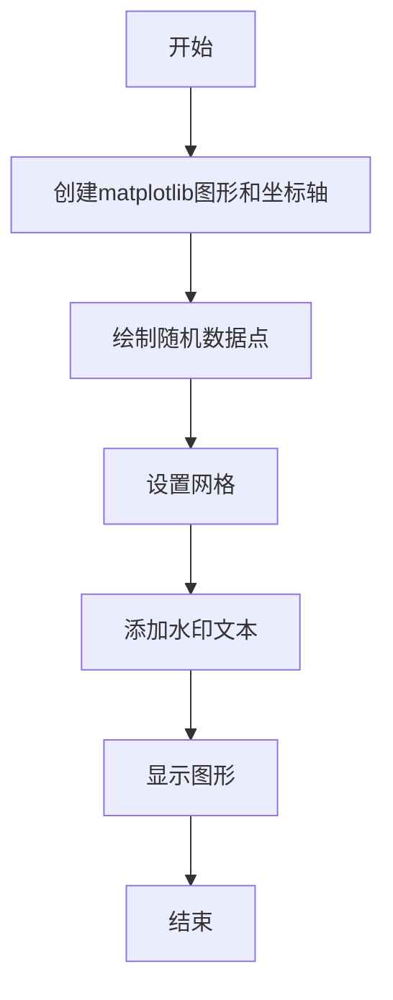
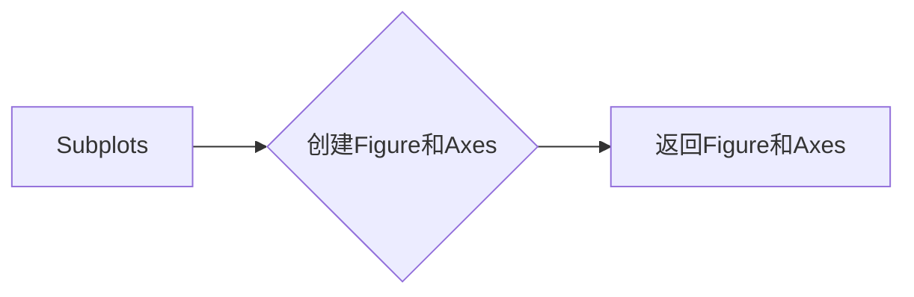
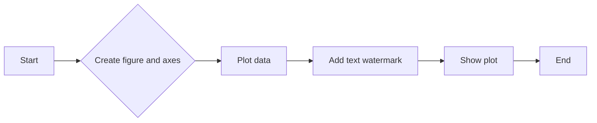
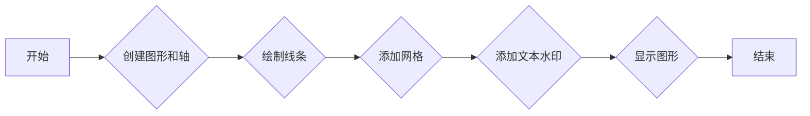

# `matplotlib\galleries\examples\text_labels_and_annotations\watermark_text.py` 详细设计文档

This code generates a plot with a semi-transparent watermark text using matplotlib.

## 整体流程



## 类结构

```
matplotlib.pyplot (matplotlib模块)
├── fig, ax = plt.subplots()
│   ├── fig[matplotlib图形对象]
│   └── ax[matplotlib坐标轴对象]
└── ax.plot(...)
    └── 绘制随机数据点
    └── ax.grid()
    └── ax.text(...)
    └── 添加水印文本
    └── plt.show()
    └── 显示图形
```

## 全局变量及字段


### `np.random.seed(19680801)`
    
Sets the random seed for reproducibility of the random numbers generated by numpy.

类型：`function call`
    


### `matplotlib.figure.Figure.fig`
    
The main figure object created by matplotlib for plotting.

类型：`matplotlib.figure.Figure`
    


### `matplotlib.axes._subplots.AxesSubplot.ax`
    
The axes object on which the plot is drawn.

类型：`matplotlib.axes._subplots.AxesSubplot`
    


### `matplotlib.figure.Figure.{'name': 'matplotlib.pyplot', 'fields': ['fig', 'ax'], 'methods': ['subplots()', 'plot()', 'grid()', 'text()', 'show()']}.fig`
    
The main figure object created by matplotlib for plotting.

类型：`matplotlib.figure.Figure`
    


### `matplotlib.axes._subplots.AxesSubplot.{'name': 'matplotlib.pyplot', 'fields': ['fig', 'ax'], 'methods': ['subplots()', 'plot()', 'grid()', 'text()', 'show()']}.ax`
    
The axes object on which the plot is drawn.

类型：`matplotlib.axes._subplots.AxesSubplot`
    
    

## 全局函数及方法


### plt.subplots()

`plt.subplots()` 是 Matplotlib 库中用于创建一个图形和轴对象的函数。

参数：

- `figsize`：`tuple`，默认为 `(6, 6)`，表示图形的宽度和高度（以英寸为单位）。
- `dpi`：`int`，默认为 `100`，表示图形的分辨率（每英寸点数）。
- `facecolor`：`color`，默认为 `'white'`，表示图形的背景颜色。
- `edgecolor`：`color`，默认为 `'none'`，表示图形的边缘颜色。
- `frameon`：`bool`，默认为 `True`，表示是否显示图形的边框。
- `num`：`int`，默认为 `1`，表示要创建的轴对象的数量。
- `gridspec_kw`：`dict`，默认为 `{}`，表示用于创建轴对象的 GridSpec 关键字参数。
- `constrained_layout`：`bool`，默认为 `False`，表示是否启用约束布局。

返回值：`Figure` 对象和 `Axes` 对象的元组。

#### 流程图



#### 带注释源码

```python
fig, ax = plt.subplots()
```

在这个例子中，`fig` 是 `Figure` 对象，`ax` 是 `Axes` 对象，它们被用来绘制图形和轴。


### ax.plot()

该函数用于在matplotlib的轴对象上绘制数据点。

参数：

- `np.random.rand(20)`：`numpy.ndarray`，生成一个长度为20的随机数组，用于绘制数据点。
- `-o`：`str`，指定点的样式为圆形。
- `ms=20`：`int`，指定点的标记大小为20。
- `lw=2`：`int`，指定线的宽度为2。
- `alpha=0.7`：`float`，指定线的透明度为0.7。
- `mfc='orange'`：`str`，指定点的填充颜色为橙色。

返回值：`None`，该函数不返回任何值。

#### 流程图

```mermaid
graph LR
A[Start] --> B{调用np.random.rand(20)}
B --> C{生成随机数组}
C --> D{调用ax.plot()}
D --> E{绘制数据点}
E --> F[End]
```

#### 带注释源码

```
fig, ax = plt.subplots() // 创建一个图形和轴对象
ax.plot(np.random.rand(20), '-o', ms=20, lw=2, alpha=0.7, mfc='orange') // 绘制数据点
ax.grid() // 添加网格
ax.text(0.5, 0.5, 'created with matplotlib', transform=ax.transAxes,
        fontsize=40, color='gray', alpha=0.5,
        ha='center', va='center', rotation=30) // 在轴上添加文本
plt.show() // 显示图形
```


### ax.grid()

`ax.grid()` 是一个用于在 matplotlib 图形中添加网格线的函数。

参数：

- 无

返回值：无

#### 流程图

```mermaid
graph LR
A[开始] --> B{调用 ax.grid()}
B --> C[结束]
```

#### 带注释源码

```
ax.grid()  # 在当前轴 ax 上添加网格线
```


### ax.text()

该函数用于在matplotlib的轴对象上绘制半透明的文本水印。

参数：

- `x`：`float`，文本的x坐标，相对于轴的坐标系统。
- `y`：`float`，文本的y坐标，相对于轴的坐标系统。
- `s`：`str`，要绘制的文本字符串。
- `transform`：`matplotlib.transforms.Transform`，指定文本的坐标转换，默认为轴的坐标系统。
- `fontsize`：`int`或`str`，文本的字体大小。
- `color`：`str`或`color`，文本的颜色。
- `alpha`：`float`，文本的透明度。
- `ha`：`str`，水平对齐方式，'left', 'center', 'right'。
- `va`：`str`，垂直对齐方式，'top', 'center', 'bottom'。
- `rotation`：`float`，文本的旋转角度。

返回值：`matplotlib.text.Text`，绘制的文本对象。

#### 流程图

```mermaid
graph LR
A[开始] --> B{调用ax.text()}
B --> C[结束]
```

#### 带注释源码

```python
ax.text(0.5, 0.5, 'created with matplotlib', transform=ax.transAxes,
        fontsize=40, color='gray', alpha=0.5,
        ha='center', va='center', rotation=30)
```


### plt.show()

`plt.show()` 是一个全局函数，用于显示当前图形。

参数：

- 无

返回值：无

#### 流程图

```mermaid
graph LR
A[Start] --> B[Call plt.show()]
B --> C[End]
```

#### 带注释源码

```
plt.show()
```

该函数调用后，会显示当前matplotlib图形窗口。在这个例子中，它将显示一个带有文本水印的图形。

```python
# Fixing random state for reproducibility
np.random.seed(19680801)

fig, ax = plt.subplots()
ax.plot(np.random.rand(20), '-o', ms=20, lw=2, alpha=0.7, mfc='orange')
ax.grid()

ax.text(0.5, 0.5, 'created with matplotlib', transform=ax.transAxes,
        fontsize=40, color='gray', alpha=0.5,
        ha='center', va='center', rotation=30)

plt.show()
```


### plt.subplots()

`subplots()` 是 `matplotlib.pyplot` 模块中的一个函数，用于创建一个图形和一个轴（Axes）的实例。

参数：

- `figsize`：`tuple`，默认为 `(6, 4)`，表示图形的宽度和高度（以英寸为单位）。
- `dpi`：`int`，默认为 `100`，表示图形的分辨率（每英寸点数）。
- `facecolor`：`color`，默认为 `'white'`，表示图形的背景颜色。
- `edgecolor`：`color`，默认为 `'none'`，表示图形的边缘颜色。
- `frameon`：`bool`，默认为 `True`，表示是否显示图形的边框。
- `num`：`int`，默认为 `1`，表示要创建的轴的数量。
- `gridspec_kw`：`dict`，默认为 `{}`，表示用于创建轴的 GridSpec 关键字参数。
- `constrained_layout`：`bool`，默认为 `False`，表示是否启用约束布局。

返回值：`Figure`，`Axes`，`Axes`，...，表示创建的图形和轴的实例。

#### 流程图



#### 带注释源码

```python
import matplotlib.pyplot as plt
import numpy as np

# Fixing random state for reproducibility
np.random.seed(19680801)

fig, ax = plt.subplots()  # Create a figure and an axes
ax.plot(np.random.rand(20), '-o', ms=20, lw=2, alpha=0.7, mfc='orange')  # Plot data
ax.grid()  # Add grid
ax.text(0.5, 0.5, 'created with matplotlib', transform=ax.transAxes,
        fontsize=40, color='gray', alpha=0.5,
        ha='center', va='center', rotation=30)  # Add text watermark
plt.show()  # Show the plot
```


### matplotlib.pyplot.plot()

matplotlib.pyplot.plot() 是一个用于绘制二维线条图的函数，它可以将一系列数据点连接起来，形成一条线。

参数：

- `x`：`numpy.ndarray` 或 `sequence`，x轴的数据点。
- `y`：`numpy.ndarray` 或 `sequence`，y轴的数据点。
- `-o`：`str`，指定点的样式，这里表示圆形点。
- `ms`：`int`，指定点的标记大小。
- `lw`：`int`，指定线的宽度。
- `alpha`：`float`，指定线的透明度。
- `mfc`：`str`，指定点的填充颜色。

返回值：`Line2D` 对象，表示绘制的线。

#### 流程图



#### 带注释源码

```python
import matplotlib.pyplot as plt
import numpy as np

# Fixing random state for reproducibility
np.random.seed(19680801)

fig, ax = plt.subplots()  # 创建图形和轴
ax.plot(np.random.rand(20), '-o', ms=20, lw=2, alpha=0.7, mfc='orange')  # 绘制线条
ax.grid()  # 添加网格
ax.text(0.5, 0.5, 'created with matplotlib', transform=ax.transAxes,
        fontsize=40, color='gray', alpha=0.5,
        ha='center', va='center', rotation=30)  # 添加文本水印
plt.show()  # 显示图形
```


### plt.grid()

`plt.grid()` 是 `matplotlib.pyplot` 模块中的一个函数，用于在绘制的图形上添加网格线。

参数：

- 无

返回值：`None`，该函数不返回任何值，它直接在当前的图形上添加网格线。

#### 流程图

```mermaid
graph LR
A[Start] --> B{Call plt.grid()}
B --> C[End]
```

#### 带注释源码

```
ax.grid()  # 在当前轴(ax)上添加网格线
```


### ax.grid()

`ax.grid()` 是 `matplotlib.axes._subplots.AxesSubplot` 类中的一个方法，用于在特定的轴(ax)上添加网格线。

参数：

- 无

返回值：`None`，该方法不返回任何值，它直接在指定的轴(ax)上添加网格线。

#### 流程图

```mermaid
graph LR
A[Start] --> B{Call ax.grid()}
B --> C[End]
```

#### 带注释源码

```
def grid(self, *args, **kwargs):
    """
    Add a grid to the axes.

    Parameters
    ----------
    *args, **kwargs
        Arguments and keyword arguments passed to the grid function.

    Returns
    -------
    None
    """
    self._ax.grid(*args, **kwargs)
```

请注意，`ax.grid()` 方法实际上是一个包装器，它将调用底层的 `_ax.grid()` 方法，该方法才是真正执行添加网格线操作的方法。由于 `_ax` 是一个内部属性，这里不提供其详细文档。


### matplotlib.pyplot.text()

matplotlib.pyplot.text() 是一个用于在 matplotlib 图形上添加文本的函数。

参数：

- `x`：`float`，文本的 x 坐标。
- `y`：`float`，文本的 y 坐标。
- `s`：`str`，要显示的文本字符串。
- `transform`：`matplotlib.transforms.Transform`，用于定位文本的变换对象，默认为轴的坐标系统。
- `fontsize`：`int` 或 `float`，文本的字体大小。
- `color`：`str` 或 `color`，文本的颜色。
- `alpha`：`float`，文本的透明度。
- `ha`：`str`，水平对齐方式，可以是 'left', 'center', 'right'。
- `va`：`str`，垂直对齐方式，可以是 'top', 'center', 'bottom'。
- `rotation`：`float`，文本的旋转角度。

返回值：`matplotlib.text.Text`，表示添加到图形上的文本对象。

#### 流程图

```mermaid
graph LR
A[Start] --> B{Call matplotlib.pyplot.text()}
B --> C[End]
```

#### 带注释源码

```python
import matplotlib.pyplot as plt
import numpy as np

# Fixing random state for reproducibility
np.random.seed(19680801)

fig, ax = plt.subplots()
ax.plot(np.random.rand(20), '-o', ms=20, lw=2, alpha=0.7, mfc='orange')
ax.grid()

# Adding text to the plot
ax.text(0.5, 0.5, 'created with matplotlib', transform=ax.transAxes,
        fontsize=40, color='gray', alpha=0.5,
        ha='center', va='center', rotation=30)

plt.show()
```


### plt.show()

`plt.show()` 是一个全局函数，用于显示当前图形。

参数：

- 无

返回值：`None`，该函数不返回任何值，其作用是显示当前图形。

#### 流程图

```mermaid
graph LR
A[开始] --> B{调用plt.show()}
B --> C[结束]
```

#### 带注释源码

```
plt.show()
```

该函数在代码的最后调用，用于显示之前通过 `matplotlib.pyplot` 创建的图形。在这个例子中，它将显示一个带有随机数据点和文本水印的图形。

## 关键组件


### 张量索引与惰性加载

张量索引与惰性加载是指在处理大型数据集时，只对需要的数据进行索引和加载，以减少内存消耗和提高处理速度。

### 反量化支持

反量化支持是指系统对量化操作的反向操作，即从量化后的数据中恢复原始数据，以便进行后续处理。

### 量化策略

量化策略是指将浮点数数据转换为低精度表示的方法，以减少模型大小和提高计算效率。


## 问题及建议


### 核心功能描述
该代码的核心功能是使用matplotlib库在图像上添加半透明的文本水印效果。

### 文件整体运行流程
1. 导入matplotlib.pyplot和numpy库。
2. 设置随机种子以确保结果的可重复性。
3. 创建一个matplotlib图像和坐标轴。
4. 在坐标轴上绘制一个随机数据点。
5. 在坐标轴上添加一个半透明的文本水印。
6. 显示图像。

### 类的详细信息
- 无类定义。

### 全局变量和全局函数的详细信息
- 全局变量：
  - `np`: numpy库的别名，用于数学计算。
  - `plt`: matplotlib.pyplot库的别名，用于创建和显示图像。

- 全局函数：
  - `np.random.seed(19680801)`: 设置随机种子。
  - `plt.subplots()`: 创建一个新的图像和一个坐标轴。
  - `ax.plot(...)`: 在坐标轴上绘制数据点。
  - `ax.grid()`: 在坐标轴上添加网格。
  - `ax.text(...)`: 在坐标轴上添加文本水印。
  - `plt.show()`: 显示图像。

### 类字段和全局变量
- `np`: numpy库的别名，用于数学计算。
- `plt`: matplotlib.pyplot库的别名，用于创建和显示图像。

### 类方法和全局函数
- `np.random.seed(19680801)`: 设置随机种子，类型：无，参数：种子值，描述：确保结果的可重复性。
- `plt.subplots()`: 创建一个新的图像和一个坐标轴，类型：matplotlib.figure.Figure，参数：无，描述：用于后续的绘图操作。
- `ax.plot(np.random.rand(20), '-o', ms=20, lw=2, alpha=0.7, mfc='orange')`: 在坐标轴上绘制数据点，类型：无，参数：数据点、线型、标记大小、线宽、透明度和颜色，描述：绘制一个带有标记的橙色线。
- `ax.grid()`: 在坐标轴上添加网格，类型：无，参数：无，描述：为坐标轴添加网格线。
- `ax.text(0.5, 0.5, 'created with matplotlib', transform=ax.transAxes, fontsize=40, color='gray', alpha=0.5, ha='center', va='center', rotation=30)`: 在坐标轴上添加文本水印，类型：无，参数：文本位置、文本内容、字体大小、颜色、透明度、对齐方式和旋转角度，描述：在坐标轴中心添加一个半透明的文本水印。
- `plt.show()`: 显示图像，类型：无，参数：无，描述：显示绘制的图像。

### 关键组件信息
- `matplotlib.pyplot`: 用于创建和显示图像的库。
- `numpy`: 用于数学计算和随机数生成的库。

### 潜在的技术债务或优化空间
- **已知问题**
  - 代码中使用了matplotlib和numpy库，但没有进行版本检查，可能存在兼容性问题。
  - 代码没有进行异常处理，如果出现错误，可能会导致程序崩溃。
  - 代码没有进行性能优化，例如，绘制大量数据点时可能会影响性能。

- **优化建议**
  - 添加版本检查，确保使用的库版本兼容。
  - 添加异常处理，提高代码的健壮性。
  - 对代码进行性能优化，例如，使用更高效的数据结构或算法。


## 其它


### 设计目标与约束

- 设计目标：实现一个简单的文本水印效果，通过在图像上绘制半透明文本。
- 约束条件：使用matplotlib库进行绘图，不使用额外的图像处理库。

### 错误处理与异常设计

- 错误处理：代码中未包含显式的错误处理机制。
- 异常设计：由于代码简单，未设计特定的异常处理逻辑。

### 数据流与状态机

- 数据流：代码中数据流简单，从随机生成数据到绘制图像再到显示图像。
- 状态机：代码中没有状态变化，因此没有状态机设计。

### 外部依赖与接口契约

- 外部依赖：代码依赖于matplotlib库进行绘图。
- 接口契约：matplotlib库提供了绘图接口，代码通过调用这些接口实现功能。

### 测试与验证

- 测试策略：由于代码简单，可以通过手动检查输出图像是否符合预期来进行验证。
- 验证方法：通过比较输出图像与预期效果进行验证。

### 性能考量

- 性能考量：代码执行效率较高，因为绘图操作由matplotlib库优化处理。
- 性能优化：由于代码简单，目前没有明显的性能优化空间。

### 安全性与隐私

- 安全性：代码中没有涉及敏感数据或操作，因此安全性不是主要考虑因素。
- 隐私：代码中没有涉及用户隐私数据，因此隐私不是主要考虑因素。

### 维护与扩展

- 维护：代码结构简单，易于维护。
- 扩展：代码可以通过添加更多文本样式或调整水印位置进行扩展。


    