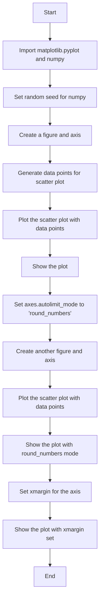
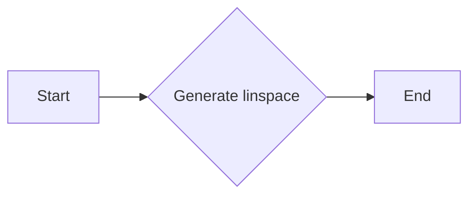
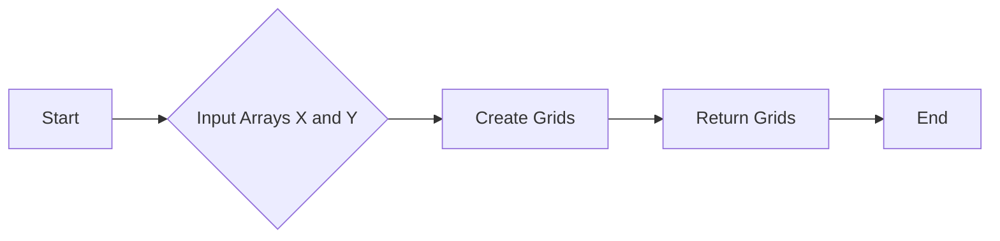
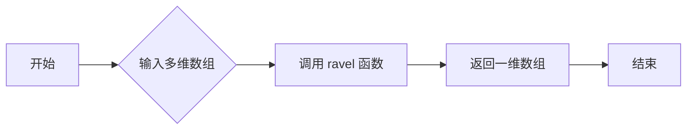
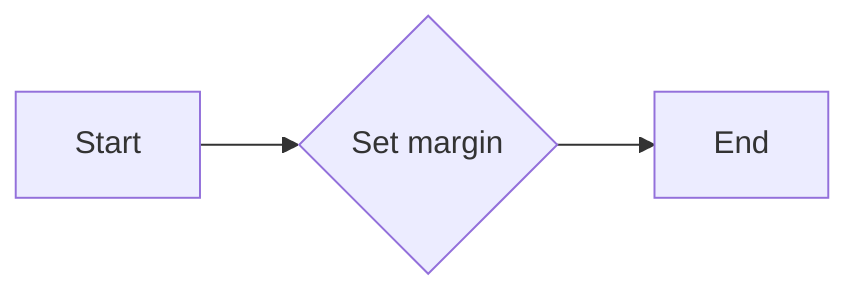
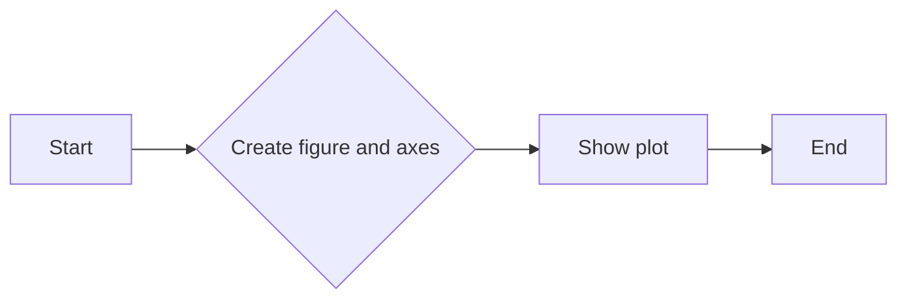
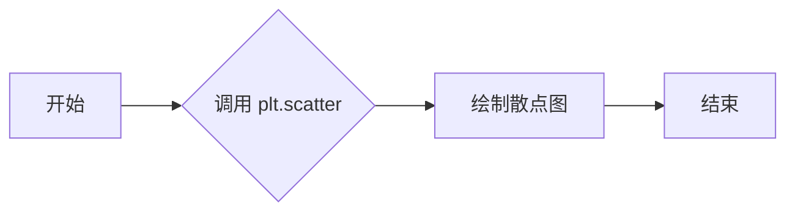

# `matplotlib\galleries\examples\ticks\auto_ticks.py` 详细设计文档

This code demonstrates how to automatically set tick positions in Matplotlib plots to ensure ticks are at round numbers and also at the edges of the plot.

## 整体流程



## 类结构

```
matplotlib.pyplot
├── subplots
│   ├── fig
│   └── ax
└── scatter
    └── ax.scatter
```

## 全局变量及字段


### `dots`
    
An array of evenly spaced values between 0.3 and 1.2.

类型：`numpy.ndarray`
    


### `X`
    
A 2D array representing the meshgrid of dots.

类型：`numpy.ndarray`
    


### `Y`
    
A 2D array representing the meshgrid of dots.

类型：`numpy.ndarray`
    


### `x`
    
A 1D array representing the flattened version of X.

类型：`numpy.ndarray`
    


### `y`
    
A 1D array representing the flattened version of Y.

类型：`numpy.ndarray`
    


### `fig`
    
The figure object created by plt.subplots.

类型：`matplotlib.figure.Figure`
    


### `ax`
    
The axes object created by plt.subplots.

类型：`matplotlib.axes._subplots.AxesSubplot`
    


### `plt`
    
The Matplotlib pyplot module.

类型：`module 'matplotlib.pyplot'`
    


### `np`
    
The NumPy module.

类型：`module 'numpy'`
    


### `matplotlib.pyplot.fig`
    
The figure object created by plt.subplots.

类型：`matplotlib.figure.Figure`
    


### `matplotlib.pyplot.ax`
    
The axes object created by plt.subplots.

类型：`matplotlib.axes._subplots.AxesSubplot`
    


### `matplotlib.pyplot.subplots`
    
Function to create a figure and a set of subplots.

类型：`function`
    


### `matplotlib.pyplot.scatter`
    
Function to create a scatter plot.

类型：`function`
    


### `matplotlib.pyplot.show`
    
Function to display the figure.

类型：`function`
    


### `matplotlib.pyplot.rcParams`
    
Dictionary containing rcParams.

类型：`dictionary`
    


### `matplotlib.pyplot.axes.autolimit_mode`
    
The mode for automatic axis limits.

类型：`string`
    


### `matplotlib.axes._subplots.AxesSubplot.set_xmargin`
    
Function to set the x margin of the axes.

类型：`function`
    


### `matplotlib.axes._subplots.AxesSubplot.set_ymargin`
    
Function to set the y margin of the axes.

类型：`function`
    
    

## 全局函数及方法


### np.linspace

`np.linspace` 是 NumPy 库中的一个函数，用于生成线性空间。

参数：

- `start`：`float`，线性空间的起始值。
- `stop`：`float`，线性空间的结束值。
- `num`：`int`，线性空间中点的数量（不包括起始值和结束值）。

返回值：`numpy.ndarray`，包含线性空间中点的数组。

#### 流程图



#### 带注释源码

```python
import numpy as np

# Generate a linear space from 0.3 to 1.2 with 10 points
dots = np.linspace(0.3, 1.2, 10)
```


### np.meshgrid

`np.meshgrid` 是一个 NumPy 函数，用于生成网格数据，它将输入的数组转换为二维网格。

参数：

- `X`：`numpy.ndarray`，X轴上的数据。
- `Y`：`numpy.ndarray`，Y轴上的数据。

参数描述：

- `X` 和 `Y` 是输入的数组，它们将被转换为二维网格。

返回值类型：`tuple`，包含两个 `numpy.ndarray`，分别对应于 X 和 Y 轴的网格。

返回值描述：

- 返回的两个数组分别对应于 X 和 Y 轴的网格，它们可以用于创建二维图形或进行数值计算。

#### 流程图



#### 带注释源码

```python
import numpy as np

# 创建网格
X, Y = np.meshgrid(dots, dots)
```


### ravel

`ravel` 是 NumPy 库中的一个函数，它用于将多维数组转换为一维数组。

参数：

- 无

返回值：`ndarray`，返回一维数组，包含原数组的元素。

#### 流程图



#### 带注释源码

```python
import numpy as np

# 创建一个二维数组
X, Y = np.meshgrid(dots, dots)

# 使用 ravel 将二维数组转换为一维数组
x, y = X.ravel(), Y.ravel()
```


### set_xmargin

`set_xmargin` 方法用于设置轴的 x 轴边缘的额外边距。

参数：

- `margin`：`float`，指定 x 轴边缘的额外边距。

返回值：无

#### 流程图



#### 带注释源码

```python
# The round numbers autolimit_mode is still respected if you set an additional
# margin around the data using `.Axes.set_xmargin` / `.Axes.set_ymargin`:

fig, ax = plt.subplots()
ax.scatter(x, y, c=x+y)
ax.set_xmargin(0.8)  # Set x margin to 0.8
plt.show()
```


### plt.subplots()

`subplots` 是 `matplotlib.pyplot` 模块中的一个函数，用于创建一个图形和一个轴（Axes）对象。

参数：

- `figsize`：`tuple`，指定图形的大小（宽度和高度），默认为 `(6, 6)`。
- `dpi`：`int`，指定图形的分辨率（每英寸点数），默认为 `100`。
- `facecolor`：`color`，图形的背景颜色，默认为 `'white'`。
- `edgecolor`：`color`，图形的边缘颜色，默认为 `'none'`。
- `frameon`：`bool`，是否显示图形的边框，默认为 `True`。
- `num`：`int`，图形中轴的数量，默认为 `1`。
- `gridspec_kw`：`dict`，用于指定 `GridSpec` 的关键字参数。
- `constrained_layout`：`bool`，是否启用约束布局，默认为 `False`。

返回值：`fig, ax`，其中 `fig` 是图形对象，`ax` 是轴（Axes）对象。

#### 流程图



#### 带注释源码

```python
import matplotlib.pyplot as plt

fig, ax = plt.subplots()  # 创建图形和轴
# ... 在这里绘制图形 ...
plt.show()  # 显示图形
```


### plt.scatter

`plt.scatter` 是 Matplotlib 库中的一个函数，用于在图表上绘制散点图。

参数：

- `x`：`numpy.ndarray` 或 `sequence`，散点在 x 轴上的位置。
- `y`：`numpy.ndarray` 或 `sequence`，散点在 y 轴上的位置。
- `c`：可选，颜色映射，可以是颜色名称、颜色序列、颜色映射对象或颜色规范。
- ...

返回值：`scatter` 对象，表示绘制的散点图。

#### 流程图



#### 带注释源码

```python
import matplotlib.pyplot as plt
import numpy as np

np.random.seed(19680801)

fig, ax = plt.subplots()
dots = np.linspace(0.3, 1.2, 10)
X, Y = np.meshgrid(dots, dots)
x, y = X.ravel(), Y.ravel()
ax.scatter(x, y, c=x+y)  # 绘制散点图
plt.show()
```


## 关键组件


### 张量索引与惰性加载

张量索引与惰性加载允许在处理大型数据集时，只计算和存储所需的子集，从而提高内存效率和计算速度。

### 反量化支持

反量化支持使得模型可以在量化过程中保持精度，同时减少模型大小和加速推理。

### 量化策略

量化策略定义了如何将浮点数转换为固定点数，以减少模型大小和加速推理，同时保持可接受的精度。

## 问题及建议


### 已知问题

-   {问题1}：代码示例中使用了 `np.linspace` 和 `np.meshgrid` 来生成数据点，这些操作可能会在大型数据集上造成性能问题，因为它们需要计算大量的网格点。
-   {问题2}：代码示例中使用了 `plt.subplots` 和 `plt.show` 来创建和显示图形，这种方式在交互式环境中可能会导致性能瓶颈，特别是在需要频繁更新图形时。
-   {问题3}：代码示例中设置了 `axes.autolimit_mode` 为 'round_numbers'，这可能会在数据范围非常大时导致轴的显示范围不合适，因为轴的极限被扩展到下一个“圆整”数字。

### 优化建议

-   {建议1}：对于大型数据集，可以考虑使用更高效的数据生成方法，例如使用 `numpy` 的 `generate` 函数或者使用 `pandas` 的 `DataFrame` 来处理数据。
-   {建议2}：在交互式环境中，可以使用 `matplotlib` 的 `notebook` 模式，这样可以在 Jupyter Notebook 等交互式环境中更高效地显示和更新图形。
-   {建议3}：在设置轴的极限时，可以添加一个检查，以确保轴的显示范围适合数据的实际范围，而不是总是扩展到下一个“圆整”数字。
-   {建议4}：代码示例中使用了全局变量 `plt.rcParams` 来设置绘图参数，这可能会在大型项目中导致难以追踪和维护。可以考虑使用类或配置文件来管理这些参数。
-   {建议5}：代码示例中没有包含错误处理和异常设计，这可能会在遇到意外输入或配置错误时导致程序崩溃。应该添加适当的异常处理来提高代码的健壮性。


## 其它


### 设计目标与约束

- 设计目标：实现自动设置刻度位置的功能，确保刻度在边缘和整数值处。
- 约束条件：遵守Matplotlib的默认行为，同时提供额外的边缘刻度选项。

### 错误处理与异常设计

- 错误处理：确保在设置刻度时，如果输入参数无效，程序能够抛出异常并给出清晰的错误信息。
- 异常设计：定义可能的异常类型，如无效参数异常、配置错误异常等。

### 数据流与状态机

- 数据流：从用户输入到设置刻度位置的过程，包括数据验证、计算刻度位置、应用刻度设置等步骤。
- 状态机：描述刻度设置的状态变化，如初始状态、计算中状态、设置完成状态。

### 外部依赖与接口契约

- 外部依赖：Matplotlib库，用于绘图和设置刻度。
- 接口契约：定义与Matplotlib库交互的接口，包括配置参数和绘图方法。


    