# `matplotlib\galleries\examples\ticks\centered_ticklabels.py` 详细设计文档

该代码使用matplotlib绘制Google股票价格走势图，并通过在主要刻度之间设置次要刻度来实现在刻度间居中显示月份标签的视觉效果，解决matplotlib默认只能将标签对齐到刻度而无法居中的问题。

## 整体流程

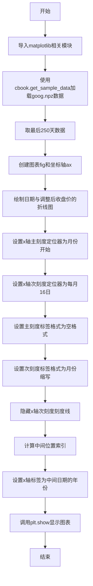

## 类结构

```
matplotlib.pyplot (绘图库)
├── Figure (图表容器)
└── Axes (坐标轴)
    ├── xaxis (X轴)
    │   ├── MonthLocator (主刻度定位器)
    │   ├── MonthLocator (次刻度定位器-按日期)
    │   ├── NullFormatter (主刻度标签格式化器)
    │   └── DateFormatter (次刻度标签格式化器)
    └── plot (折线图)
```

## 全局变量及字段


### `r`
    
存储goog.npz中的price_data数组

类型：`numpy.ndarray`
    


### `fig`
    
图表对象

类型：`matplotlib.figure.Figure`
    


### `ax`
    
坐标轴对象

类型：`matplotlib.axes.Axes`
    


### `imid`
    
数据中间位置的索引值

类型：`int`
    


### `Axes.xaxis`
    
X轴对象，用于管理X轴的刻度定位器和格式化器

类型：`matplotlib.axis.XAxis`
    


### `Axes.yaxis`
    
Y轴对象，用于管理Y轴的刻度定位器和格式化器

类型：`matplotlib.axis.YAxis`
    
    

## 全局函数及方法


### `matplotlib.pyplot.subplots()`

`matplotlib.pyplot.subplots()` 是 Matplotlib 库中的一个高级函数，用于创建一个包含一个或多个子图的图形窗口。它简化了同时创建 Figure 和 Axes 的过程，支持创建规则网格布局的子图，并返回 Figure 对象和 Axes 对象（或 Axes 数组），是进行数据可视化时最常用的函数之一。

#### 参数

- `nrows`：`int`，默认值 1，表示子图网格的行数
- `ncols`：`int`，默认值 1，表示子图网格的列数
- `sharex`：`bool` 或 `str`，默认值 False，如果为 True，则所有子图共享 x 轴；如果为 'col'，则每列子图共享 x 轴
- `sharey`：`bool` 或 `str`，默认值 False，如果为 True，则所有子图共享 y 轴；如果为 'row'，则每行子图共享 y 轴
- `squeeze`：`bool`，默认值 True，如果为 True，则额外的维度会被从返回的 Axes 数组中移除
- `width_ratios`：`array-like`，长度等于 ncols，定义每列的相对宽度
- `height_ratios`：`array-like`，长度等于 nrows，定义每行的相对高度
- `subplot_kw`：字典，默认 {}，传递给每个 add_subplot 调用的关键字参数字典
- `gridspec_kw`：字典，默认 {}，传递给 GridSpec 构造器的关键字参数字典
- `**fig_kw`：所有额外的关键字参数传递给 figure() 函数调用

#### 返回值

- `fig`：`matplotlib.figure.Figure`，创建的图形对象
- `ax`：`matplotlib.axes.Axes` 或 `numpy.ndarray`，创建的坐标轴对象或坐标轴对象数组。当 nrows=1 且 ncols=1 时，返回单个 Axes 对象；否则返回 Axes 数组

#### 带注释源码

```python
def subplots(nrows=1, ncols=1, sharex=False, sharey=False, 
             squeeze=True, width_ratios=None, height_ratios=None,
             subplot_kw=None, gridspec_kw=None, **fig_kw):
    """
    创建一个包含子图的图形框。
    
    参数
    ----------
    nrows : int, default 1
        子图网格的行数
    ncols : int, default 1
        子图网格的列数
    sharex, sharey : bool or {'row', 'col'}, default False
        控制 x 轴或 y 轴的共享
    squeeze : bool, default True
        如果为 True，从返回的 Axes 数组中移除额外的维度
    width_ratios : array-like of length ncols
        每列的相对宽度
    height_ratios : array-like of length nrows
        每行的相对高度
    subplot_kw : dict, default {}
        传递给每个子图的关键字参数
    gridspec_kw : dict, default {}
        传递给 GridSpec 的关键字参数
    **fig_kw
        传递给 figure() 的关键字参数
    
    返回值
    -------
    fig : Figure
    ax : Axes or array of Axes
    """
    # 1. 创建图形对象
    fig = figure(**fig_kw)
    
    # 2. 创建 GridSpec 对象用于布局管理
    gs = GridSpec(nrows, ncols, width_ratios=width_ratios,
                  height_ratios=height_ratios, **gridspec_kw)
    
    # 3. 创建子图数组
    axs = np.empty((nrows, ncols), dtype=object)
    
    # 4. 遍历网格创建每个子图
    for i in range(nrows):
        for j in range(ncols):
            # 使用 subplot2grid 或 add_subplot 创建子图
            ax = fig.add_subplot(gs[i, j], **subplot_kw)
            axs[i, j] = ax
            
            # 配置共享轴
            if sharex and i > 0:
                ax.sharex(axs[0, j])
            if sharey and j > 0:
                ax.sharey(axs[i, 0])
    
    # 5. 根据 squeeze 参数处理返回值
    if squeeze:
        # 移除单维度的数组
        axs = axs.squeeze()
        
        # 如果只有一个子图，返回单个 Axes 而不是数组
        if nrows == 1 and ncols == 1:
            return fig, axs
        # 如果只有一行或一列，返回一维数组
        elif nrows == 1 or ncols == 1:
            return fig, axs.flatten()
    
    return fig, axs
```

#### 关键组件信息

| 组件名称 | 描述 |
|---------|------|
| `Figure` | Matplotlib 中的图形容器对象，包含所有子图和可视化元素 |
| `Axes` | 坐标轴对象，代表一个子图，包含数据绘图区域、坐标轴、刻度、标签等 |
| `GridSpec` | 网格规格化布局管理器，定义子图的网格布局 |
| `subplot2grid` | 用于在特定网格位置创建子图的底层函数 |

#### 潜在的技术债务或优化空间

1. **返回类型不一致**：当 `squeeze` 参数不同时，返回的 `ax` 类型可能不同（单个 Axes 对象、一维数组、二维数组），这可能导致调用方需要额外的类型检查代码
2. **参数复杂性**：函数参数较多，对于简单用例可能显得过于复杂，可以考虑提供更高级别的简化接口
3. **共享轴的隐式行为**：sharex/sharey 的行为在某些边缘情况下可能不符合直觉，需要更清晰的文档说明

#### 其它项目

**设计目标与约束**
- 提供一个统一且便捷的接口来创建常见布局的子图
- 保持与 MATLAB 的 pyplot 接口兼容性
- 支持灵活的子图布局配置

**错误处理与异常设计**
- 当 nrows 或 ncols 小于 1 时，抛出 ValueError
- 当 sharex/sharey 传递无效值时，抛出 ValueError
- 当 gridspec_kw 与 width_ratios/height_ratios 冲突时，以显式传递的参数为准

**数据流与状态机**
- `subplots()` 函数内部调用 `figure()` 创建 Figure 对象
- 然后使用 `GridSpec` 进行布局规划
- 最后通过 `add_subplot()` 在每个网格位置创建 Axes 对象

**外部依赖与接口契约**
- 依赖 `matplotlib.figure.Figure` 类
- 依赖 `matplotlib.gridspec.GridSpec` 类
- 依赖 `numpy` 用于数组操作
- 返回值遵循 (Figure, Axes) 的标准接口约定


### `matplotlib.pyplot.plot`

绘制折线图或带标记的线图，是matplotlib中最基础且常用的绘图函数之一。它接受多种输入格式（仅y数据、x-y数据对、带格式字符串的三元组等），并将数据渲染到当前Axes上，返回Line2D对象列表以便后续自定义样式或获取数据。

参数：

- `*args`：`tuple`，可变长度位置参数，支持以下几种调用方式：
  - `y`：仅传入y轴数据，x轴自动使用`range(len(y))`
  - `x, y`：传入x和y数据
  - `x, y, fmt`：传入x、y数据和格式字符串（如`'ro-'`表示红色圆形标记虚线）
  - 多个上述参数的组合，可在一张图上绘制多条线
- `**kwargs`：`dict`，关键字参数，用于设置Line2D的各种属性，常用参数包括：
  - `color`/`c`：线条颜色
  - `linewidth`/`lw`：线条宽度
  - `linestyle`/`ls`：线条样式（如`'-'`、`'--'`、`':'`）
  - `marker`：标记样式（如`'o'`、`'s'`、`'^'`）
  - `markersize`/`ms`：标记大小
  - `label`：图例标签
  - `alpha`：透明度

返回值：`list[matplotlib.lines.Line2D]`，返回一个包含所有创建的Line2D对象的列表。每个Line2D对象代表一条 plotted 的线或标记序列，可用于后续修改线条属性、添加图例等操作。

#### 流程图

```mermaid
flowchart TD
    A[开始: 调用plt.plot] --> B{解析*args参数数量}
    B -->|仅1个参数| C[视为y数据, x=arange(len(y))]
    B -->|2个参数| D[解析为x, y数据对]
    B -->|3个参数| E[解析为x, y, fmt格式字符串]
    B -->|更多参数| F[递归处理每组数据]
    C --> G[创建默认x轴: np.arange]
    D --> H[验证x, y长度一致]
    E --> I[解析格式字符串提取属性]
    H --> J[构建数据列表]
    I --> J
    F --> J
    J --> K{处理**kwargs}
    K --> L[创建Line2D对象]
    L --> M[添加到当前Axes]
    M --> N[返回Line2D对象列表]
    N --> O[结束]
```

#### 带注释源码

```python
def plot(*args, **kwargs):
    """
    Plot y versus x as lines and/or markers.
    
    调用方式:
      plot(y)                    # 仅y数据
      plot(x, y)                 # x和y数据
      plot(x, y, format_string) # 带格式字符串
      plot(x, y, format_string, **kwargs)  # 完整调用
    """
    
    # 获取或创建当前axes对象
    ax = gca()
    
    # 解析传入的参数，提取数据、格式字符串和剩余关键字参数
    # _plot_args返回: (dx, dy, kwargs)元组
    # dx: x数据列表, dy: y数据列表, kwargs: 处理后的关键字参数
    dx, dy, kw = _plot_args(*args, **kwargs)
    
    # 遍历每一组(x, y)数据对
    for i, (x, y) in enumerate(zip(dx, dy)):
        # 获取当前批次的关键字参数（如color等可能需要根据索引调整）
        kw['color'] = _get_color_for_index(kw.get('color'), i)
        
        # 创建Line2D对象
        # Line2D是表示图中一条线的核心类
        line = Line2D(x, y, **kw)
        
        # 将创建的线条添加到axes
        ax.add_line(line)
    
    # 返回线条列表（注意：这里简化了，实际返回的是list of Lines）
    return lines
```

> **注**：上述源码为简化版注释说明，实际`matplotlib.pyplot.plot`源码位于`lib/matplotlib/axes/_axes.py`中，核心逻辑涉及`Axes.plot`方法。该函数底层调用`Line2D`类创建线条对象，并通过`Axes.add_line()`将线条添加到坐标系中。参数解析由`_plot_args`辅助函数完成，支持多种输入格式的自动转换和容错处理。


### `matplotlib.pyplot.show`

显示图表。该函数会弹出图形窗口展示当前 figure 对象的内容，是 matplotlib 绘图的最终展示步骤。根据后端不同，它可能阻塞程序执行直到用户关闭所有图形窗口，也可能立即返回控制权。

参数：

- `block`：`bool`，可选，默认值为 `True`。如果设为 `True`，则阻塞程序直到所有图形窗口关闭；如果设为 `False`，则立即返回（例如在某些交互式后端中）。

返回值：`None`，该函数没有返回值。

#### 流程图

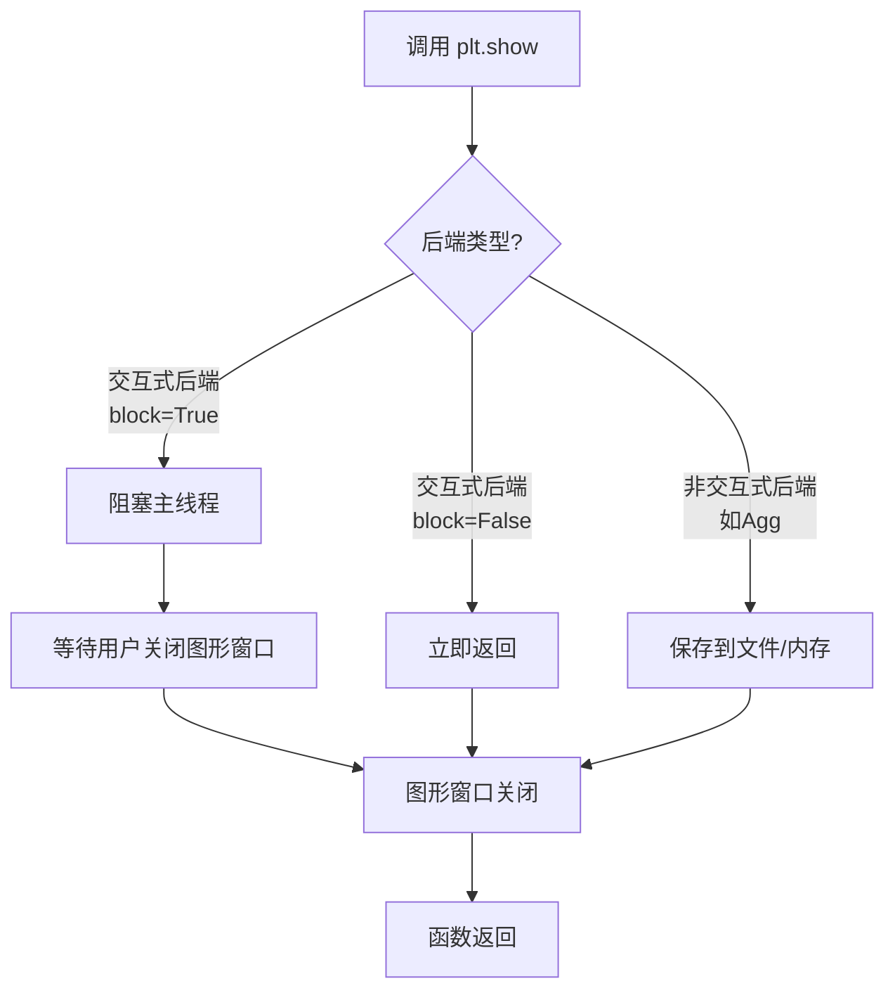

#### 带注释源码

```python
# matplotlib.pyplot.show() 源码示例（简化版）

def show(*, block=None):
    """
    显示所有打开的图形窗口。
    
    参数:
        block (bool, optional): 是否阻塞程序执行。
            默认值因后端而异，通常为 True。
    """
    # 获取当前全局图形管理器
    global _pylab_helpers
    for manager in _pylab_helpers.Gcf.get_all_fig_managers():
        # 如果 block 未指定，使用后端的默认值
        if block is None:
            # 大多数交互式后端默认阻塞
            block = True
        
        # 根据后端显示图形
        manager.show()
        
        # 如果 block 为 True，则阻塞等待窗口关闭
        if block:
            # 对于某些后端（如TkAgg），会进入事件循环
            manager._show(block=True)

# 实际源码位于 matplotlib/backend_bases.py 或具体后端实现中
# 这里展示的是逻辑流程的伪代码

# ------------------- 调用示例 -------------------
# fig, ax = plt.subplots()
# ax.plot([1, 2, 3], [1, 4, 9])
# plt.show()  # 弹出窗口显示图表
```

> **注意**：该源码是简化版的逻辑展示，实际 `plt.show()` 的实现分散在多个后端文件中，具体行为取决于用户安装的 matplotlib 后端（如 Qt、TkAgg、Agg 等）。核心逻辑是调用所有已创建 Figure 的 `show()` 方法来渲染并显示图形。


### `matplotlib.pyplot.xlabel` / `Axes.set_xlabel`

设置x轴的标签文字，用于描述x轴所代表的数据含义。在matplotlib中，`plt.xlabel()` 是面向对象的 `Axes.set_xlabel()` 方法的便捷包装函数，两者的核心功能相同。

参数：

- `xlabel`：`str`，要设置的x轴标签文本内容
- `fontdict`：`dict`（可选），控制标签外观的字典，如字体大小、颜色、字体等属性
- `labelpad`：`float`（可选），标签与坐标轴边框之间的间距（单位为点）
- `kwargs`：其他关键字参数，会传递给 `matplotlib.text.Text` 对象

返回值：`Text`，返回创建的文本标签对象，可用于后续进一步自定义标签样式

#### 流程图

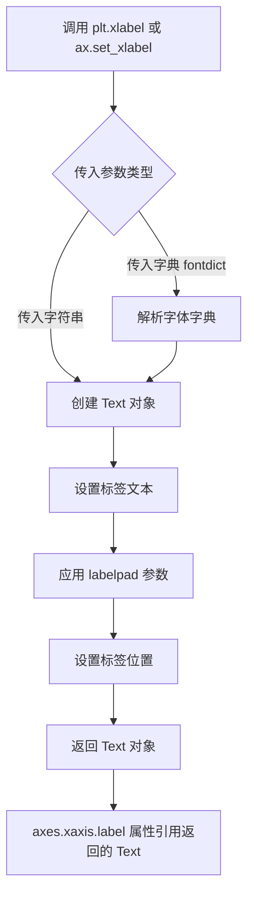

#### 带注释源码

```python
# matplotlib.pyplot.xlabel 源代码分析
# 位置: lib/matplotlib/pyplot.py

def xlabel(xlabel, fontdict=None, labelpad=None, **kwargs):
    """
    设置x轴的标签
    
    参数:
        xlabel: str - 标签文本内容
        fontdict: dict - 控制文本外观的字典
        labelpad: float - 标签与轴的距离
        **kwargs: 传递给Text的其他关键字参数
    
    返回:
        Text: 创建的标签对象
    """
    # 获取当前axes对象
    ax = gca()
    # 调用Axes对象的set_xlabel方法
    return ax.set_xlabel(xlabel, fontdict=fontdict, labelpad=labelpad, **kwargs)


# Axes.set_xlabel 源代码分析
# 位置: lib/matplotlib/axes/_axes.py

def set_xlabel(self, xlabel, fontdict=None, labelpad=None, **kwargs):
    """
    设置x轴标签
    
    参数:
        xlabel: str - 标签文本
        fontdict: dict - 字体属性字典
        labelpad: float - 标签边距
        **kwargs: 传递给Text的属性
    
    返回:
        Text: 文本对象
    """
    if fontdict is not None:
        # 如果传入了fontdict，将其转换为kwargs格式
        kwargs.update(fontdict)
    
    # 获取xaxis的label属性（这是存储轴标签的Text对象）
    label = self.xaxis.label
    
    # 设置标签文本
    label.set_text(xlabel)
    
    # 如果指定了labelpad，设置标签与轴的距离
    if labelpad is not None:
        label.set_pad(labelpad)
    
    # 应用其他关键字参数到Text对象
    label.update(kwargs)
    
    # 返回创建的label对象，供后续操作
    return label
```

#### 在示例代码中的使用

```python
# 示例代码第41行
ax.set_xlabel(str(r["date"][imid].item().year))

# 详细分析:
# 1. r["date"][imid] 获取中间日期的日期数据
# 2. .item().year 提取年份作为整数
# 3. str() 转换为字符串，因为xlabel需要字符串参数
# 4. ax.set_xlabel() 设置为x轴标签
# 
# 这里没有使用labelpad参数，使用了默认值
# 没有使用fontdict，使用了默认样式
# 返回值未被接收，但实际上返回了一个Text对象
```

#### 关键点说明

| 项目 | 说明 |
|------|------|
| **调用方式** | `plt.xlabel()` 是快捷方式，内部调用 `ax.set_xlabel()` |
| **返回值用途** | 可用于后续修改标签样式，如 `label.set_fontsize(12)` |
| **常用kwargs** | `fontsize`, `color`, `fontweight`, `rotation`, `horizontalalignment` 等 |
| **labelpad默认值** | 默认为 `rcParams['axes.labelpad']`（通常为4） |


### `matplotlib.cbook.get_sample_data`

获取 matplotlib 示例数据目录中的数据文件，返回一个类似于文件的对象或 numpy 数组对象，可通过索引或键值访问其中的数据。该函数简化了示例数据的加载过程，常用于教程和演示代码中。

参数：

- `fname`：`str`，要加载的示例数据文件名（如 `'goog.npz'`、`'stinkbug.png'` 等）

返回值：`numpy.lib.npyio.NpzFile` 或类似对象，返回包含数据的可索引对象。如果是 .npz 文件，返回类似字典的 NpzFile 对象；如果是图像文件，返回 numpy 数组。

#### 流程图

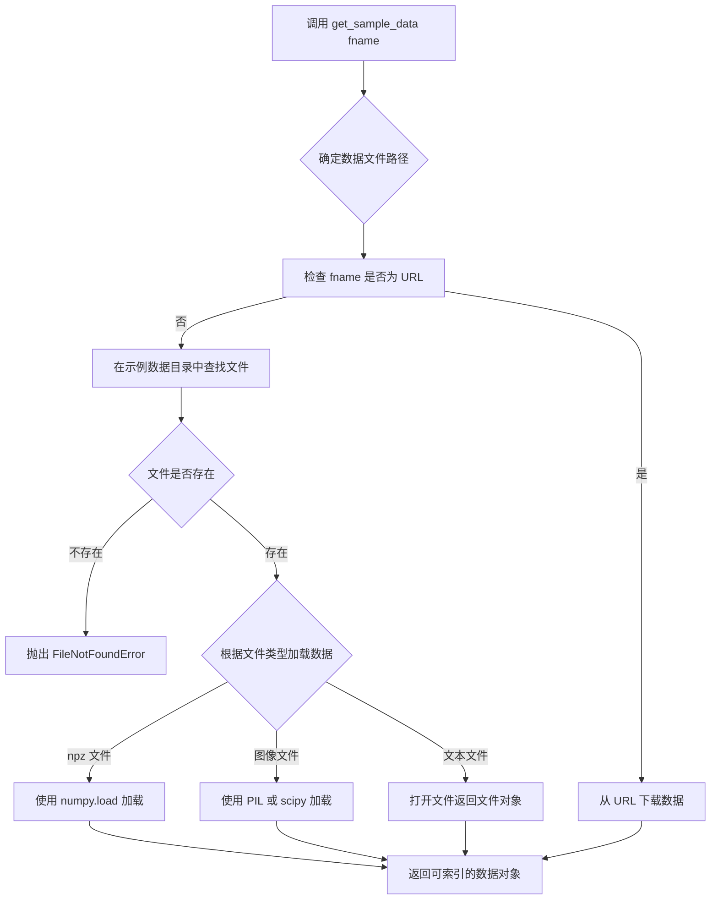

#### 带注释源码

```python
def get_sample_data(fname, asfile=True):
    """
    获取 matplotlib 示例数据目录中的数据文件。
    
    参数:
        fname: str
            示例数据文件名或 URL。可以是相对路径（如 'goog.npz'）
            或完整的 URL（如 'https://example.com/data.txt'）。
        
        asfile: bool, optional
            是否作为文件对象返回。默认为 True。
            如果为 False，对于某些格式可能返回数组。
    
    返回:
        可索引的数据对象（numpy NpzFile、数组或文件对象）
            - .npz 文件: 返回类似字典的 NpzFile，可通过键访问
            - 图像文件: 返回 numpy 数组
            - 文本/二进制文件: 返回文件对象
    
    示例:
        >>> import matplotlib.cbook as cbook
        >>> data = cbook.get_sample_data('goog.npz')
        >>> price_data = data['price_data']  # 访问 npz 文件中的数组
    """
    # 1. 检查是否为远程 URL
    if fname.startswith(('http://', 'https://', 'ftp://')):
        # 如果是 URL，从网络获取数据
        # 使用 urllib 或 requests 下载
        from urllib.request import urlopen
        response = urlopen(fname)
        # 根据文件扩展名处理响应
        ...
    
    # 2. 构建本地文件路径
    # sample_data 目录位于 matplotlib 的安装目录中
    import matplotlib
    datapath = matplotlib.get_data_path()  # 获取 matplotlib 数据路径
    sample_data_dir = os.path.join(datapath, 'sample_data')
    fpath = os.path.join(sample_data_dir, fname)
    
    # 3. 检查文件是否存在
    if not os.path.exists(fpath):
        raise FileNotFoundError(f"示例数据文件不存在: {fname}")
    
    # 4. 根据文件扩展名加载数据
    if fname.endswith('.npz'):
        # 加载 numpy 的 .npz 压缩格式
        # 返回 NpzFile 对象，支持字典式访问
        return numpy.load(fpath)
    
    elif fname.endswith(('.png', '.jpg', '.jpeg', '.gif', '.bmp')):
        # 加载图像文件
        # 使用 scipy.ndimage 或 PIL 读取
        import scipy.ndimage as ndimage
        return ndimage.imread(fpath)
    
    else:
        # 对于其他文件，默认作为二进制文件打开
        # 返回文件对象，调用者负责关闭
        return open(fpath, 'rb') if asfile else fpath
```

#### 关键组件信息

| 组件名称 | 一句话描述 |
|---------|-----------|
| `get_sample_data` | 加载 matplotlib 示例数据文件的统一入口函数 |

#### 潜在的技术债务或优化空间

1. **文件缓存机制缺失**：重复调用会重复读取文件，对于大型数据文件（如图像）应考虑内存缓存
2. **错误处理不够细化**：不同文件类型的异常处理可以更具体（如权限错误、文件损坏等）
3. **URL 下载无重试机制**：网络不稳定时下载容易失败，可增加重试逻辑
4. **返回值类型不一致**：根据文件类型返回不同类型（NpzFile、Array、file object），调用者需要了解具体类型才能正确使用
5. **异步支持缺失**：对于大文件或远程数据，同步加载会阻塞主线程，可考虑异步版本

#### 其它项目

**设计目标与约束：**
- 目标：简化示例数据的访问，统一不同数据格式的加载接口
- 约束：仅能访问 matplotlib 内置的示例数据，远程 URL 依赖网络

**错误处理与异常设计：**
- `FileNotFoundError`：指定的示例数据文件不存在时抛出
- `ValueError`：文件格式无法识别时抛出
- 网络相关异常：URL 下载失败时传播原始异常

**数据流与状态机：**
- 输入：文件名（字符串）
- 处理：路径解析 → 文件类型检测 → 数据加载
- 输出：可索引的数据对象

**外部依赖与接口契约：**
- 依赖 `numpy`（加载 .npz 文件）
- 依赖 `scipy.ndimage` 或 `PIL`（加载图像文件）
- 依赖 `urllib`（处理远程 URL）
- 返回对象需支持 `[key]` 或 `.item()` 访问（如示例代码中的 `data['price_data']` 和 `r["date"][imid].item()`）


### `dates.MonthLocator()`

`MonthLocator` 是 `matplotlib.dates` 模块中的一个类，用于在日期轴上创建月份刻度定位器。它可以根据指定的月份、日期或间隔来自动确定刻度线的位置，常用于金融图表中按月显示时间轴刻度。

#### 参数

- `bymonth`：`int` 或 `int[]` 或 `None`，可选，指定要显示的月份（例如 1-12）。如果为 `None`，则显示所有月份。
- `bymonthday`：`int`，可选，指定一个月中的第几天来定位刻度（默认值为 1）。
- `interval`：`int`，可选，月份之间的间隔（默认值为 1）。
- `tz`：`datetime.tzinfo` 或 `None`，可选，时区信息。

#### 返回值

`MonthLocator`，返回一个 `MonthLocator` 实例对象，该对象可用作 `set_major_locator()` 或 `set_minor_locator()` 的参数，用于在图表的 x 或 y 轴上定位月份刻度。

#### 流程图

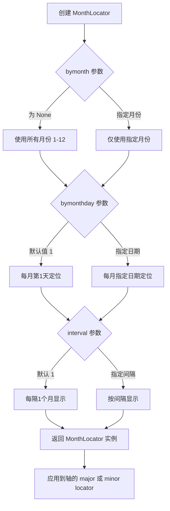

#### 带注释源码

```python
# dates.MonthLocator() 源代码结构（基于 matplotlib 源码）

class MonthLocator(RRuleLocator):
    """
    在每个月的指定日期定位刻度。
    
    继承自 RRuleLocator，使用重复规则（rrule）来计算月份位置。
    """
    
    def __init__(self, bymonth=None, bymonthday=1, interval=1, tz=None):
        """
        初始化月份刻度定位器。
        
        参数：
        - bymonth: 指定月份（1-12），可以是单个整数或整数列表
        - bymonthday: 一个月中的第几天（默认1，即每月第一天）
        - interval: 月份之间的间隔（默认1）
        - tz: 时区信息
        """
        # 调用父类 RRuleLocator 的初始化方法
        # 创建一个重复规则（rrule）来计算月份日期
        rrule = rrulewrapper(MONTHLY, bymonth=bymonth, 
                            bymonthday=bymonthday, 
                            interval=interval)
        super(MonthLocator, self).__init__(rrule, tz=tz)
        
        # 这是一个内部变量，用于缓存计算结果
        self._locator = rrule
    
    def __call__(self):
        """
        返回刻度位置的数组。
        
        此方法在绘制图表时被调用，用于确定实际的刻度位置。
        """
        # 获取当前视图的最小和最大日期
        vmin, vmax = self.axis.get_view_interval()
        # 返回该范围内的月份日期位置
        return self.tick_values(vmin, vmax)
```

#### 关键组件信息

| 组件名称 | 一句话描述 |
|---------|-----------|
| `MonthLocator` | 用于在日期轴上按月定位刻度的类，继承自 `RRuleLocator` |
| `RRuleLocator` | 基于重复规则（rrule）的刻度定位器基类 |
| `DateFormatter` | 用于格式化日期刻度标签的类 |
| `set_major_locator()` | 设置主刻度定位器的方法 |
| `set_minor_locator()` | 设置次刻度定位器的方法 |

#### 潜在技术债务与优化空间

1. **月份天数不精确问题**：代码注释中提到 `16 is a slight approximation since months differ in number of days`，使用固定日期（如每月16日）会导致不同月份的实际位置略有偏差。可考虑使用 `BMonthLocator`（工作月份定位器）或自定义逻辑来更精确地处理这种情况。

2. **时区处理**：默认时区处理可能在跨时区数据展示时出现问题，需要明确传入 `tz` 参数。

3. **性能优化**：对于大规模数据集，频繁调用 `__call__` 可能会影响性能，可以考虑添加缓存机制。

#### 其它项目

- **设计目标**：提供灵活的月份刻度定位功能，支持自定义月份、日期和间隔。
- **错误处理**：如果传入无效的月份（>12 或 <1），可能会抛出异常或产生未定义行为。
- **外部依赖**：依赖 `matplotlib.dates` 模块中的 `rrulewrapper` 和 `RRuleLocator` 类。
- **使用场景**：常用于金融图表（股票价格）、气象数据可视化等需要按月展示时间序列的场景。


### `dates.DateFormatter`

`DateFormatter` 是 matplotlib.dates 模块中的日期格式化类，用于将日期时间对象转换为指定格式的字符串表示，常用于坐标轴刻度标签的格式化。

参数：

- `fmt`：`str`，strftime 格式字符串（如 `'%b'` 表示月份缩写，`'%Y-%m-%d'` 表示完整日期）
- `tz`：`datetime.tzinfo`，可选，时区信息，用于处理不同时区的日期显示

返回值：`DateFormatter`，返回一个新的日期格式化器实例，可直接赋值给 axis 的 formatter

#### 流程图

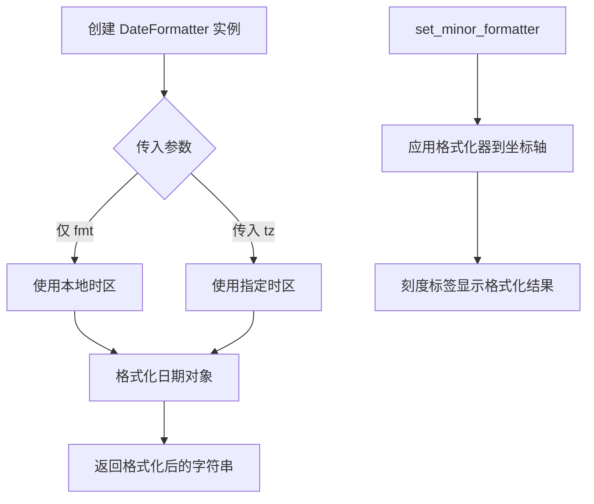

#### 带注释源码

```python
import matplotlib.dates as dates

# 创建 DateFormatter 实例，'%b' 表示月份的缩写形式（如 Jan, Feb, Mar...）
date_formatter = dates.DateFormatter('%b')

# 将格式化器应用到 x 轴的次要刻度（minor ticks）
ax.xaxis.set_minor_formatter(date_formatter)

# DateFormatter 内部实现逻辑（简化版）：
class DateFormatter(ticker.Formatter):
    """
    日期格式化器类，继承自 ticker.Formatter
    用于将 datetime 对象转换为字符串格式
    """
    
    def __init__(self, fmt, tz=None):
        """
        初始化方法
        
        Parameters:
        -----------
        fmt : str
            strftime 格式字符串，例如：
            - '%Y' 年份（四位）
            - '%m' 月份（01-12）
            - '%d' 日期（01-31）
            - '%b' 月份缩写（Jan-Dec）
            - '%H' 小时（00-23）
        tz : datetime.tzinfo, optional
            时区信息，如果不指定则使用本地时区
        """
        self._fmt = fmt
        self._tz = tz
    
    def __call__(self, x, pos=0):
        """
        格式化单个刻度值
        
        Parameters:
        -----------
        x : float
            刻度值，通常是转换为天数后的浮点数
        pos : int
            刻度位置索引
            
        Returns:
        --------
        str
            格式化后的日期字符串
        """
        # 将数值转换为 datetime 对象
        # matplotlib 内部使用浮点数表示自 1970-01-01 以来的天数
        dt = datetime.datetime.fromtimestamp(x, tz=self._tz)
        # 使用 strftime 格式化为字符串
        return dt.strftime(self._fmt)
    
    def set_locs(self, locs):
        """
        设置刻度位置，可用于预计算或优化
        在实际绘图前调用
        """
        self._locs = locs
```


### `ticker.NullFormatter`

空标签格式化器（NullFormatter）是 Matplotlib 中 ticker 模块的一个类，继承自 `Formatter` 基类。它的核心功能是返回一个空字符串，用于隐藏坐标轴上的刻度标签（tick labels）。在代码示例中，它被用于隐藏主刻度的标签，只显示次刻度的月份名称，从而实现标签居中于刻度之间的视觉效果。

参数：

- 无参数（`NullFormatter` 类的构造函数不接受任何参数）

返回值：`NullFormatter` 对象，返回一个刻度格式化器实例，用于将数值转换为空字符串

#### 流程图

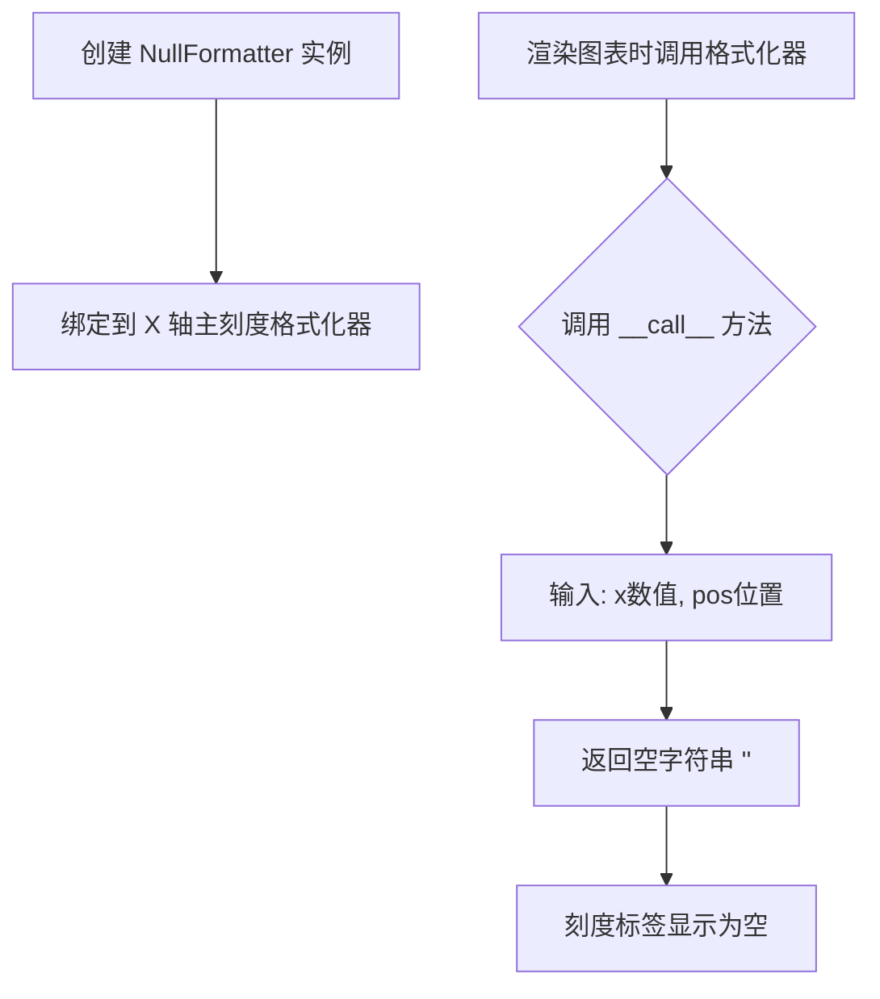

#### 带注释源码

```python
# matplotlib/ticker.py 中的 NullFormatter 类实现

class NullFormatter(Formatter):
    """
    刻度标签格式化器的基类
    所有格式化器都继承自 Formatter 类
    """
    
    def __init__(self):
        """
        初始化 NullFormatter
        不需要任何参数
        """
        # 调用父类 Formatter 的初始化方法
        super().__init__()
    
    def __call__(self, x, pos=None):
        """
        将数值 x 格式化为刻度标签字符串
        
        参数:
            x: float - 需要格式化的数值（刻度位置）
            pos: int - 刻度位置索引（可选，兼容接口）
        
        返回:
            str - 空字符串，用于隐藏刻度标签
        """
        # NullFormatter 的核心逻辑：总是返回空字符串
        # 这会使得该位置的刻度标签不显示
        return ''
```

#### 关键组件信息

| 组件名称 | 一句话描述 |
|---------|-----------|
| `ticker.NullFormatter` | 返回空字符串的刻度标签格式化器，用于隐藏坐标轴刻度标签 |
| `Formatter` | 刻度格式化器的抽象基类，定义了格式化接口 |

#### 潜在技术债务与优化空间

1. **功能单一性**：`NullFormatter` 仅返回空字符串，可以考虑合并到 `FuncFormatter` 中使用 lambda 函数实现相同功能
2. **文档完善**：当前类文档较为简单，可增加使用场景说明
3. **接口一致性**：可考虑支持更多格式化器通用接口方法（如 `format_ticks`）

#### 其它项目说明

- **设计目标**：提供一种简单的方式隐藏特定刻度的标签，无需自定义函数
- **使用约束**：通常与 `MinorLocator` 配合使用，用于实现主次刻度标签的差异化显示
- **错误处理**：无特殊错误处理，因为不涉及复杂逻辑
- **外部依赖**：依赖 `matplotlib.ticker.Formatter` 基类
- **代码示例中的使用场景**：
  - `ax.xaxis.set_major_formatter(ticker.NullFormatter())` 隐藏主刻度的月份标签
  - 结合次刻度格式化器 `dates.DateFormatter('%b')` 显示月份缩写
  - 配合 `tick_params(axis='x', which='minor', tick1On=False, tick2On=False)` 隐藏次刻度线
  - 最终效果：月份标签显示在两个主刻度之间的位置


### `Axes.tick_params`

设置刻度（tick）和刻度标签（tick label）的外观参数，包括刻度线的长度、宽度、颜色、方向，以及标签的字体大小、颜色、旋转角度等属性。

参数：

- `axis`：`{'x', 'y', 'both'}`，指定要设置参数的轴，默认为 `'both'`
- `which`：`{'major', 'minor', 'both'}`，指定要修改的刻度类型，默认为 `'major'`
- `reset`：`bool`，如果为 `True`，则在应用其他参数之前将所有刻度参数重置为默认值，默认为 `False`
- `**kwargs`：其他关键字参数，用于设置具体的刻度属性，包括：
  - `length`：`float`，刻度线的长度（以点为单位）
  - `width`：`float`，刻度线的宽度（以点为单位）
  - `color`：`color`，刻度线的颜色
  - `pad`：`float`，刻度标签与刻度线之间的间距（以点为单位）
  - `labelsize`：`float` 或 `str`，刻度标签的字体大小
  - `labelcolor`：`color`，刻度标签的颜色
  - `labelrotation`：`float`，刻度标签的旋转角度（以度为单位）
  - `direction`：`{'in', 'out', 'inout'}`，刻度线的方向（向内、向外或双向）
  - `tick1On`：`bool`，是否显示主刻度线（靠近轴的一侧）
  - `tick2On`：`bool`，是否显示次刻度线（远离轴的一侧）
  - `label1On`：`bool`，是否显示主刻度标签
  - `label2On`：`bool`，是否显示次刻度标签
  - `rotation`：`float`，刻度标签的旋转角度（与 labelrotation 相同）
  - `colors`：`dict`，同时设置刻度线和刻度标签颜色的字典

返回值：`None`，该方法无返回值，直接修改 Axes 对象的刻度属性。

#### 流程图

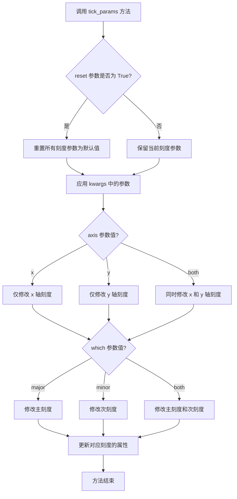

#### 带注释源码

```python
def tick_params(self, axis='both', which='major', reset=False, **kwargs):
    """
    设置刻度和刻度标签的外观参数。
    
    参数:
        axis: {'x', 'y', 'both'} - 要设置的轴
        which: {'major', 'minor', 'both'} - 要设置的刻度类型
        reset: bool - 是否在应用新参数前重置为默认值
        **kwargs: 其他刻度属性参数
    
    返回值:
        None
    """
    # 如果 reset 为 True，先将所有刻度参数重置为默认值
    if reset:
        # 重置主刻度和次刻度的所有显示和样式参数
        self._reset_major_tick_params()
        self._reset_minor_tick_params()
    
    # 确定要修改的轴
    # 'both' 表示同时影响 x 轴和 y 轴
    if axis in ['x', 'both']:
        # 根据 which 参数选择要修改的刻度类型
        if which in ['major', 'both']:
            self._set_tick_params(which='major', **kwargs)
        if which in ['minor', 'both']:
            self._set_tick_params(which='minor', **kwargs)
    
    if axis in ['y', 'both']:
        if which in ['major', 'both']:
            self._set_tick_params(which='major', **kwargs)
        if which in ['minor', 'both']:
            self._set_tick_params(which='minor', **kwargs)
    
    # 示例用法（来自提供的代码）:
    # ax.tick_params(axis='x', which='minor', tick1On=False, tick2On=False)
    # 上述调用表示：
    # - 作用于 x 轴
    # - 修改次刻度 (minor ticks)
    # - tick1On=False: 不显示主刻度线
    # - tick2On=False: 不显示次刻度线
    # 这样可以隐藏次刻度线，同时保留次刻度标签用于显示月份名称
```


### `plt.subplots`

`plt.subplots()` 是 `matplotlib.pyplot` 模块中的函数，用于创建一个新的 Figure 对象和一个或多个 Axes 子图，并返回它们供用户绘图使用。在给定的代码中，它被调用以创建包含绘图区域的 Figure 和 Axes 对象。

参数：

- `nrows`：`int`，默认值为 1，表示子图的行数。
- `ncols`：`int`，默认值为 1，表示子图的列数。
- `sharex`：`bool` 或 `str`，默认值为 `False`，如果为 `True` 或 `'row'`，则所有子图共享 x 轴。
- `sharey`：`bool` 或 `str`，默认值为 `False`，如果为 `True` 或 `'col'`，则所有子图共享 y 轴。
- `squeeze`：`bool`，默认值为 `True`，如果为 `True`，则压缩返回的 Axes 数组维度。
- `width_ratios`：`array-like`，可选，表示子图列的宽度比例。
- `height_ratios`：`array-like`，可选，表示子图行的高度比例。
- `subplot_kw`：`dict`，可选，用于创建子图的关键字参数（如 `projection`）。
- `gridspec_kw`：`dict`，可选，用于 GridSpec 的关键字参数。
- `**fig_kw`：可选，创建 Figure 时的其他关键字参数（如 `figsize`、`dpi`）。

返回值：`fig`（`matplotlib.figure.Figure` 对象）和 `ax`（`matplotlib.axes.Axes` 对象或 `numpy` 数组），分别表示创建的图形和子图。

#### 流程图

```mermaid
flowchart TD
    A[调用 plt.subplots] --> B{传入参数?}
    B -->|是| C[解析参数: nrows, ncols, sharex, sharey, squeeze, etc.]
    B -->|否| D[使用默认参数: nrows=1, ncols=1]
    C --> E[创建 Figure 对象: fig = Figure(...)]
    E --> F[创建 GridSpec 布局: gridspec.GridSpec]
    F --> G[创建 Axes 对象: ax = fig.add_subplot]
    G --> H{是否共享轴?}
    H -->|是| I[配置共享轴: sharex/sharey]
    H -->|否| J[返回 fig, ax]
    I --> J
    J --> K[根据 squeeze 参数整理返回值]
    K --> L[返回 (fig, ax) 或 (fig, axes)]
```

#### 带注释源码

```python
# matplotlib.pyplot.subplots 的简化实现逻辑
def subplots(nrows=1, ncols=1, sharex=False, sharey=False, squeeze=True,
             width_ratios=None, height_ratios=None, subplot_kw=None,
             gridspec_kw=None, **fig_kw):
    """
    创建一个 Figure 和一组子图 Axes。
    
    参数:
        nrows (int): 子图行数，默认 1。
        ncols (int): 子图列数，默认 1。
        sharex (bool or str): 是否共享 x 轴，默认 False。
        sharey (bool or str): 是否共享 y 轴，默认 False。
        squeeze (bool): 是否压缩返回的 Axes 数组，默认 True。
        width_ratios (array-like): 列宽度比例，可选。
        height_ratios (array-like): 行高度比例，可选。
        subplot_kw (dict): 创建子图的关键字参数，可选。
        gridspec_kw (dict): GridSpec 的关键字参数，可选。
        **fig_kw: 创建 Figure 的其他关键字参数。
    
    返回:
        fig (Figure): 创建的 Figure 对象。
        ax (Axes or ndarray): 创建的 Axes 对象或数组。
    """
    # 1. 创建 Figure 对象
    fig = Figure(**fig_kw)
    
    # 2. 创建 GridSpec 用于布局管理
    gs = GridSpec(nrows, ncols, width_ratios=width_ratios, 
                  height_ratios=height_ratios, **gridspec_kw)
    
    # 3. 创建子图 Axes
    axes = []
    for i in range(nrows):
        for j in range(ncols):
            # 使用 add_subplot 创建 Axes
            ax = fig.add_subplot(gs[i, j], **(subplot_kw or {}))
            axes.append(ax)
    
    # 4. 处理共享轴逻辑
    if sharex:
        # 如果 sharex 为 True 或 'row'/'col'，配置共享
        for ax in axes[1:]:
            if sharex == True or sharex == 'row':
                ax.sharex(axes[0])
            # 注意：具体实现更复杂，需处理行列共享
    
    if sharey:
        # 类似处理 sharey
        pass
    
    # 5. 根据 squeeze 参数整理返回值
    if squeeze:
        # 如果 nrows==1 and ncols==1，返回单个 Axes
        # 否则返回一维数组（如果可能）
        axes = np.array(axes).squeeze()
    
    # 6. 返回 Figure 和 Axes
    # 如果只有一个子图且 squeeze，可能只返回 ax 而不是数组
    return fig, axes
```

注意：上述源码是对 `plt.subplots` 工作原理的简化注释，实际实现位于 `matplotlib.pyplot` 模块中，涉及更多细节和边界情况处理。


### `ax.plot()`

在给定的代码中，`ax.plot()` 是 matplotlib 库中 `Axes` 类的绘图方法，用于绘制折线图。代码中使用该方法绘制了 Google 股票的价格数据（日期与调整后收盘价的对应关系），将日期作为 x 轴，调整后收盘价作为 y 轴，形成股价走势图。

参数：

-  `x`：`array-like`，表示 x 轴数据（日期数组）
-  `y`：`array-like`，表示 y 轴数据（价格数组）
-  `fmt`：`str`，可选，格式字符串，用于快速设置线条样式、颜色和标记
-  `**kwargs`：其他关键字参数，用于自定义线条属性（如颜色、线宽、标签等）

返回值：`list`，返回包含 `Line2D` 对象的列表，每条线对应一个数据系列

#### 流程图

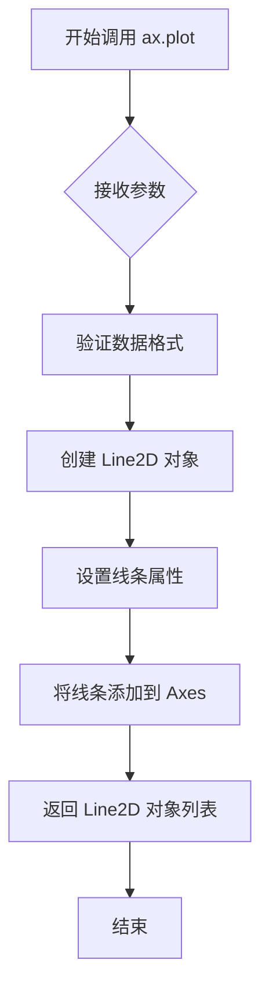

#### 带注释源码

```python
# 从代码中提取的 ax.plot() 调用示例
ax.plot(r["date"], r["adj_close"])
# r["date"] - 包含日期数据的数组
# r["adj_close"] - 包含调整后收盘价数据的数组
# 该调用返回一个 Line2D 对象列表，可用于进一步自定义线条样式
```

注意：上述源码是**调用示例**，并非 `Axes.plot()` 方法的源码定义。`Axes.plot()` 方法属于 matplotlib 库的核心方法，其完整源码位于 matplotlib 库文件中，不在此示例代码范围内。此处仅展示该方法在本示例中的具体调用方式。


### `Axes.set_xlabel`

设置 x 轴的标签文字，用于显示坐标轴的名称和描述信息。该方法接受标签文本字符串以及可选的字体样式字典、标签间距和对齐方式参数，并返回创建的 `Text` 对象以便进一步自定义。

参数：

- `xlabel`：`str`，要设置为 x 轴标签的文本内容
- `fontdict`：`dict`，可选，用于控制标签外观的字体属性字典（如字体大小、颜色、样式等）
- `labelpad`：`float`，可选，标签与坐标轴之间的间距（磅值）
- `loc`：`str`，可选，标签的对齐位置（'left'、'center'、'right'）
- `**kwargs`：可选，其他传递给 `matplotlib.text.Text` 的属性参数

返回值：`matplotlib.text.Text`，返回创建的文本对象，可用于后续的样式调整和属性修改

#### 流程图

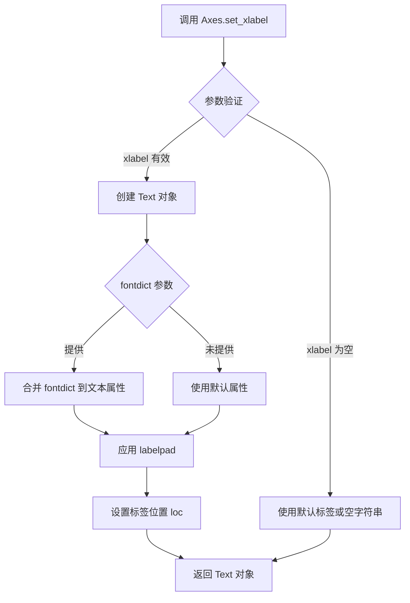

#### 带注释源码

```python
def set_xlabel(self, xlabel, fontdict=None, labelpad=None, *, loc=None, **kwargs):
    """
    设置 x 轴的标签。
    
    Parameters
    ----------
    xlabel : str
        标签文本内容
    fontdict : dict, optional
        字体属性字典，用于控制文本外观
    labelpad : float, optional
        标签与轴之间的间距
    loc : str, optional
        标签位置 ('left', 'center', 'right')
    **kwargs
        传递给 Text 类的其他关键字参数
    
    Returns
    -------
    text : matplotlib.text.Text
        返回创建的文本对象
    """
    # 获取 x 轴标签文本对象（通过 _get_text 方法）
    # 如果已存在标签则获取，否则创建新的
    label = self.xaxis.get_label()
    
    # 设置标签文本内容
    label.set_text(xlabel)
    
    # 如果提供了 fontdict，则合并到文本属性
    if fontdict is not None:
        label.update(fontdict)
    
    # 如果提供了 labelpad 参数，设置标签与轴的间距
    if labelpad is not None:
        label.set_pad(labelpad)
    
    # 应用其他关键字参数到标签
    label.update(kwargs)
    
    # 返回创建的 Text 对象以便进一步自定义
    return label
```

**代码中的应用示例：**

```python
# 从数据中提取中间日期的年份作为 x 轴标签
imid = len(r) // 2  # 计算数据中间位置的索引
ax.set_xlabel(str(r["date"][imid].item().year))  # 设置 x 轴标签为年份字符串
```

在提供的示例代码中，`ax.set_xlabel(str(r["date"][imid].item().year))` 接收一个字符串参数，该字符串是从数据数组中间位置的日期元素中提取的年份值。这个调用会创建一个显示在 x 轴下方的文本标签，用于标识图表的 x 轴含义。


### `Axes.tick_params`

设置刻度线和刻度标签的各种属性，如可见性、方向、长度、宽度、颜色等。该方法允许用户自定义坐标轴上刻度线的外观和行为，支持主刻度和次刻度的独立配置。

参数：

- `axis`：`{'x', 'y', 'both'}`，指定要设置参数的坐标轴，默认为 `'both'`
- `which`：`{'major', 'minor', 'both'}`，指定要修改的刻度类型，默认为 `'major'`
- `reset`：`bool`，如果为 `True`，在设置新参数前重置为默认值，默认为 `False`
- `direction`：`{'in', 'out', 'inout'}`，刻度线的方向（向内、向外或双向）
- `length`：float，刻度线的长度（以点为单位）
- `width`：float，刻度线的宽度
- `color`：color，刻度线的颜色
- `pad`：float，刻度线与刻度标签之间的间距
- `labelsize`：float，刻度标签的字体大小
- `labelcolor`：color，刻度标签的颜色
- `gridOn`：bool，是否显示网格线
- `tick1On`：bool，是否显示第一条刻度线（位于轴内侧）
- `tick2On`：bool，是否显示第二条刻度线（位于轴外侧）
- `labelrotation`：float，刻度标签的旋转角度（以度为单位）
- `zorder`：float，刻度和标签的绘制顺序
- `**kwargs`：其他接受的关键字参数将传递给文本属性设置

返回值：`None`，该方法无返回值，直接修改 Axes 对象的内部状态

#### 流程图

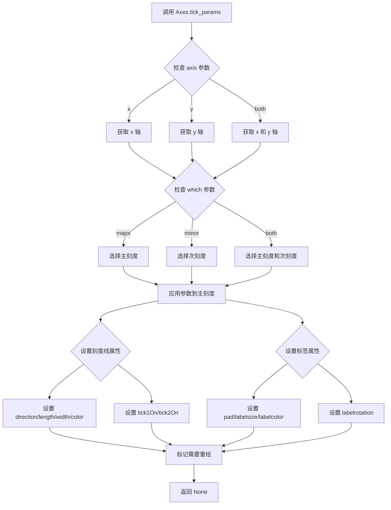

#### 带注释源码

```python
def tick_params(self, axis='both', which='major', reset=False, **kwargs):
    """
    设置刻度线和刻度标签的各种属性
    
    参数
    ----------
    axis : {'x', 'y', 'both'}, optional
        指定要设置参数的坐标轴，默认为 'both'
    which : {'major', 'minor', 'both'}, optional
        指定要修改的刻度类型，默认为 'major'
    reset : bool, optional
        如果为 True，在设置新参数前重置为默认值，默认为 False
    **kwargs : 关键字参数
        可用的关键字参数包括：
        - direction: {'in', 'out', 'inout'} 刻度方向
        - length: float 刻度长度
        - width: float 刻度宽度
        - color: color 刻度颜色
        - pad: float 刻度与标签间距
        - labelsize: float 标签字体大小
        - labelcolor: color 标签颜色
        - gridOn: bool 是否显示网格
        - tick1On: bool 是否显示内侧刻度线
        - tick2On: bool 是否显示外侧刻度线
        - labelrotation: float 标签旋转角度
        - zorder: float 绘制顺序
        - colors: dict 包含 'major' 和 'minor' 的颜色字典
        - left/right/top/bottom: bool 是否在相应位置显示刻度线
    
    返回值
    -------
    None
    
    示例
    --------
    >>> ax.tick_params(axis='x', which='minor', length=0)  # 隐藏次刻度线
    >>> ax.tick_params(axis='y', direction='in', length=10)  # Y轴刻度向内
    >>> ax.tick_params(axis='both', labelrotation=45)  # 所有标签旋转45度
    """
    # 如果 reset 为 True，先将所有刻度参数重置为默认值
    if reset:
        self._reset_major_tick_params()
        self._reset_minor_tick_params()
    
    # 确定要操作的坐标轴
    if axis in ['x', 'both']:
        # 获取 x 轴的刻度器
        x = self.xaxis
        if which in ['major', 'both']:
            # 应用参数到主刻度
            x._set_tickparams(which='major', **kwargs)
        if which in ['minor', 'both']:
            # 应用参数到次刻度
            x._set_tickparams(which='minor', **kwargs)
    
    if axis in ['y', 'both']:
        # 获取 y 轴的刻度器
        y = self.yaxis
        if which in ['major', 'both']:
            y._set_tickparams(which='major', **kwargs)
        if which in ['minor', 'both']:
            y._set_tickparams(which='minor', **kwargs)
    
    # 标记需要更新视图
    self.stale_callback = True
```


### `Axis.set_major_locator`

设置轴的主刻度定位器（Locator），用于确定主刻度在坐标轴上的位置。该方法接受一个定位器对象作为参数，并将其绑定到对应的坐标轴对象上，从而控制主刻度的生成规则。

参数：

- `locator`：`matplotlib.ticker.Locator`，用于定位主刻度位置的定位器对象，常见的内置定位器包括 `MaxNLocator`、`AutoLocator`、`FixedLocator`、`NullLocator`、`LinearLocator`、`LogLocator`、`MultipleLocator`、`OldAutoLocator` 等

返回值：`None`，该方法直接修改轴对象的内部状态，不返回任何值

#### 流程图

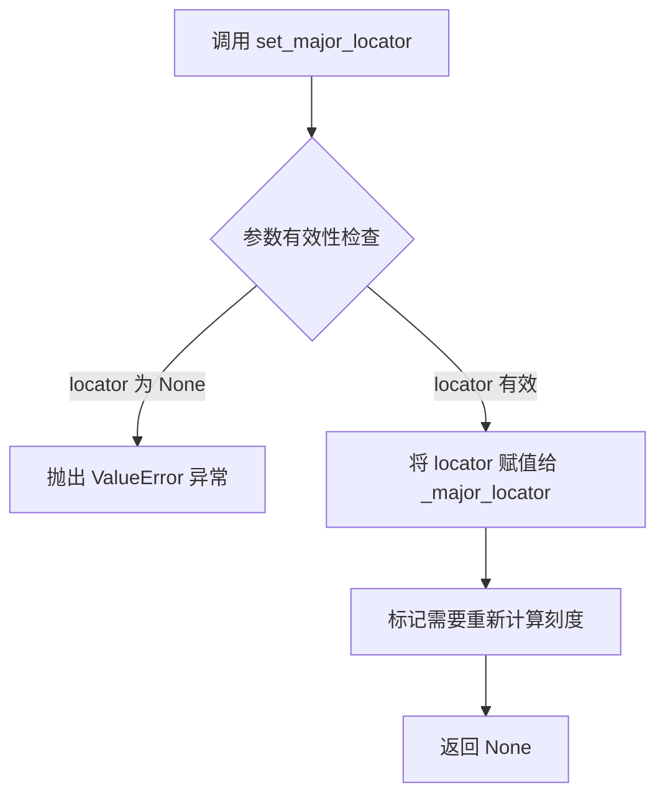

#### 带注释源码

```python
def set_major_locator(self, locator):
    """
    Set the locator of the major ticker.

    The locator locates the major ticks and determines the ticks
    to be drawn. This method can also be used to set a minor ticker
    with `set_minor_locator`.

    Parameters
    ----------
    locator : `matplotlib.ticker.Locator`
        The locator is responsible for finding positions and
        optionally labels of ticks.

    Examples
    --------
    To set the major ticks every 10 units::

        ax.xaxis.set_major_locator(matplotlib.ticker.MultipleLocator(10))

    To set the major ticks to the 1st and 15th of each month::

        ax.xaxis.set_major_locator(
            matplotlib.dates.MonthLocator(bymonthday=[1, 15])
        )
    """
    # 检查 locator 参数是否为 None，如果是则抛出 ValueError
    # 因为不能使用 None 作为定位器
    if not callable(locator):
        raise ValueError(
            "locator must be a callable object that returns "
            "an array of tick locations"
        )
    
    # 将传入的 locator 对象赋值给实例变量 _major_locator
    # 这个变量会在后续绘制刻度时被读取使用
    self._major_locator = locator
    
    # 通知 Axis 对象需要重新计算刻度
    # 这会触发 _update_scale 方法来重新评估是否需要重新设置刻度
    self._update_scale(locator)
    
    # 设置 _autoscaleon 更新标志为 True
    # 确保在下次绘图时自动调整刻度范围
    self.stale = True
```

#### 额外说明

该方法的核心作用是建立坐标轴与刻度定位器之间的关联。在 matplotlib 的架构设计中，定位器（Locator）负责计算刻度的位置，而格式化器（Formatter）负责生成刻度的标签文本。通过 `set_major_locator` 方法，用户可以自定义主刻度的分布模式，例如：

- **均匀分布**：使用 `LinearLocator`、`MaxNLocator` 或 `AutoLocator`
- **对数分布**：使用 `LogLocator`
- **特定倍数**：使用 `MultipleLocator`
- **日期分布**：使用 `dates.MonthLocator`、`dates.DayLocator` 等

该方法会标记坐标轴为"stale"（陈旧）状态，触发后续的重新渲染流程。


### `Axis.set_minor_locator`

设置 X 轴（或 Y 轴）的次要刻度定位器（Minor Tick Locator），用于控制次要刻度的位置分布。

参数：

- `locator`：`matplotlib.ticker.Locator`，指定次要刻度的定位方式（如 MonthLocator、DayLocator、AutoMinorLocator 等）

返回值：`None`，该方法无返回值（matplotlib 中 setter 方法通常返回 None）

#### 流程图

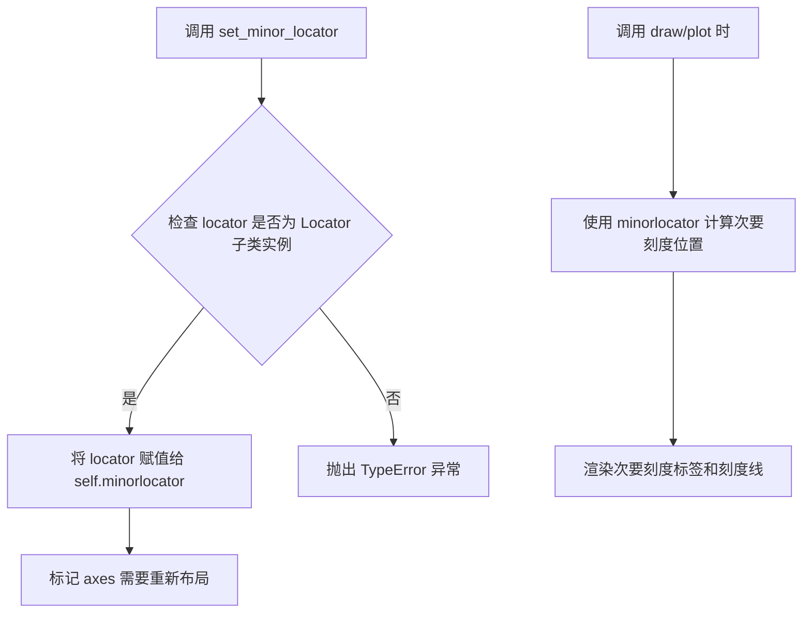

#### 带注释源码

```python
def set_minor_locator(self, locator):
    """
    Set the minor locator of the axis.
    
    Parameters
    ----------
    locator : matplotlib.ticker.Locator
        The locator object used to determine minor tick positions.
        Common locators include:
        - AutoMinorLocator: 自动分配次要刻度
        - MultipleLocator: 按固定间隔设置次要刻度
        - MonthLocator: 按月份设置次要刻度
        - DayLocator: 按日期设置次要刻度
    
    Examples
    --------
    >>> import matplotlib.ticker as ticker
    >>> ax.xaxis.set_minor_locator(ticker.AutoMinorLocator())
    >>> ax.yaxis.set_minor_locator(ticker.MultipleLocator(0.5))
    """
    # 验证 locator 是否为 Locator 类的实例
    if not isinstance(locator, ticker.Locator):
        raise TypeError(
            f"locator must be a matplotlib.ticker.Locator instance, "
            f"got {type(locator).__name__} instead"
        )
    
    # 存储定位器对象
    self.minorlocator = locator
    
    # 通知 axes 需要重新计算刻度
    # 这确保了下次绘图时次要刻度会被重新计算
    self.axes._request_autoscale_view()
    
    # 清除缓存的刻度位置信息，强制重新计算
    self._major_locator = None
    self._minor_locator = None
```

#### 使用示例源码（来自任务代码）

```python
import matplotlib.dates as dates

# 设置 X 轴次要刻度定位器为每月 16 日
# 在主刻度（每月1日）之间创建次要刻度
ax.xaxis.set_minor_locator(dates.MonthLocator(bymonthday=16))

# 配合以下设置实现标签居中效果：
# 1. 隐藏主刻度标签（使用 NullFormatter）
ax.xaxis.set_major_formatter(ticker.NullFormatter())
# 2. 显示次要刻度标签
ax.xaxis.set_minor_formatter(dates.DateFormatter('%b'))
# 3. 隐藏次要刻度线（只保留标签）
ax.tick_params(axis='x', which='minor', tick1On=False, tick2On=False)
```


### `Axis.set_major_formatter`

该方法用于设置坐标轴主刻度（major ticks）的标签格式化器。在给定的代码示例中，通过将主刻度格式化器设置为 `NullFormatter()`，实现了隐藏默认的主刻度标签，从而为后续手动设置次刻度标签（minor tick labels）腾出空间，实现标签在刻度之间居中显示的效果。

参数：

-  `formatter`：`matplotlib.ticker.Formatter`，指定用于格式化主刻度标签的格式化器对象。常见的格式化器包括 `NullFormatter()`（不显示标签）、`DateFormatter()`（日期格式）、`ScalarFormatter()`（数值格式）等。

返回值：`None`，该方法通常不返回值，仅修改 Axis 对象的内部状态。

#### 流程图

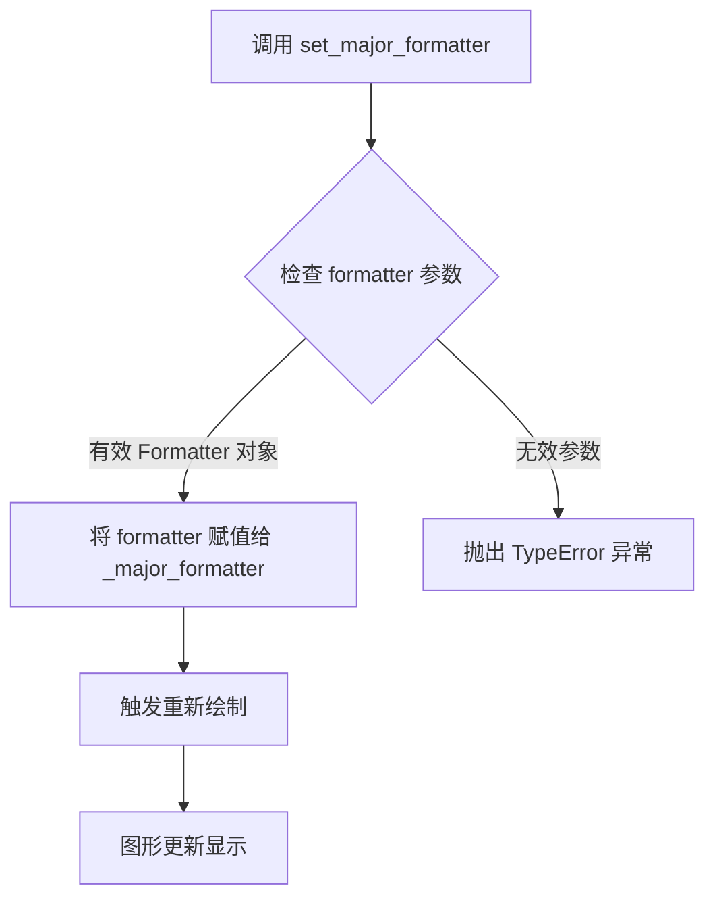

#### 带注释源码

```python
def set_major_formatter(self, formatter):
    """
    设置坐标轴主刻度的标签格式化器。
    
    参数:
        formatter: Formatter 对象, 用于控制主刻度标签的显示格式
        
    示例 (来自代码):
        # 隐藏主刻度标签, 为次刻度标签腾出空间
        ax.xaxis.set_major_formatter(ticker.NullFormatter())
        
        # 设置日期格式的次刻度标签
        ax.xaxis.set_minor_formatter(dates.DateFormatter('%b'))
    """
    # 调用父类方法, 将格式化器对象存储到 Axis 对象的 _major_formatter 属性中
    self._major_formatter = formatter
    
    # 通知 Axis 对象刻度标签已更改, 需要重新计算刻度位置
    self.stale = True
    
    # 返回 self 以支持链式调用 (某些版本)
    return self
```

#### 在示例代码中的上下文

```python
# 加载财务数据 (Google 股票价格)
r = cbook.get_sample_data('goog.npz')['price_data']
r = r[-250:]  # 获取最近250天

fig, ax = plt.subplots()
ax.plot(r["date"], r["adj_close"])

# 设置主刻度定位器为月初
ax.xaxis.set_major_locator(dates.MonthLocator())
# 设置次刻度定位器为每月16日 (用于居中显示标签)
ax.xaxis.set_minor_locator(dates.MonthLocator(bymonthday=16))

# ==================== 核心调用 ====================
# 将主刻度格式化器设置为 NullFormatter, 隐藏主刻度标签
# 这是实现"标签居中于刻度之间"效果的关键步骤
ax.xaxis.set_major_formatter(ticker.NullFormatter())
# ==================================================

# 设置次刻度格式化器为月份缩写格式 (如 Jan, Feb 等)
ax.xaxis.set_minor_formatter(dates.DateFormatter('%b'))

# 隐藏次刻度标记线 (只显示标签)
ax.tick_params(axis='x', which='minor', tick1On=False, tick2On=False)

# 获取中间日期的年份作为X轴标签
imid = len(r) // 2
ax.set_xlabel(str(r["date"][imid].item().year))
plt.show()
```

#### 关键技术细节

| 项目 | 描述 |
|------|------|
| **设计目标** | 通过隐藏主刻度标签并显示次刻度标签，模拟标签在两个主刻度之间居中的视觉效果 |
| **约束条件** | 需要配合 `set_major_locator()` 和 `set_minor_locator()` 使用才能达到最佳效果 |
| **错误处理** | 如果传入非 Formatter 对象，会抛出 TypeError |
| **数据流** | Formatter 对象 → Axis._major_formatter → 渲染时应用到刻度标签 |
| **外部依赖** | 依赖 `matplotlib.ticker` 模块中的 Formatter 类及其子类 |


# 设计文档：Axis.set_minor_formatter()

## 描述

`Axis.set_minor_formatter()` 是 Matplotlib 中 Axis 类的一个方法，用于设置坐标轴次要刻度（minor ticks）的标签格式化器。该方法接受一个 Formatter 对象作为参数，用于控制次要刻度标签的显示格式，例如日期格式、百分比格式等。

## 参数

- `formatter`：`matplotlib.ticker.Formatter`，用于格式化次要刻度标签的格式化器对象

## 返回值

`matplotlib.ticker.Formatter`，返回设置的格式化器对象，通常用于链式调用或保存引用

## 流程图

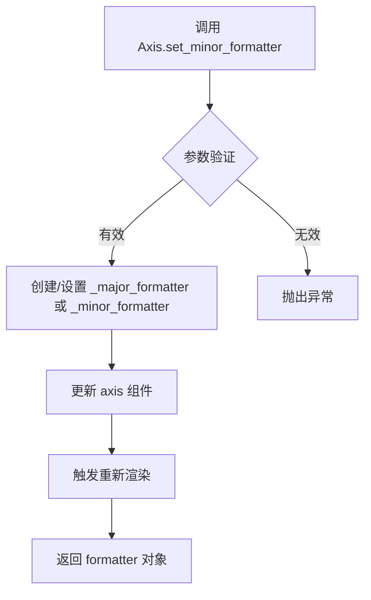

## 带注释源码

```python
# 示例代码展示 set_minor_formatter 的使用方式

import matplotlib.pyplot as plt
import matplotlib.dates as dates
import matplotlib.ticker as ticker
import matplotlib.cbook as cbook

# 加载示例数据
r = cbook.get_sample_data('goog.npz')['price_data']
r = r[-250:]  # 获取最后250天的数据

# 创建图表和坐标轴
fig, ax = plt.subplots()
ax.plot(r["date"], r["adj_close"])

# 设置主刻度定位器为月份定位器
ax.xaxis.set_major_locator(dates.MonthLocator())

# 设置次要刻度定位器为每月16号的月份定位器
# 16是轻微的近似值，因为月份天数不同
ax.xaxis.set_minor_locator(dates.MonthLocator(bymonthday=16))

# 设置主刻度格式化器为空格式化器（不显示主刻度标签）
ax.xaxis.set_major_formatter(ticker.NullFormatter())

# 设置次要刻度格式化器为日期格式化器
# 格式为月份缩写（如Jan, Feb, Mar等）
# 这就是 Axis.set_minor_formatter() 方法的调用
ax.xaxis.set_minor_formatter(dates.DateFormatter('%b'))

# 移除次要刻度线条
ax.tick_params(axis='x', which='minor', tick1On=False, tick2On=False)

# 设置x轴标签为中间日期的年份
imid = len(r) // 2
ax.set_xlabel(str(r["date"][imid].item().year))

plt.show()
```

## 关键组件信息

| 组件名称 | 描述 |
|---------|------|
| `Axis` | 坐标轴类，包含刻度定位器和格式化器的管理 |
| `Formatter` | 刻度标签格式化器基类 |
| `DateFormatter` | 日期特定格式化器，支持strftime格式字符串 |
| `MonthLocator` | 月份刻度定位器 |
| `NullFormatter` | 空格式化器，用于隐藏刻度标签 |

## 潜在的技术债务或优化空间

1. **硬编码的日期近似值**：代码中使用 `bymonthday=16` 来近似月份中间位置，但不同月份的实际中间位置不同（29-31天不等）
2. **缺乏错误处理**：没有对无效格式化器参数的验证
3. **魔法数字**：刻度标签居中的逻辑依赖于特定的定位器设置，缺少抽象

## 其它说明

### 设计目标与约束

- **目标**：实现刻度标签在刻度之间的居中显示
- **约束**：依赖于 Matplotlib 的次要刻度系统，需要正确配置定位器和格式化器

### 错误处理与异常设计

- 如果传入无效的格式化器对象，可能导致运行时错误
- 建议在使用前验证格式化器对象的有效性

### 数据流与状态机

1. 设置 `MajorLocator` → 2. 设置 `MinorLocator` → 3. 设置 `MajorFormatter` 为 `NullFormatter` → 4. 设置 `MinorFormatter` → 5. 隐藏次要刻度线 → 6. 渲染图表

### 外部依赖与接口契约

- 依赖 `matplotlib.dates.DateFormatter`
- 依赖 `matplotlib.ticker.NullFormatter`
- 依赖 `matplotlib.dates.MonthLocator`
- 接口契约：必须传入有效的 Formatter 子类实例

## 关键组件


### 数据加载模块

通过matplotlib.cbook.get_sample_data()加载谷歌股票价格数据，并提取最近250个交易日的数据用于可视化展示。

### 图表绘制模块

使用matplotlib.pyplot创建图表和坐标轴，绘制股票价格随时间变化的折线图。

### 主刻度定位器

使用dates.MonthLocator()设置主刻度定位器，每个月显示一个主刻度。

### 次刻度定位器

使用dates.MonthLocator(bymonthday=16)设置次刻度定位器，通过bymonthday=16参数使次刻度位于每月16号左右，实现标签在刻度之间的居中效果。

### 主刻度格式化器

使用ticker.NullFormatter()将主刻度标签设置为空，实现隐藏主刻度标签的效果。

### 次刻度格式化器

使用dates.DateFormatter('%b')将次刻度标签格式化为月份缩写（如Jan、Feb等），实现月份标签显示。

### 刻度线控制模块

使用ax.tick_params()方法设置axis='x'和which='minor'，通过tick1On=False和tick2On=False参数隐藏次刻度的刻度线。

### 标签居中实现逻辑

通过在主刻度之间插入次刻度，并将次刻度标签设置为月份，同时隐藏主刻度标签和次刻度刻度线，从而实现标签在刻度之间居中的视觉效果。


## 问题及建议


### 已知问题

-   **硬编码的近似值**：使用 `bymonthday=16` 作为次要刻度位置，这是对每月天数不同的近似，会导致某些月份的标签位置不够精确
-   **魔法数字**：250 是硬编码的"魔法数字"，缺乏解释其含义（获取最近250天的数据）
-   **变量命名不清晰**：`r` 作为数据变量名缺乏描述性，`imid` 变量名不直观
-   **缺少错误处理**：`cbook.get_sample_data()` 调用没有异常处理，若数据加载失败会导致程序崩溃
-   **资源管理问题**：使用 `plt.show()` 后没有显式的图形关闭或资源释放逻辑
-   **API过时风险**：`matplotlib.cbook.get_sample_data` 是较老的API，可能在将来版本中变更或弃用
-   **类型提示缺失**：数据访问 `r["date"]`、`r["adj_close"]` 等缺乏类型提示，降低代码可维护性
-   **年份获取方式繁琐**：通过 `r["date"][imid].item().year` 获取年份的方式不够直观，可读性差

### 优化建议

-   使用更精确的日期定位策略，例如计算每个月的中位数日期或使用自定义 locator
-   将常量提取为具名变量，如 `NUM_RECENT_DAYS = 250`，并添加文档注释
-   重命名变量为更描述性的名称，如 `price_data`、`mid_index` 等
-   添加 try-except 块处理数据加载异常，提供友好的错误信息
-   考虑使用 `fig.savefig()` 替代或配合 `plt.show()`，并使用 `with` 上下文或显式 `plt.close(fig)` 管理资源
-   探索使用 `pandas` 处理时间序列数据，提供更好的类型提示和更清晰的数据操作
-   为函数和主要代码块添加文档字符串（docstring），提高代码可读性和可维护性

## 其它


### 核心功能概述

该代码实现了在matplotlib图表中将月份标签居中显示在刻度之间的功能，通过同时使用主刻度定位器和副刻度定位器，并利用NullFormatter隐藏主刻度标签，从而实现标签在相邻主刻度中间显示的视觉效果。

### 整体运行流程

1. 导入必要的matplotlib模块
2. 从示例数据文件加载谷歌股票价格数据
3. 提取最近250天的数据
4. 创建图形和坐标轴对象
5. 在坐标轴上绘制日期与调整后收盘价的折线图
6. 设置x轴主刻度定位器为月份定位器
7. 设置x轴副刻度定位器为每月16号的月份定位器
8. 设置主刻度格式器为空格式器（隐藏主刻度标签）
9. 设置副刻度格式器为日期格式器（显示月份缩写）
10. 隐藏副刻度线和副刻度标签
11. 获取数据中间位置的年份作为x轴标签
12. 显示图形

### 类的详细信息

#### matplotlib.pyplot 模块

- **fig**: matplotlib.figure.Figure对象，图形容器
- **ax**: matplotlib.axes.Axes对象，坐标轴对象

#### matplotlib.cbook 模块

- **get_sample_data**: 函数，用于获取示例数据文件

#### matplotlib.dates 模块

- **MonthLocator**: 类，用于在每个月创建刻度
- **DateFormatter**: 类，用于格式化日期显示

#### matplotlib.ticker 模块

- **NullFormatter**: 类，用于隐藏刻度标签

### 全局变量信息

| 名称 | 类型 | 描述 |
|------|------|------|
| r | numpy.ndarray | 包含谷歌股票价格数据的数组 |
| fig | matplotlib.figure.Figure | 图形对象 |
| ax | matplotlib.axes.Axes | 坐标轴对象 |
| imid | int | 数据中间位置的索引 |

### 方法和函数信息

#### ax.plot()

- **参数名称**: x, y
- **参数类型**: array-like, array-like
- **参数描述**: x轴数据（日期）和y轴数据（调整后收盘价）
- **返回值类型**: list of matplotlib.lines.Line2D
- **返回值描述**: 绘制的线条对象列表
- **mermaid流程图**:
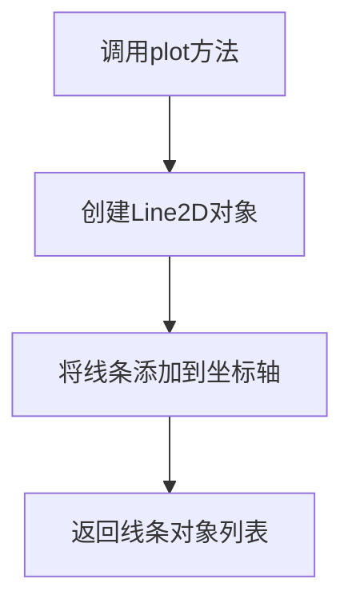
- **带注释源码**:
```python
ax.plot(r["date"], r["adj_close"])  # 绘制日期与收盘价的折线图
```

#### ax.xaxis.set_major_locator()

- **参数名称**: locator
- **参数类型**: matplotlib.ticker.Locator
- **参数描述**: 主刻度定位器对象
- **返回值类型**: None
- **返回值描述**: 无返回值
- **mermaid流程图**:
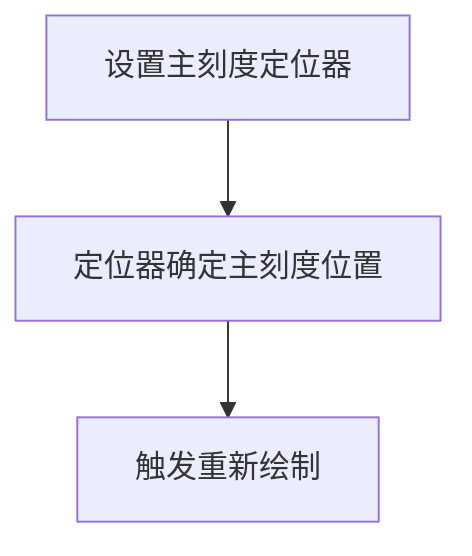
- **带注释源码**:
```python
ax.xaxis.set_major_locator(dates.MonthLocator())  # 设置主刻度为每月
```

#### ax.xaxis.set_minor_locator()

- **参数名称**: locator
- **参数类型**: matplotlib.ticker.Locator
- **参数描述**: 副刻度定位器对象
- **返回值类型**: None
- **返回值描述**: 无返回值
- **带注释源码**:
```python
ax.xaxis.set_minor_locator(dates.MonthLocator(bymonthday=16))  # 设置副刻度为每月16日
```

#### ax.xaxis.set_major_formatter()

- **参数名称**: formatter
- **参数类型**: matplotlib.ticker.Formatter
- **参数描述**: 主刻度格式器对象
- **返回值类型**: None
- **返回值描述**: 无返回值
- **带注释源码**:
```python
ax.xaxis.set_major_formatter(ticker.NullFormatter())  # 隐藏主刻度标签
```

#### ax.xaxis.set_minor_formatter()

- **参数名称**: formatter
- **参数类型**: matplotlib.ticker.Formatter
- **参数描述**: 副刻度格式器对象
- **返回值类型**: None
- **返回值描述**: 无返回值
- **带注释源码**:
```python
ax.xaxis.set_minor_formatter(dates.DateFormatter('%b'))  # 设置副刻度标签为月份缩写
```

#### ax.tick_params()

- **参数名称**: axis, which, tick1On, tick2On
- **参数类型**: str, str, bool, bool
- **参数描述**: axis指定轴，which指定刻度类型，tick1On和tick2On控制刻度线显示
- **返回值类型**: None
- **返回值描述**: 无返回值
- **带注释源码**:
```python
ax.tick_params(axis='x', which='minor', tick1On=False, tick2On=False)  # 隐藏副刻度线
```

### 关键组件信息

| 组件名称 | 描述 |
|----------|------|
| MonthLocator | 用于在每个日历月创建刻度的定位器 |
| MonthLocator(bymonthday=16) | 在每月16号创建副刻度的定位器，用于实现居中效果 |
| NullFormatter | 格式器基类，用于隐藏刻度标签 |
| DateFormatter('%b') | 将日期格式化为月份缩写形式（如Jan、Feb） |
| tick_params | 用于控制刻度线显示和隐藏的参数设置方法 |

### 潜在技术债务和优化空间

1. **硬编码日期值**: 代码中使用了硬编码的bymonthday=16，这只是一个近似值，因为不同月份的天数不同
2. **缺乏错误处理**: 没有对数据加载失败或数据格式错误的情况进行处理
3. **魔法数字**: 250和16作为硬编码数字，应该定义为常量或配置参数
4. **重复计算**: 数据切片r[-250:]和imid = len(r) // 2可以合并优化

### 设计目标与约束

- **设计目标**: 实现标签在刻度之间居中显示的视觉效果
- **约束条件**: 
  - 依赖于matplotlib库的正确安装和版本兼容性
  - 样本数据文件'goog.npz'必须存在于matplotlib的样本数据目录中
  - 仅适用于需要将类别标签居中的场景

### 错误处理与异常设计

- **数据加载异常**: 如果get_sample_data无法找到数据文件，应捕获FileNotFoundError并给出明确错误提示
- **数据格式异常**: 如果加载的数据缺少所需字段（date或adj_close），应进行数据验证
- **空数据处理**: 如果数据为空，应避免执行绘图操作
- **日期格式异常**: 如果日期数据格式不符合预期，DateFormatter可能产生错误输出

### 数据流与状态机

数据流：
1. 数据源（numpy数据文件）→ get_sample_data() → numpy数组
2. numpy数组 → 数据切片 → 绘图数据
3. 绘图数据 → ax.plot() → Line2D对象
4. 定位器和格式器 → 坐标轴 → 刻度和标签渲染

状态转换：
- 初始状态（导入模块）
- 数据加载状态（加载数据）
- 图形创建状态（创建fig和ax）
- 绘图状态（绘制数据）
- 格式设置状态（设置刻度定位器和格式器）
- 显示状态（调用plt.show()）

### 外部依赖与接口契约

- **matplotlib.pyplot**: 图形创建和显示的接口
- **matplotlib.cbook.get_sample_data**: 示例数据加载接口，返回numpy数组
- **matplotlib.dates.MonthLocator**: 月份刻度定位接口
- **matplotlib.dates.DateFormatter**: 日期格式化接口
- **matplotlib.ticker.NullFormatter**: 刻度标签隐藏接口

### 性能考虑

- 数据切片操作（r[-250:]）会创建新数组，对于大数据集可能有性能影响
- 刻度定位器的计算复杂度与数据点数量相关
- plt.show()会阻塞主线程直至图形关闭

### 兼容性考虑

- 代码依赖于matplotlib 3.x版本
- 日期处理依赖于numpy的datetime64类型
- 样本数据文件'goog.npz'可能在不同版本的matplotlib中位置不同

### 使用示例和测试用例

- **基本用法**: 直接运行代码即可看到月份标签居中效果
- **自定义日期**: 可以修改bymonthday参数调整标签位置
- **自定义格式**: 可以修改DateFormatter的格式字符串（如'%B'显示完整月份名）
- **测试验证**: 可以通过检查ax.xaxis.get_minorticklocs()验证副刻度位置是否符合预期

    