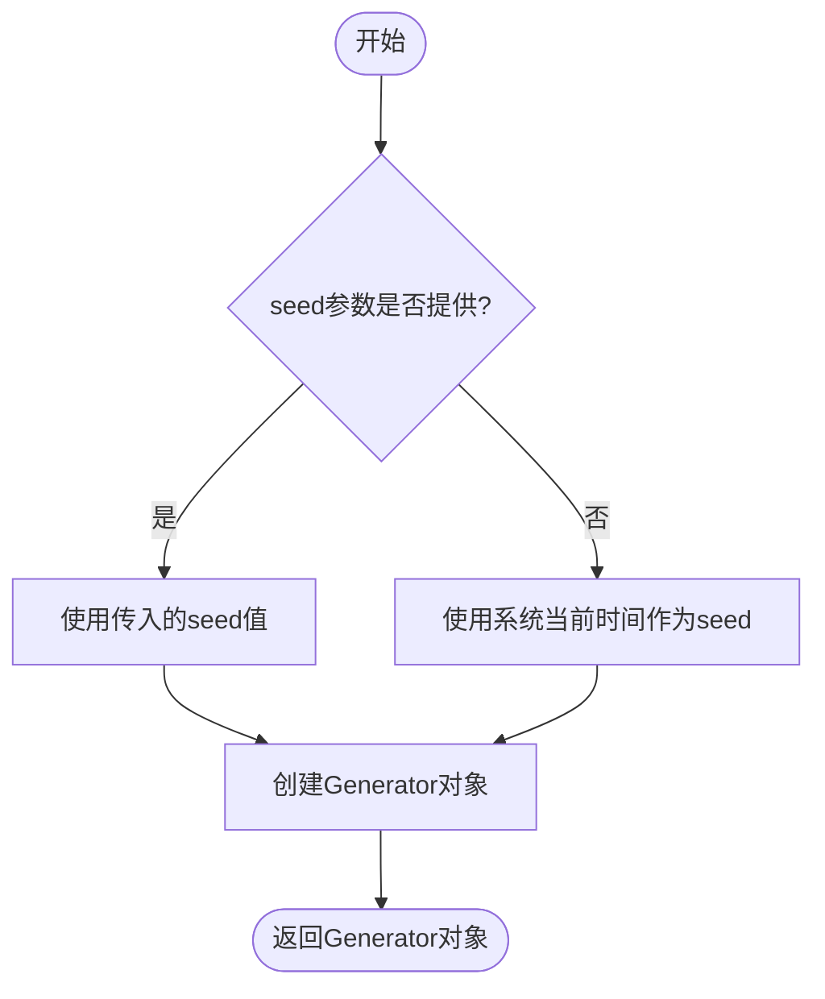
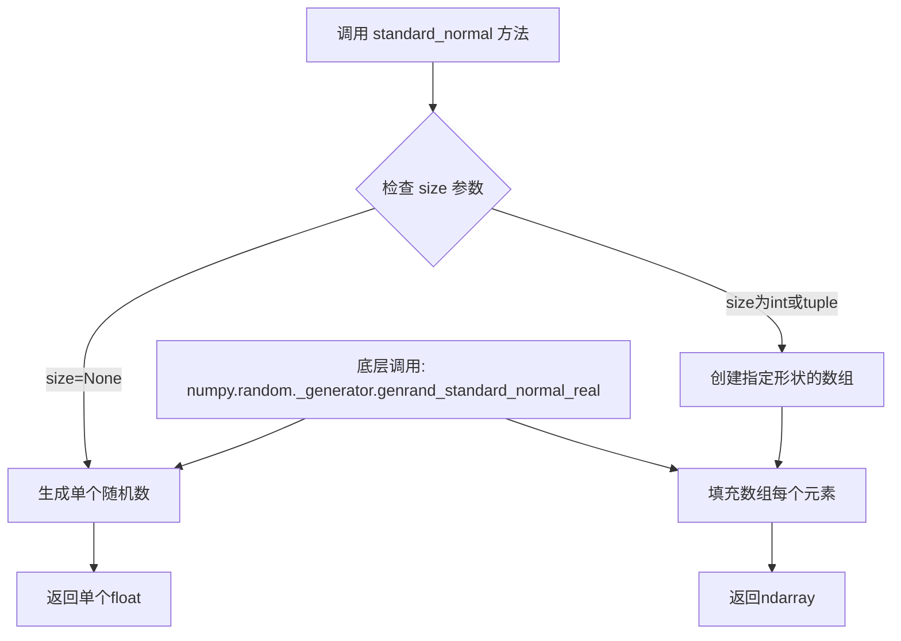
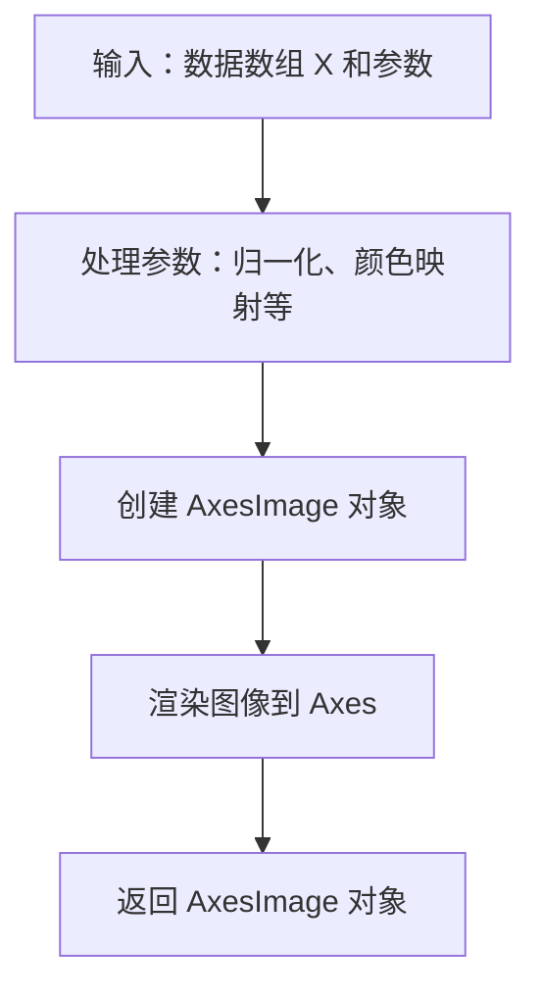
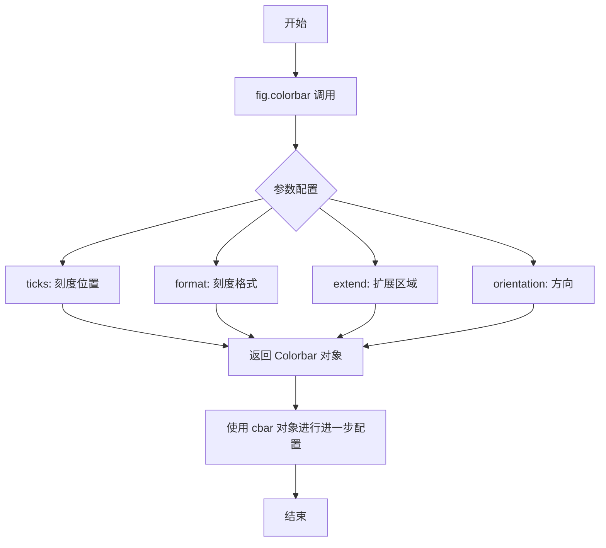
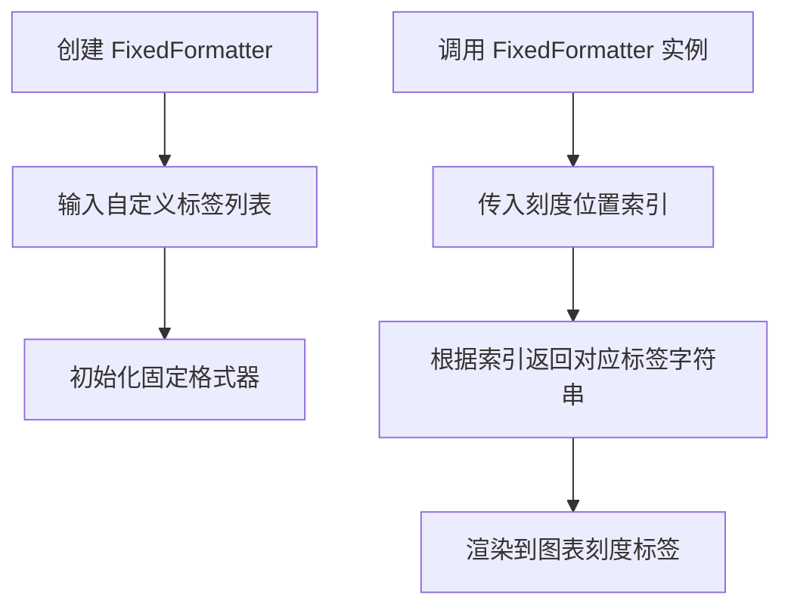
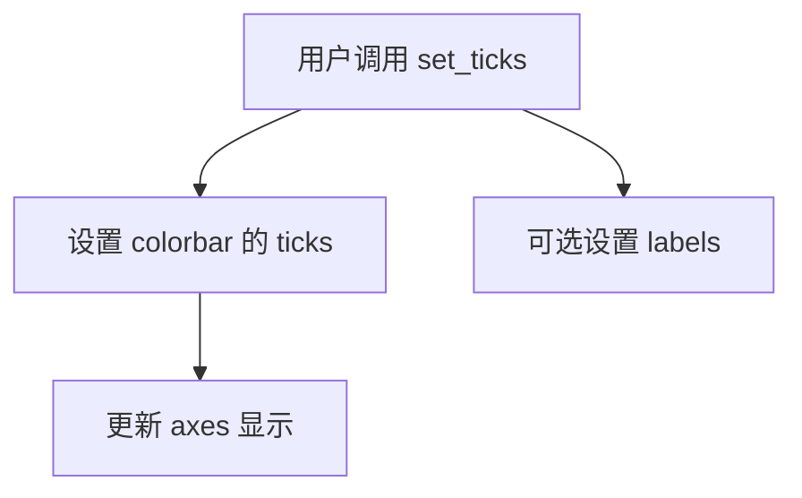
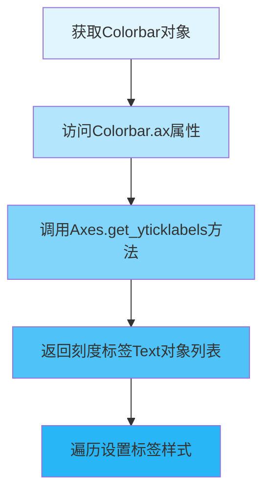
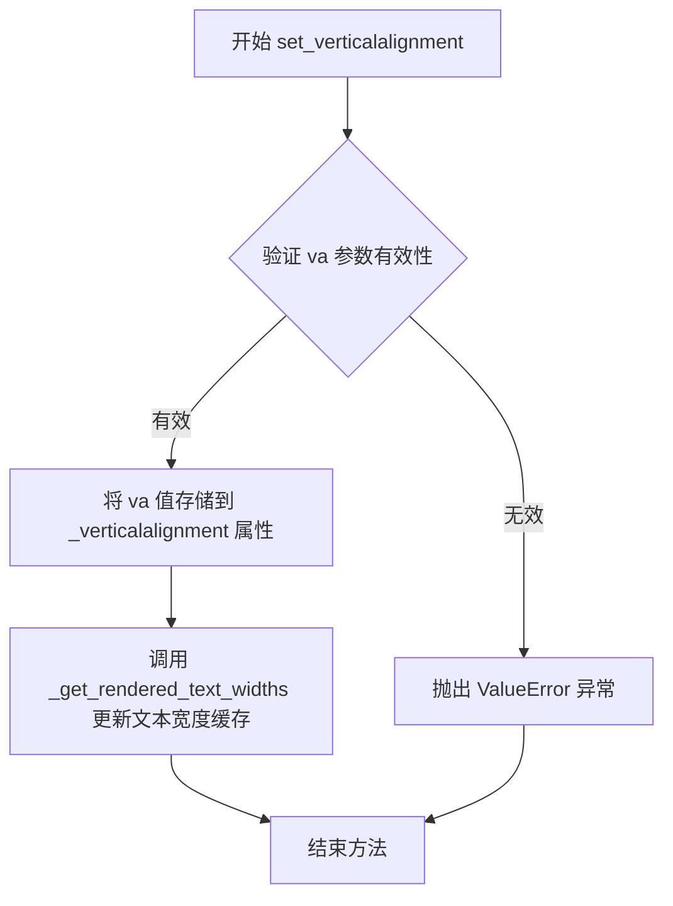
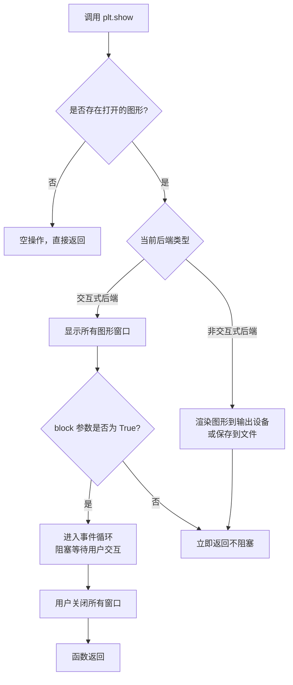
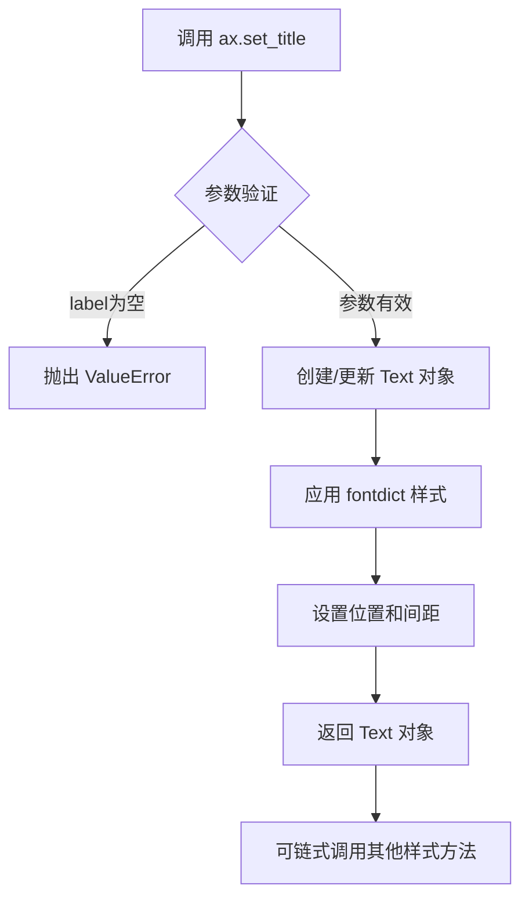

# `matplotlib\galleries\examples\ticks\colorbar_tick_labelling_demo.py` 详细设计文档

这是一个 Matplotlib 示例脚本，演示了如何通过设置刻度位置 (ticks)、格式化字符串 (format) 以及手动调整文本对齐方式来定制垂直和水平颜色条 (Colorbar) 的标签显示。

## 整体流程

```mermaid
graph TD
    Start([开始]) --> Imports[导入库: matplotlib.pyplot, numpy, matplotlib.ticker]
    Imports --> Setup[设置随机数生成器: rng]
    Setup --> VerticalFlow{垂直颜色条流程}
    VerticalFlow --> V1[创建画布: fig, ax = plt.subplots()]
    V1 --> V2[生成数据: data = rng.standard_normal(...)]
    V2 --> V3[绑定数据: cax = ax.imshow(...)]
    V3 --> V4[创建颜色条: cbar = fig.colorbar(cax, ticks, format)]
    V4 --> V5[获取标签: labels = cbar.ax.get_yticklabels()]
    V5 --> V6[调整对齐: set_verticalalignment]
    V6 --> HorizontalFlow{水平颜色条流程}
    HorizontalFlow --> H1[创建画布: fig, ax = plt.subplots()]
    H1 --> H2[处理数据: data = np.clip(data, -1, 1)]
    H2 --> H3[绑定数据: cax = ax.imshow(...)]
    H3 --> H4[创建颜色条: cbar = fig.colorbar(cax, orientation='horizontal')]
    H4 --> H5[设置标签: cbar.set_ticks(...)]
    H5 --> Show[plt.show()]
```

## 类结构

```
No custom class hierarchy (Procedural Script using Matplotlib Library)
└── Uses: matplotlib.figure.Figure -> matplotlib.axes.Axes -> matplotlib.image.AxesImage
└── Uses: matplotlib.colorbar.Colorbar
```

## 全局变量及字段


### `rng`
    
用于生成随机数状态的随机数生成器，确保结果可复现。

类型：`numpy.random.Generator`
    


### `fig`
    
matplotlib的图形对象，表示整个图形窗口，用于容纳坐标轴和可视化元素。

类型：`matplotlib.figure.Figure`
    


### `ax`
    
matplotlib的坐标轴对象，用于绘图、显示图像及设置标题等。

类型：`matplotlib.axes.Axes`
    


### `data`
    
存储高斯噪声数据的二维numpy数组，作为图像显示的数据源。

类型：`numpy.ndarray`
    


### `cax`
    
由imshow生成的图像对象，表示在坐标轴上渲染的图像数据。

类型：`matplotlib.image.AxesImage`
    


### `cbar`
    
颜色条对象，用于显示颜色映射与数值的对应关系，并可设置刻度和标签。

类型：`matplotlib.colorbar.Colorbar`
    


### `labels`
    
颜色条刻度标签的文本对象列表，用于访问和调整单个标签的样式和对齐方式。

类型：`list of matplotlib.text.Text`
    


    

## 全局函数及方法


### `numpy.random.default_rng`

该函数用于创建一个随机数生成器（Random Generator）对象，该对象是 NumPy 中新的随机数生成接口，支持多种分布的随机数采样，可通过种子（seed）参数保证结果的可重复性。

参数：

- `seed`：`int`, `float`, `str`, `bytes`, `bytearray`, `array`, `BitGenerator`, `Generator`, `None`，可选，用于初始化随机数生成器的种子值。如果为 `None`，则使用系统当前时间作为种子。

返回值：`numpy.random.Generator`，返回一个随机数生成器对象，可用于生成各种分布的随机数。

#### 流程图



#### 带注释源码

```python
# numpy.random.default_rng 是 NumPy 提供的函数，用于创建随机数生成器
# 参数 seed: 随机数种子，用于保证随机结果的可重复性
# 返回值: Generator 对象，可调用其方法生成随机数

# 创建随机数生成器实例，种子设为 19680801
rng = np.random.default_rng(seed=19680801)

# 生成的随机数示例（代码中实际使用）
# data = rng.standard_normal((250, 250))  # 生成250x250的正态分布随机数
```


### `numpy.random.Generator.standard_normal`

从标准正态分布（均值=0，标准差=1）中生成随机样本的方法，可指定输出数组的形状。

参数：

-  `size`：`int` 或 `tuple of ints` 或 `None`，输出数组的形状。如果为 `None`，则返回单个浮点数。默认值为 `None`。

返回值：`float` 或 `ndarray`，从标准正态分布中抽取的随机样本。如果 `size` 为 `None`，返回单个浮点数；否则返回相应形状的数组。

#### 流程图



#### 带注释源码

```python
# numpy.random.Generator.standard_normal 的简化实现逻辑
def standard_normal(self, size=None):
    """
    从标准正态分布生成随机样本。
    
    参数:
        size: 输出形状，可以是:
            - None: 返回单个标量
            - int: 返回一维数组，长度为size
            - tuple: 返回多维数组，形状为size
    
    返回:
        随机样本，类型为float或ndarray
    """
    # 调用底层C语言实现的随机数生成器
    # genrand_standard_normal_real 是Mersenne Twister算法的变体
    # 用于生成符合标准正态分布的随机数
    
    if size is None:
        # 返回单个随机数（标量）
        return self._random_generator.genrand_standard_normal_real()
    else:
        # 返回数组形式
        return self._random_generator.genrand_standard_normal(size)
```

#### 额外说明

在提供的代码中的实际使用方式：

```python
# 创建随机数生成器实例
rng = np.random.default_rng(seed=19680801)

# 调用 standard_normal 方法生成 250x250 的随机数组
# 等价于 numpy.random.Generator.standard_normal(size=(250, 250))
data = rng.standard_normal((250, 250))
```

- **设计目标**：提供高质量的伪随机数生成，符合 IEEE 754 双精度浮点数标准
- **约束**：依赖 Mersenne Twister 算法，需要初始化种子
- **错误处理**：如果 `size` 为负数或包含负值，会抛出 `ValueError`
- **性能**：底层实现为C语言，批量生成效率高


### numpy.clip

`numpy.clip` 是 NumPy 库的内置函数，用于将数组中的元素限制在指定的范围内（裁剪）。在给定的代码中，该函数用于将高斯噪声数据裁剪到 `[-1, 1]` 范围内，确保数据值不超过颜色映射的显示阈值。

参数：

- `a`：`array_like`，输入数组，即需要被裁剪的数组（本代码中为 `data`，即 `rng.standard_normal((250, 250))` 生成的 250x250 高斯噪声数组）
- `a_min`：`scalar` 或 `array_like` 或 `None`，裁剪的下限（本代码中为 `-1`）
- `a_max`：`scalar` 或 `array_like` 或 `None`，裁剪的上限（本代码中为 `1`）
- `out`：`ndarray`，可选，用于存放结果的数组（代码中未使用）
- `dtype`：`dtype`，可选，指定输出数组的数据类型（代码中未使用）

返回值：`ndarray`，返回裁剪后的数组，数组中的每个元素都被限制在 `[a_min, a_max]` 范围内

#### 流程图

```mermaid
flowchart TD
    A[输入数组 data] --> B{判断元素值}
    B -->|值 < -1| C[将值设为 -1]
    B -->|值在 [-1, 1] 之间| D[保持原值]
    B -->|值 > 1| E[将值设为 1]
    C --> F[返回裁剪后的数组]
    D --> F
    E --> F
```

#### 带注释源码

```python
# numpy.clip 函数的简化实现原理
# 在本代码中的实际调用：
clipped_data = np.clip(data, -1, 1)

# 源码调用解析：
# data: 输入数组，rng.standard_normal((250, 250)) 生成的 250x250 高斯噪声数据
# -1: 裁剪下限 a_min，所有小于 -1 的值将被替换为 -1
# 1: 裁剪上限 a_max，所有大于 1 的值将被替换为 1
# 
# 等效操作（伪代码）：
# result = np.where(data < -1, -1, np.where(data > 1, 1, data))
# 
# 结果：返回一个新的数组，其中所有值都被限制在 [-1, 1] 范围内
```

#### 关键组件信息

| 组件名称 | 一句话描述 |
|---------|-----------|
| `np.clip` | NumPy 库的内置函数，将数组元素限制在指定范围内 |
| `rng.standard_normal` | NumPy 随机数生成器，生成标准正态分布随机数 |

#### 潜在技术债务与优化空间

1. **重复计算**：代码中先使用 `vmin=-1, vmax=1` 渲染图像，再调用 `np.clip` 裁剪数据。这两次范围限制操作可以合并，减少不必要的计算。

2. **内存效率**：直接修改原始 `data` 数组而非创建副本可以节省内存（若后续不需要原始数据）。

#### 其它说明

- **设计目标**：该示例展示了如何为彩色图像的颜色条（colorbar）设置刻度标签，并通过 `np.clip` 确保数据值与颜色映射范围一致。
  
- **错误处理**：`numpy.clip` 在 `a_min > a_max` 时会抛出 `ValueError`，这是符合预期的一致性校验。

- **数据流**：原始随机数据（无界）→ `np.clip` 裁剪（有界 [-1, 1]）→ `ax.imshow` 可视化（颜色映射）

- **外部依赖**：本函数依赖 NumPy 库，是 Matplotlib 可视化流程中的数据预处理步骤。


### `matplotlib.pyplot.subplots`

`matplotlib.pyplot.subplots` 是 Matplotlib 库中的一个函数，用于创建一个包含多个子图的图形窗口，并返回图形对象和轴对象数组。该函数封装了 Figure 和 Axes 的创建过程，提供便捷的接口来生成单或多子图布局。

参数：

- `nrows`：`int`，可选，默认值为1。子图网格的行数。
- `ncols`：`int`，可选，默认值为1。子图网格的列数。
- `sharex`：`bool` 或 `str`，可选，默认值为False。如果为True，所有子图共享x轴；如果为'col'，则每列子图共享x轴。
- `sharey`：`bool` 或 `str`，可选，默认值为False。如果为True，所有子图共享y轴；如果为'row'，则每行子图共享y轴。
- `squeeze`：`bool`，可选，默认值为True。如果为True，返回的Axes数组维度会被压缩为合适的维度（对于单行或单列会降维）。
- `width_ratios`：`array-like`，可选。定义每列宽度相对比例的数组，长度必须等于ncols。
- `height_ratios`：`array-like`，可选。定义每行高度相对比例的数组，长度必须等于nrows。
- `subplot_kw`：`dict`，可选。传递给`add_subplot`的关键字参数，用于配置子图。
- `gridspec_kw`：`dict`，可选。传递给GridSpec构造函数的关键字参数，用于配置网格布局。
- `figsize`：`tuple`，可选。图形尺寸，格式为(宽度, 高度)，单位为英寸。
- `dpi`：`int`，可选。图形分辨率（每英寸点数）。

返回值：`tuple[Figure, Axes or array of Axes]`，返回一个元组，包含Figure对象和Axes对象（或Axes对象数组）。如果nrows和ncols都为1，返回(Figure, Axes)；如果squeeze=False且nrows>1或ncols>1，返回(Figure, array of Axes)；如果squeeze=True，根据返回的轴的数量和类型，可能返回不同维度的数组。

#### 流程图

```mermaid
graph TD
    A[调用 plt.subplots] --> B{参数验证}
    B -->|参数有效| C[创建 Figure 对象]
    C --> D[创建 GridSpec]
    D --> E[根据 nrows, ncols 创建子图布局]
    E --> F[调用 Figure.add_subplot 创建 Axes]
    F --> G{创建多个 Axes?}
    G -->|是| H[返回 (Figure, Axes数组)]
    G -->|否| I[返回 (Figure, Axes)]
    B -->|参数无效| J[抛出异常]
```

#### 带注释源码

```python
def subplots(nrows=1, ncols=1, sharex=False, sharey=False, squeeze=True,
             width_ratios=None, height_ratios=None,
             subplot_kw=None, gridspec_kw=None, figsize=None, dpi=None):
    """
    创建包含子图的图形窗口。
    
    参数:
        nrows: 子图行数，默认为1
        ncols: 子图列数，默认为1
        sharex: 是否共享x轴，可为bool或'col'
        sharey: 是否共享y轴，可为bool或'row'
        squeeze: 是否压缩返回的Axes数组维度
        width_ratios: 每列宽度比例
        height_ratios: 每行高度比例
        subplot_kw: 传递给子图的关键字参数
        gridspec_kw: 传递给GridSpec的关键字参数
        figsize: 图形尺寸(宽度, 高度)
        dpi: 图形分辨率
    
    返回:
        (Figure, Axes): 图形对象和轴对象
    """
    # 1. 创建Figure对象，指定尺寸和分辨率
    fig = Figure(figsize=figsize, dpi=dpi)
    
    # 2. 创建GridSpec对象，配置网格布局
    gs = GridSpec(nrows, ncols, 
                  width_ratios=width_ratios,
                  height_ratios=height_ratios,
                  **gridspec_kw)
    
    # 3. 创建子图数组
    axarr = []
    for i in range(nrows):
        for j in range(ncols):
            # 4. 为每个网格位置创建Axes
            ax = fig.add_subplot(gs[i, j], **subplot_kw)
            axarr.append(ax)
    
    # 5. 处理共享轴逻辑
    if sharex:
        # 配置子图共享x轴
        _share_axes(axarr, 'x', sharex)
    if sharey:
        # 配置子图共享y轴
        _share_axes(axarr, 'y', sharey)
    
    # 6. 根据squeeze参数处理返回值
    if squeeze:
        # 压缩维度：单行或单列时返回1维数组
        axarr = np.squeeze(axarr)
    
    # 7. 返回Figure和Axes
    return fig, axarr
```


### `matplotlib.axes.Axes.imshow`

matplotlib.axes.Axes.imshow 方法用于在 Axes 对象上显示二维数据数组作为热图，支持自定义颜色映射、数据范围、插值方式等参数，以便可视化矩阵数据。

参数：
- `data`：`numpy.ndarray` 或 `array-like`，要显示的二维数据数组，通常为矩阵形式。
- `vmin`：`float`，可选，数据值的最小值，用于颜色映射的归一化，若指定则与 vmax 一起定义颜色范围。
- `vmax`：`float`，可选，数据值的最大值，用于颜色映射的归一化，若指定则与 vmin 一起定义颜色范围。
- `cmap`：`str`，可选，颜色映射名称，用于将数据值映射为颜色，如 'coolwarm'、'afmhot' 等。

返回值：`matplotlib.image.AxesImage`，返回一个 AxesImage 对象，表示显示的图像，可用于进一步定制（如添加颜色条）或访问图像数据。

#### 流程图



#### 带注释源码

```python
# 示例代码中第一次调用：创建垂直颜色条的热图
# 参数：data 为数据数组，vmin 和 vmax 定义颜色范围，cmap 指定颜色映射
cax = ax.imshow(data, vmin=-1, vmax=1, cmap='coolwarm')

# 示例代码中第二次调用：创建水平颜色条的热图
# 参数：data 为数据数组，cmap 指定颜色映射
cax = ax.imshow(data, cmap='afmhot')

# imshow 方法的核心逻辑（简化版）
def imshow(self, X, cmap=None, vmin=None, vmax=None, **kwargs):
    """
    在 Axes 上显示图像或数据数组作为热图。
    
    参数:
    - X: array-like 要显示的数据数组
    - cmap: str 颜色映射名称
    - vmin: float 最小值
    - vmax: float 最大值
    - **kwargs: 其他关键字参数（如 interpolation、alpha 等）
    
    返回:
    - AxesImage: 图像对象
    """
    # 1. 处理输入数据 X，转换为数组
    # 2. 根据 vmin、vmax 创建归一化对象 norm
    # 3. 使用 cmap 创建颜色映射
    # 4. 创建 AxesImage 对象，设置图像数据、归一化、颜色映射等
    # 5. 将图像添加到 Axes 并返回
```


### 注意事项

**无法从给定代码中提取 `matplotlib.figure.Figure.colorbar` 方法的完整信息**

经分析，给定的代码是一份 **matplotlib 使用示例文档**，用于演示如何在图表中添加和配置颜色条（colorbar）。该代码展示了：

1. 如何创建垂直和水平颜色条
2. 如何设置刻度位置和格式
3. 如何调整刻度标签的样式

然而，**该代码并未包含 `matplotlib.figure.Figure.colorbar` 方法的实现源码**。`Figure.colorbar` 是 matplotlib 库的内置方法，其实现位于 matplotlib 库的内部，不在当前提供的代码范围内。

---

### 如果需要提取 `Figure.colorbar` 方法的详细信息，建议：

1. **访问 matplotlib 官方源代码仓库**：https://github.com/matplotlib/matplotlib
2. **定位文件**：通常在 `lib/matplotlib/figure.py` 文件中的 `Figure` 类内
3. **提取方法**：查找 `colorbar` 方法的完整实现

---

### 从给定代码中可以提取的信息

虽然无法获取 `Figure.colorbar` 方法的实现细节，但可以从示例代码中提取其**调用方式**：

#### 流程图



#### 示例代码中的调用方式

```python
# 示例 1: 垂直颜色条，带刻度设置
cbar = fig.colorbar(cax,
                    ticks=[-1, 0, 1],
                    format=mticker.FixedFormatter(['< -1', '0', '> 1']),
                    extend='both'
                    )

# 示例 2: 水平颜色条
cbar = fig.colorbar(cax, orientation='horizontal')

# 示例 3: 使用 set_ticks 方法设置刻度
cbar.set_ticks(ticks=[-1, 0, 1], labels=['Low', 'Medium', 'High'])
```

---

### 总结

要获取 `matplotlib.figure.Figure.colorbar` 方法的完整技术文档（包括参数、返回值、源码等），需要查看 matplotlib 库的官方实现代码，而非使用示例代码。


### `matplotlib.ticker.FixedFormatter`

FixedFormatter 是 matplotlib.ticker 模块中的一个类，用于将刻度位置映射到自定义的字符串标签。在给定的代码示例中，它被用于为颜色条（colorbar）设置特定的刻度标签文本，如 '< -1'、'0'、'> 1'。

参数：

- `seq`：列表或元组类型，一个字符串序列，用于指定每个刻度位置对应的标签文本。

返回值：`FixedFormatter` 类型，返回一个 FixedFormatter 实例对象。

#### 流程图



#### 带注释源码

```python
# 在示例代码中的使用方式：
format=mticker.FixedFormatter(['< -1', '0', '> 1'])

# FixedFormatter 的典型调用形式：
# mticker.FixedFormatter(labels_seq)
# 
# 参数说明：
#   labels_seq: 字符串列表，定义了每个刻度位置要显示的文本
# 
# 使用场景：
#   - 自定义颜色条刻度标签
#   - 替换默认的数字刻度为文字描述
#   - 创建非均匀分布的刻度标签
#
# 注意事项：
#   - 标签数量应与实际刻度数量匹配
#   - 可以通过 set_locs() 方法设置匹配的刻度位置
```

#### 补充说明

由于提供的代码是 FixedFormatter 的**使用示例**而非其**实现源码**，上述信息基于以下观察：

1. **调用方式**：`mticker.FixedFormatter(['< -1', '0', '> 1'])`
2. **使用目的**：为颜色条创建自定义文本标签
3. **典型应用场景**：
   - 颜色条刻度文字定制
   - 数值到文本的映射显示
   - 非标准格式的刻度标签展示


# 分析结果

## 说明

您提供的代码是一个**使用示例（Example）**，演示了`matplotlib.colorbar.Colorbar.set_ticks`方法的使用方式，但**不包含该方法本身的实现代码**。

`matplotlib.colorbar.Colorbar.set_ticks`方法是matplotlib库的核心功能，其实现位于matplotlib库的源代码中（`lib/matplotlib/colorbar.py`），而非您提供的示例代码里。

---

### `Colorbar.set_ticks`

该方法用于设置颜色条（Colorbar）的刻度位置和可选的刻度标签。

参数：

- `ticks`：数组型，刻度位置列表
- `labels`：数组型（可选），刻度标签列表

返回值：`None`

#### 流程图

由于示例代码不包含方法内部实现，无法提供该方法的内部流程图。只有调用关系：



#### 带注释源码

```
# 示例代码中调用 set_ticks 的方式：
cbar.set_ticks(ticks=[-1, 0, 1], labels=['Low', 'Medium', 'High'])
```

---

## 建议

如需获取 `matplotlib.colorbar.Colorbar.set_ticks` 方法的完整实现源码、详细流程图及内部逻辑，您需要提供：

1. matplotlib 库的 colorbar.py 源文件（约第900-1000行区域）
2. 或通过 `inspect.getsource(Colorbar.set_ticks)` 获取

这样我才能生成完整的详细设计文档。


### `matplotlib.colorbar.Colorbar.ax.get_yticklabels`

获取颜色条（Colorbar）y轴上的刻度标签（Tick Labels）文本对象列表。该方法是matplotlib Axes对象的get_yticklabels方法在Colorbar轴上的调用，用于获取当前显示的刻度标签，以便进行进一步的样式定制，如对齐方式、字体属性等。

参数：
- 此方法无显式参数（继承自matplotlib.axes.Axes.Axis.get_ticklabels）

返回值：`list[matplotlib.text.Text]`，返回当前颜色条y轴上所有刻度标签的Text对象列表，可用于后续的样式设置（如set_verticalalignment、set_fontsize等）。

#### 流程图



#### 带注释源码

```python
# 示例代码来自 matplotlib 官方示例
# 创建一个带垂直颜色条的图形
fig, ax = plt.subplots()
data = rng.standard_normal((250, 250))

# 创建图像并添加颜色条
cax = ax.imshow(data, vmin=-1, vmax=1, cmap='coolwarm')
cbar = fig.colorbar(cax,
                    ticks=[-1, 0, 1],
                    format=mticker.FixedFormatter(['< -1', '0', '> 1']),
                    extend='both'
                    )

# ============================================================
# 核心操作：获取颜色条y轴刻度标签
# ============================================================
# cbar.ax 获取颜色条对应的 Axes 对象
# get_yticklabels() 获取该 Axes 的 y 轴刻度标签文本对象列表
labels = cbar.ax.get_yticklabels()

# labels 是一个 list，包含 matplotlib.text.Text 对象
# 每个 Text 对象代表一个刻度标签，可以进行样式设置

# 设置第一个标签垂直对齐方式为顶部
labels[0].set_verticalalignment('top')

# 设置最后一个标签垂直对齐方式为底部
labels[-1].set_verticalalignment('bottom')

# 完整的 get_yticklabels 方法签名（来自 Axes 类）
# def get_yticklabels(self, minor=False):
#     """
#     Get the ytick labels as a list of Text instances.
#     
#     Parameters
#     ----------
#     minor : bool, default: False
#         If False, return the major tick labels; if True, the minor ones.
#     
#     Returns
#     -------
#     list of Text
#         Text instances for the tick labels.
#     """
```


### matplotlib.text.Text.set_verticalalignment

设置文本对象的垂直对齐方式（vertical alignment），用于控制文本相对于其基线或锚点的垂直位置。该方法允许用户指定文本在垂直方向上的对齐策略，如顶部对齐、底部对齐、居中对齐或基线对齐。

参数：

- `va`：`str`，垂直对齐方式，可选值为 `'top'`（顶部对齐）、`'center'` 或 `'middle'`（居中对齐）、`'bottom'`（底部对齐）、`'baseline'`（基线对齐，默认为英文字母的基线）

返回值：`None`，无返回值，该方法直接修改对象内部状态

#### 流程图



#### 带注释源码

```python
# matplotlib/text.py 中的 Text.set_verticalalignment 方法

def set_verticalalignment(self, va):
    """
    设置文本的垂直对齐方式。
    
    参数:
        va : str
            垂直对齐方式，可选值包括：
            - 'top': 文本顶部与指定位置对齐
            - 'center' 或 'middle': 文本中部与指定位置对齐
            - 'bottom': 文本底部与指定位置对齐
            - 'baseline': 文本基线与指定位置对齐（默认）
            
    返回值:
        None
    """
    # 验证对齐方式是否为有效值
    # 如果传入的值不在允许的列表中，抛出 ValueError
    if va not in ['top', 'bottom', 'center', 'middle', 'baseline']:
        raise ValueError('Vertical alignment must be one of '
                         '"top", "bottom", "center", "middle", "baseline".')
    
    # 将验证后的对齐方式存储到对象的私有属性中
    # _verticalalignment 属性会在绘制时决定文本的垂直位置
    self._verticalalignment = va
    
    # 由于对齐方式改变会影响文本的渲染宽度和位置
    # 需要清除缓存的文本宽度信息，强制重新计算
    self._get_rendered_text_widths.clear()
    
    # 标记需要重新计算文本位置
    # 这确保了下一次绘制时文本会被正确定位
    self.stale = True
```

#### 在示例代码中的使用

```python
# 示例代码中展示的调用方式
labels = cbar.ax.get_yticklabels()  # 获取颜色条刻度标签的文本对象列表
labels[0].set_verticalalignment('top')    # 设置第一个标签顶部对齐
labels[-1].set_verticalalignment('bottom') # 设置最后一个标签底部对齐
```


### `matplotlib.pyplot.show`

`plt.show()` 是 matplotlib.pyplot 模块的核心函数，用于显示当前所有已创建的图形窗口并进入事件循环。在交互式后端下，该函数会阻塞程序执行直到用户关闭所有图形窗口；在非交互式后端下，它可能会将图形渲染到文件或缓冲区。

参数：

- `block`：`bool`，可选参数，控制是否阻塞程序执行。默认值为 `True`。当设置为 `True` 时，函数会阻塞主线程直到图形窗口关闭；当设置为 `False` 时，函数会立即返回（在某些后端下可能不会显示窗口）。

返回值：`None`，该函数无返回值。

#### 流程图



#### 带注释源码

```python
def show(block=None):
    """
    显示所有打开的图形窗口。
    
    在交互式后端中，这将阻塞程序直到用户关闭所有窗口。
    在非交互式后端中，这可能会将图形写入文件或显示在某些后端中。
    
    Parameters
    ----------
    block : bool, optional
        是否阻塞程序执行。如果为 True（默认值），
        则在交互式后端中阻塞直到所有图形窗口关闭。
        如果为 False，则立即返回。
    
    Returns
    -------
    None
    
    Examples
    --------
    >>> import matplotlib.pyplot as plt
    >>> plt.plot([1, 2, 3])
    >>> plt.show()  # 显示图形并阻塞
    """
    # 获取全局 _pylab_helpers.Gcf 表单中所有活动的图形
    allnums = get_all_figManagers()
    
    if not allnums:
        # 如果没有打开的图形，直接返回
        return
    
    # 尝试获取并激活 pyplot 的全局 pyplot 状态
    # 并使用适当的后端显示图形
    for manager in allnums:
        # 调用每个图形管理器的 show 方法
        # 对于 TkAgg 后端，这会调用 Tk 的 mainloop
        manager.show()
        
        # 如果 block 为 True，则阻塞
        # 实际实现可能因不同后端而异
        if block:
            # 在某些后端中，这里会进入主循环
            pass

# 注：实际实现位于 matplotlib/backends/backend_xxx.py 中
# 具体实现因不同后端（TkAgg, Qt5Agg, WebAgg 等）而异
```

> **注意**：由于用户提供的代码仅为 `plt.show()` 的调用示例，而非函数实现，上述源码是基于 matplotlib 公开 API 行为的重构描述。实际实现分散在多个后端文件中，每个后端（如 Qt、Tk、macOS 等）都有自己特定的实现。


### matplotlib.axes.Axes.set_title

该方法用于设置Axes对象的标题，可以指定标题文本、字体属性、位置和对齐方式。在给定的示例代码中，被用于为显示高斯噪声的图像设置标题，如`'Gaussian noise with vertical colorbar'`和`'Gaussian noise with horizontal colorbar'`。

参数：

- `label`：`str`，要设置的标题文本内容
- `fontdict`：可选参数，`dict`，用于控制标题外观的字体属性字典（如字号、颜色、字体等）
- `loc`：可选参数，`str`，标题对齐方式，可选值包括'center'（默认）、'left'、'right'
- `pad`：可选参数，`float`，标题与Axes顶部的距离（以点为单位）
- `y`：可选参数，`float`，标题在y轴方向上的位置（相对于Axes高度的比例，0-1之间）
- `verticalalignment`：可选参数，`str`，垂直对齐方式
- `**kwargs`：其他关键字参数，将传递给`matplotlib.text.Text`构造函数

返回值：`matplotlib.text.Text`，返回创建的标题文本对象，可用于后续进一步修改样式

#### 流程图



#### 带注释源码

```python
# 在示例代码中的实际调用方式：

# 为垂直colorbar的图设置标题
ax.set_title('Gaussian noise with vertical colorbar')

# 为水平colorbar的图设置标题  
ax.set_title('Gaussian noise with horizontal colorbar')

# 完整的函数签名（基于matplotlib源码）
def set_title(self, label, fontdict=None, loc=None, pad=None, 
              y=None, **kwargs):
    """
    Set a title for the axes.
    
    Parameters
    ----------
    label : str
        The title text string.
        
    fontdict : dict, optional
        A dictionary controlling the appearance of the title text,
        e.g., {'fontsize': 16, 'fontweight': 'bold', 'color': 'red'}.
        
    loc : str, optional
        Alignment of the title, defaulting to 'center'. Other options: 'left', 'right'.
        
    pad : float, optional
        The distance (in points) from the axes top edge to the title text.
        
    y : float, optional
        The y position of the title relative to the axes (0-1 range).
        
    **kwargs
        Additional keyword arguments passed to matplotlib.text.Text.
        
    Returns
    -------
    matplotlib.text.Text
        The Text instance representing the title.
    """
    # 实际实现位于 matplotlib/axes/_axes.py 中
    # 主要逻辑：
    # 1. 验证label参数非空
    # 2. 创建或更新Text对象
    # 3. 应用样式属性
    # 4. 设置位置和间距
    # 5. 返回Text对象以便链式调用
```

### 文件整体运行流程

1. **初始化阶段**：导入matplotlib.pyplot、numpy和matplotlib.ticker，创建随机数生成器
2. **第一部分（垂直colorbar）**：
   - 创建Figure和Axes对象
   - 生成250x250的高斯噪声数据
   - 使用`imshow`显示数据，指定颜色范围和colormap
   - 调用`ax.set_title`设置标题
   - 创建垂直colorbar，指定ticks和格式化器
   - 调整y轴刻度标签的垂直对齐方式
3. **第二部分（水平colorbar）**：
   - 创建新的Figure和Axes
   - 裁剪数据到[-1, 1]范围
   - 使用不同colormap显示
   - 调用`ax.set_title`设置新标题
   - 创建水平colorbar并设置ticks和标签
4. **展示阶段**：调用`plt.show()`显示最终图形

### 关键组件信息

- `ax.set_title`：设置坐标轴标题的核心方法
- `fig.colorbar`：创建颜色条的方法
- `mticker.FixedFormatter`：用于自定义刻度标签格式
- `cax.get_yticklabels()`：获取colorbar的刻度标签进行进一步样式调整

### 潜在的技术债务或优化空间

1. **硬编码值**：ticks位置`[-1, 0, 1]`和标签在多处重复出现，可提取为常量
2. **魔法数字**：如`19680801`作为随机种子缺乏注释说明
3. **代码重复**：两个plot的创建逻辑相似，可抽象为函数减少重复
4. **缺少错误处理**：未对数据范围进行验证

### 其它项目

**设计目标与约束**：
- 目标：清晰展示colorbar的tick标签设置方法
- 约束：需要同时支持垂直和水平colorbar

**错误处理与异常设计**：
- 若数据超出vmin/vmax，imshow会自动裁剪
- colorbar的ticks数量应与format的标签数量匹配

**数据流与状态机**：
- 数据流：numpy数组 → imshow处理 → 可视化渲染
- 状态：静态图像生成，无交互状态

**外部依赖与接口契约**：
- 依赖matplotlib、numpy库
- 使用标准的matplotlib面向对象API


## 关键组件


### 图像数据显示组件 (imshow)

使用 `ax.imshow()` 创建带有颜色映射的图像显示，支持设置数据范围 vmin/vmax 和颜色映射 cmap

### 颜色条创建组件 (fig.colorbar)

通过 `fig.colorbar()` 创建颜色条，支持指定刻度位置、格式化器和延伸方向

### 刻度格式化器组件 (mticker.FixedFormatter)

使用 `mticker.FixedFormatter` 创建固定格式的刻度标签，可自定义每个刻度位置显示的文本

### 颜色条刻度管理组件 (set_ticks/set_ticks)

通过 `cbar.set_ticks()` 方法同时设置刻度位置和标签，支持水平和垂直方向

### 刻度标签获取组件 (get_yticklabels/get_xticklabels)

通过 `cbar.ax.get_yticklabels()` 或 `get_xticklabels()` 获取颜色条轴上的刻度标签对象，用于进一步自定义样式

### 刻度标签对齐组件 (set_verticalalignment)

使用 `set_verticalalignment()` 设置刻度标签的垂直对齐方式，处理颜色条两端标签的显示位置

### 数据裁剪组件 (np.clip)

使用 `np.clip()` 限制数据范围，将超出指定区间的值裁剪到边界值


## 问题及建议


### 已知问题

-   **变量覆盖问题**：第37行 `data = np.clip(data, -1, 1)` 直接覆盖了之前生成的随机数据，这种操作容易造成变量状态混淆，不利于代码理解和维护
-   **代码重复**：两个子图的创建流程高度相似（创建fig/ax、生成data、显示图像、添加颜色条），存在明显的代码重复
-   **魔法数字**：刻度值 `-1, 0, 1` 和标签 `'Low', 'Medium', 'High'` 等以硬编码形式多次出现，缺乏统一管理
-   **API使用不一致**：垂直颜色条使用 `format=mticker.FixedFormatter()` 参数方式设置格式，而水平颜色条使用 `cbar.set_ticks(ticks=, labels=)` 方法调用，两种方式风格不统一
-   **资源管理不清晰**：第一个子图生成的 `labels` 变量在设置完成后未被释放或清理
-   **文档字符串不完整**：缺少对 `data` 数组具体含义和 `rng` 随机数生成器配置用途的说明

### 优化建议

-   将重复的子图创建逻辑提取为函数，通过参数区分垂直/水平颜色条
-   定义常量或配置字典统一管理刻度值、标签文本等配置
-   统一颜色条设置API的使用方式，推荐使用 `set_ticks()` 方法进行所有刻度相关配置
-   为重要变量添加类型注解和文档注释，提升代码可读性
-   在第二个子图前重新生成或克隆数据，避免直接覆盖原数据导致的状态不确定性
-   考虑使用 `cbar.ax.set_yticklabels()` 的 `align` 参数替代手动获取标签列表后逐个设置的方式


## 其它


### 设计目标与约束

本示例旨在演示matplotlib中colorbar刻度标签的设置方法，包括ticks参数、format参数的使用，以及如何通过ax属性获取坐标轴进行细粒度控制。约束条件包括：必须与matplotlib 3.x版本兼容，需要numpy和matplotlib.ticker模块支持。

### 错误处理与异常设计

代码中未显式包含错误处理机制。在实际应用中，应注意处理以下异常情况：vmin/vmax参数与数据范围不匹配时的显示异常；当ticks数量与format格式化字符串数量不一致时的警告；以及orientation参数非法值时的异常抛出。

### 数据流与状态机

数据流：随机数生成(rng.standard_normal) → 数据裁剪(np.clip) → 图像渲染(ax.imshow) → 颜色映射 → 颜色条创建(fig.colorbar) → 刻度设置 → 标签渲染。状态转换：创建图表 → 添加数据 → 创建colorbar → 配置刻度 → 显示图表。

### 外部依赖与接口契约

主要依赖包括：matplotlib.pyplot(图表创建)、numpy(数据处理)、matplotlib.ticker(刻度格式化)。接口契约方面，fig.colorbar()接受cax、ticks、format、extend、orientation等参数，返回Colorbar对象；Colorbar.set_ticks()接受ticks和labels参数。

### 性能考虑

当前实现对于250x250的数组性能可接受。对于更大数据集，建议使用imshow的interpolation参数优化渲染；如需频繁更新colorbar，考虑使用FuncFormatter替代FixedFormatter以提高灵活性。

### 安全性考虑

代码不涉及用户输入或网络交互，安全性风险较低。潜在问题包括：使用set_yticklabels()和set_yticklabels()直接操作标签时，需确保索引不越界。

### 兼容性考虑

代码兼容matplotlib 3.5+版本（set_ticks的labels参数在此版本引入）。对于较旧版本，需使用set_ticklabels()方法。numpy_rng对象的使用需要numpy 1.17+。

### 测试策略

建议添加以下测试用例：验证不同orientation参数的效果；测试ticks与labels数量不匹配的情况；验证vmin/vmax与数据范围的关系；测试不同format格式化器的兼容性。

### 配置和参数说明

关键配置参数：vmin/vmax定义颜色映射范围；ticks设置刻度位置；format定义刻度标签格式；extend控制颜色条延伸区域；orientation控制颜色条方向。

    