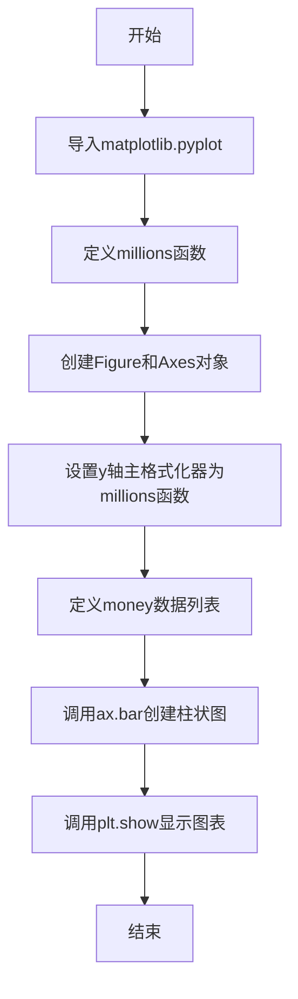
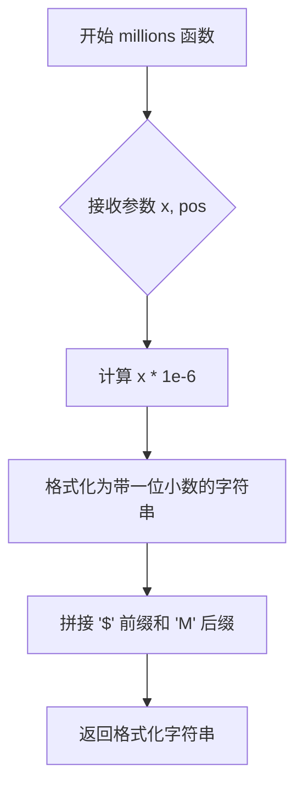

# `matplotlib\galleries\examples\ticks\custom_ticker1.py` 详细设计文档

该代码演示了如何使用matplotlib自定义y轴刻度格式化器，将数值显示为百万美元格式，并创建一个展示不同人员收入的柱状图。

## 整体流程



## 类结构

```
该代码为脚本形式，无面向对象类层次结构
直接使用matplotlib.pyplot模块的过程式编程
```

## 全局变量及字段


### `fig`
    
图表容器，表示整个图形窗口

类型：`matplotlib.figure.Figure`
    


### `ax`
    
坐标轴对象，包含图形元素

类型：`matplotlib.axes.Axes`
    


### `money`
    
包含4个浮点数的列表，表示不同人员的收入金额

类型：`list`
    


    

## 全局函数及方法


### `millions`

该函数是matplotlib的自定义刻度格式化函数，接收数值x和位置pos作为参数，将数值乘以1e6并格式化为百万美元字符串（如`$1.5M`），常用于金融图表的y轴刻度显示。

参数：

-  `x`：`float`，待格式化的数值，表示图表上的实际数据值
-  `pos`：`int`，刻度位置索引，matplotlib传入的刻度位置参数（此例中未使用）

返回值：`str`，格式化后的美元字符串，格式为`$X.XM`（百万美元）

#### 流程图



#### 带注释源码

```python
def millions(x, pos):
    """The two arguments are the value and tick position."""
    # 参数 x: float - 输入的数值（如 1500000.0）
    # 参数 pos: int - 刻度位置索引（matplotlib 自动传入，当前函数未使用）
    # 返回值: str - 格式化后的美元字符串，如 '$1.5M'
    
    return f'${x*1e-6:1.1f}M'
    # x*1e-6: 将数值转换为百万单位（1e6 = 1,000,000）
    # :1.1f: 格式说明符，1位整数部分 + 1位小数部分
    # $: 美元符号前缀
    # M: 百万单位后缀
```

#### 关键组件信息

| 组件名称 | 描述 |
|---------|------|
| `matplotlib.pyplot` | matplotlib基础绘图库，用于创建图表和显示 |
| `matplotlib.ticker` | 刻度格式化模块，提供FuncFormatter支持自定义函数 |
| `Axis.set_major_formatter()` | 设置主刻度格式化器的matplotlib方法 |
| `FuncFormatter` | 函数格式化器类，将可调用对象转换为刻度格式化器 |

#### 潜在的技术债务或优化空间

1. **硬编码的格式字符串**：当前格式`$1.1fM`是硬编码的，无法灵活调整小数位数或货币单位
2. **缺少参数验证**：未对输入参数x的类型和范围进行校验，可能导致异常
3. **未使用的pos参数**：虽然matplotlib要求签名包含pos参数，但函数内未使用，可添加类型注解或注释说明
4. **国际化支持缺失**：仅支持美元格式，未考虑其他货币或本地化格式

#### 其它项目

**设计目标与约束：**
- 目标：将大数值（如1500000）转换为易读形式（$1.5M）
- 约束：必须符合matplotlib FuncFormatter的签名要求（两个参数）

**错误处理与异常设计：**
- 当前无显式错误处理
- 若x为负数，会输出负的百万美元表示（如$-1.5M）
- 若x为非数值类型，会抛出TypeError

**数据流与状态机：**
- 数据流：原始数据值 → millions函数 → 格式化字符串 → 图表刻度标签
- 无状态机逻辑，纯函数式转换

**外部依赖与接口契约：**
- 依赖：matplotlib库
- 接口契约：符合`Callable[[float, int], str]`签名，供`set_major_formatter()`调用

## 关键组件


### 自定义格式化函数 millions(x, pos)

将数值转换为百万美元格式字符串的函数，接收数值和刻度位置作为参数，返回格式化的货币字符串。

### matplotlib.pyplot 图表库

Python的可视化库，提供创建图形、坐标轴和显示图表的功能。

### 坐标轴对象 ax

matplotlib的坐标轴对象，用于控制图表的刻度、标签等，通过yaxis属性设置y轴的刻度格式化器。

### 刻度格式化器 set_major_formatter

Axis类的方法，用于设置主刻度的格式化规则，这里将自定义函数注册为y轴的格式化器。

### 柱状图数据 money

包含四个数值的列表：[1.5e5, 2.5e6, 5.5e6, 2.0e7]，代表不同人物的金额数据。

### 柱状图可视化 bar

matplotlib的柱状图函数，接受类别标签和数值数据，生成柱状条形图展示数据。


## 问题及建议


### 已知问题

- **缺少输入验证**：未对 `money` 列表的数据类型和数值有效性进行验证，可能导致运行时错误或异常显示
- **特殊值处理缺失**：`millions` 函数未处理 NaN、Inf 等特殊浮点值，可能产生不合理的输出
- **负数处理不当**：未考虑负数场景，负数会显示为 "$-0.0M" 格式，不符合财务数据的展示习惯
- **缺少类型注解**：函数参数和返回值缺少类型提示（type hints），降低代码可读性和 IDE 支持
- **魔法数字硬编码**：`1e-6` 作为硬编码常量，缺乏可配置性，难以适配不同单位（千、亿等）

### 优化建议

- 添加数据验证逻辑，确保 `money` 列表中的值均为有效正数
- 使用 `math.isnan()`、`math.isinf()` 处理特殊数值，或使用 `numpy.isfinite()` 进行批量检查
- 为负数添加条件判断，可选择显示括号格式或绝对值显示
- 为 `millions` 函数添加类型注解：`def millions(x: float, pos: Any) -> str`
- 将格式化单位提取为配置参数，支持千、百万、亿等不同单位
- 考虑国际化需求，使用 `locale` 模块或 `babel` 库处理不同地区的数字格式
- 显式使用 `matplotlib.ticker.FuncFormatter` 替代隐式转换，提高代码可读性


## 其它


### 设计目标与约束

本示例的设计目标是展示如何通过自定义格式化函数来实现自定义ticker，以满足特定的数据展示需求。核心约束包括：1）格式化函数必须符合matplotlib的FuncFormatter签名要求（接收数值和位置两个参数）；2）格式化函数必须返回字符串；3）数值范围应适合使用百万单位展示。

### 错误处理与异常设计

本示例采用简化的错误处理机制，主要依赖matplotlib内部的异常传播。当格式化函数返回非字符串值或引发异常时，matplotlib会捕获并显示默认格式化结果。潜在异常包括：TypeError（当格式化函数签名不正确时）、ValueError（当格式化逻辑产生无效值时）、以及matplotlib内部的各种验证错误。

### 数据流与状态机

数据流从原始数值数据（如money列表）开始，经过matplotlib的BarContainer处理转换为可视化元素。格式化函数millions在渲染阶段被调用，将数值坐标转换为显示标签。状态机涉及：初始化状态（创建图表和坐标轴）→ 配置状态（设置格式化器）→ 数据绑定状态（设置数据）→ 渲染状态（调用格式化函数转换标签）→ 显示状态。

### 外部依赖与接口契约

主要外部依赖为matplotlib库，版本需支持FuncFormatter功能。接口契约包括：格式化函数签名必须为`def function(x, pos)`，其中x为浮点数值、pos为刻度位置索引；返回值为字符串类型；matplotlib.axis.Axis.set_major_formatter方法接受callable对象作为参数。

### 性能考虑

本示例的性能影响主要体现在渲染阶段，每次绘制刻度标签时都会调用格式化函数。由于数据量较小（约4个数据点），性能影响可忽略不计。对于大规模数据或高频刷新场景，建议预先计算格式化结果或使用向量化操作。

### 安全性考虑

本示例不涉及用户输入处理，安全性风险较低。格式化函数仅处理数值转换，不存在注入攻击风险。唯一需要注意的是确保格式化函数不会抛出未捕获的异常，以免中断渲染流程。

### 使用示例和扩展点

扩展点包括：1）修改格式化函数实现不同单位转换（如千、百万、十亿）；2）添加条件逻辑实现动态格式化；3）继承Formatter类创建可配置的格式化器。高级用法可结合FixedFormatter实现分类标签的自定义显示，结合.NullLocator实现无刻度线的纯标签显示。

### 版本兼容性和依赖说明

代码兼容matplotlib 1.5及以上版本，推荐使用matplotlib 3.x版本以获得最佳功能和性能。依赖关系：matplotlib.pyplot（图表创建）、matplotlib.ticker（格式化器，在内部使用）、matplotlib.axis（坐标轴配置）。


    