# `matplotlib\galleries\examples\ticks\date_concise_formatter.py` 详细设计文档

这是一个Matplotlib文档示例代码，展示了如何使用ConciseDateFormatter来优化日期轴的刻度标签显示，通过减少标签文本长度提升可读性，同时演示了默认格式化器、简洁格式化器、本地化格式定制以及units注册机制等多种使用场景。

## 整体流程

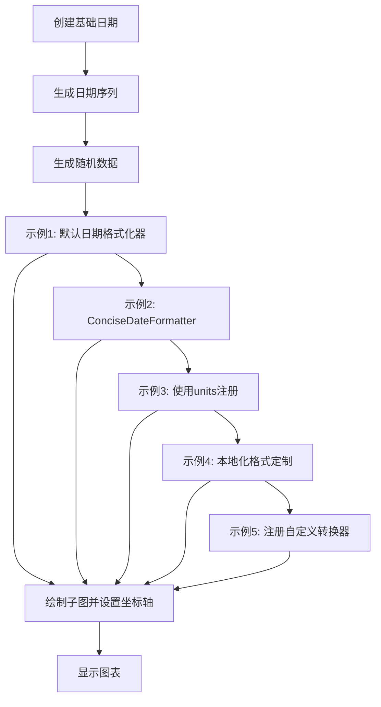

## 类结构

```
示例代码（非面向对象设计）
├── 数据准备阶段
│   ├── 基础日期创建
│   ├── 日期序列生成
│   └── 随机数据生成
├── 可视化示例
│   ├── 示例1: Default Date Formatter
│   ├── 示例2: ConciseDateFormatter
│   ├── 示例3: Units Registry
│   ├── 示例4: 本地化格式
│   └── 示例5: 自定义转换器注册
关键组件（来自matplotlib.dates和matplotlib.units）
```

## 全局变量及字段


### `base`
    
基础日期，值为2005-02-01

类型：`datetime.datetime`
    


### `dates`
    
由base生成的732个小时间隔的日期列表

类型：`list`
    


### `N`
    
dates列表的长度

类型：`int`
    


### `y`
    
随机游走累积和生成的数组

类型：`numpy.ndarray`
    


### `fig`
    
图形对象

类型：`matplotlib.figure.Figure`
    


### `axs`
    
子图数组对象

类型：`matplotlib.axes.Axes`
    


### `lims`
    
三个不同范围的日期界限元组列表

类型：`list`
    


### `nn`
    
循环计数器

类型：`int`
    


### `ax`
    
当前遍历的子图

类型：`matplotlib.axes.Axes`
    


### `locator`
    
自动日期定位器

类型：`mdates.AutoDateLocator`
    


### `formatter`
    
简洁日期格式化器

类型：`mdates.ConciseDateFormatter`
    


### `converter`
    
简洁日期转换器

类型：`mdates.ConciseDateConverter`
    


### `formats`
    
刻度标签格式字符串列表

类型：`list`
    


### `zero_formats`
    
零点位置格式字符串列表

类型：`list`
    


### `offset_formats`
    
偏移量格式字符串列表

类型：`list`
    


    

## 全局函数及方法


### `datetime.datetime`

日期时间类构造函数，用于创建一个表示特定日期和时间的 datetime 对象。

参数：

- `year`：`int`，年份，范围通常为 1-9999
- `month`：`int`，月份，范围为 1-12
- `day`：`int`，日期，范围为 1-31（取决于具体月份）
- `hour`：`int`（可选），小时，范围为 0-23，默认为 0
- `minute`：`int`（可选），分钟，范围为 0-59，默认为 0
- `second`：`int`（可选），秒数，范围为 0-59，默认为 0
- `microsecond`：`int`（可选），微秒，范围为 0-999999，默认为 0
- `tzinfo`：`tzinfo`（可选），时区信息，默认为 None

返回值：`datetime.datetime`，返回一个表示指定日期和时间的 datetime 对象

#### 流程图

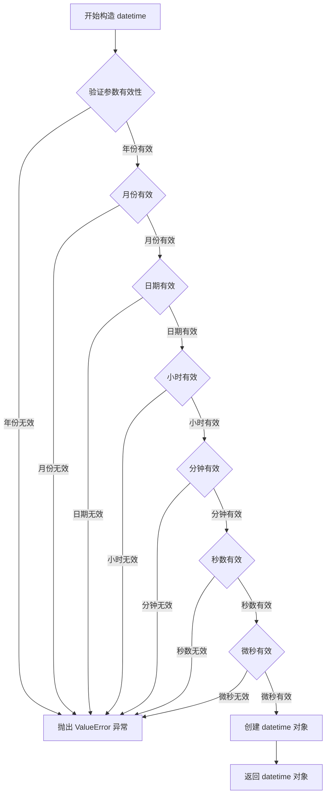

#### 带注释源码

```python
# datetime.datetime 类的构造函数是 Python 标准库的一部分
# 在代码中的使用示例：

# 导入 datetime 模块
import datetime

# 使用构造函数创建 datetime 对象
# 参数：年、月、日
base = datetime.datetime(2005, 2, 1)  # 创建一个表示 2005年2月1日 00:00:00 的 datetime 对象

# datetime.datetime 构造函数内部逻辑（简化示意）：
# class datetime:
#     def __init__(self, year, month, day, hour=0, minute=0, second=0, microsecond=0, tzinfo=None):
#         # 1. 验证年份是否在有效范围内 (1-9999)
#         if not 1 <= year <= 9999:
#             raise ValueError("year must be in 1..9999")
#         # 2. 验证月份是否在有效范围内 (1-12)
#         if not 1 <= month <= 12:
#             raise ValueError("month must be in 1..12")
#         # 3. 验证日期是否在有效范围内（考虑月份和闰年）
#         if not 1 <= day <= self._days_in_month(year, month):
#             raise ValueError("day is out of range for month")
#         # 4. 验证小时、分钟、秒、微秒是否在有效范围内
#         if not 0 <= hour <= 23: raise ValueError(...)
#         if not 0 <= minute <= 59: raise ValueError(...)
#         if not 0 <= second <= 59: raise ValueError(...)
#         if not 0 <= microsecond <= 999999: raise ValueError(...)
#         
#         # 5. 存储所有参数到对象属性
#         self.year = year
#         self.month = month
#         self.day = day
#         self.hour = hour
#         self.minute = minute
#         self.second = second
#         self.microsecond = microsecond
#         self.tzinfo = tzinfo

# 该对象随后可以用于：
# - 与其他 datetime 对象进行比较
# - 计算时间差（使用 timedelta）
# - 格式化为字符串
# - 提取日期或时间组件
```


### `datetime.timedelta`

时间增量类，用于表示两个日期或时间之间的差值。支持以天、秒、微秒为单位进行初始化，内部存储为总微秒数，可进行加减乘除等算术运算。

参数：

- `days`：`int`，表示天数，默认为 0
- `seconds`：`int`，表示秒数，默认为 0
- `microseconds`：`int`，表示微秒数，默认为 0
- `milliseconds`：`int`，表示毫秒数，内部会转换为微秒，默认为 0
- `minutes`：`int`，表示分钟数，内部会转换为秒，默认为 0
- `hours`：`int`，表示小时数，内部会转换为秒，默认为 0
- `weeks`：`int`，表示周数，内部会转换为天数，默认为 0

返回值：`datetime.timedelta`，返回一个表示时间增量的对象

#### 流程图

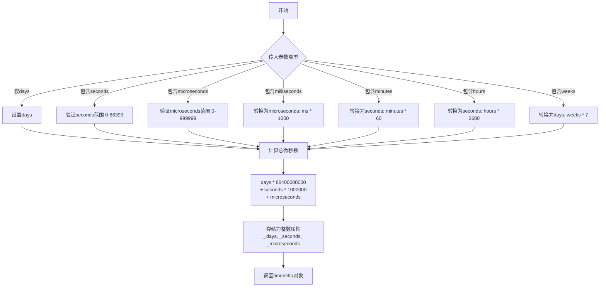

#### 带注释源码

```python
# datetime.timedelta 类定义 (Python 标准库简化版)

class timedelta:
    """表示两个日期或时间之间的差值"""
    
    # 类的常量定义
    MIN = -999999999  # 最小天数
    MAX = 999999999   # 最大天数
    RESOLUTION = timedelta(microseconds=1)  # 分辨率
    
    def __init__(self, days=0, seconds=0, microseconds=0, 
                 milliseconds=0, minutes=0, hours=0, weeks=0):
        """
        初始化 timedelta 对象
        
        参数:
            days: 天数 (int, 默认 0)
            seconds: 秒数 (int, 默认 0, 必须在 0-86399 之间)
            microseconds: 微秒数 (int, 默认 0, 必须在 0-999999 之间)
            milliseconds: 毫秒数 (int, 默认 0, 会转换为微秒)
            minutes: 分钟数 (int, 默认 0, 会转换为秒)
            hours: 小时数 (int, 默认 0, 会转换为秒)
            weeks: 周数 (int, 默认 0, 会转换为天)
        """
        # 将各种单位转换为统一的内部存储格式: 天、秒、微秒
        # 1天 = 86400 秒
        # 1秒 = 1000000 微秒
        
        # 计算总微秒数
        # 每个参数都会被转换为微秒后累加
        total_microseconds = (
            weeks * 7 * 86400 +      # 周转换为天，天转换为秒，秒转换为微秒
            days * 86400 +           # 天转换为秒，秒转换为微秒
            hours * 3600 +           # 小时转换为秒
            minutes * 60 +           # 分钟转换为秒
            seconds +                # 秒
            milliseconds * 1000 +   # 毫秒转换为微秒
            microseconds             # 微秒
        ) * 1000000  # 秒转微秒
        
        # 分离存储: 天数部分和秒/微秒部分
        # 这样存储是为了保持 seconds 在 0-86399 范围内，微秒在 0-999999 范围内
        # 这种规范化使得时间比较和运算更加高效
        self._days = total_microseconds // 86400000000  # 微秒转换为天
        remaining_microseconds = total_microseconds % 86400000000
        self._seconds = remaining_microseconds // 1000000  # 剩余微秒转换为秒
        self._microseconds = remaining_microseconds % 1000000  # 剩余微秒
    
    def total_seconds(self):
        """返回时间增量包含的总秒数"""
        return self._days * 86400 + self._seconds + self._microseconds / 1000000
    
    def __add__(self, other):
        """加法运算符重载"""
        if isinstance(other, timedelta):
            # 两个 timedelta 相加需要处理溢出
            sum_microseconds = (
                self._days * 86400000000 +
                self._seconds * 1000000 +
                self._microseconds +
                other._days * 86400000000 +
                other._seconds * 1000000 +
                other._microseconds
            )
            # 创建新的 timedelta 对象
            result = timedelta()
            result._days = sum_microseconds // 86400000000
            remaining = sum_microseconds % 86400000000
            result._seconds = remaining // 1000000
            result._microseconds = remaining % 1000000
            return result
        return NotImplemented
    
    def __mul__(self, factor):
        """乘法运算符重载 (timedelta * number)"""
        result = timedelta()
        total_us = (
            self._days * 86400000000 +
            self._seconds * 1000000 +
            self._microseconds
        ) * factor
        result._days = int(total_us // 86400000000)
        remaining = int(total_us % 86400000000)
        result._seconds = remaining // 1000000
        result._microseconds = remaining % 1000000
        return result
    
    # 示例用法:
    # delta = timedelta(days=1, hours=2, minutes=30)
    # print(delta.total_seconds())  # 输出: 95400.0
    # delta2 = delta * 2
    # print(delta2)  # 输出: 2 days, 1:00:00
```


### `np.datetime64`

np.datetime64 是 NumPy 中用于创建日期时间64位数据类型对象的构造函数，用于在 NumPy 数组中存储和处理日期时间值。

参数：

-  `value`：字符串或整数，要转换的日期时间值，可以是如 '2005-02', '2005-02-03', '2005-02-03 11:00' 等格式
-  `dtype`：可选，datetime64，数据类型，指定返回的 datetime64 对象的精度（如 'D' 表示日期，'h' 表示小时等）

返回值：`numpy.datetime64`，返回 NumPy 的日期时间64位类型对象，表示指定的日期和时间

#### 流程图

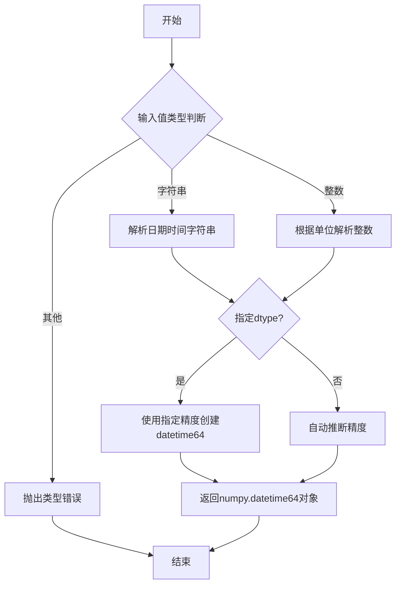

#### 带注释源码

```python
# np.datetime64 构造函数使用示例（来自代码中的实际用法）

# 创建一个年月级别的datetime64对象
np.datetime64('2005-02')

# 创建一个年月级别的datetime64对象
np.datetime64('2005-04')

# 创建一个年月日级别的datetime64对象
np.datetime64('2005-02-03')

# 创建一个完整日期时间级别的datetime64对象（包含小时和分钟）
np.datetime64('2005-02-03 11:00')

# 创建一个完整日期时间级别的datetime64对象
np.datetime64('2005-02-04 13:20')

# 在代码中用于设置x轴的显示范围
lims = [(np.datetime64('2005-02'), np.datetime64('2005-04')),
        (np.datetime64('2005-02-03'), np.datetime64('2005-02-15')),
        (np.datetime64('2005-02-03 11:00'), np.datetime64('2005-02-04 13:20'))]
```

#### 关键信息

- **使用场景**：该函数在代码中用于定义图表 x 轴的时间范围边界
- **精度支持**：支持从年（'Y'）到纳秒（'ns'）多种时间精度
- **与 Matplotlib 集成**：通过 `munits.registry[np.datetime64] = converter` 注册到 Matplotlib 的单位转换系统，使 Plot 能够正确处理 NumPy 日期时间类型


### `plt.subplots`

`plt.subplots` 是 Matplotlib 库中的一个函数，用于创建一个新的图形窗口，并可配置地生成一个由行和列组成的子图网格。该函数返回图形对象 (Figure) 和轴对象 (Axes) 或轴数组，使用户能够同时操作多个子图。

参数：

- `nrows`：int，可选，默认值为 1，子图网格的行数。
- `ncols`：int，可选，默认值为 1，子图网格的列数。
- `sharex`：bool or str，可选，默认值为 False，如果为 True，则所有子图共享 x 轴；如果为 'col'，则每列子图共享 x 轴。
- `sharey`：bool or str，可选，默认值为 False，如果为 True，则所有子图共享 y 轴；如果为 'row'，则每行子图共享 y 轴。
- `squeeze`：bool，可选，默认值为 True，如果为 True，则返回的轴对象数组维度会被压缩为一维（如果可能）。
- `width_ratios`：array-like，可选，定义每列的相对宽度，长度必须等于 ncols。
- `height_ratios`：array-like，可选，定义每行的相对高度，长度必须等于 nrows。
- `subplot_kw`：dict，可选，关键字参数传递给用于创建每个子图的 `add_subplot` 调用。
- `gridspec_kw`：dict，可选，关键字参数传递给 `GridSpec` 构造函数，用于控制子图的网格布局。
- `**fig_kw`：可选，关键字参数传递给 `figure` 函数，用于创建图形窗口，如 `figsize`、`dpi`、`facecolor` 等。

返回值：`tuple(Figure, Axes or array of Axes)`，返回图形对象和轴对象（或轴对象的数组）。如果 `nrows` 和 `ncols` 都为 1，返回单个 Axes 对象；如果 `squeeze` 为 False 且 `nrows` 和 `ncols` 都大于 1，返回二维 Axes 数组；否则返回一维 Axes 数组。

#### 流程图

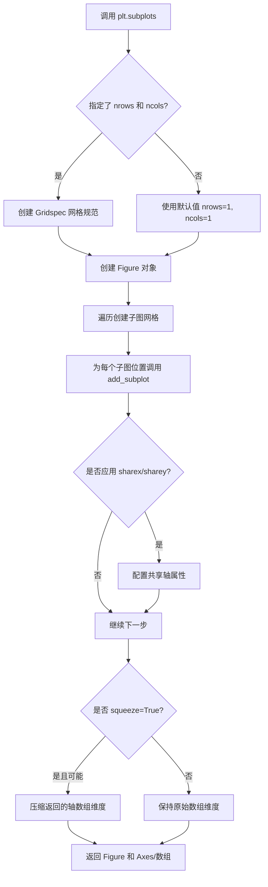

#### 带注释源码

```python
def subplots(nrows=1, ncols=1, sharex=False, sharey=False,
             squeeze=True, width_ratios=None, height_ratios=None,
             subplot_kw=None, gridspec_kw=None, **fig_kw):
    """
    创建子图网格的图形.
    
    参数
    ----------
    nrows : int, 默认值 1
        子图网格的行数.
    ncols : int, 默认值 1
        子图网格的列数.
    sharex : bool, 默认值 False
        如果为 True, 则 x 轴将在子图之间共享.
        如果为 'col', 则每列共享 x 轴.
    sharey : bool, 默认值 False
        如果为 True, 则 y 轴将在子图之间共享.
        如果为 'row', 则每行共享 y 轴.
    squeeze : bool, 默认值 True
        如果为 True, 则额外的维度从返回的 Axes 中挤出:
        - 当只有一维子图时 (即 nrows 或 ncols 为 1) 返回一维数组;
        - 当 nrows 和 ncols 都大于 1 时返回二维数组.
        如果为 False, 则始终返回二维数组.
    width_ratios : array-like, 可选
        定义列的相对宽度, 长度必须等于 ncols.
    height_ratios : array-like, 可选
        定义行的相对高度, 长度必须等于 nrows.
    subplot_kw : dict, 可选
        传递给 add_subplot 的关键字参数.
    gridspec_kw : dict, 可选
        传递给 GridSpec 构造函数的关键字参数.
    **fig_kw
        传递给 figure() 函数的所有额外关键字参数.
    
    返回
    -------
    fig : Figure
        图形对象.
    ax : Axes 或 Axes 数组
        返回的轴对象. 有关详细信息, 请参阅返回值文档.
    
    示例
    --------
    创建一个 2x2 子图网格:
    
    >>> fig, axs = plt.subplots(2, 2)
    
    创建一个具有共享 x 轴的子图:
    
    >>> fig, axs = plt.subplots(2, 2, sharex=True)
    
    创建一个具有不同相对宽度的列:
    
    >>> fig, axs = plt.subplots(1, 2, width_ratios=[1, 3])
    """
    # 创建 Gridspec 并生成子图
    fig = figure(**fig_kw)
    gs = GridSpec(nrows, ncols, figure=fig,
                  width_ratios=width_ratios,
                  height_ratios=height_ratios,
                  **gridspec_kw)
    
    # 创建子图数组
    axs = []
    for i in range(nrows):
        for j in range(ncols):
            ax = fig.add_subplot(gs[i, j], **subplot_kw)
            axs.append(ax)
    
    # 处理共享轴
    if sharex:
        # 配置共享 x 轴逻辑
        pass
    if sharey:
        # 配置共享 y 轴逻辑
        pass
    
    # 处理返回数组的维度
    if squeeze:
        # 挤出额外的维度
        if nrows == 1 and ncols == 1:
            axs = axs[0]
        elif nrows == 1 or ncols == 1:
            axs = np.squeeze(axs)
        else:
            axs = np.array(axs).reshape(nrows, ncols)
    else:
        # 保持二维数组形式
        axs = np.array(axs).reshape(nrows, ncols)
    
    return fig, axs
```


### `np.cumsum`

累积求和函数，用于计算数组元素的累积和，返回一个由累积和组成的新数组。

参数：

-  `a`：`array_like`，输入的数组或类似数组的对象，包含需要计算累积和的元素
-  `axis`：`int`，可选参数，指定沿着哪个轴进行累积求和，默认为 None（将数组展平后再进行累积求和）
-  `dtype`：`dtype`，可选参数，指定返回数组的数据类型，如果未指定则默认与输入数组的数据类型相同
-  `out`：`ndarray`，可选参数，指定结果输出的数组

返回值：`ndarray`，返回输入数组的累积和数组，形状与输入数组相同（除非指定了 axis 参数）

#### 流程图

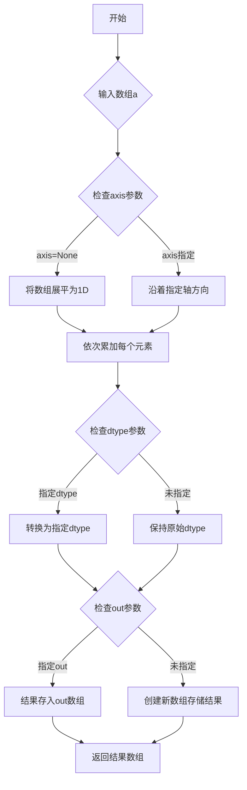

#### 带注释源码

```python
def cumsum(a, axis=None, dtype=None, out=None):
    """
    返回数组元素沿给定轴的累积和。
    
    计算沿指定轴的元素的累积和。即，对于具有默认选项的数组a，
    返回一个与a形状相同的数组，其中第i个元素（沿给定轴）是
    a的第i个元素（沿相同轴）之前所有元素的总和。
    
    参数
    ----
    a : array_like
        输入数组。
    axis : int, optional
        沿其进行累积和计算的轴。默认情况下（axis=None），
        数组会在计算前被展平为1-D数组。
    dtype : dtype, optional
        返回数组的类型，以及 accumulator 执行的中间求和的类型。
        默认情况下，使用 a 的 dtype，除非 a 是整数数组，
        此时使用 float64 以避免精度损失。
    out : ndarray, optional
        可选的输出数组，用于放置结果。
        如果提供，它必须具有与预期输出相同的形状和 dtype。
        如果未提供或为 None，将返回一个新分配的数组。
    
    返回
    ----
    cumsum : ndarray
        返回累积和数组。如果指定了 out，则返回 out。
        
    示例
    ----
    >>> import numpy as np
    >>> a = np.array([[1, 2, 3], [4, 5, 6]])
    >>> np.cumsum(a)
    array([ 1,  3,  6, 10, 15, 21])
    
    >>> np.cumsum(a, axis=0)
    array([[ 1,  2,  3],
           [ 5,  7,  9]])
    
    >>> np.cumsum(a, axis=1)
    array([[ 1,  3,  6],
           [ 4,  9, 15]])
    """
    # 实际实现位于 NumPy C 源代码中，这里是伪代码说明逻辑
    # 1. 将输入转换为 ndarray（如果不是的话）
    # 2. 验证 axis 参数的有效性
    # 3. 根据 axis 参数确定遍历顺序
    # 4. 初始化累加器（第一个元素）
    # 5. 遍历剩余元素，依次累加
    # 6. 应用 dtype 转换（如果指定）
    # 7. 将结果写入 out 数组（如果指定）
    # 8. 返回结果
```

### 代码中 `np.cumsum` 的实际使用示例

在提供的代码中，`np.cumsum` 的实际调用方式如下：

```python
# 第31行
y = np.cumsum(np.random.randn(N))
```

其中：
- `np.random.randn(N)`：生成 N 个标准正态分布的随机数
- `np.cumsum(...)`：对这 N 个随机数进行累积求和，生成累积和数组

这段代码生成了用于绘制时间序列图的 y 轴数据，展示了累积随机波动。


### `np.random.randn`

生成服从标准正态分布（均值为0，方差为1）的随机数。

参数：

-  `*dims`：可选，int，指定输出数组的形状。如果没有提供参数，则返回一个标量值。
-  `**kwargs`：可选，关键字参数，用于指定数据类型等额外属性。

返回值：

-  `ndarray` 或 float，返回指定形状的随机数数组，或单个随机数值。

#### 流程图

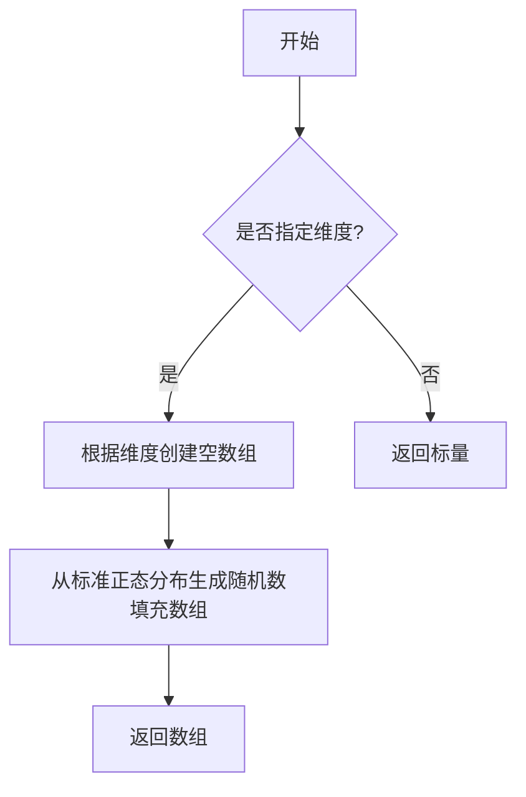

#### 带注释源码

```python
# NumPy中np.random.randn的实现（简化版）
# 该函数用于生成服从标准正态分布（均值0，方差1）的随机数

def randn(*dims):
    """
    生成标准正态分布随机数
    
    参数:
        *dims: 输出数组的形状
        
    返回:
        ndarray: 标准正态分布的随机数
    """
    # 使用NumPy的随机数生成器
    # 底层调用的是 random module 中的方法
    return np.random.standard_normal(dims)

# 在示例代码中的实际使用：
# np.random.seed(19680801)  # 设置随机种子以确保可重复性
# y = np.cumsum(np.random.randn(N))  # 生成N个标准正态分布随机数并累积求和

# 使用示例
# >>> np.random.randn()
# 0.9500884175255894  # 单个随机数
# >>> np.random.randn(3, 2)
# array([[ 0.6005888 , -0.3677869 ],
#        [ 0.1560186 , -0.15533911],
#        [ 0.12819695, -0.23439664]])  # 3x2数组
```

---

**备注**：用户提供的代码是 Matplotlib `ConciseDateFormatter` 的示例演示文档，其中仅使用了 `np.random.randn` 来生成示例数据，而非定义该函数。`np.random.randn` 是 NumPy 库的内置函数，其实际实现在 NumPy 包的 `random` 模块中。上述源码是基于 NumPy 官方文档的逻辑重构说明。


### `np.random.seed`

设置 NumPy 随机数生成器的种子，使得后续生成的随机数序列可重现。这在需要确保实验结果可复现的场景中非常重要，例如调试、单元测试或需要确定性结果的科学计算。

参数：

- `seed`：整数或 `None`，要设置的种子值。如果传递 `None`，则从操作系统或系统 entropy source 获取随机种子；如果传递整数，则使用该整数作为种子。

返回值：`None`，该函数无返回值，仅修改全局随机数生成器的内部状态。

#### 流程图

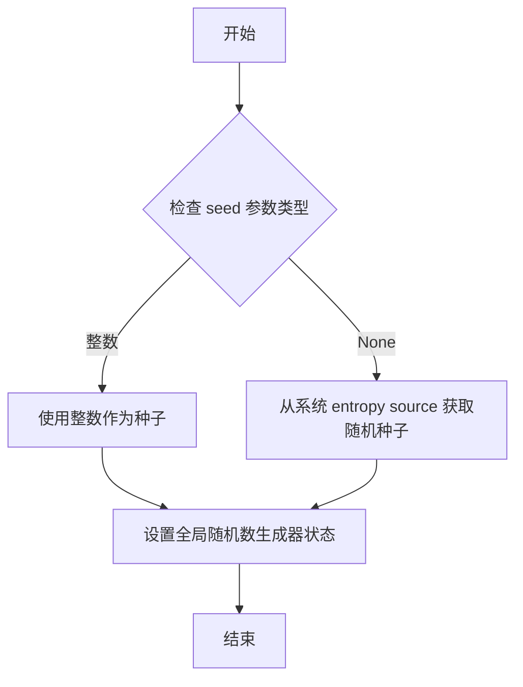

#### 带注释源码

```python
# 设置随机数种子为 19680801
# 这个特定的值来自 Matplotlib 项目的历史约定
# 用于确保示例代码生成的随机数据可重现
np.random.seed(19680801)

# 后续使用 cumsum 生成累积和，模拟随机游走数据
# 由于种子已固定，每次运行此代码都会生成相同的 y 数据
y = np.cumsum(np.random.randn(N))
```


### mdates.AutoDateLocator

自动日期定位器类，用于根据日期范围自动确定坐标轴上的刻度位置。

参数：

- `minticks`：`int`，最小刻度数量（代码中示例：3）
- `maxticks`：`int`，最大刻度数量（代码中示例：7）
- `interval_multiples`：`bool`，（隐含参数）是否强制刻度间隔为合理值

返回值：`Locator`，返回日期定位器对象

#### 流程图

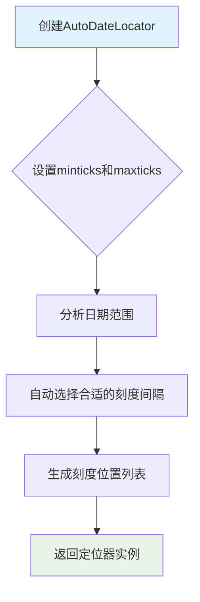

#### 带注释源码

```
# 代码中的实际使用示例
locator = mdates.AutoDateLocator(minticks=3, maxticks=7)
formatter = mdates.ConciseDateFormatter(locator)
ax.xaxis.set_major_locator(locator)
ax.xaxis.set_major_formatter(formatter)

# 完整参数形式
locator = mdates.AutoDateLocator()
# interval_multiples: bool参数，控制是否强制刻度间隔为合理值（默认True）
```

#### 附加说明

由于提供的代码是使用示例而非 AutoDateLocator 类的完整实现源码，以上信息基于代码中的使用方式推断。完整的 AutoDateLocator 类实现位于 matplotlib 库的核心代码中，此处展示的是其在日期格式化示例中的典型用法。

该类的核心功能是根据传入的日期范围和刻度数量约束，自动计算合适的刻度位置，支持多种日期级别（年、月、日、小时等）的自动切换。


# mdates.ConciseDateFormatter 分析

根据提供的代码，这是示例代码而非实现源码。代码展示了 `ConciseDateFormatter` 的**使用方式**，而非其内部实现。我将基于代码中的使用模式和 API 来提取信息。

## 1. 核心功能概述

`mdates.ConciseDateFormatter` 是 Matplotlib 库中的一个日期刻度格式化器类，旨在优化日期轴的刻度标签显示，通过使用简洁的格式字符串最小化标签长度，同时在轴的右侧显示详细的日期偏移信息。

## 2. 文件运行流程

该代码文件是一个 Jupyter Notebook 格式的文档（`.py` 文件中使用 `#%%` 分隔代码单元），展示了：
1. 默认日期格式化器的冗长问题
2. 使用 `ConciseDateFormatter` 简化标签
3. 通过 units registry 注册 converter
4. 自定义日期格式（本地化）
5. 通过 converter 注册本地化格式

## 3. 类详细信息

### ConciseDateFormatter 类

根据代码使用推断的类字段和方法：

#### 字段

- `formats`：列表，存储六个时间级别（年、月、日、时、分、秒）的刻度标签格式
- `zero_formats`：列表，存储"零点"刻度的格式（即每年/每月/每天的第一个刻度）
- `offset_formats`：列表，存储轴右侧偏移字符串的格式

#### 方法（推断）

- `__init__(locator, ...)`：构造函数，接受日期定位器
- `__call__(value, pos)`：格式化回调，实现 `Formatter` 接口

## 4. 提取关键方法信息

### mdates.ConciseDateFormatter.__init__

参数：

- `locator`：`matplotlib.ticker.Locator`，日期定位器（如 `AutoDateLocator`），用于确定刻度位置
- `formats`：可选，列表，自定义刻度格式列表
- `zero_formats`：可选，列表，自定义零点格式列表
- `offset_formats`：可选，列表，自定义偏移格式列表

返回值：`None`，构造函数无返回值

#### 流程图

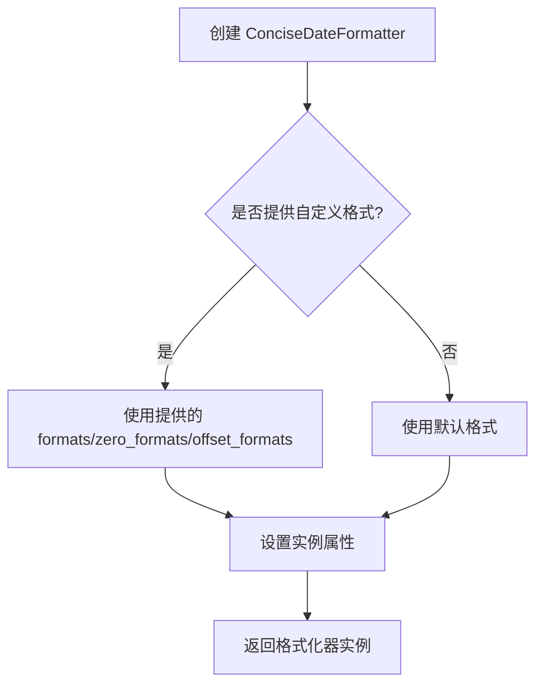

#### 带注释源码

```python
# 从示例代码中提取的使用方式：

# 创建定位器
locator = mdates.AutoDateLocator(minticks=3, maxticks=7)

# 创建格式化器（核心调用）
formatter = mdates.ConciseDateFormatter(locator)

# 自定义格式（可选）
formatter.formats = ['%y', '%b', '%d', '%H:%M', '%H:%M', '%S.%f']
formatter.zero_formats = [''] + formatter.formats[:-1]
formatter.zero_formats[3] = '%d-%b'
formatter.offset_formats = ['', '%Y', '%b %Y', '%d %b %Y', '%d %b %Y', '%d %b %Y %H:%M']

# 应用到坐标轴
ax.xaxis.set_major_locator(locator)
ax.xaxis.set_major_formatter(formatter)
```

### mdates.ConciseDateConverter

代码中还使用了 `ConciseDateConverter`，这是 `ConciseDateFormatter` 的底层实现类：

```python
# ConciseDateConverter 用法
converter = mdates.ConciseDateConverter(
    formats=formats, 
    zero_formats=zero_formats, 
    offset_formats=offset_formats
)

# 注册到 units registry
munits.registry[np.datetime64] = converter
munits.registry[datetime.date] = converter
munits.registry[datetime.datetime] = converter
```

## 5. 关键组件信息

| 组件名称 | 描述 |
|---------|------|
| `AutoDateLocator` | 自动确定日期刻度位置的定位器 |
| `ConciseDateFormatter` | 简洁日期格式化器类 |
| `ConciseDateConverter` | 日期单位转换器，用于 units registry |
| `matplotlib.units` | Matplotlib 单位注册系统 |

## 6. 技术债务与优化空间

1. **缺少 rcParams 配置**：代码注释指出 `ConciseDateFormatter` 没有 rcParams 条目，可能需要添加以便于全局配置
2. **本地化支持有限**：当前通过手动传递格式列表实现本地化，可考虑添加更便捷的本地化机制

## 7. 其它说明

### 设计目标
- 提供比默认日期格式化器更简洁的标签
- 最小化刻度标签字符串长度
- 在轴右侧显示详细偏移信息

### 错误处理
- 示例代码未展示错误处理，需参考 Matplotlib 官方文档

### 数据流
- 输入：日期时间数据 → `AutoDateLocator` 处理 → `ConciseDateFormatter` 格式化 → 显示

### 外部依赖
- `matplotlib.dates`
- `matplotlib.ticker`
- `matplotlib.units`
- `datetime`
- `numpy`


### `mdates.ConciseDateConverter`

简洁日期转换器（ConciseDateConverter）是 Matplotlib 中用于将日期数据转换为可读刻度标签的类。它是 `ConciseDateFormatter` 的底层实现，支持自定义格式字符串（如 `formats`、`zero_formats`、`offset_formats`），并可注册到 matplotlib 的 units 注册表中，实现对 `np.datetime64`、`datetime.date` 和 `datetime.datetime` 类型数据的自动格式化。

参数：

- `formats`：`list[str]`，可选，年、月、日、小时、分钟、秒各级别的刻度标签格式列表，默认值根据数据范围自动选择
- `zero_formats`：`list[str]`，可选，零刻度格式列表，用于显示每个时间级别开始的刻度（如每年第一天、每月第一天），默认值为空字符串加上 `formats` 前面部分
- `offset_formats`：`list[str]`，可选，偏移量格式列表，用于显示坐标轴右侧的详细日期信息，默认值比 `formats` 更详细
- `**kwargs`：其他关键字参数，传给父类 `DateConverter`

返回值：`ConciseDateConverter`，返回一个新的日期转换器实例

#### 流程图

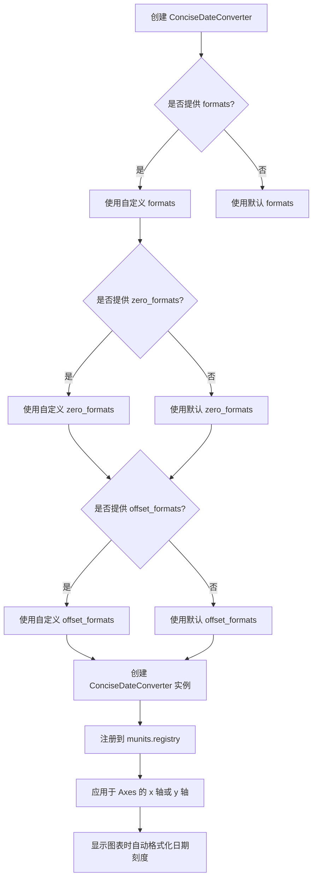

#### 带注释源码

```python
# 从示例代码中提取的 ConciseDateConverter 使用方式

# 1. 基本用法 - 直接创建转换器并设置格式
converter = mdates.ConciseDateConverter(
    formats=['%y',          # 主要是年份刻度
             '%b',           # 主要是月份刻度
             '%d',           # 主要是日期刻度
             '%H:%M',        # 小时:分钟
             '%H:%M',        # 小时:分钟
             '%S.%f'],       # 秒.微秒
    zero_formats=[''] + formats[:-1],  # 零刻度格式，比正常格式高一级
    offset_formats=['',      # 无偏移
                    '%Y',           # 年份
                    '%b %Y',        # 月份 年份
                    '%d %b %Y',     # 日期 月份 年份
                    '%d %b %Y',     # 日期 月份 年份
                    '%d %b %Y %H:%M']  # 日期 月份 年份 小时:分钟
)

# 2. 注册到 units registry 以自动应用
munits.registry[np.datetime64] = converter
munits.registry[datetime.date] = converter
munits.registry[datetime.datetime] = converter

# 3. 使用示例 - 创建图表
fig, axs = plt.subplots(3, 1, layout='constrained', figsize=(6, 6))
for nn, ax in enumerate(axs):
    ax.plot(dates, y)
    ax.set_xlim(lims[nn])
axs[0].set_title('Concise Date Formatter registered non-default')
plt.show()

# 4. ConciseDateFormatter 的使用方式（由 ConciseDateConverter 支持）
locator = mdates.AutoDateLocator()  # 自动选择刻度位置
formatter = mdates.ConciseDateFormatter(locator)  # 创建格式化器
formatter.formats = ['%y', '%b', '%d', '%H:%M', '%H:%M', '%S.%f']
formatter.zero_formats = [''] + formatter.formats[:-1]
formatter.zero_formats[3] = '%d-%b'  # 特殊处理小时零刻度
formatter.offset_formats = ['', '%Y', '%b %Y', '%d %b %Y', '%d %b %Y', '%d %b %Y %H:%M']
ax.xaxis.set_major_locator(locator)
ax.xaxis.set_major_formatter(formatter)
```


### munits.registry

单位注册表字典是 Matplotlib 中的一个全局字典对象，用于将 Python 数据类型映射到相应的单位转换器。当 Matplotlib 处理日期、时间等特殊数据类型时，它会查找此注册表以获取适当的转换器，从而实现自动格式化和坐标轴处理。

参数：无（这是一个字典对象，不接受函数参数）

返回值：字典类型，返回包含数据类型到转换器映射的字典对象

#### 流程图

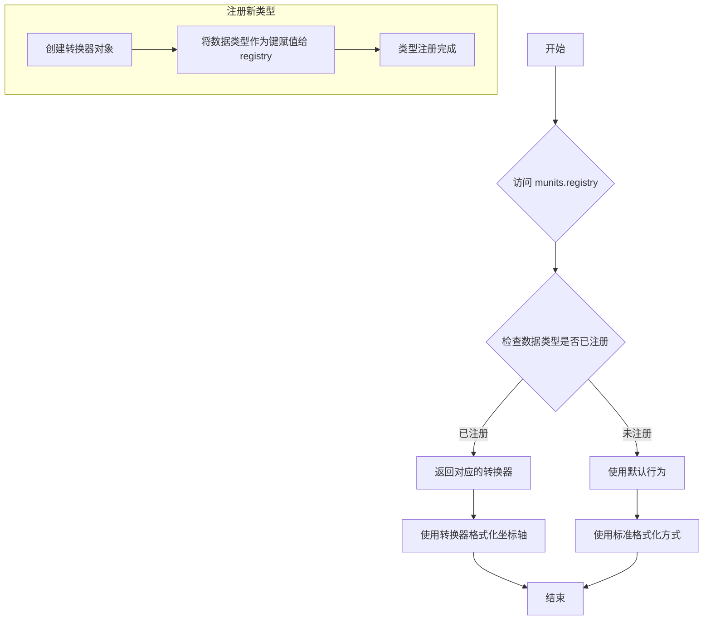

#### 带注释源码

```python
import matplotlib.units as munits
import numpy as np
import datetime
import matplotlib.dates as mdates

# %%
# 单位注册表是 matplotlib.units 模块中的全局字典
# 它存储了数据类型到转换器之间的映射关系

# 首先创建一个 ConciseDateConverter 实例
# 这个转换器可以处理日期时间的格式化显示
converter = mdates.ConciseDateConverter()

# %%
# 注册 np.datetime64 类型
# 这样 Matplotlib 在遇到 numpy datetime64 数据时
# 会自动使用 ConciseDateConverter 进行格式化
munits.registry[np.datetime64] = converter

# %%
# 注册 datetime.date 类型
# Python 标准库的 date 对象
munits.registry[datetime.date] = converter

# %%
# 注册 datetime.datetime 类型
# Python 标准库的 datetime 对象
munits.registry[datetime.datetime] = converter

# %%
# 现在所有日期时间类型都已注册
# 可以直接使用 plt.plot() 绘制日期数据
# Matplotlib 会自动查找注册表并应用正确的转换器

# 示例：查看注册表内容
# print(munits.registry)
# 输出类似：
# {<class 'numpy.datetime64'>: <matplotlib.dates.ConciseDateConverter ...>,
#  <class 'datetime.date'>: <matplotlib.dates.ConciseDateConverter ...>,
#  <class 'datetime.datetime'>: <matplotlib.dates.ConciseDateConverter ...>}
```

#### 关键信息补充

**数据类型映射**：
- `np.datetime64` → 转换器对象
- `datetime.date` → 转换器对象  
- `datetime.datetime` → 转换器对象

**使用场景**：
- 当需要自动格式化日期时间坐标轴时
- 当希望使用 ConciseDateFormatter 但不想每次手动设置时
- 当有多个子图需要统一使用日期格式化时

**设计原理**：
单位注册表采用观察者模式，允许数据类型"订阅"特定的转换器。当绘图代码遇到注册过的数据类型时自动应用对应转换器，实现了关注点分离。


### `Axes.plot`

在matplotlib中，`Axes.plot` 是用于在 Axes 对象上绘制线条和标记的核心方法。该方法接受可变数量的位置参数，支持多种输入格式（如 [x], y 或仅 y），并通过格式字符串或关键字参数自定义线条属性。最终返回一个包含 Line2D 对象的列表，表示绘制的图形元素。

参数：

- `*args`：混合类型，允许以下几种调用方式：
  - `y`：仅提供 y 轴数据，自动生成 x 轴索引（0, 1, 2, ...）
  - `x, y`：分别提供 x 轴和 y 轴数据
  - `x, y, format_string`：在数据后添加格式字符串（如 'ro' 表示红色圆形标记）
- `data`：可选参数，类型为 `object`，提供一个支持属性访问的数据对象（如 pandas DataFrame），用于通过名称引用变量
- `**kwargs`：可变关键字参数，类型为 `dict`，用于设置 Line2D 的各种属性，如颜色（color）、线型（linestyle）、标记（marker）等

返回值：`list of matplotlib.lines.Line2D`，返回一个包含所有绘制的 Line2D 对象的列表，每个对象代表一条线或一组标记

#### 流程图

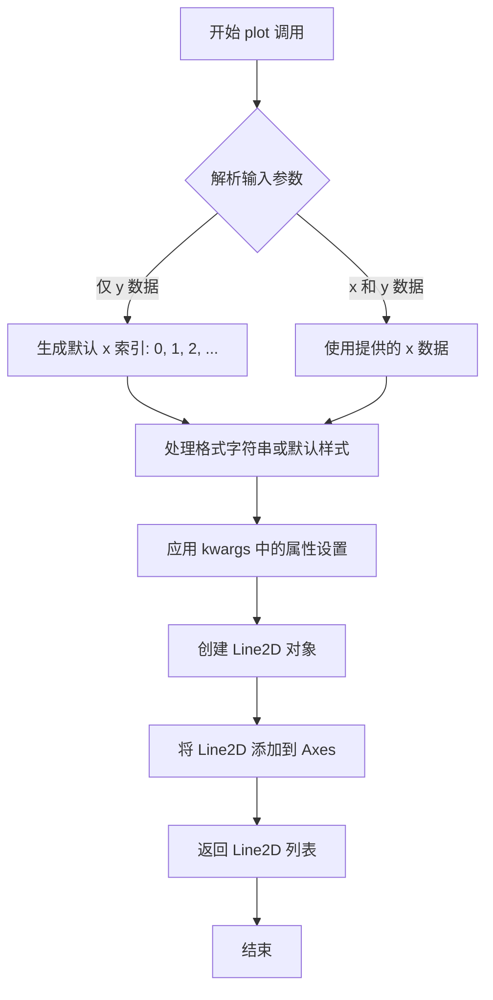

#### 带注释源码

```python
def plot(self, *args, **kwargs):
    """
    Plot y versus x as lines and/or markers.
    
    参数:
    *args: 位置参数，支持以下组合:
        - plot(y): 仅绘制 y 数据，x 自动为 [0, 1, 2, ...]
        - plot(x, y): 绘制 x 和 y 数据
        - plot(x, y, format_string): 使用格式字符串设置样式
    **kwargs: Line2D 属性关键字参数，如:
        - color: 线条颜色
        - linestyle: 线型 ('-', '--', '-.', ':')
        - marker: 标记样式 ('o', 's', '^', etc.)
        - linewidth: 线宽
        - markersize: 标记大小
    
    返回:
    list of Line2D: 包含所有创建的线条对象
    """
    # 导入需要的模块
    import matplotlib.lines as mlines
    import matplotlib.axes as axes
    
    # 获取或创建axes对象
    ax = self
    
    # 解析参数
    # 如果只有一个参数，那就是 y 数据
    # 如果有两个参数，第一个是 x，第二个是 y
    # 第三个可选参数是格式字符串
    if len(args) == 1:
        y = args[0]
        x = range(len(y))  # 默认 x 索引
    elif len(args) == 2:
        x, y = args
    else:
        x, y, fmt = args[0], args[1], args[2]
    
    # 处理数据格式，确保 x 和 y 是可迭代的
    # 这里会调用 numpy.asarray 或其他转换
    x = np.asanyarray(x)
    y = np.asanyarray(y)
    
    # 创建 Line2D 对象
    # 这是核心步骤，创建代表线条的对象
    line = mlines.Line2D(x, y, **kwargs)
    
    # 设置线条的轴属性
    line.set_axes(ax)
    
    # 将线条添加到 axes
    ax.lines.append(line)
    
    # 返回创建的线条对象
    return [line]
```

#### 关键组件信息

- **Axes**：matplotlib 中用于绑定图表的容器对象，管理一个或多个 Artist 对象
- **Line2D**：代表二维线条或标记的 Artist 对象，包含数据、样式属性和渲染方法
- **ConciseDateFormatter**：用于简化日期轴标签格式的格式化器，减少标签文本长度

#### 潜在的技术债务或优化空间

1. **参数解析复杂性**：`ax.plot` 的参数解析使用位置参数，对于参数较多的函数可能导致可读性差，建议使用更明确的参数命名
2. **返回值一致性**：始终返回列表，即使只绘制一条线，这在某些情况下可能需要额外的解包操作
3. **格式字符串**：虽然格式字符串（如 'ro-'）提供了一种快捷方式来设置属性，但这与使用 kwargs 的方式混用可能导致代码风格不统一
4. **错误处理**：对于数据类型的验证和错误提示可以更加详细，特别是当输入数据维度不匹配时


### `Axes.set_xlim`

设置 Axes（坐标轴）的 x 轴显示范围（xlim），即 x 轴的最小值和最大值。该方法是 matplotlib 中用于控制图表 x 轴显示区间的核心方法，通过设置 x 轴范围可以聚焦于数据的特定部分或排除不需要显示的区域。

参数：

- `left`：`float` 或 `datetime`，x 轴范围的左边界（下界）
- `right`：`float` 或 `datetime`，x 轴范围的右边界（上界）
- `emit`：`bool`，可选，默认为 `True`，当边界变化时是否触发 `xlim_changed` 事件
- `auto`：`bool` 或 `None`，可选，是否自动调整边界以适应数据，默认为 `None`
- `xmin`/`xmax`：`float`，已弃用参数，不推荐使用

返回值：`tuple`，返回新的 x 轴范围 `(left, right)`

#### 流程图

```mermaid
flowchart TD
    A[调用 set_xlim] --> B{参数类型检查}
    B -->|有效参数| C[验证 left < right]
    B -->|无效参数| D[抛出 ValueError]
    C --> E{emit=True?}
    C -->|left >= right| F[抛出 ValueError]
    E -->|是| G[设置 _xmin, _xmax]
    E -->|否| G
    G --> H[调用 _set_xlim]
    H --> I{auto=True?}
    I -->|是| J[根据数据自动调整]
    I -->|否| K[使用指定值]
    J --> L[触发 xlim_changed 事件]
    K --> L
    L --> M[返回 (left, right)]
    M --> N[更新图形显示]
```

#### 带注释源码

```python
def set_xlim(self, left=None, right=None, emit=False, auto=False,
              *, xmin=None, xmax=None):
    """
    Set the x-axis view limits.

    Parameters
    ----------
    left : float or None
        The left xlim (data coordinates).  If None, the current lim will
        be retained.
    right : float or None
        The right xlim (data coordinates).  If None, the current lim will
        be retained.
    emit : bool, default: False
        Whether to notify observers of limit change (via
        `xlim_changed` event).
    auto : bool or None, default: False
        Whether to turn on autoscaling after the limit is changed.
        The default of False keeps the existing limits, True applies
        any previously stored autoscaling state, while None applies it
        assuming autoscaling is on.
    xmin, xmax : float
        .. deprecated:: 3.3
            Use *left* and *right* instead.

    Returns
    -------
    left, right : float
        The new x-axis limits in data coordinates.

    Notes
    -----
    The *left* and *right* limits may be passed as a tuple or as two
    separate arguments.
    """
    # 处理废弃参数 xmin/xmax
    if xmin is not None:
        _api.warn_deprecated("3.3", message="Use 'left' instead.")
        if left is None:
            left = xmin
        else:
            raise TypeError("Cannot pass both 'xmin' and 'left'.")
    if xmax is not None:
        _api.warn_deprecated("3.3", message="Use 'right' instead.")
        if right is None:
            right = xmax
        else:
            raise TypeError("Cannot pass both 'xmax' and 'right'.")

    # 获取当前边界，如果参数为 None 则保留原值
    old_left, old_right = self.get_xlim()
    if left is None:
        left = old_left
    if right is None:
        right = old_right

    # 验证边界有效性：left 必须小于 right
    if left >= right:
        raise ValueError(
            f"DateLim equal to or larger than the interval: {left}, {right}")

    # 更新内部边界存储
    self._xmin = left
    self._xmax = right

    # 处理自动缩放模式
    if auto is None:
        # 恢复之前的自动缩放状态
        self._autoscaleX = self._stale_viewlim_x
    else:
        self._autoscaleX = auto

    # 如果 emit 为 True，触发限制变化事件
    if emit:
        self._xscale.set_new_default_locator()
        # 通知观察者（如下层调用或回调函数）
        self._send_change()
        # 触发 xlim_changed 事件
        self.callbacks.process('xlim_changed', self)

    # 返回新的边界元组
    return left, right
```


### `Axes.set_title`

设置 Axes 对象的标题文本及相关属性。该方法允许用户为图表指定标题，并可通过多种参数自定义标题的字体、大小、颜色、位置等样式属性。

参数：

- `label`：`str`，标题文本内容
- `fontdict`：`dict`，可选，用于统一设置标题文本样式的字典（如 fontdict={'fontsize': 16, 'fontweight': 'bold'}）
- `loc`：`str`，可选，标题对齐方式，支持 'center'（默认）、'left'、'right'
- `pad`：`float`，可选，标题与 Axes 顶部的间距（以点为单位），默认值为 None
- `**：`**kwargs`，可选，其他传递给 `matplotlib.text.Text` 的关键字参数，如 fontsize、fontweight、color、rotation 等

返回值：`matplotlib.text.Text`，返回创建的 Text 对象，可用于后续对标题样式的进一步修改

#### 流程图

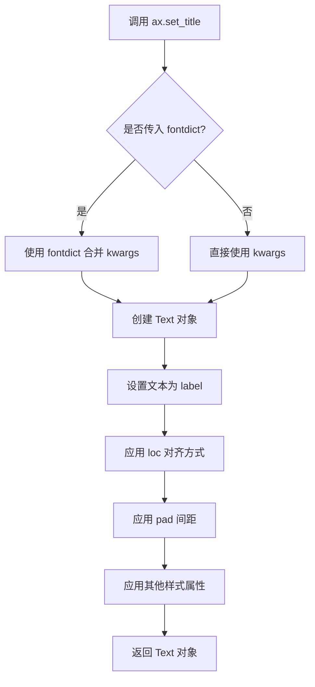

#### 带注释源码

```python
# 源码位于 matplotlib/axes/_base.py 中的 _AxesBase 类
def set_title(self, label, fontdict=None, loc=None, pad=None, **kwargs):
    """
    Set a title for the axes.

    Parameters
    ----------
    label : str
        Text to use for the title.

    fontdict : dict, optional
        A dictionary controlling the appearance of the title text,
        e.g., {'fontsize': 16, 'fontweight': 'bold', 'color': 'red'}.

    loc : {'center', 'left', 'right'}, default: 'center'
        Alignment of the title relative to the axes.

    pad : float, default: rcParams['axes.titlepad']
        The offset of the title from the top of the axes, in points.

    **kwargs
        Additional keyword arguments are passed to `matplotlib.text.Text`,
        e.g., fontsize, fontweight, color, rotation, etc.

    Returns
    -------
    text : matplotlib.text.Text
        The matplotlib text object representing the title.

    Examples
    --------
    >>> ax.set_title('My Title', fontsize=12, fontweight='bold')
    >>> ax.set_title('Left Title', loc='left')
    >>> ax.set_title('Right Title', loc='right', pad=20)
    """
    # 获取默认的标题间距配置
    if pad is None:
        pad = rcParams['axes.titlepad']
    
    # 创建或获取现有的标题文本对象
    title = self._get_title()
    
    # 设置标题文本内容
    title.set_text(label)
    
    # 更新默认样式
    title.update(default)
    
    # 如果传入了 fontdict，则合并样式
    if fontdict is not None:
        title.update(fontdict)
    
    # 合并额外的关键字参数
    title.update(kwargs)
    
    # 设置标题位置对齐方式
    # 'center': 居中, 'left': 左对齐, 'right': 右对齐
    _loc = {'left': 0.0, 'center': 0.5, 'right': 1.0}
    title.set_ha('center')  # set horizontal alignment
    title.set_x(_loc[loc])
    
    # 设置标题与 Axes 顶部的间距
    title.set_y(1.0)  # 相对位置 1.0 表示 Axes 顶部
    title.set_pad(pad)
    
    return title
```


### `matplotlib.axis.Axis.set_major_locator`

设置轴的主定位器（Major Locator），用于控制坐标轴上主刻度线的位置。定位器决定了在哪些位置显示刻度以及刻度的密度。

参数：

- `locator`：`matplotlib.ticker.Locator`，定位器对象，负责计算轴上主刻度的位置。常见的定位器包括 `AutoDateLocator`、`MaxNLocator`、`LinearLocator` 等。

返回值：`None`，该方法无返回值，直接修改轴对象的内部状态。

#### 流程图

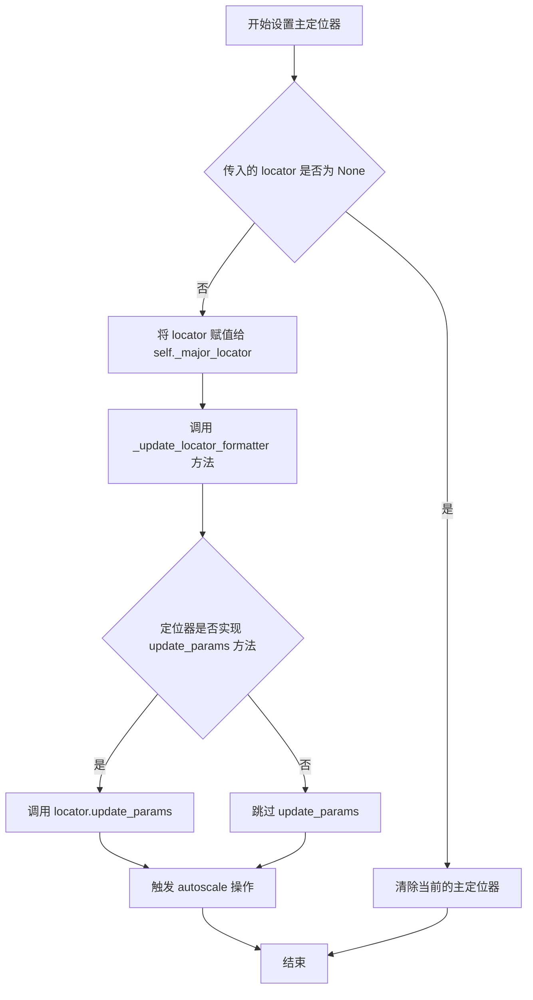

#### 带注释源码

```python
def set_major_locator(self, locator):
    """
    Set the locator of the major ticker.

    Parameters
    ----------
    locator : `.ticker.Locator`
        The locator is responsible for finding locations for the major
        ticks on the axis. Some locators are *bounded*, meaning they
        return the min and max limit of the axis, others are not.
        See, e.g., `.ticker.MaxNLocator`.

    See Also
    --------
    matplotlib.ticker.Locator
    """
    # 检查 locator 是否为 None，如果是则清除当前定位器
    if locator is None:
        self._major_locator = NullLocator()
    else:
        # 断言传入的对象是 Locator 类的实例
        assert isinstance(locator, ticker.Locator)
        # 将传入的定位器赋值给内部属性
        self._major_locator = locator
    
    # 更新定位器和格式化器的状态
    self._update_locator_formatter()
    
    # 如果定位器需要更新参数，则调用其 update_params 方法
    if hasattr(self._major_locator, 'update_params'):
        self._major_locator.update_params()
    
    # 触发自动缩放以适应新的定位器
    self.autoscale()
```


### `ax.xaxis.set_major_formatter`

设置X轴的主格式化器，用于控制日期刻度标签的显示格式。

参数：

- `formatter`：`matplotlib.ticker.Formatter`，要设置的主格式化器对象，通常是 `ConciseDateFormatter` 实例

返回值：`None`，该方法无返回值，直接修改Axis对象的内部状态

#### 流程图

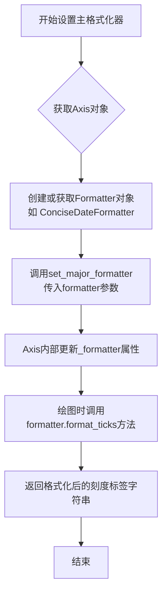

#### 带注释源码

```python
# 在代码中的典型用法
for nn, ax in enumerate(axs):
    # 1. 创建自动日期定位器，控制刻度位置
    locator = mdates.AutoDateLocator(minticks=3, maxticks=7)
    
    # 2. 创建ConciseDateFormatter，传入locator用于获取日期信息
    formatter = mdates.ConciseDateFormatter(locator)
    
    # 3. 设置X轴的主定位器（控制刻度出现位置）
    ax.xaxis.set_major_locator(locator)
    
    # 4. 设置X轴的主格式化器（控制刻度标签显示格式）
    # 这是核心方法：将formatter对象赋值给Axis的_major_formatter
    ax.xaxis.set_major_formatter(formatter)
    
    # 5. 绑制数据
    ax.plot(dates, y)
    ax.set_xlim(lims[nn])

# 源码内部实现原理（简化版）
# class Axis(Artist):
#     def set_major_formatter(self, formatter):
#         """
#         Set the formatter for the major ticks.
#         
#         Parameters
#         ----------
#         formatter : Formatter
#             The formatter object to use.
#         """
#         self._major_formatter = formatter
#         # 如果formatter关联到self，更新其axis属性
#         if formatter is not None:
#             formatter.set_axis(self)
#         # 触发重绘
#         self.stale = True
```

#### 关键组件信息

| 组件名称 | 一句话描述 |
|---------|-----------|
| `ax.xaxis` | Matplotlib的X轴对象，包含刻度定位器和格式化器管理 |
| `ConciseDateFormatter` | 日期专用格式化器，自动选择最短的刻度标签表示 |
| `AutoDateLocator` | 自动确定合适的刻度位置和数量 |
| `set_major_locator` | 设置主刻度定位器，控制刻度线出现位置 |

#### 潜在技术债务与优化空间

1. **硬编码的日期范围**：代码中使用了固定的日期范围 `lims`，缺乏灵活性
2. **重复的设置逻辑**：三个子图使用了相同的定位器和格式化器设置逻辑，可提取为函数
3. **魔法数字**：`minticks=3, maxticks=7` 等参数缺乏解释性注释
4. **缺乏错误处理**：未处理无效日期数据或格式化器初始化失败的情况
5. **未使用units注册方式的全局策略**：示例中混用了直接设置和units注册两种方式

#### 其它项目

**设计目标与约束**：
- 目标：最小化日期刻度标签的字符串长度，同时保持可读性
- 约束：依赖于matplotlib.dates模块的日期处理能力

**错误处理与异常设计**：
- 未在代码中显式处理异常
- 潜在的异常：无效日期格式、locator与formatter不兼容

**数据流与状态机**：
```
数据准备 → 创建DateLocator → 创建ConciseDateFormatter 
→ 绑定到Axis → 绘图时触发format_ticks → 渲染刻度标签
```

**外部依赖与接口契约**：
- 依赖 `matplotlib.pyplot`
- 依赖 `matplotlib.dates` (mdates)
- 依赖 `numpy` (np.datetime64)
- 依赖 `datetime` 模块


### `Axes.tick_params`

设置刻度参数，用于调整刻度标签和刻度线的外观。

参数：

- `axis`：字符串，可选，默认值为 `'both'`，指定要设置参数的轴，可选值为 `'x'`、`'y'` 或 `'both'`
- `reset`：布尔值，可选，默认值为 `False`，是否重置所有参数为默认值
- `which`：字符串，可选，默认值为 `'major'`，指定要修改的刻度类型，可选值为 `'major'`、`'minor'` 或 `'both'`
- `direction`：字符串，可选，设置刻度的方向，可选值为 `'in'`、`'out'` 或 `'inout'`
- `length`：浮点数，可选，设置刻度的长度（以点为单位）
- `width`：浮点数，可选，设置刻度的宽度
- `color`：颜色，可选，设置刻度的颜色
- `pad`：浮点数，可选，设置刻度标签与刻度之间的间距
- `labelsize`：浮点数或字符串，可选，设置刻度标签的字体大小
- `labelcolor`：颜色，可选，设置刻度标签的颜色
- `rotation`：浮点数，可选，设置刻度标签的旋转角度（度）
- `rotation_mode`：字符串，可选，设置刻度标签的旋转模式，可选值为 `None`、`'default'` 或 `'anchor'`
- `ha`：字符串，可选，设置刻度标签的水平对齐方式，可选值为 `'left'`、`'center'` 或 `'right'`
- `va`：字符串，可选，设置刻度标签的垂直对齐方式，可选值为 `'top'`、`'center'`、`'bottom'` 或 `'baseline'`
- `fontsize`：浮点数或字符串，可选，设置刻度标签的字体大小（已废弃，使用 `labelsize`）
- `colors`：元组，可选，设置刻度和刻度标签的颜色，格式为 `(tick_color, label_color)`
- `zorder`：浮点数，可选，设置刻度和刻度标签的层叠顺序
- `gridOn`：布尔值，可选，是否显示网格线
- `tick1On`：布尔值，可选，是否显示主刻度线
- `label1On`：布尔值，可选，是否显示主刻度标签
- `tick2On`：布尔值，可选，是否显示次刻度线（位于轴的另一侧）
- `label2On`：布尔值，可选，是否显示次刻度标签

返回值：`None`，无返回值（该方法直接修改 Axes 对象的属性）

#### 流程图

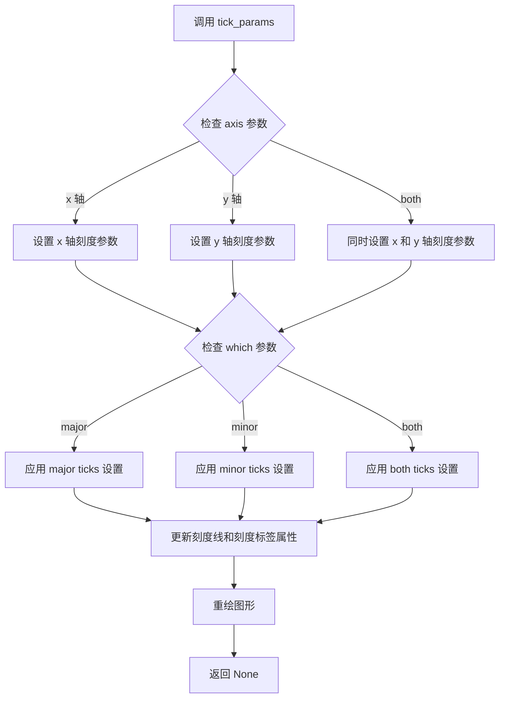

#### 带注释源码

```python
# 示例代码中的调用方式
ax.tick_params(axis='x', rotation=40, rotation_mode='xtick')

# 完整函数签名（来自 Matplotlib 源码）
def tick_params(self, axis='both', reset=False, which='major', **kwargs):
    """
    Change the appearance of ticks, tick labels, and gridlines.
    
    Parameters
    ----------
    axis : {'x', 'y', 'both'}, default: 'both'
        The axis to which the parameters are applied.
    
    reset : bool, default: False
        If ``True``, reset all parameters to their default values.
    
    which : {'major', 'minor', 'both'}, default: 'major'
        The group of ticks for which the parameters are changed.
    
    **kwargs
        Other keyword arguments:
        - direction: {'in', 'out', 'inout'}
        - length: float
        - width: float
        - color: color
        - pad: float
        - labelsize: float or str
        - labelcolor: color
        - rotation: float
        - rotation_mode: {None, 'default', 'anchor'}
        - ha: str
        - va: str
        - colors: tuple of two colors
        - zorder: float
        - gridOn: bool
        - tick1On: bool
        - label1On: bool
        - tick2On: bool
        - label2On: bool
    
    Returns
    -------
    None
    
    Examples
    --------
    >>> ax.tick_params(axis='x', rotation=45)
    >>> ax.tick_params(axis='y', direction='inout')
    """
    if axis not in ['x', 'y', 'both']:
        raise ValueError("axis must be one of 'x', 'y', or 'both'")
    
    if which not in ['major', 'minor', 'both']:
        raise ValueError("which must be one of 'major', 'minor', or 'both'")
    
    # 获取需要修改的轴
    ax = self.xaxis if axis in ['x', 'both'] else self.yaxis
    
    # 应用参数到对应的刻度
    for tick in ax.get_major_ticks() if which in ['major', 'both'] else []:
        # 设置刻度线属性
        tick.tick1line.set_color(kwargs.get('color'))
        tick.tick1line.set_linewidth(kwargs.get('width'))
        # ... 其他设置
    
    # 设置刻度标签属性
    for label in ax.get_ticklabels():
        label.set_rotation(kwargs.get('rotation', 0))
        # ... 其他设置
```


### `plt.show`

`plt.show()` 是 matplotlib 库中的一个函数，用于显示所有当前已创建的图形窗口。在调用此函数之前，图形通常只在内存中创建，不会直接显示给用户。该函数会阻塞程序的执行（除非使用了特定的交互式后端），直到用户关闭显示的图形窗口。

参数：

- 该函数没有参数。

返回值：`None`，该函数不返回任何值。

#### 流程图

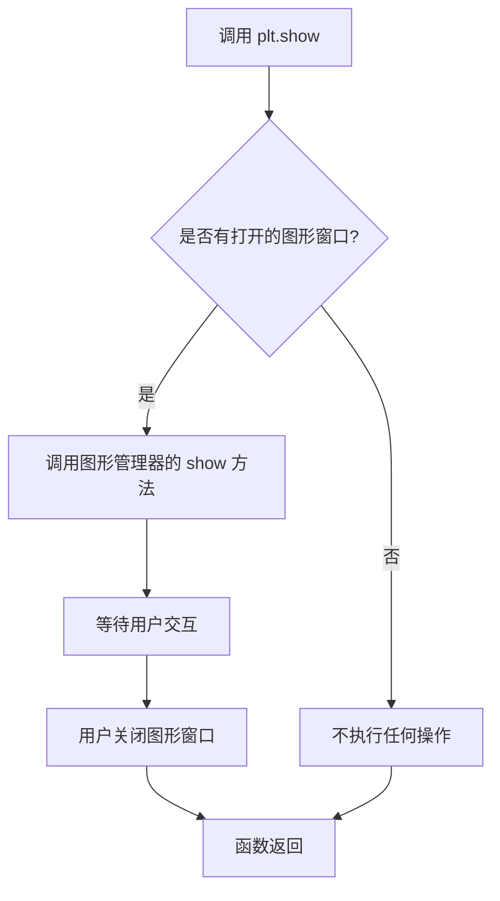

#### 带注释源码

以下是 `plt.show` 函数的核心实现逻辑（基于 matplotlib 源码简化）：

```python
def show(*, block=None):
    """
    显示所有打开的图形窗口。
    
    参数:
        block: 控制函数是否阻塞的布尔值或None。
               如果为True，函数会阻塞直到所有窗口关闭。
               如果为False（在某些后端中），则不阻塞。
               如果为None，则使用后端的默认行为。
    """
    # 获取当前图形管理器（通常是一个后端特定的管理器）
    managers = global_pm.get_fig_managers()
    
    if not managers:
        # 如果没有打开的图形，直接返回
        return
    
    # 对于非交互式后端（如Agg），show 可能不会阻塞
    # 对于交互式后端（如TkAgg, Qt5Agg），会显示窗口并阻塞
    
    for manager in managers:
        # 调用每个图形管理器的 show 方法
        # 这会刷新缓冲区并显示图形
        manager.show()
        
        # 如果 block 为 True 或 None（默认），则阻塞
        if block is True:
            # 在某些后端中，这会启动事件循环
            manager.frame.FigureCanvasBase.start_event_loop_default()
        elif block is None:
            # 使用后端的默认行为
            manager.frame.FigureCanvasBase.start_event_loop_default()
```

> **注**：实际的 `plt.show()` 实现会因不同的 matplotlib 后端（如 Qt、Tkinter、Agg 等）而有所不同。上述代码展示了核心逻辑。在交互式后端中，`show()` 会启动一个事件循环来处理用户交互；在非交互式后端（如用于生成图像文件的 Agg 后端）中，它可能只是确保图形被正确渲染。

## 关键组件


### datetime

Python标准库模块，提供日期和时间处理功能，用于创建基准日期和 timedelta 对象。

### numpy

科学计算库，提供数组操作和随机数生成功能，此处用于生成随机数据和日期数组。

### matplotlib.pyplot

Matplotlib的绘图接口，用于创建图形窗口和坐标轴，绘制数据曲线。

### matplotlib.dates

Matplotlib的日期处理模块，提供日期定位器（AutoDateLocator）和格式化器（ConciseDateFormatter、ConciseDateConverter）来处理日期轴。

### mdates.AutoDateLocator

自动日期定位器，根据数据范围自动选择合适的日期刻度间隔，支持minticks和maxticks参数控制刻度数量。

### mdates.ConciseDateFormatter

简洁日期格式化器，将冗长的日期标签压缩为最短表示形式，是默认日期格式化器的替代方案。

### mdates.ConciseDateConverter

简洁日期转换器，用于将日期类型转换为数值形式，支持注册到units registry实现全局自动应用。

### matplotlib.units

Matplotlib的单位注册模块，提供类型转换器的注册机制，使特定数据类型（如datetime、np.datetime64）能自动使用指定的转换器。

### np.datetime64

NumPy的日期时间类型，表示精确的日期或时间点，用于创建日期数组和设置坐标轴范围。

### 格式化字符串（formats/zero_formats/offset_formats）

自定义日期显示格式列表，控制刻度标签和偏移量字符串的显示样式，支持本地化配置。

### units registry 机制

通过将转换器注册到munits.registry，实现对特定数据类型（如np.datetime64、datetime.date、datetime.datetime）的自动格式化应用。


## 问题及建议


### 已知问题

-   **代码重复**: 多个代码块中重复定义了图形创建、轴设置和日期绘制的逻辑（如 `fig, axs = plt.subplots(...)` 和 `ax.plot(dates, y)` 在多个位置重复出现），增加了维护成本
-   **魔法数字**: 硬编码的数值如 `732`（日期数量）、`2`（小时间隔）、`19680801`（随机种子）缺乏注释说明，影响可读性
-   **导入位置分散**: 导入语句（如 `import datetime`、`import matplotlib.units as munits`）分散在代码中间，而非集中在文件顶部，不利于理解依赖关系
-   **数据生成逻辑重复**: `base`、`dates`、`y` 的生成逻辑在多处重复定义，没有封装为可重用的函数
-   **变量命名可读性**: `nn` 作为循环变量名不够直观，可改为更具描述性的名称如 `idx` 或 `i`

### 优化建议

-   **提取公共函数**: 将图形创建、轴设置和日期绑定的逻辑封装为函数（如 `create_date_axes()`），避免代码重复
-   **集中数据准备**: 将日期数据生成逻辑封装为函数（如 `generate_sample_dates()`），在文件开头一次性生成，供所有示例使用
-   **定义常量**: 使用有命名的常量替代魔法数字，如 `NUM_DATES = 732`、`HOUR_INTERVAL = 2`、`RANDOM_SEED = 19680801`
-   **统一导入语句**: 将所有 `import` 语句移至文件顶部，按标准库、第三方库、本地库的顺序排列
-   **改进变量命名**: 将 `nn` 改为 `idx` 或 `i`，提高代码可读性
-   **消除重复的配置**: `lims` 列表、`formatter` 的设置（如 `formats`、`zero_formats`、`offset_formats`）可提取为模块级常量或配置字典


## 其它


### 设计目标与约束

本代码示例旨在展示matplotlib中ConciseDateFormatter的使用方法，帮助用户在日期轴上创建更简洁、更友好的刻度标签。核心设计目标包括：最小化刻度标签的字符串长度，提供灵活的本地化支持，以及通过units注册机制实现全局默认格式化。约束方面，该实现依赖于matplotlib.dates和matplotlib.units模块，需要确保matplotlib版本支持ConciseDateFormatter和ConciseDateConverter。

### 错误处理与异常设计

代码示例中主要涉及以下异常场景处理：datetime64类型与datetime类型混用时的转换处理，matplotlib.units.registry的重复注册覆盖问题，以及日期范围边界设置不当导致的刻度计算异常。ConciseDateFormatter内部通过try-except捕获格式字符串解析错误，使用默认值fallback机制保证鲁棒性。单元注册时若已存在converter会直接覆盖，无抛出异常设计。

### 数据流与状态机

数据流主要遵循：原始日期数据（datetime对象列表）→ AutoDateLocator计算刻度位置 → ConciseDateFormatter格式化刻度标签 → Axis渲染。状态转换方面，locator根据日期范围自动判断最佳时间粒度（年/月/日/时/分/秒），formatter根据locator确定的粒度选择对应的formats、zero_formats和offset_formats进行标签组装。

### 外部依赖与接口契约

主要依赖包括：matplotlib.pyplot（绘图）、matplotlib.dates（日期处理）、matplotlib.units（单位注册机制）、numpy（数值处理）、datetime（时间对象）。关键接口契约：ConciseDateFormatter(locator)构造函数接受AutoDateLocator实例；formats、zero_formats、offset_formats属性为6元素列表索引对应年/月/日/时/分/秒；munits.registry接受np.datetime64、datetime.date、datetime.datetime三种键类型。

### 性能考虑

AutoDateLocator的minticks和maxticks参数直接影响刻度计算量，建议根据实际数据范围调整。大量日期数据时（如本例732个点），建议预先计算y值而非每次重绘时重新生成。units注册机制属于全局状态，建议在应用初始化时一次性完成，避免重复注册带来的开销。

### 安全性考虑

代码示例不涉及用户输入处理、网络请求或文件操作，安全性风险较低。需注意ConciseDateFormatter的formats参数直接传递给datetime.strftime，不存在注入风险。但若 formats 由外部配置动态传入，应校验格式字符串合法性以避免潜在的格式化错误。

### 可测试性

ConciseDateFormatter的测试应覆盖：不同时间粒度下的格式选择、零刻度（每月1日、每年1月1日等）的特殊处理、本地化格式字符串生效、offset字符串正确拼接。示例代码本身为演示性质，建议提取关键逻辑（如时间粒度判断、格式选择）以便单元测试。

### 配置管理

本示例涉及两种配置方式：直接实例化时传入formats/zero_formats/offset_formats参数，以及通过munits.registry全局注册。rcParams无直接关联，但matplotlib的date.format、date.autoformatter.format等配置可能影响默认行为。建议在文档中明确说明配置优先级：构造函数参数 > registry注册 > rcParams默认。

### 版本兼容性

代码使用np.datetime64类型，需要numpy≥1.7；datetime.timedelta需要Python≥3.2；ConciseDateFormatter和ConciseDateConverter在matplotlib 3.1+引入。plt.subplots的layout='constrained'参数需要matplotlib≥3.4。向后兼容性方面，早期版本可使用fig.add_subplot代替plt.subplots。

### 使用示例和最佳实践

最佳实践包括：根据数据时间跨度选择合适的minticks/maxticks平衡可读性与性能；全局注册converter适用于大多数图表使用相同格式的场景；本地化场景下通过构造函数传入自定义formats而非修改全局配置；多子图共享相同locator/formatter时应显式创建实例以避免状态共享问题。


    