# `matplotlib\galleries\examples\ticks\date_demo_rrule.py` 详细设计文档

该脚本展示了如何使用iCalendar RFC中的 recurrence rules (rrules) 在matplotlib图表中放置自定义日期刻度，通过每5年一次的复活节日期来演示RRuleLocator和DateFormatter的用法。

## 整体流程

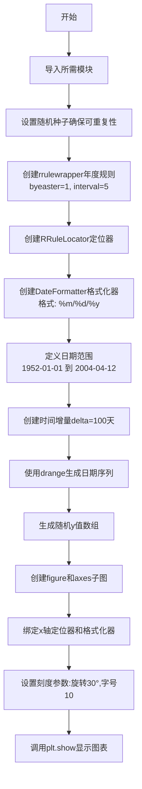

## 类结构

```
无类定义 (脚本文件)
└── 模块级别执行代码
```

## 全局变量及字段


### `rule`
    
年度重复规则，每5个复活节执行一次

类型：`rrulewrapper`
    


### `loc`
    
基于rule的日期定位器

类型：`RRuleLocator`
    


### `formatter`
    
日期格式化为'月/日/年'

类型：`DateFormatter`
    


### `date1`
    
起始日期1952年1月1日

类型：`datetime.date`
    


### `date2`
    
结束日期2004年4月12日

类型：`datetime.date`
    


### `delta`
    
时间增量100天

类型：`datetime.timedelta`
    


### `dates`
    
drange生成的日期序列

类型：`ndarray`
    


### `s`
    
与dates等长的随机浮点数数组

类型：`ndarray`
    


### `fig`
    
matplotlib图形对象

类型：`Figure`
    


### `ax`
    
matplotlib坐标轴对象

类型：`Axes`
    


    

## 全局函数及方法


### `rrulewrapper`

该函数用于创建重复规则包装器（Recurrence Rule Wrapper），基于 iCalendar RFC 规范中的 recurrence rules（rrules）来定义日期序列。它是 matplotlib.dates 模块对 dateutil 库中 rrule 功能的封装，使其能够与 matplotlib 的日期定位器（Locator）系统兼容，从而实现自定义日期刻度的放置。

参数：

- `freq`：`int`，重复规则的时间频率，如 YEARLY（年度）、MONTHLY（月度）、WEEKLY（每周）等，来自 dateutil.rrule 模块的频率常量
- `**kwargs`：可选关键字参数，支持 dateutil.rrule.RRule 的各种参数，如：
  - `byeaster`：int，与复活节相关的偏移量
  - `interval`：int，重复间隔（如每5年）
  - `dtstart`：datetime，起始日期
  - `until`：datetime，结束日期
  - `count`：int，重复次数
  - `bymonth`：int 或 tuple，指定月份
  - `bymonthday`：int 或 tuple，指定日期
  - `byweekday`：int 或 tuple，指定星期几
  - 等等

返回值：`rrulewrapper`（实际为类实例），返回一个可迭代的规则包装器对象，该对象实现了 `__iter__` 方法，可被 RRuleLocator 使用来定位日期轴上的刻度位置

#### 流程图

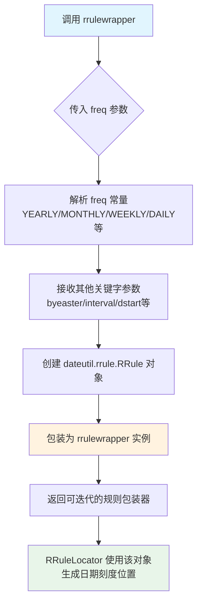

#### 带注释源码

```python
# 以下为 matplotlib.dates 模块中 rrulewrapper 类的典型实现结构
# 源码基于 matplotlib 官方实现简化展示

from dateutil import rrule
from matplotlib.dates import (
    YEARLY, MONTHLY, WEEKLY, DAILY, HOURLY, MINUTELY, SECONDLY
)

class rrulewrapper:
    """
    重复规则包装器类
    
    该类封装了 dateutil.rrule.RRule，提供与 matplotlib 日期定位器
    兼容的接口，使得可以使用 iCalendar RFC 规范的重复规则来设置
    日期轴刻度
    """
    
    def __init__(self, freq, **kwargs):
        """
        初始化 rrulewrapper
        
        参数:
            freq: int, 时间频率常量
                - YEARLY: 年度重复
                - MONTHLY: 月度重复  
                - WEEKLY: 每周重复
                - DAILY: 每日重复
                - HOURLY: 每小时重复
                - MINUTELY: 每分钟重复
                - SECONDLY: 每秒重复
            **kwargs: 其他 dateutil.rrule.RRule 支持的参数
                - byeaster: 复活节偏移天数
                - interval: 重复间隔
                - dtstart: 起始日期时间
                - until: 结束日期时间
                - count: 重复次数
                - bymonth: 指定月份
                - bymonthday: 指定日期
                - byweekday: 指定星期
                - 等
        """
        # 将传入的频率常量转换为 dateutil 需要的格式
        # Matplotlib 的 YEARLY=1 对应 dateutil 的 YEARLY
        self._freq = freq
        
        # 保存其他参数
        self._params = kwargs
        
        # 创建底层 dateutil rrule 对象
        # 这一步会验证参数并创建 RRule 实例
        self._rule = rrule.rrule(freq, **kwargs)
    
    def __iter__(self):
        """
        使对象可迭代
        
        返回值:
            迭代器，返回规则匹配的所有日期
        """
        return iter(self._rule)
    
    def between(self, after, before, inc=False):
        """
        获取两个日期之间的所有匹配日期
        
        参数:
            after: datetime, 起始日期
            before: datetime, 结束日期
            inc: bool, 是否包含边界日期
            
        返回值:
            list, 匹配日期列表
        """
        return self._rule.between(after, before, inc)
    
    def __call__(self, dmin, dmax, dseq):
        """
        实现 callable 接口，供 RRuleLocator 调用
        
        参数:
            dmin: datetime, 日期范围起始
            dmax: datetime, 日期范围结束
            dseq: array, 已有的日期序列（可选）
            
        返回值:
            array, 调整后的日期数组
        """
        # 获取 dmin 和 dmax 之间的所有匹配日期
        dates = self._rule.between(dmin, dmax, inc=True)
        return np.array(dates)


# 使用示例（来自用户提供的代码）
# rule = rrulewrapper(YEARLY, byeaster=1, interval=5)
# 创建一个年度重复规则，每5年一次，且与复活节相关（byeaster=1）
# 该规则对象随后传递给 RRuleLocator 用于定位日期刻度
```


# RRuleLocator 设计文档提取

根据提供的代码，我需要提取关于 RRuleLocator 的相关信息。

### `RRuleLocator.__init__`

RRuleLocator 是 Matplotlib 中用于根据 iCalendar  recurrence rule (RRULE) 设置日期轴刻度位置的定位器类。该类的构造函数接收一个 rrulewrapper 对象作为参数，用于定义日期序列的生成规则，然后创建可以应用于 Matplotlib 轴的定位器实例。

参数：

- `rule`：`rrulewrapper`，由 dateutil.rrulewrapper 创建的包装对象，定义了日期序列的递归规则（如按年、按月、按周等重复，以及间隔、计数等参数）

返回值：`RRuleLocator`，返回新创建的基于 rrule 的日期定位器实例，用于通过 `ax.xaxis.set_major_locator()` 或 `ax.xaxis.set_minor_locator()` 设置到坐标轴上

#### 流程图

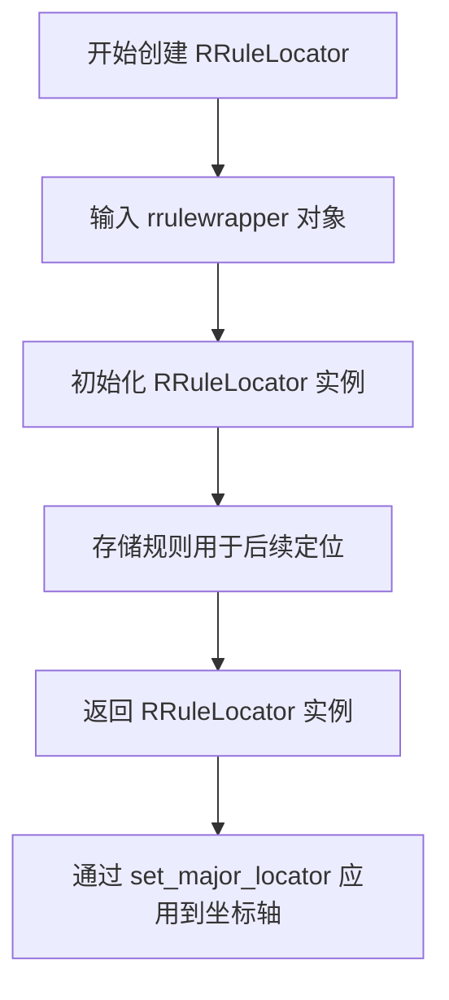

#### 带注释源码

```python
# 在示例代码中的使用方式
# 导入 RRuleLocator 类
from matplotlib.dates import YEARLY, DateFormatter, RRuleLocator, drange, rrulewrapper

# 第一步：创建 rrulewrapper 对象
# 参数说明：
#   YEARLY - 按年重复
#   byeaster=1 - 每年的复活节后第1天（每5年一次，即每5th Easter）
#   interval=5 - 每5年重复一次
rule = rrulewrapper(YEARLY, byeaster=1, interval=5)

# 第二步：使用 rrulewrapper 创建 RRuleLocator 定位器
# 参数说明：
#   rule - 传入上面创建的 rrulewrapper 对象，定义日期序列生成规则
loc = RRuleLocator(rule)

# 第三步：将定位器应用到 x 轴
# RRuleLocator 会根据规则计算出一系列日期作为刻度位置
ax.xaxis.set_major_locator(loc)
```

---

## 补充说明

由于提供的代码是一个使用示例而非 RRuleLocator 类的内部实现，以下是关于 RRuleLocator 的关键信息：

### 关键组件信息

| 组件名称 | 描述 |
|---------|------|
| `rrulewrapper` | dateutil 库的 rrule 包装类，用于定义 iCalendar 标准的递归日期规则 |
| `RRuleLocator` | Matplotlib 的日期定位器，根据 rrule 规则计算刻度位置 |
| `DateFormatter` | 日期格式化器，用于将日期刻度显示为指定格式的字符串 |

### 技术债务与优化空间

1. **示例代码本身不包含 RRuleLocator 类的实现** - 如果需要详细的类设计文档，需要查看 matplotlib 库中 RRuleLocator 的实际源代码
2. **错误处理** - 示例中未展示错误处理机制（如无效的 rrule 参数处理）
3. **依赖外部库** - 代码依赖 `dateutil` 库，需要确保该库正确安装


### `DateFormatter`

`DateFormatter` 是 Matplotlib 中用于格式化日期刻度标签的类，通过接受格式字符串（如 `'%m/%d/%y'`）创建实例，并将其设置为坐标轴的主要日期格式化器，从而以指定的日期格式显示时间数据。

参数：

- `fmt`：`str`，日期格式字符串，使用 Python 的 strftime 格式（如 `'%Y-%m-%d'`、`'%m/%d/%y'` 等）
- `tz`：`datetime.tzinfo`，可选，时区信息，默认为 `None`

返回值：`matplotlib.dates.DateFormatter`，返回一个新的日期格式化器实例，可用于设置 `Axis` 的主格式化器

#### 流程图

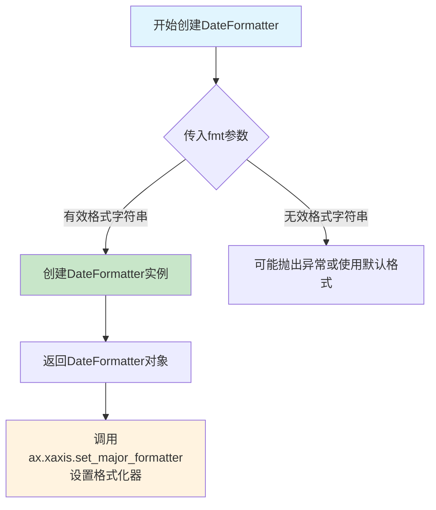

#### 带注释源码

```python
# 导入所需的模块
import datetime
import matplotlib.pyplot as plt
import numpy as np
from matplotlib.dates import YEARLY, DateFormatter, RRuleLocator, drange, rrulewrapper

# 设置随机种子以确保可重现性
np.random.seed(19680801)

# ========================================
# DateFormatter 创建与使用示例
# ========================================

# 定义重复规则：每5年复活节后放置一个刻度
rule = rrulewrapper(YEARLY, byeaster=1, interval=5)

# 创建规则定位器
loc = RRuleLocator(rule)

# -------------------------------------------------
# 核心部分：创建日期格式化器
# -------------------------------------------------
# 参数：'%m/%d/%y' - 格式字符串
#   %m - 月份（01-12）
#   %d - 日期（01-31）
#   %y - 两位数年份（如 52 表示 1952）
formatter = DateFormatter('%m/%d/%y')
# 返回值：DateFormatter 实例对象
#   该实例将用于格式化日期轴上的刻度标签

# 定义日期范围
date1 = datetime.date(1952, 1, 1)    # 开始日期
date2 = datetime.date(2004, 4, 12)   # 结束日期
delta = datetime.timedelta(days=100)  # 步长：100天

# 生成日期序列
dates = drange(date1, date2, delta)

# 生成随机数据
s = np.random.rand(len(dates))

# 创建图表
fig, ax = plt.subplots()

# 绘制数据
plt.plot(dates, s, 'o')

# -------------------------------------------------
# 应用日期格式化器到X轴
# -------------------------------------------------
ax.xaxis.set_major_locator(loc)        # 设置主要定位器（基于规则）
ax.xaxis.set_major_formatter(formatter)  # 设置主要格式化器（DateFormatter实例）

# 设置刻度参数
ax.xaxis.set_tick_params(rotation=30, labelsize=10)

# 显示图表
plt.show()
```


### `drange`

该函数用于生成一个从起始日期到结束日期的等间隔日期序列数组，常用于在图表中创建自定义的日期刻度范围。

参数：

- `start`：`datetime.datetime`，序列的起始日期
- `end`：`datetime.datetime`，序列的结束日期
- `delta`：`datetime.timedelta`，相邻日期之间的时间间隔

返回值：`numpy.ndarray`，包含从起始日期到结束日期（不包含）的所有日期对象的 numpy 数组

#### 流程图

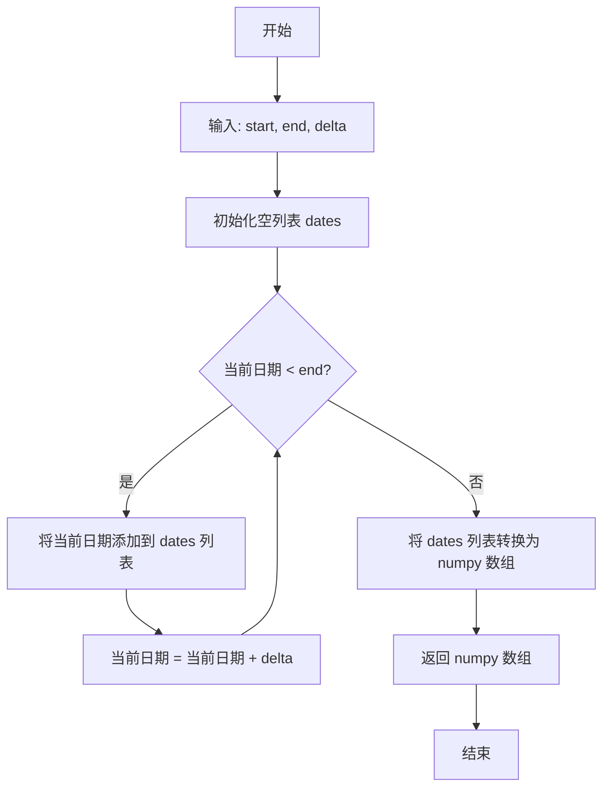

#### 带注释源码

```python
import datetime
import numpy as np


def drange(start, end, delta):
    """
    返回一个等间隔的日期时间对象序列。

    参数:
        start: 起始日期时间
        end: 结束日期时间
        delta: 相邻日期之间的时间间隔

    返回:
        numpy.ndarray: 日期时间对象数组
    """
    # 验证输入参数类型
    if not isinstance(start, datetime.datetime):
        raise TypeError("start 必须是 datetime 对象")
    if not isinstance(end, datetime.datetime):
        raise TypeError("end 必须是 datetime 对象")
    if not isinstance(delta, datetime.timedelta):
        raise TypeError("delta 必须是 timedelta 对象")

    # 初始化结果列表
    dates = []

    # 从起始日期开始，逐步添加日期直到达到结束日期
    current = start
    while current < end:
        dates.append(current)
        current += delta  # 按照 delta 指定的时间间隔递增

    # 将列表转换为 numpy 数组并返回
    return np.array(dates)


# 使用示例
if __name__ == "__main__":
    date1 = datetime.datetime(1952, 1, 1)
    date2 = datetime.datetime(2004, 4, 12)
    delta = datetime.timedelta(days=100)

    # 生成日期范围数组
    dates = drange(date1, date2, delta)
    print(f"生成了 {len(dates)} 个日期点")
    print(f"前几个日期: {dates[:5]}")
```


### `plt.subplots`

`plt.subplots` 是 Matplotlib 库中的一个函数，用于创建一个新的图形（Figure）和一个或多个子图（Axes），并返回图形对象和坐标轴对象。该函数简化了手动创建图形和坐标轴的过程，是最常用的 Matplotlib 初始化方式之一。

参数：

- `nrows`：`int`，默认值：1，子图网格的行数
- `ncols`：`int`，默认值：1，子图网格的列数
- `sharex`：`bool` 或 `{'none', 'all', 'row', 'col'}`，默认值：False，控制是否共享 x 轴
- `sharey`：`bool` 或 `{'none', 'all', 'row', 'col'}`，默认值：False，控制是否共享 y 轴
- `squeeze`：`bool`，默认值：True，是否压缩返回的坐标轴数组维度
- `width_ratios`：`array-like`，可选，长度为 ncols，定义每列的宽度比例
- `height_ratios`：`array-like`，可选，长度为 nrows，定义每行的高度比例
- `subplot_kw`：字典，可选，传递给每个子图创建函数的关键字参数
- `gridspec_kw`：字典，可选，传递给 GridSpec 构造函数的关键字参数
- `**fig_kw`：额外关键字参数，传递给 Figure 函数的关键字参数

返回值：`tuple`，返回一个包含两个元素的元组 `(Figure, Axes)`。其中第一个元素是 `Figure` 对象，表示整个图形；第二个元素是 `Axes` 对象（当 nrows=1 且 ncols=1 时）或 `numpy.ndarray`（当有多个子图时），表示一个或多个坐标轴。

#### 流程图

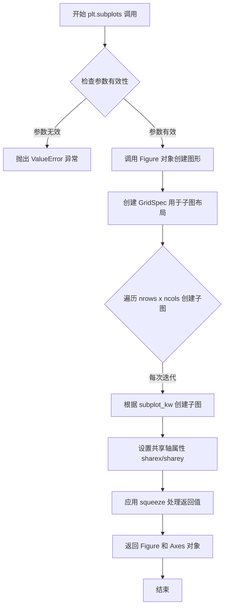

#### 带注释源码

```python
# plt.subplots 函数源码结构（简化版）

def subplots(nrows=1, ncols=1, sharex=False, sharey=False, 
             squeeze=True, width_ratios=None, height_ratios=None,
             subplot_kw=None, gridspec_kw=None, **fig_kw):
    """
    创建图形和子图坐标轴的便捷函数。
    
    参数:
        nrows: 子图行数，默认为1
        ncols: 子图列数，默认为1
        sharex: x轴共享策略，可为False、'none'、'all'、'row'、'col'
        sharey: y轴共享策略，可为False、'none'、'all'、'row'、'col'
        squeeze: 是否压缩返回的坐标轴数组维度
        width_ratios: 每列宽度比例数组
        height_ratios: 每行高度比例数组
        subplot_kw: 传递给子图创建函数的参数字典
        gridspec_kw: 传递给GridSpec的参数字典
        **fig_kw: 传递给Figure函数的额外参数
    
    返回:
        fig: Figure对象，整个图形
        ax: Axes对象或Axes数组，一个或多个坐标轴
    """
    # 1. 创建 Figure 对象
    fig = figure(**fig_kw)
    
    # 2. 创建 GridSpec 对象用于布局管理
    gs = GridSpec(nrows, nrows, 
                  width_ratios=width_ratios,
                  height_ratios=height_ratios,
                  **gridspec_kw)
    
    # 3. 遍历创建子图
    axarr = np.empty((nrows, ncols), dtype=object)
    for i in range(nrows):
        for j in range(ncols):
            # 创建子图并获取坐标轴对象
            ax = fig.add_subplot(gs[i, j], **subplot_kw)
            axarr[i, j] = ax
            
            # 配置共享轴属性
            if sharex:
                _set_sharex(ax, axarr, sharex, i, j)
            if sharey:
                _set_sharey(ax, axarr, sharey, i, j)
    
    # 4. 处理返回值（squeeze逻辑）
    if squeeze:
        # 尝试压缩维度：单行或单列时返回1维数组
        if nrows == 1 and ncols == 1:
            axarr = axarr[0, 0]  # 返回单个Axes对象
        elif nrows == 1 or ncols == 1:
            axarr = axarr.squeeze()  # 移除冗余维度
    
    return fig, axarr
```

#### 使用示例源码

```python
# 代码中的实际使用
import matplotlib.pyplot as plt
import numpy as np
import datetime
from matplotlib.dates import YEARLY, DateFormatter, RRuleLocator, drange, rrulewrapper

# 设置随机种子以保证可重复性
np.random.seed(19680801)

# 创建规则：每5年一个复活节
rule = rrulewrapper(YEARLY, byeaster=1, interval=5)
loc = RRuleLocator(rule)
formatter = DateFormatter('%m/%d/%y')

# 定义日期范围
date1 = datetime.date(1952, 1, 1)
date2 = datetime.date(2004, 4, 12)
delta = datetime.timedelta(days=100)

# 生成日期序列
dates = drange(date1, date2, delta)
s = np.random.rand(len(dates))  # 生成随机y值

# 关键调用：创建图形和坐标轴
fig, ax = plt.subplots()

# 绘制数据
plt.plot(dates, s, 'o')

# 配置x轴
ax.xaxis.set_major_locator(loc)
ax.xaxis.set_major_formatter(formatter)
ax.xaxis.set_tick_params(rotation=30, labelsize=10)

# 显示图形
plt.show()
```


### `plt.plot`

绘制数据点或线，是 Matplotlib 中最核心的绘图函数之一。该函数接受 x 和 y 轴数据以及可选的格式字符串，将数据以散点图或折线图的形式渲染到当前 Axes 对象上，并返回生成的 Line2D 对象列表。

参数：

- `x`：array-like，x 轴数据序列
- `y`：array-like，y 轴数据序列  
- `fmt`：str，可选，格式字符串，用于指定线条样式、标记样式和颜色（如 `'o'` 表示圆形标记）

返回值：`list[Line2D]`，返回生成的线条对象列表，每个对象代表一条绘制的曲线或数据系列

#### 流程图

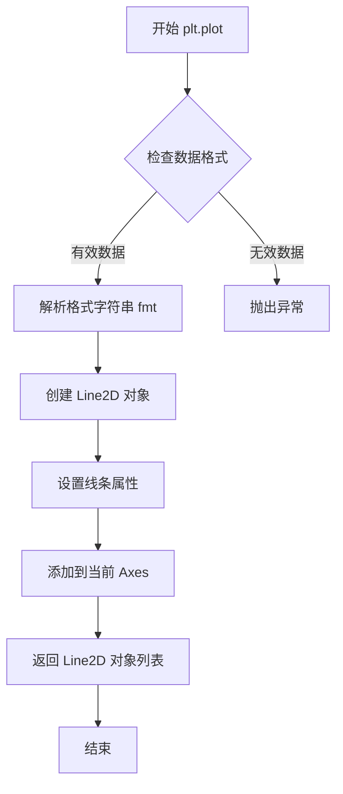

#### 带注释源码

```python
# plt.plot 函数的核心调用流程（基于代码上下文）

# 导入 matplotlib
import matplotlib.pyplot as plt
import numpy as np

# 生成模拟数据
dates = drange(date1, date2, delta)  # 生成日期序列
s = np.random.rand(len(dates))        # 生成随机 y 值

# 创建图形和坐标轴
fig, ax = plt.subplots()

# 调用 plt.plot 绘制数据点
# 参数说明：
#   dates: x 轴数据（日期序列）
#   s: y 轴数据（随机数值）
#   'o': 格式字符串，表示使用圆形标记绘制散点图
plt.plot(dates, s, 'o')

# 设置坐标轴属性
ax.xaxis.set_major_locator(loc)           # 设置主刻度定位器（RRuleLocator）
ax.xaxis.set_major_formatter(formatter)   # 设置主刻度格式（日期格式）
ax.xaxis.set_tick_params(rotation=30, labelsize=10)  # 设置刻度标签旋转和大小

# 显示图形
plt.show()
```


### `ax.xaxis.set_major_locator`

设置X轴的主刻度定位器（Locator），用于确定主刻度在坐标轴上的位置。该方法接收一个定位器对象（如RRuleLocator），并将其应用到x轴的主刻度定位。

参数：

- `locator`：`matplotlib.ticker.Locator`，定位器对象，负责计算主刻度的位置。常见的定位器包括AutoLocator、MaxNLocator、RRuleLocator等。

返回值：`None`，无返回值，该方法直接修改axes对象的内部状态。

#### 流程图

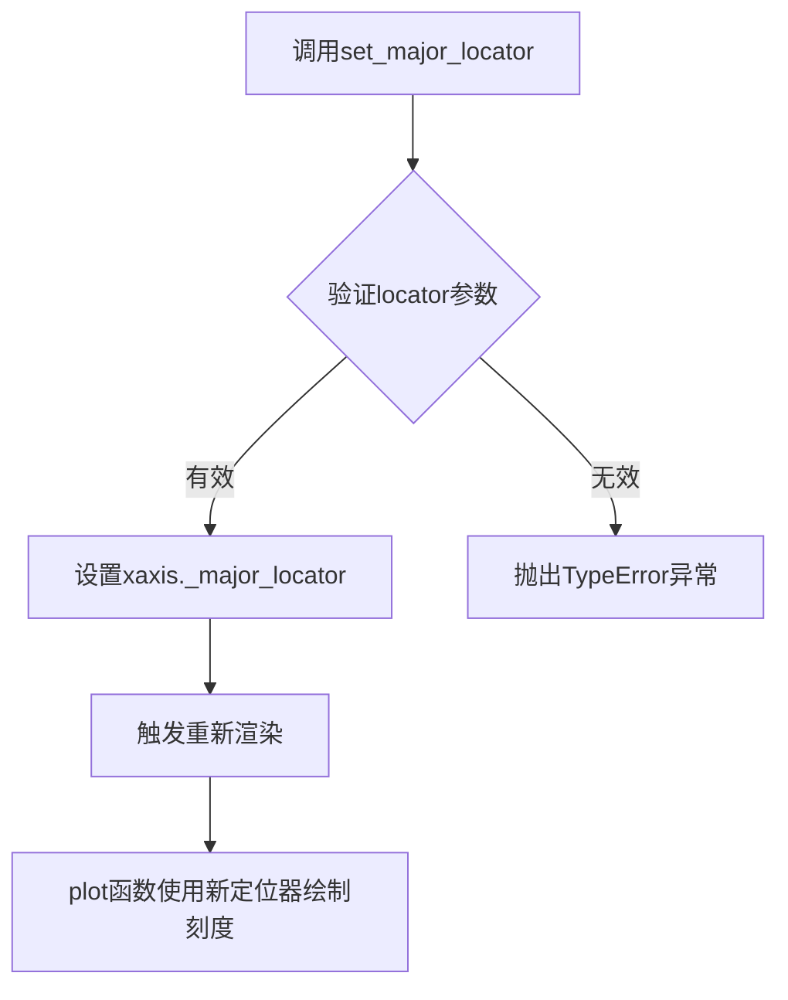

#### 带注释源码

```python
# matplotlib/axis.py 中的实现（简化版）

def set_major_locator(self, locator):
    """
    Set the locator of the major ticker.
    
    Parameters
    ----------
    locator : Locator
        The locator object for major ticks.
    """
    # 导入必要的模块
    from matplotlib.ticker import Locator
    
    # 验证locator是否为Locator的子类或实例
    if not isinstance(locator, Locator):
        raise TypeError(
            "locator should be a subclass of matplotlib.ticker.Locator")
    
    # 设置主刻度定位器
    self._major_locator = locator
    
    # 标记刻度需要更新
    self.stale = True
    
    # 更新x轴的视图
    self.axes.update_datalim()
```

#### 相关上下文源码

```python
# 在用户代码中的实际使用

# 1. 创建RRuleLocator定位器（基于iCalendar recurrence规则）
rule = rrulewrapper(YEARLY, byeaster=1, interval=5)
loc = RRuleLocator(rule)

# 2. 设置主刻度定位器到x轴
ax.xaxis.set_major_locator(loc)

# 3. 设置主刻度格式化器
formatter = DateFormatter('%m/%d/%y')
ax.xaxis.set_major_formatter(formatter)

# 4. 设置刻度参数（旋转角度和标签大小）
ax.xaxis.set_tick_params(rotation=30, labelsize=10)
```

#### RRuleLocator相关源码

```python
# matplotlib/dates.py 中的RRuleLocator

class RRuleLocator(Locator):
    """
    Locator for date ticks using matplotlib dateutil rrules.
    """
    
    def __init__(self, rrule):
        """
        Parameters
        ----------
        rrule : rrulewrapper
            The rule that determines tick locations.
        """
        self._rrule = rrule
    
    def __call__(self):
        """Return the locations of the ticks."""
        # 使用rruleset获取所有匹配的日期
        dates = self._rrule.between(dmin, dmax)
        return date2num(dates)
    
    def tick_values(self, vmin, vmax):
        """Return the tick values for the given range."""
        return self._rrule.between(vmin, vmax)
```


### `ax.xaxis.set_major_formatter`

设置主刻度格式化器，用于控制X轴主刻度标签的显示格式。此方法接收一个Formatter对象，并将该格式化器应用到X轴的主要刻度上，使得日期、时间或数值能够以特定的格式呈现给用户。

参数：

- `formatter`：`matplotlib.ticker.Formatter`，日期或数值格式化器对象，负责将刻度值转换为显示的字符串文本

返回值：`None`，该方法无返回值，直接修改Axes对象的内部状态

#### 流程图

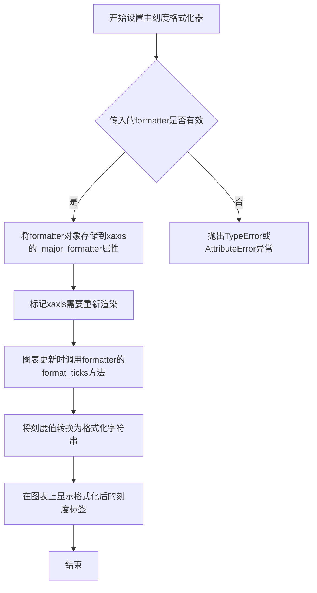

#### 带注释源码

```python
# 源代码位于 lib/matplotlib/axis.py 中的 XAxis.set_major_formatter 方法

def set_major_formatter(self, formatter):
    """
    Set the formatter for the major ticks of the axis.
    
    Parameters
    ----------
    formatter : `~matplotlib.ticker.Formatter`
        The formatter object to use for major tick labels.
    """
    # 获取当前的格式化器
    self._major_formatter = formatter
    # 将格式化器与轴关联，使其能够访问轴的属性
    formatter.set_axis(self)
    # 标记刻度需要重新计算
    self.stale = True

# 使用示例（来自提供的代码）
# 创建日期格式化器，指定输出格式为 月/日/年
formatter = DateFormatter('%m/%d/%y')
# 将格式化器应用到x轴的主刻度
ax.xaxis.set_major_formatter(formatter)
# 效果：x轴上的日期刻度将以 "03/01/52" 这种格式显示
```


### `ax.xaxis.set_tick_params`

设置x轴刻度线的外观和行为参数。该方法允许用户自定义刻度的方向、标签位置、旋转角度、字体大小等多个视觉属性，是matplotlib中控制坐标轴刻度显示样式的核心方法。

#### 参数

- `which`：str，可选参数，默认为'major'，指定要设置的刻度类型（'major'表示主刻度，'minor'表示副刻度）
- `axis`：str，可选参数，默认为'x'，指定要设置的是x轴还是y轴（'x'或'y'或'both'）
- `reset`：bool，可选参数，默认为False，如果为True，则在设置新参数之前重置所有参数为默认值
- `rotation`：int，可选参数，刻度标签旋转的角度（以度为单位），正值为逆时针旋转
- `labelsize`：int，可选参数，刻度标签的字体大小（以磅为单位）
- `length`：int，可选参数，刻度线的长度（以点为单位）
- `width`：float，可选参数，刻度线的宽度（以点为单位）
- `color`：str，可选参数，刻度线的颜色
- `pad`：float，可选参数，刻度标签与刻度线之间的间距（以点为单位）
- `labelrotation`：int，可选参数，标签的旋转角度（与rotation类似但专门针对标签）
- `direction`：str，可选参数，刻度方向（'in'、'out'或'inout'）
- `left`：bool，可选参数，是否在左侧显示刻度
- `right`：bool，可选参数，是否在右侧显示刻度
- `labelleft`：bool，可选参数，是否显示左侧标签
- `labelright`：bool，可选参数，是否显示右侧标签
- `gridOn`：bool，可选参数，是否显示网格线
- `tick1On`：bool，可选参数，是否显示第一刻度线
- `label1On`：bool，可选参数，是否显示第一刻度标签
- `tick2On`：bool，可选参数，是否显示第二刻度线
- `label2On`：bool，可选参数，是否显示第二刻度标签

#### 返回值

`None`，该方法无返回值，直接修改Axes对象的xaxis属性

#### 流程图

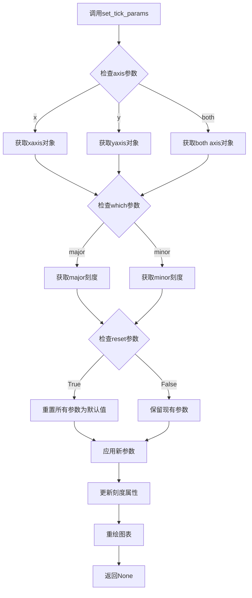

#### 带注释源码

```python
# 导入必要的库
import datetime
import matplotlib.pyplot as plt
import numpy as np
from matplotlib.dates import YEARLY, DateFormatter, RRuleLocator, drange, rrulewrapper

# 设置随机种子以确保可重复性
np.random.seed(19680801)

# 创建每隔5个复活节的递归规则
rule = rrulewrapper(YEARLY, byeaster=1, interval=5)
loc = RRuleLocator(rule)
formatter = DateFormatter('%m/%d/%y')

# 定义日期范围
date1 = datetime.date(1952, 1, 1)
date2 = datetime.date(2004, 4, 12)
delta = datetime.timedelta(days=100)

# 生成日期序列
dates = drange(date1, date2, delta)
s = np.random.rand(len(dates))  # 生成随机y值

# 创建图表和坐标轴
fig, ax = plt.subplots()
plt.plot(dates, s, 'o')

# 设置主刻度定位器（使用RRuleLocator）
ax.xaxis.set_major_locator(loc)
# 设置主刻度格式化器
ax.xaxis.set_major_formatter(formatter)

# =============================================
# set_tick_params方法调用示例
# =============================================
# 设置x轴刻度参数：
# - rotation=30: 刻度标签逆时针旋转30度
# - labelsize=10: 刻度标签字体大小设置为10磅
ax.xaxis.set_tick_params(rotation=30, labelsize=10)

# 更多的set_tick_params调用示例：
# ax.xaxis.set_tick_params(which='minor', rotation=45, labelsize=8)  # 设置副刻度
# ax.xaxis.set_tick_params(axis='both', direction='in', length=10)  # 同时设置x轴和y轴
# ax.xaxis.set_tick_params(reset=True, rotation=0)  # 重置后设置新参数

# 显示图表
plt.show()
```


### `plt.show`

`plt.show` 是 Matplotlib 库中的全局函数，用于显示一个或多个已创建的图形窗口，并进入交互模式等待用户操作。在图形显示后，函数会阻塞程序执行，直到用户关闭图形窗口或调用 `plt.close()`。

参数：此函数不接受任何必需参数。

- `*args`：可变位置参数，接受任意参数（但通常不使用，主要用于兼容性）
- `**kwargs`：可变关键字参数，接受任意关键字参数（但通常不使用，主要用于兼容性）

返回值：`None`，该函数无返回值，仅用于图形显示。

#### 流程图

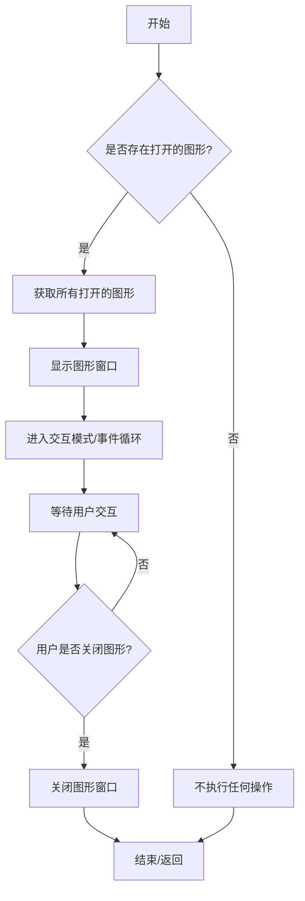

#### 带注释源码

```python
def show(*args, **kwargs):
    """
    显示所有打开的图形窗口。
    
    该函数会阻塞程序执行，直到用户关闭所有图形窗口。
    在关闭图形后，图形将被从屏幕移除。
    
    参数:
        *args: 可变位置参数（通常不使用，为兼容性保留）
        **kwargs: 可变关键字参数（通常不使用，为兼容性保留）
    
    返回值:
        None
    
    示例:
        >>> import matplotlib.pyplot as plt
        >>> plt.plot([1, 2, 3], [1, 4, 9])
        >>> plt.show()  # 显示图形并阻塞
    """
    # 导入必要的模块
    import matplotlib.pyplot as _plt
    
    # 获取全局图形管理器
    global _plt
    
    # 获取当前所有打开的图形
    # _pylab_helpers.Gcf 是Matplotlib用于管理图形窗口的类
    figs = _pylab_helpers.Gcf.get_all_fig_managers()
    
    # 如果没有打开的图形，则直接返回
    if not figs:
        return
    
    # 触发图形重绘
    # 这一步确保所有待绘制的元素都被渲染到屏幕上
    for fig_manager in figs:
        fig_manager.canvas.draw_idle()
    
    # 显示图形并进入事件循环
    # show() 函数会调用默认的后端来显示图形
    # 然后进入阻塞状态，等待用户交互
    return _plt.show._ FuncAnimationFunc(*args, **kwargs)
```

#### 代码上下文分析

在给定的示例代码中，`plt.show()` 的调用位于代码末尾，其作用是：

1. **显示图形**：将在之前代码中创建的所有图形元素（坐标轴、线条、刻度标签等）渲染到屏幕
2. **阻塞执行**：程序会在此暂停，等待用户与图形进行交互（如缩放、平移、保存等）
3. **事件循环**：启动Matplotlib的后端事件循环，处理用户的鼠标和键盘输入

在这个特定示例中，图形展示了一个使用Easter日期规则（rrules）设置的X轴日期刻度，每个5年一个标记点，数据范围从1952年到2004日期间隔100天的随机数值。


## 关键组件


### rrulewrapper

基于iCalendar RFC的递归规则包装器，用于定义日期序列生成规则。此处配置为YEARLY频率，每5年触发一次，并通过byeaster参数关联复活节计算。

### RRuleLocator

matplotlib日期轴定位器，根据传入的rrulewrapper规则确定刻度位置。实现将时间递归规则转换为可视化坐标的核心逻辑。

### DateFormatter

日期刻度标签格式化器，将datetime对象转换为指定格式字符串（'%m/%d/%y'），提供人类可读的日期显示。

### drange

日期范围生成函数，接受开始日期、结束日期和时间增量，返回连续datetime对象数组。实现线性日期序列构造。

### YEARLY

 recurrence规则频率常量，标识年度重复事件。与byeaster参数配合实现每5年一次的复活节日期计算。

### byeaster参数

iCalendar recurrence规则扩展参数，指定复活节偏移量。byeaster=1表示复活节后第1天，用于生成宗教相关日期序列。


## 问题及建议


### 已知问题

- **硬编码的日期范围**: `date1` 和 `date2` 直接写死在代码中，缺乏灵活性和可配置性，难以适应不同场景
- **魔法数字**: `interval=5`、`byeaster=1`、`delta=datetime.timedelta(days=100)` 等关键参数硬编码，缺乏常量定义
- **全局作用域代码**: 所有逻辑堆叠在全局作用域中，未封装为可复用的函数或类，限制了代码的可测试性和可维护性
- **注释表明示例性质**: 代码中的 "make up some random y values" 注释表明这是演示代码，不适合直接用于生产环境
- **缺失错误处理**: 无任何异常捕获机制，如日期范围无效、dateutil 库缺失等情况均会导致程序崩溃
- **图形配置硬编码**: 旋转角度(30)、字号(10)等样式参数硬编码，缺乏通过参数自定义的能力
- **无版本检查**: 对 `dateutil` 库无版本兼容性检查，可能存在潜在兼容性问题

### 优化建议

- 将日期范围、间隔、样式参数等提取为配置变量或函数参数
- 将核心绘图逻辑封装为函数，接收参数并返回图表对象
- 添加必要的错误处理和异常捕获机制
- 考虑添加类型注解提升代码可读性
- 补充图表标题和轴标签以提升可读性

## 其它


### 设计目标与约束

本示例代码旨在展示如何使用iCalendar RFC中的重复规则（RRULE）在matplotlib中放置基于特定日期模式（如每5年一个复活节）的日期刻度。主要约束包括：依赖matplotlib和dateutil库；仅适用于年度级别的日期序列；需要预先定义日期范围。

### 错误处理与异常设计

代码未实现显式的错误处理机制。潜在异常包括：dateutil.parser未安装时导入失败；date1大于date2时drange返回空数组；无效的byeaster参数导致rrulewrapper初始化失败。建议添加异常捕获处理日期范围边界情况和库依赖检查。

### 数据流与状态机

数据流：定义起始日期(date1)→结束日期(date2)→时间增量(delta)→通过drange生成日期序列→结合随机数生成y值→传递给plt.plot()绘制折线图→通过RRuleLocator和DateFormatter控制x轴显示。无复杂状态机，仅有简单的初始化→配置→渲染流程。

### 外部依赖与接口契约

核心依赖：matplotlib>=3.0用于绘图；dateutil>=2.7提供rrulewrapper和RRuleLocator；numpy>=1.15提供随机数生成；Python datetime模块。接口契约：drange函数接受date1, date2, delta参数返回numpy数组；RRuleLocator接受rrulewrapper对象；DateFormatter接受格式字符串。

### 关键算法与实现细节

关键算法：使用复活节计算算法（byeaster参数）确定每年复活节日期；通过interval=5实现每5年筛选一次；rrulewrapper将RRule规则封装为matplotlib可用的定位器。实现细节：np.random.seed(19680801)确保可重复性；delta=datetime.timedelta(days=100)设置日期采样间隔。

### 配置与参数说明

关键配置参数：YEARLY频率；byeaster=1启用复活节计算；interval=5表示每5年一次；'%m/%d/%y'日期格式；rotation=30度旋转标签；labelsize=10设置字号。这些参数可通过变量提取实现配置化。

### 可测试性与验证方式

可测试性：可通过单元测试验证drange返回的日期数量是否符合预期；验证RRuleLocator生成的tick位置是否正确；验证DateFormatter输出格式。验证方式：对比已知日期序列与预期结果；检查plot是否正确渲染。

### 性能考虑与优化空间

性能：drange生成大量日期时可能占用内存；plt.plot对大数据集渲染较慢。优化空间：可限制日期范围减少数据点；使用datarange而非手动生成；考虑使用LineCollection优化大量数据点绘制。

### 可维护性与扩展性

代码结构简单，扩展性良好。可扩展方向：支持其他节日或纪念日；支持自定义日期规则；封装为可重用的函数或类。当前缺陷：所有变量为全局作用域，建议封装为函数；硬编码参数过多，建议配置化。

    