# `matplotlib\galleries\examples\ticks\date_formatters_locators.py` 详细设计文档

This code provides an example of using various date locators and formatters in matplotlib for plotting date-time data.

## 整体流程

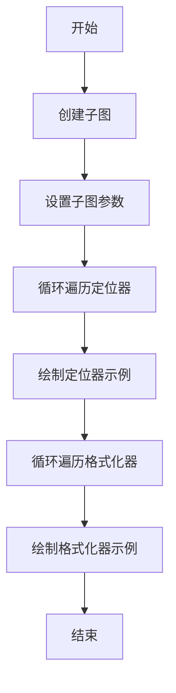

## 类结构

```
matplotlib.pyplot (主模块)
├── plot_axis (函数)
│   ├── ax (参数)
│   ├── locator (参数)
│   ├── xmax (参数)
│   ├── fmt (参数)
│   ├── formatter (参数)
│   └── ...
└── ... 
```

## 全局变量及字段


### `locators`
    
List of locators with their corresponding xmax and fmt.

类型：`list`
    


### `formatters`
    
List of formatters.

类型：`list`
    


### `fig`
    
Figure object created by matplotlib for plotting.

类型：`matplotlib.figure.Figure`
    


### `axs`
    
List of axes objects for plotting.

类型：`list of matplotlib.axes._subplots.AxesSubplot`
    


### `xmax`
    
Maximum x-axis value for the plot.

类型：`str`
    


### `fmt`
    
Formatting string for the x-axis date labels.

类型：`str`
    


### `formatter`
    
Formatter string for the x-axis date labels.

类型：`str`
    


### `matplotlib.pyplot`
    
Module for creating plots.

类型：`module`
    


### `matplotlib.ticker`
    
Module for tickers in matplotlib.

类型：`module`
    


### `matplotlib.dates`
    
Module for date handling in matplotlib.

类型：`module`
    


### `matplotlib.dates.AutoDateLocator.AutoDateLocator`
    
Automatically determines the best locator for the date range.

类型：`matplotlib.dates.AutoDateLocator`
    


### `matplotlib.dates.YearLocator.YearLocator`
    
Locates years on the x-axis.

类型：`matplotlib.dates.YearLocator`
    


### `matplotlib.dates.MonthLocator.MonthLocator`
    
Locates months on the x-axis.

类型：`matplotlib.dates.MonthLocator`
    


### `matplotlib.dates.DayLocator.DayLocator`
    
Locates days on the x-axis.

类型：`matplotlib.dates.DayLocator`
    


### `matplotlib.dates.WeekdayLocator.WeekdayLocator`
    
Locates weekdays on the x-axis.

类型：`matplotlib.dates.WeekdayLocator`
    


### `matplotlib.dates.HourLocator.HourLocator`
    
Locates hours on the x-axis.

类型：`matplotlib.dates.HourLocator`
    


### `matplotlib.dates.MinuteLocator.MinuteLocator`
    
Locates minutes on the x-axis.

类型：`matplotlib.dates.MinuteLocator`
    


### `matplotlib.dates.SecondLocator.SecondLocator`
    
Locates seconds on the x-axis.

类型：`matplotlib.dates.SecondLocator`
    


### `matplotlib.dates.MicrosecondLocator.MicrosecondLocator`
    
Locates microseconds on the x-axis.

类型：`matplotlib.dates.MicrosecondLocator`
    


### `matplotlib.dates.RRuleLocator.RRuleLocator`
    
Locates dates based on a recurrence rule.

类型：`matplotlib.dates.RRuleLocator`
    


### `matplotlib.dates.DateFormatter.DateFormatter`
    
Formats dates on the x-axis.

类型：`matplotlib.dates.DateFormatter`
    


### `matplotlib.dates.AutoDateFormatter.AutoDateFormatter`
    
Automatically determines the best formatter for the date range.

类型：`matplotlib.dates.AutoDateFormatter`
    


### `matplotlib.dates.ConciseDateFormatter.ConciseDateFormatter`
    
Formats dates in a concise manner on the x-axis.

类型：`matplotlib.dates.ConciseDateFormatter`
    
    

## 全局函数及方法


### plot_axis

Set up common parameters for the Axes in the example.

参数：

- `ax`：`matplotlib.axes.Axes`，The Axes instance to configure.
- `locator`：`str`，The locator to use for the x-axis. It should be a string representation of a locator class from matplotlib.dates.
- `xmax`：`str`，The maximum x-axis value. It should be a datetime string.
- `fmt`：`str`，The format string to use for the x-axis date formatter.
- `formatter`：`str`，The formatter to use for the x-axis. It should be a string representation of a formatter class from matplotlib.dates.

返回值：`None`，This function does not return a value.

#### 流程图


#### 带注释源码

```python
def plot_axis(ax, locator=None, xmax='2002-02-01', fmt=None, formatter=None):
    """Set up common parameters for the Axes in the example."""
    ax.spines[['left', 'right', 'top']].set_visible(False)
    # Set y-axis visibility
    ax.yaxis.set_major_locator(ticker.NullLocator())
    # Set major tick parameters
    ax.tick_params(which='major', width=1.00, length=5)
    # Set minor tick parameters
    ax.tick_params(which='minor', width=0.75, length=2.5)
    # Set x-axis limits
    ax.set_xlim(np.datetime64('2000-02-01'), np.datetime64(xmax))
    # Check if a locator is provided
    if locator:
        ax.xaxis.set_major_locator(eval(locator))
        ax.xaxis.set_major_formatter(DateFormatter(fmt))
    else:
        ax.xaxis.set_major_formatter(eval(formatter))
    # Set text on the axis
    ax.text(0.0, 0.2, locator or formatter, transform=ax.transAxes,
            fontsize=14, fontname='Monospace', color='tab:blue')
```


### plot_axis

Set up common parameters for the Axes in the example.

参数：

- `ax`：`matplotlib.axes.Axes`，The Axes instance to configure.
- `locator`：`str`，The locator to use for the x-axis. It should be a string representation of a locator class from matplotlib.dates.
- `xmax`：`str`，The maximum x-axis value. It should be a datetime string.
- `fmt`：`str`，The format string to use for the x-axis date formatter.
- `formatter`：`str`，The formatter to use for the x-axis. It should be a string representation of a formatter class from matplotlib.dates.

返回值：`None`，This function does not return a value.

#### 流程图


#### 带注释源码

```python
def plot_axis(ax, locator=None, xmax='2002-02-01', fmt=None, formatter=None):
    """Set up common parameters for the Axes in the example."""
    ax.spines[['left', 'right', 'top']].set_visible(False)
    ax.yaxis.set_major_locator(ticker.NullLocator())
    ax.tick_params(which='major', width=1.00, length=5)
    ax.tick_params(which='minor', width=0.75, length=2.5)
    ax.set_xlim(np.datetime64('2000-02-01'), np.datetime64(xmax))
    if locator:
        ax.xaxis.set_major_locator(eval(locator))
        ax.xaxis.set_major_formatter(DateFormatter(fmt))
    else:
        ax.xaxis.set_major_formatter(eval(formatter))
    ax.text(0.0, 0.2, locator or formatter, transform=ax.transAxes,
            fontsize=14, fontname='Monospace', color='tab:blue')
```


### plot_axis

Set up common parameters for the Axes in the example.

参数：

- `ax`：`matplotlib.axes.Axes`，The Axes instance to configure.
- `locator`：`str`，The locator to use for the x-axis. It should be a string representation of a locator class from matplotlib.dates.
- `xmax`：`str`，The maximum x-axis value. It should be a datetime string.
- `fmt`：`str`，The format string to use for the x-axis date formatter.
- `formatter`：`str`，The formatter to use for the x-axis. It should be a string representation of a formatter class from matplotlib.dates.

返回值：`None`，This function does not return a value.

#### 流程图

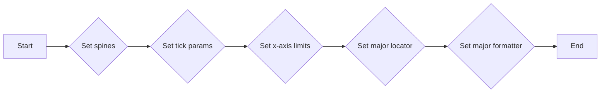

#### 带注释源码

```python
def plot_axis(ax, locator=None, xmax='2002-02-01', fmt=None, formatter=None):
    """Set up common parameters for the Axes in the example."""
    ax.spines[['left', 'right', 'top']].set_visible(False)
    ax.yaxis.set_major_locator(ticker.NullLocator())
    ax.tick_params(which='major', width=1.00, length=5)
    ax.tick_params(which='minor', width=0.75, length=2.5)
    ax.set_xlim(np.datetime64('2000-02-01'), np.datetime64(xmax))
    if locator:
        ax.xaxis.set_major_locator(eval(locator))
        ax.xaxis.set_major_formatter(DateFormatter(fmt))
    else:
        ax.xaxis.set_major_formatter(eval(formatter))
    ax.text(0.0, 0.2, locator or formatter, transform=ax.transAxes,
            fontsize=14, fontname='Monospace', color='tab:blue')
```


### plot_axis

Set up common parameters for the Axes in the example.

参数：

- `ax`：`matplotlib.axes.Axes`，The Axes instance to configure.
- `locator`：`str`，The locator to use for the x-axis. It should be a string representation of a locator class from matplotlib.dates.
- `xmax`：`str`，The maximum x-axis value. It should be a datetime string.
- `fmt`：`str`，The format string to use for the x-axis date formatter.
- `formatter`：`str`，The formatter to use for the x-axis. It should be a string representation of a formatter class from matplotlib.dates.

返回值：`None`，This function does not return a value.

#### 流程图

```mermaid
graph LR
A[Start] --> B{Check if locator is None?}
B -- Yes --> C[Set x-axis formatter to eval(formatter)]
B -- No --> D[Set x-axis locator to eval(locator)]
D --> E[Set x-axis formatter to DateFormatter(fmt)]
E --> F[Set x-axis limits to (np.datetime64('2000-02-01'), np.datetime64(xmax))]
F --> G[Set spines and tick parameters]
G --> H[End]
```

#### 带注释源码

```python
def plot_axis(ax, locator=None, xmax='2002-02-01', fmt=None, formatter=None):
    """Set up common parameters for the Axes in the example."""
    ax.spines[['left', 'right', 'top']].set_visible(False)
    ax.tick_params(which='major', width=1.00, length=5)
    ax.tick_params(which='minor', width=0.75, length=2.5)
    ax.set_xlim(np.datetime64('2000-02-01'), np.datetime64(xmax))
    if locator:
        ax.xaxis.set_major_locator(eval(locator))
        ax.xaxis.set_major_formatter(DateFormatter(fmt))
    else:
        ax.xaxis.set_major_formatter(eval(formatter))
    ax.text(0.0, 0.2, locator or formatter, transform=ax.transAxes,
            fontsize=14, fontname='Monospace', color='tab:blue')
```


### plot_axis

Set up common parameters for the Axes in the example.

参数：

- `ax`：`matplotlib.axes.Axes`，The Axes instance to configure.
- `locator`：`str`，The locator to use for the x-axis. It should be a string representation of a locator class from matplotlib.dates.
- `xmax`：`str`，The maximum x-axis value. It should be a datetime string.
- `fmt`：`str`，The format string to use for the x-axis date formatter.
- `formatter`：`str`，The formatter to use for the x-axis. It should be a string representation of a formatter class from matplotlib.dates.

返回值：`None`，This function does not return a value.

#### 流程图


#### 带注释源码

```python
def plot_axis(ax, locator=None, xmax='2002-02-01', fmt=None, formatter=None):
    """Set up common parameters for the Axes in the example."""
    ax.spines[['left', 'right', 'top']].set_visible(False)
    ax.yaxis.set_major_locator(ticker.NullLocator())
    ax.tick_params(which='major', width=1.00, length=5)
    ax.tick_params(which='minor', width=0.75, length=2.5)
    ax.set_xlim(np.datetime64('2000-02-01'), np.datetime64(xmax))
    if locator:
        ax.xaxis.set_major_locator(eval(locator))
        ax.xaxis.set_major_formatter(DateFormatter(fmt))
    else:
        ax.xaxis.set_major_formatter(eval(formatter))
    ax.text(0.0, 0.2, locator or formatter, transform=ax.transAxes,
            fontsize=14, fontname='Monospace', color='tab:blue')
```


### plot_axis

Set up common parameters for the Axes in the example.

参数：

- `ax`：`matplotlib.axes.Axes`，The Axes instance to configure.
- `locator`：`str`，The locator to use for the x-axis. It should be a string representation of a locator class from `matplotlib.dates`.
- `xmax`：`str`，The maximum x-axis value. It should be a datetime string.
- `fmt`：`str`，The format string to use for the x-axis date formatter.
- `formatter`：`str`，The formatter to use for the x-axis. It should be a string representation of a formatter class from `matplotlib.dates`.

返回值：`None`，This function does not return a value.

#### 流程图


#### 带注释源码

```python
def plot_axis(ax, locator=None, xmax='2002-02-01', fmt=None, formatter=None):
    """Set up common parameters for the Axes in the example."""
    ax.spines[['left', 'right', 'top']].set_visible(False)
    ax.yaxis.set_major_locator(ticker.NullLocator())
    ax.tick_params(which='major', width=1.00, length=5)
    ax.tick_params(which='minor', width=0.75, length=2.5)
    ax.set_xlim(np.datetime64('2000-02-01'), np.datetime64(xmax))
    if locator:
        ax.xaxis.set_major_locator(eval(locator))
        ax.xaxis.set_major_formatter(DateFormatter(fmt))
    else:
        ax.xaxis.set_major_formatter(eval(formatter))
    ax.text(0.0, 0.2, locator or formatter, transform=ax.transAxes,
            fontsize=14, fontname='Monospace', color='tab:blue')
```


### plt.subplots

创建一个子图或子图网格。

#### 描述

`subplots` 函数用于创建一个子图或子图网格，并返回一个 `Figure` 对象和一个或多个 `Axes` 对象。`Figure` 对象是整个图形的容器，而 `Axes` 对象是图形中的单个轴。

#### 参数

- `nrows`：整数，指定子图网格的行数。
- `ncols`：整数，指定子图网格的列数。
- `sharex`：布尔值，如果为 `True`，则所有子图共享 x 轴。
- `sharey`：布尔值，如果为 `True`，则所有子图共享 y 轴。
- `figsize`：元组，指定图形的大小（宽度和高度）。
- `dpi`：整数，指定图形的分辨率（每英寸点数）。
- `gridspec_kw`：字典，用于指定 `GridSpec` 的关键字参数。

#### 返回值

- `fig`：`Figure` 对象，包含所有子图。
- `axes`：`Axes` 对象数组，包含每个子图。

#### 流程图

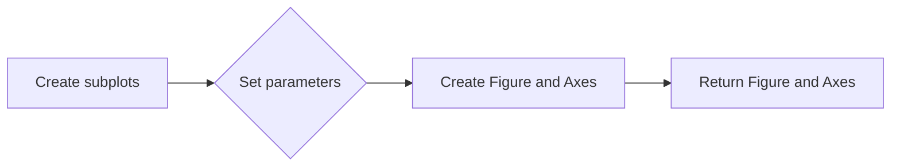

#### 带注释源码

```python
import matplotlib.pyplot as plt

fig, axs = plt.subplots(nrows=2, ncols=2, figsize=(10, 8))
```


### plot_axis

Set up common parameters for the Axes in the example.

参数：

- `ax`：`matplotlib.axes.Axes`，The Axes instance to configure.
- `locator`：`str`，The locator to use for the x-axis. It should be a string representation of a locator class from `matplotlib.dates`.
- `xmax`：`str`，The maximum x-axis value. It should be a datetime string.
- `fmt`：`str`，The format string to use for the x-axis date formatter.
- `formatter`：`str`，The formatter to use for the x-axis. It should be a string representation of a formatter class from `matplotlib.dates`.

返回值：`None`，This function does not return a value.

#### 流程图

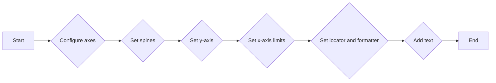

#### 带注释源码

```python
def plot_axis(ax, locator=None, xmax='2002-02-01', fmt=None, formatter=None):
    """Set up common parameters for the Axes in the example."""
    ax.spines[['left', 'right', 'top']].set_visible(False)
    ax.yaxis.set_major_locator(ticker.NullLocator())
    ax.tick_params(which='major', width=1.00, length=5)
    ax.tick_params(which='minor', width=0.75, length=2.5)
    ax.set_xlim(np.datetime64('2000-02-01'), np.datetime64(xmax))
    if locator:
        ax.xaxis.set_major_locator(eval(locator))
        ax.xaxis.set_major_formatter(DateFormatter(fmt))
    else:
        ax.xaxis.set_major_formatter(eval(formatter))
    ax.text(0.0, 0.2, locator or formatter, transform=ax.transAxes,
            fontsize=14, fontname='Monospace', color='tab:blue')
```


### plot_axis

Set up common parameters for the Axes in the example.

参数：

- `ax`：`matplotlib.axes.Axes`，The Axes instance to configure.
- `locator`：`str`，The locator to use for the x-axis. It should be a string representation of a locator class from `matplotlib.dates`.
- `xmax`：`str`，The maximum x-axis value. It should be a datetime string.
- `fmt`：`str`，The format string to use for the x-axis date formatter.
- `formatter`：`str`，The formatter to use for the x-axis. It should be a string representation of a formatter class from `matplotlib.dates`.

返回值：`None`，This function does not return a value.

#### 流程图

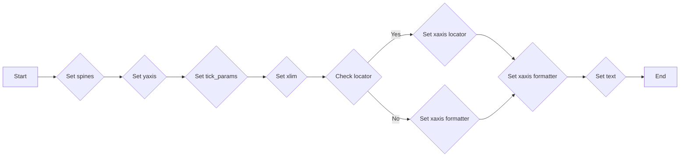

#### 带注释源码

```python
def plot_axis(ax, locator=None, xmax='2002-02-01', fmt=None, formatter=None):
    """Set up common parameters for the Axes in the example."""
    ax.spines[['left', 'right', 'top']].set_visible(False)
    ax.yaxis.set_major_locator(ticker.NullLocator())
    ax.tick_params(which='major', width=1.00, length=5)
    ax.tick_params(which='minor', width=0.75, length=2.5)
    ax.set_xlim(np.datetime64('2000-02-01'), np.datetime64(xmax))
    if locator:
        ax.xaxis.set_major_locator(eval(locator))
        ax.xaxis.set_major_formatter(DateFormatter(fmt))
    else:
        ax.xaxis.set_major_formatter(eval(formatter))
    ax.text(0.0, 0.2, locator or formatter, transform=ax.transAxes,
            fontsize=14, fontname='Monospace', color='tab:blue')
```


### plot_axis

Set up common parameters for the Axes in the example.

参数：

- `ax`：`matplotlib.axes.Axes`，The Axes instance to configure.
- `locator`：`str`，The locator to use for the x-axis. It should be a string representation of a locator class from matplotlib.dates.
- `xmax`：`str`，The maximum x-axis value. It should be a datetime string.
- `fmt`：`str`，The format string to use for the x-axis date formatter.
- `formatter`：`str`，The formatter to use for the x-axis. It should be a string representation of a formatter class from matplotlib.dates.

返回值：`None`，This function does not return a value.

#### 流程图

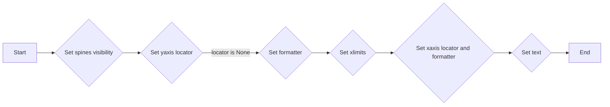

#### 带注释源码

```python
def plot_axis(ax, locator=None, xmax='2002-02-01', fmt=None, formatter=None):
    ax.spines[['left', 'right', 'top']].set_visible(False)
    ax.yaxis.set_major_locator(ticker.NullLocator())
    ax.tick_params(which='major', width=1.00, length=5)
    ax.tick_params(which='minor', width=0.75, length=2.5)
    ax.set_xlim(np.datetime64('2000-02-01'), np.datetime64(xmax))
    if locator:
        ax.xaxis.set_major_locator(eval(locator))
        ax.xaxis.set_major_formatter(DateFormatter(fmt))
    else:
        ax.xaxis.set_major_formatter(eval(formatter))
    ax.text(0.0, 0.2, locator or formatter, transform=ax.transAxes,
            fontsize=14, fontname='Monospace', color='tab:blue')
```


### plot_axis

Set up common parameters for the Axes in the example.

参数：

- `ax`：`matplotlib.axes.Axes`，The Axes instance to configure.
- `locator`：`str`，The locator to use for the x-axis. It should be a string representation of a locator class from matplotlib.dates.
- `xmax`：`str`，The maximum x-axis value. It should be a datetime string.
- `fmt`：`str`，The format string to use for the x-axis date formatter.
- `formatter`：`str`，The formatter to use for the x-axis. It should be a string representation of a formatter class from matplotlib.dates.

返回值：`None`，This function does not return any value.

#### 流程图

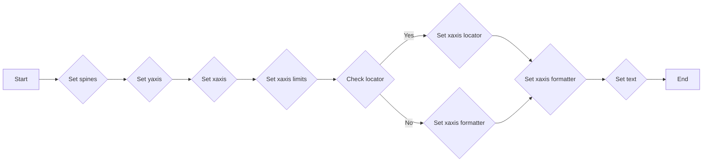

#### 带注释源码

```python
def plot_axis(ax, locator=None, xmax='2002-02-01', fmt=None, formatter=None):
    """Set up common parameters for the Axes in the example."""
    ax.spines[['left', 'right', 'top']].set_visible(False)
    ax.yaxis.set_major_locator(ticker.NullLocator())
    ax.tick_params(which='major', width=1.00, length=5)
    ax.tick_params(which='minor', width=0.75, length=2.5)
    ax.set_xlim(np.datetime64('2000-02-01'), np.datetime64(xmax))
    if locator:
        ax.xaxis.set_major_locator(eval(locator))
        ax.xaxis.set_major_formatter(DateFormatter(fmt))
    else:
        ax.xaxis.set_major_formatter(eval(formatter))
    ax.text(0.0, 0.2, locator or formatter, transform=ax.transAxes,
            fontsize=14, fontname='Monospace', color='tab:blue')
```


### plot_axis

Set up common parameters for the Axes in the example.

参数：

- ax：`matplotlib.axes.Axes`，The Axes instance to configure.
- locator：`str`，The locator to use for the x-axis. It should be a string representation of a locator class from matplotlib.dates.
- xmax：`str`，The maximum x-axis limit. It should be a datetime string.
- fmt：`str`，The format string to use for the x-axis date formatter.
- formatter：`str`，The formatter to use for the x-axis. It should be a string representation of a formatter class from matplotlib.dates.

返回值：`None`，This function does not return any value.

#### 流程图

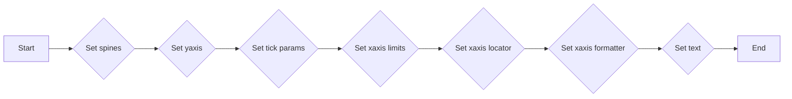

#### 带注释源码

```python
def plot_axis(ax, locator=None, xmax='2002-02-01', fmt=None, formatter=None):
    """Set up common parameters for the Axes in the example."""
    ax.spines[['left', 'right', 'top']].set_visible(False)
    ax.yaxis.set_major_locator(ticker.NullLocator())
    ax.tick_params(which='major', width=1.00, length=5)
    ax.tick_params(which='minor', width=0.75, length=2.5)
    ax.set_xlim(np.datetime64('2000-02-01'), np.datetime64(xmax))
    if locator:
        ax.xaxis.set_major_locator(eval(locator))
        ax.xaxis.set_major_formatter(DateFormatter(fmt))
    else:
        ax.xaxis.set_major_formatter(eval(formatter))
    ax.text(0.0, 0.2, locator or formatter, transform=ax.transAxes,
            fontsize=14, fontname='Monospace', color='tab:blue')
```


### plot_axis

Set up common parameters for the Axes in the example.

参数：

- `ax`：`matplotlib.axes.Axes`，The Axes instance to configure.
- `locator`：`str`，The locator to use for the x-axis. It should be a string representation of a locator class from matplotlib.dates.
- `xmax`：`str`，The maximum x-axis value. It should be a datetime string.
- `fmt`：`str`，The format string to use for the x-axis date formatter.
- `formatter`：`str`，The formatter to use for the x-axis. It should be a string representation of a formatter class from matplotlib.dates.

返回值：`None`，This function does not return a value.

#### 流程图


#### 带注释源码

```python
def plot_axis(ax, locator=None, xmax='2002-02-01', fmt=None, formatter=None):
    """Set up common parameters for the Axes in the example."""
    ax.spines[['left', 'right', 'top']].set_visible(False)
    ax.yaxis.set_major_locator(ticker.NullLocator())
    ax.tick_params(which='major', width=1.00, length=5)
    ax.tick_params(which='minor', width=0.75, length=2.5)
    ax.set_xlim(np.datetime64('2000-02-01'), np.datetime64(xmax))
    if locator:
        ax.xaxis.set_major_locator(eval(locator))
        ax.xaxis.set_major_formatter(DateFormatter(fmt))
    else:
        ax.xaxis.set_major_formatter(eval(formatter))
    ax.text(0.0, 0.2, locator or formatter, transform=ax.transAxes,
            fontsize=14, fontname='Monospace', color='tab:blue')
```


### matplotlib.ticker.set_major_locator

设置轴的主刻度定位器。

参数：

- `ax`：`matplotlib.axes.Axes`，轴对象。
- `locator`：`matplotlib.ticker.Locator` 或 `str`，定位器对象或定位器名称的字符串。

返回值：`None`

#### 流程图

```mermaid
graph LR
A[开始] --> B{传入参数}
B --> C{判断 locator 类型}
C -- 是字符串 --> D[eval(locator)}
C -- 否 --> D[ax.xaxis.set_major_locator(locator)]
D --> E[设置定位器]
E --> F[结束]
```

#### 带注释源码

```python
def set_major_locator(self, locator):
    """
    Set the major locator for the axis.

    Parameters
    ----------
    locator : matplotlib.ticker.Locator or str
        The locator object or a string that represents the locator name.

    Returns
    -------
    None
    """
    if isinstance(locator, str):
        locator = eval(locator)
    self.set_major_locator(locator)
```


### matplotlib.ticker.set_major_formatter

`matplotlib.ticker.set_major_formatter` 是一个用于设置轴的主刻度格式化器的函数。

参数：

- `formatter`：`matplotlib.ticker.Formatter`，用于格式化轴的主刻度的对象。

返回值：无

#### 流程图

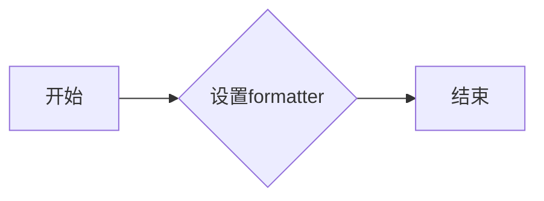

#### 带注释源码

```python
def set_major_formatter(self, formatter):
    """
    Set the formatter for the major ticks on the axis.

    Parameters
    ----------
    formatter : matplotlib.ticker.Formatter
        The formatter to use for the major ticks.

    Returns
    -------
    None
    """
    self._major_formatter = formatter
    self._update_ticks()
```


### plot_axis

Set up common parameters for the Axes in the example.

参数：

- `ax`：`matplotlib.axes.Axes`，The Axes instance to configure.
- `locator`：`str`，The locator to use for the x-axis. It should be a string representation of a locator class from `matplotlib.ticker`.
- `xmax`：`str`，The maximum x-axis value. It should be a datetime string.
- `fmt`：`str`，The format string to use for the x-axis date formatter.
- `formatter`：`str`，The formatter to use for the x-axis. It should be a string representation of a formatter class from `matplotlib.dates`.

返回值：`None`，This function does not return a value.

#### 流程图

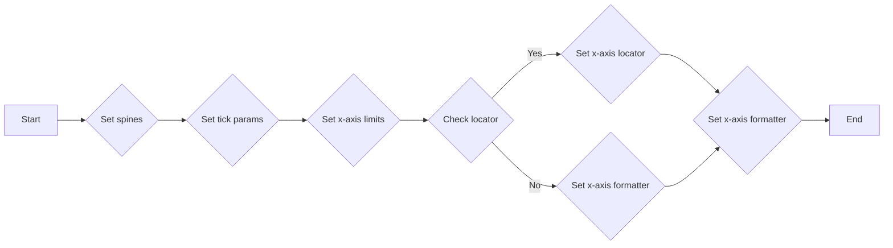

#### 带注释源码

```python
def plot_axis(ax, locator=None, xmax='2002-02-01', fmt=None, formatter=None):
    """Set up common parameters for the Axes in the example."""
    ax.spines[['left', 'right', 'top']].set_visible(False)
    ax.yaxis.set_major_locator(ticker.NullLocator())
    ax.tick_params(which='major', width=1.00, length=5)
    ax.tick_params(which='minor', width=0.75, length=2.5)
    ax.set_xlim(np.datetime64('2000-02-01'), np.datetime64(xmax))
    if locator:
        ax.xaxis.set_major_locator(eval(locator))
        ax.xaxis.set_major_formatter(DateFormatter(fmt))
    else:
        ax.xaxis.set_major_formatter(eval(formatter))
    ax.text(0.0, 0.2, locator or formatter, transform=ax.transAxes,
            fontsize=14, fontname='Monospace', color='tab:blue')
```


### matplotlib.dates.AutoDateFormatter

AutoDateFormatter 是一个用于自动选择日期格式器的类，它根据传入的日期定位器自动选择合适的日期格式。

参数：

- `locator`：`matplotlib.dates.DateLocator` 对象，用于确定日期的定位器。

返回值：`matplotlib.dates.ConciseDateFormatter` 对象，返回一个简洁的日期格式器。

#### 流程图

```mermaid
graph LR
A[AutoDateFormatter(locator)] --> B{选择格式}
B --> C[ConciseDateFormatter]
```

#### 带注释源码

```python
from matplotlib.dates import ConciseDateFormatter

class AutoDateFormatter:
    def __init__(self, locator):
        self.locator = locator

    def __call__(self):
        return ConciseDateFormatter(self.locator)
```


### ConciseDateFormatter

`ConciseDateFormatter` 是一个用于格式化日期的类，它根据日期定位器的类型自动选择合适的日期格式。

参数：

- `locator`：`matplotlib.dates.DateLocator`，指定日期定位器，用于确定日期的精度。

返回值：`str`，格式化后的日期字符串。

#### 流程图

```mermaid
graph LR
A[ConciseDateFormatter(locator)] --> B{日期定位器类型}
B -->|年| C[格式化: YYYY]
B -->|月| C[格式化: YYYY-MM]
B -->|日| C[格式化: YYYY-MM-DD]
B -->|小时| C[格式化: YYYY-MM-DD HH]
B -->|分钟| C[格式化: YYYY-MM-DD HH:mm]
B -->|秒| C[格式化: YYYY-MM-DD HH:mm:ss]
B -->|微秒| C[格式化: YYYY-MM-DD HH:mm:ss.sss]
```

#### 带注释源码

```python
from matplotlib.dates import ConciseDateFormatter

def ConciseDateFormatter(locator):
    # 根据日期定位器类型选择合适的日期格式
    if isinstance(locator, YearLocator):
        return '%Y'
    elif isinstance(locator, MonthLocator):
        return '%Y-%m'
    elif isinstance(locator, DayLocator):
        return '%Y-%m-%d'
    elif isinstance(locator, HourLocator):
        return '%Y-%m-%d %H'
    elif isinstance(locator, MinuteLocator):
        return '%Y-%m-%d %H:%M'
    elif isinstance(locator, SecondLocator):
        return '%Y-%m-%d %H:%M:%S'
    elif isinstance(locator, MicrosecondLocator):
        return '%Y-%m-%d %H:%M:%S.%f'
    else:
        raise ValueError("Unsupported locator type")
```


### DateFormatter

`DateFormatter` 是一个用于格式化日期的函数，它将日期对象转换为字符串。

参数：

- `date`: `datetime.datetime` 或 `numpy.datetime64`，表示要格式化的日期。
- `format`: `str`，表示日期的格式字符串。

返回值：`str`，格式化后的日期字符串。

#### 流程图

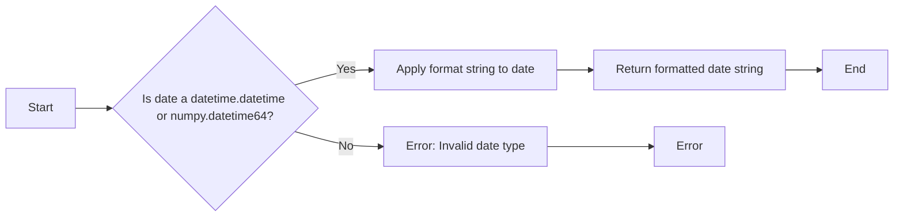

#### 带注释源码

```python
from matplotlib.dates import DateFormatter

def DateFormatter(date, format):
    # Check if the date is a datetime.datetime or numpy.datetime64
    if isinstance(date, (datetime.datetime, numpy.datetime64)):
        # Apply format string to date
        formatted_date = date.strftime(format)
        return formatted_date
    else:
        # Error: Invalid date type
        raise ValueError("Invalid date type. Expected datetime.datetime or numpy.datetime64.")
```


### plot_axis

Set up common parameters for the Axes in the example.

参数：

- `ax`：`matplotlib.axes.Axes`，The Axes instance to configure.
- `locator`：`str`，The locator to use for the x-axis. It should be a string representation of a locator class from `matplotlib.dates`.
- `xmax`：`str`，The maximum x-axis value. It should be a datetime string.
- `fmt`：`str`，The format string to use for the x-axis date formatter.
- `formatter`：`str`，The formatter to use for the x-axis. It should be a string representation of a formatter class from `matplotlib.dates`.

返回值：`None`，This function does not return a value.

#### 流程图

```mermaid
graph LR
A[Start] --> B{Set spines}
B --> C{Set yaxis}
C --> D{Set tick_params}
D --> E{Set xlim}
E --> F{Check locator}
F -- Yes --> G{Set xaxis locator}
F -- No --> H{Set xaxis formatter}
G --> I{Set formatter}
H --> I
I --> J[End]
```

#### 带注释源码

```python
def plot_axis(ax, locator=None, xmax='2002-02-01', fmt=None, formatter=None):
    """Set up common parameters for the Axes in the example."""
    ax.spines[['left', 'right', 'top']].set_visible(False)
    ax.yaxis.set_major_locator(ticker.NullLocator())
    ax.tick_params(which='major', width=1.00, length=5)
    ax.tick_params(which='minor', width=0.75, length=2.5)
    ax.set_xlim(np.datetime64('2000-02-01'), np.datetime64(xmax))
    if locator:
        ax.xaxis.set_major_locator(eval(locator))
        ax.xaxis.set_major_formatter(DateFormatter(fmt))
    else:
        ax.xaxis.set_major_formatter(eval(formatter))
    ax.text(0.0, 0.2, locator or formatter, transform=ax.transAxes,
            fontsize=14, fontname='Monospace', color='tab:blue')
```


## 关键组件


### 张量索引与惰性加载

张量索引与惰性加载是用于高效处理大型数据集的关键组件，它允许在需要时才计算数据，从而减少内存消耗和提高性能。

### 反量化支持

反量化支持是针对量化模型进行优化的一部分，它允许模型在量化后仍然能够保持较高的精度和性能。

### 量化策略

量化策略是用于将浮点数模型转换为低精度整数模型的过程，它包括选择合适的量化位宽和量化方法，以平衡模型精度和计算效率。

## 问题及建议


### 已知问题

-   **代码重复**: `plot_axis` 函数被重复调用多次，每次调用时传递不同的参数。这可能导致维护困难，因为任何对 `plot_axis` 函数的更改都需要在多个地方进行。
-   **硬编码日期**: 代码中硬编码了多个日期，如 `'2000-02-01'` 和 `'2003-02-01'`。如果需要更改日期范围，需要在多个地方进行修改。
-   **全局变量**: 代码中使用了全局变量，如 `locators` 和 `formatters`。这可能导致代码难以理解和维护，尤其是在大型项目中。

### 优化建议

-   **使用函数参数**: 将日期范围和格式作为参数传递给 `plot_axis` 函数，以减少代码重复并提高灵活性。
-   **使用配置文件**: 将日期范围和格式存储在配置文件中，以便在需要时轻松更改，而不是在代码中硬编码。
-   **模块化**: 将相关的代码组织到模块中，以提高代码的可读性和可维护性。
-   **使用类**: 考虑使用类来封装与日期相关的逻辑，以便更好地组织代码并提高可重用性。
-   **异常处理**: 在代码中添加异常处理，以处理可能出现的错误，例如无效的日期格式或日期范围。
-   **文档**: 为代码添加详细的文档，以便其他开发者更容易理解和使用代码。


## 其它


### 设计目标与约束

- 设计目标：
  - 提供一个灵活的日期定位器和格式化工具，以支持不同时间尺度的数据可视化。
  - 确保代码的可读性和可维护性。
  - 支持多种日期格式和定位器，以适应不同的可视化需求。

- 约束条件：
  - 代码必须与matplotlib库兼容。
  - 代码应尽可能高效，以处理大量数据。
  - 代码应易于扩展，以支持未来可能的日期定位器和格式化功能。

### 错误处理与异常设计

- 错误处理：
  - 对于无效的日期格式或定位器参数，应抛出异常。
  - 对于matplotlib库中可能出现的错误，应捕获异常并给出清晰的错误信息。

- 异常设计：
  - 定义自定义异常类，以处理特定的错误情况。
  - 使用try-except块来捕获和处理异常。

### 数据流与状态机

- 数据流：
  - 用户输入日期范围和定位器/格式化参数。
  - 代码根据输入参数设置matplotlib轴的日期定位器和格式化器。
  - 代码绘制日期数据。

- 状态机：
  - 无状态机，代码按顺序执行。

### 外部依赖与接口契约

- 外部依赖：
  - matplotlib库。
  - numpy库。

- 接口契约：
  - `plot_axis`函数接受matplotlib轴对象、定位器字符串、最大x轴值、格式化字符串和格式化器函数作为参数。
  - `plot_axis`函数返回无值。
  - `plot_axis`函数确保轴的日期定位器和格式化器正确设置。


    