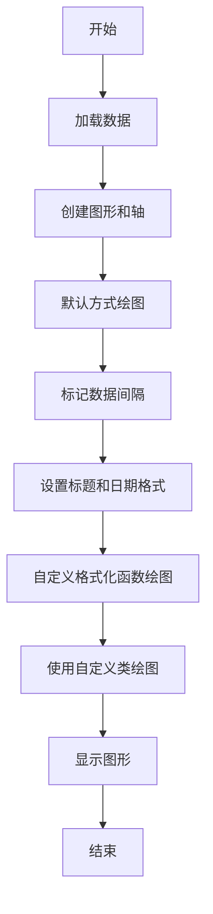
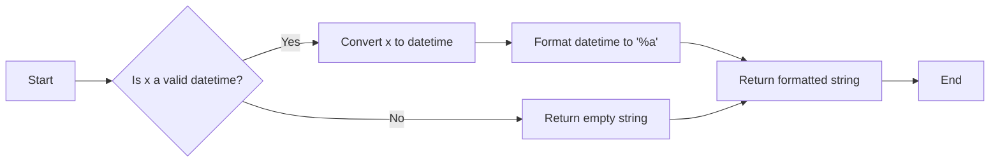
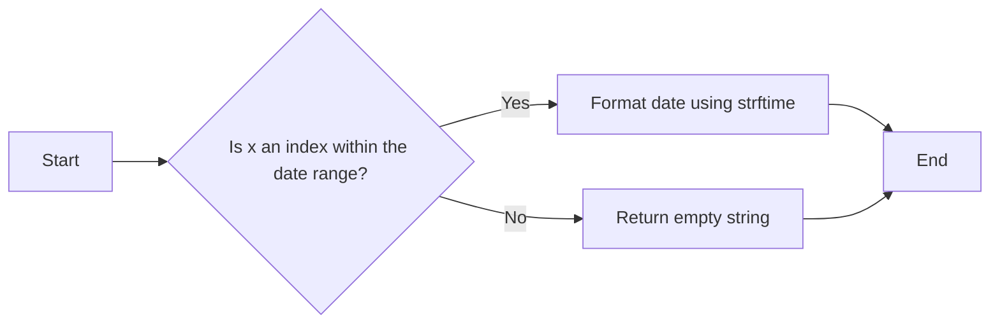
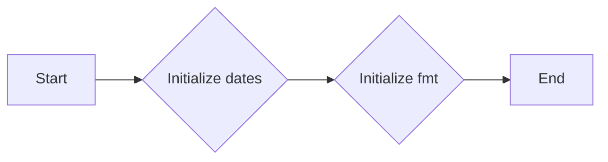
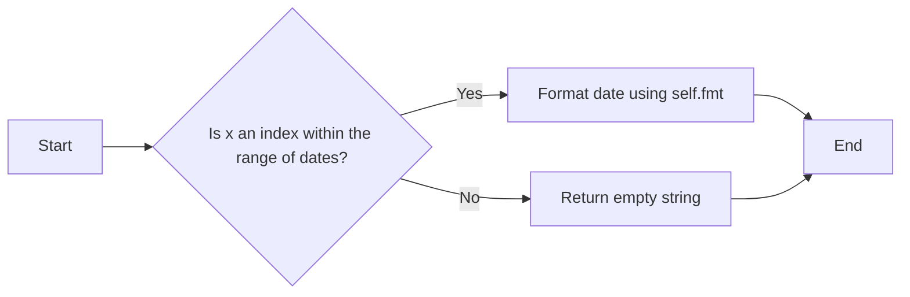
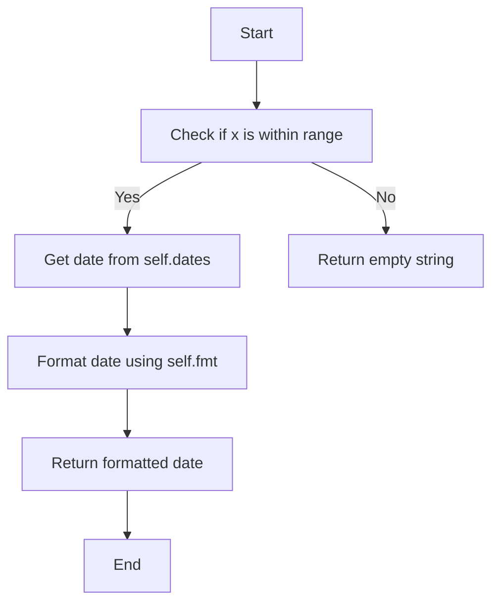

# `matplotlib\galleries\examples\ticks\date_index_formatter.py` 详细设计文档

This code provides a custom tick formatter for matplotlib plots to display dates in a specific format and to handle gaps in daily data, such as weekends, by plotting data at regular intervals without extra spaces for days with no data.

## 整体流程



## 类结构

```
matplotlib.pyplot (主模块)
├── matplotlib.cbook (辅助模块)
│   ├── get_sample_data (全局函数)
│   └── ...
├── matplotlib.dates (日期处理模块)
│   ├── DateFormatter (类)
│   ├── DayLocator (类)
│   └── ...
├── matplotlib.lines (线条处理模块)
│   └── Line2D (类)
├── matplotlib.ticker (刻度处理模块)
│   ├── Formatter (类)
│   └── ...
└── custom_tick_formatter (主模块)
    ├── format_date (全局函数)
    ├── MyFormatter (类)
```

## 全局变量及字段


### `r`
    
Structured numpy array containing time series data.

类型：`numpy.ndarray`
    


### `fig`
    
Figure object containing the plot.

类型：`matplotlib.figure.Figure`
    


### `ax1`
    
Axes object for the first plot.

类型：`matplotlib.axes._subplots.AxesSubplot`
    


### `ax2`
    
Axes object for the second plot.

类型：`matplotlib.axes._subplots.AxesSubplot`
    


### `gaps`
    
Array of indices where gaps in the data occur.

类型：`numpy.ndarray`
    


### `ml`
    
Module for line objects in matplotlib.

类型：`module`
    


### `cbook`
    
Module containing utility functions for matplotlib.

类型：`module`
    


### `np`
    
Module for numerical operations in numpy.

类型：`module`
    


### `plt`
    
Module for plotting in matplotlib.

类型：`module`
    


### `{'name': 'Formatter', 'fields': ['dates', 'fmt'], 'methods': ['__init__', '__call__']}.dates`
    
Array of dates used by the custom formatter.

类型：`numpy.ndarray`
    


### `{'name': 'Formatter', 'fields': ['dates', 'fmt'], 'methods': ['__init__', '__call__']}.fmt`
    
Format string used by the custom formatter.

类型：`str`
    


### `{'name': 'MyFormatter', 'fields': ['dates', 'fmt'], 'methods': ['__init__', '__call__']}.dates`
    
Array of dates used by the custom formatter class.

类型：`numpy.ndarray`
    


### `{'name': 'MyFormatter', 'fields': ['dates', 'fmt'], 'methods': ['__init__', '__call__']}.fmt`
    
Format string used by the custom formatter class.

类型：`str`
    


### `Formatter.dates`
    
Array of dates used by the custom formatter.

类型：`numpy.ndarray`
    


### `Formatter.fmt`
    
Format string used by the custom formatter.

类型：`str`
    


### `MyFormatter.dates`
    
Array of dates used by the custom formatter class.

类型：`numpy.ndarray`
    


### `MyFormatter.fmt`
    
Format string used by the custom formatter class.

类型：`str`
    
    

## 全局函数及方法


### format_date

`format_date` 是一个自定义的日期格式化函数，用于将时间戳转换为星期几的字符串表示。

参数：

- `x`：`numpy.datetime64`，表示时间戳。
- `_`：`None`，占位符参数，因为 `__call__` 方法通常需要一个额外的参数来指定位置，但在这个上下文中不需要。

返回值：`str`，表示星期几的字符串。

#### 流程图



#### 带注释源码

```python
def format_date(x, _):
    try:
        # convert datetime64 to datetime, and use datetime's strftime:
        return r["date"][round(x)].item().strftime('%a')
    except IndexError:
        pass
``` 


### format_date

This function is a custom formatter for the x-axis of a plot, which formats the date labels as days of the week.

参数：

- `x`：`float`，The position of the tick label in data space.
- `_`：`any`，This parameter is not used and is included to match the signature expected by the matplotlib formatter interface.

返回值：`str`，The formatted string representing the day of the week corresponding to the position `x`.

#### 流程图



#### 带注释源码

```python
def format_date(x, _):
    try:
        # convert datetime64 to datetime, and use datetime's strftime:
        return r["date"][round(x)].item().strftime('%a')
    except IndexError:
        pass
```

### MyFormatter

This class is a custom formatter for the x-axis of a plot, which formats the date labels as days of the week.

参数：

- `dates`：`numpy.ndarray`，An array of datetime64 objects representing the dates.
- `fmt`：`str`，The format string to use for formatting the dates.

返回值：`str`，The formatted string representing the day of the week corresponding to the position `x`.

#### 流程图


#### 带注释源码

```python
class MyFormatter(Formatter):
    def __init__(self, dates, fmt='%a'):
        self.dates = dates
        self.fmt = fmt

    def __call__(self, x, pos=0):
        """Return the label for time x at position pos."""
        try:
            return self.dates[round(x)].item().strftime(self.fmt)
        except IndexError:
            pass
```


### MyFormatter.__init__

This method initializes the custom formatter for time series data, setting up the date array and the format string for the date labels.

参数：

- `dates`：`numpy.ndarray`，The array of dates to be formatted. This is used to retrieve the date corresponding to the tick position.
- `fmt`：`str`，The format string to use for formatting the date. Default is '%a', which represents the abbreviated weekday name.

返回值：`None`，This method does not return any value.

#### 流程图



#### 带注释源码

```python
class MyFormatter(Formatter):
    def __init__(self, dates, fmt='%a'):
        self.dates = dates
        self.fmt = fmt
```


### MyFormatter.__call__

This method is a callable that returns the label for a given time value at a specific position. It is used to format the x-axis tick labels in a plot.

参数：

- `x`：`float`，The value of the time to be formatted.
- `pos`：`int`，The position of the tick label in the plot. Defaults to 0.

返回值：`str`，The formatted label for the given time value.

#### 流程图



#### 带注释源码

```python
class MyFormatter(Formatter):
    def __init__(self, dates, fmt='%a'):
        self.dates = dates
        self.fmt = fmt

    def __call__(self, x, pos=0):
        """Return the label for time x at position pos."""
        try:
            return self.dates[round(x)].item().strftime(self.fmt)
        except IndexError:
            pass
```


### MyFormatter.__init__

This method initializes the `MyFormatter` class, setting up the date data and the format string for the date labels.

参数：

- `dates`：`numpy.ndarray`，The array of dates to be formatted.
- `fmt`：`str`，The format string to use for formatting the dates. Defaults to '%a'.

返回值：`None`，This method does not return a value.

#### 流程图


#### 带注释源码

```python
class MyFormatter(Formatter):
    def __init__(self, dates, fmt='%a'):
        # Initialize the dates array
        self.dates = dates
        # Initialize the format string
        self.fmt = fmt
```


### MyFormatter.__call__

MyFormatter.__call__ is a method of the MyFormatter class that formats the date labels for a plot.

参数：

- `x`：`float`，The position of the tick label in data space.
- `pos`：`int`，The position of the tick label in display space. Defaults to 0.

返回值：`str`，The formatted date string.

#### 流程图



#### 带注释源码

```python
def __call__(self, x, pos=0):
    """Return the label for time x at position pos."""
    try:
        # Get the date from the self.dates list at the position rounded from x
        return self.dates[round(x)].item().strftime(self.fmt)
    except IndexError:
        # If x is out of range, return an empty string
        pass
``` 


## 关键组件


### 张量索引与惰性加载

张量索引与惰性加载允许在处理大型数据集时，只加载和处理所需的数据部分，从而提高效率。

### 反量化支持

反量化支持使得代码能够处理不同类型的量化数据，增强了代码的通用性和灵活性。

### 量化策略

量化策略定义了如何将浮点数转换为固定点数表示，以减少内存使用和提高计算速度。


## 问题及建议


### 已知问题

-   **问题1**: 代码中使用了 `matplotlib` 库，这是一个外部依赖。如果项目需要在不同的环境中运行，可能需要确保 `matplotlib` 库已经安装。
-   **问题2**: 代码中使用了 `cbook.get_sample_data` 函数来加载示例数据。如果数据文件不存在或路径不正确，可能会导致错误。应该添加错误处理来确保数据加载的可靠性。
-   **问题3**: 代码中使用了 `np.timedelta64`，这是 NumPy 库的一部分。如果项目不依赖于 NumPy，则需要考虑移除或替换这部分代码。
-   **问题4**: 代码中使用了 `plt.subplots` 来创建图形和轴。如果图形和轴的创建逻辑需要更复杂的配置，可能需要重构这部分代码以提高可读性和可维护性。

### 优化建议

-   **建议1**: 将数据加载逻辑封装成一个函数，并添加异常处理来确保数据加载的健壮性。
-   **建议2**: 考虑使用 `try-except` 块来捕获并处理可能出现的 `IndexError`，以避免程序崩溃。
-   **建议3**: 如果可能，将 `matplotlib` 库的使用封装在一个单独的模块中，以便于在其他项目中重用。
-   **建议4**: 对于自定义格式化函数 `format_date` 和 `MyFormatter`，可以考虑使用装饰器或类方法来简化它们的实现。
-   **建议5**: 在代码中添加注释，特别是对于复杂的逻辑和数据处理的步骤，以提高代码的可读性。
-   **建议6**: 考虑使用更现代的日期时间处理库，如 `pendulum` 或 `dateutil`，以提供更丰富的日期时间处理功能。


## 其它


### 设计目标与约束

- 设计目标：
  - 提供一个自定义的时间序列刻度格式化器，用于在绘图时显示日期。
  - 确保在绘制没有数据的日期（如周末）时，图表保持整洁，没有额外的空白。
  - 允许用户自定义日期格式。

- 约束：
  - 必须使用matplotlib库进行绘图。
  - 代码应尽可能简洁，易于理解和维护。

### 错误处理与异常设计

- 错误处理：
  - 当索引超出数据范围时，`IndexError`将被捕获并忽略。
  - 如果日期格式化失败，将返回空字符串。

### 数据流与状态机

- 数据流：
  - 从数据源加载时间序列数据。
  - 使用matplotlib库绘制数据。
  - 应用自定义格式化器来格式化日期刻度。

- 状态机：
  - 无状态机，代码执行线性流程。

### 外部依赖与接口契约

- 外部依赖：
  - matplotlib
  - numpy

- 接口契约：
  - `format_date`函数和`MyFormatter`类必须接受特定的参数，并返回正确的格式化日期字符串。
  - `DateFormatter`和`FuncFormatter`必须能够处理自定义格式化器。

    