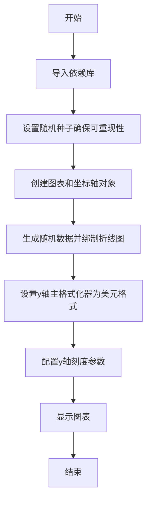
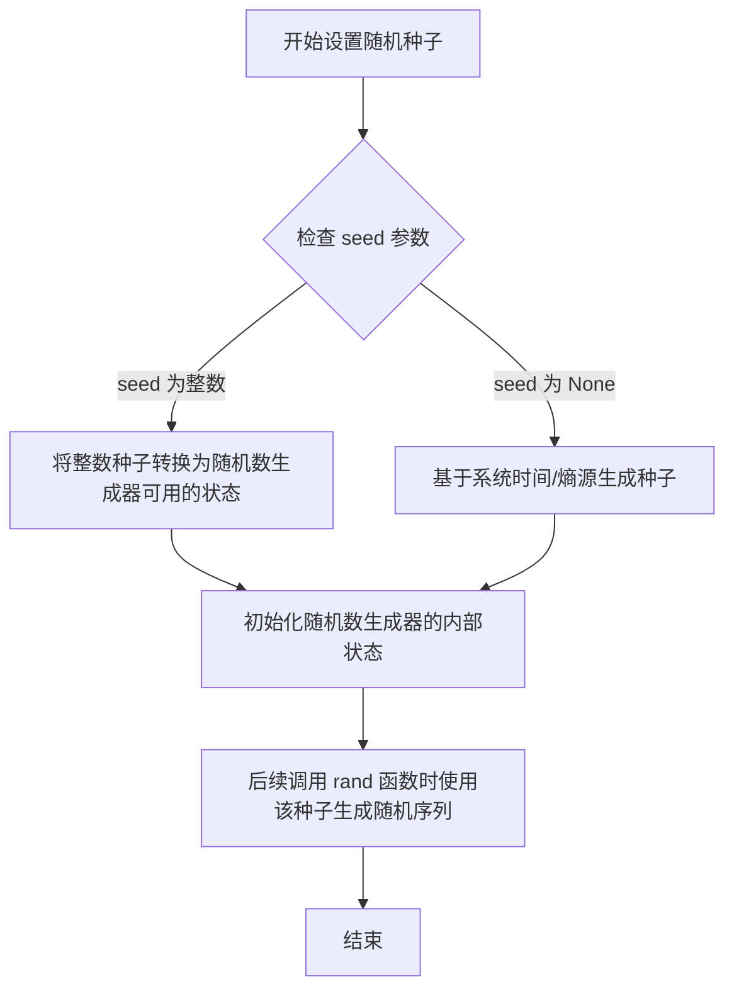
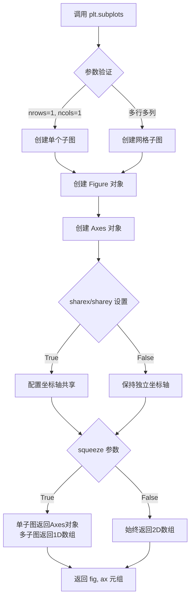
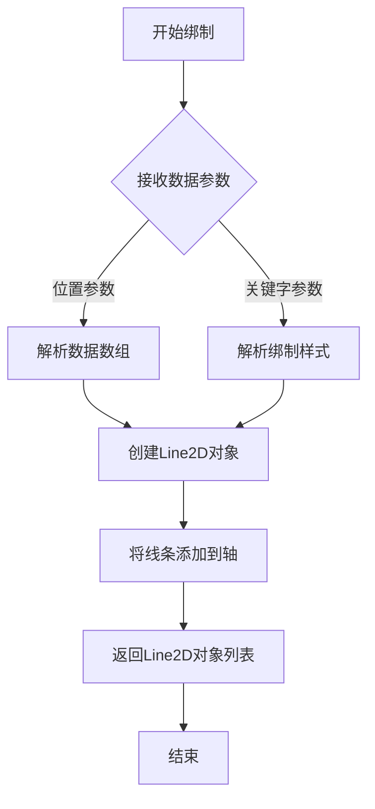
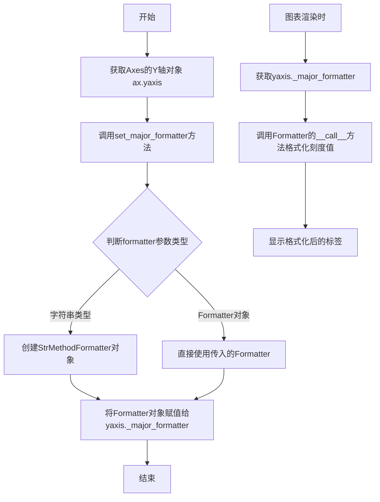
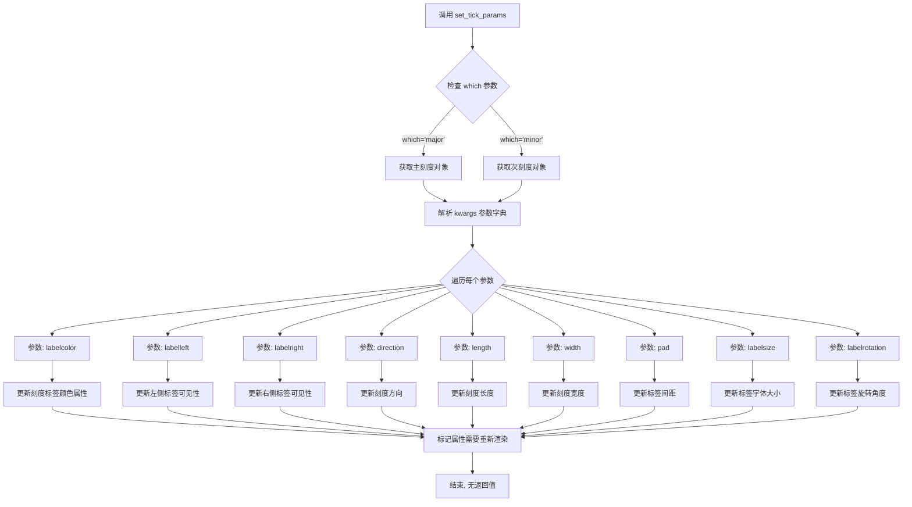
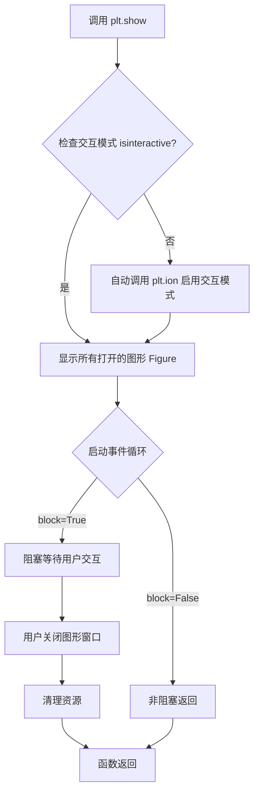

# `matplotlib\galleries\examples\ticks\dollar_ticks.py` 详细设计文档

该代码是一个matplotlib可视化示例程序，通过设置y轴的主格式化器将随机数据图表的y轴标签显示为美元货币格式，并调整刻度参数使标签显示在右侧且颜色为绿色。

## 整体流程



## 类结构

```
Python脚本文件 (无自定义类)
├── 导入模块
│   ├── matplotlib.pyplot (别名: plt)
│   └── numpy (别名: np)
├── 全局变量/常量
│   └── 19680801 (随机种子)
└── 执行流程
    ├── 设置随机种子
    ├── 创建图表
    ├── 绑制数据
    ├── 设置格式化器
    └── 显示图表
```

## 全局变量及字段


### `19680801`
    
用于设置随机数生成器的种子值，确保结果可重现

类型：`int`
    


    

## 全局函数及方法


### `np.random.seed`

设置随机数生成器的种子值，用于确保随机过程的可重复性。通过指定相同的种子值，可以使后续的随机数生成产生相同的结果，这在需要复现实验结果或调试程序时非常有用。

参数：

- `seed`：`int` 或 `None`，随机数生成器的种子值。通常使用整数（如 19680801）来确保可重复性。如果设为 `None`，则随机数生成器会基于系统时间或其他熵源来初始化种子。

返回值：`None`，该函数无返回值，直接修改随机数生成器的内部状态。

#### 流程图



#### 带注释源码

```python
# 设置随机种子为 19680801，确保后续随机数生成的可重复性
# 这个特定的值常用于 matplotlib 示例，因为它是 matplotlib 项目首次提交的日期
np.random.seed(19680801)

# 之后生成的随机数序列将是确定的，每次运行都相同
# 例如：np.random.rand(20) 将始终生成相同的 20 个随机数
fig, ax = plt.subplots()
ax.plot(100*np.random.rand(20))
```

#### 说明

- **设计目标**：提供随机数生成的可重复性支持，这对于科学实验的可复现性、单元测试的确定性以及调试随机行为问题都非常重要。
- **约束条件**：种子值应该是整数或 None，某些随机数生成器可能还支持其他类型的种子（如数组）。
- **错误处理**：如果传入无效的种子类型，可能会抛出 TypeError 或 ValueError。
- **潜在优化**：在现代 NumPy 中，推荐使用 `np.random.default_rng()` 和 Generator 对象的方法来生成随机数，这种方式更加灵活和安全。传统的全局 `np.random.seed()` 在多线程环境下可能存在竞态条件问题。


### `plt.subplots`

创建图表画布和坐标轴，返回包含图形和坐标轴的元组。

参数：

- `nrows`：`int`，默认为 1，子图的行数
- `ncols`：`int`，默认为 1，子图的列数
- `sharex`：`bool` 或 `str`，默认为 False，是否共享 x 轴
- `sharey`：`bool` 或 `str`，默认为 False，是否共享 y 轴
- `squeeze`：`bool`，默认为 True，是否压缩返回的坐标轴数组维度
- `width_ratios`：`array-like`，可选，各列的宽度比例
- `height_ratios`：`array-like`，可选，各行的高度比例
- `**kwargs`：`dict`，传递给 `Figure.subplots` 的其他关键字参数

返回值：`tuple(Figure, Axes or ndarray)`，返回图形对象和坐标轴对象或坐标轴数组

#### 流程图



#### 带注释源码

```python
import matplotlib.pyplot as plt
import numpy as np

# 固定随机状态以确保可复现性
np.random.seed(19680801)

# 调用 plt.subplots 创建图表和坐标轴
# 参数：1行1列（默认），返回 Figure 对象 fig 和 Axes 对象 ax
fig, ax = plt.subplots()

# 使用 ax 对象的 plot 方法绘制随机数据
# 生成20个随机数并乘以100作为y轴数据
ax.plot(100*np.random.rand(20))

# 设置y轴主刻度格式化器为货币格式
# '$' 符号前缀，保留两位小数
ax.yaxis.set_major_formatter('${x:1.2f}')

# 配置y轴刻度参数
# which='major' 仅影响主刻度
# labelcolor='green' 刻度标签颜色为绿色
# labelleft=False 隐藏左侧刻度标签
# labelright=True 显示右侧刻度标签
ax.yaxis.set_tick_params(which='major', labelcolor='green',
                         labelleft=False, labelright=True)

# 显示绘制的图表
plt.show()
```


### `ax.plot`

`ax.plot` 是 matplotlib 库中 Axes 对象的绑制折线图方法，用于将数据绘制为线条。该方法接受数据数组和可选的关键字参数（如颜色、线型、标记等），返回 Line2D 对象列表。

参数：

-  `*args`：可变数量的位置参数，数据数组或 (x, y) 数据对，支持 numpy 数组、列表等可迭代对象
-  `**kwargs`：关键字参数，用于指定线条样式，如 color（颜色）、linestyle（线型）、marker（标记）、linewidth（线宽）等

返回值：`list of matplotlib.lines.Line2D`，返回绑制的线条对象列表，每个线条对应一组数据

#### 流程图



#### 带注释源码

```python
# 这是matplotlib库中ax.plot方法的简化实现原理
# 实际源码位于lib/matplotlib/axes/_axes.py中

def plot(self, *args, **kwargs):
    """
    绑制y versus x作为线条和/或标记。
    
    参数:
    -------
    *args : 数组或标量序列
        绑制数据。可以是以下形式:
        - y 仅: 假设为y数据，x自动生成
        - x, y: 显式指定x和y数据
        - x, y, format_string: 数据+格式字符串
    
    **kwargs : 关键字参数
        - color: 线条颜色
        - linestyle: 线型 ('-', '--', '-.', ':')
        - marker: 标记样式 ('o', 's', '^', etc.)
        - linewidth: 线宽
        - markersize: 标记大小
        等其他Line2D属性
    
    返回:
    -------
    lines : list of Line2D
        绑制到轴上的线条对象列表
    """
    
    # 1. 解析输入参数，提取数据x, y和格式字符串
    # 2. 创建Line2D对象，设置其属性（颜色、线型等）
    # 3. 将Line2D对象添加到Axes的线条列表中
    # 4. 返回Line2D对象列表
    
    # 示例调用:
    # ax.plot([1,2,3], [4,5,6], 'r--', linewidth=2)
    # 创建红色虚线，线宽为2
```

#### 代码中的实际使用

```python
# 从给定代码中提取的ax.plot使用示例

# 创建包含20个随机数的数组作为y轴数据
data = 100*np.random.rand(20)

# 调用ax.plot绑制折线图
# 参数: data (numpy数组)
# 返回值: lines (Line2D对象列表，本例中未使用)
lines = ax.plot(data)

# 完整调用形式:
# ax.plot(100*np.random.rand(20))
#  - 参数: 100*np.random.rand(20) 生成0-100之间的20个随机数
#  - 默认x轴: 自动生成0-19的索引
#  - 默认样式: 蓝色实线
```


### `ax.yaxis.set_major_formatter`

设置Y轴的主格式化器，用于控制Y轴刻度标签的显示格式。该方法接受格式化字符串或Formatter对象，将刻度值格式化为带有美元符号和小数精度的字符串。

参数：

- `formatter`：`str` 或 `matplotlib.ticker.Formatter`，格式化字符串（如 '${x:1.2f}'）或Formatter对象，用于定义Y轴主刻度的标签格式

返回值：`None`，该方法直接修改Y轴的格式化器属性，无返回值

#### 流程图



#### 带注释源码

```python
# 设置Y轴主格式化器示例
ax.yaxis.set_major_formatter('${x:1.2f}')

# 内部实现原理（简化版）:
# 1. 传入的字符串 '${x:1.2f}' 会被自动转换为 StrMethodFormatter 对象
# 2. StrMethodFormatter 使用 Python 的格式字符串语法
# 3. {x:1.2f} 表示将刻度值 x 格式化为保留2位小数的浮点数
# 4. 前面的 $ 符号会作为前缀添加到格式化结果前
# 5. 最终效果：刻度值 12.3456 会显示为 $12.35

# 相关类和方法调用链:
# ax.yaxis  # 获取Y轴Axis对象
#     ↓
# ax.yaxis.set_major_formatter('${x:1.2f}')  # 设置格式化器
#     ↓
# 内部创建: matplotlib.ticker.StrMethodFormatter('${x:1.2f}')
#     ↓
# 渲染时调用: formatter(12.3456) → 返回 '$12.35'

# 完整的Y轴配置示例
ax.yaxis.set_major_formatter('${x:1.2f}')  # 设置格式化器
ax.yaxis.set_tick_params(
    which='major',           # 只影响主刻度
    labelcolor='green',      # 标签颜色为绿色
    labelleft=False,         # 左侧不显示标签
    labelright=True          # 右侧显示标签
)
```


### `Axis.set_tick_params`

设置坐标轴刻度参数，用于控制刻度线、刻度标签以及网格线的外观和行为。

参数：

- `which`：`str`，可选，默认为 'major'，指定要设置的刻度类型，可选值为 'major'（主刻度）或 'minor'（次刻度）
- `labelcolor`：`str` 或 `color`，可选，刻度标签的颜色，支持颜色名称如 'green'、十六进制颜色码如 '#ff0000'、或 RGB 元组如 (1,0,0)
- `labelleft`：`bool`，可选，默认为 True，是否在左侧显示刻度标签，设为 False 则隐藏左侧标签
- `labelright`：`bool`，可选，默认为 False，是否在右侧显示刻度标签，设为 True 则在右侧显示标签
- `direction`：`str`，可选，刻度方向，可选 'in'（向内）、'out'（向外）、'inout'（双向）
- `length`：`float`，可选，刻度线长度（以点为单位）
- `width`：`float`，可选，刻度线宽度（以点为单位）
- `pad`：`float`，可选，刻度标签与刻度线之间的间距（以点为单位）
- `labelsize`：`float`，可选，刻度标签的字体大小
- `labelrotation`：`float`，可选，刻度标签的旋转角度（度）
- `colors`：`tuple`，可选，包含 (tick color, label color) 的元组

返回值：`None`，该方法无返回值，直接修改 Axes 对象的内部状态

#### 流程图



#### 带注释源码

```python
def set_tick_params(self, which='major', **kwargs):
    """
    Set appearance parameters for ticks and tick labels.
    
    This method is used to customize the appearance of tick marks
    and their labels along an axis.
    
    Parameters
    ----------
    which : str, default: 'major'
        The group of ticks for which the parameters are set.
        For example, use 'major' or 'minor'.
    **kwargs : dict
        Keyword arguments controlling the tick appearance:
        
        - **direction** : {'in', 'out', 'inout'}
            Puts ticks inside the axes, outside, or both.
        - **length** : float
            Tick length in points.
        - **width** : float
            Tick width in points.
        - **pad** : float
            Distance in points between tick and label.
        - **colors** : tuple
            (tick color, label color) tuple.
        - **labelcolor** : color
            Color of the labels.
        - **labelsize** : float or str
            Font size of the labels, e.g., 12 or 'small'.
        - **labelrotation** : float
            Rotation angle of the labels in degrees.
        - **labelleft** : bool
            Whether to draw the label on the left side.
        - **labelright** : bool
            Whether to draw the label on the right side.
        - **labeltop** : bool
            Whether to draw the label on the top.
        - **labelbottom** : bool
            Whether to draw the label on the bottom.
    
    Returns
    -------
    None
    
    Examples
    --------
    >>> ax.yaxis.set_tick_params(which='major', labelcolor='red',
    ...                           labelleft=False, labelright=True)
    >>> ax.xaxis.set_tick_params(which='minor', length=5, width=2)
    """
    # 获取主刻度或次刻度对象
    if which == 'major':
        ticks = self.majorTicks  # 主刻度列表
    elif which == 'minor':
        ticks = self.minorTicks  # 次刻度列表
    else:
        raise ValueError("'which' must be either 'major' or 'minor'")
    
    # 合并默认参数与用户提供的参数
    kw = self._update_params(self._defaults, kwargs)
    
    # 遍历所有刻度对象并应用参数
    for tick in ticks:
        # 设置刻度线参数
        if 'color' in kw:
            tick.tick1line.set_color(kw['color'])
        if 'width' in kw:
            tick.tick1line.set_markeredgewidth(kw['width'])
        if 'length' in kw:
            tick.tick1line.set_markersize(kw['length'])
        
        # 设置刻度标签参数
        if 'labelcolor' in kw:
            tick.label1.set_color(kw['labelcolor'])
        if 'labelsize' in kw:
            tick.label1.set_size(kw['labelsize'])
        if 'labelrotation' in kw:
            tick.label1.set_rotation(kw['labelrotation'])
        
        # 设置标签可见性
        if 'labelleft' in kw:
            tick.label1.set_visible(kw['labelleft'])
        if 'labelright' in kw:
            # 右侧标签需要单独处理
            tick.label2.set_visible(kw['labelright'])
        
        # 设置刻度方向
        if 'direction' in kw:
            self._set_tick_direction(kw['direction'])
        
        # 设置刻度与标签之间的间距
        if 'pad' in kw:
            tick._pad = kw['pad']
    
    # 更新默认参数，以便后续调用可以继承
    self._defaults.update(kw)
    
    # 标记需要重新绘制
    self.stale = True
```


### `plt.show`

显示所有未关闭的图表窗口，并进入图形交互模式（阻塞模式），等待用户关闭图形窗口后继续执行。

参数：

- `block`：`bool`，可选参数。控制在调用 `show()` 后是否阻塞主程序以等待图形窗口关闭。默认为 `True`。在某些后端设置为 `False` 可实现非阻塞显示。

返回值：`None`，无返回值。

#### 流程图



#### 带注释源码

```python
def show(*, block=True):
    """
    显示所有未关闭的图形窗口并进入事件循环。
    
    参数:
        block (bool): 默认 True，表示阻塞主线程等待图形关闭；
                      设置为 False 可实现非阻塞显示（部分后端支持）。
    返回值:
        None
    """
    # 1. 获取当前图形后端管理器
    global _backend_mod, _backend_bases
    backend = matplotlib.get_backend()
    
    # 2. 如果当前处于交互模式，直接显示图形
    if matplotlib.is_interactive():
        # 遍历所有打开的图形对象
        for manager in Gcf.get_all_fig_managers():
            # 调用后端的 show 方法渲染图形
            manager.show()
    
    # 3. 如果 block=True，则阻塞等待图形关闭
    if block:
        # 启动图形事件循环（具体实现依赖后端）
        # 例如 TkAgg 后端会调用 mainloop()
        _backend_mod.show(block=True)
    
    # 4. 清理工作，关闭所有图形
    # 在某些交互式环境中会自动调用
    return None
```

> **注**：上述源码为简化注释版，真实实现位于 `matplotlib.pyplot` 模块中。具体实现细节因所选后端（如 Qt5Agg、TkAgg、Agg 等）而异。`plt.show()` 的核心职责是协调后端渲染引擎，将内存中的 Figure 对象转换为用户可见的窗口，并处理 GUI 事件循环。

## 关键组件


### matplotlib.pyplot

matplotlib 的顶层接口，用于创建图形和轴，提供绘图功能。

### numpy.random

NumPy 的随机数生成模块，用于生成随机数据，设置了种子以确保可重复性。

### Axis.set_major_formatter

设置轴的主格式化器，这里使用 StrMethodFormatter 将数值格式化为美元格式 `${x:1.2f}`。

### Axis.set_tick_params

设置刻度参数，包括刻度标签的颜色、显示位置等，这里设置标签在右侧显示且为绿色。

### StrMethodFormatter

格式化器类，使用格式字符串预处理轴标签，此处用于添加美元符号。


## 问题及建议


### 已知问题

- **硬编码的魔法数字**：代码中存在多个硬编码值，如`100`（数据范围）、`20`（数据点数量）、`19680801`（随机种子）、`1.2`（格式精度）等，降低了代码的可维护性和可配置性。
- **格式字符串缺乏灵活性**：货币格式`'${x:1.2f}'`直接硬编码，若需要更改货币符号或精度需修改多处。
- **缺少参数化设计**：数据生成逻辑与绘图逻辑紧耦合，无法独立控制数据生成参数。
- **未使用上下文管理器管理资源**：使用`plt.subplots()`创建figure但未通过`with`语句或显式`close()`管理，可能导致资源泄漏。
- **颜色值硬编码**：`'green'`直接以字符串形式硬编码，缺乏配置管理。
- **plt.show()的阻塞特性**：在某些后端环境下可能阻塞程序，且无超时或交互式退出机制。

### 优化建议

- **提取配置参数**：将所有硬编码值（如数据范围、精度、种子等）定义为模块级常量或配置字典，便于维护和修改。
- **封装数据生成逻辑**：创建独立的数据生成函数，支持参数化配置，如`generate_data(n_points, scale, seed)`。
- **抽象格式化器**：创建格式化器工厂函数或类，支持不同货币符号和小数位数的配置。
- **使用上下文管理器**：采用`with plt.style.context():`或确保在完成后显式调用`plt.close(fig)`释放资源。
- **定义颜色常量**：使用`matplotlib.colors`或自定义颜色常量字典管理颜色配置。
- **添加错误处理**：为绘图和数据生成操作添加try-except块，处理可能的异常情况。
- **考虑面向对象设计**：如果代码复杂度增加，可封装为专门的图表类，提供配置接口。


## 其它


### 设计目标与约束

本示例旨在演示如何使用Matplotlib的StrMethodFormatter在y轴标签前添加美元符号，实现金融数据的可视化展示。约束条件：需要Matplotlib 2.0+版本支持StrMethodFormatter，numpy用于生成随机数据。

### 错误处理与异常设计

代码中未实现显式的错误处理机制。潜在异常包括：1) np.random.rand(20)可能因内存不足失败；2) plt.subplots()可能因后端配置问题失败；3) set_major_formatter参数格式错误会导致格式化失败。建议添加try-except块捕获FigureCreationError和FormatterError。

### 数据流与状态机

数据流：随机种子设置(19680801) → 生成20个随机浮点数[0,100) → plot()绘制折线图 → yaxis.set_major_formatter应用格式化器 → set_tick_params配置刻度标签属性 → plt.show()渲染显示。无复杂状态机，仅有初始化→配置→渲染的简单流程。

### 外部依赖与接口契约

依赖：numpy.random.rand()返回ndarray shape(20,)，matplotlib.pyplot.subplots()返回(fig, ax)元组，matplotlib.axis.Axis.set_major_formatter()接受str或Formatter实例，matplotlib.axis.Axis.set_tick_params()接受关键字参数。接口契约：y轴数值通过StrMethodFormatter的${x:1.2f}格式字符串转换为美元格式字符串。

### 性能考虑

np.random.rand(20)生成小规模数据，性能可忽略。关键性能点：set_major_formatter在每次重绘时调用格式化，StrMethodFormatter性能优于FuncFormatter。建议：大规模数据时可考虑预先计算格式化字符串缓存。

### 安全性考虑

np.random.seed(19680801)使用固定种子确保可复现性，但不适合安全随机数场景（如加密）。无用户输入，无注入风险。建议：生产环境使用secrets模块生成安全随机数。

### 可维护性与扩展性

代码结构清晰，注释完善。扩展方向：1) 支持多货币格式化（通过参数化货币符号）；2) 支持不同格式化风格（千分位分隔符）；3) 支持x轴格式化。建议将格式化逻辑封装为独立函数，提高复用性。

### 版本兼容性

代码使用Matplotlib 2.0+的StrMethodFormatter语法，numpy 1.0+兼容。无版本检测代码，可能在旧版本运行失败。建议添加版本检测或使用try-except兼容处理。

### 资源管理

plt.subplots()创建Figure和Axes对象，plt.show()后图形窗口显示。Matplotlib自动管理资源，无显式close()调用。建议：在脚本环境中可省略，但在长期运行应用中应显式管理Figure生命周期。

    