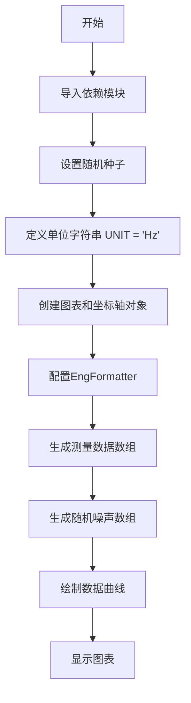
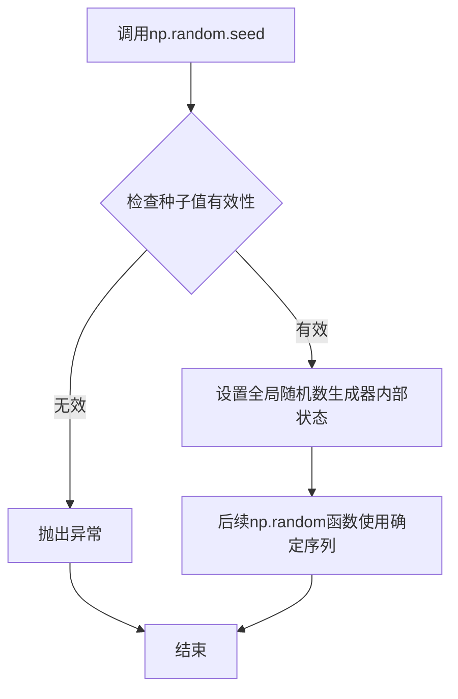
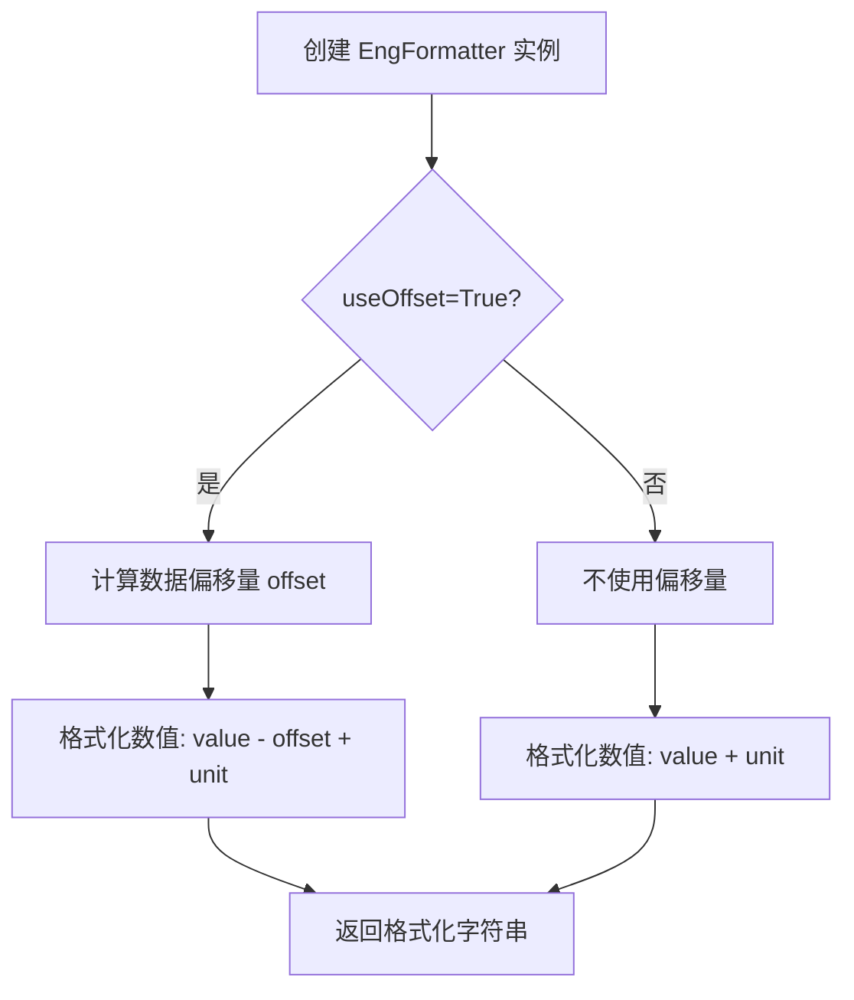
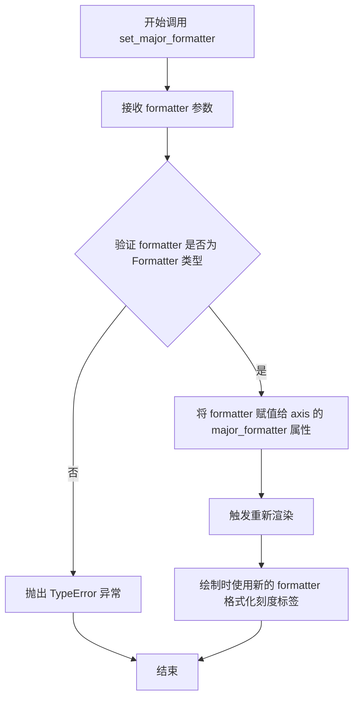
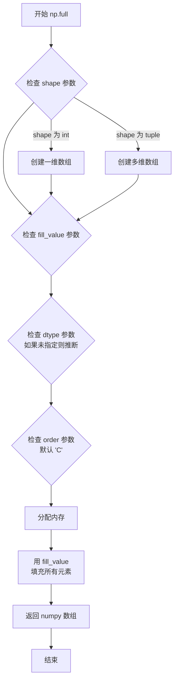
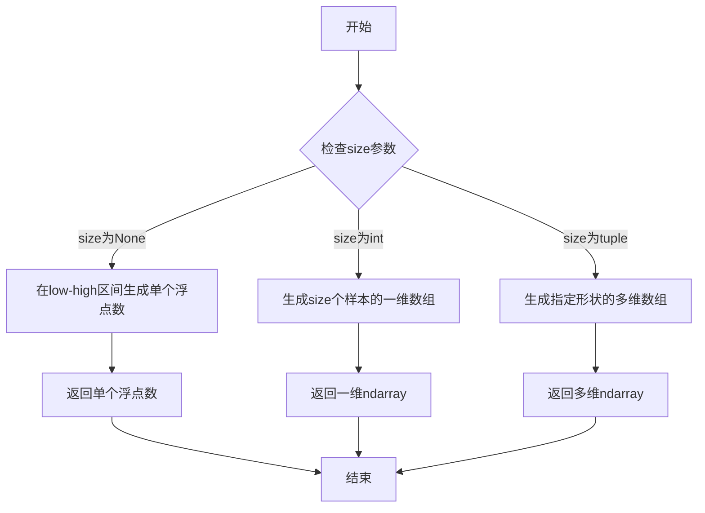
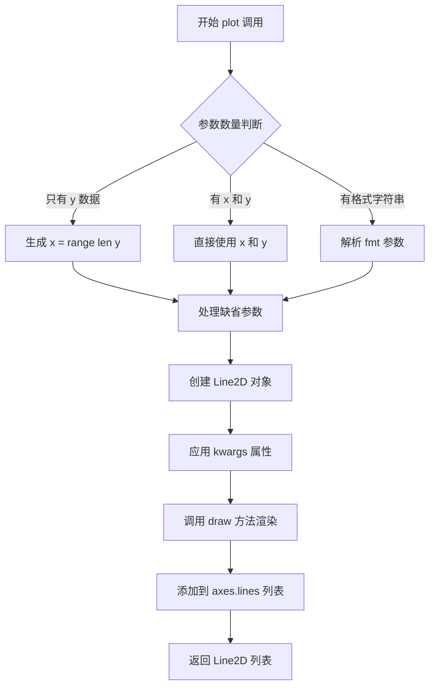
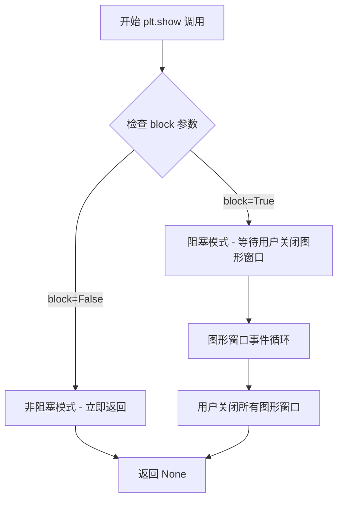

# `matplotlib\galleries\examples\ticks\engformatter_offset.py` 详细设计文档

该代码是一个matplotlib示例脚本，展示了如何使用EngFormatter将y轴刻度自动格式化为SI单位前缀（如Hz），并绘制带有随机噪声的测量信号图。

## 整体流程



## 类结构

```
无类层次结构（脚本文件）
```

## 全局变量及字段


### `UNIT`
    
SI单位字符串，值为'HZ'

类型：`str`
    


### `fig`
    
matplotlib图表对象

类型：`matplotlib.figure.Figure`
    


### `ax`
    
matplotlib坐标轴对象

类型：`matplotlib.axes.Axes`
    


### `size`
    
数据点数量，值为100

类型：`int`
    


### `measurement`
    
基准测量数组

类型：`numpy.ndarray`
    


### `noise`
    
随机噪声数组

类型：`numpy.ndarray`
    


    

## 全局函数及方法


### `np.random.seed`

该函数用于设置NumPy随机数生成器的种子值，确保后续生成的随机数序列可重现。在代码中用于固定随机状态，保证程序每次运行产生相同的随机数，从而实现结果的可重复性。

参数：

- `seed`：`int`，随机数生成器的种子值，用于初始化随机数生成器的内部状态

返回值：`None`，无返回值，该函数直接修改全局随机数生成器的内部状态

#### 流程图



#### 带注释源码

```python
# 固定随机状态以确保可重现性
# 参数19680801是种子值，这个特定值常用于matplotlib示例
np.random.seed(19680801)
```


### `plt.subplots`

`plt.subplots` 是 `matplotlib.pyplot` 模块中的一个顶层函数，用于创建一个新的图形窗口（Figure）并在其内部按网格布局生成一个或多个子图（Axes），同时返回图形对象和轴对象，以便进行后续的数据绑定和配置。

参数：

- `nrows`：`int`，默认为 1。子图网格的行数。
- `ncols`：`int`，默认为 1。子图网格的列数。
- `sharex`：`bool` 或 `str`，默认为 `False`。如果为 `True`，所有子图将共享 x 轴的刻度和范围。
- `sharey`：`bool` 或 `str`，默认为 `False`。如果为 `True`，所有子图将共享 y 轴的刻度和范围。
- `squeeze`：`bool`，默认为 `True`。如果为 `True`：
    - 当 `nrows` 或 `ncols` 为 1 时，返回单个 Axes 对象。
    - 当 `nrows` 和 `ncols` 都大于 1 时，返回 Axes 对象数组。
  如果为 `False`，始终返回 2 维数组。
- `figsize`：`tuple`，可选。指定图形的宽和高（英寸），例如 `(width, height)`。
- `width_ratios`：`array-like`，可选。定义每列宽度的相对比例。
- `height_ratios`：`array-like`，可选。定义每行高度的相对比例。
- `**kwargs`：其他关键字参数，将传递给 `Figure` 的创建函数。

返回值：`tuple`，返回一个元组 `(fig, ax)`。
- `fig`：`matplotlib.figure.Figure`。整个图形对象，用于控制整体属性（如大小、标题、保存等）。
- `ax`：`matplotlib.axes.Axes` 或 `numpy.ndarray`。子图对象。在本例代码 `fig, ax = plt.subplots()` 中，由于默认 `nrows=1, ncols=1` 且 `squeeze=True`，`ax` 是一个单例的 `Axes` 对象。

#### 流程图

```mermaid
graph TD
    A[调用 plt.subplots] --> B{创建 Figure 实例}
    B --> C{创建 GridSpec 或计算网格}
    C --> D[循环创建子图位置]
    D --> E[调用 Figure.add_subplot]
    E --> F{是否共享轴 ShareX/Y?}
    F -->|是| G[配置共享属性]
    F -->|否| H[保持独立]
    G --> I{是否需要挤压 Squeeze?}
    H --> I
    I -->|True 且 1x1| J[返回单个 Axes 对象]
    I -->|False 或 NxM| K[返回 Axes 数组]
    J --> L[返回 (fig, ax) 元组]
    K --> L
```

#### 带注释源码

```python
# matplotlib.pyplot.subplots 源码逻辑重构
def subplots(nrows=1, ncols=1, sharex=False, sharey=False, 
             squeeze=True, width_ratios=None, height_ratios=None, 
             **kwargs):
    """
    创建图形 (Figure) 和子图 (Axes) 的便捷函数。
    """
    # 1. 创建一个新的图形窗口，这是所有绘图的容器
    #    如果当前没有激活的图形，pyplot 会自动创建一个
    fig = plt.figure(figsize=kwargs.get('figsize'), 
                     dpi=kwargs.get('dpi'))

    # 2. 计算并分配网格布局 (GridSpec)
    #    用于确定子图的位置和比例
    gs = GridSpec(nrows, nrows, width_ratios=width_ratios, 
                  height_ratios=height_ratios)

    # 3. 初始化用于存储 Axes 的变量
    axarr = np.empty((nrows, ncols), dtype=object)
    
    # 4. 双重循环遍历网格的每一行每一列
    for i in range(nrows):
        for j in range(ncols):
            # 根据位置 (i, j) 创建子图
            # add_subplot 的参数例如 '211' 表示 2行1列的第1个位置
            ax = fig.add_subplot(gs[i, j])
            
            # 处理共享轴逻辑
            if sharex and i > 0:
                ax.sharex(axarr[0, j])
            if sharey and j > 0:
                ax.sharey(axarr[i, 0])
                
            axarr[i, j] = ax

    # 5. 处理返回值格式 (Squeeze 逻辑)
    #    根据是否压缩以及网格形状返回合适的数据结构
    if squeeze:
        # 省略多余的维度
        if nrows == 1 and ncols == 1:
            return fig, axarr[0, 0] # 返回单个 Axes
        elif nrows == 1 or ncols == 1:
            return fig, axarr.flatten() # 返回 1维数组
        else:
            return fig, axarr # 返回 2维数组
            
    # 默认返回完整的二维数组
    return fig, axarr

# 注意：在实际 matplotlib 库中，此函数位于 pyplot.py 或 figure.py
# 源码更为复杂，包含大量的错误检查和布局优化 (Constrained Layout)
```


### `mticker.EngFormatter`

`mticker.EngFormatter` 是 matplotlib.ticker 模块中的一个类，用于将数值格式化为工程单位表示（例如 1.5kHz、2.3MHz 等），支持 SI 前缀自动计算和可选的偏移量显示。

参数：

-  `useOffset`：`bool`，可选参数，控制是否使用偏移量来简化轴标签的显示。当设为 `True` 时，绘图库会自动计算数据的偏移量并在标签中显示。
-  `unit`：`str`，可选参数，指定单位符号（如 "Hz"、"V"、"A" 等），该单位会显示在格式化数值的末尾。
-  `places`：`int`，可选参数，指定小数点后的有效位数。
-  `sep`：`str`，可选参数，指定数字与单位之间的分隔符，默认为 " "（空格）。
-  `usetex`：`bool`，可选参数，控制是否使用 LaTeX 渲染文本。
-  `fontset`：`str`，可选参数，指定字体集（'dejavusans', 'dejavuserif', 'stix', 'stixsans', 'custom'）。

返回值：返回一个 `EngFormatter` 实例，该实例可用作 matplotlib 轴的主格式化器（major formatter）。

#### 流程图



#### 带注释源码

```python
# matplotlib.ticker.EngFormatter 类源码示例

class EngFormatter(Formatter):
    """
    Formats numbers with engineering SI prefix notation.
    
    使用工程单位前缀（如 k, M, G, m, u, n 等）格式化数值，
    使大数值和小数值都易于阅读。
    """
    
    @api.make_keyword_only("set_useOffset", "useOffset")
    def __init__(self, useOffset=True, unit="", places=None, sep=" ",
                 usetex=False, fontset='dejavusans'):
        """
        初始化 EngFormatter。
        
        参数:
            useOffset: 布尔值，控制是否使用偏移量简化显示
            unit: 字符串，单位符号
            places: 整数，小数位数
            sep: 字符串，分隔符
            usetex: 布尔值，是否使用 LaTeX
            fontset: 字符串，字体集
        """
        super().__init__()
        self.set_useOffset(useOffset)
        self.set_unit(unit)
        self.set_sep(sep)
        # ... 其他初始化代码
    
    def __call__(self, x, pos=None):
        """
        格式化单个数值 x。
        
        参数:
            x: float，要格式化的数值
            pos: int，位置索引（matplotlib 要求）
            
        返回:
            str，格式化的字符串
        """
        # 实现 SI 前缀转换逻辑
        # 例如：1e9 -> "1.0G", 1e-3 -> "1.0m"
        ...
    
    def get_useOffset(self):
        """获取是否使用偏移量的设置。"""
        return self.useOffset
    
    def set_useOffset(self, val):
        """设置是否使用偏移量。"""
        self.useOffset = val
```

#### 使用示例源码

```python
import matplotlib.pyplot as plt
import numpy as np
import matplotlib.ticker as mticker

# 设置随机种子以保证可重复性
np.random.seed(19680801)

UNIT = "Hz"  # 定义单位为赫兹

# 创建图形和坐标轴
fig, ax = plt.subplots()

# 设置 Y 轴的主格式化器为 EngFormatter
# useOffset=True: 启用偏移量显示（自动计算基准偏移）
# unit=UNIT: 单位为 Hz
ax.yaxis.set_major_formatter(mticker.EngFormatter(
    useOffset=True,
    unit=UNIT
))

# 生成测试数据
size = 100
measurement = np.full(size, 1e9)  # 基础测量值 1GHz
noise = np.random.uniform(low=-2e3, high=2e3, size=size)  # 添加噪声

# 绘制数据
ax.plot(measurement + noise)

# 显示图形
plt.show()
```

#### 关键组件信息

| 组件名称 | 一句话描述 |
|---------|-----------|
| `EngFormatter` | 将数值转换为工程单位表示（SI 前缀格式）的格式化器类 |
| `useOffset` | 控制是否自动计算并显示数据偏移量的布尔参数 |
| `unit` | 附加在数值后面的单位字符串参数 |

#### 潜在的技术债务或优化空间

1. **默认值设计**：`useOffset` 默认值为 `True`，这可能导致意外的显示效果，建议在文档中更明确地说明其行为。
2. **LaTeX 渲染性能**：`usetex=True` 会显著降低渲染性能，应考虑提供替代方案或缓存机制。
3. **单位前缀覆盖**：当前实现仅支持标准的 SI 前缀，对于特殊领域（如计算机存储单位：Byte）支持不足。

#### 其它项目

- **设计目标**：提供一种在科学和工程图表中自动选择合适数量级前缀的解决方案，使大数值和小数值都能清晰展示。
- **约束**：
  - 数值必须在有效范围内（避免溢出）
  - 单位字符串不能包含特殊字符
- **错误处理**：
  - 传入无效的 `places` 值（负数）会抛出 ValueError
  - 单位为空字符串时仍然会显示前缀
- **数据流**：
  - 输入：原始数据值（float）
  - 处理：计算偏移量 → 确定合适的 SI 前缀 → 格式化字符串
  - 输出：格式化的标签字符串（如 "1.50G Hz"）
- **外部依赖**：
  - matplotlib.ticker 模组
  - numpy 数值计算库
  - matplotlib.font_manager（当 usetex=False 时）


### `Axes.yaxis.set_major_formatter`

设置y轴的主刻度格式化器，用于控制y轴刻度标签的显示格式。在此代码中，使用`EngFormatter`将y轴刻度值转换为工程记数法显示（如kHz、MHz等SI单位前缀），并通过`useOffset`参数启用偏移量显示。

参数：

- `formatter`：`matplotlib.ticker.Formatter`，要使用的主刻度格式化器对象。在此代码中传入`mticker.EngFormatter`实例

返回值：`None`，此方法无返回值，直接修改Axis对象的内部状态

#### 流程图



#### 带注释源码

```python
# matplotlib.axis.Axis.set_major_formatter 方法签名（简化版）
def set_major_formatter(self, formatter):
    """
    Set the formatter of the major ticker.
    
    Parameters:
    -----------
    formatter : Formatter
        The formatter to use for major tick labels.
    """
    # 将传入的格式化器赋值给 axis 对象的 major_formatter 属性
    self.major.formatter = formatter
    
    # 如果格式化器是闭包形式（可调用对象），则进行相应处理
    if callable(formatter):
        # 更新 formatter 的 axis 引用
        formatter.set_axis(self)
    
    # 触发重新计算刻度并重新绘制
    self.stale = True
```

在给定代码中的实际调用：

```python
# 设置y轴使用工程记数法格式化器
# useOffset=True: 启用偏移量显示（如 1e9 显示为基准值+偏移）
# unit="Hz": 单位标签
ax.yaxis.set_major_formatter(mticker.EngFormatter(
    useOffset=True,
    unit=UNIT
))
```


### `np.full`

`np.full()` 是 NumPy 库中的一个函数，用于创建一个指定形状的新数组，并用指定的填充值填充其中的所有元素。该函数常用于初始化数组或创建具有特定值的占位数组。

### 参数

- `shape`：`int` 或 `int` 元组，输出数组的形状。例如，整数 `5` 创建一维数组， `(2, 3)` 创建二维数组
- `fill_value`：标量或类似数组，填充数组所有元素的值。在代码示例中为 `1e9`
- `dtype`：（可选）`data-type`，返回数组的数据类型，默认根据 `fill_value` 推断
- `order`：（可选）`{'C', 'F'}`，指定内存中数组的布局方式，C 表示行优先（默认），F 表示列优先

### 返回值

`numpy.ndarray`，一个填充了 `fill_value` 的新数组，形状由 `shape` 指定

### 流程图



### 带注释源码

```python
import numpy as np

# 示例用法（来自提供的代码）
size = 100                    # 数组长度（shape 参数）
fill_value = 1e9             # 填充值

# np.full() 函数调用
measurement = np.full(size, 1e9)
# 等价于: measurement = np.full(shape=100, fill_value=1e9)

# 验证结果
print(f"数组形状: {measurement.shape}")      # (100,)
print(f"数组内容: {measurement[:5]}")       # [1e9 1e9 1e9 1e9 1e9]
print(f"数据类型: {measurement.dtype}")     # float64

# 额外示例：指定 dtype 和多维数组
int_array = np.full((2, 3), -1, dtype=np.int32)
# 创建形状为 (2, 3) 的二维数组，所有元素为 -1，整数类型
print(f"整数数组: \n{int_array}")
# 输出:
# [[-1 -1 -1]
#  [-1 -1 -1]]
```

### 关键组件信息

| 组件名称 | 一句话描述 |
|---------|-----------|
| `numpy` | Python 科学计算基础库，提供高效的数组和矩阵运算 |
| `np.full()` | NumPy 函数，创建填充特定值的数组 |

### 潜在的技术债务或优化空间

1. **硬编码值**：代码中 `size = 100` 和 `1e9` 是硬编码的，建议提取为配置常量或函数参数以提高可维护性
2. **缺乏错误处理**：未对 `size` 的有效性进行检查（如负数或零）
3. **类型推断可能不精确**：未显式指定 `dtype`，在大型数组场景下可能影响内存使用

### 其它说明

- **设计目标**：快速创建填充特定值的数组，用于模拟信号数据（如代码中的测量值）
- **约束**：填充值可以是任意可转换为 NumPy 数据类型的标量
- **错误处理**：若 `shape` 为负数或 `fill_value` 无法转换为指定 `dtype`，会抛出 `ValueError` 或 `TypeError`
- **数据流**：`np.full()` 是纯函数，不修改输入，仅返回新数组


### `np.random.uniform`

生成指定范围内的均匀分布随机样本，用于在给定区间内产生随机噪声数据。

参数：

- `low`：`float`（默认 0.0），分布的下界（包含）
- `high`：`float`，分布的上界（不包含）
- `size`：`int` 或 `tuple`（可选），输出形状，默认为 None，返回单个值

返回值：`ndarray` 或 `float`，从均匀分布中抽取的随机样本

#### 流程图



#### 带注释源码

```python
# 函数调用示例：生成100个在[-2000, 2000]范围内的随机噪声值
noise = np.random.uniform(low=-2e3, high=2e3, size=size)

# 详细解析：
# - low=-2e3: 下界为-2000（包含）
# - high=2e3: 上界为2000（不包含）
# - size=100: 生成100个随机样本，返回一维数组
#
# 等价于：noise = np.random.uniform(-2000, 2000, 100)
# 返回值：numpy.ndarray，形状为(100,)，包含均匀分布的随机数
```


### `Axes.plot()`

`Axes.plot()` 是 Matplotlib 中 Axes 对象的核心绘图方法，用于在坐标轴上绘制线条或标记。该方法接受可变数量的位置参数（x 坐标、y 坐标、格式字符串）和关键字参数（如图形属性），返回包含 Line2D 对象的列表。

参数：

- `x`：`array-like`（可选），x 轴数据，如果不提供则默认为 range(len(y))
- `y`：`array-like`，y 轴数据，必需参数
- `fmt`：`str`（可选），格式字符串，用于快速设置线条颜色、标记和样式
- `**kwargs`：`关键字参数`，支持多种 Matplotlib 属性，如 `color`、`linewidth`、`linestyle`、`marker`、`label` 等

返回值：`list[matplotlib.lines.Line2D]`，返回创建的 Line2D 对象列表，每个对象代表一条绘制的线条

#### 流程图



#### 带注释源码

```python
def plot(self, *args, **kwargs):
    """
    Plot y versus x as lines and/or markers.
    
    参数:
    -------
    *args : 可变位置参数
        几种调用形式:
        - plot(y)                  # 只有 y 数据
        - plot(x, y)               # x 和 y 数据
        - plot(x, y, fmt)          # 加上格式字符串
        - plot(x, y, fmt, **kwargs) # 加上格式字符串和属性
    
    **kwargs : 关键字参数
        Line2D 属性, 包括:
        - color (c): 线条颜色
        - linewidth (lw): 线条宽度
        - linestyle (ls): 线条样式
        - marker: 标记样式
        - label: 图例标签
    
    返回值:
    -------
    lines : list of Line2D
        返回的 Line2D 对象列表
    """
    # 获取 Axes 对象
    ax = self
    
    # 解析参数
    # 确定数据源 (x, y) 和格式字符串
    if len(args) == 0:
        # 无参数情况
        return []
    elif len(args) == 1:
        # 只有 y 数据: plot(y)
        y = np.asanyarray(args[0])
        x = np.arange(y.size)  # 自动生成 x 索引
        fmt = ''
    elif len(args) == 2:
        # 两个参数: plot(x, y) 或 plot(y, fmt)
        if isinstance(args[1], str):
            # 第二个参数是格式字符串
            y = np.asanyarray(args[0])
            x = np.arange(y.size)
            fmt = args[1]
        else:
            # 两个都是数据
            x = np.asanyarray(args[0])
            y = np.asanyarray(args[1])
            fmt = ''
    else:
        # 三个参数: plot(x, y, fmt)
        x = np.asanyarray(args[0])
        y = np.asanyarray(args[1])
        fmt = args[2]
    
    # 解析格式字符串 (颜色、标记、线型)
    # 例如 'ro-' 表示红色圆圈标记实线
    self._process_unit_info(xdata=x, ydata=y)
    
    # 创建 Line2D 对象
    line = mlines.Line2D(x, y, **kwargs)
    
    # 设置格式字符串属性
    if fmt:
        line.set_color(fmt)  # 颜色
        # 解析标记和线型...
    
    # 将线条添加到 axes
    self.lines.append(line)
    
    # 触发自动缩放
    self.autoscale_view()
    
    # 返回 Line2D 对象列表
    return [line]
```


### `plt.show()`

`plt.show()` 是 matplotlib 库中的顶层显示函数，负责将所有当前打开的图形窗口显示到屏幕上，并进入交互式事件循环。该函数会刷新并渲染所有待显示的图表，是 matplotlib 绘图的最终展示步骤。

参数：

- `block`：可选的 `bool` 类型参数，默认为 `True`。当设置为 `True` 时，函数会阻塞主线程直到所有图形窗口关闭；当设置为 `False` 时，则以非阻塞方式显示图形。

返回值：`None`，该函数不返回任何值，仅用于图形展示。

#### 流程图



#### 带注释源码

```python
def show(block=None):
    """
    显示所有打开的图形窗口。
    
    此函数会遍历 matplotlib 当前维护的所有图形对象（Figure），
    并将它们渲染到屏幕上。对于使用后端的交互式显示，
    会启动相应的事件循环处理用户交互。
    
    参数:
        block: bool, 可选
            如果为 True（默认），则阻塞并等待窗口关闭；
            如果为 False，则立即返回并继续执行后续代码。
            在某些后端（如 Qt、Tkinter）中，block=True 会
            启用交互式事件循环。
    
    返回值:
        None
    
    示例:
        >>> import matplotlib.pyplot as plt
        >>> plt.plot([1, 2, 3], [4, 5, 6])
        [<matplotlib.lines.Line2D object at ...>]
        >>> plt.show()  # 弹出图形窗口并阻塞
    """
    # 获取全局图像管理器
    global _backend_mod, _ensure_active
    
    # 如果没有打开的图形，直接返回
    if not plt.get_fignums():
        return
    
    # 遍历所有活动的图形并显示
    for manager in Gcf.get_all_fig_managers():
        # 触发后端进行图形渲染和显示
        manager.show()
        
        # 如果 block 为 True，进入事件循环
        if block is None:
            # 根据后端决定默认行为
            block = _backend_mod._get_blocking()
        
        if block:
            # 启动交互式事件循环（具体实现依赖后端）
            manager._figcanvas.start_event_loop_default()
    
    # 刷新待渲染的图形
    Gcf.draw_all()
```


## 关键组件


### EngFormatter

`matplotlib.ticker.EngFormatter` 是 matplotlib 内置的格式化器类，核心功能是计算数值的自然偏移量（offset）并自动添加合适的 SI 前缀（如 k、M、G 等）进行显示，用于优化坐标轴标签的阅读性。

### useOffset 参数

`useOffset=True` 是 EngFormatter 的关键参数，用于启用自动偏移量计算。当数据值很大但变化范围较小时，启用此参数可以将大数值显示为偏移量，剩余变化部分显示在坐标轴标签上，从而避免显示过长或难以阅读的数字。

### unit 参数

`unit="Hz"` 参数指定显示的单位字符串。在启用 useOffset 时，单位会与偏移量组合显示（如 "+1e+09 Hz"），确保坐标轴标签在保留物理意义的同时保持简洁。

### np.random.uniform 噪声生成

使用 `np.random.uniform(low=-2e3, high=2e3, size=size)` 生成均匀分布的噪声数据，模拟测量信号的小幅波动，用于展示 EngFormatter 在处理具有固定大偏移量数据时的效果。

### ax.plot 绑制流程

`ax.plot(measurement + noise)` 将带有偏移的基础测量值与噪声相加后绘制，演示 EngFormatter 自动识别并分离 1e9 的固定偏移量，仅在 y 轴标签显示剩余的 ±2e3 量级的变化。


## 问题及建议


### 已知问题

- **文档描述与实现不匹配**：docstring 提到 "natural offset"（自然偏移），但代码实际使用的是 EngFormatter 的 `useOffset=True` 参数，这两者在 matplotlib 中的概念并不相同，可能导致使用者误解
- **数据可视化不完整**：图表缺少标题（title）、轴标签（xlabel/ylabel）、网格（grid）等基本元素，影响可读性和可用性
- **硬编码参数过多**：`UNIT`、`size`、噪声范围（`-2e3` 到 `2e3`）等参数直接写在代码中，缺乏可配置性
- **随机数状态管理不当**：`np.random.seed(19680801)` 是全局设置，可能影响同一进程中其他使用随机数的代码，建议使用 `np.random.default_rng()` 或局部管理
- **图表比例问题**：由于数据是恒定值（1e9）加上微小噪声（±2e3），y 轴范围约为 [1e9-2000, 1e9+2000]，即相对变化仅 0.2%，EngFormatter 的偏移显示可能造成理解困难
- **缺少必要的异常处理**：没有对 `plt.subplots()`、`np.random.uniform` 等可能失败的操作进行保护

### 优化建议

- 修正 docstring，准确描述代码实际功能（SI 前缀格式化 + 偏移显示）
- 添加图表标题、坐标轴标签和网格：`ax.set_title()`, `ax.set_xlabel()`, `ax.grid(True)`
- 将硬编码参数提取为常量或配置项
- 使用 `rng = np.random.default_rng(19680801)` 替代全局 seed，或在文档中说明其影响范围
- 考虑调整数据生成逻辑，使测量值有一定趋势或变化，避免恒定基线 + 噪声的模式
- 添加错误处理和类型注解，提升代码健壮性


## 其它


### 设计目标与约束

该代码示例的主要设计目标是展示如何使用`matplotlib.ticker.EngFormatter`实现SI前缀的自动计算和工程单位格式化。约束条件包括：必须使用matplotlib库，数据必须为数值型，单位必须是SI兼容的单位（如Hz、W等）。

### 错误处理与异常设计

代码未显式包含错误处理机制。在实际应用中，应考虑：数值溢出处理（当noise导致数值超出浮点数范围）、单位字符串验证、空值或NaN数据的处理、数组维度检查等。

### 数据流与状态机

数据流：np.random.uniform生成噪声数组 → 与measurement数组相加 → 传入ax.plot()绑定到图形对象 → EngFormatter在渲染时读取数据值 → 自动计算最优SI前缀和offset → 渲染刻度标签。状态机涉及Plot状态（创建Figure/Axes）、Formatter状态（useOffset和unit参数）、渲染状态。

### 外部依赖与接口契约

主要依赖：matplotlib.pyplot（图形创建）、matplotlib.ticker（刻度格式化）、numpy（数值计算）。接口契约：EngFormatter接收useOffset（布尔）、unit（字符串）参数，返回格式化字符串。np.random.seed确保可重现性。

### 性能考虑

当前实现性能可满足100个数据点的简单场景。潜在优化点：大数据量时可考虑数据预处理、使用更高效的向量化操作、缓存EngFormatter实例避免重复创建。

### 安全性考虑

代码不涉及用户输入、网络通信或文件操作，安全性风险较低。需注意：随机数种子硬编码可能不适合生产环境，应使用时间戳或配置管理。

### 测试策略

建议测试场景：不同单位字符串（"Hz"、"V"、"A"）、不同数据量（1个点到百万级点）、边界值（极大/极小数值）、useOffset为True/False的对比、噪声为0或极端值的情况。

### 配置管理

当前UNIT变量可配置。建议：单位可通过参数传入、随机种子应外部化、图形尺寸和样式可通过rcParams配置、EngFormatter参数应支持配置文件或命令行参数。

### 版本兼容性

依赖版本要求：matplotlib 3.1+（EngFormatter完整支持）、numpy 1.17+。需注意：matplotlib 3.8+中某些API可能存在变化，建议锁定版本范围。

### 使用示例和用例

典型用例：科学仪器数据可视化（频率响应、功率谱）、工程测量数据（电压、电流波形）、传感器数据（温度、压力）。扩展场景：多子图联合显示、不同单位转换（dB转换）、交互式更新数据。

    