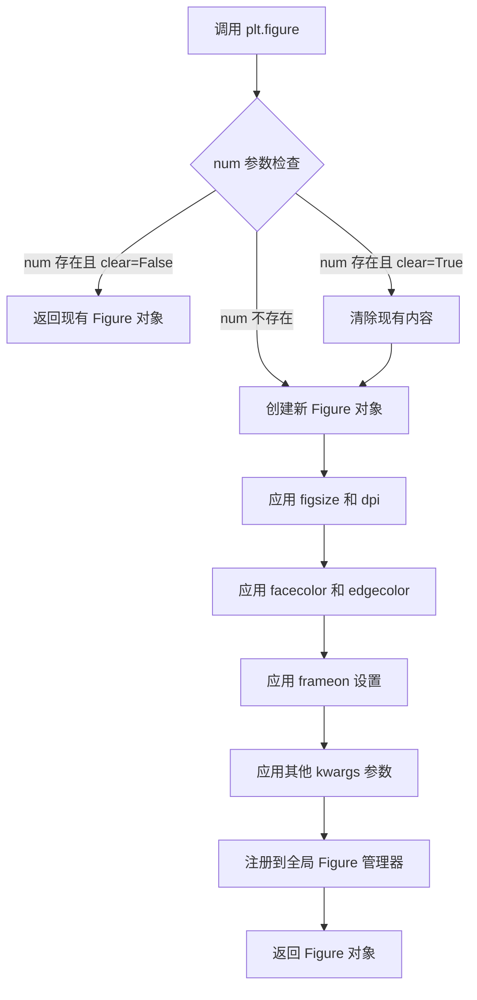
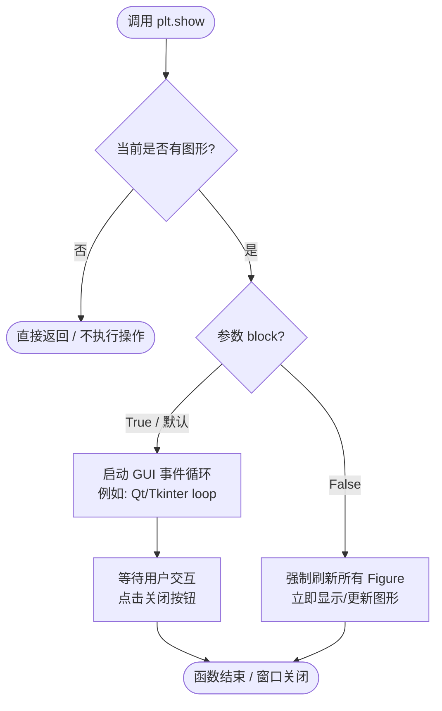
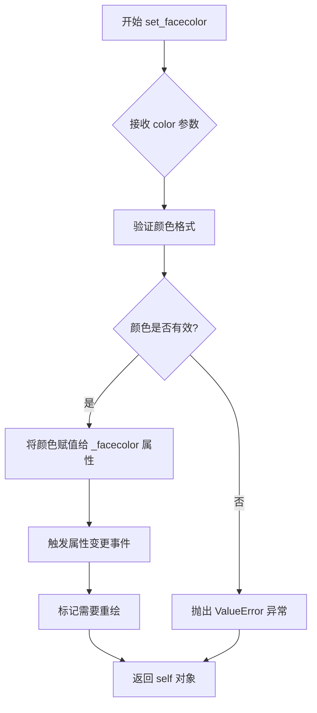
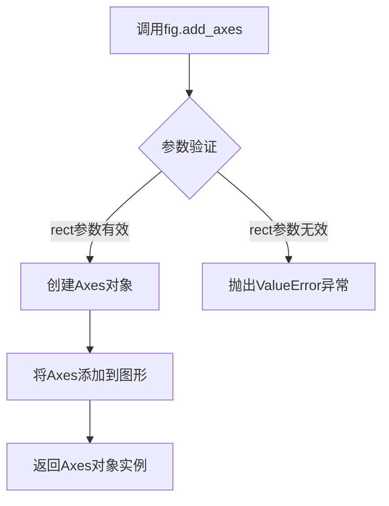
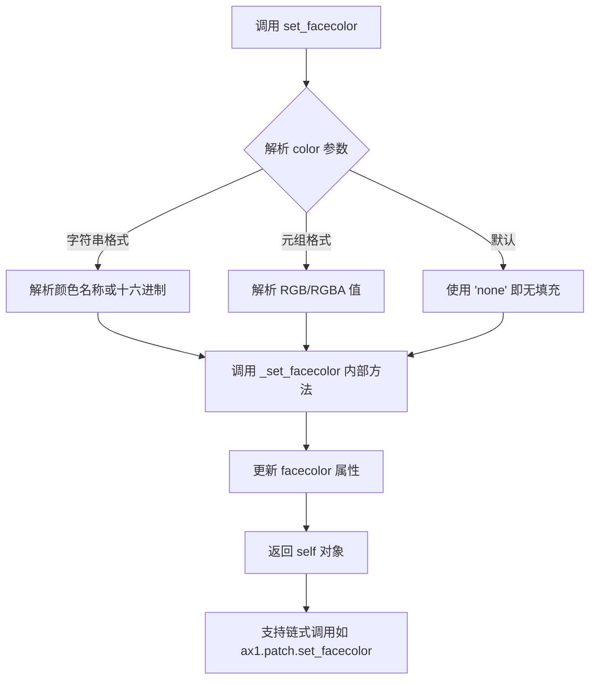
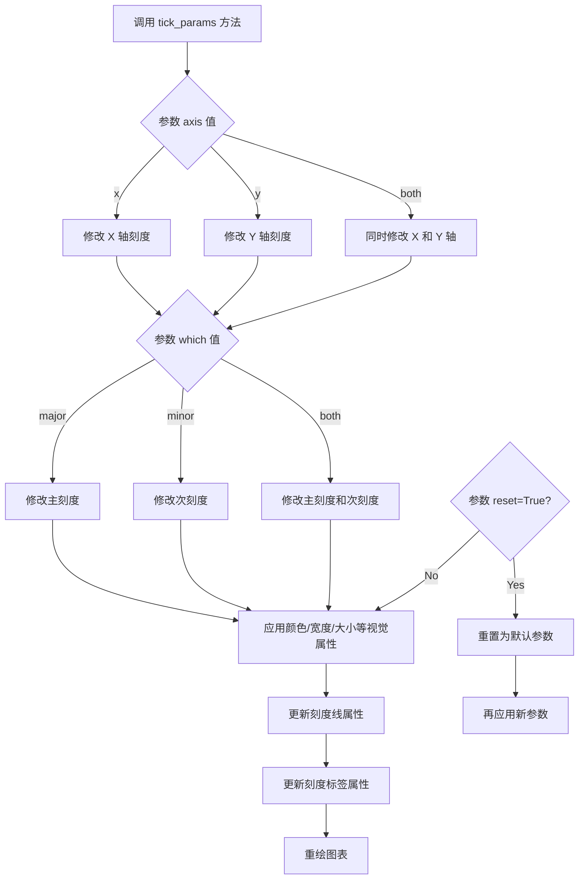
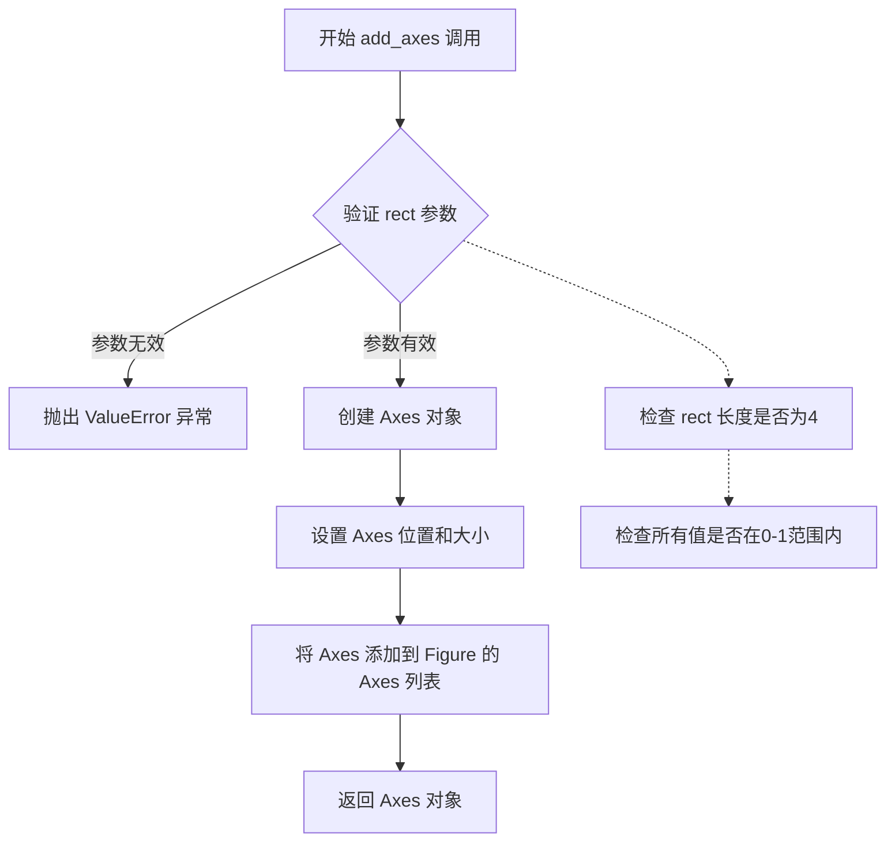
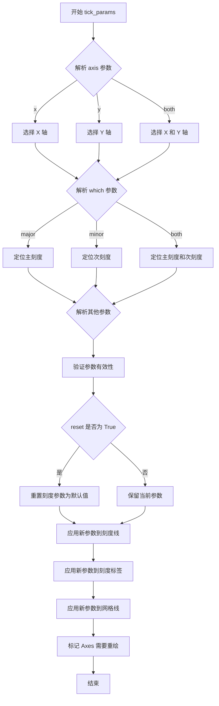

# `matplotlib\galleries\examples\ticks\fig_axes_customize_simple.py` 详细设计文档

该代码是一个matplotlib示例脚本，展示了如何创建一个简单的图表并自定义其背景颜色、坐标轴标签颜色、刻度旋转角度以及刻度线的样式。代码通过plt.figure()创建Figure对象，通过fig.add_axes()创建Axes对象，并使用set_facecolor()和tick_params()方法进行视觉定制，最后调用plt.show()渲染图表。

## 整体流程

```mermaid
graph TD
    A[导入 matplotlib.pyplot] --> B[创建 Figure 对象]
    B --> C[设置 Figure 背景色为浅金黄色]
    C --> D[在 Figure 上添加 Axes 子图]
    D --> E[设置 Axes 背景色为浅石板灰]
    E --> F[配置 X 轴刻度参数]
    F --> G[配置 Y 轴刻度参数]
    G --> H[调用 plt.show() 显示图表]
```

## 类结构

```
matplotlib
├── pyplot (plt)
├── figure.Figure (fig)
└── axes.Axes (ax1)
```

## 全局变量及字段


### `fig`
    
通过 plt.figure() 创建的图表对象，用于管理整个图形

类型：`matplotlib.figure.Figure`
    


### `ax1`
    
通过 fig.add_axes() 创建的坐标轴对象，用于绘制数据和自定义显示

类型：`matplotlib.axes.Axes`
    


### `Figure.patch`
    
Figure 对象的背景补丁，用于设置整个图表的背景颜色

类型：`matplotlib.patches.Patch`
    


### `Axes.patch`
    
Axes 对象的背景补丁，用于设置坐标轴区域的背景颜色

类型：`matplotlib.patches.Patch`
    
    

## 全局函数及方法


### `plt.figure`

创建并返回一个带有可选自定义属性的新图形（Figure）对象。

参数：

- `num`：`int` 或 `str` 或 `None`，图形的编号或标题。如果为 None，则自动递增编号；如果指定编号已存在且 `clear` 为 True，则清除现有图形；否则激活现有图形。
- `figsize`：`tuple[float, float]`，图形尺寸，格式为（宽度，高度），单位为英寸。
- `dpi`：`int` 或 `float`，图形的分辨率（每英寸点数），默认值为 100。
- `facecolor`：`str` 或 `tuple`，图形的背景颜色，支持颜色名称、十六进制颜色码或 RGB 元组。
- `edgecolor`：`str` 或 `tuple`，图形边框颜色。
- `frameon`：`bool`，是否显示图形的框架，默认为 True。
- `FigureClass`：`type`，可选的自定义 Figure 类，默认为 matplotlib 的标准 Figure 类。
- `clear`：`bool`，如果图形已存在，是否清除现有内容，默认为 False。
- `**kwargs`：其他关键字参数，将传递给 Figure 类的构造函数。

返回值：`matplotlib.figure.Figure`，返回创建的图形对象，用于添加子图、设置属性等后续操作。

#### 流程图



#### 带注释源码

```python
# 导入 matplotlib 的 pyplot 模块
import matplotlib.pyplot as plt

# 调用 figure 函数创建新图形
# - 创建空白图形对象
# - 设置背景色为浅金黄色 (lightgoldenrodyellow)
# - 返回 Figure 实例供后续操作
fig = plt.figure()

# 为图形设置背景颜色
# patch 属性返回图形背后的补丁对象 (Patch 对象)
fig.patch.set_facecolor('lightgoldenrodyellow')

# 在图形上创建子图 axes
# 参数 (0.1, 0.3, 0.4, 0.4) 表示 [左, 底, 宽, 高]，所有值范围 0-1
ax1 = fig.add_axes((0.1, 0.3, 0.4, 0.4))

# 设置子图的背景颜色为浅石板灰色
ax1.patch.set_facecolor('lightslategray')

# 自定义 x 轴刻度参数
# - labelcolor: 标签颜色设为红色
# - labelrotation: 标签旋转 45 度
# - labelsize: 标签字体大小设为 16
ax1.tick_params(axis='x', labelcolor='tab:red', labelrotation=45, labelsize=16)

# 自定义 y 轴刻度参数
# - color: 刻度线颜色设为绿色
# - size: 刻度线长度设为 25
# - width: 刻度线宽度设为 3
ax1.tick_params(axis='y', color='tab:green', size=25, width=3)

# 显示图形
# 阻塞程序运行并显示所有创建的图形窗口
plt.show()
```


### `plt.show`

`plt.show` 是 Matplotlib 库中的顶层显示函数，用于将所有当前打开的 Figure（图形）渲染到屏幕上并显示给用户。根据后端和运行环境的不同，它可能阻塞主线程以等待用户交互，也可能仅仅触发图形的更新与显示。

参数：

- `block`：`bool`，可选。控制是否阻塞程序。默认为 `True`（在非交互式环境下阻塞，等待窗口关闭）。

返回值：`None`，无返回值。

#### 流程图



#### 带注释源码

```python
# 在创建了 Figure 和 Axes 并设置好属性后，调用 show() 显示图形
plt.show()
```


### `fig.patch.set_facecolor`

设置 Figure 对象的背景颜色。`fig.patch` 返回一个 `Rectangle`（继承自 `Patch`）对象，调用 `set_facecolor` 方法可将该矩形的填充颜色设置为指定值，支持颜色名称、十六进制颜色、RGB/RGBA 元组等多种格式。该方法返回对象本身以支持链式调用。

参数：

- `color`：`str` 或 `tuple` 或 `None`，要设置的颜色值。可以是颜色名称（如 `'lightgoldenrodyellow'`）、十六进制颜色（如 `'#FF0000'`）、RGB/RGBA 元组（如 `(1.0, 0.0, 0.0, 1.0)`），或 `'none'` 表示透明。

返回值：`matplotlib.patches.Patch`，返回 `Patch` 对象本身，支持链式调用。

#### 流程图



#### 带注释源码

```python
# 源码来自 matplotlib.lib patches.py 中的 Patch.set_facecolor 方法
# 这是一个简化的注释版本

def set_facecolor(self, color):
    """
    设置 Patch 的面颜色（填充颜色）。
    
    参数:
        color : 颜色值，可以是:
            - 字符串: 'red', '#FF0000', 'lightgoldenrodyellow'
            - 元组: (R, G, B) 或 (R, G, B, A)，值范围 0-1
            - 'none' 或 'None': 表示无填充（透明）
    
    返回:
        self : 返回对象本身，支持链式调用
    """
    
    # 如果 color 为 'none'，转换为 None（表示透明）
    if color == 'none':
        color = None
    
    # 调用 _set_facecolor 内部方法进行设置
    self._set_facecolor(color)
    
    # 返回 self 以支持链式调用（如 fig.patch.set_facecolor('red').set_edgecolor('blue')）
    return self


def _set_facecolor(self, color):
    """内部方法，实际设置颜色值"""
    
    # 如果未指定颜色，使用默认颜色
    if color is None:
        color = self._default_facecolor
    
    # 处理颜色值，转换为 RGBA 格式
    # _rgba_tuple 是一个内部方法，将各种颜色格式转换为 RGBA 元组
    self._facecolor = self._rgba_tuple(color)
    
    # 标记属性已更改，触发相关回调
    self.stale_callbackes = True
    
    # 注意：Patch 类使用 stale 属性标记是否需要重绘
    # 当属性变化时，会设置 self.stale = True
    self.stale = True
```

#### 实际调用示例源码

```python
import matplotlib.pyplot as plt

# 创建 Figure 对象
fig = plt.figure()

# fig.patch 返回一个 Rectangle 对象（继承自 Patch）
# 调用 set_facecolor 方法设置背景颜色为浅金黄色
fig.patch.set_facecolor('lightgoldenrodyellow')

# 该方法返回对象本身，支持链式调用
# 下面的写法是等效的：
# fig.patch.set_facecolor('lightgoldenrodyellow').set_edgecolor('black')
```


### `Figure.add_axes`

向图形对象添加一个新的Axes（坐标轴）对象，用于在图形中定义一个子区域来绘制数据。

参数：

- `rect`：`tuple of 4 floats`，定义新Axes在图形中的位置和大小，格式为(left, bottom, width, height)，取值范围通常在0到1之间
- `projection`：`str`，可选，投影类型，默认为None
- `polar`：`bool`，可选，是否使用极坐标，默认为False
- `**kwargs`：可选，关键字参数传递给Axes构造函数

返回值：`matplotlib.axes.Axes`，返回新创建的Axes对象

#### 流程图



#### 带注释源码

```python
# 源代码示例基于matplotlib库
# fig = plt.figure()
# ax1 = fig.add_axes((0.1, 0.3, 0.4, 0.4))

# 1. 创建figure对象
fig = plt.figure()

# 2. 调用add_axes方法添加坐标轴
# 参数rect是一个元组 (left, bottom, width, height)
# left: 坐标轴左侧距离图形左侧的距离（比例）
# bottom: 坐标轴底部距离图形底部的距离（比例）
# width: 坐标轴的宽度（比例）
# height: 坐标轴的高度（比例）
ax1 = fig.add_axes((0.1, 0.3, 0.4, 0.4))

# 3. 设置坐标轴的背景色
ax1.patch.set_facecolor('lightslategray')

# 4. 配置坐标轴的刻度参数
# x轴刻度标签设置
ax1.tick_params(axis='x', labelcolor='tab:red', labelrotation=45, labelsize=16)
# y轴刻度设置
ax1.tick_params(axis='y', color='tab:green', size=25, width=3)

# 5. 显示图形
plt.show()
```


### `Patch.set_facecolor`

设置 Patch（图形块）的面部颜色（背景填充色）。该方法属于 matplotlib 的 Patch 类，用于自定义图形元素的背景颜色。

参数：

-  `color`：字符串 或 元组 或 列表，可选，默认值：'none'（无颜色）
  - 颜色值，支持多种格式：颜色名称（如 'red'）、十六进制（如 '#ff0000'）、RGB/RGBA 元组（如 (1, 0, 0) 或 (1, 0, 0, 0.5)）
-  `**kwargs`：关键字参数
  - 其他传递给 `matplotlib.colors.ColorConverter` 的参数

返回值：`Patch` 对象
- 返回自身（self），支持链式调用

#### 流程图



#### 带注释源码

```python
def set_facecolor(self, color='none'):
    """
    设置 Patch 的面部颜色（填充色）。
    
    参数:
        color: 颜色值，支持以下格式:
            - 颜色名称字符串: 'red', 'blue', 'lightslategray'
            - 十六进制字符串: '#FF0000', '#ABC'
            - RGB/RGBA 元组: (1, 0, 0), (1, 0, 0, 0.5)
            - 'none' 表示无填充（透明）
        
    返回:
        self: 返回 Patch 对象本身，支持链式调用
    """
    self._facecolor = color  # 存储颜色值到内部属性
    self._set_facecolor(color)  # 调用内部方法处理颜色转换
    self.stale = True  # 标记需要重新渲染
    return self  # 返回 self 以支持链式调用
```

**代码中的实际调用示例：**

```python
# 从给定代码中提取的调用
ax1 = fig.add_axes((0.1, 0.3, 0.4, 0.4))  # 创建 Axes 对象
ax1.patch.set_facecolor('lightslategray')  # 设置 Axes 背景色为浅石板灰

# 等效的链式调用（演示返回值用途）
ax1.patch.set_facecolor('lightslategray').set_edgecolor('black')
```


### `matplotlib.axes.Axes.tick_params`

该方法用于修改坐标轴刻度线（tick marks）和刻度标签（tick labels）的外观属性，包括颜色、大小、宽度、旋转角度等，支持同时配置 x 轴或 y 轴的主刻度和次刻度。

参数：

- `axis`：`{'x', 'y', 'both'}`，可选，指定要修改的坐标轴，默认为 'x'
- `which`：`{'major', 'minor', 'both'}`，可选，指定要修改的刻度类型，默认为 'major'
- `reset`：`bool`，可选，是否在修改前重置所有参数为默认值，默认为 False
- `colors`：`dict`，可选，设置刻度线和标签的颜色
- `color`：`str`，可选，设置刻度线的颜色
- `width`：`float`，可选，设置刻度线的宽度
- `size`：`float`，可选，设置刻度线的长度
- `labelcolor`：`str` 或 `color`，可选，设置刻度标签的颜色
- `labelsize`：`float`，可选，设置刻度标签的字体大小
- `labelrotation`：`float`，可选，设置刻度标签的旋转角度
- `gridOn`：`bool`，可选，是否显示网格线
- `tick1On`：`bool`，可选，是否显示第一个刻度线
- `tick2On`：`bool`，可选，是否显示第二个刻度线（刻度线的另一端）
- `label1On`：`bool`，可选，是否显示第一个刻度标签
- `label2On`：`bool`，可选，是否显示第二个刻度标签

返回值：`None`，该方法无返回值，直接修改 Axes 对象的属性

#### 流程图



#### 带注释源码

```python
# 示例代码来源：matplotlib 官方示例
# 文件：fig_axes_customize_simple.py

import matplotlib.pyplot as plt

# 创建一个新的图形窗口
fig = plt.figure()

# 设置整个图形的背景色
fig.patch.set_facecolor('lightgoldenrodyellow')

# 在图形中添加 Axes 对象，参数为 (left, bottom, width, height)
ax1 = fig.add_axes((0.1, 0.3, 0.4, 0.4))

# 设置 Axes 区域的背景色
ax1.patch.set_facecolor('lightslategray')

# ==================== tick_params 方法调用示例 1 ====================
# 修改 X 轴刻度参数
ax1.tick_params(
    axis='x',          # 指定修改 X 轴
    labelcolor='tab:red',    # 设置刻度标签颜色为红色
    labelrotation=45,       # 设置刻度标签旋转 45 度
    labelsize=16            # 设置刻度标签字体大小为 16
)

# ==================== tick_params 方法调用示例 2 ====================
# 修改 Y 轴刻度参数
ax1.tick_params(
    axis='y',          # 指定修改 Y 轴
    color='tab:green',      # 设置刻度线颜色为绿色
    size=25,                # 设置刻度线长度为 25
    width=3                 # 设置刻度线宽度为 3
)

# 显示图形
plt.show()

# ==================== tick_params 方法底层逻辑简述 ====================
# tick_params 方法内部执行流程：
# 1. 解析传入的参数，确定要修改的轴(axis)和刻度类型(which)
# 2. 获取对应的刻度器对象（XAxis 或 YAxis）
# 3. 根据参数更新刻度线属性（如颜色、宽度、长度）
# 4. 根据参数更新刻度标签属性（如颜色、字体大小、旋转角度）
# 5. 设置是否显示刻度线和标签的开关
# 6. 标记 Axes 对象需要重新绘制
# 7. 返回 None
```

#### 关键组件信息

| 组件名称 | 一句话描述 |
|---------|-----------|
| `matplotlib.axes.Axes.tick_params` | 用于自定义坐标轴刻度线和刻度标签外观的核心方法 |
| `matplotlib.pyplot.figure` | 创建图形窗口的函数 |
| `matplotlib.axes.Axes.add_axes` | 向图形添加 Axes 对象的函数 |
| `matplotlib.patches.Patch.set_facecolor` | 设置图形区域背景色的方法 |

#### 潜在技术债务或优化空间

1. **硬编码颜色值**：代码中使用了 `'tab:red'`、`'tab:green'` 等硬编码颜色值，建议提取为配置常量或使用主题系统
2. **魔法数值**：刻度参数中的数值（如 `45`、`16`、`25`、`3`）缺乏注释说明，可读性较差
3. **重复调用 `tick_params`**：两次调用可以合并为一个调用，减少代码冗余
4. **缺乏错误处理**：未对参数边界值进行验证（如负数的 labelrotation）

#### 其它项目

**设计目标与约束**：
- 该示例旨在展示如何自定义坐标轴刻度的外观
- 约束：仅修改视觉属性，不改变数据或刻度位置

**错误处理与异常设计**：
- `axis` 参数仅接受 `'x'`、`'y'`、`'both'`，传入其他值会抛出 `ValueError`
- `which` 参数仅接受 `'major'`、`'minor'`、`'both'`
- 数值参数（如 `width`、`size`）不支持负数，否则可能被忽略或产生未定义行为

**数据流与状态机**：
- 该方法不改变数据状态，仅修改渲染属性
- 调用后需要配合 `plt.show()` 或 `fig.canvas.draw()` 触发重绘

**外部依赖与接口契约**：
- 依赖 `matplotlib` 库（版本 >= 1.0）
- 接口契约：所有参数均为关键字参数（keyword-only），推荐使用关键字形式调用以提高可读性


### `Figure.add_axes`

在 matplotlib 中，`Figure.add_axes` 方法用于在图形中创建一个新的 Axes（坐标轴）对象，并将其添加到图形中。该方法接受一个表示位置和大小的矩形参数，返回创建的 Axes 对象。

参数：

- `rect`：`tuple` 或 `list`，指定 Axes 在 Figure 中的位置和大小，格式为 `[left, bottom, width, height]`，所有值都应在 0 到 1 之间（相对于 Figure 的尺寸）

返回值：`matplotlib.axes.Axes`，返回新创建的 Axes 对象

#### 流程图



#### 带注释源码

```python
# 导入 matplotlib.pyplot 模块
import matplotlib.pyplot as plt

# 创建一个新的 Figure 对象
fig = plt.figure()

# 调用 add_axes 方法创建新的 Axes
# 参数 (0.1, 0.3, 0.4, 0.4) 表示：
#   - left: 0.1   (距左边 10%)
#   - bottom: 0.3 (距底部 30%)
#   - width: 0.4  (宽度 40%)
#   - height: 0.4 (高度 40%)
ax1 = fig.add_axes((0.1, 0.3, 0.4, 0.4))

# 设置 Axes 的背景色
ax1.patch.set_facecolor('lightslategray')

# 配置 x 轴刻度参数
ax1.tick_params(axis='x', labelcolor='tab:red', labelrotation=45, labelsize=16)

# 配置 y 轴刻度参数
ax1.tick_params(axis='y', color='tab:green', size=25, width=3)

# 显示图形
plt.show()
```

#### 关键组件信息

- **Figure 对象**: matplotlib 中的图形容器，可包含一个或多个 Axes
- **Axes 对象**: 坐标轴对象，包含数据绘图、刻度、标签等所有可视化元素
- **patch 对象**: 用于设置 Axes 的背景外观

#### 潜在技术债务与优化空间

1. **错误处理缺失**: 代码中未对 `add_axes` 的返回值进行 None 检查，如果创建失败可能导致后续操作失败
2. **魔法数字**: 位置和大小参数 (0.1, 0.3, 0.4, 0.4) 应定义为常量或配置变量，提高可维护性
3. **缺乏文档注释**: 示例代码缺少对 `rect` 参数各维度含义的说明


### `matplotlib.axes.Axes.tick_params`

该方法用于自定义坐标轴的刻度线（ticks）、刻度标签（tick labels）和刻度网格（grid lines）的外观属性，如颜色、宽度、旋转角度、字体大小等。

参数：

- `axis`：`str`（可选，默认值为 `'both'`），指定要修改的轴，可选值为 `'x'`、`'y'` 或 `'both'`
- `which`：`str`（可选，默认值为 `'major'`），指定要修改的刻度类型，可选值为 `'major'`、`'minor'` 或 `'both'`
- `reset`：`bool`（可选，默认值为 `False`），如果为 `True`，则在应用其他参数之前将所有刻度参数重置为默认值
- `direction`：`str`（可选），刻度方向，可选值为 `'in'`、`'out'` 或 `'inout'`
- `length`：`float`（可选），刻度线长度
- `width`：`float`（可选），刻度线宽度
- `color`：`color`（可选），刻度线颜色
- `pad`：`float`（可选），刻度标签与刻度线之间的间距
- `labelsize`：`float` 或 `str`（可选），刻度标签的字体大小
- `labelcolor`：`color`（可选），刻度标签的颜色
- `labelrotation`：`float`（可选），刻度标签的旋转角度
- `gridOn`：`bool`（可选），是否显示网格线
- `gridColor`：`color`（可选），网格线颜色
- `gridLineWidth`：`float`（可选），网格线宽度
- `gridAlpha`：`float`（可选），网格线透明度
- 其他参数如 `left`, `right`, `top`, `bottom`, `labelleft`, `labelright`, `labeltop`, `labelbottom` 等用于控制刻度线和标签的显示

返回值：`None`，该方法直接修改 Axes 对象的属性，不返回值

#### 流程图



#### 带注释源码

```python
def tick_params(self, axis='both', which='major', reset=False, **kwargs):
    """
    Change the appearance of ticks, tick labels, and gridlines.
    
    Parameters
    ----------
    axis : {'x', 'y', 'both'}, default: 'both'
        The axis to which the parameters are applied.
    
    which : {'major', 'minor', 'both'}, default: 'major'
        The group of ticks for which the parameters are changed.
    
    reset : bool, default: False
        If ``True``, remove all customization before setting parameters.
    
    **kwargs
        Other parameters, including:
        - direction: {'in', 'out', 'inout'}
        - length: float
        - width: float
        - color: color
        - pad: float
        - labelsize: float or str
        - labelcolor: color
        - labelrotation: float
        - gridOn: bool
        - gridColor: color
        - gridLineWidth: float
        - gridAlpha: float
        - left, right, top, bottom: bool
        - labelleft, labelright, labeltop, labelbottom: bool
    
    Examples
    --------
    >>> ax.tick_params(axis='x', labelrotation=45)
    >>> ax.tick_params(axis='y', direction='in', length=10)
    """
    # 如果 reset 为 True，先重置所有刻度参数为默认值
    if reset:
        self._reset_xticks()
        self._reset_yticks()
    
    # 根据 axis 参数选择要修改的轴
    if axis in ['x', 'both']:
        # 应用参数到 X 轴的指定刻度类型（major/minor）
        self._set_tick_params(axis='x', which=which, **kwargs)
    
    if axis in ['y', 'both']:
        # 应用参数到 Y 轴的指定刻度类型（major/minor）
        self._set_tick_params(axis='y', which=which, **kwargs)
    
    # 标记 Axes 需要重绘
    self.stale_callback = None  # 触发重绘回调
    self.stale = True
```


### `Patch.set_facecolor`

设置 Patch（图形补丁）对象的填充颜色，用于自定义图形元素的背景色。

参数：

- `facecolor`：颜色值（str 或 tuple 或 RGBA），要设置的填充颜色，支持颜色名称、十六进制颜色码、RGB 元组或 RGBA 元组
- `alpha`：（可选）浮点数，颜色的透明度，范围 0-1

返回值：`Patch`，返回 Patch 对象本身，支持链式调用

#### 流程图

```mermaid
flowchart TD
    A[开始设置颜色] --> B{检查 alpha 参数}
    B -->|提供 alpha| C[设置全局透明度]
    B -->|未提供 alpha| D{检查 facecolor 参数}
    C --> D
    D -->|facecolor 为 None| E[清除填充颜色]
    D -->|facecolor 有效| F[解析颜色值]
    F --> G[设置内部 _facecolor 属性]
    G --> H[调用 stale() 标记需要重绘]
    E --> I[返回 Patch 对象 self]
    H --> I
```

#### 带注释源码

```python
# matplotlib/patches.py 中的 Patch.set_facecolor 方法

def set_facecolor(self, color):
    """
    设置补丁的填充颜色。
    
    参数:
        color: 颜色值，可以是:
            - 命名字符串: 'red', 'lightgoldenrodyellow'
            - 十六进制: '#FF0000'
            - RGB 元组: (1, 0, 0)
            - RGBA 元组: (1, 0, 0, 0.5)
            - None: 无填充
    """
    self._facecolor = color  # 存储颜色值到内部属性
    self.stale = True  # 标记图形需要重绘
    return self  # 返回自身以支持链式调用
```

#### 使用示例源码

```python
import matplotlib.pyplot as plt

# 创建图形
fig = plt.figure()

# 设置图形背景色为淡金黄色
fig.patch.set_facecolor('lightgoldenrodyellow')

# 添加坐标轴
ax1 = fig.add_axes((0.1, 0.3, 0.4, 0.4))

# 设置坐标轴背景色为浅石板灰
ax1.patch.set_facecolor('lightslategray')

# 自刻度参数
ax1.tick_params(axis='x', labelcolor='tab:red', labelrotation=45, labelsize=16)
ax1.tick_params(axis='y', color='tab:green', size=25, width=3)

# 显示图形
plt.show()
```


## 关键组件


### Figure 对象 (fig)

图形容器对象，通过 matplotlib.pyplot.figure() 创建，用于承载所有绘图元素。

### Patch 对象 (fig.patch)

Figure 对象的背景补丁，通过 set_facecolor() 方法设置图形背景颜色为 'lightgoldenrodyellow'。

### Axes 对象 (ax1)

坐标轴对象，通过 fig.add_axes() 添加，参数 (0.1, 0.3, 0.4, 0.4) 定义了位置和尺寸。

### Patch 对象 (ax1.patch)

Axes 对象的背景补丁，通过 set_facecolor() 方法设置坐标轴背景颜色为 'lightslategray'。

### tick_params 方法 (ax1.tick_params)

用于定制刻度线和刻度标签的样式，接受 axis、labelcolor、labelrotation、labelsize、color、size、width 等参数。


## 问题及建议


### 已知问题

-   **硬编码配置值**：所有配置值（颜色、位置、尺寸、旋转角度）均为硬编码字符串或数字，缺乏可配置性和可维护性
-   **魔法数字**：坐标位置 (0.1, 0.3, 0.4, 0.4) 和尺寸参数缺乏注释说明，难以理解其业务含义
-   **无错误处理**：figure() 和 add_axes() 调用缺乏异常捕获，可能在环境配置不当时失败
-   **重复的 API 调用**：tick_params 针对 x 和 y 轴分别调用，存在代码重复
-   **无文档字符串**：主代码块缺少模块级或函数级文档说明
-   **无资源清理**：未使用 context manager 模式，可能导致资源泄漏风险
-   **图形尺寸未设置**：未指定 figure 的 figsize 参数，使用默认尺寸可能不满足需求

### 优化建议

-   **提取配置常量**：将颜色、位置、尺寸等硬编码值提取为配置字典或类常量，提高可维护性
-   **添加参数化函数**：将绘图逻辑封装为可复用的函数，接收配置参数
-   **增加错误处理**：添加 try-except 块处理可能的 matplotlib 异常
-   **使用 with 语句**：采用 `with plt.figure() as fig:` 模式确保资源正确释放
-   **添加类型标注**：为函数参数和返回值添加类型提示，提高代码可读性和 IDE 支持
-   **合并 tick_params 调用**：考虑将相同样式的 tick_params 参数合并或使用统一的配置对象
-   **设置图形尺寸**：显式指定 figsize 参数以确保跨平台一致性


## 其它


### 设计目标与约束

本示例的设计目标是演示如何使用matplotlib API自定义图表的各个视觉元素，包括背景色、标签颜色、刻度大小等。约束条件为：仅使用matplotlib官方库，代码简洁易懂，适合作为入门教程。

### 错误处理与异常设计

本代码未实现显式的错误处理机制。潜在异常场景包括：无效的颜色值（如不存在的颜色名称）、无效的坐标参数（如超出0-1范围的axes参数）、无效的tick参数值等。这些异常会由matplotlib底层抛出，建议在实际应用中增加参数验证逻辑。

### 数据流与状态机

数据流：用户设置参数 → plt.figure()创建Figure对象 → fig.add_axes()创建Axes对象 → 通过set_facecolor()和tick_params()修改Axes属性 → plt.show()渲染显示。状态机包含：Figure创建状态 → Axes添加状态 → 属性配置状态 → 渲染显示状态。

### 外部依赖与接口契约

外部依赖：matplotlib>=3.5.0。核心接口契约：plt.figure()返回Figure对象，fig.add_axes()返回Axes对象，set_facecolor()接受颜色字符串或RGB元组，tick_params()接受axis、labelcolor、labelrotation、labelsize、color、size、width等参数。

### 性能考量

当前代码性能开销最小，仅涉及单次Figure和Axes创建。优化建议：若需要创建多个相似图表，可考虑复用Figure对象；避免在循环中频繁调用plt.show()，而是使用plt.savefig()批量保存。

### 安全性考虑

代码本身无安全风险，不涉及用户输入、网络请求或文件操作。潜在风险：使用不推荐的颜色名称可能导致警告，建议使用标准的颜色规范（如十六进制RGB）。

### 可维护性分析

代码结构简单清晰，但硬编码了所有参数值，缺乏灵活性。建议将可配置参数提取为常量或配置文件，便于后期维护和样式主题切换。

### 测试策略

建议测试用例：验证Figure和Axes对象创建成功、验证set_facecolor()参数生效、验证tick_params()各参数效果、验证plt.show()不抛出异常。可使用pytest-mock辅助测试。

### 部署和运行环境

运行环境：Python 3.8+，matplotlib 3.5.0+。部署方式：可直接作为独立脚本运行，或嵌入到Jupyter Notebook中作为示例展示。

### 配置管理

当前代码无配置文件，所有参数硬编码。建议在生产环境中使用配置文件（如config.yaml或settings.py）管理图表样式主题，支持多套样式切换。

    