# `matplotlib\galleries\examples\ticks\multilevel_ticks.py` 详细设计文档

该脚本展示了如何使用Matplotlib的secondary_xaxis功能在图表上创建多级（嵌套）刻度标签，用于显示日期的日月分组、类别的二级分类等场景。

## 整体流程

```mermaid
graph TD
    A[开始] --> B[导入依赖库]
B --> C[示例1: 数字序列的次级标签]
C --> C1[创建图表和主轴]
C1 --> C2[绘制30个数据点]
C2 --> C3[创建secondary_xaxis在底部]
C3 --> C4[设置次级刻度位置和标签（Oughts/Teens/Twenties）]
C --> D[示例2: 分类轴的次级标签]
D --> D1[创建分类数据图表]
D1 --> D2[创建第一个secondary_xaxis显示动物大类（Mammals/Reptiles/Birds）]
D2 --> D3[创建第二个secondary_xaxis显示类间分隔线]
D --> E[示例3: 日期轴的次级标签]
E --> E1[创建日期范围数据（2020-01-01至2020-03-31）]
E1 --> E2[设置主轴显示日期（%d格式）]
E2 --> E3[创建secondary_xaxis在location=-0.075处]
E3 --> E4[设置次级轴月份定位器和格式化器]
E4 --> E5[隐藏次级轴边框]
E --> F[调用plt.show()显示图表]
F --> G[结束]
```

## 类结构

```
无自定义类（脚本文件）
└── 使用Matplotlib内置类：
    ├── Axes (主坐标轴)
    ├── secondary_xaxis (次级坐标轴)
    ├── DateFormatter (日期格式化)
    └── MonthLocator (月份定位器)
```

## 全局变量及字段


### `rng`
    
随机数生成器，种子为19680801，用于生成示例数据

类型：`numpy.random.Generator`
    


### `fig`
    
图表容器对象，用于承载整个图形

类型：`matplotlib.figure.Figure`
    


### `ax`
    
主坐标轴对象，用于绘制主数据曲线

类型：`matplotlib.axes.Axes`
    


### `sec`
    
第一个次级x轴对象，用于显示分组标签（如Oughts、Teens、Twenties或月份）

类型：`matplotlib.axis.XAxis`
    


### `sec2`
    
第二个次级x轴对象，用于在分类轴上绘制类间分隔线

类型：`matplotlib.axis.XAxis`
    


### `time`
    
日期时间数组，包含2020-01-01至2020-03-31的连续日期

类型：`numpy.ndarray`
    


    

## 全局函数及方法


### `np.random.default_rng`

创建并返回一个基于新算法的随机数生成器实例，用于生成随机数。

参数：

- `seed`：`int` 或 `array_like` 或 `None`，可选，随机数生成器的种子值，用于初始化随机数生成器的内部状态。默认为 `None`。

返回值：`numpy.random.Generator`，返回一个新的随机数生成器实例。

#### 流程图

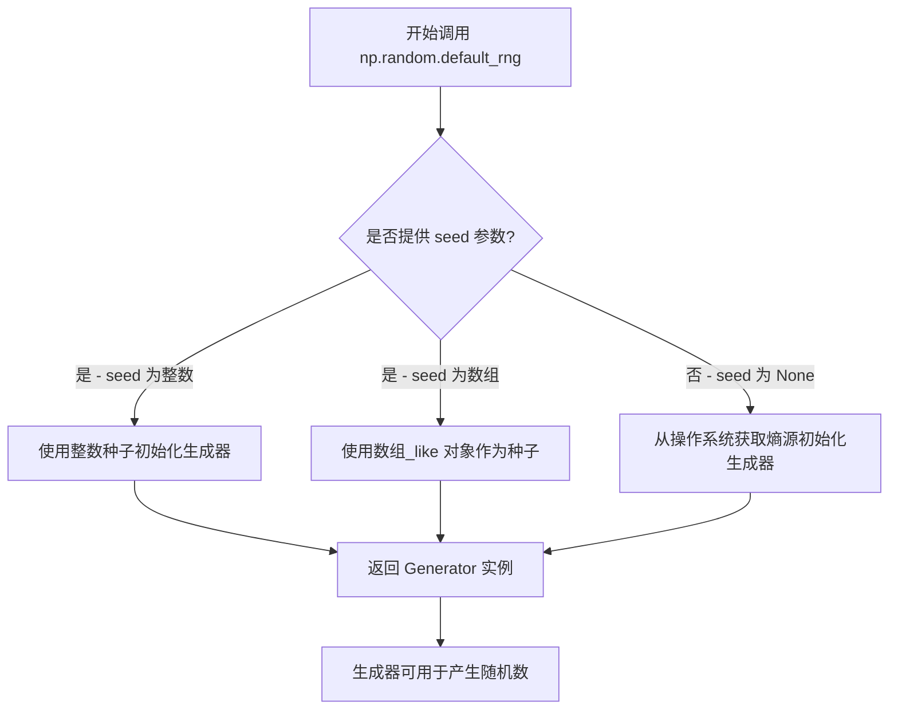

#### 带注释源码

```python
# 导入 numpy 库（代码中已导入）
import numpy as np

# 使用固定种子 19680801 创建随机数生成器
# seed: 整数类型，作为随机数生成器的初始化种子
# 返回值: Generator 对象，后续用于生成随机数
rng = np.random.default_rng(19680801)

# 生成的 rng 对象可以调用以下方法：
# - rng.random(size) - 生成 [0, 1) 范围内的随机浮点数
# - rng.normal(size) - 生成正态分布随机数
# - rng.integers(low, high, size) - 生成指定范围内的整数
# - 等等...
```


### `plt.subplots()`

`plt.subplots()` 是 matplotlib 库中的核心函数，用于创建一个新的图表（Figure）和一个或多个坐标轴（Axes），返回一个包含图表和坐标轴的元组，支持灵活的子图布局配置。

参数：

- `nrows`：`int`，默认值：1，子图网格的行数
- `ncols`：`int`，默认值：1，子图网格的列数
- `sharex`：`bool` 或 `{'row', 'col'}`，默认值：False，是否共享x轴
- `sharey`：`bool` 或 `{'row', 'col'}`，默认值：False，是否共享y轴
- `squeeze`：`bool`，默认值：True，是否压缩返回的Axes数组维度
- `width_ratios`：`array-like`，长度等于 ncols，子图列宽比
- `height_ratios`：`array-like`，长度等于 nrows，子图行高比
- `subplot_kw`：字典，默认：{}，传递给每个 add_subplot 的关键字参数
- `gridspec_kw`：字典，默认：{}，传递给 GridSpec 的关键字参数
- `**fig_kw`：任意关键字参数，传递给 figure() 函数的关键字参数

返回值：`tuple(Figure, Axes or array of Axes)`，返回一个元组，第一个元素是 Figure 对象，第二个元素是 Axes 对象（当 nrows=1 且 ncols=1 时）或 Axes 数组（当有多个子图时）

#### 流程图

```mermaid
flowchart TD
    A[开始 plt.subplots] --> B{传入参数}
    B --> C[创建 Figure 对象<br>fig_kw 参数]
    D[计算子图网格布局<br>gridspec_kw 参数]
    C --> E[创建 GridSpec 对象]
    D --> E
    E --> F{遍历 nrows x ncols}
    F -->|是| G[创建子图 Axes 对象<br>subplot_kw 参数]
    G --> H{共享设置}
    H -->|sharex| I[配置共享x轴]
    H -->|sharey| J[配置共享y轴]
    I --> F
    J --> F
    F -->|否| K{squeeze 设置}
    K -->|True 且 1D| L[返回单 Axes 对象]
    K -->|False 或 多维| M[返回 Axes 数组]
    L --> N[返回 (fig, ax) 元组]
    M --> N
    N --> O[结束]
```

#### 带注释源码

```python
def subplots(nrows=1, ncols=1, sharex=False, sharey=False, 
             squeeze=True, width_ratios=None, height_ratios=None,
             subplot_kw=None, gridspec_kw=None, **fig_kw):
    """
    创建图表和坐标轴的便捷函数。
    
    参数:
        nrows: 子图网格的行数，默认为1
        ncols: 子图网格的列数，默认为1
        sharex: 是否共享x轴，可选True/False/'row'/'col'
        sharey: 是否共享y轴，可选True/False/'row'/'col'
        squeeze: 是否压缩返回的Axes数组维度
        width_ratios: 子图列宽比数组
        height_ratios: 子图行高比数组
        subplot_kw: 传递给add_subplot的参数字典
        gridspec_kw: 传递给GridSpec的参数字典
        **fig_kw: 传递给figure函数的额外参数
    
    返回值:
        fig: Figure对象 - 图表容器
        ax: Axes对象或Axes数组 - 坐标轴对象
    """
    
    # 1. 创建Figure对象
    fig = figure(**fig_kw)
    
    # 2. 创建GridSpec网格规范对象
    gs = GridSpec(nrows, ncols, width_ratios=width_ratios, 
                  height_ratios=height_ratios, **gridspec_kw)
    
    # 3. 创建子图并获取Axes对象
    axarr = np.empty((nrows, ncols), dtype=object)
    
    # 遍历每个子图位置
    for i in range(nrows):
        for j in range(ncols):
            # 创建子图，获取Axes对象
            kw = {}
            if subplot_kw:
                kw.update(subplot_kw)
            ax = fig.add_subplot(gs[i, j], **kw)
            axarr[i, j] = ax
            
            # 配置共享轴
            if sharex:
                if sharex == 'row':
                    # 同一行共享x轴
                    if i > 0:
                        ax.sharex(axarr[i-1, j])
                elif sharex == 'col':
                    # 同一列共享x轴
                    if j > 0:
                        ax.sharex(axarr[i, j-1])
                elif sharex is True:
                    # 所有子图共享x轴
                    if i > 0 or j > 0:
                        ax.sharex(axarr[0, 0])
            
            if sharey:
                # 类似逻辑配置sharey
                pass
    
    # 4. 根据squeeze参数处理返回值
    if squeeze:
        # 压缩维度：单行或单列时返回1D数组
        if nrows == 1 and ncols == 1:
            # 特殊情况：返回单个Axes对象而非数组
            return fig, axarr[0, 0]
        elif nrows == 1 or ncols == 1:
            # 返回一维数组
            return fig, axarr.ravel()[()]
    
    # 5. 返回Figure和Axes数组
    return fig, axarr
```


### `Axes.plot`

`Axes.plot` 是 Matplotlib 中用于在 Axes 对象上绘制线条或标记的核心方法。它接受可变数量的数据参数和格式化字符串，支持多种绘图样式，并能自动处理数据缩放和坐标轴设置。

参数：

- `*args`：可变参数，支持以下几种调用方式：
  - `y`：一维数组或列表，表示 y 轴数据，x 轴自动生成索引
  - `x, y`：两个数组或列表，分别表示 x 和 y 轴数据
  - `x, y, fmt`：格式字符串，如 `'o-'` 表示圆形标记和实线
- `**kwargs`：关键字参数，用于控制 Line2D 对象的属性，如 `color`（颜色）、`linewidth`（线宽）、`marker`（标记样式）等

返回值：`list of matplotlib.lines.Line2D`，返回一个包含所有绘制的线条/标记对象的列表

#### 流程图

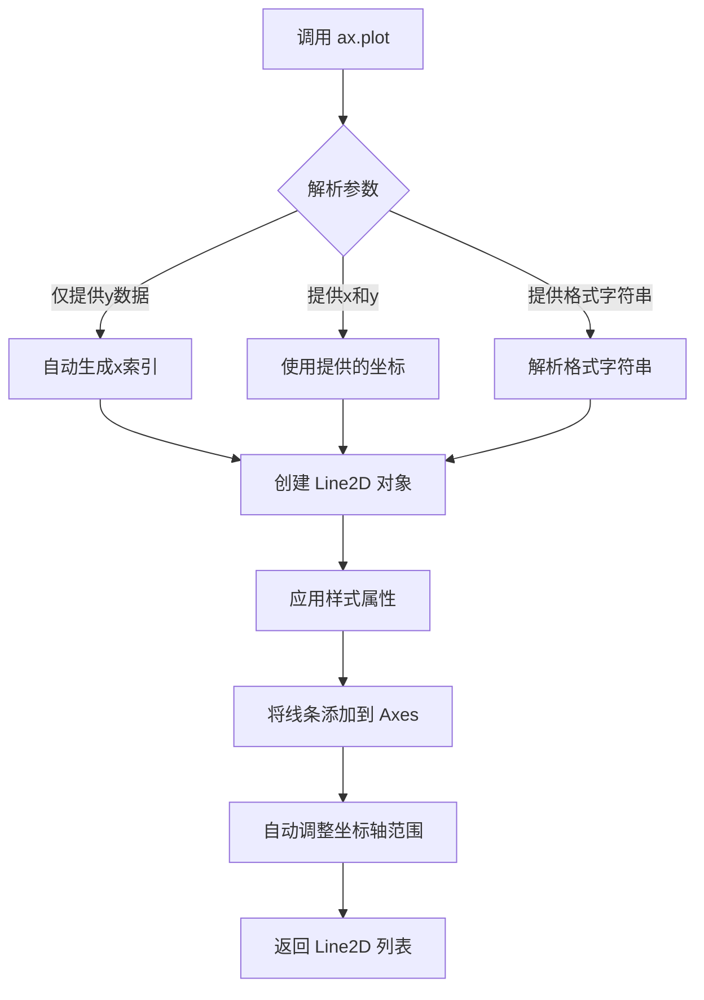

#### 带注释源码

```python
def plot(self, *args, **kwargs):
    """
    Plot y versus x as lines and/or markers.

    Parameters
    ----------
    *args : varargs
        The possible calls are:
        
        - ``plot(y)``: Plot y using x as index array 0..N-1
        - ``plot(x, y)``: Plot x and y
        - ``plot(x, y, format_string)``: Plot x and y using given format string
        
    **kwargs : kwargs
        Line2D properties, optional. 
        All keyword arguments are passed to the Line2D constructor:
        
        - agg_filter: a filter function
        - alpha: float (0.0 transparent through 1.0 opaque)
        - animated: bool
        - antialiased or aa: bool
        - clip_box: Bbox
        - clip_on: bool
        - color or c: color
        - contains: callable
        - dash_capstyle: {'butt', 'round', 'projecting'}
        - dash_joinstyle: {'miter', 'round', 'bevel'}
        - dashes: sequence of on/off ink in points
        - data: 2D array-like
        - figure: Figure
        - label: object
        - linestyle or ls: {'-', '--', '-.', ':', '', (offset, on-off-seq), ...}
        - linewidth or lw: float
        - marker: marker style
        - markeredgecolor or mec: color
        - markeredgewidth or mew: float
        - markerfacecolor or mfc: color
        - markersize or ms: float
        - markevery: int or tuple or bool
        - picker: float or callable
        - pickradius: float
        - solid_capstyle: {'butt', 'round', 'projecting'}
        - solid_joinstyle: {'miter', 'round', 'bevel'}
        - url: string
        - visible: bool
        - xdata: 1D array
        - ydata: 1D array
        - zorder: float

    Returns
    -------
    lines : list of Line2D
        A list of lines representing the plotted data.

    Other Parameters
    ----------------
    scalex, scaley : bool
        Indicates if the view limits should be adjusted to the data limits.
        These values are retrieved from the scale member of the axes.

    Notes
    -----
    This method is a wrapper to the `.Line2D` constructor to simplify common
    plotting tasks. For full control of the line styles and properties, it
    is recommended to directly use `.Line2D`.
    
    The format string can be any combination of the following:
    
    - Line styles: '-', '--', '-.', ':', 'None', ' ', ''
    - Colors: single character (b, g, r, c, m, y, k, w) or 
      tuple (rgb) or hex string
    - Markers: '.', 'o', 'x', '+', 'P', '*', 's', 'D', 'd', 'p', 
      'h', 'H', 'v', '^', '<', '>', '1', '2', '3', '4', '|', '_'
    
    Examples
    --------
    >>> plot([1, 2, 3], [1, 2, 3], 'o-')  # plot y vs x with circle markers
    >>> plot([1, 2, 3], [1, 4, 9], 's')   # plot y vs x with square markers
    """
    # 获取axes的scale属性，用于后续坐标轴范围调整
    scalex = kwargs.pop('scalex', True)
    scaley = kwargs.pop('scaley', True)
    
    # 处理格式字符串（如果提供）
    if args:
        # 解析位置参数，提取数据点和格式字符串
        ...
    
    # 创建Line2D对象
    lines = []
    for idx, data in enumerate(args):
        # 如果只有一个参数，假设它是y数据
        if len(args) == 1:
            x = np.arange(len(data))
            y = data
        # 如果有两个参数，分别是x和y
        elif len(args) == 2:
            x, y = args
        # 如果有三个参数，第三个是格式字符串
        elif len(args) == 3:
            x, y, fmt = args
            # 解析格式字符串并应用到kwargs
            ...
        
        # 创建Line2D对象
        line = Line2D(x, y, **kwargs)
        lines.append(line)
        
        # 将线条添加到axes
        self.add_line(line)
    
    # 自动调整坐标轴范围以适应数据
    if scalex:
        self.autoscale_view()
    if scaley:
        self.autoscale_view()
        
    return lines
```


### `Axes.secondary_xaxis`

在 matplotlib 中，`secondary_xaxis` 是 `Axes` 类的一个方法，用于创建次级 X 坐标轴。该方法允许在主坐标轴的顶部或底部添加额外的坐标轴，常用于在同一图表中显示不同尺度的数据或添加分层标签（如月份和日期）。

参数：

- `location`：字符串或浮点数，指定次级坐标轴的位置。对于 X 轴，可选值为 `'top'`（顶部）、`'bottom'`（底部）或 0 到 1 之间的浮点数（表示相对于 Axes 的位置）。
- `functions`：可选参数，两个函数的元组 `((forward, inverse))`，用于在主坐标轴和次级坐标轴之间进行坐标转换。`forward` 函数将主坐标轴的值转换为次级坐标轴的值，`inverse` 函数进行反向转换。
- `**kwargs`：其他关键字参数，将传递给创建的 `SecondaryAxis` 对象，用于自定义次级坐标轴的属性（如刻度样式、标签等）。

返回值：`SecondaryAxis`，返回创建的次级坐标轴对象，后续可以对其调用如 `set_xticks`、`set_xlabel` 等方法进行配置。

#### 流程图

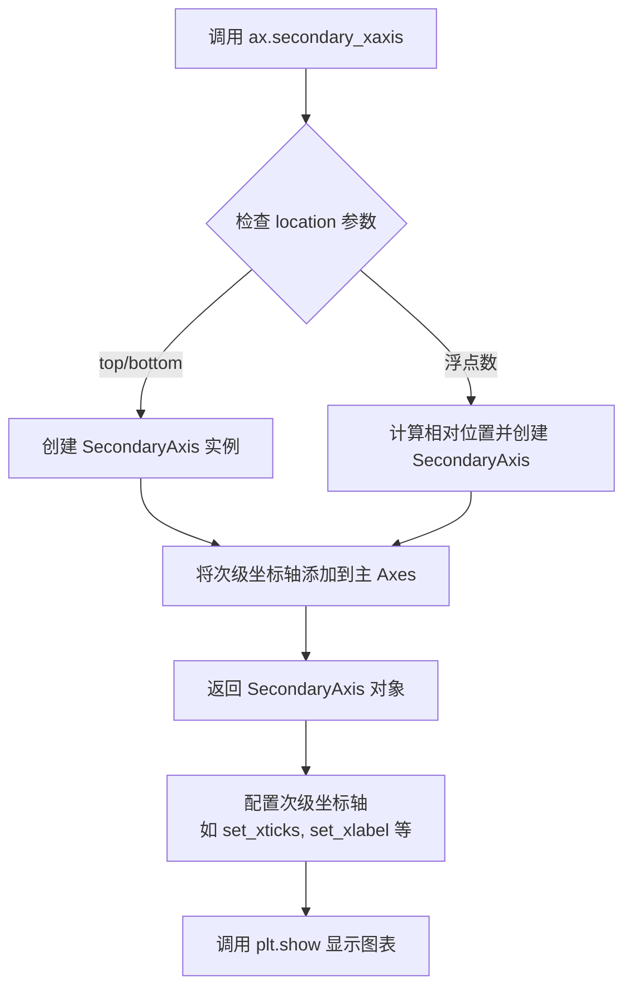

#### 带注释源码

```python
# 从给定的代码示例中提取的 secondary_xaxis 使用方式

# 示例 1：在底部创建次级 X 轴，位置为 0（底部）
sec = ax.secondary_xaxis(location=0)
# 设置次级 X 轴的刻度位置和标签
# 标签前的换行符使次级标签显示在主刻度标签的下方
sec.set_xticks([5, 15, 25], labels=['\nOughts', '\nTeens', '\nTwenties'])

# 示例 2：在分类轴上添加次级标签
# 创建次级 X 轴用于显示动物分类（Mammals, Reptiles, Birds）
sec = ax.secondary_xaxis(location=0)
sec.set_xticks([1, 3.5, 6.5], labels=['\n\nMammals', '\n\nReptiles', '\n\nBirds'])
# 隐藏次级轴的刻度线
sec.tick_params('x', length=0)

# 创建第二个次级 X 轴用于显示分类之间的分割线
sec2 = ax.secondary_xaxis(location=0)
sec2.set_xticks([-0.5, 2.5, 4.5, 8.5], labels=[])
sec2.tick_params('x', length=40, width=1.5)

# 示例 3：用于日期显示的次级轴
# 在底部下方创建次级 X 轴，位置为 -0.075（Axes 外部）
sec = ax.secondary_xaxis(location=-0.075)
# 设置月份定位器，自动定位每月第一天
sec.xaxis.set_major_locator(mdates.MonthLocator(bymonthday=1))
# 设置月份格式化器，添加空格对齐
sec.xaxis.set_major_formatter(mdates.DateFormatter('  %b'))
sec.tick_params('x', length=0)
# 隐藏次级轴的边框
sec.spines['bottom'].set_linewidth(0)
# 为次级轴设置标签
sec.set_xlabel('Dates (2020)')
```


### `Axes.set_xticks()`

设置次级 x 轴（或主轴）的刻度位置和可选的刻度标签，用于在图表上显示分组的刻度线。

参数：

- `ticks`：`list[float]` 或 `list[int]`，刻度位置列表，指定在哪些 x 坐标位置放置刻度线
- `labels`：`list[str]`（可选），刻度标签列表，为每个刻度位置指定显示的文本标签，默认值为 `None`

返回值：`list`，返回实际设置的刻度位置数组

#### 流程图

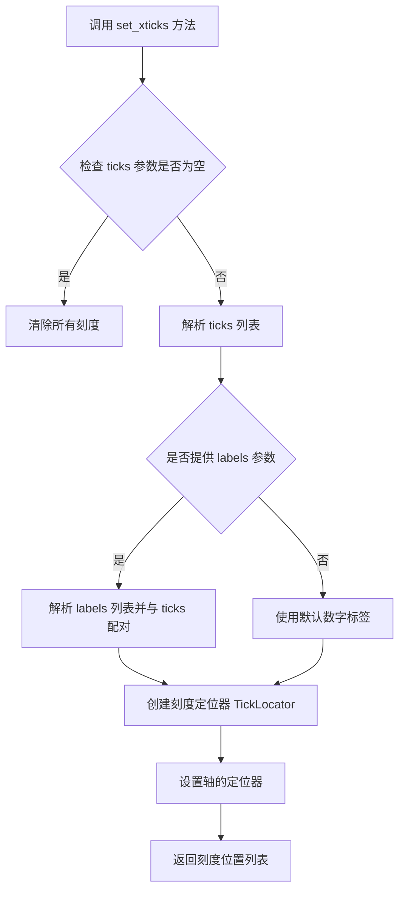

#### 带注释源码

```python
def set_xticks(self, ticks, labels=None, *, minor=False):
    """
    设置 x 轴的刻度位置和标签。
    
    参数:
        ticks: 刻度位置列表，如 [5, 15, 25]
        labels: 可选的刻度标签列表，如 ['\\nOughts', '\\nTeens', '\\nTwenties']
        minor: 是否设置次要刻度，默认为 False
    
    返回:
        list: 实际设置的刻度位置
    """
    # 获取或创建 x 轴的定位器
    if minor:
        locator = self.xaxis.get_minorticklocs()
    else:
        locator = self.xaxis.get_ticklocs()
    
    # 将输入的刻度位置转换为数组
    ticks = np.asarray(ticks)
    
    # 如果提供了标签，则创建刻度标签
    if labels is not None:
        # 验证 ticks 和 labels 长度匹配
        if len(ticks) != len(labels):
            raise ValueError("The length of ticks and labels must match")
        
        # 设置刻度位置
        self.xaxis.set_ticks(ticks, minor=minor)
        # 设置对应的标签
        self.xaxis.set_ticklabels(labels, minor=minor)
    else:
        # 仅设置刻度位置，使用默认标签
        self.xaxis.set_ticks(ticks, minor=minor)
    
    # 返回实际设置的刻度位置
    return self.xaxis.get_ticklocs(minor=minor)
```


### `sec.tick_params`

设置次坐标轴（secondary_xaxis）的刻度参数，如刻度线的长度、宽度等。

参数：
- `axis`：字符串，表示要设置参数的轴，可选 'x'、'y' 或 'both'。在代码中传入的是 'x'。
- `length`：浮点数，表示刻度线的长度。代码中传入值为 0 或 40。
- `width`：浮点数，表示刻度线的宽度。代码中传入值为 1.5。
- `**：其他可选参数，如颜色、标签大小等，但在代码中未使用。

返回值：`None`，该方法无返回值。

#### 流程图

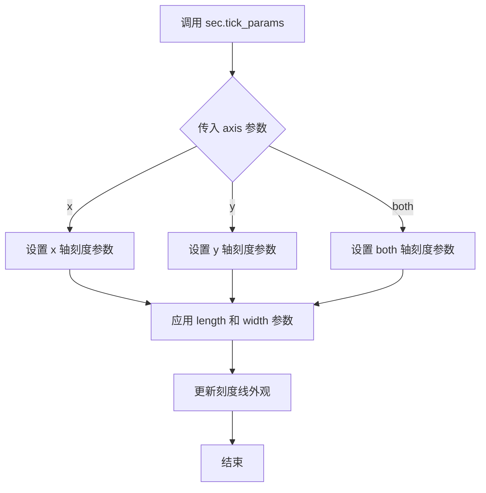

#### 带注释源码

```python
# 第二个例子中：设置刻度线长度为0，隐藏刻度线
sec.tick_params('x', length=0)

# 第二个例子中：设置刻度线长度为40，宽度为1.5
sec2.tick_params('x', length=40, width=1.5)

# 第三个例子中：设置刻度线长度为0，隐藏刻度线
sec.tick_params('x', length=0)
```


### `Axes.set_xlim`

设置 Axes 对象的 x 轴显示范围（最小值和最大值）。该方法用于控制图表中 x 轴的数据可视区间，可以只设置左边界或右边界，也可以同时设置两个边界。

参数：

- `left`：`float` 或 `None`，x 轴范围的左边界（最小值）。如果为 `None`，则保持当前值
- `right`：`float` 或 `None`，x 轴范围的右边界（最大值）。如果为 `None`，则保持当前值

返回值：`tuple`，返回新的 x 轴范围 `(left, right)`

#### 流程图

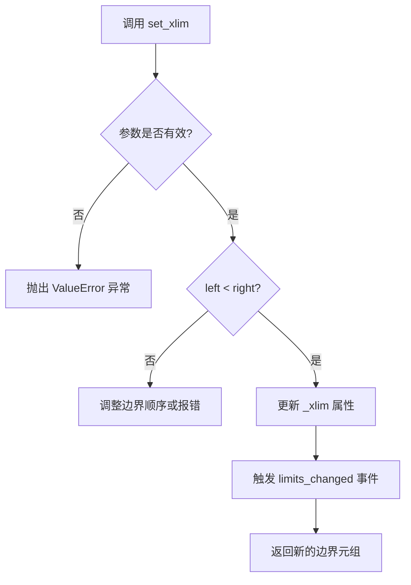

#### 带注释源码

```python
def set_xlim(self, left=None, right=None, emit=False, auto=False, *, left=None, right=None):
    """
    设置 x 轴的范围。

    参数:
        left: float, optional
            x 轴的左边界（最小值）。如果为 None，则保持当前左边界不变。
        right: float, optional
            x 轴的右边界（最大值）。如果为 None，则保持当前右边界不变。
        emit: bool, default: False
            如果为 True，当限制发生变化时触发 'xlims_changed' 事件。
        auto: bool, default: False
            如果为 True，允许自动调整视图边界。

    返回:
        tuple[float, float]
            新的 x 轴范围 (left, right)。

    示例:
        >>> ax.set_xlim(0, 10)  # 设置 x 轴范围为 0 到 10
        >>> ax.set_xlim(left=0)  # 仅设置左边界
        >>> ax.set_xlim(right=100)  # 仅设置右边界
    """
    # 如果只提供了一个边界参数
    if left is not None and right is None:
        # 解析参数：将单个值作为左边界
        left, right = left, self._xlim[1]
    elif left is None and right is not None:
        # 仅设置右边界
        left = self._xlim[0]
    elif left is None and right is None:
        # 两个参数都为 None，返回当前范围
        return self._xlim

    # 验证边界有效性：左边界必须小于右边界
    if left > right:
        raise ValueError(
            f"初始值必须小于结束值: {left} > {right}")

    # 更新内部属性
    self._xlim = (left, right)

    # 如果 emit 为 True，通知监听者范围已更改
    if emit:
        self.callbacks.process('xlims_changed', self)

    # 返回新的范围元组
    return (left, right)
```


### `matplotlib.axis.Axis.set_major_formatter`

设置主轴（X轴或Y轴）的主要刻度格式化器，用于控制刻度标签的显示格式。

参数：

- `formatter`：`matplotlib.ticker.Formatter`，格式化器对象，负责将刻度值转换为字符串标签。例如 `mdates.DateFormatter('%d')` 用于格式化日期为日期数字，`mdates.DateFormatter('%b')` 用于格式化月份名称。

返回值：`matplotlib.ticker.Formatter`，返回之前设置的格式化器对象，如果之前没有设置则返回 `None`。

#### 流程图

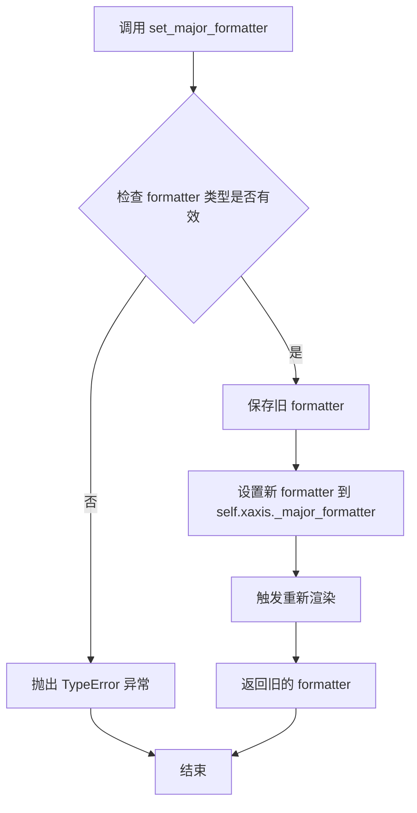

#### 带注释源码

```python
# 源代码位于 lib/matplotlib/axis.py 中的 Axis 类

def set_major_formatter(self, formatter):
    """
    Set the formatter for the major ticks.

    Parameters
    ----------
    formatter : `.ticker.Formatter`
        The formatter to use for the major ticks.

    Returns
    -------
    `.ticker.Formatter`
        The previous formatter.
    """
    # 检查 formatter 是否为有效的 Formatter 实例
    # 如果不是，则抛出 TypeError
    if not isinstance(formatter, mticker.Formatter):
        raise TypeError(
            "formatter must be a Formatter instance, got %s instead"
            % type(formatter).__name__
        )
    
    # 获取当前已有的 formatter（可能为 None）
    # _major_formatter 存储主刻度的格式化器
    old_formatter = self._major_formatter
    
    # 设置新的格式化器
    self._major_formatter = formatter
    
    # 将 formatter 绑定到 axis，这样 formatter 可以访问 axis 的属性
    # 例如获取数据范围等信息用于格式化
    formatter.set_axis(self)
    
    # 标记刻度需要重新计算
    # 这会触发下一次的刻度重新计算和标签重绘
    self.stale = True
    
    # 返回旧的 formatter 以便调用者可以恢复
    return old_formatter
```

#### 使用示例（来自代码）

```python
# 示例 1: 格式化日期为天数
# ax 是主 axes 对象，xaxis 是 X 轴
# '%d' 格式表示日期数字（01-31）
ax.xaxis.set_major_formatter(mdates.DateFormatter('%d'))

# 示例 2: 在二级轴上格式化月份
# sec 是通过 secondary_xaxis() 创建的二级 X 轴
# '%b' 格式表示月份缩写（Jan-Dec）
sec.xaxis.set_major_formatter(mdates.DateFormatter('  %b'))
```

#### 补充说明

- **格式化器类型**：必须传入 `matplotlib.ticker.Formatter` 的子类实例，如 `DateFormatter`、`StrMethodFormatter`、`ScalarFormatter` 等
- **作用对象**：可以作用于主轴（`ax.xaxis`）或次级轴（`sec.xaxis`）
- **重新渲染**：设置新的格式化器后，会将 `stale` 标记为 `True`，这会触发 matplotlib 在下次绘制时重新计算刻度和标签
- **格式化器绑定**：格式化器通过 `set_axis()` 方法绑定到 axis，这样可以获取 axis 的相关属性（如数据范围、刻度位置等）


### `Axis.set_major_locator`

设置次级轴（secondary axis）的主定位器（major locator），用于自动确定主刻度线的位置。

参数：

-  `locator`：`matplotlib.ticker.Locator`（或子类实例），定位器对象，用于计算刻度位置。在代码中传入的是 `mdates.MonthLocator(bymonthday=1)`，表示每月第一天作为一个主刻度。

返回值：`None`，该方法直接修改轴的定位器属性，不返回任何值。

#### 流程图

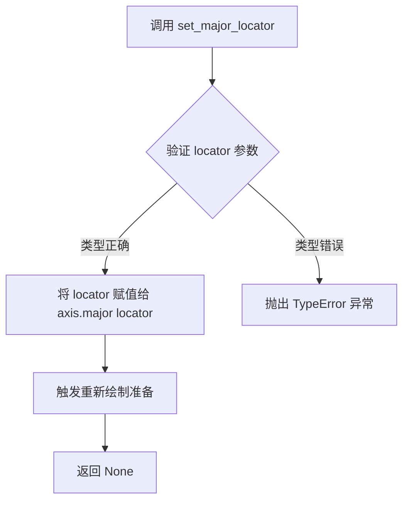

#### 带注释源码

```python
def set_major_locator(self, locator):
    """
    Set the locator of the major ticker.

    Parameters
    ----------
    locator : `.ticker.Locator`
        The locator object used to determine tick positions for the major
        ticks on this axis.

    Notes
    -----
    This method is intended to be called by the Axes instance, not by the
    user directly. The user should use the public API methods like
    ``set_xticks`` or ``set_major_formatter`` instead.
    """
    # 验证 locator 是否为 Locator 类的实例
    # 如果不是，会抛出 AttributeError 或在后续使用时出错
    self.major.locator = locator
    
    # 清除旧的缓存信息，因为定位器已更改
    # 这确保下次绘制时会重新计算刻度位置
    self.major._update_locator()
    
    # 设置标志，标记该轴需要重新渲染
    # 这是一个惰性更新机制，不会立即触发重绘
    self.stale_callback = True
    
    # 返回 None，表示此方法修改对象状态而非返回值
    return None
```


### `Axis.set_major_formatter`

设置次级 X 轴（SecondaryAxis）的主刻度标签格式化器，用于将数值或日期转换为可读的刻度标签文本。在代码中用于为次级轴设置月份日期格式化器。

参数：

- `formatter`：`matplotlib.ticker.Formatter`，日期/数值格式化器对象，负责将刻度位置转换为显示的字符串。代码中传入 `mdates.DateFormatter('  %b')` 用于将日期格式化为月份缩写（如 "Jan", "Feb"）

返回值：`matplotlib.axis.Axis`，返回 Axis 对象本身（`self`），支持链式调用

#### 流程图

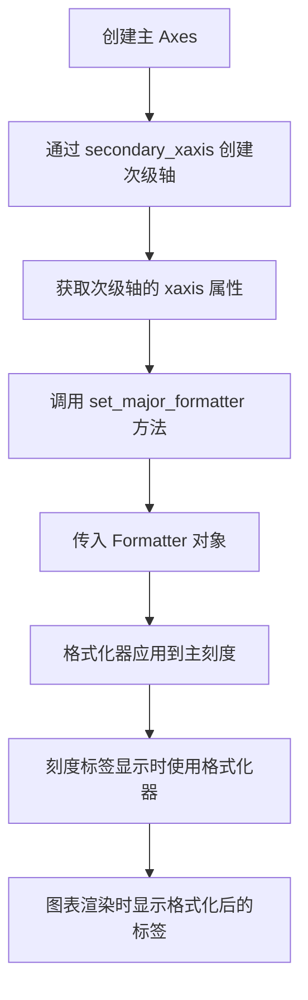

#### 带注释源码

```python
# 在次级轴上设置主刻度格式化器
# sec 是通过 ax.secondary_xaxis(location=-0.075) 创建的次级轴
# sec.xaxis 获取次级轴的 Axis 对象
# set_major_formatter 方法接受一个 Formatter 对象作为参数

sec.xaxis.set_major_formatter(mdates.DateFormatter('  %b'))

# 参数说明：
#   - mdates.DateFormatter('%b'): 将日期转换为月份缩写形式
#     %b 是 strftime 格式码，表示本地化的月份缩写（如 1月->Jan）
#     前面添加两个空格用于在月份标签组内对齐
#
# 返回值：返回 sec.xaxis 本身，支持链式调用如：
#   sec.xaxis.set_major_locator(...).set_major_formatter(...)
#
# 此方法覆盖该轴的主刻度格式化器，用于控制主刻度标签的显示格式
```


### `Spine.set_linewidth`

设置次级轴（Spine）边框的线条宽度。Spine 是 matplotlib 中用于表示坐标轴边框的组件，通过 `sec.spines['bottom']` 可以获取底部边框对象，并调用 `set_linewidth()` 方法来调整其线条宽度。

参数：

-  `linewidth`：`float`，要设置的线条宽度值，值为 0 时表示隐藏边框线条

返回值：`Spine`，返回 Spine 对象本身，以支持链式调用

#### 流程图

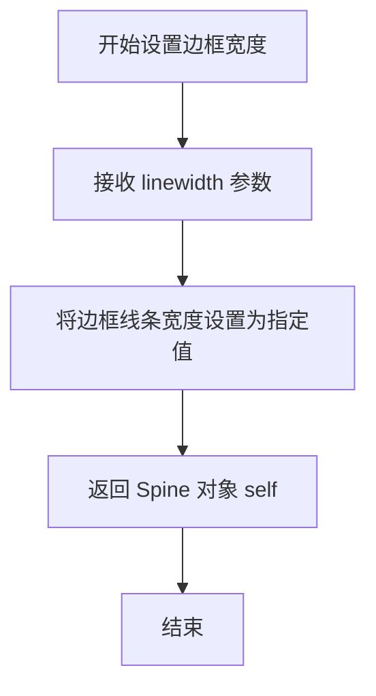

#### 带注释源码

```python
# 在 matplotlib 的日期示例中，创建一个次级 x 轴并设置在主轴下方
sec = ax.secondary_xaxis(location=-0.075)

# 设置次级 x 轴的主要定位器为月份定位器
sec.xaxis.set_major_locator(mdates.MonthLocator(bymonthday=1))

# 设置月份标签格式，前面添加空格以对齐
sec.xaxis.set_major_formatter(mdates.DateFormatter('  %b'))

# 隐藏次级 x 轴的刻度线
sec.tick_params('x', length=0)

# ===== 核心调用 =====
# 设置次级轴底部边框的线条宽度为 0，即隐藏边框
# sec.spines['bottom'] 获取底部的 Spine（边框）对象
# set_linewidth(0) 设置线条宽度为 0，达到隐藏边框的效果
sec.spines['bottom'].set_linewidth(0)
# ====================
```

#### 额外说明

在 matplotlib 中：
- **Spine** 是连接轴刻度线的边框线，共有 'top'、'bottom'、'left'、'right' 四个位置
- **`set_linewidth()`** 方法属于 `matplotlib.spines.Spine` 类
- 此调用将底部边框宽度设为 0，常用于隐藏次级坐标轴的边框，使视觉上仅显示刻度标签而没有边框线
- 这是实现多层刻度标签布局时的常用技巧，使得次级轴的边框与主轴边框不冲突


### `sec.set_xlabel`

设置次级 X 轴的标签文字，用于在次级坐标轴上显示描述性文本。

参数：

- `xlabel`：`str`，要设置的标签文本内容
- `fontdict`：可选参数，用于控制文本样式（如字体、大小、颜色等）的字典
- `labelpad`：可选参数，标签与坐标轴之间的间距（单位为点）
- `**kwargs`：可选参数，其他传递给 `matplotlib.text.Text` 的关键字参数，用于自定义文本外观

返回值：`matplotlib.text.Text`，返回创建的文本标签对象

#### 流程图

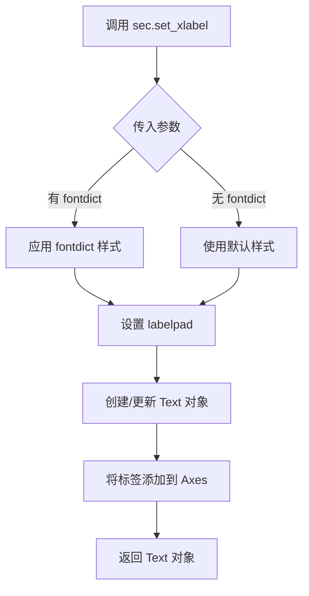

#### 带注释源码

```python
# 调用示例（来自代码第91行）
sec.set_xlabel('Dates (2020)')

# matplotlib 中 set_xlabel 的典型实现逻辑：
# def set_xlabel(self, xlabel, fontdict=None, labelpad=None, **kwargs):
#     """
#     Set the label for the x-axis.
#
#     Parameters
#     ----------
#     xlabel : str
#         The label text.
#     fontdict : dict, optional
#         A dictionary controlling the appearance of the label text.
#     labelpad : float, optional
#         Spacing in points between the label and the x-axis.
#     **kwargs : dict
#         Text properties control the appearance of the label.
#     """
#     if fontdict is not None:
#         kwargs.update(fontdict)
#
#     # 获取或创建 x 轴标签对象（Text 实例）
#     label = self.xaxis.get_label()
#
#     # 设置标签文本
#     label.set_text(xlabel)
#
#     # 应用其他文本属性
#     label.update(kwargs)
#
#     # 如果指定了 labelpad，则设置标签与轴的间距
#     if labelpad is not None:
#         self.xaxis.set_label_coords(0.5, -labelpad)
#
#     # 返回标签对象以便后续操作
#     return label
```


### `plt.show`

`plt.show()` 是 matplotlib 库中的全局函数，用于显示所有当前已创建但尚未显示的图形窗口。该函数会阻塞程序执行，直到用户关闭图形窗口（在后端支持的情况下），或者立即返回（在某些非交互式后端中）。

#### 参数

- 该函数没有参数。

#### 返回值

- `None`，无返回值。该函数的主要作用是将图形渲染到屏幕或相关后端，不返回任何数据。

#### 流程图

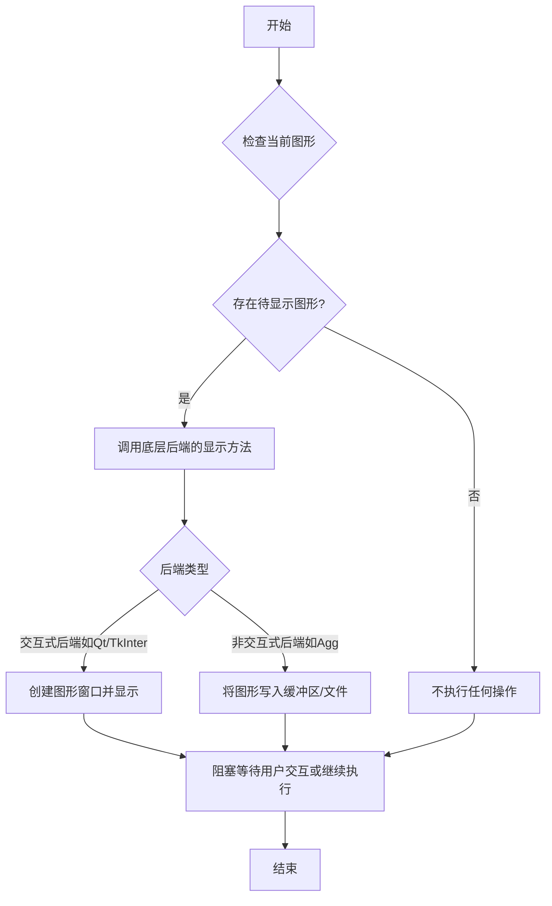

#### 带注释源码

```python
# plt.show() 函数的简化实现逻辑
def show():
    """
    显示所有当前打开的图形。
    
    该函数会遍历matplotlib的后端系统，
    根据当前配置的后端类型调用相应的显示方法。
    """
    # 获取当前活动图形管理器
    pyplotplt._get_backend_mod()
    
    # 对于交互式后端（如Qt、Tkinter等）
    # 会创建一个新的窗口并显示图形内容
    
    # 对于非交互式后端（如Agg）
    # 可能会直接将图形输出到文件或缓冲区
    
    # 阻塞模式：在某些后端中会等待用户关闭窗口
    # 非阻塞模式：在某些后端中立即返回
    
    # 示例调用链：
    # plt.show() -> backend_based.show() -> GUI framework display
```

> **注意**：实际的 `plt.show()` 实现分布在多个后端模块中，具体实现取决于用户配置的后端（通过 `matplotlib.use()` 或 `matplotlib.rcParams['backend']` 设置）。在给定的代码示例中，`plt.show()` 被调用来显示三个使用 `secondary_xaxis` 创建多级刻度标签的图形。

## 关键组件


### secondary_xaxis

用于创建次级x轴的函数，支持在主轴上方或下方添加额外的刻度标签层级，实现多级刻度显示效果。

### set_xticks

设置次级x轴的刻度位置和可选的刻度标签，用于精确定义刻度在轴上的分布。

### tick_params

配置刻度线的视觉属性，如长度(length)和宽度(width)，用于控制刻度线的显示效果。

### set_major_formatter

设置主刻度标签的格式化器，支持自定义日期、文本等格式，mdates.DateFormatter用于日期格式。

### set_major_locator

设置主刻度定位器，控制刻度线的自动分布位置，mdates.MonthLocator用于自动按月定位。

### spines

访问坐标轴边框对象，用于隐藏或自定义边框样式，如设置边框线宽为0。

### set_xlabel

设置x轴的标签文字，用于为坐标轴添加描述性标签。

### mdates.DateFormatter

日期格式化类，将日期对象转换为指定格式的字符串（如'%d'表示日，'%b'表示月份缩写）。

### mdates.MonthLocator

月份定位器类，自动识别并定位每个月的起始位置，支持bymonthday参数指定具体日期。


## 问题及建议


### 已知问题

- **硬编码值过多**：图形尺寸(4,4)/(7,4)、刻度位置[5,15,25]、标签文本、随机种子19680801、x轴范围-0.6/8.6等均采用硬编码，缺乏灵活性
- **Magic Numbers缺乏解释**：代码中存在多个魔数如location=0、location=-0.075、length=40、width=1.5等，未以常量或变量形式定义，影响可读性
- **无函数封装**：三个示例相互独立，重复代码未提取为可复用函数，导致代码冗余
- **缺少输入验证**：未对传入的分类数据、日期范围等进行校验，可能导致异常
- **无类型注解**：Python代码中未使用类型提示，降低了代码的可维护性和IDE支持
- **注释与实现不一致**：注释提到"could have been done by changing bymonthday above"但未实际实现该优化方案

### 优化建议

- **封装辅助函数**：创建`create_secondary_xaxis()`、`add_tick_labels()`等通用函数，减少重复代码
- **配置参数化**：将尺寸、位置、标签等提取为配置字典或类参数，支持自定义
- **添加数据验证**：在处理分类数据和日期范围前进行有效性检查
- **使用常量替代魔数**：定义有意义的常量如`TICK_LENGTH=40`、`MONTH_LOCATOR=-0.075`
- **添加类型注解**：为函数参数和返回值添加类型提示
- **改进注释质量**：将提及的优化方案付诸实践，或删除过时注释

## 其它


### 设计目标与约束

**设计目标**：演示如何使用 Matplotlib 的 `secondary_xaxis` 实现多层次（嵌套）刻度标签，以在不同场景下（手动设置分类、自动日期分组）展示轴的二级分组信息，提升图表的可读性。

**约束**：
- **Matplotlib 版本**：≥ 3.5（`secondary_xaxis` 在 3.5 版本引入）。
- **NumPy 版本**：≥ 1.20（支持 `np.datetime64` 与 `np.timedelta64`）。
- **Python 版本**：≥ 3.8（推荐）。
- **运行环境**：需要交互式显示后端（如 TkAgg、Qt5Agg）或非交互式后端（如 Agg）用于保存图像。
- **图表布局**：使用 `layout='constrained'` 避免重叠，确保在不同尺寸下保持美观。

### 错误处理与异常设计

**现状**：代码中未实现显式的错误处理与异常捕获，属于概念演示脚本。

**潜在异常**：
1. **轴范围不匹配**：调用 `set_xticks` 时 tick 位置超出主轴 `xlim` 范围，会导致次级轴 ticks 不显示。
2. **标签数量不一致**：`labels` 列表长度与 `ticks` 列表长度不匹配，Matplotlib 会抛出 `ValueError`。
3. **无效的 Locator/Formatter**：对日期轴使用不符合 `np.datetime64` 类型的 locator/formatter，可能导致异常或标签空白。
4. **版本兼容性**：在 Matplotlib < 3.5 环境下调用 `secondary_xaxis` 会抛出 `AttributeError`。

**建议的错误处理设计**：
- 在设置 ticks 前校验 `ticks` 是否在主轴 `xlim` 范围内，使用 `np.clip` 或条件判断。
- 校验 `len(ticks) == len(labels)`，不等时抛出明确提示的异常。
- 对日期轴使用 `try/except` 捕获 `ValueError` 并回退到默认 formatter。
- 在脚本入口处检查 Matplotlib 版本，若低于要求给出警告并退出。

### 数据流与状态机

**数据流**：
1. **初始化**：通过 `np.random.default_rng(19680801)` 创建随机数生成器，用于后续数据生成。
2. **图形创建**：`plt.subplots` 创建 `Figure` 与 `Axes` 对象。
3. **主轴绘图**：调用 `ax.plot` 绘制主数据序列（随机数或分类数据）。
4. **次级轴创建**：`ax.secondary_xaxis(location=…)` 创建次级轴对象，返回 `Axes`（实际为 `SecondaryAxis`）。
5. **配置次级轴**：
   - `sec.set_xticks` 设置刻度位置与标签。
   - `sec.tick_params` 调整刻度线外观（长度、宽度）。
   - 对日期示例，使用 `sec.xaxis.set_major_locator` 与 `set_major_formatter` 自动定位与格式化。
   - `sec.spines['bottom'].set_linewidth(0)` 隐藏次级轴边框。
6. **显示**：`plt.show()` 渲染并展示图形。

**状态机**：本脚本为一次性线性执行，无持久状态。唯一的状态保存在 `Figure` 对象中，可被后续代码保存或导出。

### 外部依赖与接口契约

**依赖库**：
- **Matplotlib** (`matplotlib.pyplot`, `matplotlib.axes`, `matplotlib.dates`)：绘图与次级轴 API。
- **NumPy** (`numpy`)：随机数生成、日期时间处理、数值数组操作。
- **Python 标准库**：无直接依赖，主要使用内置 `datetime`、`timedelta`。

**关键接口契约**：
| 接口 | 参数 | 返回值 | 描述 |
|------|------|--------|------|
| `Axes.secondary_xaxis(location)` | `location`（float 或 `'top'|'bottom'`） | `SecondaryAxis`（继承自 `Axes`） | 在指定位置创建次级轴。 |
| `Axes.set_xticks(ticks, labels)` | `ticks`（list of float），`labels`（list of str） | `None` | 设置次级轴刻度位置与可选标签。 |
| `Axes.tick_params(axis, **kwargs)` | `axis`（'x' 或 'y'），`length`, `width` 等 | `None` | 调整刻度线外观。 |
| `Axis.set_major_locator(locator)` | `locator`（`Locator` 实例） | `None` | 设置主要刻度定位器（如 `MonthLocator`）。 |
| `Axis.set_major_formatter(formatter)` | `formatter`（`Formatter` 实例） | `None` | 设置主要刻度格式化器（如 `DateFormatter`）。 |
| `Spines['bottom'].set_linewidth(width)` | `width`（float） | `None` | 隐藏或调整次级轴边框。 |

### 性能考虑

- **数据集规模**：示例中使用的数据点数量较小（≤ 90），渲染时间可忽略不计。
- **潜在瓶颈**：若在真实业务场景中使用大规模时间序列（>10⁴ 点）或频繁调用 `set_xticks`/`tick_params`，渲染速度可能下降。此时建议：
  - 对大数据集使用下采样或聚合定位器（如 `AutoDateLocator`）。
  - 避免在每次绘图循环中重复创建次级轴，改为复用。
  - 使用 `matplotlibrc` 参数关闭不必要的动画与交互，以提升批处理速度。
- **内存占用**：次级轴本身不显著增加内存，主要内存占用来自底层 `Figure` 与数据数组。

### 可扩展性

1. **多层嵌套**：可在同一轴上叠加多个 `secondary_xaxis`（如本例中同时使用 `sec` 与 `sec2`），实现三级以上的分组标签。
2. **双向次级轴**：使用 `secondary_yaxis` 对 y 轴实现类似的多层次标签（如分组统计量的误差线）。
3. **自定义 Locator/Formatter**：通过继承 `matplotlib.ticker.Locator` 与 `matplotlib.ticker.Formatter`，实现业务特定的分组逻辑（如按财务季度、产品线分组）。
4. **跨后端兼容**：上述 API 在所有 Matplotlib 支持的后端（PNG、PDF、SVG、Qt、WebAgg）中均可用，无需修改代码。
5. **交互式增强**：可结合 `matplotlib.widgets`（如滑块、按钮）动态切换次级轴的标签或位置，实现交互式数据探索。

### 测试要点

1. **单元测试**：
   - 验证 `secondary_xaxis` 返回的对象类型为 `SecondaryAxis`。
   - 验证 `set_xticks` 设置的 ticks 数量与 labels 长度相等。
   - 验证 `tick_params` 生效（通过属性查询 `tick_params` 返回值）。
2. **视觉回归测试**：
   - 使用 `matplotlib.testing.decorators.image_comparison` 对比生成的图像与基准图像，确保次级轴标签位置、 spines 隐藏等细节一致。
   - 在不同 Matplotlib 版本（如 3.5、3.8、latest）下运行，防止 API 变动导致渲染差异。
3. **边界条件测试**：
   - 设置 `ticks` 超出主轴 `xlim` 范围，检查是否抛出或被忽略。
   - 对空数据（`len(data)==0`）调用绘图，检查是否产生异常。
   - 对极端日期（如 `np.datetime64` 不存在的日期）使用 `MonthLocator`，检查是否安全降级。
4. **性能测试**：
   - 使用大规模随机数据（10⁵ 点）生成图像，监测内存峰值与渲染时长，确保在可接受范围内。

### 部署和运行环境

- **部署方式**：作为独立 Python 脚本（`example_secondary_axis.py`）直接运行，或嵌入 Jupyter Notebook、Sphinx 文档（通过 `.. plot::` 指令）进行演示。
- **依赖管理**：推荐使用 `pip install matplotlib numpy` 或 `conda install matplotlib numpy`，确保版本满足约束。
- **运行平台**：Windows、Linux、macOS 均可运行；需要图形后端支持。若在无显示服务器上运行，可使用非交互后端（如 `matplotlib.use('Agg')`）保存图像。
- **打包**：如需打包为可分发的示例，可使用 `setup.py` 或 `pyproject.toml` 声明依赖，或生成独立的 HTML/PDF 文档。

### 参考资料

- Matplotlib 官方文档 – Secondary Axis：https://matplotlib.org/stable/gallery/subplots_axes_and_figures/secondary_axis.html
- Matplotlib 日期与时间处理：https://matplotlib.org/stable/api/dates_api.html
- NumPy 随机数生成器：https://numpy.org/doc/stable/reference/random/generator.html
- Matplotlib `ticker` 模块（Locator 与 Formatter）：https://matplotlib.org/stable/api/ticker_api.html
- Matplotlib 测试框架：https://matplotlib.org/stable/devel/testing.html

    