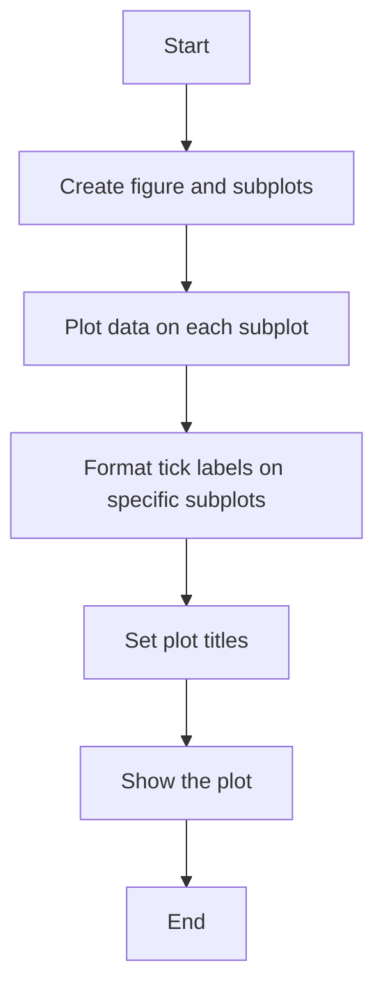
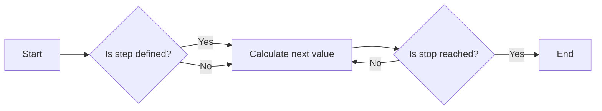
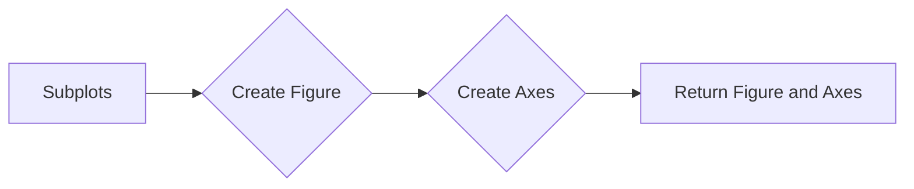
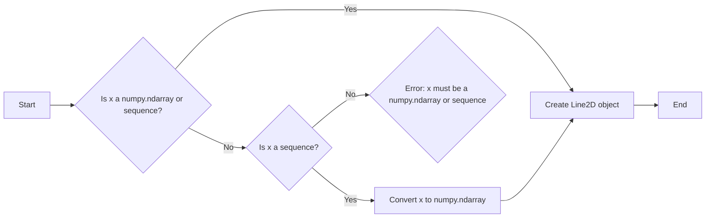
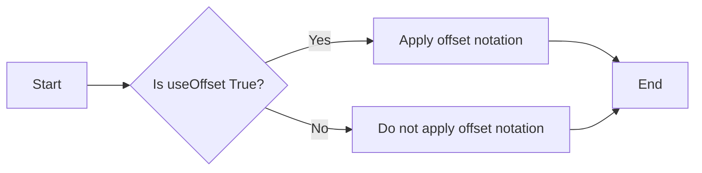
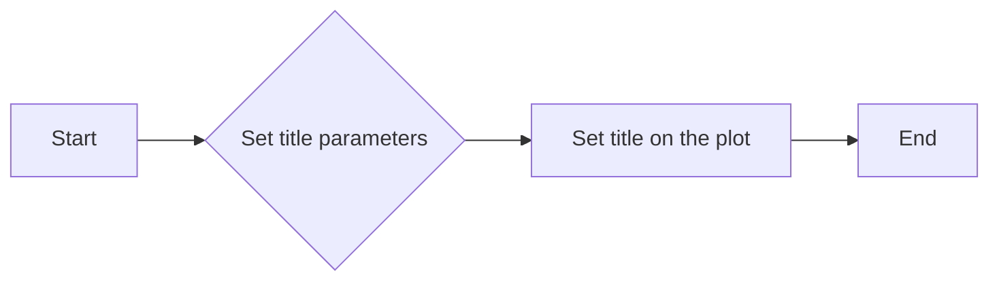
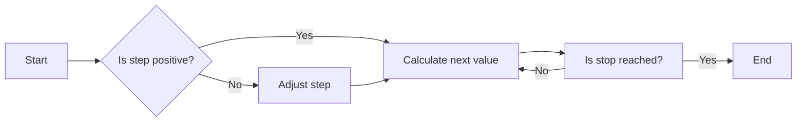

# `matplotlib\galleries\examples\ticks\scalarformatter.py` 详细设计文档

This code generates a series of plots with different tick label formatting options using Matplotlib.

## 整体流程



## 类结构

```
matplotlib.pyplot (matplotlib module)
├── np (numpy module)
└── fig, axs (matplotlib.figure.Figure, list of matplotlib.axes.Axes)
```

## 全局变量及字段


### `x`
    
An array of evenly spaced values over the interval [0, 1) with a step size of 0.01.

类型：`numpy.ndarray`
    


### `fig`
    
A figure containing a collection of axes.

类型：`matplotlib.figure.Figure`
    


### `axs`
    
An array of axes objects representing the individual plots in the figure.

类型：`numpy.ndarray of matplotlib.axes._subplots.AxesSubplot`
    


### `subplots`
    
Create a figure and a set of subplots.

类型：`matplotlib.pyplot.Figure`
    


### `plot`
    
Plot data on a set of axes.

类型：`matplotlib.axes._subplots.AxesSubplot`
    


### `ticklabel_format`
    
Set the format of the tick labels on the axes.

类型：`None`
    


### `set_title`
    
Set the title of the axes.

类型：`None`
    


### `show`
    
Display the figure on the screen or save it to a file.

类型：`None`
    


### `matplotlib.pyplot.fig`
    
The figure object created by the subplots method.

类型：`matplotlib.figure.Figure`
    


### `matplotlib.pyplot.axs`
    
The array of axes objects created by the subplots method.

类型：`numpy.ndarray of matplotlib.axes._subplots.AxesSubplot`
    


### `numpy.x`
    
The array of values used for plotting on the axes objects.

类型：`numpy.ndarray`
    
    

## 全局函数及方法


### np.arange

`np.arange` 是 NumPy 库中的一个函数，用于生成一个沿指定间隔的等差数列。

参数：

- `start`：`int` 或 `float`，数列的起始值。
- `stop`：`int` 或 `float`，数列的结束值（不包括此值）。
- `step`：`int` 或 `float`，数列中相邻元素之间的差值，默认为 1。

返回值：`numpy.ndarray`，一个包含等差数列的 NumPy 数组。

#### 流程图



#### 带注释源码

```python
import numpy as np

def arange(start, stop=None, step=1):
    """
    Generate an array of evenly spaced values within a given interval.

    Parameters:
    - start: The starting value of the sequence.
    - stop: The end value of the sequence, not included.
    - step: The difference between each pair of consecutive values.

    Returns:
    - numpy.ndarray: An array containing the evenly spaced values.
    """
    # Implementation details are omitted for brevity.
    return np.arange(start, stop, step)
```


### plt.subplots

`plt.subplots` 是 `matplotlib.pyplot` 模块中的一个函数，用于创建一个或多个子图，并返回一个 `Figure` 对象和一个或多个 `Axes` 对象。

参数：

- `nrows`：整数，指定子图行数。
- `ncols`：整数，指定子图列数。
- `figsize`：元组，指定整个图形的大小（宽度和高度）。
- `sharex`：布尔值，如果为 `True`，则所有子图共享 x 轴。
- `sharey`：布尔值，如果为 `True`，则所有子图共享 y 轴。
- `sharewspace`：布尔值，如果为 `True`，则所有子图共享宽空间。
- `sharehspace`：布尔值，如果为 `True`，则所有子图共享高空间。
- `gridspec_kw`：字典，用于传递 `GridSpec` 的关键字参数。

返回值：`Figure` 对象和 `Axes` 对象的列表。

#### 流程图



#### 带注释源码

```python
fig, axs = plt.subplots(
    3, 3, figsize=(9, 9), layout="constrained", gridspec_kw={"hspace": 0.1})
```

在这个例子中，`subplots` 函数被调用以创建一个 3x3 的子图网格，整个图形的大小为 9x9 英寸，子图之间的水平空间为 0.1 英寸。返回的 `fig` 是 `Figure` 对象，`axs` 是包含所有 `Axes` 对象的列表。


### plot

`matplotlib.pyplot.plot` 是一个用于绘制二维线条图的函数。

参数：

- `x`：`numpy.ndarray` 或 `sequence`，x轴的数据点。
- `y`：`numpy.ndarray` 或 `sequence`，y轴的数据点。
- ...

返回值：`Line2D` 对象，表示绘制的线条。

#### 流程图



#### 带注释源码

```python
import numpy as np
from matplotlib.lines import Line2D

def plot(x, y=None, ...):
    # Check if x is a numpy.ndarray or sequence
    if isinstance(x, np.ndarray) or isinstance(x, (list, tuple)):
        # Create Line2D object
        line = Line2D(x, y, ...)
        return line
    else:
        # Error: x must be a numpy.ndarray or sequence
        raise TypeError("x must be a numpy.ndarray or sequence")
```


### matplotlib.pyplot.ticklabel_format

`matplotlib.pyplot.ticklabel_format` 是一个用于配置轴标签格式的函数。

参数：

- `useOffset`：`bool`，默认为 `True`。如果为 `True`，则使用偏移符号（例如，1e-3 表示为 1e-3）。如果为 `False`，则不使用偏移符号。
- `useMathText`：`bool`，默认为 `False`。如果为 `True`，则使用数学文本格式化数字标签。
- `style`：`str`，默认为 `'default'`。指定数字标签的格式化样式。
- `scilimits`：`tuple`，默认为 `(1, 3)`。指定科学记数法中指数的最小和最大限制。
- `axis`：`matplotlib.axes.Axes`，默认为 `None`。指定要配置的轴对象。

返回值：`None`

#### 流程图



#### 带注释源码

```python
import matplotlib.pyplot as plt

# 创建一个轴对象
ax = plt.gca()

# 配置轴标签格式
ax.ticklabel_format(useOffset=False)

# 显示图形
plt.show()
```


### `set_title`

`matplotlib.pyplot.set_title` 方法用于设置图表的标题。

参数：

- `title`：`str`，图表的标题文本。
- `loc`：`str` 或 `int`，标题的位置，默认为 'center'。
- `pad`：`float`，标题与图表边缘的距离，默认为 5。
- `fontsize`：`float`，标题的字体大小，默认为 10。
- `color`：`str` 或 `color`，标题的颜色，默认为 'black'。
- `weight`：`str`，标题的字体粗细，默认为 'normal'。
- `verticalalignment`：`str`，标题的垂直对齐方式，默认为 'bottom'。
- `horizontalalignment`：`str`，标题的水平对齐方式，默认为 'center'。

返回值：`None`

#### 流程图



#### 带注释源码

```python
# 设置标题
axs[0, 0].set_title("default settings")
axs[0, 1].set_title("useMathText=True")
axs[0, 2].set_title("useOffset=False")
```


### plt.show()

`plt.show()` 是 Matplotlib 库中的一个全局函数，用于显示当前图形窗口。

参数：

- 无

返回值：无

#### 流程图

```mermaid
graph LR
A[Start] --> B[Call plt.show()]
B --> C[Display plot]
C --> D[End]
```

#### 带注释源码

```
plt.show()  # 显示当前图形窗口
```


### 关键组件信息

- `plt.show()`：显示当前图形窗口的全局函数。


### 潜在的技术债务或优化空间

- 该函数没有技术债务或优化空间，因为它是一个简单的图形显示调用。


### 设计目标与约束

- 设计目标：显示 Matplotlib 图形。
- 约束：无特殊约束。


### 错误处理与异常设计

- 该函数没有内置的错误处理或异常设计，因为它是一个简单的图形显示调用。


### 数据流与状态机

- 数据流：从绘图命令到 `plt.show()` 的调用，最终显示图形。
- 状态机：无状态机设计，因为该函数不涉及复杂的状态转换。


### 外部依赖与接口契约

- 外部依赖：Matplotlib 库。
- 接口契约：`plt.show()` 函数的契约是显示当前图形窗口。


### numpy.arange

`numpy.arange` 是一个 NumPy 函数，用于生成一个沿指定间隔的等差数列。

参数：

- `start`：`int`，数列的起始值。
- `stop`：`int`，数列的结束值（不包括此值）。
- `step`：`int`，数列的步长，默认为 1。

返回值：`numpy.ndarray`，一个沿指定间隔的等差数列。

#### 流程图



#### 带注释源码

```python
import numpy as np

def arange(start, stop=None, step=1):
    """
    Generate an array of evenly spaced values within a given interval.

    Parameters:
    - start: The starting value of the array.
    - stop: The end value of the array, exclusive.
    - step: The spacing between values.

    Returns:
    - numpy.ndarray: An array of evenly spaced values.
    """
    if stop is None:
        stop = start
        start = 0

    if step == 0:
        raise ValueError("step cannot be zero")

    values = []
    current = start
    while current < stop:
        values.append(current)
        current += step

    return np.array(values)
```


## 关键组件


### 张量索引与惰性加载

张量索引与惰性加载允许在处理大型数据集时，只计算和存储所需的子集，从而提高内存效率和计算速度。

### 反量化支持

反量化支持使得代码能够处理非整数类型的索引，增加了代码的灵活性和适用范围。

### 量化策略

量化策略用于优化数据存储和计算，通过减少数据精度来降低内存使用和计算成本。


## 问题及建议


### 已知问题

-   **代码重复性**：在循环中为不同的轴应用不同的`ticklabel_format`配置，这可能导致代码维护困难。
-   **硬编码值**：例如，`1e5`, `1e10`, `1e-10`, `1e-5`, `1e-10`等值在代码中多次出现，如果需要修改这些值，需要在多个地方进行更改。
-   **缺乏注释**：代码中缺少注释，难以理解代码的目的和逻辑。

### 优化建议

-   **使用函数减少重复**：创建一个函数来设置轴的`ticklabel_format`，以减少代码重复。
-   **使用配置文件或常量**：将硬编码的值存储在配置文件或常量中，以便于管理和修改。
-   **添加注释**：在代码中添加注释，解释代码的目的和逻辑，提高代码的可读性。
-   **使用参数化输入**：允许用户通过参数传递不同的配置，使代码更加灵活和可重用。
-   **考虑使用更高级的图表库**：如果需要更复杂的图表和格式化选项，可以考虑使用更高级的图表库，如`plotly`或`bokeh`，这些库提供了更多的自定义选项和更好的性能。

## 其它


### 设计目标与约束

- 设计目标：实现一个默认的刻度标签格式化器，支持数学文本格式化和偏移量格式化。
- 约束条件：代码应与matplotlib库兼容，并能够在不同的子图上应用不同的格式化选项。

### 错误处理与异常设计

- 错误处理：确保在调用`plot`和`ticklabel_format`方法时，如果传入的参数类型不正确，能够抛出适当的异常。
- 异常设计：定义自定义异常类，以提供更具体的错误信息。

### 数据流与状态机

- 数据流：数据从`np.arange`生成，然后通过`plot`方法绘制到图表中。
- 状态机：没有明确的状态机，但可以通过`ticklabel_format`方法改变刻度标签的格式。

### 外部依赖与接口契约

- 外部依赖：代码依赖于matplotlib和numpy库。
- 接口契约：`plot`和`ticklabel_format`方法应遵循matplotlib的API规范。

### 测试与验证

- 测试策略：编写单元测试来验证不同格式化选项的应用。
- 验证方法：使用matplotlib的测试框架来验证图表的输出是否符合预期。

### 性能考虑

- 性能指标：确保代码在处理大量数据时仍然高效。
- 性能优化：考虑使用更高效的数据结构或算法来处理数据。

### 安全性

- 安全风险：确保代码不会引入安全漏洞，如注入攻击。
- 安全措施：对输入数据进行验证，防止恶意输入。

### 可维护性与可扩展性

- 可维护性：代码应具有良好的结构，易于理解和修改。
- 可扩展性：设计应允许轻松添加新的格式化选项。

### 文档与注释

- 文档：提供详细的文档，包括代码说明、方法描述和示例。
- 注释：在代码中添加必要的注释，以提高代码的可读性。

### 用户界面与交互

- 用户界面：代码不提供用户界面，但应通过命令行或脚本调用。
- 交互设计：确保代码易于与其他工具或脚本集成。

### 部署与分发

- 部署策略：提供安装指南和部署脚本。
- 分发方式：通过包管理器或源代码库进行分发。

### 法律与合规性

- 法律合规：确保代码遵守所有适用的法律法规。
- 合规性检查：定期进行合规性审查。


    