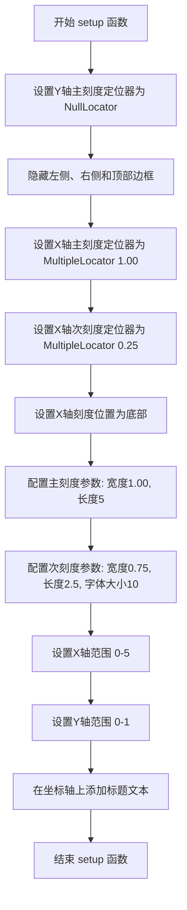
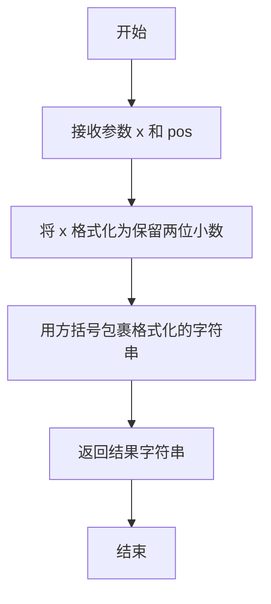

# `matplotlib\galleries\examples\ticks\tick-formatters.py` 详细设计文档

这是一个matplotlib示例代码，展示了各种tick formatters（刻度格式化器）的使用方式和效果，包括NullFormatter、StrMethodFormatter、FormatStrFormatter、FuncFormatter、FixedFormatter、ScalarFormatter和PercentFormatter等，通过创建多个子图来演示不同格式化器的配置方法和显示效果。

## 整体流程

```mermaid
graph TD
    A[开始] --> B[导入matplotlib.pyplot和ticker模块]
B --> C[定义setup函数用于设置坐标轴参数]
C --> D[创建Figure窗口，设置3行子图]
D --> E[创建第一个子图fig0: 字符串格式化示例]
E --> F[创建第二个子图fig1: 函数格式化示例]
F --> G[创建第三个子图fig2: 7个Formatter对象示例]
G --> H[分别为每个子图设置对应的Formatter]
H --> I[调用plt.show()显示图形]
I --> J[结束]
```

## 类结构

```
本代码为示例脚本，无自定义类结构
主要使用matplotlib.ticker模块中的Formatter类层次:
Formatter (基类)
├── NullFormatter
├── StrMethodFormatter
├── FormatStrFormatter
├── FuncFormatter
├── FixedFormatter
├── ScalarFormatter
└── PercentFormatter
```

## 全局变量及字段


### `fig`
    
主图形窗口，通过plt.figure()创建

类型：`matplotlib.figure.Figure`
    


### `fig0`
    
第一个子图容器，用于展示字符串格式化示例

类型：`matplotlib.figure.SubFigure`
    


### `fig1`
    
第二个子图容器，用于展示函数格式化示例

类型：`matplotlib.figure.SubFigure`
    


### `fig2`
    
第三个子图容器，用于展示格式化器对象示例

类型：`matplotlib.figure.SubFigure`
    


### `ax0`
    
fig0的坐标轴对象，显示字符串格式化效果

类型：`matplotlib.axes.Axes`
    


### `ax1`
    
fig1的坐标轴对象，显示函数格式化效果

类型：`matplotlib.axes.Axes`
    


### `axs2`
    
fig2的7个子图坐标轴数组，展示多种格式化器

类型：`numpy.ndarray`
    


### `positions`
    
整数列表，FixedFormatter的位置参数，值为[0,1,2,3,4,5]

类型：`list`
    


### `labels`
    
字符串列表，FixedFormatter的标签参数，值为['A','B','C','D','E','F']

类型：`list`
    


### `fmt_two_digits`
    
FuncFormatter使用的格式化函数，将数值格式化为带方括号的两位小数字符串

类型：`function`
    


    

## 全局函数及方法


### `setup(ax, title)`

设置坐标轴的通用参数，包括刻度定位器、刻度样式、轴限制、边框可见性以及标题文本等。

参数：

- `ax`：`matplotlib.axes.Axes`，要配置的坐标轴对象
- `title`：`str`，要在坐标轴上显示的标题文本

返回值：`None`，该函数直接修改传入的坐标轴对象，不返回任何值

#### 流程图



#### 带注释源码

```python
def setup(ax, title):
    """Set up common parameters for the Axes in the example."""
    # 只显示底部边框，隐藏左侧、右侧和顶部边框
    ax.yaxis.set_major_locator(ticker.NullLocator())  # Y轴不显示刻度
    ax.spines[['left', 'right', 'top']].set_visible(False)  # 隐藏不需要的边框

    # 定义刻度位置
    ax.xaxis.set_major_locator(ticker.MultipleLocator(1.00))   # 主刻度间隔1.00
    ax.xaxis.set_minor_locator(ticker.MultipleLocator(0.25))  # 次刻度间隔0.25

    # 设置刻度显示位置和样式
    ax.xaxis.set_ticks_position('bottom')  # 刻度只在底部显示
    ax.tick_params(which='major', width=1.00, length=5)    # 主刻度线宽1.00，长度5
    ax.tick_params(which='minor', width=0.75, length=2.5, labelsize=10)  # 次刻度线宽0.75，长度2.5，标签字体10

    # 设置坐标轴范围
    ax.set_xlim(0, 5)  # X轴范围0到5
    ax.set_ylim(0, 1)  # Y轴范围0到1

    # 在坐标轴上添加标题文本
    ax.text(0.0, 0.2, title, transform=ax.transAxes,
            fontsize=14, fontname='Monospace', color='tab:blue')
```


### `fmt_two_digits`

自定义格式化函数，将数值格式化为带方括号保留两位小数形式的字符串，常用于 Matplotlib 的坐标轴刻度标签格式化。

参数：

- `x`：`float`，要进行格式化的数值参数，代表坐标轴上的实际数值
- `pos`：`int`，位置索引参数，用于 FuncFormatter 的标准函数签名（在此函数中未使用）

返回值：`str`，格式化后的字符串，格式为 `[数值.两位小数]`，例如 `"[1.23]"`

#### 流程图



#### 带注释源码

```python
def fmt_two_digits(x, pos):
    """
    自定义格式化函数，将数值转换为带方括号的小数形式。
    
    参数:
        x: float - 要格式化的浮点数数值
        pos: int - 位置索引参数，符合 FuncFormatter 的函数签名规范
    
    返回:
        str - 格式化后的字符串，格式为 '[数值.两位小数]'
    """
    # 使用 f-string 格式化，:.2f 表示保留两位小数
    # 外层用方括号包裹
    return f'[{x:.2f}]'
```

## 关键组件


### Tick Formatters 演示

演示matplotlib中各种tick格式化器的使用，包括字符串格式、函数格式和不同的Formatter对象。

### setup 函数

用于设置 Axes 的通用参数，如脊柱可见性、tick定位器、轴限制等。

### 字符串格式Formatter

使用格式字符串 '{x} km' 作为major formatter。

### lambda函数Formatter

使用匿名函数 lambda x, pos: str(x-5) 作为major formatter。

### NullFormatter

不显示tick标签。

### StrMethodFormatter

使用 str.format 方法格式化tick标签，如 '{x:.3f}'。

### FormatStrFormatter

使用 %-style 格式化，如 '#%d'。

### FuncFormatter

使用自定义函数格式化tick标签，如 fmt_two_digits。

### FixedFormatter

使用固定的标签列表，必须与 FixedLocator 配合使用。

### ScalarFormatter

默认的标量格式化器，可选择使用数学文本。

### PercentFormatter

将tick值格式化为百分比，如 xmax=5。

### 图表布局

使用 subfigures 创建多个子图，每个子图展示不同的formatter。


## 问题及建议


### 已知问题

- **代码重复**：setup函数被重复调用7次，每次都需要传递ax和title参数，且内部逻辑高度相似，增加维护成本和出错风险。
- **硬编码参数过多**：大量的魔法数字（如`width=1.00, length=5`, `length=2.5`）和字符串散布在代码中，缺乏常量定义，修改时需要逐个查找替换。
- **缺少类型注解**：函数参数和返回值没有类型提示，降低了代码的可读性和IDE的辅助能力。
- **Spines访问方式可能存在兼容性问题**：`ax.spines[['left', 'right', 'top']].set_visible(False)` 使用列表索引访问spines字典，在某些matplotlib版本中可能不兼容。
- **Lambda函数可读性差**：使用lambda `lambda x, pos: str(x-5)` 作为formatter，不便于调试和阅读，错误堆栈不清晰。
- **缺少错误处理**：没有对传入的参数进行验证，如FixedFormatter与FixedLocator的配合使用虽在注释中提及，但缺乏运行时检查。
- **配置分散**：7个子图的配置逻辑分散在各处，没有统一的配置管理机制。

### 优化建议

- **抽取配置字典**：将tick参数、spine设置、formatter配置等提取到配置字典或YAML/JSON配置文件中，统一管理。
- **定义常量类**：创建Constants类或模块，集中定义所有魔法数字和字符串，如`TICK_MAJOR_WIDTH = 1.00`、`TICK_MAJOR_LENGTH = 5`等。
- **面向对象重构**：考虑创建AxesSetup类或FormatterDemo类，将setup逻辑封装为类方法或属性，减少重复调用。
- **添加类型注解**：为所有函数添加类型提示，如`def setup(ax: plt.Axes, title: str) -> None:`。
- **替换lambda为具名函数**：将lambda改为普通函数定义，如`def subtract_five(x, pos): return str(x-5)`，便于调试和文档化。
- **增强错误处理**：在FixedFormatter使用处添加运行时检查，验证是否同时使用了FixedLocator。
- **兼容性处理**：对spines的访问使用兼容方式，如`for spine in ['left', 'right', 'top']: ax.spines[spine].set_visible(False)`。

## 其它


### 设计目标与约束

本示例代码旨在演示Matplotlib中各种tick formatter（刻度格式化器）的使用方式，通过可视化方式展示不同格式化器的效果。约束条件包括：需要使用Matplotlib 3.5+版本（用于subfigures），依赖matplotlib.ticker模块，代码仅作为演示用途，不包含单元测试。

### 错误处理与异常设计

本代码未实现显式的错误处理机制。作为示例代码，主要依赖Matplotlib内部的异常处理。潜在错误包括：FixedFormatter未与FixedLocator配合使用时可能产生不确定的标签位置，PercentFormatter的xmax参数为0时可能导致除零错误，FuncFormatter返回非字符串类型时可能引发类型错误。

### 数据流与状态机

代码通过以下流程运行：创建Figure和Subfigures → 为每个子图设置坐标轴参数 → 创建特定的Formatter对象 → 通过set_major_formatter()应用到坐标轴 → 调用plt.show()渲染。具体状态转换包括：初始化状态（空坐标轴）→ 配置状态（设置Locator和Formatter）→ 渲染状态（显示图形）。

### 外部依赖与接口契约

主要依赖包括：matplotlib.pyplot（图形创建）、matplotlib.ticker（格式化器和定位器）。关键接口契约：set_major_formatter()接受字符串、lambda函数或Formatter实例；所有Formatter对象需实现__call__(x, pos)方法；FixedFormatter需与FixedLocator配合使用以确保行为确定性。

### 使用场景与典型用例

该代码适用于以下场景：数据可视化时需要自定义刻度标签格式、演示不同格式化器的工作原理、作为学习Matplotlib ticker模块的参考材料。典型用例包括：地理坐标显示（"{x} km"格式）、科学计数法显示（ScalarFormatter）、百分比显示（PercentFormatter）、离散分类标签（FixedFormatter）。

### 性能考量与优化建议

当前代码性能可接受。对于大规模数据渲染，建议：1）避免在FuncFormatter中进行复杂计算；2）FixedFormatter创建时预先验证labels与FixedLocator的positions数量匹配；3）对于实时更新图表场景，考虑缓存格式化结果。示例代码本身无需优化，因其为一次性渲染的演示代码。

### 可扩展性设计

代码展示了良好的可扩展性模式：通过接受不同参数创建各种Formatter子类，可通过继承Formatter基类创建自定义格式化器。扩展建议：可添加自定义Formatter类实现特定格式化逻辑，可通过lambda或普通函数扩展FuncFormatter的用途，可结合其他Matplotlib组件（如自定义Locator）实现更复杂的刻度控制。

### 代码组织与模块化

当前代码组织结构：单一Python文件包含所有逻辑，通过setup()函数实现代码复用。改进建议：将不同Formatter的展示逻辑拆分为独立函数，提取常量配置（如tick参数、位置等）到配置区域，考虑将setup()函数移至专用工具模块以提高可测试性。

### 可维护性与技术债务

潜在技术债务：1）硬编码的数值（如width=1.00, length=5）可提取为常量；2）缺少注释说明各Formatter的适用场景；3）没有类型注解降低了代码可读性；4）FixedFormatter的使用警告以注释形式存在，应改为运行时警告或文档说明。维护建议：添加详细的docstring、引入类型注解、添加单元测试覆盖各Formatter的边界情况。

### 相关资源与参考文档

Matplotlib官方文档：https://matplotlib.org/stable/api/ticker_api.html
Formatter详细说明：https://matplotlib.org/stable/api/ticker.html#module-matplotlib.ticker
用户指南：https://matplotlib.org/stable/tutorials/intermediate/ticks.html

    