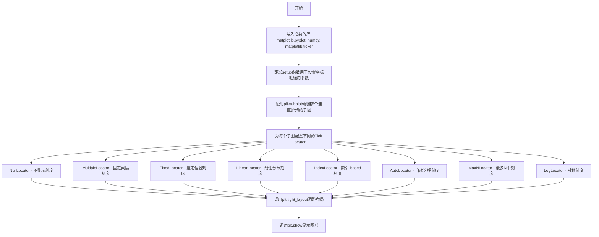
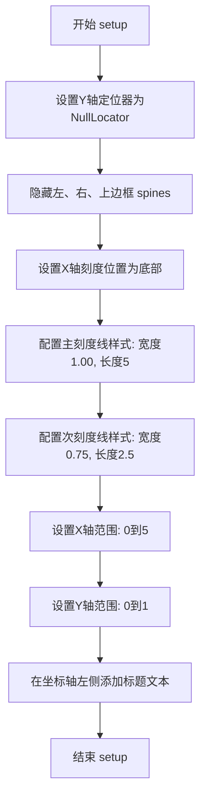

# `matplotlib\galleries\examples\ticks\tick-locators.py` 详细设计文档

这是一个matplotlib示例代码，演示了各种Tick Locators（刻度定位器）的使用方式和效果，包括NullLocator、MultipleLocator、FixedLocator、LinearLocator、IndexLocator、AutoLocator、MaxNLocator和LogLocator等，帮助开发者理解如何在图表中精确控制主刻度和次刻度的位置。

## 整体流程



## 类结构

```
Python脚本模块结构
├── 导入部分
│   ├── matplotlib.pyplot (plt)
│   ├── numpy (np)
│   └── matplotlib.ticker (ticker)
├── 函数定义
│   └── setup(ax, title) - 坐标轴参数设置函数
└── 主程序执行流程
```

## 全局变量及字段


### `fig`
    
matplotlib Figure对象，图形容器

类型：`matplotlib.figure.Figure`
    


### `axs`
    
包含8个子图的Axes数组对象

类型：`numpy.ndarray[matplotlib.axes.Axes]`
    


    

## 全局函数及方法


### `setup`

设置坐标轴的通用参数，包括刻度线样式、坐标轴范围、标题等，用于示例中多个坐标轴的统一配置。

参数：

- `ax`：`matplotlib.axes.Axes`，要设置的 Axes 对象，包含 x 轴和 y 轴的坐标轴对象
- `title`：`str`，要显示在坐标轴左侧的标题文本

返回值：`None`，该函数直接修改传入的 Axes 对象，不返回任何值

#### 流程图



#### 带注释源码

```python
def setup(ax, title):
    """Set up common parameters for the Axes in the example."""
    # 只显示底部边框，隐藏左、右、上边框
    # y轴使用NullLocator()不显示任何刻度线
    ax.yaxis.set_major_locator(ticker.NullLocator())
    ax.spines[['left', 'right', 'top']].set_visible(False)

    # 设置X轴刻度线只显示在底部
    ax.xaxis.set_ticks_position('bottom')
    
    # 配置主刻度线（major ticks）的样式：宽度1.00，长度5
    ax.tick_params(which='major', width=1.00, length=5)
    
    # 配置次刻度线（minor ticks）的样式：宽度0.75，长度2.5
    ax.tick_params(which='minor', width=0.75, length=2.5)
    
    # 设置X轴的显示范围为0到5
    ax.set_xlim(0, 5)
    
    # 设置Y轴的显示范围为0到1
    ax.set_ylim(0, 1)
    
    # 在坐标轴左侧添加标题文本，位置在Y轴范围内
    # 使用transform=ax.transAxes将位置转换为轴坐标系统（0-1）
    ax.text(0.0, 0.2, title, transform=ax.transAxes,
            fontsize=14, fontname='Monospace', color='tab:blue')
```

## 关键组件


### NullLocator

不显示任何刻度的定位器，用于需要隐藏所有刻度的场景。

### MultipleLocator

按照固定步长设置刻度位置的定位器，支持offset参数进行偏移，适用于需要等间距刻度但起点不是零的场景。

### FixedLocator

使用预定义的位置列表设置刻度，允许分别设置主刻度和次刻度的固定位置，适用于需要精确控制刻度位置的场景。

### LinearLocator

根据指定的最大刻度数量自动计算等间距刻度位置，支持主刻度和次刻度的独立设置，适用于线性坐标轴。

### IndexLocator

基于基数和偏移量计算刻度位置，刻度位置 = base * index + offset，适用于数据索引相关的场景。

### AutoLocator

自动选择合适的刻度间隔，基于数据的范围动态调整，是最常用的自动定位器。

### MaxNLocator

限制刻度数量在指定最大值以内，自动选择最优的刻度间隔和位置，适用于需要控制刻度数量的场景。

### LogLocator

用于对数坐标轴的刻度定位，支持指定对数基数和最大刻度数量，自动在对数尺度上分布刻度。

### setup 函数

设置坐标轴的通用显示参数，包括隐藏不需要的边框、设置刻度线样式、设置坐标轴范围。


## 问题及建议


### 已知问题

-   **硬编码的Magic Numbers**：多处使用硬编码数值（如`width=1.00, length=5`, `length=2.5`, `numticks=3`, `numticks=31`等），缺乏常量定义，可维护性差
-   **重复的代码模式**：虽然提取了`setup`函数，但`axs[4]`额外调用了`axs[4].plot([0]*5, color='white')`，与其他子图的设置模式不一致
-   **缺乏类型注解**：所有函数和参数都缺少类型注解，降低了代码的可读性和静态分析能力
-   **未使用的导入**：导入了`matplotlib.ticker as ticker`，但在某些定位器使用中可能存在未充分利用的API
-   **重复设置xlim**：在`setup`函数中统一设置了`ax.set_xlim(0, 5)`，但`axs[7]`又单独调用`set_xlim(10**3, 10**10)`覆盖了原有限制，造成冗余
-   **缺少参数验证**：各定位器（如`MultipleLocator`, `LinearLocator`等）的参数没有输入验证，可能导致运行时错误
-   **Jupyter特定注释**：使用`# %%`作为单元格分隔符，这是Jupyter Notebook特定标记，不适用于纯Python脚本环境
-   **全局状态修改**：代码直接修改`matplotlib`的全局设置（如`ax.spines`, `ax.tick_params`），缺乏封装

### 优化建议

-   **提取配置常量**：将所有Magic Numbers提取为模块级常量或配置字典
-   **统一API调用模式**：为不同定位器创建统一的配置接口，减少不一致的调用方式
-   **添加类型注解**：为`setup`函数和参数添加类型提示
-   **封装布局配置**：将`figsize`、`subplots`参数和`tight_layout`配置提取为独立配置函数
-   **添加参数校验**：在`setup`函数中添加参数类型和范围验证
-   **移除Jupyter特定标记**：将`# %%`注释替换为标准的Python文档字符串或移除
-   **消除重复状态设置**：在`setup`函数中根据传入参数动态决定是否覆盖xlim，或统一所有子图的坐标轴范围设置
-   **考虑异常处理**：对可能失败的API调用添加try-except包装


## 其它


### 设计目标与约束

本示例代码的设计目标是演示matplotlib中各种Tick Locators的使用方法和效果，帮助开发者理解不同定位器的功能。约束条件包括：依赖matplotlib.ticker模块、需要在matplotlib图表环境中运行、适用于X轴刻度定位。

### 错误处理与异常设计

本示例代码主要展示API调用，未包含复杂的错误处理机制。在实际应用中，若传入无效的locator参数（如负数、非法类型），matplotlib.ticker会抛出ValueError或TypeError。开发者在使用时需确保参数类型和范围符合API要求。

### 数据流与状态机

代码执行流程为：创建Figure和Axes对象 → 配置通用参数 → 为每个子图设置不同的Locator → 渲染显示。状态转换通过matplotlib的内部状态机管理，从创建locator到应用到axis再到渲染输出的单向流程。

### 外部依赖与接口契约

主要依赖包括：matplotlib.pyplot（图表创建）、matplotlib.ticker（定位器）、numpy（数值计算）。接口契约遵循matplotlib的Axis.set_major_locator()和set_minor_locator()方法规范，locator对象需实现__call__方法返回刻度位置数组。

### 性能考量

本示例为静态演示代码，性能不是主要关注点。在实际应用中，LogLocator处理大范围数据时可能存在性能开销，建议对极端情况（如numticks过大）进行限制。

### 可测试性

代码可通过单元测试验证locator返回值的正确性，例如测试MultipleLocator(0.5, offset=0.2)在指定范围内的返回值。测试时需mock matplotlib.pyplot以避免实际渲染。

### 配置管理

代码中硬编码了多个参数（如figsize=(8,6)、子图数量8个），可通过配置文件或参数化方式提取，提高灵活性。子图布局参数、字体设置等均可外部化。

### 版本兼容性

代码依赖matplotlib 3.x版本和numpy。部分API（如spines的列表索引语法）需matplotlib 3.3+版本。建议在requirements.txt中明确版本约束。

### 安全性考虑

本示例为纯展示代码，无用户输入处理，无安全风险。但在生产环境中使用np.linspace等函数时需验证参数范围，防止内存溢出。

### 可维护性与扩展性

代码结构清晰，每个locator的展示逻辑独立，便于添加新的locator类型。建议将setup函数参数化，并将locator配置抽象为数据驱动结构，提高代码复用性。


    