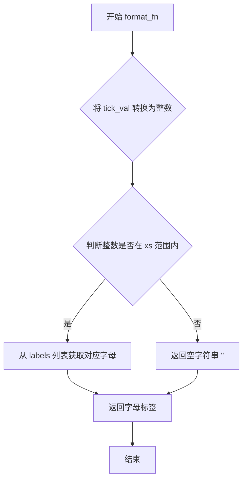
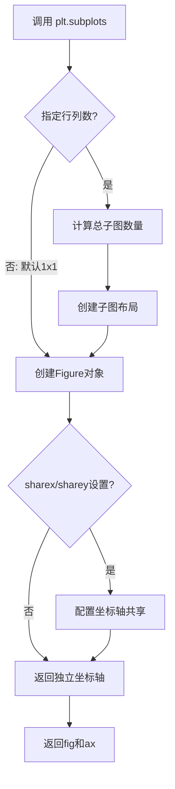
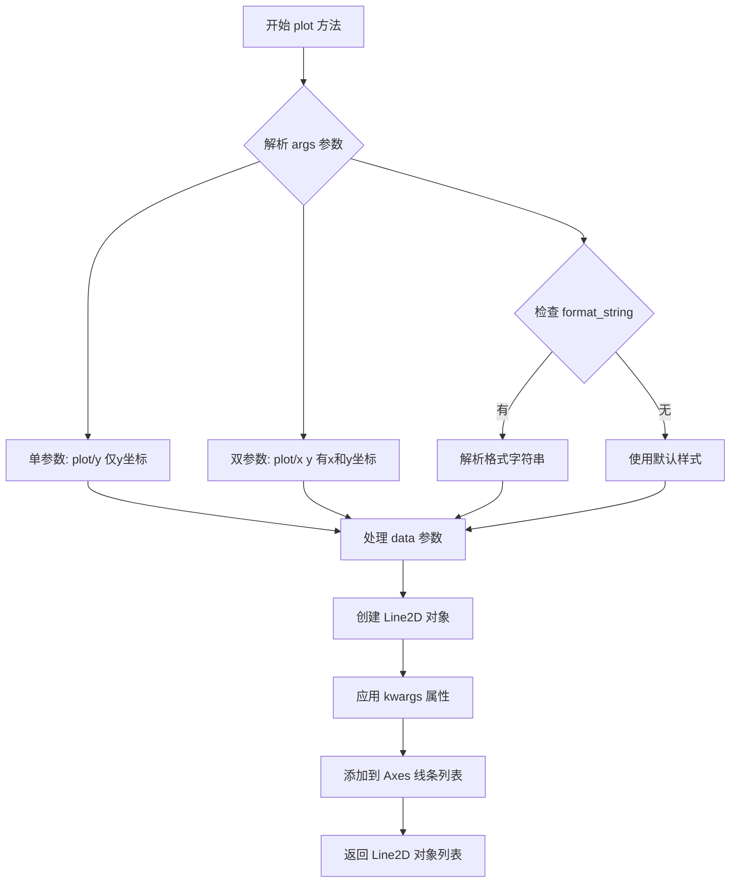
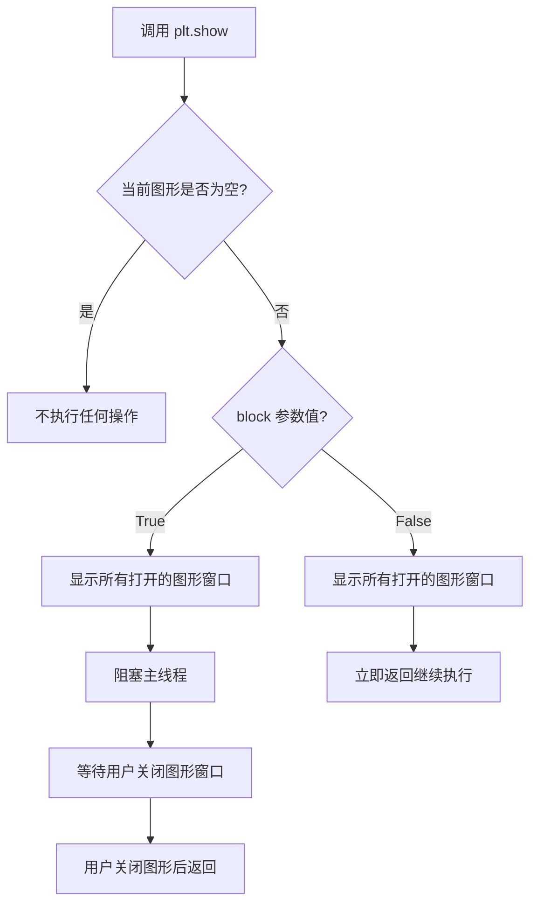
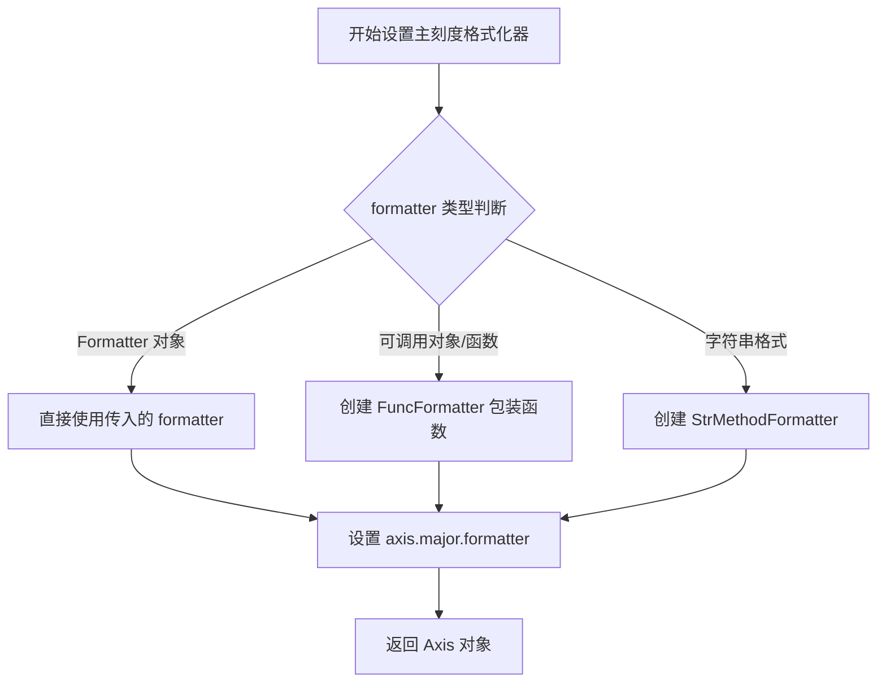
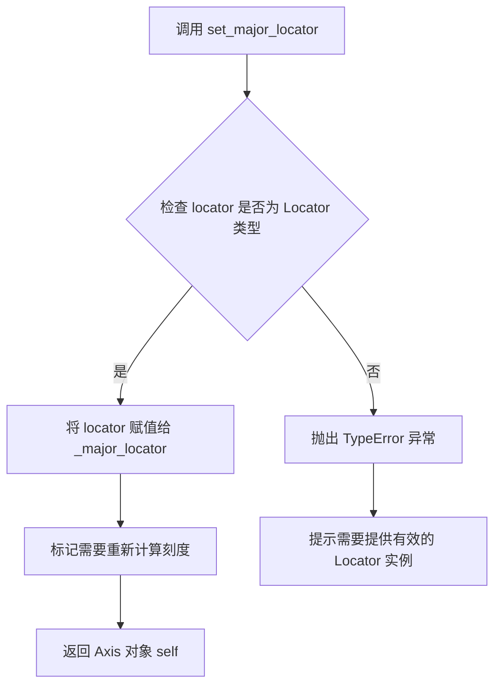

# `matplotlib\galleries\examples\ticks\tick_labels_from_values.py` 详细设计文档

该代码展示了如何在matplotlib中通过自定义格式化函数将x轴的数值刻度标签设置为字母列表，使用MaxNLocator确保刻度为整数，并绑制简单的折线图。

## 整体流程

```mermaid
graph TD
    A[开始] --> B[创建图表和坐标轴: plt.subplots()]
    B --> C[定义数据范围: xs=range(26), ys=range(26)]
    C --> D[定义标签列表: labels=abcdefghijklmnopqrstuvwxyz]
    D --> E[定义格式化函数: format_fn(tick_val, tick_pos)]
    E --> F[设置x轴格式化器: set_major_formatter(format_fn)]
    F --> G[设置x轴定位器: set_major_locator(MaxNLocator(integer=True))]
    G --> H[绑制折线图: ax.plot(xs, ys)]
    H --> I[显示图表: plt.show()]
    E --> J{判断tick_val是否在xs范围内}
    J -- 是 --> K[返回对应字母标签]
    J -- 否 --> L[返回空字符串]
```

## 类结构

```
该代码为脚本式Python程序，无面向对象类结构
主要包含模块级变量和函数定义
```

## 全局变量及字段


### `fig`
    
图表容器对象，用于存放坐标轴和图形元素

类型：`matplotlib.figure.Figure`
    


### `ax`
    
坐标轴对象，用于管理图表的坐标轴、刻度和标签

类型：`matplotlib.axes.Axes`
    


### `xs`
    
x轴数据范围，值为0到25的整数序列

类型：`range`
    


### `ys`
    
y轴数据范围，值为0到25的整数序列

类型：`range`
    


### `labels`
    
包含26个英文字母的列表，用于将数值映射为字母标签

类型：`list`
    


### `format_fn`
    
自定义格式化函数，将刻度值转换为对应的字母标签

类型：`function`
    


    

## 全局函数及方法


### format_fn

自定义格式化函数，用于将数值型的刻度值映射为字母标签，实现数字到字母的转换显示。

参数：

- `tick_val`：数值型，matplotlib 传入的刻度值
- `tick_pos`：位置型，matplotlib 传入的刻度位置（当前函数中未使用）

返回值：`str`，返回对应的字母标签（a-z），若值不在有效范围内则返回空字符串

#### 流程图



#### 带注释源码

```python
def format_fn(tick_val, tick_pos):
    """
    自定义格式化函数，将数值映射为字母标签
    
    参数:
        tick_val: 数值型，matplotlib 传入的刻度值
        tick_pos: 位置型，matplotlib 传入的刻度位置（当前未使用）
    
    返回:
        str: 对应的字母标签，若值无效则返回空字符串
    """
    # 将刻度值转换为整数
    tick_num = int(tick_val)
    
    # 检查数值是否在有效范围 xs (0-25) 内
    if tick_num in xs:
        # 从预定义的字母列表中获取对应索引的字母
        return labels[tick_num]
    else:
        # 超出范围时返回空字符串，不显示标签
        return ''
```


### `plt.subplots`

创建图形和坐标轴的 matplotlib 函数，返回图形对象和坐标轴对象（或坐标轴数组），支持自定义行列布局和共享轴设置。

参数：

- `nrows`：int，默认为 1，坐标轴的行数
- `ncols`：int，默认为 1，坐标轴的列数
- `sharex`：bool 或 str，默认为 False，是否共享 x 轴
- `sharey`：bool 或 str，默认为 False，是否共享 y 轴
- `squeeze`：bool，默认为 True，是否压缩返回的坐标轴数组维度
- `width_ratios`：array-like，可选，各列宽度比例
- `height_ratios`：array-like，可选，各行高度比例
- `**fig_kw`：dict，传递给 figure 创建的其他关键字参数

返回值：

- `fig`：matplotlib.figure.Figure，图形对象
- `ax`：Axes 或 Axes 数组，坐标轴对象

#### 流程图



#### 带注释源码

```python
import matplotlib.pyplot as plt
from matplotlib.ticker import MaxNLocator

# 调用 plt.subplots() 创建图形和坐标轴
# 参数均为默认值：1行1列，不共享轴，不压缩维度
fig, ax = plt.subplots()

# 定义数据：x为0-25，y为0-25
xs = range(26)
ys = range(26)

# 创建26个字母的标签列表
labels = list('abcdefghijklmnopqrstuvwxyz')

# 定义自定义格式化函数，用于将刻度值转换为对应字母
def format_fn(tick_val, tick_pos):
    """将数值刻度转换为字母标签"""
    # 检查刻度值是否在有效范围内
    if int(tick_val) in xs:
        # 返回对应的字母
        return labels[int(tick_val)]
    else:
        # 超出范围返回空字符串
        return ''

# 设置x轴的主刻度格式化器为自定义函数
ax.xaxis.set_major_formatter(format_fn)
# 设置x轴的主刻度定位器为整数定位器
ax.xaxis.set_major_locator(MaxNLocator(integer=True))

# 绘制数据
ax.plot(xs, ys)

# 显示图形
plt.show()
```

### 关键组件信息

| 名称 | 描述 |
|------|------|
| `fig` | 图形对象，整个图表的容器 |
| `ax` | 坐标轴对象，包含坐标轴、刻度、标签等 |
| `MaxNLocator` | 整数刻度定位器，确保刻度值为整数 |
| `format_fn` | 自定义格式化函数，将数值映射为字母标签 |

### 潜在技术债务与优化空间

1. **硬编码数据**：xs、ys、labels 直接硬编码，可考虑参数化或从外部读取
2. **魔法数字**：26 这个数字重复出现，应定义为常量
3. **错误处理**：format_fn 缺少对负数和浮点数的显式处理
4. **资源管理**：未显式调用 `fig.clear()` 或关闭图形，建议使用上下文管理器

### 其它项目

- **设计目标**：演示如何从列表值动态设置刻度标签
- **约束**：需配合 MaxNLocator 使用以确保整数刻度
- **错误处理**：format_fn 中使用 int() 转换可能丢失精度
- **外部依赖**：matplotlib.pyplot、matplotlib.ticker


### `Axes.plot`

`Axes.plot` 是 matplotlib 库中 `Axes` 类的核心方法，用于在坐标轴上绑制折线图。该方法接受 x 和 y 坐标数据（或仅 y 数据），支持多种格式字符串和数据参数，并返回表示线条的 `Line2D` 对象或对象列表。

参数：

- `*args`：可变位置参数，支持多种调用方式：
  - `plot(y)`：仅提供 y 坐标，x 自动生成
  - `plot(x, y)`：同时提供 x 和 y 坐标
  - `plot(x, y, format_string)`：添加格式字符串
- `fmt`：`str`，格式字符串，用于快速指定线条颜色、标记和样式（如 `'ro-'` 表示红色圆点线）
- `data`：`object`，可选，数据对象，用于通过字符串索引访问数据（如 pandas DataFrame）
- `**kwargs`：关键字参数，用于自定义 `Line2D` 对象的属性，如 `color`、`linewidth`、`linestyle`、`marker` 等

返回值：`list[matplotlib.lines.Line2D]`，返回绑制的线条对象列表，每个 `Line2D` 对象代表一条绑制的线条

#### 流程图



#### 带注释源码

```python
# 示例代码：ax.plot 的使用方式
import matplotlib.pyplot as plt
from matplotlib.ticker import MaxNLocator

# 创建 figure 和 axes 对象
fig, ax = plt.subplots()

# 准备绑图数据
xs = range(26)          # x 轴数据：0-25
ys = range(26)          # y 轴数据：0-25
labels = list('abcdefghijklmnopqrstuvwxyz')  # 标签列表

# 定义自定义格式化函数，用于将数字转换为字母标签
def format_fn(tick_val, tick_pos):
    """
    自定义格式化函数：将数值转换为对应的字母标签
    
    参数:
        tick_val: 刻度值
        tick_pos: 刻度位置
    返回:
        对应的字母标签或空字符串
    """
    if int(tick_val) in xs:
        return labels[int(tick_val)]  # 将数字转换为字母
    else:
        return ''

# 设置 x 轴的主格式化器为自定义函数
ax.xaxis.set_major_formatter(format_fn)
# 设置 x 轴的主定位器为整数定位器
ax.xaxis.set_major_locator(MaxNLocator(integer=True))

# 调用 Axes.plot 方法绑制折线图
# 参数：xs 作为 x 坐标，ys 作为 y 坐标
# 返回值：Line2D 对象列表
lines = ax.plot(xs, ys)

# 显示图形
plt.show()
```

### 关键组件信息

| 组件名称 | 一句话描述 |
|---------|-----------|
| `Axes.plot` | matplotlib 中用于在二维坐标轴上绑制折线图的核心方法 |
| `Line2D` | 表示二维线条的图形对象，包含线条样式、颜色、标记等属性 |
| `MaxNLocator` | 定位器类，用于自动计算合适的刻度数量和位置 |

### 潜在技术债务与优化空间

1. **缺少错误处理**：代码中未对 `format_fn` 的输入进行类型验证，若传入非数值类型可能导致异常
2. **硬编码数据**：数据直接硬编码在代码中，缺乏灵活性，应考虑参数化或配置文件
3. **性能考虑**：在大数据集场景下，`format_fn` 每次调用都会进行列表查找，可使用集合优化查询性能

### 其它项目

**设计目标与约束**：
- 目标是展示如何动态设置刻度标签而非使用静态刻度
- 约束：依赖 `MaxNLocator` 确保刻度为整数值

**错误处理与异常设计**：
- 建议在 `format_fn` 中添加类型检查，确保 `tick_val` 可转换为整数
- 建议捕获 `IndexError` 以防止标签列表越界

**外部依赖与接口契约**：
- 依赖 `matplotlib.pyplot`、`matplotlib.ticker.MaxNLocator`
- 接口契约：`plot()` 方法接受兼容的数组类数据（list、numpy array、pandas Series）


### `plt.show`

显示当前图形窗口中的所有图形。在交互式模式下，调用该函数会阻塞程序执行，直到用户关闭所有打开的图形窗口；在非交互式模式下，该函数会强制刷新所有待渲染的图形。

参数：

- `block`：`bool`，可选参数，控制是否阻塞程序执行。默认为 `True`，即阻塞直到用户关闭图形窗口；若设置为 `False`，则立即返回（在某些后端中可能不会显示图形）。

返回值：`None`，该函数无返回值。

#### 流程图



#### 带注释源码

```python
def show(block=None):
    """
    显示所有打开的图形窗口。
    
    参数:
        block: bool, optional
            是否阻塞程序执行。默认为 True。
            如果为 True，程序会暂停直到用户关闭所有图形窗口。
            如果为 False，函数会立即返回（在某些后端可能不会显示图形）。
    
    返回值:
        None
    
    注意:
        - 在调用 show() 之前，通常需要先创建图形（如使用 plt.subplots()）
        - 该函数会调用所有打开的 Figure 对象的 show() 方法
        - 在 Jupyter Notebook 中，建议使用 %matplotlib inline 或 %matplotlib widget
    """
    # 获取当前所有打开的图形
    allnums = get_fignums()
    
    # 如果没有打开的图形，直接返回
    if not allnums:
        return
    
    # 遍历所有图形并显示
    for fig_num in allnums:
        # 获取对应的 Figure 对象
        figManager = _pylab_helpers.Gcf.get_fig_manager(fig_num)
        
        # 如果存在图形管理器，则显示图形
        if figManager is not None:
            # 调用图形管理器的 show 方法
            figManager.show()
    
    # 如果 block 为 True，则阻塞等待
    if block:
        # 显示阻塞提示信息
        show_block()
    
    # 强制刷新图形渲染
    draw_all()
```

#### 使用示例源码

```python
import matplotlib.pyplot as plt
from matplotlib.ticker import MaxNLocator

# 创建图形和坐标轴对象
fig, ax = plt.subplots()

# 准备数据
xs = range(26)
ys = range(26)
labels = list('abcdefghijklmnopqrstuvwxyz')

# 定义自定义格式化函数，用于将数值转换为字母标签
def format_fn(tick_val, tick_pos):
    """自定义刻度标签格式化函数"""
    if int(tick_val) in xs:
        return labels[int(tick_val)]
    else:
        return ''

# 设置 X 轴的主格式化器为自定义函数
ax.xaxis.set_major_formatter(format_fn)

# 设置 X 轴的主定位器为整数定位器
ax.xaxis.set_major_locator(MaxNLocator(integer=True))

# 绘制数据
ax.plot(xs, ys)

# 显示图形窗口（阻塞模式：等待用户关闭窗口）
plt.show()
```


### `matplotlib.axis.Axis.set_major_formatter`

设置 Axes 的主刻度格式化器（Major Tick Formatter），用于控制主刻度标签的显示格式。该方法接受多种形式的格式化器（包括 FuncFormatter、可调用对象或字符串），并将其应用于坐标轴的主刻度标签格式化。

参数：

- `formatter`：可以是以下类型之一：
  - `matplotlib.ticker.Formatter`：格式化器对象（如 FuncFormatter, ScalarFormatter, StrMethodFormatter）
  - `Callable`：可调用对象（函数），会被自动包装为 FuncFormatter
  - `str`：格式字符串，会被自动转换为 StrMethodFormatter
  - 参数描述：用于格式化主刻度标签的格式化器

返回值：`matplotlib.axis.Axis`，返回 Axes 的 Axis 对象本身，支持链式调用

#### 流程图



#### 带注释源码

```python
# 设置主刻度格式化器的调用示例
# ax: matplotlib.axes.Axes 对象
# format_fn: 自定义格式化函数，接受 (tick_val, tick_pos) 参数

# 方法调用
ax.xaxis.set_major_formatter(format_fn)

# 内部实现逻辑（伪代码）
def set_major_formatter(self, formatter):
    """
    设置主刻度格式化器
    
    参数:
        formatter: 格式化器对象或可调用对象
    """
    # 如果传入的是函数或可调用对象
    if callable(formatter) and not isinstance(formatter, ticker.Formatter):
        # 自动将函数包装为 FuncFormatter
        formatter = ticker.FuncFormatter(formatter)
    
    # 如果传入的是字符串格式
    elif isinstance(formatter, str):
        # 转换为 StrMethodFormatter
        formatter = ticker.StrMethodFormatter(formatter)
    
    # 设置_major_formatter属性
    self.major.formatter = formatter
    
    # 返回self以支持链式调用
    return self
```

#### 关键组件信息

| 组件名称 | 一句话描述 |
|---------|-----------|
| `matplotlib.ticker.FuncFormatter` | 支持自定义函数作为格式化器的类，可将任意函数转换为刻度格式化器 |
| `matplotlib.ticker.MaxNLocator` | 自动选择最佳刻度数量的定位器，确保刻度为整数 |
| `matplotlib.axis.Axis` | 管理坐标轴刻度、标签和属性的核心类 |

#### 潜在技术债务或优化空间

1. **类型提示缺失**：matplotlib 源码中缺乏完整的类型注解，影响静态分析和 IDE 支持
2. **隐式类型转换**：自动将函数包装为 FuncFormatter 的行为虽然方便，但可能造成混淆，建议显式创建
3. **错误处理不足**：未对 formatter 的返回值进行验证，可能导致运行时错误

#### 其它项目

**设计目标与约束**：
- 保持与旧版本 matplotlib 的兼容性
- 支持多种格式化器类型输入，提供灵活的 API

**错误处理与异常设计**：
- 如果 formatter 不是有效类型，可能抛出 TypeError
- 如果自定义函数抛出异常，刻度标签可能显示为空或显示错误

**数据流与状态机**：
- 格式化器在绘图时由 `Axis.get_major_formatter()` 调用
- 状态变更会触发坐标轴的重绘

**外部依赖与接口契约**：
- 依赖 `matplotlib.ticker` 模块中的格式化器类
- formatter 必须实现 `__call__(self, val, pos)` 方法（如果是自定义类）


### `Axis.set_major_locator`

设置主刻度定位器（Major Tick Locator），用于确定主刻度的位置。定位器对象负责根据轴的范围和数据自动计算合适的刻度位置和数量。

参数：

- `locator`：`matplotlib.ticker.Locator`，定位器对象，用于控制主刻度的生成策略（如 MaxNLocator、AutoLocator、FixedLocator 等）

返回值：`matplotlib.axis.Axis`，返回轴对象本身，支持链式调用

#### 流程图



#### 带注释源码

```python
def set_major_locator(self, locator):
    """
    Set the locator of the major ticker.

    Parameters
    ----------
    locator : `matplotlib.ticker.Locator`
        The locator object used to determine the positions of the major
        ticks. Common locators include:
        - `MaxNLocator`: Automatically selects up to N ticks, with integer
          option for integer-valued ticks
        - `AutoLocator`: Default locator that chooses ticks automatically
        - `FixedLocator`: Fixed tick positions
        - `MultipleLocator`: Ticks at multiples of a given value

    Returns
    -------
    `matplotlib.axis.Axis`
        Returns self to allow method chaining.

    Examples
    --------
    >>> from matplotlib.ticker import MaxNLocator
    >>> ax.xaxis.set_major_locator(MaxNLocator(integer=True))
    >>> ax.yaxis.set_major_locator(MaxNLocator(5))  # Maximum 5 ticks
    """
    from matplotlib.ticker import Locator
    
    # 验证 locator 是否为有效的 Locator 实例
    if not isinstance(locator, Locator):
        raise TypeError(
            "locator must be a subclass of matplotlib.ticker.Locator")
    
    # 设置主刻度定位器
    self._major_locator = locator
    
    # 刷新 x 轴刻度的渲染
    self.stale_callback(self.axes)
    
    # 返回 self 以支持链式调用
    return self
```

#### 实际使用示例（来自代码）

```python
from matplotlib.ticker import MaxNLocator

fig, ax = plt.subplots()
xs = range(26)
ys = range(26)
labels = list('abcdefghijklmnopqrstuvwxyz')

def format_fn(tick_val, tick_pos):
    if int(tick_val) in xs:
        return labels[int(tick_val)]
    else:
        return ''

# 设置主刻度定位器为 MaxNLocator，并强制使用整数刻度
# 这样可以确保 x 轴只显示整数值的刻度
ax.xaxis.set_major_locator(MaxNLocator(integer=True))

# 设置主刻度格式化器为自定义函数
ax.xaxis.set_major_formatter(format_fn)

ax.plot(xs, ys)
plt.show()
```


## 关键组件


### format_fn 函数

自定义格式化函数，将数值刻度标签转换为字母标签

### xs, ys 数据变量

定义绘图数据的范围序列

### labels 列表

包含26个英文字母的列表，用于映射到数值轴

### MaxNLocator 类

整数定位器，确保刻度值为整数

### Axis.set_major_formatter 方法

设置主刻度标签的格式化器

### Axis.set_major_locator 方法

设置主刻度定位器


## 问题及建议


### 已知问题

-   **魔法数字问题**：数字 26（字母表长度）在代码中多次出现（`range(26)`），缺乏统一管理，增加维护成本
-   **缺乏类型注解**：`format_fn` 函数未使用类型提示（type hints），降低代码可读性和 IDE 辅助支持
-   **函数文档缺失**：`format_fn` 自定义格式化函数缺少 docstring，未说明参数和返回值含义
-   **边界条件处理不完善**：当 `tick_val` 超出范围时返回空字符串，但这种静默失败方式可能导致调试困难，建议抛出明确异常或记录警告
-   **索引越界风险**：虽然代码通过 `if int(tick_val) in xs` 做了判断，但 `labels[int(tick_val)]` 仍存在潜在索引越界风险（当 `xs` 为 `range(26)` 而 `tick_val` 为负数时）
-   **可扩展性不足**：标签列表和数值范围硬编码，若需要支持其他字符集（如中文、数字）需要大量修改

### 优化建议

-   **提取常量**：将字母表和范围定义为模块级常量，如 `ALPHABET = list('abcdefghijklmnopqrstuvwxyz')` 和 `TICK_RANGE = range(len(ALPHABET))`
-   **添加类型注解**：为 `format_fn` 添加类型提示 `def format_fn(tick_val: float, tick_pos: int) -> str:`
-   **完善文档**：为 `format_fn` 添加 docstring，说明参数含义和返回值
-   **改进边界处理**：使用异常处理或添加日志，例如：
    ```python
    try:
        return labels[int(tick_val)]
    except IndexError:
        return ''
    ```
-   **考虑面向对象设计**：如果项目中多处使用类似功能，可封装为自定义 Formatter 类，继承 `matplotlib.ticker.FuncFormatter`
-   **添加配置化支持**：允许外部传入标签列表和范围，提高代码复用性


## 其它


### 设计目标与约束

本示例的设计目标是演示如何在matplotlib中动态设置x轴刻度标签，使其从预定义的字符串列表中获取标签文本，而非使用默认的数字标签。核心约束包括：1）刻度值必须为整数且在有效范围内（0-25）；2）需要使用MaxNLocator确保刻度取整；3）格式化函数需要处理边界情况。

### 错误处理与异常设计

代码中的错误处理主要体现在format_fn函数中：当tick_val不在有效范围xs内时，返回空字符串''而非抛出异常。这种设计避免了索引越界错误（IndexError），因为当labels列表长度为26时，访问labels[26]会导致越界。此外，int()转换可能抛出ValueError，但在此场景下tick_val本身来自matplotlib，通常为数值类型。

### 外部依赖与接口契约

本代码依赖以下外部组件：1）matplotlib.pyplot提供绘图接口；2）matplotlib.ticker.MaxNLocator用于自动选择最优刻度位置并确保为整数；3）matplotlib.axis.Axis.set_major_formatter设置主刻度格式化器；4）matplotlib.axis.Axis.set_major_locator设置主刻度定位器。接口契约要求：format_fn必须接受两个参数（tick_val和tick_pos），返回值应为字符串类型。

### 性能考量

当前实现性能良好，因为：1）format_fn仅在需要绘制刻度标签时调用，调用次数有限；2）列表labels的in操作和索引访问均为O(1)复杂度；3）没有额外的计算密集型操作。对于大规模数据或实时绘图场景，潜在优化包括：预先将labels转换为集合以加速成员检查，或使用字典进行映射。

### 可维护性与扩展性

代码的可扩展性体现在：1）format_fn函数逻辑清晰，易于修改以适应不同需求；2）labels列表可轻松替换为其他数据源（如字典、数据库查询结果）；3）可添加更多条件分支以处理特殊值。维护建议：将labels、xs、ys等配置参数提取为常量或配置文件，便于统一管理。

### 测试策略建议

建议添加以下测试用例：1）边界值测试（tick_val为0、25、26时）；2）非整数tick_val的处理；3）空列表或特殊字符标签；4）多子图场景下的隔离性测试。可使用pytest框架结合matplotlib的测试工具进行自动化测试。

### 配置与参数说明

关键配置参数包括：xs和ys的范围（0-25），对应26个英文字母；labels列表存储所有可能的标签文本；MaxNLocator的integer=True参数确保刻度值为整数。这些参数可根据需要调整为其他字母表、数字序列或自定义文本。

    