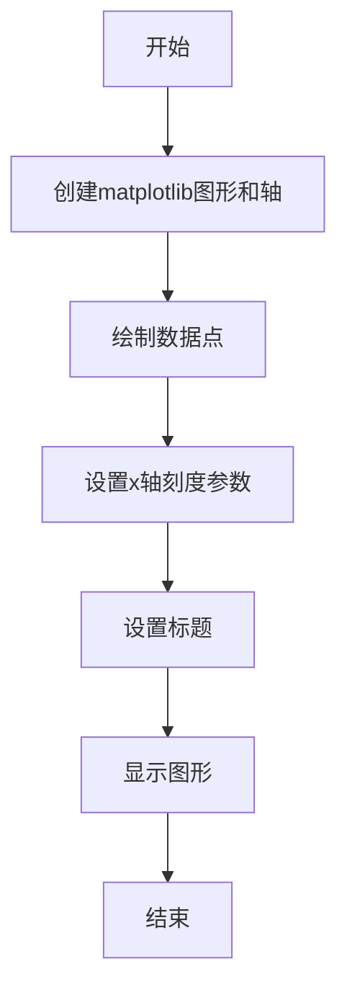
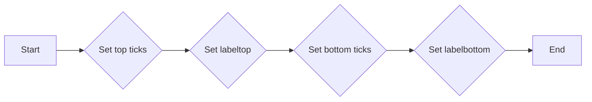
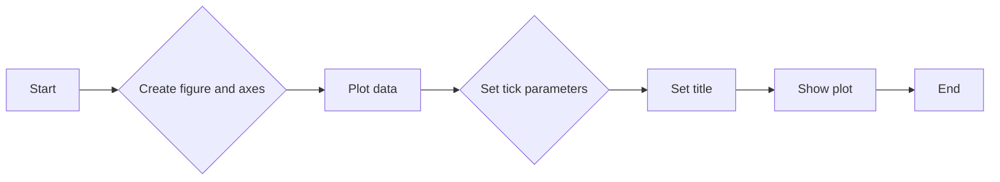
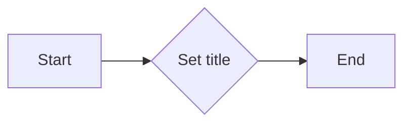
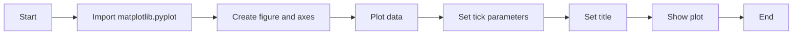

# `matplotlib\galleries\examples\ticks\tick_xlabel_top.py` 详细设计文档

This code modifies the position of x-axis tick labels in a matplotlib plot to appear at the top instead of the default bottom position.

## 整体流程



## 类结构

```
matplotlib.pyplot (matplotlib模块)
```

## 全局变量及字段


### `fig`
    
The main figure object containing all the plot elements.

类型：`matplotlib.figure.Figure`
    


### `ax`
    
The axes object representing the plot area where the data is drawn.

类型：`matplotlib.axes._subplots.AxesSubplot`
    


### `plt`
    
The matplotlib.pyplot module provides a high-level interface to Matplotlib.

类型：`matplotlib.pyplot`
    


### `matplotlib.pyplot.fig`
    
The main figure object containing all the plot elements.

类型：`matplotlib.figure.Figure`
    


### `matplotlib.pyplot.ax`
    
The axes object representing the plot area where the data is drawn.

类型：`matplotlib.axes._subplots.AxesSubplot`
    
    

## 全局函数及方法


### `ax.tick_params`

该函数用于配置matplotlib中轴（Axes）的刻度参数。

参数：

- `top`：`bool`，控制顶部刻度线的可见性。
- `labeltop`：`bool`，控制顶部刻度标签的可见性。
- `bottom`：`bool`，控制底部刻度线的可见性。
- `labelbottom`：`bool`，控制底部刻度标签的可见性。

返回值：无，该函数直接修改传入的Axes对象的刻度参数。

#### 流程图



#### 带注释源码

```python
import matplotlib.pyplot as plt

fig, ax = plt.subplots()
ax.plot(range(10))
# 设置顶部刻度线和标签可见，底部刻度线和标签不可见
ax.tick_params(top=True, labeltop=True, bottom=False, labelbottom=False)
ax.set_title('x-ticks moved to the top')
plt.show()
```


### `subplots`

`subplots` 是 `matplotlib.pyplot` 模块中的一个函数，用于创建一个图形和一个轴（Axes）对象，用于绘制图形。

参数：

- `figsize`：`tuple`，指定图形的大小（宽度和高度），默认为 `(6, 4)`。
- `dpi`：`int`，指定图形的分辨率（每英寸点数），默认为 `100`。
- `facecolor`：`color`，指定图形的背景颜色，默认为 `'white'`。
- `edgecolor`：`color`，指定图形的边缘颜色，默认为 `'none'`。
- `frameon`：`bool`，指定是否显示图形的边框，默认为 `True`。
- `num`：`int`，指定要创建的轴的数量，默认为 `1`。
- `gridspec_kw`：`dict`，指定 `GridSpec` 的关键字参数，用于更复杂的布局。
- `constrained_layout`：`bool`，指定是否启用 `constrained_layout`，默认为 `False`。

返回值：`fig`：`Figure` 对象，包含图形和轴。
`ax`：`Axes` 对象，用于绘制图形。

#### 流程图



#### 带注释源码

```python
import matplotlib.pyplot as plt

fig, ax = plt.subplots()  # Create a figure and an axes
ax.plot(range(10))        # Plot data
ax.tick_params(top=True, labeltop=True, bottom=False, labelbottom=False)  # Set tick parameters
ax.set_title('x-ticks moved to the top')  # Set title
plt.show()  # Show the plot
```


### `matplotlib.pyplot.plot`

`matplotlib.pyplot.plot` 是一个用于绘制二维线条图的函数，它可以将一系列数据点连接起来，形成一条线。

参数：

- `range(10)`：`int`，表示生成一个从0到9的整数序列，作为x轴的数据点。
- `ax`：`matplotlib.axes._subplots.AxesSubplot`，表示当前图表的轴对象，用于绘制图形。

返回值：`matplotlib.lines.Line2D`，表示绘制的线条对象。

#### 流程图

```mermaid
graph LR
A[Start] --> B{Call plot()}
B --> C[End]
```

#### 带注释源码

```python
import matplotlib.pyplot as plt

fig, ax = plt.subplots()
ax.plot(range(10))  # 生成一个从0到9的整数序列，作为x轴的数据点
ax.tick_params(top=True, labeltop=True, bottom=False, labelbottom=False)  # 将x轴的刻度标签移动到顶部
ax.set_title('x-ticks moved to the top')  # 设置图表标题
plt.show()  # 显示图表
```


### `matplotlib.pyplot.tick_params`

`matplotlib.pyplot.tick_params` is a function used to configure the tick parameters of an Axes object in the Matplotlib library. It allows for customization of tick visibility, label visibility, and other properties.

参数：

- `top`：`bool`，Determines whether the top tick lines and labels are visible.
- `labeltop`：`bool`，Determines whether the top tick labels are visible.
- `bottom`：`bool`，Determines whether the bottom tick lines are visible.
- `labelbottom`：`bool`，Determines whether the bottom tick labels are visible.

返回值：`None`，This function does not return any value.

#### 流程图


#### 带注释源码

```python
import matplotlib.pyplot as plt

fig, ax = plt.subplots()
ax.plot(range(10))
ax.tick_params(top=True, labeltop=True, bottom=False, labelbottom=False)
ax.set_title('x-ticks moved to the top')
plt.show()
```


### `matplotlib.pyplot.set_title`

`matplotlib.pyplot.set_title` 方法用于设置当前轴的标题。

参数：

- `title`：`str`，标题文本
- `loc`：`str`，标题位置，默认为 'center'，可选值包括 'left', 'center', 'right', 'top', 'bottom', 'upper left', 'upper center', 'upper right', 'lower left', 'lower center', 'lower right'
- `pad`：`float`，标题与轴边缘的距离，默认为 5
- `fontsize`：`float`，标题字体大小，默认为 12
- `color`：`str`，标题颜色，默认为 'black'
- `fontweight`：`str`，标题字体粗细，默认为 'normal'
- `fontstyle`：`str`，标题字体样式，默认为 'normal'
- `verticalalignment`：`str`，垂直对齐方式，默认为 'bottom'
- `horizontalalignment`：`horizontalalignment`，水平对齐方式，默认为 'center'

返回值：`Axes` 对象，当前轴对象

#### 流程图



#### 带注释源码

```python
import matplotlib.pyplot as plt

fig, ax = plt.subplots()
ax.plot(range(10))
ax.set_title('x-ticks moved to the top')
plt.show()
```


### plt.show()

`plt.show()` 是一个全局函数，用于显示当前图形。

参数：

- 无

返回值：无

#### 流程图



#### 带注释源码

```python
"""
==================================
Move x-axis tick labels to the top
==================================

`~.axes.Axes.tick_params` can be used to configure the ticks. *top* and
*labeltop* control the visibility tick lines and labels at the top x-axis.
To move x-axis ticks from bottom to top, we have to activate the top ticks
and deactivate the bottom ticks::

    ax.tick_params(top=True, labeltop=True, bottom=False, labelbottom=False)

.. note::

    If the change should be made for all future plots and not only the current
    Axes, you can adapt the respective config parameters

    - :rc:`xtick.top`
    - :rc:`xtick.labeltop`
    - :rc:`xtick.bottom`
    - :rc:`xtick.labelbottom`

"""

import matplotlib.pyplot as plt

fig, ax = plt.subplots()
ax.plot(range(10))
ax.tick_params(top=True, labeltop=True, bottom=False, labelbottom=False)
ax.set_title('x-ticks moved to the top')

plt.show()
```


## 关键组件


### 张量索引与惰性加载

张量索引与惰性加载是用于在数据结构中高效访问元素，同时延迟计算直到实际需要时。

### 反量化支持

反量化支持是允许在量化过程中对某些操作进行非量化处理，以保持精度和性能。

### 量化策略

量化策略是用于将浮点数数据转换为固定点数表示的方法，以减少内存使用和提高计算效率。


## 问题及建议


### 已知问题

-   {问题1}：代码仅展示了如何将x轴的刻度标签移动到顶部，但没有提供任何错误处理或异常设计，如果用户尝试在非matplotlib环境中运行此代码，可能会引发错误。
-   {问题2}：代码没有提供任何关于配置参数的详细信息，例如`xtick.top`、`xtick.labeltop`等配置参数的具体用途和设置方法。
-   {问题3}：代码没有考虑国际化问题，例如不同语言环境中x轴刻度标签的显示方式可能有所不同。

### 优化建议

-   {建议1}：增加异常处理，确保代码在非matplotlib环境中运行时能够给出明确的错误信息。
-   {建议2}：提供详细的配置参数说明，包括每个参数的用途和可能的设置值。
-   {建议3}：考虑国际化问题，为不同语言环境提供相应的刻度标签显示方式。
-   {建议4}：将代码封装成一个函数或类，以便在其他matplotlib绘图代码中复用。
-   {建议5}：增加单元测试，确保代码在不同情况下都能正常工作。


## 其它


### 设计目标与约束

- 设计目标：实现将x轴刻度标签移动到顶部的功能，并确保该设置适用于当前和未来的绘图。
- 约束：必须使用matplotlib库，且不引入额外的依赖。

### 错误处理与异常设计

- 错误处理：确保在调用`plt.subplots()`和`ax.plot()`时处理可能的异常，如matplotlib版本不兼容等。
- 异常设计：定义异常处理策略，如记录错误日志、提供用户友好的错误信息等。

### 数据流与状态机

- 数据流：从创建图形和轴对象开始，到设置刻度参数，最后显示图形。
- 状态机：图形和轴对象的状态变化，如从无到有，从无刻度到有刻度等。

### 外部依赖与接口契约

- 外部依赖：matplotlib库。
- 接口契约：确保matplotlib的API调用符合预期，如`subplots()`、`plot()`和`tick_params()`等。

### 测试与验证

- 测试策略：编写单元测试以验证代码的功能和性能。
- 验证方法：使用不同的输入数据集和配置参数来测试代码的稳定性和准确性。

### 性能优化

- 性能指标：评估代码的执行时间和资源消耗。
- 优化策略：分析代码瓶颈，如循环、递归等，并采取相应的优化措施。

### 安全性考虑

- 安全风险：确保代码不会引入安全漏洞，如注入攻击等。
- 安全措施：对输入数据进行验证和清理，以防止潜在的安全威胁。

### 维护与扩展

- 维护策略：定期更新代码，修复已知问题，并添加新功能。
- 扩展性：设计代码结构，以便于未来添加新的功能或修改现有功能。


    