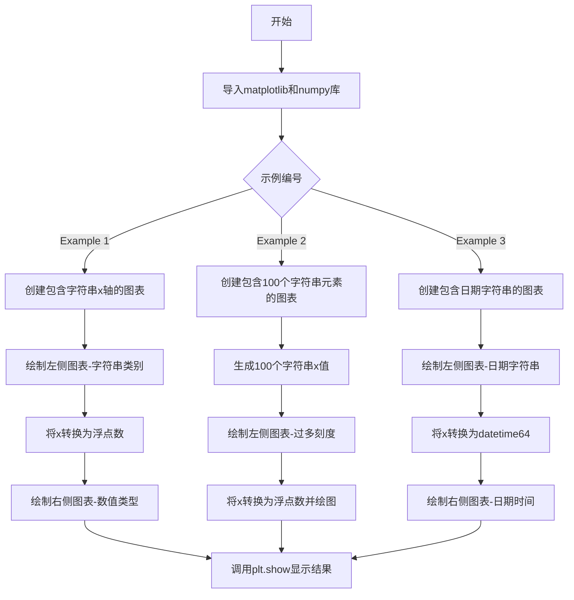
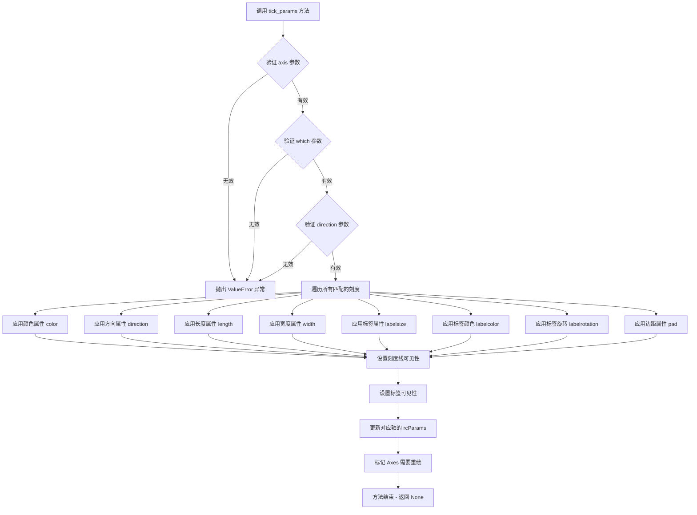
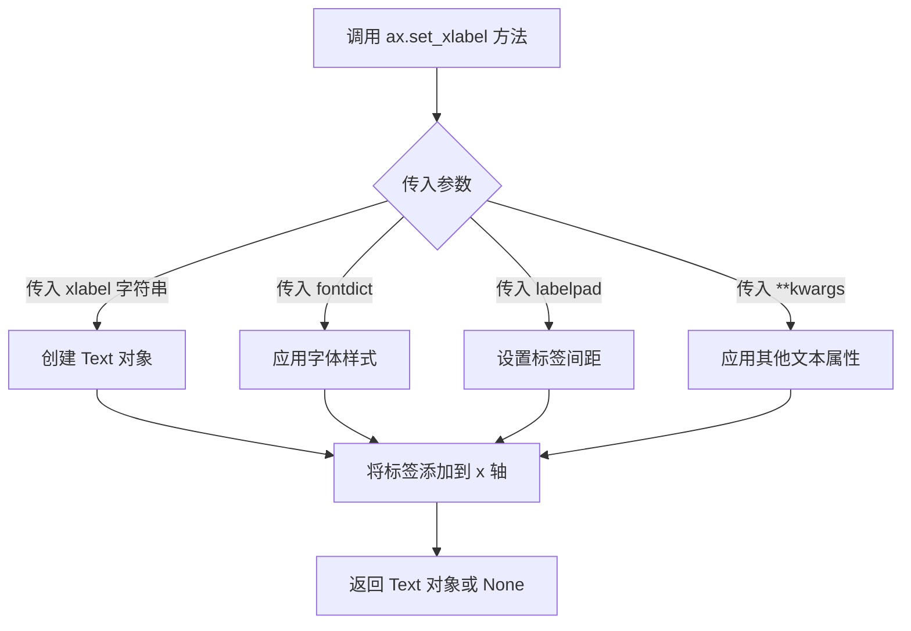
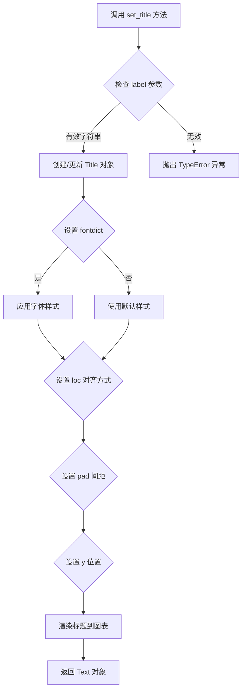
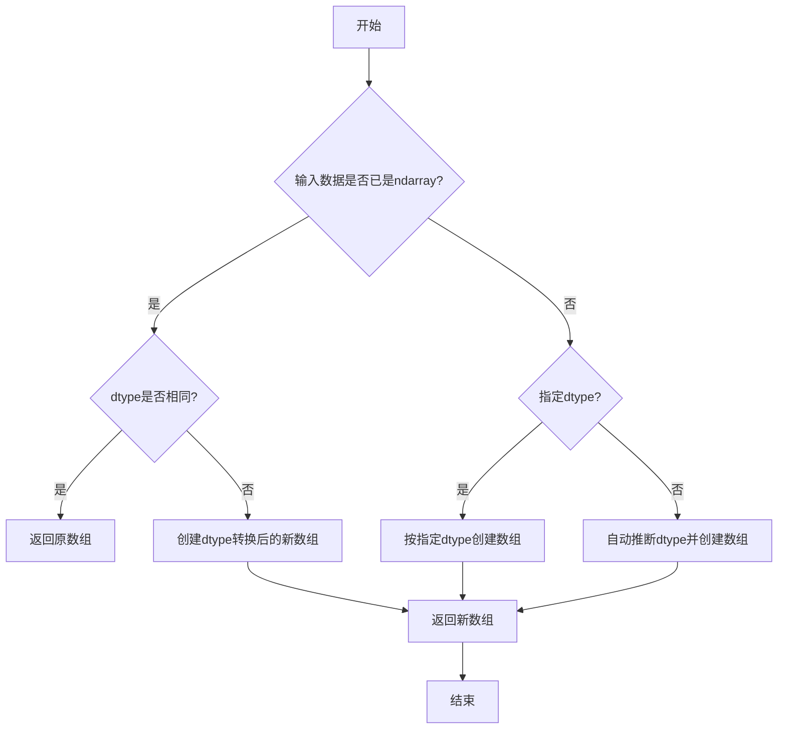
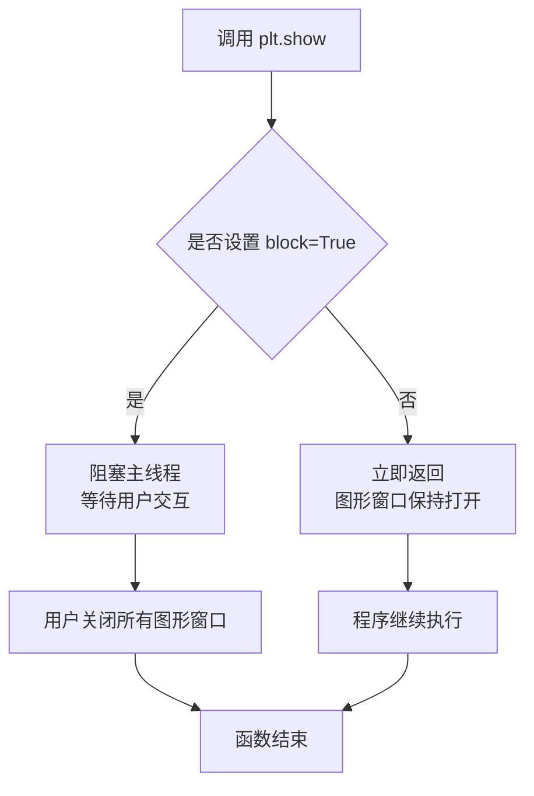

# `matplotlib\galleries\examples\ticks\ticks_too_many.py` 详细设计文档

这是一个Matplotlib教程文档，演示了当使用字符串类别变量而非数值或日期时间对象时可能出现的刻度线异常问题，并提供了将字符串转换为适当数据类型（浮点数或datetime）以获得正确刻度显示的解决方案。

## 整体流程



## 类结构

```
无面向对象结构 - 该文件为脚本式教程文档
主要包含三个独立的示例函数块（顺序执行）
```

## 全局变量及字段


### `fig`
    
图表容器对象，用于管理整个图形的内容和布局

类型：`matplotlib.figure.Figure`
    


### `ax`
    
坐标轴对象，用于管理图形的坐标轴、刻度和数据绘制

类型：`matplotlib.axes.Axes 或 Axes 数组`
    


### `x`
    
演示用的x轴数据，初始为字符串类型后可转换为浮点数或datetime64

类型：`list 或 np.ndarray`
    


### `y`
    
演示用的y轴数据，包含与x对应的数值

类型：`list 或 np.ndarray`
    


    

## 全局函数及方法


### `plt.subplots`

`plt.subplots` 是 Matplotlib 库中 `pyplot` 模块的核心函数之一，用于创建一个新的图形窗口（Figure）以及一个或多个子图（Axes）。该函数简化了传统上需要先调用 `plt.figure()` 再调用 `plt.add_subplot()` 或 `plt.subplot()` 的两步操作，提供了一行代码创建图形和坐标轴的便捷方式。

参数：

- `nrows`：`int`，默认值 1，表示子图的行数
- `ncols`：`int`，默认值 1，表示子图的列数
- `sharex`：`bool` 或 `str`，默认值 False，如果为 True，则所有子图共享 x 轴；如果为 'col'，则每列子图共享 x 轴；如果为 'row'，则每行子图共享 x 轴
- `sharey`：`bool` 或 `str`，默认值 False，如果为 True，则所有子图共享 y 轴；如果为 'col'，则每列子图共享 y 轴；如果为 'row'，则每行子图共享 y 轴
- `squeeze`：`bool`，默认值 True，如果为 True，则返回的 axes 数组维度会被压缩：当只有 1 个子图时返回单个 Axes 对象，而非 1x1 数组
- `subplot_kw`：字典，默认值 None，传递给每个 `add_subplot` 调用的关键字参数，用于配置子图属性（如投影类型等）
- `gridspec_kw`：字典，默认值 None，传递给 `GridSpec` 构造函数的关键字参数，用于控制网格布局
- `**fig_kw`：关键字参数，传递给 `plt.figure()` 函数的关键字参数，用于配置图形属性（如 figsize、dpi 等）

返回值：`tuple(Figure, Axes or ndarray of Axes)`，返回一个元组，第一个元素是 Figure 对象（图形窗口），第二个元素是 Axes 对象（单个坐标轴）或 Axes 数组（多个坐标轴）

#### 流程图

```mermaid
flowchart TD
    A[开始调用 plt.subplots] --> B{传入 fig_kw 参数?}
    B -->|是| C[调用 plt.figure 创建 Figure]
    B -->|否| D[使用默认参数创建 Figure]
    C --> E{传入 gridspec_kw 参数?}
    D --> E
    E -->|是| F[使用 GridSpec 配置网格布局]
    E -->|否| G[使用默认 nrows x ncols 网格]
    F --> H[根据 nrows 和 ncols 循环创建子图]
    G --> H
    H --> I[对每个子图调用 add_subplot]
    I --> J{传入 subplot_kw 参数?}
    J -->|是| K[应用 subplot_kw 配置]
    J -->|否| L[使用默认配置]
    K --> M{设置 sharex/sharey?}
    L --> M
    M -->|是| N[配置坐标轴共享属性]
    M -->|否| O{设置 squeeze=True?}
    N --> O
    O -->|是| P[压缩返回的 Axes 数组维度]
    O -->|否| Q[保持原始数组维度]
    P --> R[返回 (Figure, Axes) 元组]
    Q --> R
```

#### 带注释源码

```python
def subplots(nrows=1, ncols=1, sharex=False, sharey=False,
             squeeze=True, subplot_kw=None, gridspec_kw=None, **fig_kw):
    """
    创建图形(Figure)和一个或多个子图(Axes)。
    
    参数
    ----------
    nrows : int, default: 1
        子图的行数。
    ncols : int, default: 1
        子图的列数。
    sharex : bool or {'row', 'col'}, default: False
        如果为 True，所有子图共享 x 轴；
        如果为 'row'，每行子图共享 x 轴；
        如果为 'col'，每列子图共享 x 轴。
    sharey : bool or {'row', 'col'}, default: False
        如果为 True，所有子图共享 y 轴；
        如果为 'row'，每行子图共享 y 轴；
        如果为 'col'，每列子图共享 y 轴。
    squeeze : bool, default: True
        如果为 True，当只有单个子图时返回单个 Axes 对象而非数组。
    subplot_kw : dict, optional
        传递给 add_subplot 的关键字参数。
    gridspec_kw : dict, optional
        传递给 GridSpec 的关键字参数。
    **fig_kw
        传递给 figure() 的关键字参数。
    
    返回
    -------
    fig : Figure
        图形对象。
    ax : Axes or array of Axes
        坐标轴对象或坐标轴数组。
    """
    
    # 1. 创建 Figure 对象，传入 fig_kw 参数
    fig = figure(**fig_kw)
    
    # 2. 创建子图数组
    # 使用 gridspec_kw 配置网格规格
    if gridspec_kw is None:
        gridspec_kw = {}
    
    # 3. 遍历创建所有子图
    ax_arr = np.empty((nrows, ncols), dtype=object)
    
    # 4. 循环创建每个子图位置
    for i in range(nrows):
        for j in range(ncols):
            # 创建子图关键字参数
            kw = subplot_kw or {}
            # 添加到 figure 中
            ax = fig.add_subplot(nrows, ncols, i * ncols + j + 1, **kw)
            ax_arr[i, j] = ax
    
    # 5. 处理坐标轴共享
    if sharex == 'col':
        for i in range(nrows):
            for j in range(ncols - 1):
                ax_arr[i, j].sharex(ax_arr[i, j + 1])
    elif sharex == 'row':
        for i in range(nrows - 1):
            for j in range(ncols):
                ax_arr[i, j].sharex(ax_arr[i + 1, j])
    elif sharex:
        for i in range(nrows):
            for j in range(ncols):
                if i > 0:
                    ax_arr[i, j].sharex(ax_arr[0, j])
                if j > 0:
                    ax_arr[i, j].sharey(ax_arr[i, 0])
    
    # 类似的处理 sharey...
    
    # 6. 处理 squeeze 参数
    if squeeze:
        # 压缩维度：单行或单列时返回一维数组
        if nrows == 1 and ncols == 1:
            return fig, ax_arr[0, 0]
        elif nrows == 1 or ncols == 1:
            return fig, ax_arr.ravel()
    
    # 7. 返回完整数组
    return fig, ax_arr
```

## 补充说明

### 在示例代码中的使用

在用户提供的代码中，`plt.subplots` 的使用方式如下：

```python
fig, ax = plt.subplots(1, 2, layout='constrained', figsize=(6, 2.5))
```

- `1, 2`：创建 1 行 2 列的子图布局
- `layout='constrained'`：使用约束布局自动调整子图间距
- `figsize=(6, 2.5)`：设置图形大小为 6x2.5 英寸
- 返回值：`fig` 是 Figure 对象，`ax` 是包含 2 个 Axes 对象的数组

### 设计目标与约束

1. **简化 API**：将 figure 创建和 subplot 创建合并为单一操作
2. **灵活的布局控制**：支持 GridSpec 和约束布局
3. **坐标轴共享机制**：避免重复的刻度标签

### 潜在优化空间

1. 可以考虑添加更多布局选项（如 `layout='pack'`）
2. 对于大规模子图创建，性能可以进一步优化
3. 可以添加更多返回值的选项（如同时返回 GridSpec 对象）

### 外部依赖

- `matplotlib.figure.Figure`：图形对象
- `matplotlib.axes.Axes`：坐标轴对象
- `numpy`：用于数组操作


### `Axes.plot`

绘制线图或散点图是matplotlib中Axes对象最核心的方法之一，用于将数据以线型或标记的形式可视化到坐标系中。该方法接受多种输入格式，支持灵活的数据绑定、样式设置和关键字参数，能够处理数值数据、日期时间数据以及分类数据，并返回包含所有绘制线条的Line2D对象列表供后续操作。

参数：

- `x`：`array-like` 或 `scalar`，可选的x轴数据。如果未提供，则使用`range(len(y))`作为默认值
- `y`：`array-like`，必需的y轴数据
- `fmt`：`str`，可选的格式字符串，组合了线条样式和标记样式，格式如`'d'`（菱形标记）、`'o-'`（圆圈标记加实线）等
- `**kwargs`：`various`，可选的关键字参数，用于设置Line2D的属性，如`color`（颜色）、`linewidth`（线宽）、`markersize`（标记大小）、`label`（图例标签）等

返回值：`list of Line2D`，返回一个包含所有绘制线条的Line2D对象列表，每个对象代表一条线或一组标记，可用于后续的样式修改和属性设置

#### 流程图

```mermaid
flowchart TD
    A[开始 plot 调用] --> B{检查输入参数}
    B -->|提供 x 和 y| C[使用用户提供的数据]
    B -->|仅提供 y| D[自动生成 x: range(len(y))]
    C --> E{检查 format string}
    D --> E
    E -->|有 fmt| F[解析格式字符串获取线条和标记样式]
    E -->|无 fmt| G[使用默认样式]
    F --> H[创建 Line2D 对象]
    G --> H
    H --> I[应用 **kwargs 设置的属性]
    I --> J[将 Line2D 添加到 Axes]
    J --> K[配置坐标轴范围和刻度]
    K --> L[返回 Line2D 对象列表]
```

#### 带注释源码

```python
# 模拟 Axes.plot 方法的核心逻辑展示
def plot(self, x=None, y=None, fmt=None, **kwargs):
    """
    绘制线图或散点图到Axes对象上
    
    Parameters
    ----------
    x : array-like, optional
        x轴数据。如果为None，则使用range(len(y))
    y : array-like
        y轴数据，必需参数
    fmt : str, optional
        格式字符串，例如 'o-' 表示圆圈标记加实线
    **kwargs : Line2D properties, optional
        Line2D的属性，如color, linewidth, marker等
    
    Returns
    -------
    list of ~matplotlib.lines.Line2D
        绘制的线条对象列表
    """
    
    # 步骤1: 处理输入数据
    # 如果只提供了y参数，自动生成x坐标
    if x is None:
        x = range(len(y))
    
    # 步骤2: 解析格式字符串获取样式
    # fmt格式: [marker][line][color] 如 'o-r', 'd--b'
    parsed_fmt = self._parse_format_string(fmt) if fmt else {}
    
    # 步骤3: 合并格式字符串样式和kwargs
    # kwargs优先级高于fmt中的样式
    line_props = {**parsed_fmt, **kwargs}
    
    # 步骤4: 创建Line2D对象
    # Line2D代表坐标系中的一条线或一组标记
    line = mlines.Line2D(x, y, **line_props)
    
    # 步骤5: 将线条添加到Axes
    self.lines.append(line)
    
    # 步骤6: 更新坐标轴范围
    self._update_limits(x, y)
    
    # 步骤7: 返回Line2D对象列表供后续操作
    return [line]
```

**使用示例（基于给定代码）：**

```python
# 示例1: 使用格式字符串 'd'（菱形标记）
ax[0].plot(x, y, 'd')

# 示例2: 使用默认线条样式（无标记格式字符串）
ax[1].plot(x, y, 'd')

# 示例3: 处理日期时间数据
x_dates = ['2021-10-01', '2021-11-02', '2021-12-03', '2021-09-01']
x_converted = np.asarray(x_dates, dtype='datetime64[s]')
ax[1].plot(x_converted y, 'd')
```


### `Axes.tick_params`

配置刻度线（tick）和刻度标签（tick label）的外观属性，包括颜色、方向、大小、旋转角度等。该方法直接修改当前 Axes 对象的刻度外观，无返回值。

参数：

- `axis`：`str`，可选参数，指定要配置的轴，取值为 `'x'`、`'y'` 或 `'both'`，默认为 `'both'`
- `which`：`str`，可选参数，指定要配置的刻度类型，取值为 `'major'`、`'minor'` 或 `'both'`，默认为 `'major'`
- `direction`：`str`，可选参数，刻度线的方向，取值为 `'in'`（向内）、`'out'`（向外）或 `'inout'`（双向），默认为 `'out'`
- `length`：`float`，可选参数，刻度线的长度（以点为单位）
- `width`：`float`，可选参数，刻度线的宽度（以点为单位）
- `color`：`color`，可选参数，刻度线的颜色，支持颜色名称、十六进制、RGB 元组等格式
- `pad`：`float`，可选参数，刻度线与刻度标签之间的间距（以点为单位）
- `labelsize`：`float` 或 `str`，可选参数，刻度标签的字体大小
- `labelcolor`：`color`，可选参数，刻度标签的颜色
- `labelrotation`：`float`，可选参数，刻度标签的旋转角度（以度为单位）
- `grid_on`：`bool`，可选参数，是否启用对应轴的网格线
- `bottom`、`top`、`left`、`right`：`bool`，可选参数，控制是否在轴的相应侧显示刻度线
- `labelbottom`、`labeltop`、`labelleft`、`labelright`：`bool`，可选参数，控制是否在轴的相应侧显示刻度标签

返回值：`None`，该方法无返回值，直接修改 Axes 对象的刻度属性

#### 流程图



#### 带注释源码

```python
def tick_params(self, axis='both', which='major', **kwargs):
    """
    配置刻度线和刻度标签的外观属性。
    
    Parameters
    ----------
    axis : {'x', 'y', 'both'}, optional
        要配置的轴。默认为 'both'。
    which : {'major', 'minor', 'both'}, optional
        要配置的刻度类型。默认为 'major'。
    **kwargs : 关键字参数
        允许的属性包括:
        - direction: {'in', 'out', 'inout'} 刻度方向
        - length: float 刻度线长度
        - width: float 刻度线宽度
        - color: color 刻度线颜色
        - pad: float 刻度与标签间距
        - labelsize: float 标签字体大小
        - color: color 标签颜色
        - labelrotation: float 标签旋转角度
        - grid_on: bool 是否显示网格
        - left/right/top/bottom: bool 刻度线可见性
        - labelleft/labelright/labeltop/labelbottom: bool 标签可见性
    
    Returns
    -------
    None
    
    Notes
    -----
    此方法直接修改 Axes 对象的状态，不会返回新的对象。
    修改后的效果在下次绘图时自动显示。
    """
    # 获取对应的轴对象
    ax = self._get_axis(axis)
    
    # 获取对应的刻度定位器
    if which in ('major', 'both'):
        ticks = ax.get_major_ticks()
    if which in ('minor', 'both'):
        ticks.extend(ax.get_minor_ticks())
    
    # 解析并应用 kwargs 中的参数
    # 处理方向参数
    if 'direction' in kwargs:
        direction = kwargs.pop('direction')
        _api.check_in_list(['in', 'out', 'inout'], direction=direction)
        for tick in ticks:
            tick.tick1line.set_direction(direction)
            tick.label1.set_rotation_mode('default')
    
    # 处理颜色参数
    if 'color' in kwargs:
        color = kwargs.pop('color')
        for tick in ticks:
            tick.tick1line.set_color(color)
            tick.tick2line.set_color(color)
    
    # 处理标签颜色参数
    if 'labelcolor' in kwargs:
        labelcolor = kwargs.pop('labelcolor')
        # 支持 'inherit' 特殊值
        if labelcolor == 'inherit':
            labelcolor = ax._labelcolor
        for tick in ticks:
            tick.label1.set_color(labelcolor)
            tick.label2.set_color(labelcolor)
    
    # 处理标签旋转参数
    if 'labelrotation' in kwargs:
        labelrotation = kwargs.pop('labelrotation')
        for tick in ticks:
            tick.label1.set_rotation(labelrotation)
            tick.label2.set_rotation(labelrotation)
    
    # 处理刻度线长度参数
    if 'length' in kwargs:
        length = kwargs.pop('length')
        for tick in ticks:
            tick.tick1line.set_markersize(length)
            tick.tick2line.set_markersize(length)
    
    # 处理刻度线宽度参数
    if 'width' in kwargs:
        width = kwargs.pop('width')
        for tick in ticks:
            tick.tick1line.set_markeredgewidth(width)
            tick.tick2line.set_markeredgewidth(width)
    
    # 处理标签大小参数
    if 'labelsize' in kwargs:
        labelsize = kwargs.pop('labelsize')
        for tick in ticks:
            tick.label1.set_fontsize(labelsize)
            tick.label2.set_fontsize(labelsize)
    
    # 处理刻度可见性参数
    visible_params = {
        'left': ('tick1line', 'label1'),
        'right': ('tick2line', 'label2'),
        'top': ('tick2line', 'label2'),
        'bottom': ('tick1line', 'label1'),
    }
    for param_name, (tick_attr, label_attr) in visible_params.items():
        if param_name in kwargs:
            visible = kwargs.pop(param_name)
            for tick in ticks:
                getattr(tick, tick_attr).set_visible(visible)
    
    # 处理标签可见性参数
    label_visible_params = {
        'labelleft': 'label1',
        'labelright': 'label2',
        'labeltop': 'label2',
        'labelbottom': 'label1',
    }
    for param_name, label_attr in label_visible_params.items():
        if param_name in kwargs:
            visible = kwargs.pop(param_name)
            for tick in ticks:
                getattr(tick, label_attr).set_visible(visible)
    
    # 处理网格参数
    if 'grid_on' in kwargs:
        grid_on = kwargs.pop('grid_on')
        if grid_on:
            ax.grid(True, which=which)
        else:
            ax.grid(False, which=which)
    
    # 更新轴的 rcParams 以同步更改
    ax._update_label_properties()
    
    # 标记 Axes 需要重新绘制
    self.stale_callback = True
    
    # 返回 None 表示就地修改
    return None
```


### `ax.set_xlabel`

设置 x 轴的标签（_xlabel），用于为图表的横坐标添加描述性文本。在 matplotlib 中，这是 Axes 对象的实例方法，用于设置坐标轴的标题标签。

参数：

- `xlabel`：`str`，要设置的 x 轴标签文本内容
- `fontdict`：可选的字典，用于控制标签的字体属性（如 fontsize、fontweight 等）
- `labelpad`：可选的浮点数，表示标签与坐标轴之间的间距（单位为点）
- `**kwargs`：其他关键字参数，会传递给底层 `Text` 对象的构造函数，用于自定义标签外观（如颜色、旋转角度等）

返回值：`Text` 或 `None`，返回创建的 `Text` 对象，如果出错则返回 `None`

#### 流程图



#### 带注释源码

```python
# 在示例代码中的实际调用示例

# 第一个子图的 x 轴标签设置为 'Categories'
ax[0].set_xlabel('Categories')

# 第二个子图的 x 轴标签设置为 'Floats'
ax[1].set_xlabel('Floats')

# 示例：在设置标签时传入额外参数（自定义样式）
# ax.set_xlabel('X Label', fontsize=12, fontweight='bold', labelpad=10)
```


### `Axes.set_title`

设置Axes对象的标题，用于为图表添加标题文字。

参数：

- `label`：`str`，标题文本内容，例如 "Ticks seem out of order / misplaced"
- `fontdict`：`dict`，可选，用于控制标题样式的字典（如 fontsize, fontweight, color 等）
- `loc`：`str`，可选，标题对齐方式，可选值包括 'center'（默认）、'left'、'right'
- `pad`：`float`，可选，标题与轴顶部边缘之间的距离（以点为单位）
- `y`：`float`，可选，标题在y轴方向的相对位置（0-1之间）
- `**kwargs`：其他可选参数，用于传递给底层的 `matplotlib.text.Text` 对象

返回值：`matplotlib.text.Text`，返回创建的标题文本对象，可用于后续样式修改

#### 流程图



#### 带注释源码

```python
# 在示例代码中的调用方式：

# 示例1 - 设置第一个子图的标题
ax[0].set_title('Ticks seem out of order / misplaced')
# 参数 label: 'Ticks seem out of order / misplaced' (str类型)
# 返回值: Text 对象

# 示例1 - 设置第二个子图的标题
ax[1].set_title('Ticks as expected')

# 示例2 - 设置子图标题
ax[0].set_title('Too many ticks')
ax[1].set_title('x converted to numbers')

# 示例3 - 设置子图标题
ax[0].set_title('Dates out of order')
ax[1].set_title('x converted to datetimes')

# set_title 方法的典型签名（来自matplotlib库）
# def set_title(self, label, fontdict=None, loc=None, pad=None, *, y=None, **kwargs):
#     """
#     Set a title for the axes.
#     
#     Parameters
#     ----------
#     label : str
#         The title text string.
#     
#     fontdict : dict, optional
#         A dictionary controlling the appearance of the title text,
#         e.g., {'fontsize': 12, 'fontweight': 'bold', 'color': 'red'}.
#     
#     loc : {'center', 'left', 'right'}, default: 'center'
#         How to align the title.
#     
#     pad : float, default: rcParams['axes.titlepad']
#         The offset of the title from the top of the axes, in points.
#     
#     y : float, default: rcParams['axes.titley']
#         The y position of the title text on the axes.
#     
#     **kwargs
#         Other keyword arguments controlling the Text properties.
#     
#     Returns
#     -------
#     Text
#         The matplotlib text instance representing the title.
#     """
```

---

### 补充说明

**方法来源**：`Axes.set_title` 是 matplotlib 库 `matplotlib.axes.Axes` 类的成员方法，并非在用户提供的示例代码中定义的方法。该方法是 matplotlib 框架的内部实现。

**在代码中的作用**：示例代码通过调用 `set_title` 方法为各个子图设置标题，以便用户理解每个图表展示的内容（如 "Ticks seem out of order / misplaced" 提示刻度顺序问题，"x converted to numbers" 展示解决方案）。

**调用层级**：
```
用户代码
  └─> ax.set_title('标题文本')
        └─> matplotlib.axes.Axes.set_title()
              └─> matplotlib.text.Text (创建标题对象)
```

**技术债务/优化空间**：用户代码本身为示例性质，调用方式简洁。如需更复杂样式控制，可利用 fontdict 参数或直接操作返回的 Text 对象进行后续样式调整。


### `np.asarray`

将输入数据（列表、元组等）转换为NumPy数组。

参数：

-  `x`：列表或元组，要转换的输入数据
-  `dtype`：`str` 或 `type`，可选参数，指定数组的数据类型（如 `'float'`、`'datetime64[s]'`、`float` 等）

返回值：`numpy.ndarray`，转换后的NumPy数组

#### 流程图



#### 带注释源码

```python
# 示例1：将字符串列表转换为浮点数数组
# 原始数据：x = ['1', '5', '2', '3']
# 转换后：x = array([1., 5., 2., 3.])
x = np.asarray(x, dtype='float')

# 示例2：将字符串列表转换为datetime64数组
# 原始数据：x = ['2021-10-01', '2021-11-02', '2021-12-03', '2021-09-01']
# 转换后：x = array(['2021-10-01T00:00:00', '2021-11-02T00:00:00', ...], dtype='datetime64[s]')
x = np.asarray(x, dtype='datetime64[s]')

# 示例3：在plot函数中直接转换（使用type参数float而非字符串）
# 原始数据：x = ['0', '1', '2', ..., '99']
# 转换后：x = array([0., 1., 2., ..., 99.])
ax[1].plot(np.asarray(x, float), y)
```


### `plt.show`

该函数是 matplotlib 库中的全局函数，用于显示所有当前打开的图形窗口。在本代码中，它位于示例代码的末尾，用于展示前面创建的三个示例图形（分别演示字符串导致的刻度顺序错误、过多刻度以及日期刻度异常问题）。

参数：

- `block`：`bool`，可选参数，默认为 `True`。如果设置为 `True`（默认值），则函数会阻塞程序执行并显示图形窗口，直到用户关闭窗口；如果设置为 `False`，则函数会立即返回，图形窗口会保持打开状态（在某些后端中）。

返回值：`None`，该函数无返回值，主要作用是将图形渲染到屏幕上的交互式窗口中供用户查看。

#### 流程图



#### 带注释源码

```python
# plt.show() 函数位于 matplotlib 库中
# 此处为调用示例代码中的最后一行

# 创建了多个示例图形：
# 1. fig, ax = plt.subplots(...) - 示例1：字符串导致刻度顺序错误
# 2. fig, ax = plt.subplots(...) - 示例2：字符串导致过多刻度
# 3. fig, ax = plt.subplots(...) - 示例3：字符串导致日期刻度异常

# 调用 plt.show() 显示所有创建的图形窗口
# 默认 block=True，程序会阻塞等待用户查看图形
plt.show()

# 函数执行后，所有图形窗口会被显示
# 用户可以交互式地查看每个图形的可视化效果
# 关闭窗口后程序继续执行（如果 block=True）
```

## 关键组件


### 一段话描述

该代码是Matplotlib教程文档，展示了三个因将字符串作为坐标轴数据而导致刻度异常的场景及解决方案：字符串分类变量导致刻度顺序混乱、字符串过多导致刻度过密、以及日期字符串导致刻度顺序错误，并通过将字符串转换为数值类型或datetime对象来解决这些问题。

### 文件的整体运行流程

该文件是一个Jupyter Notebook格式的Python脚本，包含三个示例部分。流程如下：
1. 导入matplotlib.pyplot和numpy模块
2. 创建包含两个子图的画布
3. 示例1：演示字符串分类变量导致刻度顺序错乱，使用np.asarray转换为浮点数
4. 示例2：演示大量字符串导致刻度过多，转换为数值类型
5. 示例3：演示日期字符串顺序错乱，转换为datetime64类型
6. 调用plt.show()显示所有图表

### 关键组件信息

### matplotlib.pyplot

Matplotlib的pyplot模块，提供绘图API，包括subplots、plot、tick_params、set_xlabel、set_title等函数用于创建图表、设置坐标轴和刻度样式。

### numpy

Python数值计算库，提供高效的数组操作功能，本代码中用于asarray函数进行数据类型转换。

### np.asarray

NumPy数组转换函数，将输入列表转换为指定数据类型的数组，示例中用于将字符串列表转换为float或datetime64类型。

### fig, ax = plt.subplots

创建图形和坐标轴的函数，返回Figure对象和Axes对象（或数组），用于管理图表和绘图操作。

### ax.plot

Axes对象的绘图方法，绘制线图或散点图，接受x、y数据及格式字符串参数。

### ax.tick_params

设置刻度外观的函数，可配置刻度颜色、标签颜色、旋转角度等属性。

### ax.set_xlabel / ax.set_title

设置坐标轴标签和图表标题的函数。

### plt.show

显示所有创建图表的函数，调用后图表将渲染并显示。

### 潜在的技术债务或优化空间

1. 示例代码中重复创建了多个fig, ax对象，可以封装为函数减少重复代码
2. 没有添加错误处理机制，如空列表检查、无效数据类型的异常捕获
3. 硬编码的样式参数（如颜色、布局）可以考虑提取为配置常量
4. 示例之间相对独立，缺乏统一的测试框架或数据验证逻辑

### 其它项目

#### 设计目标与约束

本代码旨在演示Matplotlib中分类变量与数值类型数据的区别，帮助用户避免常见的刻度显示问题。约束条件是用户需要理解数据类型对绘图的影响，并主动进行类型转换。

#### 错误处理与异常设计

代码未包含显式的错误处理逻辑。潜在错误包括：空列表导致绘图失败、非数值字符串转换为浮点数时抛出异常、datetime格式不正确等。建议在实际应用中增加try-except块和数据类型验证。

#### 数据流与状态机

数据流为：输入列表(str) → np.asarray转换 → 数值类型数组 → ax.plot渲染。状态机相对简单，主要是图表的创建、更新和显示三个状态。

#### 外部依赖与接口契约

依赖matplotlib和numpy两个外部库。接口契约包括：plot方法接受array-like类型的x和y参数，asarshal将列表转换为指定dtype的数组，tick_params接受多个可选参数配置刻度外观。


## 问题及建议


### 已知问题

- **缺乏错误处理**：代码在将字符串转换为float或datetime时没有错误处理，如果数据格式不正确会导致程序崩溃
- **代码重复**：三个示例中存在大量重复的绘图代码（fig, ax创建，标题设置等），违反了DRY原则
- **变量重复赋值**：示例1中对变量x进行了重复赋值（先赋字符串列表，后赋numpy数组），降低了代码可读性
- **缺少函数封装**：所有代码都在顶层执行，没有封装成可重用的函数，难以在其他项目中复用
- **无类型提示**：代码中没有任何类型注解，不利于代码维护和IDE支持
- **硬编码数据**：所有数据都是硬编码在代码中，没有与外部数据源解耦
- **plt.show()阻塞**：在某些环境（如Jupyter notebook）中使用plt.show()可能不是最佳实践，应该使用魔法命令或返回图表对象

### 优化建议

- 将重复的绘图逻辑封装成函数，接受数据并返回ax对象
- 添加try-except块处理数据转换异常，提供有意义的错误信息
- 为函数和变量添加类型提示
- 使用面向对象方式创建示例类或模块，提高可测试性
- 考虑使用matplotlib的样式表或主题来统一图表风格
- 将示例数据参数化，支持从文件或API加载
- 在Jupyter环境中使用%matplotlib inline或返回figure对象
- 添加单元测试验证数据转换逻辑的正确性


## 其它


### 一段话描述

本代码是一个Matplotlib示例文档，演示了在绘图时将字符串列表作为x轴数据传入会导致刻度异常（顺序混乱或数量过多）的问题，并提供了将字符串转换为数值类型（float或datetime64）以解决该问题的三种典型场景。

### 文件的整体运行流程

本代码为脚本文件，无函数入口定义，直接按顺序执行。整体流程如下：

1. **导入阶段**：导入matplotlib.pyplot和numpy两个外部依赖库
2. **示例1执行**：
   - 创建包含两个子图的画布
   - 定义字符串列表x和数值列表y
   - 左图直接绘制字符串x，展示刻度顺序问题
   - 将x转换为float类型后绘制右图，展示正确结果
3. **示例2执行**：
   - 创建包含两个子图的画布
   - 生成100个字符串元素的x列表和对应的y列表
   - 左图展示字符串导致的过多刻度问题
   - 转换为float后绘制右图展示解决方案
4. **示例3执行**：
   - 创建包含两个子图的画布
   - 定义日期字符串列表x和数值列表y
   - 左图展示字符串日期的顺序问题
   - 转换为datetime64[s]类型后绘制右图展示正确的时间轴
5. **显示阶段**：调用plt.show()渲染并显示所有图表

### 全局变量

| 名称 | 类型 | 描述 |
|------|------|------|
| x (示例1首次) | list[str] | 存储类别字符串的列表，用于演示刻度顺序问题 |
| y | list[int] | 对应的数值数据列表 |
| x (示例1转换后) | numpy.ndarray | 转换为float类型的数值数组 |
| x (示例2) | list[str] | 包含100个字符串元素的列表，用于演示过多刻度问题 |
| x (示例2转换后) | numpy.ndarray | 转换为float类型的数组 |
| x (示例3首次) | list[str] | 日期字符串列表 |
| x (示例3转换后) | numpy.ndarray | 转换为datetime64[s]类型的数组 |
| fig | matplotlib.figure.Figure | Matplotlib图表容器对象 |
| ax | numpy.ndarray | 包含一个或多个Axes对象的数组 |

### 全局函数

本代码为脚本形式，无自定义全局函数，所有操作均调用第三方库的API。

### 关键组件信息

| 名称 | 一句话描述 |
|------|------------|
| matplotlib.pyplot | Python最流行的2D绘图库，提供类似MATLAB的绘图接口 |
| numpy | Python科学计算核心库，提供高效的数组操作和数值类型转换功能 |
| plt.subplots() | 创建包含多个子图的画布和Axes对象 |
| ax.plot() | 在Axes上绘制线图或散点图 |
| ax.tick_params() | 配置刻度线和刻度标签的样式 |
| ax.set_xlabel() / ax.set_title() | 设置x轴标签和图表标题 |
| np.asarray() | 将输入转换为NumPy数组 |
| plt.show() | 显示所有创建的图表 |

### 潜在的技术债务或优化空间

1. **代码重复**：三个示例中存在大量重复的图表创建代码（fig, ax = plt.subplots(...)），可封装为通用函数减少冗余
2. **硬编码参数**：图表尺寸(layout_constrained, figsize)、颜色、标签rotation等参数直接写在代码中，缺乏配置管理
3. **缺乏错误处理**：未对输入数据有效性进行校验，如空列表、转换失败等情况
4. **注释与文档**：虽然为示例代码，但缺少对关键转换逻辑的详细解释
5. **可测试性**：代码直接执行并显示图形，无法进行单元测试验证

### 其它项目

#### 设计目标与约束

- **目标**：通过可视化示例帮助用户理解Matplotlib中字符串作为分类数据导致的刻度问题，并提供明确的解决方案
- **约束**：代码必须作为Python脚本直接运行，依赖matplotlib和numpy两个外部库，输出结果为图形窗口显示

#### 错误处理与异常设计

- 本代码为示例脚本，未实现显式的异常处理机制
- 潜在的运行时异常包括：numpy类型转换失败（无效字符串转为float）、matplotlib渲染错误、内存不足等
- 建议在实际应用中添加try-except块捕获TypeError、ValueError等异常

#### 数据流与状态机

- 数据流为单向线性流动：定义原始数据 → 绘图展示问题 → 转换数据类型 → 重新绘图展示解决方案
- 无状态机设计，代码执行过程不涉及状态变更

#### 外部依赖与接口契约

- **依赖库**：matplotlib>=3.0，numpy>=1.0
- **接口契约**：plt.show()为最终输出接口，调用后阻塞程序直到用户关闭图形窗口
- **输入契约**：接受任意可迭代的字符串或数值列表

#### 代码结构分析

- 本文件为独立脚本，非模块化设计
- 代码组织为顺序执行的三个独立示例块，每块包含问题展示和解决方案对比
- 无类定义、无继承关系、无接口实现

#### 执行环境要求

- Python 3.x环境
- 需要图形显示支持（DISPLAY环境变量或支持后端）
- 推荐使用Jupyter Notebook运行以获得最佳文档展示效果（代码包含# %%单元格分隔符）

#### 可扩展性建议

- 可将每个示例封装为独立函数，支持参数化配置
- 可添加命令行参数支持，允许用户指定输入数据
- 可扩展为单元测试，验证不同类型数据的转换正确性


    