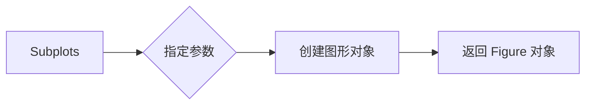
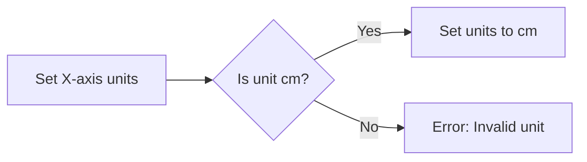
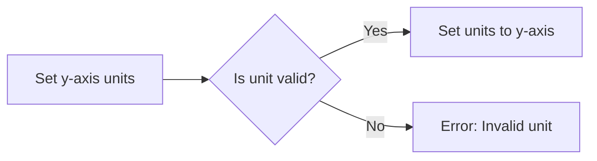
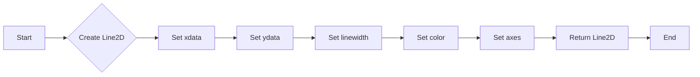
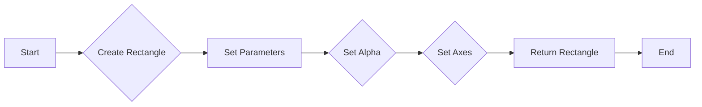
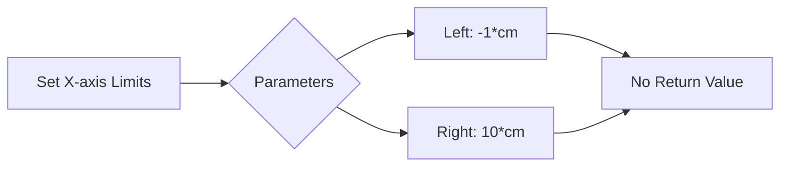
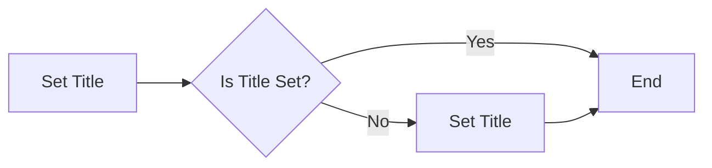
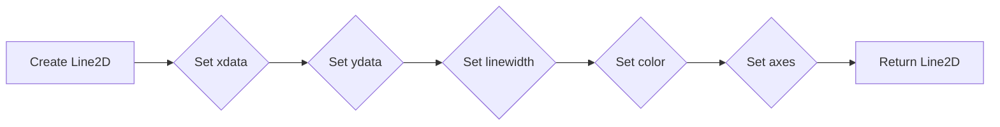
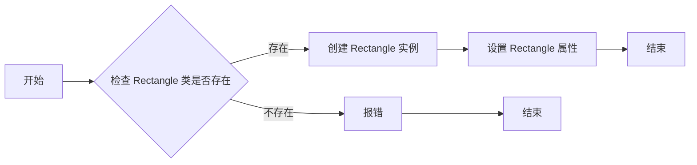

# `matplotlib\galleries\examples\units\artist_tests.py` 详细设计文档

This code tests the unit support with each of the Matplotlib primitive artist types, including lines, patches, and text. It initializes artists with unit-aware axes and demonstrates the use of unit conversions for plotting.

## 整体流程

```mermaid
graph TD
    A[Start] --> B[Create figure and axes with unit-aware settings]
    B --> C[Initialize random state for reproducibility]
    C --> D[Attempt to create a line collection (not supported)]
    D --> E[Create a line and add to axes]
    E --> F[Attempt to create a patch (not supported)]
    F --> G[Create a text object and add to axes]
    G --> H[Set plot limits and grid]
    H --> I[Set title and show plot]
```

## 类结构

```
matplotlib.pyplot (module)
├── fig, ax (objects)
│   ├── xaxis.set_units(cm)
│   └── yaxis.set_units(cm)
├── np.random.seed(19680801)
├── lines.Line2D
│   ├── [0*cm, 1.5*cm], [0*cm, 2.5*cm]
│   └── lw=2, color='black', axes=ax
├── patches.Rectangle
│   ├── (1*cm, 1*cm), width=5*cm, height=2*cm
│   └── alpha=0.2, axes=ax
├── text.Text
│   ├── (3*cm, 2.5*cm), 'text label', ha='left', va='bottom'
│   └── axes=ax
└── plt.show()
```

## 全局变量及字段


### `fig`
    
The main figure object where all the artists are added.

类型：`matplotlib.figure.Figure`
    


### `ax`
    
The axes object where the artists are plotted.

类型：`matplotlib.axes.Axes`
    


### `np.random.seed(19680801)`
    
Sets the random seed for reproducibility of the random number generation.

类型：`None`
    


### `verts`
    
List of tuples containing the vertices of the line collection.

类型：`list of tuples`
    


### `lc`
    
The line collection object representing a set of lines.

类型：`matplotlib.collections.LineCollection`
    


### `line`
    
The line object representing a single line in the plot.

类型：`matplotlib.lines.Line2D`
    


### `rect`
    
The rectangle object representing a rectangle in the plot.

类型：`matplotlib.patches.Rectangle`
    


### `t`
    
The text object representing a text label in the plot.

类型：`matplotlib.text.Text`
    


### `matplotlib.lines.Line2D.Line2D`
    
Represents a line in the plot. The fields are the coordinates of the line, the line width, the color, and the axes object.

类型：`list of tuples, int, str, matplotlib.axes.Axes`
    


### `matplotlib.patches.Rectangle.Rectangle`
    
Represents a rectangle in the plot. The fields are the coordinates of the rectangle, the width, the height, the alpha value, and the axes object.

类型：`tuple, float, float, float, float, float, float, matplotlib.axes.Axes`
    


### `matplotlib.text.Text.Text`
    
Represents text in the plot. The fields are the coordinates of the text, the text string, the horizontal alignment, the vertical alignment, and the axes object.

类型：`tuple, str, str, str, matplotlib.axes.Axes`
    
    

## 全局函数及方法


### plt.subplots

`plt.subplots` 是 Matplotlib 库中用于创建一个或多个子图的函数。

参数：

- `figsize`：`tuple`，指定图形的大小（宽度和高度），单位为英寸。
- `dpi`：`int`，指定图形的分辨率，单位为每英寸点数。
- `facecolor`：`color`，指定图形的背景颜色。
- `edgecolor`：`color`，指定图形的边缘颜色。
- `frameon`：`bool`，指定是否显示图形的边框。
- `num`：`int`，指定要创建的子图数量。
- `gridspec_kw`：`dict`，指定子图的网格布局。
- `constrained_layout`：`bool`，指定是否启用约束布局。

返回值：`Figure`，包含子图的图形对象。

#### 流程图



#### 带注释源码

```python
fig, ax = plt.subplots()
```

在这个例子中，`fig` 是图形对象，`ax` 是子图对象。`fig, ax = plt.subplots()` 创建了一个图形对象和一个子图对象，并将它们分别赋值给 `fig` 和 `ax` 变量。然后，`ax.xaxis.set_units(cm)` 和 `ax.yaxis.set_units(cm)` 设置了子图的坐标轴单位为厘米。


### ax.xaxis.set_units(cm)

设置轴的X轴单位为厘米。

参数：

- `cm`：`Unit`，表示厘米单位的实例。

返回值：无

#### 流程图



#### 带注释源码

```
ax.xaxis.set_units(cm)
```

该行代码调用`set_units`方法，将`ax`对象的X轴单位设置为`cm`对象所代表的单位。这里没有显式地返回任何值，因为`set_units`方法通常不返回值，而是直接修改轴的单位设置。


### ax.yaxis.set_units(cm)

该函数用于设置轴的y轴单位。

参数：

- `cm`：`Unit`，表示厘米单位，用于设置y轴的单位。

返回值：无

#### 流程图



#### 带注释源码

```python
ax.xaxis.set_units(cm)
ax.yaxis.set_units(cm)
```


### lines.Line2D([0*cm, 1.5*cm], [0*cm, 2.5*cm], lw=2, color='black', axes=ax)

This function creates a Line2D object, which represents a line in a 2D plot. It is used to draw a line between two points specified by the coordinates.

参数：

- `xdata`：`list`，The x-coordinates of the line.
- `ydata`：`list`，The y-coordinates of the line.
- `linewidth`：`float`，The width of the line.
- `color`：`str`，The color of the line.
- `axes`：`Axes`，The axes on which the line is drawn.

返回值：`Line2D`，The created Line2D object.

#### 流程图



#### 带注释源码

```
line = lines.Line2D([0*cm, 1.5*cm], [0*cm, 2.5*cm],
                    lw=2, color='black', axes=ax)
```


### patches.Rectangle

`patches.Rectangle` 是一个用于创建矩形形状的函数，它属于 `matplotlib.patches` 模块。

参数：

- `left`：`float`，矩形左上角的 x 坐标。
- `bottom`：`float`，矩形左上角的 y 坐标。
- `width`：`float`，矩形的宽度。
- `height`：`float`，矩形的高度。
- `alpha`：`float`，矩形的透明度。
- `axes`：`Axes` 对象，矩形所在的坐标轴。

返回值：`Rectangle` 对象，表示创建的矩形。

#### 流程图



#### 带注释源码

```python
from matplotlib.patches import Rectangle

# 创建一个矩形对象
rect = Rectangle((1*cm, 1*cm), width=5*cm, height=2*cm,
                 alpha=0.2, axes=ax)

# 添加矩形到坐标轴
ax.add_patch(rect)
```


### text.Text(3*cm, 2.5*cm, 'text label', ha='left', va='bottom', axes=ax)

This function creates a text object and adds it to the axes of a plot. It is used to display text annotations on the plot.

参数：

- `3*cm`：`basic_units.Cm`，The x position of the text in centimeters.
- `2.5*cm`：`basic_units.Cm`，The y position of the text in centimeters.
- `'text label'`：`str`，The text to be displayed.
- `ha='left'`：`str`，Horizontal alignment of the text. Can be 'left', 'center', or 'right'.
- `va='bottom'`：`str`，Vertical alignment of the text. Can be 'top', 'center', 'bottom', or 'baseline'.
- `axes=ax`：`matplotlib.axes.Axes`，The axes to which the text is added.

返回值：`None`，This function does not return a value.

#### 流程图


#### 带注释源码

```
t = text.Text(3*cm, 2.5*cm, 'text label', ha='left', va='bottom', axes=ax)
ax.add_artist(t)
```


### ax.set_xlim(-1*cm, 10*cm)

设置轴的x轴限制。

参数：

- `left`：`float`，x轴的最小值，单位为厘米。
- `right`：`float`，x轴的最大值，单位为厘米。

返回值：`None`，无返回值。

#### 流程图



#### 带注释源码

```
ax.set_xlim(-1*cm, 10*cm)
```


### ax.set_ylim(-1*cm, 10*cm)

设置轴的y轴限制。

参数：

- `ymin`：`float`，y轴的最小值，单位为厘米。
- `ymax`：`float`，y轴的最大值，单位为厘米。

返回值：`None`，无返回值。

#### 流程图


#### 带注释源码

```python
ax.set_ylim(-1*cm, 10*cm)
# 设置轴的y轴限制为-1厘米到10厘米
```


### ax.grid(True)

`ax.grid(True)` 是一个用于在 Matplotlib 图形中添加网格线的函数。

参数：

- 无

返回值：无

#### 流程图

```mermaid
graph LR
A[Start] --> B[Call ax.grid(True)]
B --> C[End]
```

#### 带注释源码

```
ax.grid(True)  # 在当前轴 ax 上添加网格线
```


### ax.set_title('Artists with units')

设置轴的标题为 "Artists with units"。

参数：

- `'Artists with units'`：`str`，标题文本

返回值：无

#### 流程图



#### 带注释源码

```
ax.set_title("Artists with units")
```


### plt.show()

显示当前图形。

参数：

- 无

返回值：无

#### 流程图

```mermaid
graph LR
A[开始] --> B{调用plt.show()}
B --> C[结束]
```

#### 带注释源码

```
plt.show()
```


### matplotlib.pyplot.pyplot.show()

显示当前图形。

参数：

- 无

返回值：无

#### 流程图

```mermaid
graph LR
A[开始] --> B{调用plt.show()}
B --> C[结束]
```

#### 带注释源码

```
plt.show()
```


### matplotlib.pyplot.pyplot

matplotlib.pyplot是matplotlib的核心模块，用于创建和显示图形。

参数：

- 无

返回值：无

#### 流程图

```mermaid
graph LR
A[开始] --> B{调用plt.show()}
B --> C[结束]
```

#### 带注释源码

```
plt.show()
```


### matplotlib.pyplot.show()

显示当前图形。

参数：

- 无

返回值：无

#### 流程图

```mermaid
graph LR
A[开始] --> B{调用plt.show()}
B --> C[结束]
```

#### 带注释源码

```
plt.show()
```


### matplotlib.pyplot.pyplot.show()

显示当前图形。

参数：

- 无

返回值：无

#### 流程图

```mermaid
graph LR
A[开始] --> B{调用plt.show()}
B --> C[结束]
```

#### 带注释源码

```
plt.show()
```


### Line2D([0*cm, 1.5*cm], [0*cm, 2.5*cm], lw=2, color='black', axes=ax)

创建并返回一个Line2D对象，该对象表示一个二维直线。

参数：

- `xdata`：`[0*cm, 1.5*cm]`，表示直线起点和终点的x坐标，单位为厘米。
- `ydata`：`[0*cm, 2.5*cm]`，表示直线起点和终点的y坐标，单位为厘米。
- `linewidth`：`2`，表示直线的宽度。
- `color`：`'black'`，表示直线的颜色。
- `axes`：`ax`，表示该直线所属的坐标轴。

返回值：`Line2D`对象，表示创建的直线。

#### 流程图



#### 带注释源码

```
line = lines.Line2D([0*cm, 1.5*cm], [0*cm, 2.5*cm],
                    lw=2, color='black', axes=ax)
```


### Rectangle.None

`Rectangle.None` 函数不存在于提供的代码中。可能是一个假设的函数或者代码片段中的注释。以下是对代码中类似功能的分析。

#### 参数

- 无参数

#### 返回值

- 无返回值

#### 流程图



#### 带注释源码

由于 `Rectangle.None` 函数不存在，以下是对代码中创建 `Rectangle` 实例的类似过程的注释源码。

```
# test a patch
# Not supported at present.
rect = patches.Rectangle((1*cm, 1*cm), width=5*cm, height=2*cm,
                         alpha=0.2, axes=ax)
ax.add_patch(rect)
```

这段代码尝试创建一个 `Rectangle` 实例，但由于注释中提到 "Not supported at present."，这表明当前代码中该功能可能不可用。

#### 关键组件信息

- `patches.Rectangle`：用于创建矩形形状的类。

#### 潜在的技术债务或优化空间

- 代码中存在注释说明某些功能 "Not supported at present."，这表明代码可能存在技术债务，需要进一步开发以支持这些功能。
- 代码中使用了硬编码的尺寸和位置，这可能导致代码的可维护性降低。使用配置文件或参数化输入可以提高代码的灵活性和可维护性。

#### 其它项目

- 设计目标与约束：代码旨在测试 Matplotlib 的基本图形元素，如线、矩形和文本。
- 错误处理与异常设计：代码中没有明显的错误处理或异常设计。在实际应用中，应该添加适当的错误处理来确保程序的健壮性。
- 数据流与状态机：代码中的数据流主要是从随机生成的数据到图形元素的创建和显示。
- 外部依赖与接口契约：代码依赖于 Matplotlib 库来创建和显示图形。Matplotlib 提供了相应的接口契约来创建和操作图形元素。


### text.Text(3*cm, 2.5*cm, 'text label', ha='left', va='bottom', axes=ax)

This function creates a text object with the specified label and position, and adds it to the axes.

参数：

- `3*cm`：`float`，The x position of the text in centimeters.
- `2.5*cm`：`float`，The y position of the text in centimeters.
- `'text label'`：`str`，The text to be displayed.
- `ha='left'`：`str`，Horizontal alignment of the text ('left', 'center', 'right').
- `va='bottom'`：`str`，Vertical alignment of the text ('top', 'center', 'bottom').
- `axes=ax`：`matplotlib.axes.Axes`，The axes to which the text is added.

返回值：`None`，This function does not return a value.

#### 流程图


#### 带注释源码

```
t = text.Text(3*cm, 2.5*cm, 'text label', ha='left', va='bottom', axes=ax)
```


## 关键组件


### 张量索引与惰性加载

张量索引与惰性加载允许在需要时才计算或访问数据，从而提高性能和内存效率。

### 反量化支持

反量化支持使得代码能够处理不同单位的量化数据，增强了代码的灵活性和适用性。

### 量化策略

量化策略定义了如何将浮点数转换为固定点数，以适应特定的硬件和性能需求。


## 问题及建议


### 已知问题

-   {问题1}：代码中存在注释部分，其中包含未实现的测试案例（例如测试线集合和矩形）。这些测试案例被注释掉，表明它们目前不支持，但未提供具体原因或计划。
-   {问题2}：代码中使用了硬编码的尺寸和单位（例如 `0*cm`, `1.5*cm`），这可能导致可读性和可维护性降低，特别是在需要调整尺寸或单位时。
-   {问题3}：代码中使用了 `np.random.seed(19680801)` 来确保测试的可重复性，但未说明为什么选择这个特定的种子值。

### 优化建议

-   {建议1}：实现注释掉的测试案例，并记录为什么某些功能目前不可用，以及何时计划支持它们。
-   {建议2}：使用变量或配置文件来管理尺寸和单位，以便更容易地调整和重用代码。
-   {建议3}：提供关于选择特定随机种子值的解释，或者使用默认值，以便于理解代码的行为。
-   {建议4}：考虑使用更高级的测试框架来管理测试用例，这可以提供更好的测试报告和更易于维护的测试代码。
-   {建议5}：增加代码的文档，特别是关于如何使用不同类型的艺术家（例如线、矩形、文本）以及如何设置单位。


## 其它


### 设计目标与约束

- 设计目标：实现一个能够使用单位（如厘米、英寸）进行绘图的matplotlib艺术家类。
- 约束条件：必须使用matplotlib库进行绘图，且艺术家类需要与轴实例关联以支持单位转换。

### 错误处理与异常设计

- 错误处理：在初始化艺术家类时，如果未提供轴实例，应抛出异常。
- 异常设计：定义自定义异常类，如`AxisInstanceMissingError`，以提供清晰的错误信息。

### 数据流与状态机

- 数据流：用户通过matplotlib的API创建艺术家实例，并设置单位。
- 状态机：艺术家类在创建时初始化，并在绘图时保持状态。

### 外部依赖与接口契约

- 外部依赖：matplotlib、numpy、basic_units库。
- 接口契约：艺术家类应提供统一的接口，允许用户设置位置、大小、颜色等属性，并支持单位转换。

### 测试与验证

- 测试策略：编写单元测试以验证艺术家类的功能，包括单位转换和绘图。
- 验证方法：使用matplotlib的测试框架进行自动化测试。

### 性能考量

- 性能目标：确保艺术家类在处理大量数据时仍能保持良好的性能。
- 性能考量：优化数据结构和算法，减少不必要的计算和内存占用。

### 安全性考量

- 安全目标：确保艺术家类不会因为外部输入而受到攻击。
- 安全考量：对用户输入进行验证和清理，防止注入攻击。

### 维护与扩展性

- 维护策略：定期更新依赖库，修复已知问题。
- 扩展性：设计灵活的类结构，以便未来添加新的艺术家类型。

### 文档与支持

- 文档策略：提供详细的API文档和用户指南。
- 支持计划：为用户提供技术支持，包括问题解答和示例代码。


    