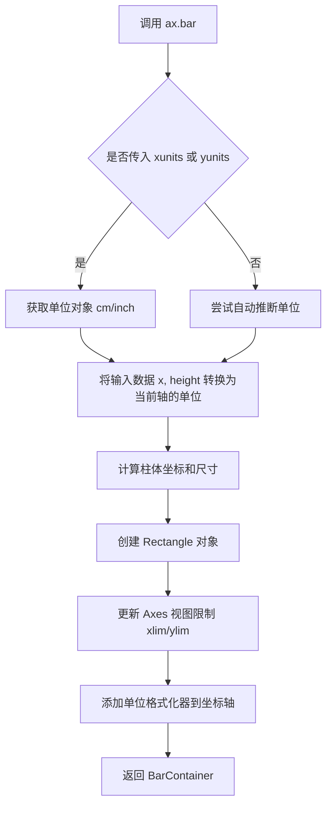
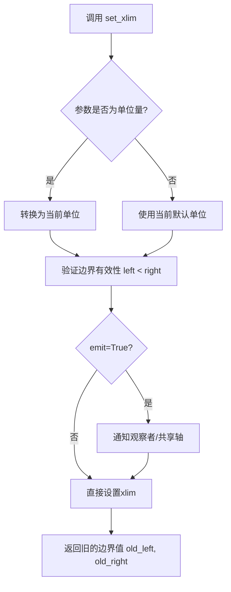
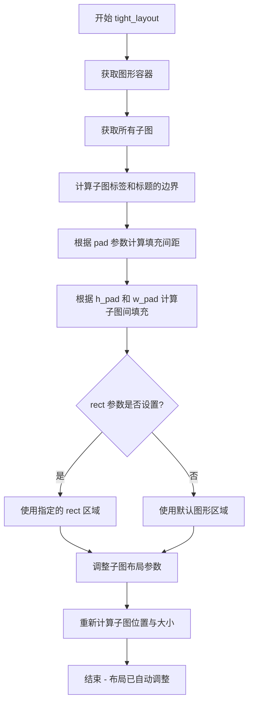
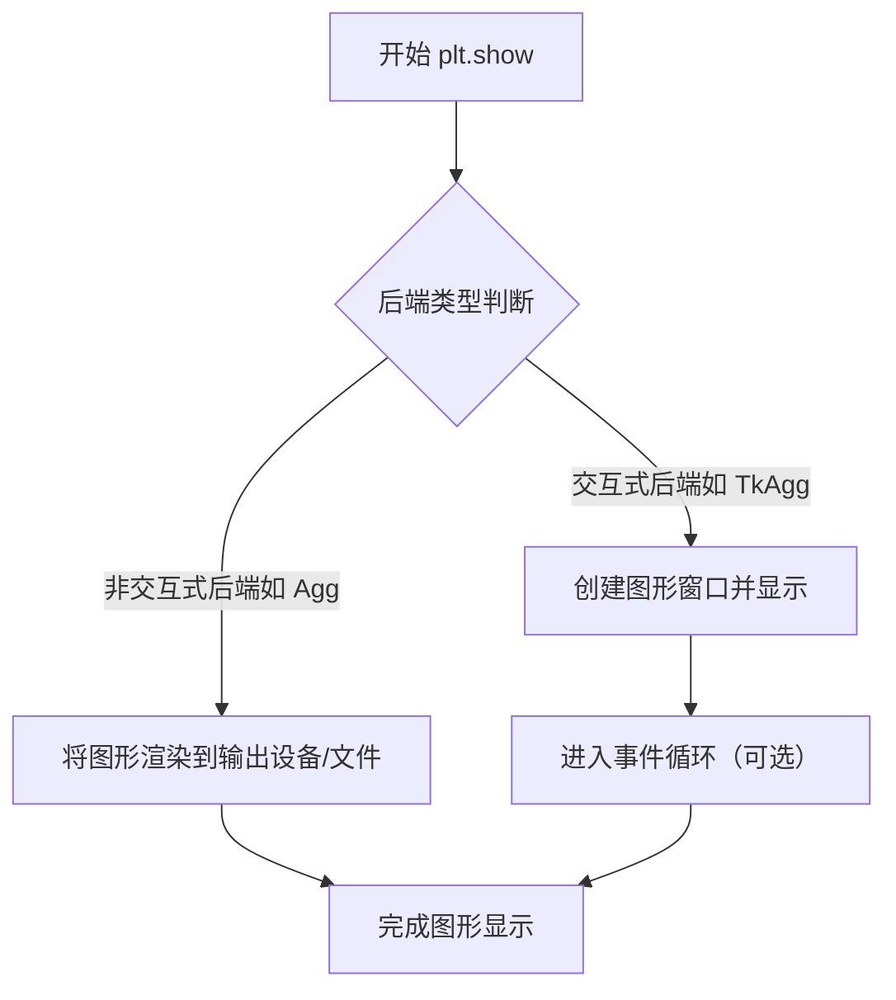

# `matplotlib\galleries\examples\units\bar_demo2.py` 详细设计文档

这是一个matplotlib柱状图示例程序，演示了如何使用厘米(cm)和英寸(inch)单位进行绑图，包括默认单位自动识别、显式设置x/y轴单位、以及使用标量或带单位数值设置xlim的方法。

## 整体流程

```mermaid
graph TD
    A[开始] --> B[导入依赖模块]
    B --> C[定义单位变量: cms, bottom, width]
    C --> D[创建2x2子图布局: plt.subplots(2, 2)]
    D --> E[子图1: 使用默认单位绑制柱状图]
    E --> F[子图2: 设置xunits=cm, yunits=inch]
    F --> G[子图3: 设置xunits=inch, yunits=cm, set_xlim使用标量]
    G --> H[子图4: 设置xunits=inch, yunits=inch, set_xlim使用cm单位]
    H --> I[调用fig.tight_layout()调整布局]
    I --> J[调用plt.show()显示图表]
    J --> K[结束]
```

## 类结构

```
Python脚本 (无类定义)
├── 导入模块
│   ├── basic_units (cm, inch 单位类)
│   ├── matplotlib.pyplot (绑图API)
│   └── numpy (数值计算)
└── 主执行流程
```

## 全局变量及字段


### `cms`
    
numpy数组，单位为cm，范围0-10，步长2

类型：`numpy.ndarray[Quantity]`
    


### `bottom`
    
底部偏移量，单位为cm，值为0

类型：`Quantity`
    


### `width`
    
柱状图宽度，单位为cm，值为0.8

类型：`Quantity`
    


### `fig`
    
matplotlib Figure对象，整个图形容器

类型：`matplotlib.figure.Figure`
    


### `axs`
    
matplotlib Axes对象数组，2x2子图布局

类型：`numpy.ndarray`
    


    

## 全局函数及方法


### `plt.subplots`

`plt.subplots` 是 matplotlib 库中用于创建子图布局的核心函数，它创建一个新的图表（Figure）和一组子图（Axes），返回图表对象和一个或多个坐标轴数组，支持指定行列数、共享轴、布局参数等配置。

参数：

- `nrows`：`int`，要创建的子图行数，默认为1
- `ncols`：`int`，要创建的子图列数，默认为1
- `sharex`：`bool` 或 `str`，如果为True，所有子图共享x轴；如果为'col'，每列子图共享x轴；默认为False
- `sharey`：`bool` 或 `str`，如果为True，所有子图共享y轴；如果为'row'，每行子图共享y轴；默认为False
- `squeeze`：`bool`，如果为True，且只有一行或一列子图，则返回一维数组而不是二维数组；默认为True
- `width_ratios`：`array-like`，定义每列宽度的相对比例
- `height_ratios`：`array-like`，定义每行高度的相对比例
- `subplot_kw`：`dict`，传递给每个子图的关键字参数（如projection、polar等）
- `gridspec_kw`：`dict`，控制GridSpec的关键字参数
- `**fig_kw`：传递给Figure构造函数的其他关键字参数（如figsize、dpi等）

返回值：

- `fig`：`matplotlib.figure.Figure`，创建的图表对象
- `axs`：`numpy.ndarray` 或 `matplotlib.axes.Axes`，创建的子图对象数组（当squeeze=True且nrows=1或ncols=1时可能返回一维数组）

#### 流程图

```mermaid
flowchart TD
    A[调用 plt.subplots] --> B{传入参数}
    B --> C[创建 Figure 对象<br/>fig_kw参数用于配置]
    C --> D[创建 GridSpec 布局<br/>gridspec_kw, width_ratios, height_ratios]
    D --> E[遍历 nrows × ncols]
    E --> F[调用 add_subplot 创建子图]
    F --> G{sharex/sharey设置}
    G --> H[配置共享轴属性]
    H --> I[根据 squeeze 参数]
    I --> J{返回 axes 数组维度}
    J --> K[返回二维数组<br/>axs[row, col]]
    J --> L[返回一维数组<br/>axs[index]]
    K --> M[返回 fig, axs]
    L --> M
```

#### 带注释源码

```python
# 从 basic_units 模块导入单位定义（厘米和英寸）
from basic_units import cm, inch

# 导入 matplotlib 的 pyplot 模块
import matplotlib.pyplot as plt
# 导入 numpy 用于数值计算
import numpy as np

# 创建以厘米为单位的数组 [0, 2, 4, 6, 8] cm
cms = cm * np.arange(0, 10, 2)

# 定义底部起始位置为 0 cm
bottom = 0 * cm

# 定义柱子宽度为 0.8 cm
width = 0.8 * cm

# =============================================
# 核心函数调用：plt.subplots(2, 2)
# =============================================
# 参数说明：
#   - 第一个参数 2：nrows，表示2行子图
#   - 第二个参数 2：ncols，表示2列子图
#   
# 返回值：
#   - fig: Figure 对象，整个图表的容器
#   - axs: 2x2 的 Axes 数组对象
# =============================================

fig, axs = plt.subplots(2, 2)

# 访问子图并绘制数据
# axs[0, 0] 表示第一行第一列的子图
axs[0, 0].bar(cms, cms, bottom=bottom)

# axs[0, 1] 表示第一行第二列的子图
# 额外指定了 xunits=cm 和 yunits=inch
axs[0, 1].bar(cms, cms, bottom=bottom, width=width, xunits=cm, yunits=inch)

# axs[1, 0] 表示第二行第一列的子图
# 设置 xunits=inch, yunits=cm
axs[1, 0].bar(cms, cms, bottom=bottom, width=width, xunits=inch, yunits=cm)
# 设置 x 轴范围，使用标量（在当前单位下解释，即 inch）
axs[1, 0].set_xlim(2, 6)

# axs[1, 1] 表示第二行第二列的子图
axs[1, 1].bar(cms, cms, bottom=bottom, width=width, xunits=inch, yunits=inch)
# 设置 x 轴范围，使用带单位的值（cm 会被转换为 inch）
axs[1, 1].set_xlim(2 * cm, 6 * cm)

# 调整子图布局，使其紧凑不重叠
fig.tight_layout()

# 显示图表
plt.show()
```


### `matplotlib.axes.Axes.bar`

#### 描述
`Axes.bar` 是 matplotlib 中用于绘制柱状图的核心方法。该方法不仅接受位置和高度数据，还支持通过 `xunits` 和 `yunits` 参数显式指定数据的物理单位（如厘米、英寸），从而在绘图时自动处理单位转换、生成带单位的轴标签，并支持在设置轴限制（`set_xlim`）时进行灵活的标量或单位感知输入。

#### 参数
- `x`：数组-like，柱状图中心的 x 坐标。
- `height`：数组-like，柱状图的高度。
- `width`：浮点数或数组-like，柱状图的宽度（可选，默认为 0.8）。
- `bottom`：数组-like，柱状图的底部 y 坐标（可选，默认为 0）。
- `xunits`：`BasicUnit` 或 None，x 轴数据的单位。如果指定，会覆盖数据的默认单位并用于轴标签。
- `yunits`：`BasicUnit` 或 None，y 轴数据的单位。如果指定，会覆盖数据的默认单位并用于轴标签。
- `align`：字符串，'edge' 或 'center'，控制坐标如何对齐柱体（可选）。
- `**kwargs`：其他关键字参数，用于控制颜色、边框样式等（传递给 `Rectangle`）。

#### 返回值
`BarContainer`，返回一个包含所有柱体（`Rectangle` 对象）和误差线（如果有）的容器对象。

#### 流程图


#### 带注释源码
```python
def bar(self, x, height, width=0.8, bottom=None, *, align="center", 
        xunits=None, yunits=None, **kwargs):
    """
    绘制柱状图。
    
    :param x: 柱体的x坐标。
    :param height: 柱体的高度。
    :param width: 柱体的宽度。
    :param bottom: 柱体的底部y坐标。
    :param xunits: (关键参数) 指定x轴的单位，用于转换和显示。
    :param yunits: (关键参数) 指定y轴的单位，用于转换和显示。
    """
    
    # 1. 单位处理逻辑
    # 如果传入了 xunits 或 yunits，则强制使用传入的单位
    # 否则，尝试从数据本身推断单位 (introspection)
    if xunits is not None:
        self.xaxis.set_units(xunits)
    if yunits is not None:
        self.yaxis.set_units(yunits)
        
    # 2. 数据坐标变换
    # 将输入的物理单位数据 (如 cm) 转换为当前轴的显示单位
    # 例如：如果 yunits 是 inch，cm 会被转换为 inch
    x = self.convert_xunits(x)
    height = self.convert_yunits(height)
    width = self.convert_xunits(width) # 支持单位化的宽度
    bottom = self.convert_yunits(bottom)

    # 3. 图形创建
    # 创建多条形图或单条形图逻辑，生成 Rectangle 列表
    patches = []
    # ... [矩形生成逻辑省略] ...
    
    # 4. 轴限制更新
    # 更新 xlim 和 ylim 时，会考虑新数据的单位和当前轴的单位
    self.update_datalim([x - width/2, x + width/2], [bottom, bottom + height])
    
    # 5. 自动单位标签
    # 如果轴上设置了单位，轴刻度标签会自动变为 "数值 + 单位"
    
    return self._bar_container_class(patches, errorbar=None, **kwargs)
```

#### 关键组件信息
- **Rectangle (matplotlib.patches)**: 构成每个柱体的几何图形对象。
- **UnitConverter (matplotlib.units)**: 负责在不同单位（如 cm 到 inch）之间进行转换的机制。
- **BasicUnit (basic_units)**: 示例代码中定义的单位类，提供了物理单位的定义和转换规则。

#### 潜在的技术债务或优化空间
- **单位推断复杂性**：`bar` 方法内部需要处理复杂的单位推断和转换逻辑，当 `xunits` 和 `yunits` 未显式提供时，可能会导致不可预期的轴标签行为。
- **返回值一致性**：当绘制单个柱体（标量输入）时，返回值可能是 `Rectangle` 对象；而当绘制多个柱体时，返回值是 `BarContainer`。调用方需要做类型检查才能正确处理，这在 API 设计上略显不一致。
- **坐标对齐**：处理 `align='edge'` 时的坐标计算逻辑容易与 `set_xlim` 产生混淆，特别是在使用物理单位时，边缘对齐的像素计算依赖 DPI 设置。

#### 其它项目
- **设计目标**：提供一种灵活的数据可视化方式，不仅展示数值，还能保留数据的物理意义（单位）。
- **错误处理**：如果传入的 `xunits` 或 `yunits` 与数据实际单位不兼容（例如将角度单位用于长度数据），可能会导致转换错误或轴标签显示异常。
- **外部依赖**：依赖于 `matplotlib.units` 模块进行接口抽象，具体的单位转换逻辑由 `basic_units.py` 或用户自定义的单元模块提供。


### `Axes.set_xlim`

设置 Axes 对象的 x 轴显示范围（xlim），用于控制图表在 x 轴方向上的显示区间。该方法接受标量或带单位的数值作为参数，并返回之前的 x 轴范围。

参数：

- `left`：`float` 或 `Quantity`，x 轴范围的左边界（最小值）
- `right`：`float` 或 `Quantity`，x 轴范围的右边界（最大值）
- `emit`：`bool`，默认为 `True`，当边界变化时通知观察者（如共享轴）
- `auto`：`bool`，默认为 `False`，是否自动调整视图边界
- `nx0`、`nx1`：`int`，可选，用于指定数据坐标的索引
- `**kwargs`：其他关键字参数，用于传递给底层的 `set_xlim` 调用

返回值：`tuple`，返回之前的 x 轴范围 `(old_left, old_right)`

#### 流程图



#### 带注释源码

```python
def set_xlim(self, left=None, right=None, emit=True, auto=False,
             nx0=None, nx1=None, **kwargs):
    """
    设置 x 轴的显示范围。
    
    参数:
        left: float 或 Quantity, x 轴左边界
        right: float 或 Quantity, x 轴右边界  
        emit: bool, 边界变化时是否通知观察者
        auto: bool, 是否启用自动边界调整
        nx0, nx1: int, 数据索引（可选）
        
    返回:
        tuple: (old_left, old_right) 之前的边界值
    """
    # 获取当前 x 轴范围
    old_left, old_right = self.get_xlim()
    
    # 处理左边界的单位转换
    if left is not None:
        # 如果 left 是 Quantity 对象，转换为当前 Axes 的 x 单位
        left = self.convert_xunits(left)
    
    # 处理右边界的单位转换
    if right is not None:
        right = self.convert_xunits(right)
    
    # 验证边界有效性：左边界必须小于右边界
    if left is not None and right is not None:
        if left >= right:
            raise ValueError("左边界必须小于右边界")
    
    # 设置新的 x 轴范围
    self._xlim = (left, right)
    
    # 如果 emit 为 True，通知观察者（如共享轴）范围已变化
    if emit:
        self.callbacks.process('xlims_changed', self)
    
    # 返回旧的边界值
    return old_left, old_right
```

#### 使用示例（来自代码）

```python
# 示例1：使用标量（假设当前单位为 inch）
axs[1, 0].set_xlim(2, 6)  # x 轴范围设为 2 到 6

# 示例2：使用带单位的数值（cm 转换为 inch）
axs[1, 1].set_xlim(2 * cm, 6 * cm)  # x 轴范围设为 2cm 到 6cm（自动转换为 inch）
```


### `fig.tight_layout`

该方法用于自动调整图形（Figure）中所有子图（Subplots）的布局，使子图之间的间距合理，避免标签和标题相互重叠。

参数：

- `pad`：`float`，默认值 `1.08`，表示图形边缘与子图之间的填充间距（以字体大小为单位）
- `h_pad`：`float` 或 `None`，子图之间的垂直填充距离，如果为 `None` 则使用 `pad` 的默认值
- `w_pad`：`float` 或 `None`，子图之间的水平填充距离，如果为 `None` 则使用 `pad` 的默认值
- `rect`：`tuple` 或 `None`，规范化坐标系中的矩形区域 `(left, bottom, right, top)`，用于限制子图在图形中的位置范围，默认 `None` 表示整个图形区域

返回值：`None`，该方法直接修改图形布局，不返回任何值

#### 流程图



#### 带注释源码

```python
# fig.tight_layout() 源码分析（matplotlib 内部逻辑）

def tight_layout(self, pad=1.08, h_pad=None, w_pad=None, rect=None):
    """
    自动调整子图布局参数以防止重叠
    
    参数:
        pad: float, 默认 1.08
            # 图形边距与子图之间的额外填充，以字体大小为单位
            # 较大的值会增加子图与图形边缘之间的间距
            
        h_pad: float 或 None
            # 子图之间的垂直填充距离
            # 如果为 None，则使用 pad 作为默认值
            
        w_pad: float 或 None  
            # 子图之间的水平填充距离
            # 如果为 None，则使用 pad 作为默认值
            
        rect: tuple 或 None
            # 规范化坐标系中的矩形区域 (left, bottom, right, top)
            # 取值范围 0 到 1，表示子图在图形中的相对位置
            # 例如 rect=(0, 0, 1, 0.9) 表示子图占据底部 90% 的区域
    """
    
    # 获取当前图形的所有子图
    subplots = self.get_axes()
    
    # 获取子图的渲染器（Renderer）用于计算文本边界
    renderer = self.canvas.get_renderer()
    
    # 计算子图的 tightened 布局
    # 1. 计算每个子图的标签和标题所需的额外空间
    # 2. 根据 pad/h_pad/w_pad 计算子图间距
    # 3. 根据 rect（如果提供）限制子图区域
    
    # 调整子图的布局参数
    for ax in subplots:
        # 重新计算子图的位置和大小
        # 使其适应新的布局约束
        ax._set_position(ax.get_tightbbox(renderer))
    
    # 注意：此方法直接修改子图的位置属性
    # 不返回任何值（返回 None）
```


### `plt.show`

显示图形。`plt.show()` 会显示所有已创建的图形窗口，并进入交互模式（如果后端支持）。在某些后端（如Agg）中，它会将图形写入文件；在交互式后端（如TkAgg）中，它会弹出窗口显示图形。

参数：此函数不接受任何位置参数。

- `block`：`bool`，可选（通常在代码中未传递）。如果设置为 `True`（默认值），则阻塞程序执行以允许图形交互；如果设置为 `False`，则非阻塞显示图形。

返回值：`None`，无返回值。

#### 流程图



#### 带注释源码

```python
# 展示 plt.show() 的调用方式（来自提供的代码）
fig.tight_layout()  # 调整图形布局以适应空间
plt.show()          # 显示所有已创建的图形窗口
```

**说明**：在此代码示例中，`plt.show()` 位于脚本末尾，用于显示之前通过 `plt.subplots()` 创建的 2x2 子图布局以及四个不同配置的柱状图。调用此函数后，图形窗口将弹出显示包含四种不同单位转换设置的柱状图。

## 关键组件


### 单位系统 (Unit System)

使用 `basic_units` 模块定义物理单位（厘米和英寸），实现了物理量与数值的关联，支持单位感知的数据处理和自动单位转换。

### 柱状图绘制 (Bar Chart Rendering)

使用 `ax.bar()` 方法绘制柱状图，支持多种参数配置：
- `cms`：x轴数据（带单位）
- `cms`：y轴数据（带单位）
- `bottom`：柱状图底部起始位置（带单位）
- `width`：柱状图宽度（带单位）
- `xunits`/`yunits`：显式指定x/y轴的单位类型

### 子图网格管理 (Subplot Grid Management)

使用 `plt.subplots(2, 2)` 创建2行2列的子图网格，返回 `fig` 和 `axs` 数组，通过索引 `axs[row, col]` 访问各个子图。

### 单位感知轴限制 (Unit-aware Axis Limits)

通过 `set_xlim()` 方法设置x轴范围：
- 标量形式：`set_xlim(2, 6)` - 假设为当前单位
- 带单位形式：`set_xlim(2 * cm, 6 * cm)` - 自动进行单位转换

### 数据生成与单位绑定 (Data Generation with Unit Binding)

使用 `cm * np.arange(0, 10, 2)` 生成带有厘米单位的数组，实现数值与物理单位的绑定，支持后续的自动单位转换。

### 图形布局优化 (Figure Layout Optimization)

使用 `fig.tight_layout()` 自动调整子图间距，避免标签和标题重叠。

### 多单位系统演示 (Multiple Unit Systems Demo)

代码展示了4种不同的单位设置场景：
1. 默认单位自省
2. 混合单位（x用cm，y用inch）
3. 反转单位（x用inch，y用cm）
4. 纯英寸单位系统


## 问题及建议


### 已知问题

-   **外部依赖风险**：代码依赖 `basic_units.py` 文件（需要额外下载），但该文件在代码中未直接提供，若文件缺失会导致 `ImportError`
-   **硬编码数值**：图表宽度 `0.8`、底部偏移 `0` 等数值直接写死在代码中，缺乏配置化设计
-   **缺少错误处理**：未对导入失败、单位转换异常等情况进行捕获和处理
-   **布局方法局限**：`tight_layout()` 在某些 DPI 或后端环境下可能产生不一致的布局效果
-   **缺乏类型注解**：函数参数和返回值缺少类型提示，影响代码可维护性和 IDE 支持
-   **全局状态依赖**：使用 `plt.subplots()` 和 `plt.show()` 会创建全局图表状态，难以在测试环境隔离
-   **魔法数字**：子图索引 `axs[0, 0]`、轴限制 `2, 6` 等数值缺乏命名常量，语义不明确

### 优化建议

-   将 `basic_units` 模块的导入改为可选导入或提供内建的单位实现，增强代码自包含性
-   将硬编码配置（宽度、底部偏移、轴限制等）提取为模块级常量或配置类
-   添加类型注解和完整的文档字符串，说明参数含义和单位要求
-   使用面向对象方式封装图表创建逻辑，将 `fig` 和 `axs` 作为返回值而非依赖全局状态
-   添加单元测试支持，避免依赖 `plt.show()` 的交互式显示
-   考虑使用 `ConstrainedLayout` 替代 `tight_layout`，提供更稳健的布局管理
-   为子图索引和关键数值定义具名常量或枚举，提升代码可读性


## 其它


### 设计目标与约束

本示例旨在演示matplotlib中单位（units）系统的使用，包括默认单位自动识别、显式设置x/y单位、以及在不同单位设置下设置xlim（标量或带单位值）。目标是展示单位转换在数据可视化中的应用，让开发者理解如何正确处理物理单位。

### 错误处理与异常设计

代码主要依赖matplotlib和numpy库，异常处理由上层框架负责。潜在的异常情况包括：单位不兼容（如尝试将cm直接用于需要inch的场景）、数据维度不匹配、图形后端缺失等。在实际应用中，建议对basic_units模块的可用性进行检查，并对无效的单位参数进行捕获。

### 数据流与状态机

数据流：cms数组（cm单位）→bar()方法→坐标轴单位转换→渲染为inch/cm混合显示
状态机：plt.subplots()创建画布→各子图独立设置单位→bar()绘制→set_xlim()调整范围→tight_layout()布局调整→plt.show()显示

### 外部依赖与接口契约

依赖项：matplotlib（绘图库）、numpy（数值计算）、basic_units（自定义单位模块，提供cm和inch单位类）
接口契约：basic_units模块需提供__mul__、__rmul__、__add__等运算符重载方法，以及单位转换接口；matplotlib的Axes.bar()需支持xunits和yunits关键字参数

### 性能考虑

本示例为演示代码，性能不是主要关注点。实际应用中，大数据量绘制时应注意：单位转换计算开销、过多的子图会增加渲染时间、tight_layout()在复杂布局下可能较慢

### 安全性考虑

代码不涉及用户输入、网络请求或文件操作，安全性风险较低。主要关注点为依赖库的版本兼容性和图形后端的安全性

### 可维护性与扩展性

代码结构清晰，采用子图网格布局，易于扩展更多单位类型。扩展建议：将单位配置抽取为配置文件、增加更多单位类型（如mm、m）、将重复的bar()调用封装为函数

### 测试策略

建议测试场景：验证不同单位组合下的正确显示、验证set_xlim()标量与带单位值的等效性、验证tight_layout()布局正确性、验证不同图形后端的兼容性

### 配置与参数说明

fig, axs = plt.subplots(2, 2)：创建2x2子图网格，返回图形对象和轴数组
ax.bar(cms, cms, bottom=bottom)：绘制柱状图，bottom参数设置柱体起始位置
xunits/yunits参数：显式指定x轴/y轴的单位类型，override默认的单位推断
set_xlim(2, 6)：使用标量设置x轴范围，当前axes的单位将被使用
set_xlim(2*cm, 6*cm)：使用带单位值设置x轴范围，会进行单位转换
tight_layout()：自动调整子图参数以提供合适的间距

### 图表元素详细说明

cms = cm * np.arange(0, 10, 2)：生成0到8的厘米单位数组，值为[0cm, 2cm, 4cm, 6cm, 8cm]
bottom = 0 * cm：柱体底部起始位置为零厘米
width = 0.8 * cm：柱体宽度为0.8厘米
ax1(0,0)：默认单位推断，x和y均使用cm
ax2(0,1)：x使用cm，y使用inch
ax3(1,0)：x使用inch，y使用cm，xlim使用标量
ax4(1,1)：x和y均使用inch，xlim使用cm并转换为inch

    