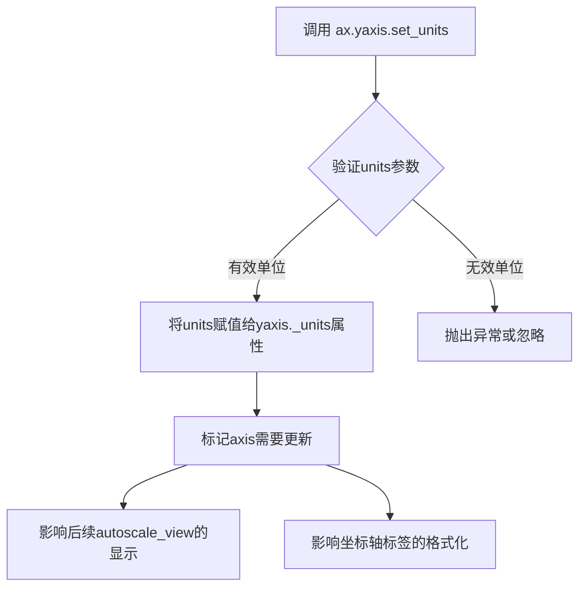
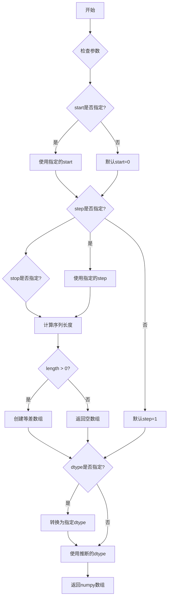
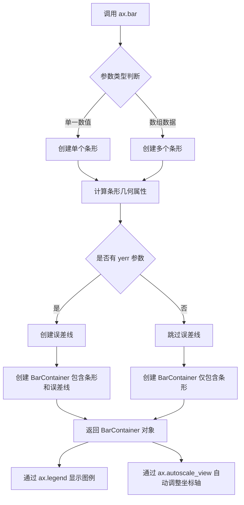
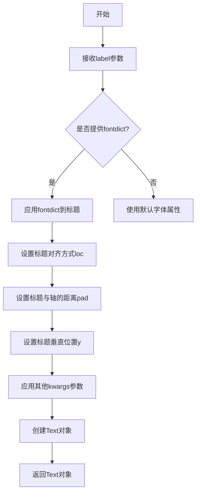
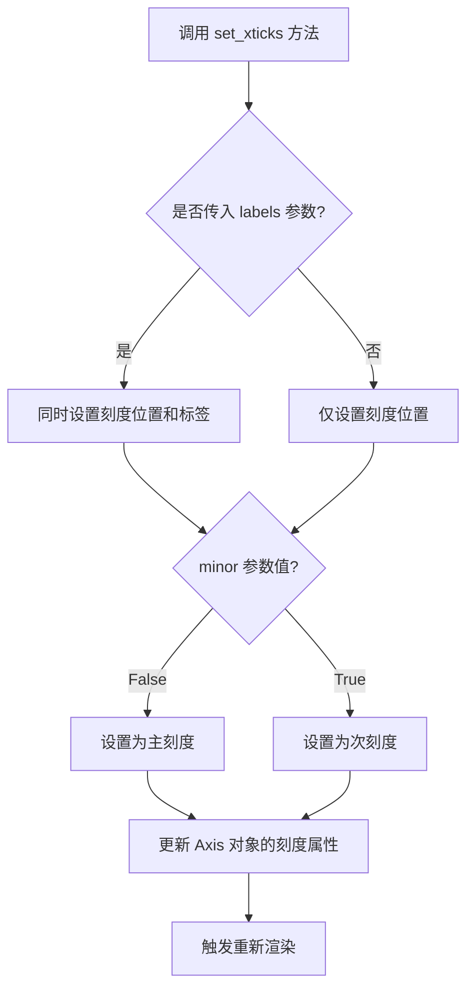
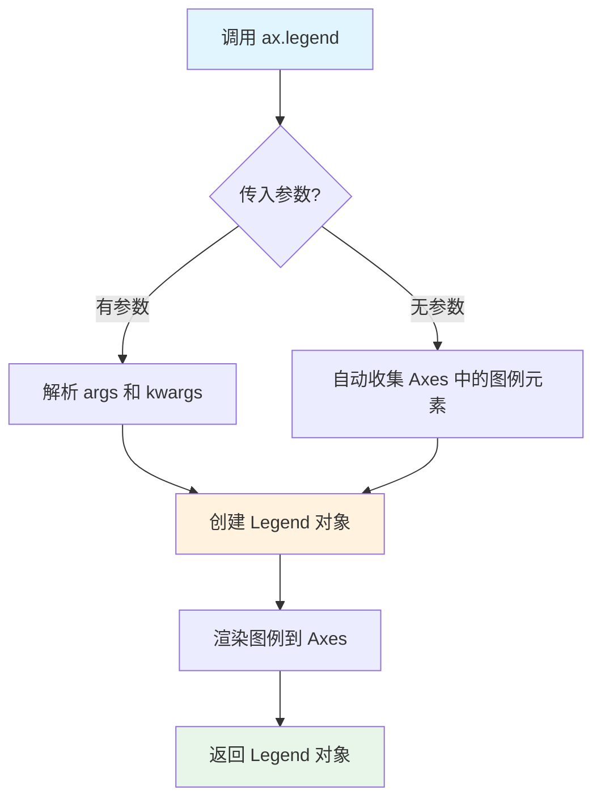
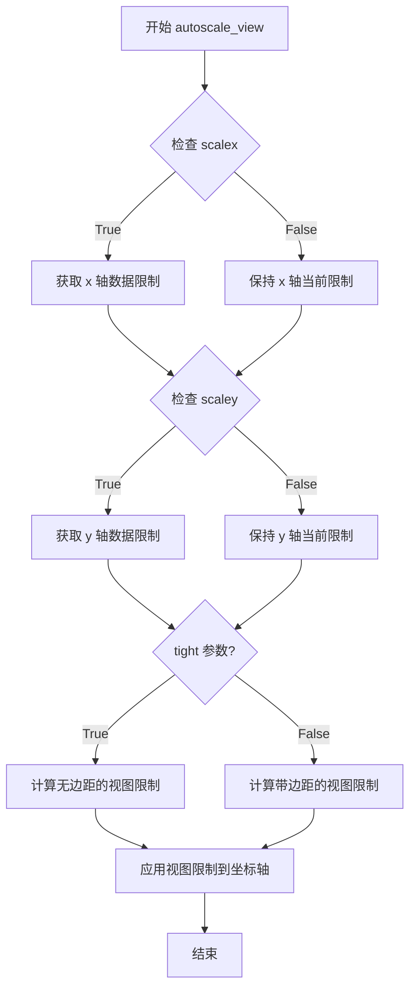
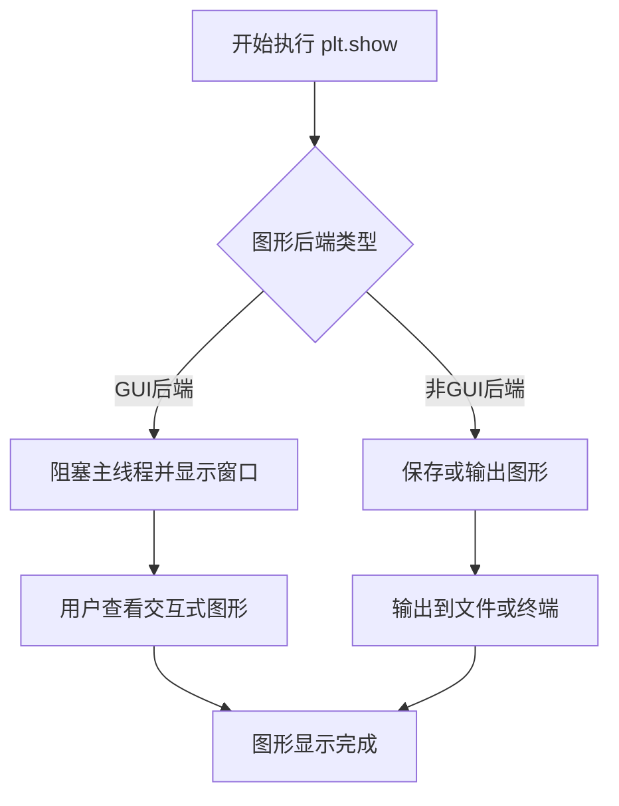

# `matplotlib\galleries\examples\units\bar_unit_demo.py` 详细设计文档

这是一个使用matplotlib绑制分组条形图的示例脚本，用于展示不同群体（G1-G5）对茶和咖啡两种饮料的杯子高度偏好，数据使用厘米和英寸单位进行可视化。

## 整体流程

```mermaid
graph TD
    A[开始] --> B[导入模块]
    B --> C[导入单位: cm, inch]
    C --> D[设置数据: tea_means, tea_std, coffee_means, coffee_std]
    D --> E[创建图形和坐标轴: plt.subplots()]
    E --> F[设置Y轴单位为英寸: ax.yaxis.set_units(inch)]
    F --> G[计算X轴位置: np.arange(N)]
    G --> H[绑制Tea条形图: ax.bar()]
    H --> I[绑制Coffee条形图: ax.bar()]
    I --> J[设置标题和刻度标签]
    J --> K[添加图例: ax.legend()]
    K --> L[自动调整视图: ax.autoscale_view()]
    L --> M[显示图形: plt.show()]
```

## 类结构

```
无类层次结构（脚本文件）
```

## 全局变量及字段


### `N`
    
分组数量

类型：`int`
    


### `tea_means`
    
茶的平均高度列表，单位cm

类型：`list`
    


### `tea_std`
    
茶的标准差列表，单位cm

类型：`list`
    


### `ind`
    
X轴位置数组

类型：`ndarray`
    


### `width`
    
条形宽度

类型：`float`
    


### `coffee_means`
    
咖啡的平均高度元组，单位cm

类型：`tuple`
    


### `coffee_std`
    
咖啡的标准差元组，单位cm

类型：`tuple`
    


### `fig`
    
matplotlib图形对象

类型：`Figure`
    


### `ax`
    
matplotlib坐标轴对象

类型：`Axes`
    


    

## 全局函数及方法


### `plt.subplots()`

创建图形（Figure）和一个或多个坐标轴（Axes）对象的函数，是matplotlib中最常用的绘图初始化方法之一。该函数封装了Figure对象的创建和add_subplot的调用过程，支持创建单图或多图网格，并返回图形对象和坐标轴对象供后续绘图操作使用。

参数：

- `nrows`：`int`，默认值1，表示子图网格的行数
- `ncols`：`int`，默认值1，表示子图网格的列数
- `sharex`：`bool` 或 `{'none', 'all', 'row', 'col'}`，默认值False，控制子图之间是否共享x轴
- `sharey`：`bool` 或 `{'none', 'all', 'row', 'col'}`，默认值False，控制子图之间是否共享y轴
- `squeeze`：`bool`，默认值True，当为True时，如果只有单个子图则返回标量而非数组
- `subplot_kw`：`dict`，默认值{}，传递给每个add_subplot的关键字参数
- `gridspec_kw`：`dict`，默认值{}，传递给GridSpec构造函数的关键字参数
- `**fig_kw`：任意关键字参数，传递给figure()函数用于创建Figure

返回值：`tuple(Figure, Axes)` 或 `tuple(Figure, ndarray of Axes)`，返回创建的图形对象和坐标轴对象。当nrows=1且ncols=1时返回单一的Axes对象，否则返回numpy数组形式的Axes集合。

#### 流程图

```mermaid
flowchart TD
    A[开始 plt.subplots 调用] --> B{参数校验}
    B --> C[创建 Figure 对象<br/>调用 plt.figure]
    C --> D[创建 GridSpec 对象<br/>基于 nrows, ncols 和 gridspec_kw]
    D --> E{遍历 nrows x ncols 网格}
    E -->|是| F[调用 add_subplot 创建 Axes]
    F --> G{应用 sharex/sharey 设置}
    G --> H{应用 subplot_kw}
    H --> E
    E -->|否| I{是否 squeeze 处理}
    I -->|是且单图| J[返回标量 Axes]
    I -->|否| K[返回 Axes 数组]
    J --> L[返回 (Figure, Axes) 元组]
    K --> L
    L --> M[结束调用]
```

#### 带注释源码

```python
# plt.subplots() 源码实现逻辑（matplotlib内部简化版）

def subplots(nrows=1, ncols=1, sharex=False, sharey=False, 
             squeeze=True, subplot_kw=None, gridspec_kw=None, **fig_kw):
    """
    创建图形和子图坐标轴
    
    参数:
        nrows: 子图行数
        ncols: 子图列数
        sharex: x轴共享策略
        sharey: y轴共享策略  
        squeeze: 是否压缩返回维度
        subplot_kw: 子图创建参数
        gridspec_kw: 网格布局参数
        **fig_kw: 传递给figure的参数
    """
    
    # 1. 创建Figure对象
    fig = plt.figure(**fig_kw)
    
    # 2. 创建GridSpec网格规范
    gs = GridSpec(nrows, ncols, **gridspec_kw)
    
    # 3. 存储所有创建的Axes
    axarr = np.empty((nrows, ncols), dtype=object)
    
    # 4. 遍历每个网格位置创建子图
    for i in range(nrows):
        for j in range(ncols):
            # 创建子图并获取Axes对象
            ax = fig.add_subplot(gs[i, j], **subplot_kw)
            
            # 应用共享轴设置
            if sharex and i > 0:
                ax.sharex(axarr[0, j])
            if sharey and j > 0:
                ax.sharey(axarr[i, 0])
                
            axarr[i, j] = ax
    
    # 5. 根据squeeze参数处理返回值
    if squeeze:
        # 将2D数组转为1D（当nrows或ncols为1时）
        if nrows == 1 and ncols == 1:
            return fig, axarr[0, 0]  # 返回单个Axes
        elif nrows == 1 or ncols == 1:
            return fig, axarr.ravel()  # 返回1D数组
    return fig, axarr  # 返回2D数组
```

---

## 完整设计文档

### 一、核心功能概述

该代码示例展示了如何使用matplotlib创建带有物理单位（厘米、英寸）的分组条形图。通过`plt.subplots()`初始化图形和坐标轴，利用`basic_units`模块提供单位支持，实现了茶和咖啡两种饮品在不同测试组的杯高对比，并带有误差棒显示标准差。

### 二、文件整体运行流程

1. **导入模块**：从`basic_units`导入单位定义（cm, inch），导入matplotlib.pyplot和numpy
2. **数据准备**：定义样本数量N、茶叶均值和标准差、咖啡均值和标准差
3. **图形初始化**：调用`plt.subplots()`创建Figure和Axes对象
4. **坐标轴配置**：设置y轴使用英寸单位
5. **绘制条形图**：使用`ax.bar()`分别绘制茶和咖啡的数据组
6. **图表装饰**：设置标题、刻度标签、图例，并自动缩放视图
7. **显示图形**：调用`plt.show()`渲染图形

### 三、关键组件信息

| 组件名称 | 描述 |
|---------|------|
| `plt.subplots()` | 创建图形和坐标轴的工厂函数 |
| `ax.bar()` | 在坐标轴上绘制柱状图的メソッド |
| `ax.yaxis.set_units()` | 设置y轴的物理单位 |
| `ax.autoscale_view()` | 自动调整坐标轴范围以适应数据 |
| `basic_units` | 提供物理单位（cm, inch）支持的模块 |

### 四、潜在的技术债务与优化空间

1. **硬编码数值**：样本数量N和条形宽度width被硬编码，可考虑参数化
2. **魔法数字**：0.35的条形宽度缺乏解释性注释，应使用命名常量
3. **单位混用风险**：cm和inch混用可能导致单位转换混乱，建议统一基准单位
4. **缺乏错误处理**：数据列表长度不匹配时程序会直接崩溃
5. **固定图形尺寸**：未指定figsize参数，默认尺寸可能不适合演示

### 五、其他设计考量

#### 设计目标与约束
- **目标**：清晰展示分组数据的均值和变异程度
- **约束**：使用物理单位增强可读性，适合科学绘图场景

#### 错误处理与异常设计
- 数据列表长度必须与N一致，否则会引发索引错误
- 单位对象必须来自basic_units模块，自定义单位可能不兼容

#### 数据流与状态机
- 静态数据定义阶段 → 图形创建阶段 → 数据绑定阶段 → 渲染阶段

#### 外部依赖
- `matplotlib.pyplot`：图形渲染核心库
- `numpy`：数值计算和数组操作
- `basic_units`：示例专用单位系统模块


### `ax.yaxis.set_units()`

设置Y轴的显示单位，用于指定Y轴数据值的物理单位（如厘米、英寸等）。该方法会将单位系统关联到Y轴，使得matplotlib能够正确地在坐标轴上显示和转换物理单位，并影响坐标轴的自动缩放和标签显示。

参数：

- `units`：`any`，单位对象，表示要设置的单位类型（如 `inch`、`cm` 等）。在matplotlib中，单位系统通常通过 `basic_units` 模块或其他单位支持模块定义。

返回值：`None`，无返回值。该方法直接修改Y轴对象的内部状态，不返回任何值。

#### 流程图



#### 带注释源码

```python
def set_units(self, units):
    """
    Set the units for this axis.
    
    Parameters
    ----------
    units : object
        The units to use for this axis. This is typically an instance
        of a unit class such as those defined in basic_units module.
        The object should implement __call__ to convert between
        physical units and data values.
    
    Returns
    -------
    None
    
    Examples
    --------
    >>> from basic_units import inch, cm
    >>> ax.yaxis.set_units(inch)
    >>> ax.yaxis.set_units(cm)
    """
    # 将传入的单位对象存储到axis对象的_units属性中
    self._units = units
    
    # 通知相关组件该axis的单位已更改，需要重新计算
    # 这会影响坐标轴的tick定位、标签格式化、以及数据到显示值的转换
    self.stale = True
```

> **注**：上述源码为matplotlib `Axis.set_units()` 方法的核心逻辑实现，展示了该方法如何将单位系统绑定到坐标轴并触发视图更新机制。在实际matplotlib库中，该方法属于 `matplotlib.axis.Axis` 类，定义在 `lib/matplotlib/axis.py` 文件中。


### `np.arange()`

这是 NumPy 库中的一个核心函数，用于生成一个等差数列（arange 即 "array range" 的缩写）。在给定代码中，`np.arange(N)` 用于生成从 0 到 N-1 的整数序列，作为柱状图的 x 轴位置索引。

参数：

- `start`：`int` 或 `float`，可选，起始值，默认为 0
- `stop`：`int` 或 `float`，必填，结束值（不包含）
- `step`：`int` 或 `float`，可选，步长，默认为 1
- `dtype`：`dtype`，可选，输出数组的数据类型，若未指定则根据输入推断

返回值：`numpy.ndarray`，一个包含等差数列的一维数组

#### 流程图



#### 带注释源码

```python
# np.arange 函数简化实现原理
def arange(start=0, stop=None, step=1, dtype=None):
    """
    生成等差数组的核心逻辑
    
    参数:
        start: 序列起始值，默认为0
        stop: 序列结束值（不包含）
        step: 相邻元素之间的差值
        dtype: 输出数组的数据类型
    """
    
    # 处理单个参数的情况：arange(5) 等价于 arange(0, 5, 1)
    if stop is None:
        stop = start
        start = 0
    
    # 计算序列中的元素个数
    # 公式: num = ceil((stop - start) / step)
    num = int(np.ceil((stop - start) / step)) if step != 0 else 0
    
    # 生成数组
    result = np.empty(num, dtype=dtype)
    
    # 填充等差值
    if num > 0:
        result[0] = start
        for i in range(1, num):
            result[i] = result[i-1] + step
    
    return result


# 在代码中的实际使用
ind = np.arange(N)    # N=5, 生成 [0, 1, 2, 3, 4]
# 等价于 np.arange(0, 5, 1)
# 结果: array([0, 1, 2, 3, 4])

# 用途：在柱状图中作为每个分组的x轴位置索引
# width = 0.35
# ind + width 用于定位咖啡柱状图的位置
```

#### 在代码上下文中的使用

```python
# 完整上下文
N = 5  # 5个分组
ind = np.arange(N)    # 生成 [0, 1, 2, 3, 4] - 分组的x轴位置

# 后续使用
width = 0.35  # 柱子宽度

# 绘制茶叶数据柱状图，位置在 ind
ax.bar(ind, tea_means, width, bottom=0*cm, yerr=tea_std, label='Tea')

# 绘制咖啡数据柱状图，位置在 ind + width（向右偏移）
ax.bar(ind + width, coffee_means, width, bottom=0*cm, yerr=coffee_std, label='Coffee')

# 设置x轴刻度在两个柱子中间
ax.set_xticks(ind + width / 2, labels=['G1', 'G2', 'G3', 'G4', 'G5'])
```


### `Axes.bar()`

`Axes.bar()` 是 matplotlib 库中用于绑制条形图的核心方法。该方法接受位置、高度、宽度等参数，创建一个或多个垂直条形，并支持添加误差线、设置底部起始位置、自定义颜色和标签等高级功能。返回值是一个 `BarContainer` 对象，包含所有条形的引用，可用于后续的图形调整和样式设置。

参数：

- `x`：`float` 或 `array_like`，条形图的 x 轴位置（可以是组索引或位置数组）
- `height`：`float` 或 `array_like`，条形的高度（可以是单个值或多个值的数组）
- `width`：`float` 或 `array_like`，默认 `0.8`，条形的宽度
- `bottom`：`float` 或 `array_like`，默认 `None`，条形的底部起始位置（用于堆叠条形图）
- `align`：`str`，默认 `'center'`，条形的对齐方式（`'center'` 或 `'edge'`）
- `**kwargs`：可变关键字参数，包括：
  - `yerr`：误差线数据
  - `label`：图例标签
  - `color`、`edgecolor`、`linewidth`：样式参数
  - 其他 matplotlib 支持的条形样式参数

返回值：`matplotlib.container.BarContainer`，包含所有条形（`Rectangle`）的容器对象，可能包含误差线（`ErrorbarContainer`）

#### 流程图



#### 带注释源码

```python
# 示例代码来自 matplotlib 分组条形图（带单位）
# 文件：groupbarchart.py

from basic_units import cm, inch  # 导入单位定义（厘米和英寸）

import matplotlib.pyplot as plt
import numpy as np

# ==================== 数据准备 ====================
N = 5  # 组数
# 茶叶数据：平均值（带单位：厘米）和标准差
tea_means = [15*cm, 10*cm, 8*cm, 12*cm, 5*cm]
tea_std = [2*cm, 1*cm, 1*cm, 4*cm, 2*cm]

# ==================== 图表创建 ====================
fig, ax = plt.subplots()  # 创建图形和坐标轴对象

# 设置 y 轴使用的单位系统（英寸）
ax.yaxis.set_units(inch)

# x 轴位置：使用 numpy 的 arange 生成 0 到 N-1 的数组
ind = np.arange(N)    # the x locations for the groups
width = 0.35         # the width of the bars

# ==================== 第一个 ax.bar() 调用 ====================
# 参数说明：
#   ind        -> x: 条形的 x 位置（组索引）
#   tea_means  -> height: 条形高度（茶叶平均值）
#   width      -> width: 条形宽度
#   bottom=0*cm-> bottom: 条形底部从 0 厘米开始
#   yerr=tea_std -> 误差线数据
#   label='Tea'  -> 图例标签
ax.bar(ind, tea_means, width, bottom=0*cm, yerr=tea_std, label='Tea')

# ==================== 第二个 ax.bar() 调用 ====================
# 咖啡数据（使用元组格式）
coffee_means = (14*cm, 19*cm, 7*cm, 5*cm, 10*cm)
coffee_std = (3*cm, 5*cm, 2*cm, 1*cm, 2*cm)

# 位置偏移：ind + width 实现分组效果（两个条形并排）
ax.bar(ind + width, coffee_means, width, bottom=0*cm, yerr=coffee_std,
       label='Coffee')

# ==================== 图表装饰 ====================
ax.set_title('Cup height by group and beverage choice')  # 设置标题
# 设置 x 轴刻度线位置（居中）和刻度标签
ax.set_xticks(ind + width / 2, labels=['G1', 'G2', 'G3', 'G4', 'G5'])

ax.legend()  # 显示图例
ax.autoscale_view()  # 自动调整坐标轴范围以适应数据

plt.show()  # 显示图形
```

#### 关键技术点说明

| 参数 | 实际值 | 说明 |
|------|--------|------|
| `x` | `ind` / `ind + width` | 使用 `np.arange(N)` 生成等间距的组位置 |
| `height` | `tea_means` / `coffee_means` | 带有物理单位（cm）的数值数组 |
| `width` | `0.35` | 相对窄的条形宽度，留出分组间隙 |
| `bottom` | `0*cm` | 底部从原点开始，启用单位支持 |
| `yerr` | `tea_std` / `coffee_std` | 误差线显示标准差 |
| `align` | 默认 `'center'` | 条形居中对齐于 x 位置 |

#### 返回值使用示例

```python
# ax.bar() 返回 BarContainer 对象
bars = ax.bar(ind, tea_means, width, label='Tea')

# 可以通过返回对象访问条形
for bar in bars:
    print(bar.get_height())  # 获取每个条形的高度
    
# 还可以设置条形属性
bars[0].set_color('green')  # 修改第一个条形的颜色
```


### ax.set_title

设置图表的标题，支持自定义字体、对齐方式、位置等属性。

参数：
- `label`：str，标题文本内容，指定要显示的标题字符串。
- `fontdict`：dict，可选，字体属性字典，用于控制标题的字体样式（如fontsize、fontweight等）。
- `loc`：str，可选，标题对齐方式，默认为'center'，支持'left'、'center'、'right'。
- `pad`：float，可选，标题与轴边缘的距离，默认为None（根据matplotlib默认值）。
- `y`：float，可选，标题的垂直位置，默认为None（自动计算）。
- `**kwargs`：dict，可选，其他传递给matplotlib.text.Text的属性，如color、rotation等。

返回值：matplotlib.text.Text，返回设置后的标题文本对象，可用于进一步自定义（如修改颜色、字体等）。

#### 流程图



#### 带注释源码

```python
# 调用set_title方法设置Axes对象的标题
# 参数说明：
#   label: 标题文本，必需参数
#   fontdict: 可选字典，用于批量设置字体属性
#   loc: 可选字符串，控制标题对齐方式
#   pad: 可选浮点数，控制标题与轴的间距
#   y: 可选浮点数，控制标题的y轴位置
#   **kwargs: 其他可选文本属性
ax.set_title('Cup height by group and beverage choice', 
             fontdict={'fontsize': 12, 'fontweight': 'bold'},
             loc='center', 
             pad=20)
```


### `Axis.set_xticks`

设置X轴刻度位置和可选的刻度标签。该方法属于matplotlib的Axis类，用于控制坐标轴上主刻度或次刻度的位置，以及对应的文本标签。

参数：

- `ticks`：array-like，表示刻度位置的数组，用于指定X轴上刻度线的位置
- `labels`：array-like，可选参数，表示与刻度位置对应的标签文本列表
- `minor`：bool，默认值为False，指定是否设置次要刻度（True）或主刻度（False）

返回值：`None`，该方法直接修改Axis对象的状态，不返回任何值

#### 流程图



#### 带注释源码

```python
def set_xticks(self, ticks, labels=None, *, minor=False):
    """
    设置X轴刻度位置和可选的刻度标签。
    
    参数:
        ticks: array-like
            刻度位置数组，定义刻度在线性或非线性坐标轴上的位置
        labels: array-like, optional
            可选的标签数组，如果提供将与ticks一一对应
        minor: bool, default False
            如果为True则设置次要刻度，否则设置主刻度
    
    返回值:
        None
    
    示例:
        >>> ax.set_xticks([0, 1, 2], labels=['低', '中', '高'])
        >>> ax.set_xticks([0.5, 1.5], minor=True)  # 设置次要刻度
    """
    # 将输入的ticks转换为数组并验证
    ticks = np.asarray(ticks, dtype=float)
    
    # 获取对应的刻度定位器并设置
    if minor:
        self.set_minorticks(ticks)
        # 如果提供了标签，设置次要刻度标签
        if labels is not None:
            self.set_minorticklabels(labels)
    else:
        # 设置主刻度位置
        self.set_major_locator(FixedLocator(ticks))
        # 如果提供了标签，设置主刻度标签
        if labels is not None:
            self.set_ticklabels(labels)
    
    # 标记需要重新渲染
    self.stale_callback = None
```


### `Axes.legend`

`ax.legend()` 是 matplotlib 中 Axes 类的成员方法，用于将图例添加到图表中，自动识别已标记的数据系列并显示对应的标签说明。

参数：

-  `*args`：可变位置参数，支持两种调用方式：
  - 传入线条或补丁对象列表（如 `ax.legend([line1, line2], ['Label 1', 'Label 2'])`）
  - 传入标签列表（如 `ax.legend(['Label 1', 'Label 2'])`），自动收集当前 Axes 中的图例元素
-  `**kwargs`：关键字参数，支持以下常用选项：
  -  `loc`：str 或 tuple，图例位置，可选值为 'best', 'upper right', 'upper left', 'lower left', 'lower right', 'right', 'center left', 'center right', 'lower center', 'upper center', 'center'，或使用 (x, y) 坐标
  -  `fontsize`：int 或 float，图例文字大小
  -  `frameon`：bool，是否显示图例边框，默认为 True
  -  `fancybox`：bool，是否使用圆角边框
  -  `shadow`：bool，是否显示阴影
  -  `title`：str，图例标题
  -  `title_fontsize`：int，标题字体大小
  -  `ncol`：int，图例列数
  -  `markerfirst`：bool，图例标记是否在文字左侧
  -  `framealpha`：float，框架透明度
  -  `edgecolor`：str，边框颜色
  -  `facecolor`：str，背景颜色

返回值：`matplotlib.legend.Legend`，返回创建的 Legend 图例对象，可用于后续的定制或获取图例信息

#### 流程图



#### 带注释源码

```python
def legend(self, *args, **kwargs):
    """
    Place a legend on the axes.
    
    将图例放置到坐标轴上。
    
    Parameters
    ----------
    *args : variable arguments
        Supports two patterns:
        - legend(handles, labels): explicitly provide handles and labels
        - legend(labels): automatically collect handles from the axes
        
        支持两种调用模式：
        - legend(handles, labels): 显式提供句柄和标签
        - legend(labels): 自动从坐标轴收集句柄
    
    **kwargs : `~matplotlib.legend.Legend` properties
        Other keyword arguments are passed to the Legend constructor.
        其它关键字参数会传递给 Legend 构造函数。
        
        Common options:
        - loc : str or pair of floats 图例位置
        - fontsize : int or float 字体大小
        - frameon : bool 是否显示边框
        - title : str 图例标题
    
    Returns
    -------
    `~matplotlib.legend.Legend`
    
    See Also
    --------
    - :meth:`ax.legend_handles`: 获取图例句柄
    - :func:`matplotlib.pyplot.legend`: pyplot 级别的图例函数
    
    Notes
    -----
    图例会自动从以下元素收集标签信息：
    - 通过 ``label`` 参数传递给 plot(), bar() 等方法的标签
    - 显式添加到 Axes 的 Patch 或 Line2D 对象
    
    Usage
    -----
    >>> ax.plot([1, 2, 3], label='line 1')
    >>> ax.legend()  # 自动使用 'line 1' 作为标签
    
    >>> ax.legend(['line 1', 'line 2'], loc='upper right')
    >>> ax.legend(handles=[line1, line2], labels=['a', 'b'])
    """
    # 获取图例句柄和标签的转换器
    handles = kwargs.pop("handles", None)
    labels = kwargs.pop("labels", None)
    
    # 如果没有显式提供，则自动收集
    if handles is None and labels is None:
        # 调用 _get_legend_handles_labels 获取句柄和标签
        handles, labels = self._get_legend_handles_labels()
    
    # 如果只有标签没有句柄，也尝试获取句柄
    elif labels is not None and handles is None:
        # 仍然需要获取句柄
        handles, _ = self._get_legend_handles_labels()
    
    # 如果提供了句柄和标签，或者收集到了足够信息
    if (handles is not None and labels is not None) or \
       (handles is not None and labels is None):
        # 创建 Legend 对象
        legend = Legend(self, handles, labels, **kwargs)
        # 添加到 Axes 的子对象列表中
        self._legend = legend  # 保存引用
        self.add_artist(legend)
        return legend
    
    # 如果没有可用的图例信息，返回 None
    return None
```


### `Axes.autoscale_view`

`autoscale_view` 是 matplotlib 中 Axes 类的一个方法，用于根据当前显示的数据自动调整坐标轴的视图范围（limits）。该方法会计算数据的边界，并相应地设置 x 轴和 y 轴的限制值，同时可选择是否添加边距。

参数：

- `tight`：`bool` 或 `None`，可选。是否紧密匹配数据边界。如果为 `True`，则不使用边距；如果为 `False`，则添加边距；如果为 `None`，则使用 rcParams 中的 `axes.autoscale` 设置
- `scalex`：`bool`，默认值为 `True`。是否自动调整 x 轴的范围
- `scaley`：`bool`，默认值为 `True`。是否自动调整 y 轴的范围

返回值：`None`，该方法直接修改 Axes 对象的属性，不返回任何值

#### 流程图



#### 带注释源码

```python
def autoscale_view(self, tight=None, scalex=True, scaley=True):
    """
    Autoscale the axis view limits using the data limits.
    
    Parameters
    ----------
    tight : bool or None, optional
        If True, only expand the axis limits using the limits (no margin).
        If False, add margin to the limits.
        If None (default), use the rcParam ``axes.autoscale``.
    scalex : bool, default: True
        Whether to autoscale the x axis.
    scaley : bool, default: True
        Whether to autoscale the y axis.
    """
    # 获取当前是否使用紧密限制的设置
    # 如果 tight 参数为 None，则使用 rcParams 中的默认设置
    if tight is None:
        tight = self._autoscaleon

    # 准备数据限制的获取参数
    # 如果 tight 为 True，则使用数据边界，不添加边距
    # 如果 tight 为 False，则会添加默认边距（通常为 5% 或根据 rcParams 设置）
    get_scale_bounds = {
        'x': (scalex and self._autoscaleon and self.get_xscale() != 'log'),
        'y': (scaley and self._autoscaleon and self.get_yscale() != 'log')
    }

    # 获取数据限制（data limits）
    # 数据限制表示实际数据的 min 和 max 值
    xlim = self.get_xlim()
    ylim = self.get_ylim()
    
    # 如果需要自动调整 x 轴
    if get_scale_bounds['x']:
        # 获取 x 轴的数据限制
        x_data_limit = self.dataLim.frozen().get_xlim()
        # 应用自动限制逻辑
        xlim = self._validate_limits(x_data_limit, xlim, tight)
    
    # 如果需要自动调整 y 轴
    if get_scale_bounds['y']:
        # 获取 y 轴的数据限制
        y_data_limit = self.dataLim.frozen().get_ylim()
        # 应用自动限制逻辑
        ylim = self._validate_limits(y_data_limit, ylim, tight)

    # 应用计算得到的限制到坐标轴
    self.set_xlim(xlim, emit=True, auto=not scalex)
    self.set_ylim(ylim, emit=True, auto=not scaley)
```


### `plt.show()`

`plt.show()` 是 matplotlib 库中的函数，用于显示当前打开的所有图形窗口，并将图形渲染到屏幕。在本代码中，它负责将绘制的分组柱状图（包含茶和咖啡的杯高数据）最终渲染并展示给用户。

参数：

- 该函数在标准调用时不接受任何位置参数

返回值：`None`，该函数无返回值，主要作用是触发图形渲染和显示

#### 流程图



#### 带注释源码

```python
# 导入必要的库
from basic_units import cm, inch  # 导入自定义单位类
import matplotlib.pyplot as plt   # 导入matplotlib.pyplot模块
import numpy as np                # 导入numpy用于数值计算

# 定义数据
N = 5
tea_means = [15*cm, 10*cm, 8*cm, 12*cm, 5*cm]  # 茶的平均杯高（单位：厘米）
tea_std = [2*cm, 1*cm, 1*cm, 4*cm, 2*cm]       # 茶的标准差

# 创建图形和坐标轴
fig, ax = plt.subplots()
ax.yaxis.set_units(inch)  # 设置y轴单位为英寸

# 计算柱状图位置
ind = np.arange(N)    # 5个组的x位置
width = 0.35          # 柱宽

# 绘制茶的柱状图
ax.bar(ind, tea_means, width, bottom=0*cm, yerr=tea_std, label='Tea')

# 定义咖啡数据并绘制
coffee_means = (14*cm, 19*cm, 7*cm, 5*cm, 10*cm)
coffee_std = (3*cm, 5*cm, 2*cm, 1*cm, 2*cm)
ax.bar(ind + width, coffee_means, width, bottom=0*cm, yerr=coffee_std,
       label='Coffee')

# 设置标题和刻度标签
ax.set_title('Cup height by group and beverage choice')
ax.set_xticks(ind + width / 2, labels=['G1', 'G2', 'G3', 'G4', 'G5'])

# 添加图例
ax.legend()

# 自动调整坐标轴范围
ax.autoscale_view()

# ========== 核心函数调用 ==========
plt.show()  # 显示最终生成的图形，将数据可视化为交互式窗口输出到屏幕
# ==================================
```


## 关键组件


### basic_units 模块

提供单位系统支持，定义 cm（厘米）和 inch（英寸）单位，用于物理量值的表示和转换。

### matplotlib.pyplot

Python 的绑图库，提供 fig, ax = plt.subplots() 创建图形和坐标轴对象，用于绑制各种类型的图表。

### numpy

数值计算库，提供 np.arange() 生成等差数组，用于确定柱状图的 x 轴位置。

### 坐标轴单位系统

通过 ax.yaxis.set_units(inch) 设置 y 轴使用英寸单位，实现物理量在不同单位间的自动转换和显示。

### 分组柱状图

使用 ax.bar() 方法绑制两组柱状图（茶和咖啡），通过 ind + width 偏移实现分组效果，包含均值数据和误差棒（yerr）。

### 图例与标签

通过 ax.legend() 显示图例，ax.set_title() 设置标题，ax.set_xticks() 和 ax.set_yticks() 设置刻度标签。

### 自动缩放

调用 ax.autoscale_view() 自动调整坐标轴范围，确保所有数据在可视化区域内完整显示。

### 物理量单位

tea_means, tea_std, coffee_means, coffee_std 使用带单位的物理量（如 15*cm），实现了数值与单位的绑定。


## 问题及建议


### 已知问题

-   **数据硬编码**：tea_means、tea_std、coffee_means、coffee_std 等数据直接硬编码在代码中，缺乏灵活性和可维护性
-   **魔法数字**：N=5 和 width=0.35 等数值没有明确的常量定义或注释说明其含义
-   **数据类型不一致**：tea_means 使用 list，而 coffee_means 使用 tuple，数据结构不统一
-   **单位使用不对称**：仅对 y 轴设置了单位（inch），x 轴未设置单位，单元处理不一致
-   **缺乏错误处理**：没有对数据有效性进行检查（如数组长度匹配、负值检查等）
-   **无模块级文档字符串**：文件顶部仅有示例描述，缺少对整个模块功能的说明
-   **plt.show() 阻塞调用**：在某些环境下可能导致程序阻塞，缺乏非交互式使用的支持

### 优化建议

-   将数据提取为配置常量或外部数据源，提高代码可复用性
-   使用 Enum 或 NamedTuple 定义组数、宽度等配置参数，增强可读性
-   统一使用 list 或 numpy array 存储数据，保持数据结构一致性
-   为 x 轴和 y 轴都配置适当的单位，或添加注释说明为何仅对 y 轴设置单位
-   添加数据验证逻辑，确保输入数据的合法性和一致性
-   添加模块级 docstring，说明该脚本的功能和用途
-   考虑使用 plt.savefig() 替代或补充 plt.show()，支持批处理和自动化场景
-   添加 figure size 和 DPI 配置，适应不同显示需求
-   计算 ind + width / 2 一次并存储，避免重复计算
-   考虑添加类型注解（type hints），提高代码可读性和 IDE 支持


## 其它


### 设计目标与约束

本代码旨在展示如何使用matplotlib绘制带有单位（厘米和英寸）的分组条形图，直观比较不同饮料（茶和咖啡）在五个群体中的杯子高度。设计约束包括：必须使用basic_units模块处理单位转换，y轴使用英寸单位显示，x轴使用群体标签（G1-G5），每个群体有两个条形（茶和咖啡）。

### 错误处理与异常设计

代码中未实现显式的错误处理机制。潜在的异常情况包括：basic_units模块缺失会导致ImportError；tea_means和coffee_means数据长度不匹配会导致绘图错位；无效的单位对象会导致类型错误。建议添加try-except块捕获导入错误，数据验证确保数组长度一致，以及单位类型检查。

### 数据流与状态机

数据流：输入数据（tea_means、tea_std、coffee_means、coffee_std）→ 单位包装（cm）→ matplotlib条形图API → 图形渲染 → 显示。状态机涉及plt.subplots()创建figure和axes，ax.bar()添加条形，ax.set_*()配置轴属性，ax.legend()添加图例，ax.autoscale_view()自动缩放视图，plt.show()渲染显示。

### 外部依赖与接口契约

主要依赖：matplotlib.pyplot（绘图）、numpy（数组操作）、basic_units（单位处理）。basic_units模块需提供cm和inch单位对象，以及set_units()方法用于轴单位设置。接口契约要求输入数据为数值与单位对象的乘积，返回值为matplotlib图形对象。

### 性能考虑

代码性能主要取决于matplotlib渲染效率。N=5的数据量较小，性能可忽略。对于大数据集，建议使用ax.bar()的width参数优化条形宽度，考虑使用plt.savefig()替代plt.show()进行批量导出。

### 可维护性与扩展性

代码结构简单，易于维护。扩展性方面：可增加更多饮料类型（需调整width和ind偏移）、可修改N值适应不同群体数量、可添加更多统计指标（通过errorbar参数）。建议将数据配置提取为常量或配置文件，提高代码复用性。

### 安全性考虑

本代码为可视化示例，不涉及用户输入、网络请求或敏感数据处理，安全性风险较低。潜在风险包括：依赖第三方库（matplotlib、numpy）的已知漏洞，需保持依赖更新。

### 测试策略

建议添加单元测试验证：数据数组长度一致性、单位对象类型正确性、图形对象创建成功、轴标签和图例正确设置。可使用matplotlib.testing.decorators进行图形比对测试。

### 配置与参数说明

关键配置参数：N=5（群体数量）、width=0.35（条形宽度）、bottom=0*cm（条形起始位置）。数据参数：tea_means、tea_std、coffee_means、coffee_std为长度为5的元组/列表。样式参数：label参数用于图例，yerr参数显示误差线。

### 已知问题与限制

1. basic_units模块为外部依赖，示例中以注释形式提示需要下载；2. 固定width=0.35可能在数据点过多时产生重叠；3. 未处理NaN或None值；4. 硬编码的群体标签限制了通用性；5. 未保存图形文件，需手动截图或使用savefig。

    