# `matplotlib\galleries\examples\units\basic_units.py` 详细设计文档

This file implements a units library that supports registering arbitrary units, conversions between units, and math with unitized data. It also includes a Matplotlib unit converter and registers its units with Matplotlib.

## 整体流程

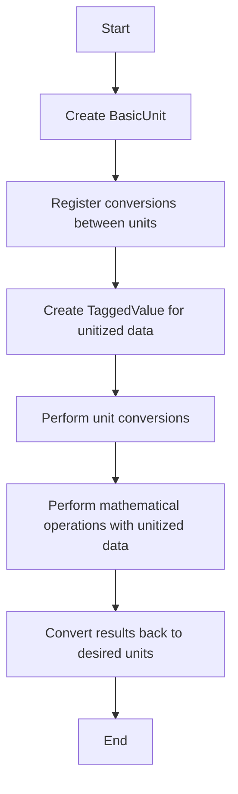

## 类结构

```
BasicUnit
├── UnitResolver
│   ├── addition_rule
│   ├── multiplication_rule
│   └── op_dict
│   └── __call__
├── TaggedValue
│   ├── __new__
│   ├── __init__
│   ├── __copy__
│   ├── __getattribute__
│   ├── __array__
│   ├── __array_wrap__
│   ├── __repr__
│   ├── __str__
│   ├── __len__
│   ├── __getitem__
│   ├── __iter__
│   ├── get_compressed_copy
│   ├── convert_to
│   └── get_value
│   └── get_unit
├── BasicUnitConverter
│   ├── axisinfo
│   ├── convert
│   └── default_units
└── ProxyDelegate
```

## 全局变量及字段


### `unit_resolver`
    
The global instance of UnitResolver used for unit operations.

类型：`UnitResolver`
    


### `cm`
    
The BasicUnit representing centimeters.

类型：`BasicUnit`
    


### `inch`
    
The BasicUnit representing inches.

类型：`BasicUnit`
    


### `radians`
    
The BasicUnit representing radians.

类型：`BasicUnit`
    


### `degrees`
    
The BasicUnit representing degrees.

类型：`BasicUnit`
    


### `secs`
    
The BasicUnit representing seconds.

类型：`BasicUnit`
    


### `hertz`
    
The BasicUnit representing Hertz.

类型：`BasicUnit`
    


### `minutes`
    
The BasicUnit representing minutes.

类型：`BasicUnit`
    


### `rad_fn`
    
The function used for formatting radians in Matplotlib.

类型：`function`
    


### `BasicUnit`
    
The class representing basic units.

类型：`class`
    


### `TaggedValue`
    
The class representing tagged values with units.

类型：`class`
    


### `ProxyDelegate`
    
The class used for proxying methods with unit conversion.

类型：`class`
    


### `PassThroughProxy`
    
The class used for passing through method calls without unit conversion.

类型：`class`
    


### `ConvertArgsProxy`
    
The class used for converting arguments to a specified unit before method call.

类型：`class`
    


### `ConvertReturnProxy`
    
The class used for converting return values to a specified unit after method call.

类型：`class`
    


### `ConvertAllProxy`
    
The class used for converting all arguments and return values to a specified unit.

类型：`class`
    


### `TaggedValueMeta`
    
The metaclass for TaggedValue that adds proxy methods.

类型：`metaclass`
    


### `BasicUnitConverter`
    
The class implementing the ConversionInterface for BasicUnit and TaggedValue.

类型：`class`
    


### `units`
    
The Matplotlib units module.

类型：`module`
    


### `ticker`
    
The Matplotlib ticker module.

类型：`module`
    


### `math`
    
The Python math module.

类型：`module`
    


### `np`
    
The NumPy module.

类型：`module`
    


### `BasicUnit.name`
    
The name of the unit.

类型：`str`
    


### `BasicUnit.fullname`
    
The full name of the unit.

类型：`str`
    


### `BasicUnit.conversions`
    
The dictionary of conversion functions for the unit.

类型：`dict`
    


### `TaggedValue.value`
    
The value of the tagged value.

类型：`object`
    


### `TaggedValue.unit`
    
The unit of the tagged value.

类型：`BasicUnit`
    


### `TaggedValue.proxy_target`
    
The target object for proxying.

类型：`object`
    


### `ProxyDelegate.proxy_type`
    
The type of the proxy to be created.

类型：`class`
    


### `ProxyDelegate.fn_name`
    
The name of the function to be proxied.

类型：`str`
    


### `ConvertArgsProxy.unit`
    
The unit to which arguments should be converted.

类型：`BasicUnit`
    


### `ConvertReturnProxy.unit`
    
The unit to which return values should be converted.

类型：`BasicUnit`
    


### `ConvertAllProxy.unit`
    
The unit to which all arguments and return values should be converted.

类型：`BasicUnit`
    
    

## 全局函数及方法


### cos

计算输入值的余弦值。

参数：

- `x`：`TaggedValue` 或 `np.ndarray`，输入值，可以是单个 `TaggedValue` 或 `np.ndarray`，表示角度或数值。

返回值：`TaggedValue` 或 `np.ndarray`，余弦值，单位与输入值相同。

#### 流程图

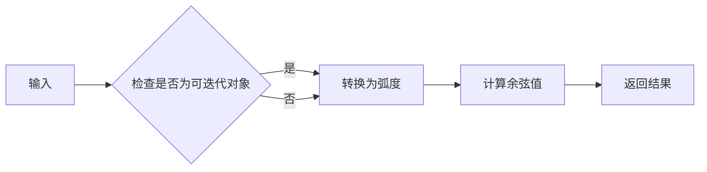

#### 带注释源码

```python
def cos(x):
    if np.iterable(x):
        return [math.cos(val.convert_to(radians).get_value()) for val in x]
    else:
        return math.cos(x.convert_to(radians).get_value())
```


### BasicUnit.__init__

**描述**

`BasicUnit.__init__` 方法是 `BasicUnit` 类的构造函数，用于初始化一个基本单位对象。它接受单位名称和全名作为参数，并设置相应的属性。

**参数**

- `name`：`str`，表示单位的简短名称。
- `fullname`：`str`，表示单位的完整名称，默认为 `name`。

**返回值**

无返回值。

#### 流程图

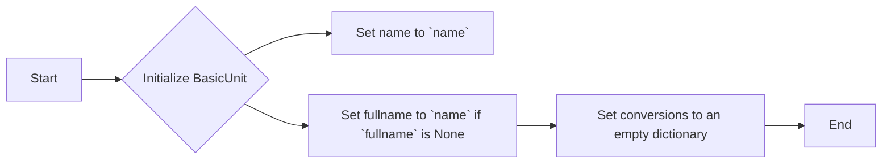

#### 带注释源码

```python
def __init__(self, name, fullname=None):
    self.name = name  # Set the name of the unit
    if fullname is None:
        self.fullname = name  # Set the fullname to name if None
    else:
        self.fullname = fullname  # Set the fullname to the provided value
    self.conversions = dict()  # Initialize an empty dictionary for conversions
```

### BasicUnit.__repr__

该函数用于返回`BasicUnit`对象的字符串表示形式。

#### 参数

- 无

#### 返回值

- `str`，`BasicUnit`对象的字符串表示形式

#### 流程图

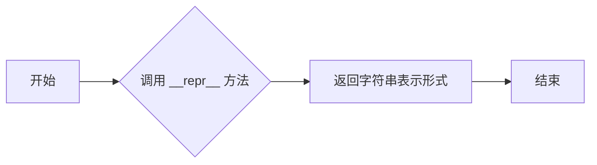

#### 带注释源码

```python
def __repr__(self):
    return f'BasicUnit({self.name})'
```

### BasicUnit.__str__

该函数用于将`BasicUnit`对象转换为字符串表示形式。

#### 参数

- 无

#### 返回值

- `str`：返回`BasicUnit`对象的完整名称。

#### 流程图

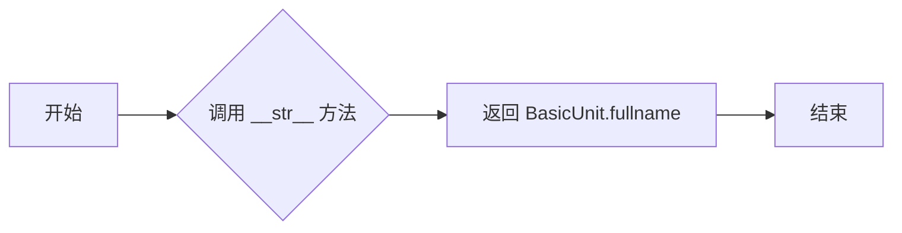

#### 带注释源码

```python
def __str__(self):
    return self.fullname
```

### BasicUnit.__call__

该函数允许用户通过调用 `BasicUnit` 实例来创建一个 `TaggedValue` 对象，该对象将值与单位关联起来。

参数：

- `value`：`any`，要关联的值。

返回值：`TaggedValue`，包含值和单位的对象。

#### 流程图

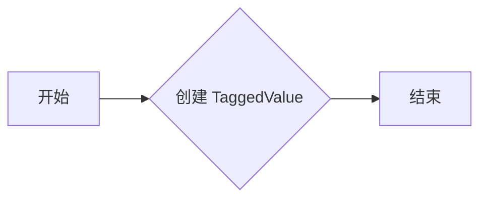

#### 带注释源码

```python
def __init__(self, value, unit):
    self.value = value
    self.unit = unit
    self.proxy_target = self.value

    # 创建 TaggedValue 对象
    def __new__(cls, value, unit):
        # generate a new subclass for value
        value_class = type(value)
        try:
            subcls = type(f'TaggedValue_of_{value_class.__name__}',
                          (cls, value_class), {})
            return object.__new__(subcls)
        except TypeError:
            return object.__new__(cls)
```

### BasicUnit.__mul__

**描述**

`BasicUnit.__mul__` 方法用于将 `BasicUnit` 实例与另一个 `BasicUnit` 实例或具有 `get_unit` 方法的对象相乘，返回一个新的 `TaggedValue` 对象，其值为乘积，单位由 `unit_resolver` 决定。

**参数**

- `rhs`：`BasicUnit` 或具有 `get_unit` 方法的对象，表示要与之相乘的右侧操作数。

**返回值**

- `TaggedValue`：包含乘积值和单位的新对象。

#### 流程图

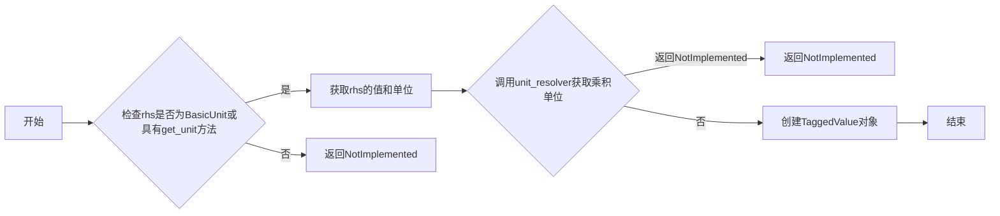

#### 带注释源码

```python
def __mul__(self, rhs):
    value = rhs
    unit = self
    if hasattr(rhs, 'get_unit'):
        value = rhs.get_value()
        unit = rhs.get_unit()
        unit = unit_resolver('__mul__', (self, unit))
    if unit is NotImplemented:
        return NotImplemented
    return TaggedValue(value, unit)
```

### BasicUnit.__rmul__

该函数是`BasicUnit`类的一个方法，用于实现与`BasicUnit`实例的右乘操作。

#### 描述

`BasicUnit.__rmul__`方法接受一个`BasicUnit`实例作为参数，并返回一个新的`TaggedValue`对象，该对象包含乘法的结果和相应的单位。

#### 参数

- `lhs`：`BasicUnit`，表示要与之进行右乘操作的`BasicUnit`实例。

#### 返回值

- `TaggedValue`：包含乘法结果和单位的新`TaggedValue`对象。

#### 流程图

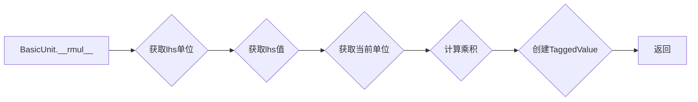

#### 带注释源码

```python
def __rmul__(self, lhs):
    # 获取lhs的值和单位
    value = lhs
    unit = self
    if hasattr(lhs, 'get_unit'):
        value = lhs.get_value()
        unit = lhs.get_unit()
        unit = unit_resolver('__mul__', (self, unit))
    if unit is NotImplemented:
        return NotImplemented
    # 计算乘积
    return TaggedValue(value, unit)
```

### BasicUnit.__array_wrap__

#### 描述

`__array_wrap__` 方法用于将一个 NumPy 数组包装成 `TaggedValue` 对象，以便在支持单位的情况下进行数学运算。

#### 参数

- `array`：`numpy.ndarray`，要包装的 NumPy 数组。
- `context`：`None`，上下文信息，通常为 `None`。
- `return_scalar`：`bool`，是否返回标量值，默认为 `False`。

#### 返回值

- `TaggedValue`，包装了输入数组的 `TaggedValue` 对象。

#### 流程图

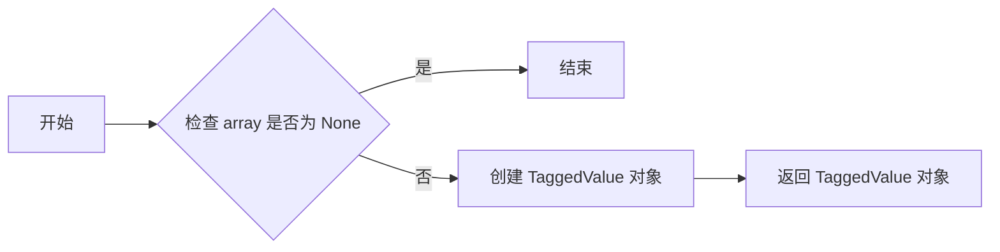

#### 带注释源码

```python
def __array_wrap__(self, array, context=None, return_scalar=False):
    return TaggedValue(array, self.unit)
```

### BasicUnit.__array__

#### 描述

`BasicUnit.__array__` 方法用于将 `BasicUnit` 对象转换为 NumPy 数组。它通过调用 NumPy 的 `np.asarray` 函数来实现转换。

#### 参数

- `dtype`：`{dtype}`，指定输出数组的类型，默认为 `object`。
- `copy`：`{copy}`，指定是否复制数据，默认为 `False`。

#### 返回值

- `{返回值类型}`：`{返回值描述}`，返回一个 NumPy 数组。

#### 流程图


#### 带注释源码

```python
def __array__(self, dtype=object, copy=False):
    return np.asarray(self.value, dtype)
```

### BasicUnit.add_conversion_factor

该函数允许用户为`BasicUnit`实例添加一个转换因子，以便将一个单位转换为另一个单位。

#### 参数

- `unit`：`BasicUnit`，要转换到的单位。
- `factor`：`float`或`callable`，转换因子，可以是浮点数或一个函数，该函数接受一个值并返回转换后的值。

#### 返回值

- `None`：该函数不返回任何值。

#### 流程图

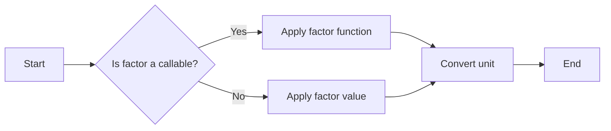

#### 带注释源码

```python
def add_conversion_factor(self, unit, factor):
    def convert(x):
        return x * factor
    self.conversions[unit] = convert
```

### BasicUnit.add_conversion_fn

该函数允许用户为`BasicUnit`实例添加一个自定义的转换函数，用于将一个单位转换为另一个单位。

#### 参数

- `unit`：`BasicUnit`，要转换到的目标单位。
- `fn`：`callable`，一个函数，它接受一个值并返回转换后的值。

#### 返回值

- 无

#### 流程图

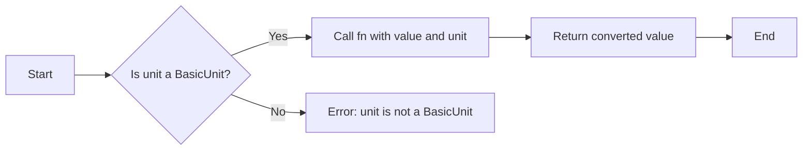

#### 带注释源码

```python
def add_conversion_fn(self, unit, fn):
    # 将自定义的转换函数添加到当前单位的转换字典中
    self.conversions[unit] = fn
```

### BasicUnit.get_conversion_fn

该函数用于获取BasicUnit对象中指定单位的转换函数。

#### 参数

- `unit`：`BasicUnit`，指定要获取转换函数的单位。

#### 返回值

- `function`：`function`，指定单位的转换函数。

#### 流程图

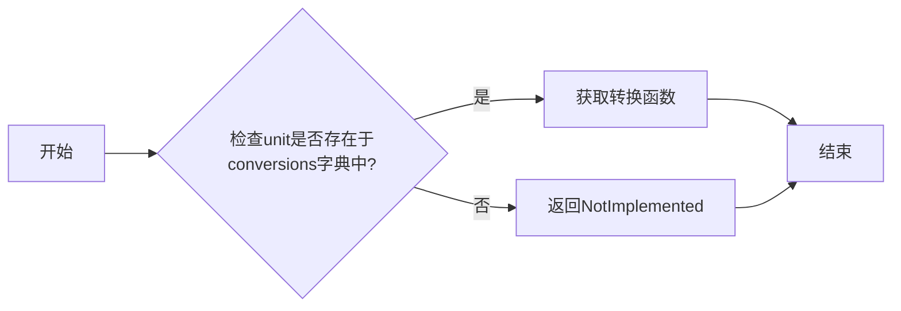

#### 带注释源码

```python
def get_conversion_fn(self, unit):
    # 获取转换函数
    return self.conversions[unit]
```

### BasicUnit.convert_value_to

该函数用于将给定值转换为指定单位。

#### 参数

- `value`：`Any`，要转换的值。
- `unit`：`BasicUnit`，目标单位。

#### 返回值

- `Any`：转换后的值。

#### 流程图

```mermaid
graph LR
A[开始] --> B{检查 unit 是否为 None}
B -- 是 --> C[返回 value]
B -- 否 --> D{检查 value 是否为 TaggedValue}
D -- 是 --> E{调用 value.convert_to(unit)}
D -- 否 --> F{调用 unit.convert_value_to(value, unit)}
E --> G[返回转换后的值]
F --> G
G --> H[结束]
```

#### 带注释源码

```python
def convert_value_to(self, value, unit):
    conversion_fn = self.conversions[unit]
    ret = conversion_fn(value)
    return ret
```

### BasicUnit.get_unit

该函数返回BasicUnit对象的单位。

#### 参数

- 无

#### 返回值

- `BasicUnit`：返回BasicUnit对象的单位。

#### 流程图

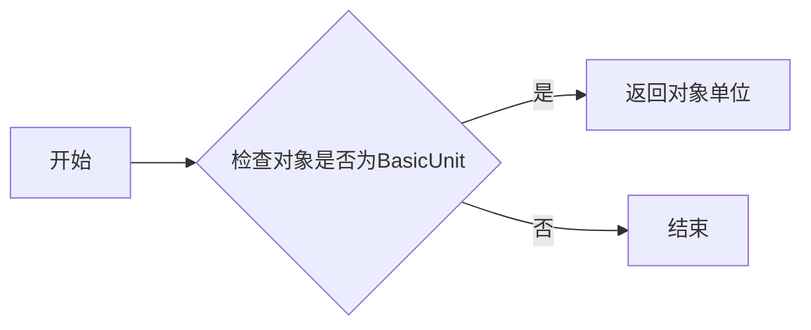

#### 带注释源码

```python
class BasicUnit:
    # ...

    def get_unit(self):
        return self
```

### TaggedValue.__new__

#### 描述

`TaggedValue.__new__` 方法是 `TaggedValue` 类的构造函数，用于创建一个新的 `TaggedValue` 实例。它接受两个参数：`value` 和 `unit`，分别表示要包装的值和单位。

#### 参数

- `value`：`{类型}`，表示要包装的值。
- `unit`：`{类型}`，表示值的单位。

#### 返回值

- `{类型}`，表示创建的新 `TaggedValue` 实例。

#### 流程图

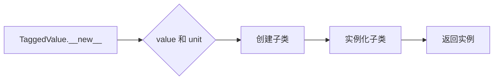

#### 带注释源码

```python
def __new__(cls, value, unit):
    # generate a new subclass for value
    value_class = type(value)
    try:
        subcls = type(f'TaggedValue_of_{value_class.__name__}',
                      (cls, value_class), {})
        return object.__new__(subcls)
    except TypeError:
        return object.__new__(cls)
```

### TaggedValue.__init__

TaggedValue.__init__ 是 TaggedValue 类的构造函数，用于初始化一个 TaggedValue 对象。

#### 描述

该函数接受一个值和一个单位，创建一个新的 TaggedValue 对象，该对象将值和单位封装在一起。

#### 参数

- `value`：`any`，要封装的值。
- `unit`：`BasicUnit`，值对应的单位。

#### 返回值

无返回值。

#### 流程图

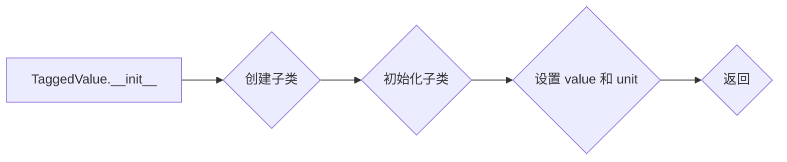

#### 带注释源码

```python
def __init__(self, value, unit):
    self.value = value
    self.unit = unit
    self.proxy_target = self.value
```

### TaggedValue.__copy__

TaggedValue.__copy__ 是 TaggedValue 类的一个方法，用于创建 TaggedValue 对象的浅拷贝。

#### 描述

该方法接受一个 TaggedValue 对象作为参数，并返回一个新的 TaggedValue 对象，其值和单位与原始对象相同。

#### 参数

- `self`：当前 TaggedValue 对象

#### 返回值

- `TaggedValue`：一个新的 TaggedValue 对象，其值和单位与原始对象相同

#### 流程图

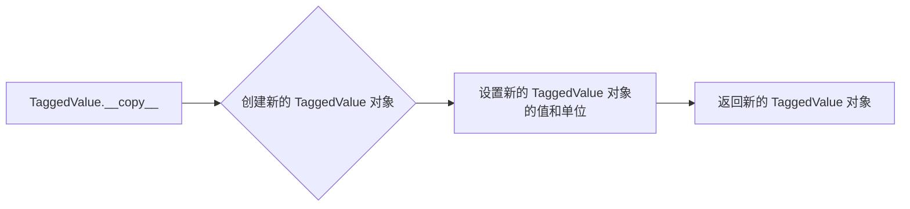

#### 带注释源码

```python
def __copy__(self):
    # 创建一个新的 TaggedValue 对象
    return TaggedValue(self.value, self.unit)
```

### TaggedValue.__getattribute__

TaggedValue.__getattribute__ 是一个特殊方法，用于重写对象的 `__getattribute__` 方法，以便在访问属性时进行特殊处理。

#### 描述

当尝试访问 TaggedValue 实例的属性时，如果属性名不是特殊方法或属性，并且该属性存在于其值对象上，则该方法会被调用。否则，它将调用基类的 `__getattribute__` 方法。

#### 参数

- `name`：要访问的属性名。

#### 返回值

- 返回属性值。

#### 流程图

```mermaid
graph LR
A[开始] --> B{属性名是否以 "__" 开头?}
B -- 是 --> C[调用基类的 __getattribute__]
B -- 否 --> D{属性名存在于值对象上?}
D -- 是 --> E[返回值对象上的属性值]
D -- 否 --> C
E --> F[结束]
```

#### 带注释源码

```python
def __getattribute__(self, name):
    # 如果属性名以 "__" 开头，调用基类的 __getattribute__
    if name.startswith('__'):
        return object.__getattribute__(self, name)
    # 如果属性名存在于值对象上，返回值对象上的属性值
    variable = object.__getattribute__(self, 'value')
    if hasattr(variable, name) and name not in self.__class__.__dict__:
        return getattr(variable, name)
    # 否则，调用基类的 __getattribute__
    return object.__getattribute__(self, name)
```

### TaggedValue.__array__

TaggedValue.__array__ 是 TaggedValue 类的一个方法，它允许 TaggedValue 对象与 NumPy 数组进行交互。

#### 参数

- `dtype`：`{dtype}`，指定返回数组的类型，默认为 `object`。
- `copy`：`{bool}`，指定是否复制数据，默认为 `False`。

#### 返回值

- `{np.ndarray}`，返回一个 NumPy 数组，其元素类型由 `dtype` 参数指定。

#### 流程图

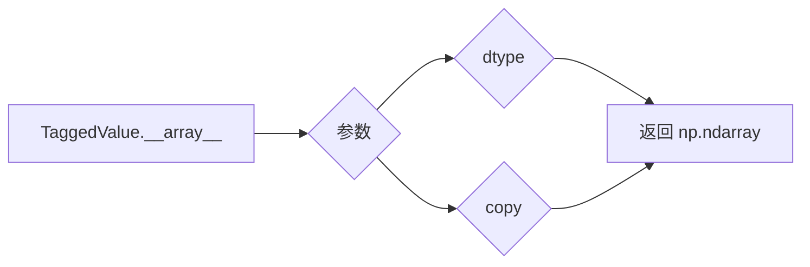

#### 带注释源码

```python
def __array__(self, dtype=object, copy=False):
    return np.asarray(self.value, dtype)
```

### TaggedValue.__array_wrap__

TaggedValue.__array_wrap__ 是一个特殊方法，用于处理 NumPy 数组与 TaggedValue 对象之间的转换。

#### 描述

该方法用于将 NumPy 数组转换为 TaggedValue 对象，同时保留其单位信息。

#### 参数

- `array`：`numpy.ndarray`，要转换的 NumPy 数组。
- `context`：`str`，上下文信息，通常为空。
- `return_scalar`：`bool`，是否返回标量值，默认为 `False`。

#### 返回值

- `TaggedValue`，转换后的 TaggedValue 对象。

#### 流程图

```mermaid
graph LR
A[开始] --> B{检查 array 是否为 NumPy 数组?}
B -- 是 --> C[创建 TaggedValue 对象]
B -- 否 --> D[结束]
C --> E[返回 TaggedValue 对象]
```

#### 带注释源码

```python
def __array_wrap__(self, array, context=None, return_scalar=False):
    return TaggedValue(array, self.unit)
```

### TaggedValue.__repr__

#### 描述

`TaggedValue.__repr__` 方法用于返回 `TaggedValue` 对象的字符串表示形式，包括其值和单位。

#### 参数

- 无

#### 返回值

- `str`：`TaggedValue` 对象的字符串表示形式。

#### 流程图

```mermaid
graph LR
A[TaggedValue.__repr__] --> B{获取 self.value}
B --> C{获取 self.unit}
C --> D{构建字符串表示形式}
D --> E[返回字符串表示形式]
```

#### 带注释源码

```python
def __repr__(self):
    return f'TaggedValue({self.value!r}, {self.unit!r})'
```

### TaggedValue.__str__

#### 描述

`TaggedValue.__str__` 方法用于将 `TaggedValue` 对象转换为字符串表示形式，显示其值和单位。

#### 参数

- 无

#### 返回值

- `str`：返回一个字符串，表示 `TaggedValue` 对象的值和单位。

#### 流程图

```mermaid
graph LR
A[TaggedValue.__str__] --> B{获取 self.value 和 self.unit}
B --> C{格式化字符串}
C --> D[返回字符串]
```

#### 带注释源码

```python
def __str__(self):
    return f"{self.value} in {self.unit}"
```

### TaggedValue.__len__

TaggedValue.__len__ 是 TaggedValue 类的一个内置方法，用于获取 TaggedValue 对象中包含的值的数量。

#### 参数

- 无

#### 返回值

- `int`，返回 TaggedValue 对象中值的数量。

#### 流程图

```mermaid
graph LR
A[TaggedValue.__len__] --> B{获取 self.value}
B --> C{获取 len(self.value)}
C --> D[返回 len(self.value)]
```

#### 带注释源码

```python
def __len__(self):
    return len(self.value)
```

### TaggedValue.__getitem__

TaggedValue.__getitem__ 方法允许从 TaggedValue 对象中获取值，类似于从列表或数组中索引元素。

#### 参数

- `key`：`int` 或 `slice`，表示要获取的元素的索引或切片。

#### 返回值

- `TaggedValue`，包含索引或切片对应的值和单位。

#### 流程图

```mermaid
graph LR
A[TaggedValue.__getitem__] --> B{检查 key 是否为 int 或 slice?}
B -- 是 --> C[获取 value[key]}
B -- 否 --> D[抛出 TypeError]
C --> E[返回 TaggedValue(value[key], unit)]
```

#### 带注释源码

```python
def __getitem__(self, key):
    # 获取 value[key]
    value = self.value[key]
    # 返回 TaggedValue(value[key], unit)
    return TaggedValue(value, self.unit)
```

### TaggedValue.__iter__

TaggedValue.__iter__ 是 TaggedValue 类的一个内置方法，用于迭代 TaggedValue 对象中的值。

#### 描述

该方法返回一个生成器，该生成器会迭代 TaggedValue 对象中的值，并将每个值转换为 TaggedValue 对象，单位与原始 TaggedValue 对象相同。

#### 参数

- 无

#### 返回值

- `TaggedValue`：一个生成器，包含转换后的 TaggedValue 对象。

#### 流程图

```mermaid
graph LR
A[TaggedValue.__iter__] --> B{返回生成器}
B --> C{迭代值}
C --> D[转换为 TaggedValue]
D --> E{返回 TaggedValue}
```

#### 带注释源码

```python
def __iter__(self):
    # Return a generator expression rather than use `yield`, so that
    # TypeError is raised by iter(self) if appropriate when checking for
    # iterability.
    return (TaggedValue(inner, self.unit) for inner in self.value)
```


### TaggedValue.get_compressed_copy

This method returns a compressed copy of the masked array represented by the TaggedValue object, using the provided mask.

参数：

- `mask`：`numpy.ndarray`，A boolean mask indicating which elements of the array should be considered valid.

返回值：`TaggedValue`，A TaggedValue object representing the compressed copy of the array.

#### 流程图

```mermaid
graph LR
A[TaggedValue.get_compressed_copy] --> B{Has mask?}
B -- Yes --> C[Create masked array]
B -- No --> D[Return original TaggedValue]
C --> E[Compress array]
E --> F[Return compressed TaggedValue]
```

#### 带注释源码

```python
def get_compressed_copy(self, mask):
    new_value = np.ma.masked_array(self.value, mask=mask).compressed()
    return TaggedValue(new_value, self.unit)
```


### TaggedValue.convert_to

#### 描述

`TaggedValue.convert_to` 方法用于将 `TaggedValue` 对象的值转换为指定的单位。

#### 参数

- `unit`：`BasicUnit` 或 `str`，指定转换到的单位。

#### 返回值

- `TaggedValue`：转换后的 `TaggedValue` 对象。

#### 流程图

```mermaid
graph LR
A[TaggedValue] --> B{unit == self.unit or not unit?}
B -- 是 --> C[返回 self]
B -- 否 --> D{尝试 unit.convert_value_to(self.value, unit)?}
D -- 是 --> E[返回 TaggedValue(new_value, unit)}
D -- 否 --> F[返回 self]
```

#### 带注释源码

```python
def convert_to(self, unit):
    if unit == self.unit or not unit:
        return self
    try:
        new_value = self.unit.convert_value_to(self.value, unit)
    except AttributeError:
        new_value = self
    return TaggedValue(new_value, unit)
```

### TaggedValue.get_value

TaggedValue.get_value 方法用于获取 TaggedValue 对象中存储的值。

参数：

- 无

返回值：`{返回值类型}`，返回 TaggedValue 对象中存储的值。

#### 流程图

```mermaid
graph LR
A[TaggedValue.get_value()] --> B{获取 self.value}
B --> C{返回 self.value}
```

#### 带注释源码

```python
def get_value(self):
    return self.value
```

### TaggedValue.get_unit

TaggedValue.get_unit 方法用于获取 TaggedValue 对象的当前单位。

参数：

- 无

返回值：`{返回值类型}`，返回值描述

#### 流程图

```mermaid
graph LR
A[TaggedValue.get_unit()] --> B{获取 TaggedValue 对象的 unit 属性}
B --> C{返回 unit 属性的值}
```

#### 带注释源码

```python
def get_unit(self):
    return self.unit
```


### BasicUnitConverter.axisinfo

This function returns an `AxisInfo` instance for a given unit and axis. It is used to customize the formatting and location of tick labels on axes in Matplotlib when the data is in the specified unit.

参数：

- `unit`：`BasicUnit` 或 `TaggedValue`，The unit for which the `AxisInfo` instance is returned.
- `axis`：`int`，The axis number for which the `AxisInfo` instance is returned.

返回值：`units.AxisInfo`，An instance of `AxisInfo` that contains information about the major tick locations, major tick formatters, and label for the specified unit and axis.

#### 流程图

```mermaid
graph LR
A[Start] --> B{Is unit radians?}
B -- Yes --> C[Set majloc to MultipleLocator(base=np.pi/2)]
B -- No --> D{Is unit degrees?}
D -- Yes --> E[Set majloc to AutoLocator()]
D -- No --> F{Is unit None?}
F -- Yes --> G[Return None]
F -- No --> H[Set label to unit.fullname]
H --> I[End]
```

#### 带注释源码

```python
@staticmethod
def axisinfo(unit, axis):
    """Return AxisInfo instance for x and unit."""

    if unit == radians:
        return units.AxisInfo(
            majloc=ticker.MultipleLocator(base=np.pi/2),
            majfmt=ticker.FuncFormatter(rad_fn),
            label=unit.fullname,
        )
    elif unit == degrees:
        return units.AxisInfo(
            majloc=ticker.AutoLocator(),
            majfmt=ticker.FormatStrFormatter(r'$%i^\circ$'),
            label=unit.fullname,
        )
    elif unit is not None:
        if hasattr(unit, 'fullname'):
            return units.AxisInfo(label=unit.fullname)
        elif hasattr(unit, 'unit'):
            return units.AxisInfo(label=unit.unit.fullname)
    return None
```


### BasicUnitConverter.convert

#### 描述

`BasicUnitConverter.convert` 方法是 `BasicUnitConverter` 类的一个静态方法，用于将具有单位的数据转换为指定的单位。

#### 参数

- `val`：`np.ndarray` 或 `TaggedValue`，要转换的数据。
- `unit`：`BasicUnit` 或 `TaggedValue`，目标单位。

#### 返回值

- `np.ndarray` 或 `TaggedValue`，转换后的数据。

#### 流程图

```mermaid
graph LR
A[Input] --> B{Is val iterable?}
B -- Yes --> C[For each element in val]
B -- No --> D[Convert val to unit]
C --> E[Convert element to unit]
E --> F[Return converted elements]
D --> G[Return converted val]
```

#### 带注释源码

```python
@staticmethod
def convert(val, unit, axis):
    if np.iterable(val):
        if isinstance(val, np.ma.MaskedArray):
            val = val.astype(float).filled(np.nan)
        out = np.empty(len(val))
        for i, thisval in enumerate(val):
            if np.ma.is_masked(thisval):
                out[i] = np.nan
            else:
                try:
                    out[i] = thisval.convert_to(unit).get_value()
                except AttributeError:
                    out[i] = thisval
        return out
    if np.ma.is_masked(val):
        return np.nan
    else:
        return val.convert_to(unit).get_value()
```

### BasicUnitConverter.default_units

#### 描述

`BasicUnitConverter.default_units` 方法用于返回给定值或值的列表的默认单位。如果值是可迭代的，则返回迭代中第一个值的单位；如果值不是可迭代的，则直接返回该值的单位。

#### 参数

- `x`：`{类型}`，输入值或值的列表。
- `axis`：`{类型}`，轴信息，通常为 `None`。

#### 返回值

- `{类型}`，默认单位或 `None`。

#### 流程图

```mermaid
graph LR
A[输入值 x] --> B{可迭代?}
B -- 是 --> C[获取第一个值的单位]
B -- 否 --> C
C --> D[返回单位]
```

#### 带注释源码

```python
def default_units(self, x, axis=None):
    """Return the default unit for x or None."""
    if np.iterable(x):
        for thisx in x:
            return thisx.unit
    return x.unit
```

### ProxyDelegate.__get__

ProxyDelegate.__get__ 是一个特殊方法，用于实现属性的委托。它允许通过 ProxyDelegate 实例访问对象的属性。

#### 描述

该函数用于获取对象的属性，如果属性不存在，则创建一个代理对象。

#### 参数

- `obj`：`ProxyDelegate` 实例所委托的对象。
- `objtype`：可选参数，表示对象的类型。

#### 返回值

- 返回一个代理对象，该对象可以调用委托对象的函数。

#### 流程图

```mermaid
graph LR
A[ProxyDelegate.__get__] --> B{参数：obj, objtype}
B --> C{检查属性是否存在}
C -- 是 --> D[返回属性值]
C -- 否 --> E[创建代理对象]
E --> F[返回代理对象]
```

#### 带注释源码

```python
def __get__(self, obj, objtype=None):
    # 如果属性不存在，则创建一个代理对象
    if not hasattr(obj, self.fn_name):
        return self.proxy_type(self.fn_name, obj)
    # 否则，返回属性值
    return getattr(obj, self.fn_name)
```

## 关键组件


### 张量索引与惰性加载

张量索引与惰性加载是代码中用于处理和操作张量数据的关键组件。它允许对张量进行索引操作，同时延迟实际的数据加载，从而提高性能和效率。

### 反量化支持

反量化支持是代码中用于处理和转换不同单位量化的关键组件。它允许将数据从一种单位转换为另一种单位，确保数据在不同单位之间的一致性和准确性。

### 量化策略

量化策略是代码中用于优化和调整数据量化的关键组件。它允许根据不同的需求和场景调整量化参数，以优化性能和资源使用。


## 问题及建议


### 已知问题

-   **代码复杂度**：代码中存在大量的元类和代理模式，这增加了代码的复杂度，使得理解和维护变得更加困难。
-   **性能问题**：在`convert_to`方法中，如果转换失败，会返回原始对象，这可能导致不必要的性能开销。
-   **异常处理**：代码中缺少对异常的明确处理，例如在`convert_to`方法中，如果转换失败，可能会抛出异常，但没有相应的异常处理机制。
-   **代码重复**：在`BasicUnit`类中，`__mul__`和`__rmul__`方法有相似的逻辑，可以考虑提取公共逻辑以减少代码重复。

### 优化建议

-   **简化设计**：考虑简化代码结构，减少元类和代理模式的使用，以提高代码的可读性和可维护性。
-   **优化性能**：在`convert_to`方法中，可以添加缓存机制，以避免重复的转换操作。
-   **增强异常处理**：在代码中添加异常处理机制，确保在出现错误时能够优雅地处理异常。
-   **减少代码重复**：将`__mul__`和`__rmul__`方法中的公共逻辑提取出来，以减少代码重复。
-   **文档和注释**：增加代码的文档和注释，以帮助其他开发者更好地理解代码的功能和实现细节。
-   **单元测试**：编写单元测试来验证代码的正确性和稳定性，确保在代码修改后不会引入新的错误。


## 其它


### 设计目标与约束

- 设计目标：
  - 提供一个灵活的单元系统，支持任意单位的注册和转换。
  - 支持与Matplotlib的集成，以便在图表中使用单位。
  - 提供数学运算支持，包括加、减、乘、除等。
- 约束：
  - 单位转换必须准确无误。
  - 与Matplotlib的集成应尽可能无缝。
  - 代码应易于维护和扩展。

### 错误处理与异常设计

- 错误处理：
  - 当尝试进行不支持的转换时，应抛出异常。
  - 当尝试进行无效的数学运算时，应抛出异常。
- 异常设计：
  - 定义自定义异常类，如`ConversionError`和`MathError`，以提供更具体的错误信息。

### 数据流与状态机

- 数据流：
  - 用户输入数据，数据被转换为`TaggedValue`对象。
  - `TaggedValue`对象参与数学运算，结果被转换为`TaggedValue`对象。
  - 结果可以转换为其他单位或直接使用。
- 状态机：
  - 无状态机，但数据流遵循明确的步骤。

### 外部依赖与接口契约

- 外部依赖：
  - NumPy：用于数学运算和数组操作。
  - Matplotlib：用于集成和显示图表。
- 接口契约：
  - `BasicUnit`类应提供统一的接口，用于注册和转换单位。
  - `TaggedValue`类应提供统一的接口，用于处理带单位的数值。
  - `BasicUnitConverter`类应提供统一的接口，用于Matplotlib的集成。


    