# `matplotlib\galleries\examples\units\evans_test.py` 详细设计文档

This code defines a custom unit system for Matplotlib, allowing for the conversion and formatting of values based on a given unit.

## 整体流程

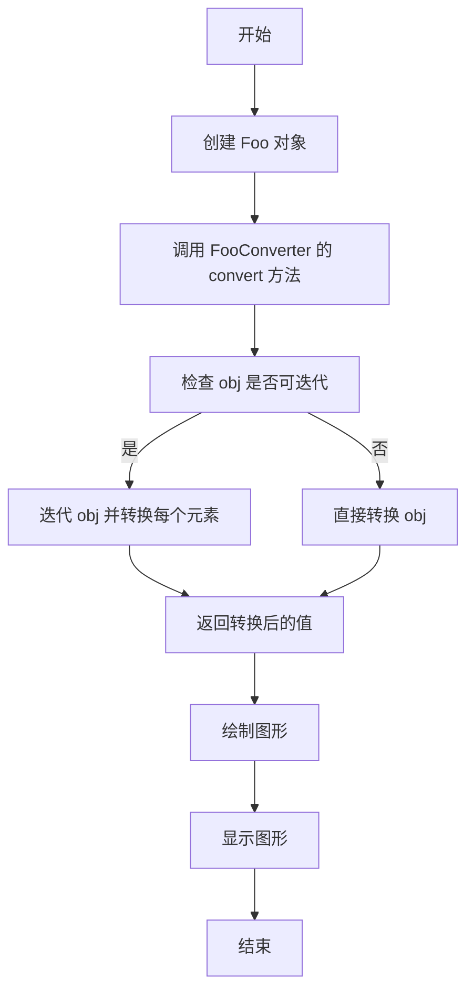

## 类结构

```
Foo (类)
├── FooConverter (类)
│   ├── axisinfo (静态方法)
│   ├── convert (静态方法)
│   └── default_units (静态方法)
└── units (模块)
```

## 全局变量及字段


### `units`
    
The module that contains the Foo class and the FooConverter class.

类型：`module`
    


### `Foo`
    
A class that represents a value with a unit.

类型：`class`
    


### `FooConverter`
    
A class that provides conversion functionality for the Foo class.

类型：`class`
    


### `plt`
    
The matplotlib.pyplot module for plotting.

类型：`module`
    


### `np`
    
The numpy module for numerical operations.

类型：`module`
    


### `ticker`
    
The matplotlib.ticker module for tick formatting.

类型：`module`
    


### `units`
    
The matplotlib.units module for unit handling.

类型：`module`
    


### `Foo.unit`
    
The conversion factor for the value.

类型：`float`
    


### `Foo._val`
    
The value multiplied by the unit.

类型：`float`
    
    

## 全局函数及方法


### matplotlib.pyplot

matplotlib.pyplot 是一个用于创建静态、交互式和动画图表的库。

#### 流程图


#### 带注释源码

```python
import matplotlib.pyplot as plt
import numpy as np

import matplotlib.ticker as ticker
import matplotlib.units as units

# Define Foo class
class Foo:
    def __init__(self, val, unit=1.0):
        self.unit = unit
        self._val = val * unit

    def value(self, unit):
        if unit is None:
            unit = self.unit
        return self._val / unit

# Define FooConverter class
class FooConverter(units.ConversionInterface):
    @staticmethod
    def axisinfo(unit, axis):
        """Return the Foo AxisInfo."""
        if unit == 1.0 or unit == 2.0:
            return units.AxisInfo(
                majloc=ticker.IndexLocator(8, 0),
                majfmt=ticker.FormatStrFormatter("VAL: %s"),
                label='foo',
                )

        else:
            return None

    @staticmethod
    def convert(obj, unit, axis):
        """
        Convert *obj* using *unit*.

        If *obj* is a sequence, return the converted sequence.
        """
        if np.iterable(obj):
            return [o.value(unit) for o in obj]
        else:
            return obj.value(unit)

    @staticmethod
    def default_units(x, axis):
        """Return the default unit for *x* or None."""
        if np.iterable(x):
            for thisx in x:
                return thisx.unit
        else:
            return x.unit

# Register FooConverter with units registry
units.registry[Foo] = FooConverter()

# Create some Foos
x = [Foo(val, 1.0) for val in range(0, 50, 2)]
# and some arbitrary y data
y = [i for i in range(len(x))]

# Create subplots
fig, (ax1, ax2) = plt.subplots(1, 2)
fig.suptitle("Custom units")
fig.subplots_adjust(bottom=0.2)

# Plot with specified units
ax2.plot(x, y, 'o', xunits=2.0)
ax2.set_title("xunits = 2.0")
ax2.tick_params(axis='x', rotation=30, rotation_mode='xtick')

# Plot without specified units; will use the None branch for axisinfo
ax1.plot(x, y)  # uses default units
ax1.set_title('default units')
ax1.tick_params(axis='x', rotation=30, rotation_mode='xtick')

# Show plot
plt.show()
```

### matplotlib.pyplot.plot

matplotlib.pyplot.plot 是一个用于绘制二维线条和标记的函数。

参数：

- `x`：`array_like`，x轴数据。
- `y`：`array_like`，y轴数据。
- `units`：`str`，可选，指定x轴或y轴的单位。

返回值：`Line2D`，绘制的线条对象。

```python
ax2.plot(x, y, 'o', xunits=2.0)
```

### matplotlib.pyplot.subplots

matplotlib.pyplot.subplots 是一个用于创建子图对象的函数。

参数：

- `nrows`：`int`，可选，子图行数。
- `ncols`：`int`，可选，子图列数。
- `sharex`：`bool`，可选，是否共享x轴。
- `sharey`：`bool`，可选，是否共享y轴。

返回值：`Figs`，子图对象。

```python
fig, (ax1, ax2) = plt.subplots(1, 2)
```

### matplotlib.pyplot.show

matplotlib.pyplot.show 是一个用于显示图形的函数。

```python
plt.show()
```


### FooConverter.convert

Convert an object using a specified unit.

参数：

- `obj`：`numpy.ndarray` 或 `Foo`，The object to be converted.
- `unit`：`float`，The unit to convert to.
- `axis`：`int`，The axis along which to convert.

返回值：`numpy.ndarray` 或 `Foo`，The converted object.

#### 流程图

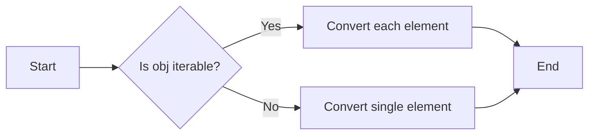

#### 带注释源码

```python
def convert(obj, unit, axis):
    """
    Convert *obj* using *unit*.

    If *obj* is a sequence, return the converted sequence.
    """
    if np.iterable(obj):
        return [o.value(unit) for o in obj]
    else:
        return obj.value(unit)
```


### FooConverter.axisinfo

Return the Foo AxisInfo.

参数：

- `unit`：`float`，The unit to be used for the axis.
- `axis`：`matplotlib.axes.Axes`，The axis to which the information applies.

返回值：`matplotlib.units.AxisInfo`，The AxisInfo object for the given unit and axis.

#### 流程图

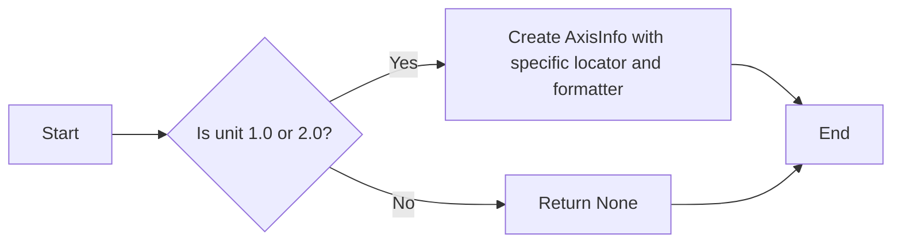

#### 带注释源码

```python
@staticmethod
def axisinfo(unit, axis):
    """Return the Foo AxisInfo."""
    if unit == 1.0 or unit == 2.0:
        return units.AxisInfo(
            majloc=ticker.IndexLocator(8, 0),
            majfmt=ticker.FormatStrFormatter("VAL: %s"),
            label='foo',
        )
    else:
        return None
```

### FooConverter.convert

Convert *obj* using *unit*.

参数：

- `obj`：`Foo` 或可迭代对象，The object to be converted.
- `unit`：`float`，The unit to be used for the conversion.
- `axis`：`matplotlib.axes.Axes`，The axis to which the conversion applies.

返回值：`float` 或列表，The converted value or list of values.

#### 流程图

```mermaid
graph LR
A[Start] --> B{Is obj iterable?}
B -- Yes --> C[Convert each element using value()]
B -- No --> D[Convert obj using value()]
C --> E[End]
D --> E
```

#### 带注释源码

```python
@staticmethod
def convert(obj, unit, axis):
    """
    Convert *obj* using *unit*.

    If *obj* is a sequence, return the converted sequence.
    """
    if np.iterable(obj):
        return [o.value(unit) for o in obj]
    else:
        return obj.value(unit)
```

### FooConverter.default_units

Return the default unit for *x* or None.

参数：

- `x`：`Foo` 或可迭代对象，The object to determine the default unit for.
- `axis`：`matplotlib.axes.Axes`，The axis to which the default unit applies.

返回值：`float` 或 `None`，The default unit for the given object or None if not applicable.

#### 流程图

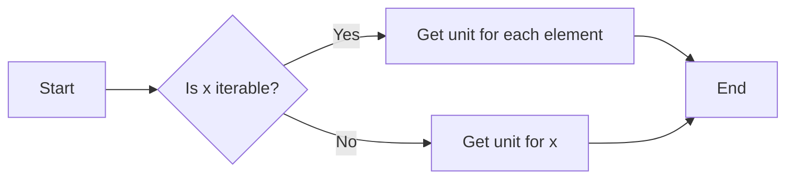

#### 带注释源码

```python
@staticmethod
def default_units(x, axis):
    """Return the default unit for *x* or None."""
    if np.iterable(x):
        for thisx in x:
            return thisx.unit
    else:
        return x.unit
```


### `FooConverter.axisinfo`

返回 `Foo` 类轴信息。

参数：

- `unit`：`float`，表示单位转换因子。
- `axis`：`matplotlib.axes.Axes`，表示轴对象。

返回值：`matplotlib.units.AxisInfo`，表示轴信息。

返回值描述：返回一个 `AxisInfo` 对象，包含主刻度定位器、主刻度格式化器、标签等信息。

#### 流程图

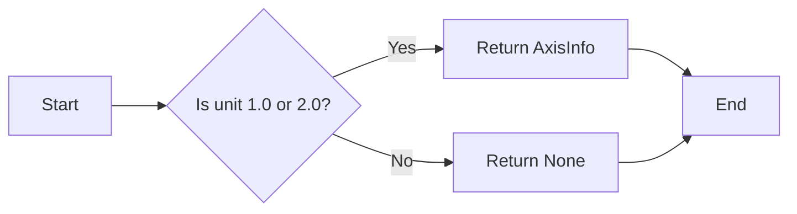

#### 带注释源码

```python
@staticmethod
def axisinfo(unit, axis):
    """Return the Foo AxisInfo."""
    if unit == 1.0 or unit == 2.0:
        return units.AxisInfo(
            majloc=ticker.IndexLocator(8, 0),
            majfmt=ticker.FormatStrFormatter("VAL: %s"),
            label='foo',
        )
    else:
        return None
```

### `FooConverter.convert`

将对象转换为指定单位。

参数：

- `obj`：`Foo` 或可迭代对象，表示要转换的对象。
- `unit`：`float`，表示单位转换因子。
- `axis`：`matplotlib.axes.Axes`，表示轴对象。

返回值：`float` 或列表，表示转换后的值。

返回值描述：如果 `obj` 是可迭代对象，则返回转换后的列表；否则返回单个转换后的值。

#### 流程图

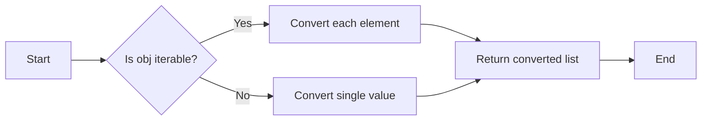

#### 带注释源码

```python
@staticmethod
def convert(obj, unit, axis):
    """
    Convert *obj* using *unit*.

    If *obj* is a sequence, return the converted sequence.
    """
    if np.iterable(obj):
        return [o.value(unit) for o in obj]
    else:
        return obj.value(unit)
```

### `FooConverter.default_units`

返回对象的默认单位。

参数：

- `x`：`Foo` 或可迭代对象，表示对象。
- `axis`：`matplotlib.axes.Axes`，表示轴对象。

返回值：`float` 或 `None`，表示默认单位。

返回值描述：如果 `x` 是可迭代对象，则返回第一个元素的单位；否则返回单个对象的单位。

#### 流程图

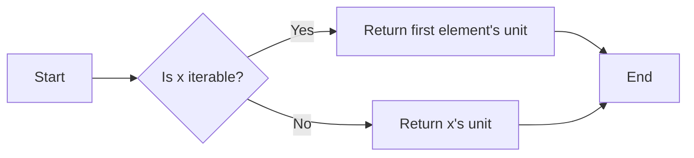

#### 带注释源码

```python
@staticmethod
def default_units(x, axis):
    """Return the default unit for *x* or None."""
    if np.iterable(x):
        for thisx in x:
            return thisx.unit
    else:
        return x.unit
```


### Foo.__init__

初始化`Foo`类实例，设置单位转换因子和值。

参数：

- `val`：`float`，要转换的值。
- `unit`：`float`，单位转换因子，默认为1.0。

返回值：无

#### 流程图

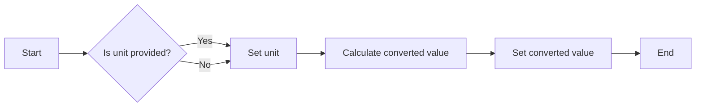

#### 带注释源码

```python
def __init__(self, val, unit=1.0):
    # Set the unit conversion factor
    self.unit = unit
    # Calculate the converted value
    self._val = val * unit
``` 


### Foo.value

`Foo.value` 方法是 `Foo` 类的一个实例方法，用于根据提供的单位转换值。

参数：

- `unit`：`float`，表示转换的单位。如果未提供，则使用实例的 `unit` 属性。

返回值：`float`，转换后的值。

#### 流程图

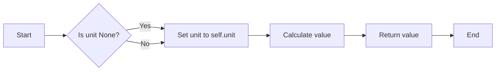

#### 带注释源码

```python
def value(self, unit):
    # If unit is None, use the instance's unit
    if unit is None:
        unit = self.unit
    # Return the converted value
    return self._val / unit
```


### FooConverter.axisinfo

Return the Foo AxisInfo.

参数：

- `unit`：`float`，The unit to be used for the axis.
- `axis`：`matplotlib.axes.Axes`，The axis to which the AxisInfo is applied.

返回值：`matplotlib.units.AxisInfo`，The AxisInfo object for the Foo unit.

#### 流程图

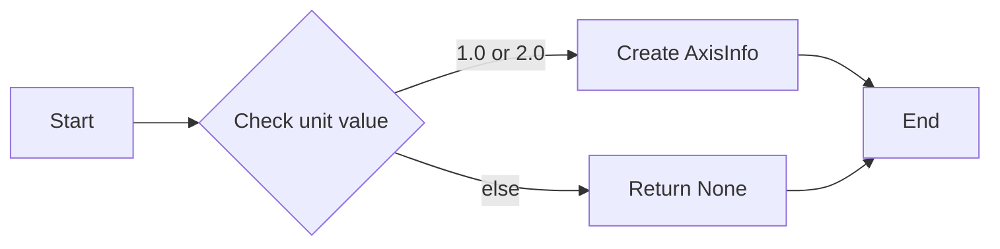

#### 带注释源码

```python
@staticmethod
    def axisinfo(unit, axis):
        """Return the Foo AxisInfo."""
        if unit == 1.0 or unit == 2.0:
            return units.AxisInfo(
                majloc=ticker.IndexLocator(8, 0),
                majfmt=ticker.FormatStrFormatter("VAL: %s"),
                label='foo',
                )
        else:
            return None
``` 


### FooConverter.convert

Convert an object using a specified unit.

参数：

- `obj`：`Foo` 或可迭代对象，表示要转换的对象。
- `unit`：`float`，表示转换的单位。

参数描述：

- `obj`：可以是单个 `Foo` 对象或可迭代对象，例如列表。
- `unit`：指定转换的单位，用于将 `obj` 的值转换为新的单位。

返回值：`float` 或列表，转换后的值。

返回值描述：

- 如果 `obj` 是单个 `Foo` 对象，则返回转换后的浮点数。
- 如果 `obj` 是可迭代对象，则返回转换后的值列表。

#### 流程图

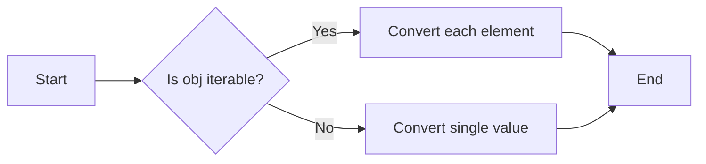

#### 带注释源码

```python
    @staticmethod
    def convert(obj, unit, axis):
        """
        Convert *obj* using *unit*.

        If *obj* is a sequence, return the converted sequence.
        """
        if np.iterable(obj):
            return [o.value(unit) for o in obj]
        else:
            return obj.value(unit)
``` 


### FooConverter.default_units

Return the default unit for *x* or None.

参数：

- `x`：`np.ndarray` 或 `Foo`，The object or sequence of objects to get the default unit from.
- `axis`：`int`，The axis along which to apply the conversion. Default is 0.

返回值：`float` 或 `None`，The default unit for the given object or sequence, or None if not applicable.

#### 流程图

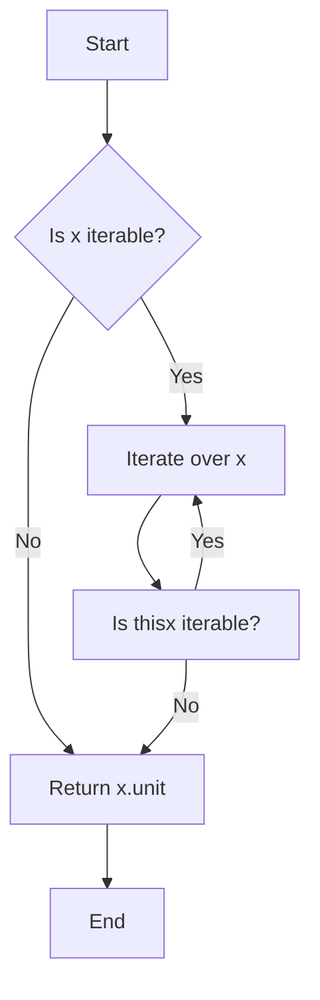

#### 带注释源码

```python
    @staticmethod
    def default_units(x, axis=0):
        """
        Return the default unit for *x* or None.
        """
        if np.iterable(x):
            for thisx in x:
                return thisx.unit
        else:
            return x.unit
``` 


## 关键组件


### 张量索引与惰性加载

张量索引与惰性加载允许在处理大型数据集时，只加载和处理需要的数据部分，从而提高效率。

### 反量化支持

反量化支持使得可以在不同的单位之间进行转换，增强了代码的灵活性和适用性。

### 量化策略

量化策略允许对数值进行量化处理，以适应特定的硬件或性能需求。


## 问题及建议


### 已知问题

-   **全局变量和函数的文档缺失**：代码中使用了全局变量和函数，但没有提供相应的文档说明其用途和功能。
-   **错误处理机制不明确**：代码中没有明确的错误处理机制，例如在`FooConverter`的`convert`方法中，如果传入的对象不是`Foo`实例，将导致未定义行为。
-   **性能优化空间**：在`FooConverter`的`convert`方法中，对于可迭代对象的转换，使用了列表推导式，这可能会在处理大型数据集时造成性能问题。

### 优化建议

-   **添加文档**：为全局变量和函数添加详细的文档说明，包括其用途、参数和返回值。
-   **实现错误处理**：在`FooConverter`的`convert`方法中添加错误处理，确保只有`Foo`实例才能被转换。
-   **性能优化**：考虑使用生成器表达式或其它更高效的数据处理方法来提高`convert`方法的性能。
-   **代码复用**：如果`Foo`类和`FooConverter`类在其他项目中也有使用，可以考虑将它们封装成独立的模块或库，以提高代码的复用性。
-   **测试覆盖率**：增加单元测试来确保代码的稳定性和可靠性。


## 其它


### 设计目标与约束

- 设计目标：实现一个支持单位转换和不同刻度格式的“Foo”单元类，以便在Matplotlib中使用自定义单位。
- 约束条件：确保代码与Matplotlib兼容，并能够处理不同类型的输入数据。

### 错误处理与异常设计

- 异常处理：在`Foo`类的`value`方法中，如果传入的`unit`为`None`，则默认使用当前单位。
- 异常设计：未定义特定的异常处理机制，但应确保所有方法在输入无效时能够优雅地处理。

### 数据流与状态机

- 数据流：数据从用户输入的值和单位开始，通过`Foo`类进行转换，然后通过`FooConverter`类进行单位转换。
- 状态机：没有明确的状态机，但`Foo`类和`FooConverter`类在处理数据时遵循特定的流程。

### 外部依赖与接口契约

- 外部依赖：依赖于Matplotlib库和NumPy库。
- 接口契约：`FooConverter`类实现了`matplotlib.units.ConversionInterface`接口，确保与Matplotlib的兼容性。


    