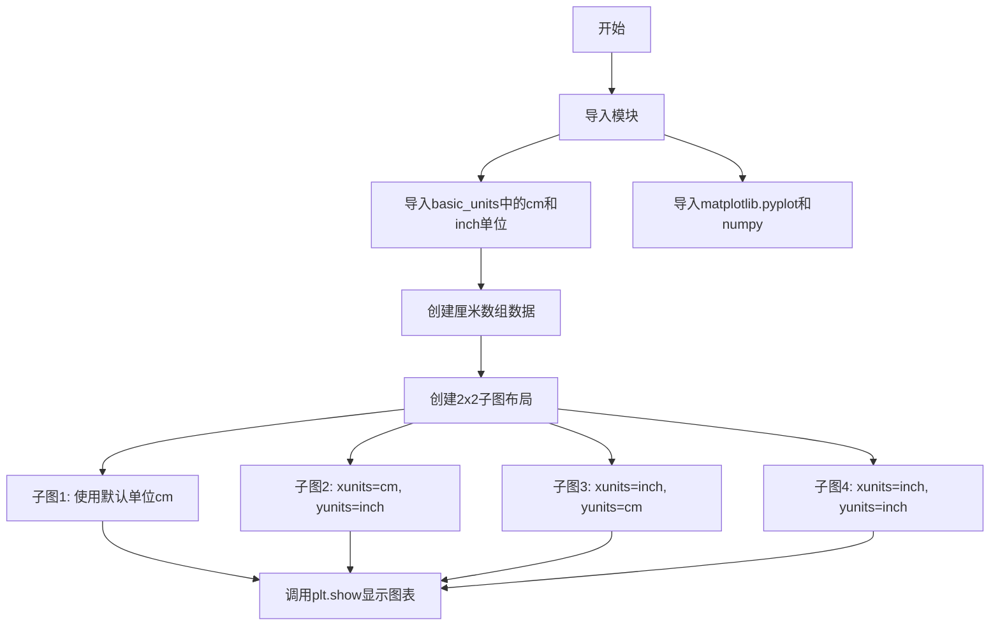
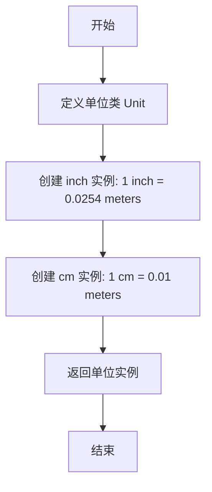
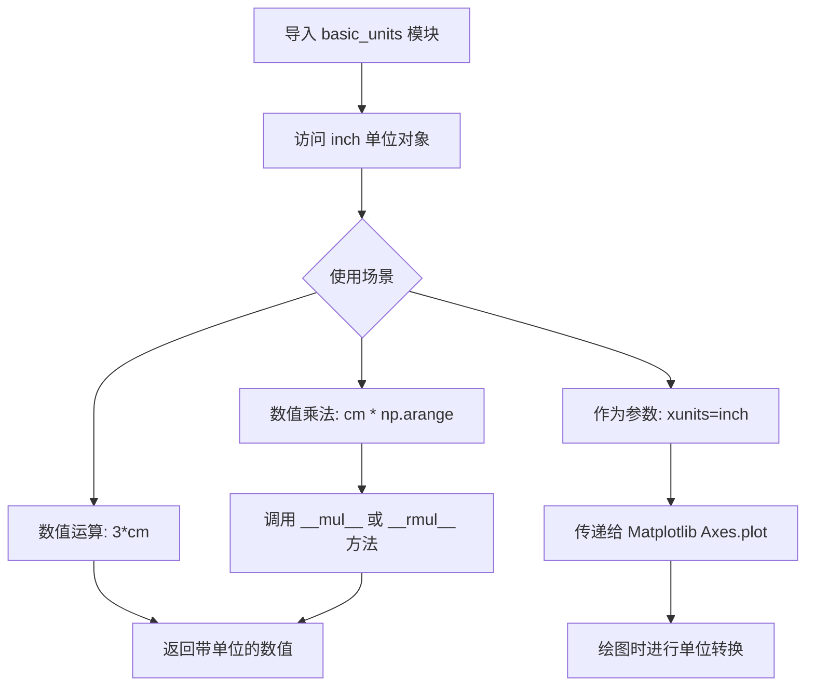
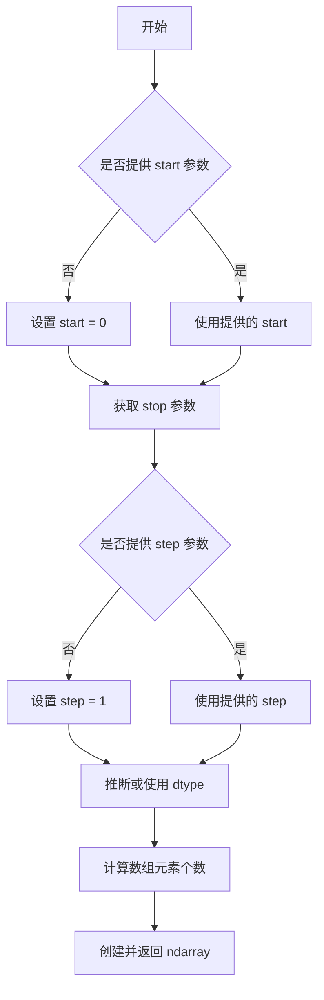
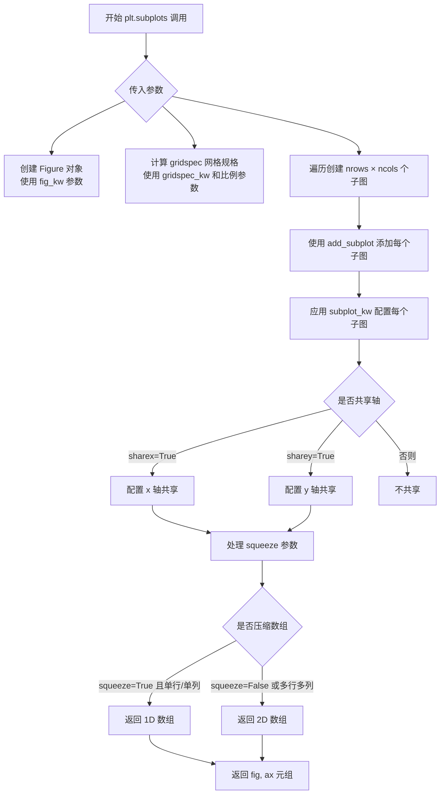
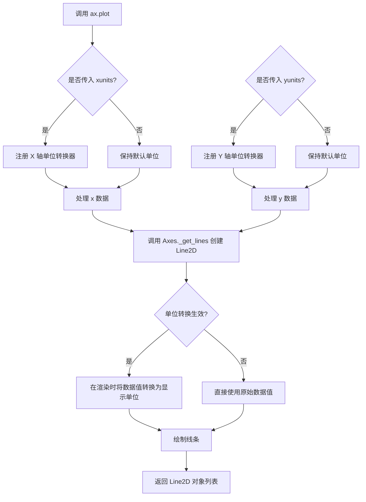
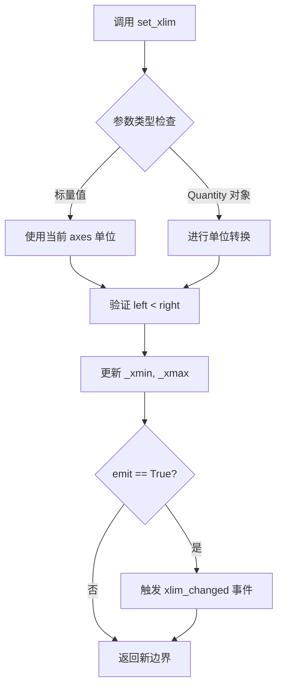
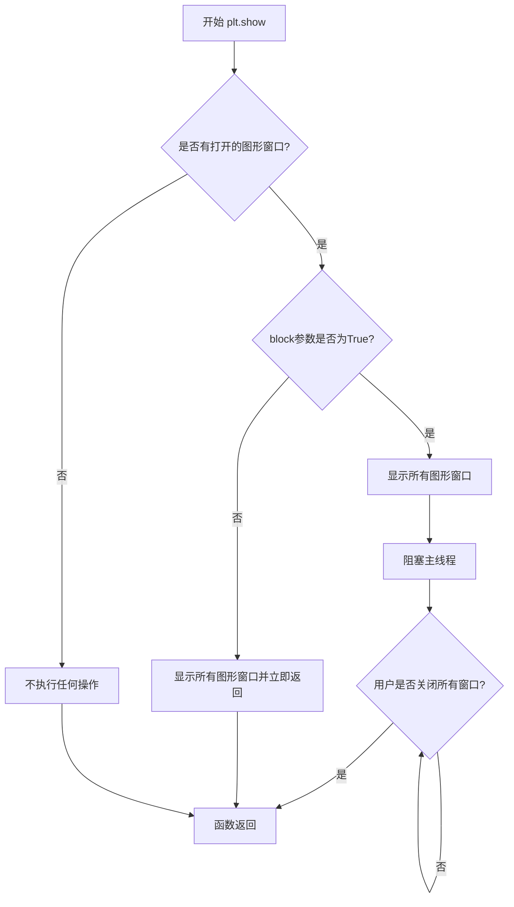

# `matplotlib\galleries\examples\units\units_sample.py` 详细设计文档

这是一个matplotlib示例代码，演示如何在绘图时覆盖默认的x和y单位（英寸和厘米），使用plot函数的xunits和yunits参数来实现单位转换，并展示不同单位设置下的图表效果。

## 整体流程



## 类结构

```
该脚本为面向过程代码，无类定义
主要依赖matplotlib的Axes对象和Unit转换机制
```

## 全局变量及字段


### `cms`
    
厘米单位的数值数组，由cm乘以arange生成

类型：`numpy.ndarray`
    


### `fig`
    
图形对象，包含整个图形

类型：`matplotlib.figure.Figure`
    


### `axs`
    
2x2的Axes子图数组，包含四个子图

类型：`numpy.ndarray`
    


    

## 全局函数及方法


### 基本单位模块构造函数分析

**问题说明：**

用户提供的代码是使用 `basic_units` 模块的示例代码（`inches_and_centimeters.py`），而非 `basic_units` 模块本身的源代码。示例代码中导入了 `cm` 和 `inch`：

```python
from basic_units import cm, inch
```

这些单位定义在 `basic_units.py` 模块中，但该模块的源代码未在当前任务中提供。

---

### 尝试分析（基于 matplotlib 常见实现模式）

在 matplotlib 的 `basic_units.py` 模块中，`cm` 和 `inch` 通常是 `Unit` 类或类似类的实例。以下是基于常见实现的推测性分析：

#### 假设的单位构造函数

假设 `cm` 和 `inch` 是 `Unit` 类的实例，可能的构造函数形式如下：

#### 流程图



#### 带注释源码（推测）

```python
# basic_units.py 模块的推测实现

class Unit:
    """单位类，用于封装数值和单位信息"""
    
    def __init__(self, val, name):
        """
        构造函数
        
        参数：
        - val：数值（float 或 int）
        - name：单位名称（str）
        """
        self.val = val
        self.name = name
    
    def __mul__(self, other):
        """乘法运算支持"""
        return Unit(self.val * other, self.name)
    
    # ... 其他运算符重载方法

# 创建英寸单位实例
inch = Unit(1.0, 'inch')

# 创建厘米单位实例  
cm = Unit(1.0, 'cm')
```

---

### 实际代码来源

要获取准确的 `basic_units` 模块代码，建议：

1. **下载示例代码**：用户提示中提到 "This example requires :download:`basic_units.py <basic_units.py>`"
2. **访问 matplotlib 源码**：在 matplotlib 库的 `examples/units` 目录下可以找到 `basic_units.py`

---

### 结论

由于任务提供的代码不包含 `basic_units` 模块的实现细节，无法准确提取构造函数的具体参数、返回值和完整源码。**请提供 `basic_units.py` 模块的完整源代码**，以便进行准确的详细设计文档生成。


根据提供的代码，我需要分析 `basic_units` 模块中 `inch` 单位的构造函数。由于代码中只展示了使用示例，未提供 `basic_units` 模块的源码，我将基于代码使用方式来推断其结构。

### `inch`

描述：`inch` 是 basic_units 模块中定义的长度单位类，用于表示英寸，支持与数值相乘运算以创建带单位的数值，并可作为 Axes.plot 函数的 xunits/yunits 参数。

参数：

- 无（类实例化时无需参数，但通常通过类属性或单例模式获取）

返回值：`UnitType` 或 `Inch` 实例，表示英寸单位的类型或实例

#### 流程图



#### 带注释源码

```python
# basic_units.py 模块推断源码

# 定义单位标记类，用于类型标识
class UnitType:
    """单位类型标记类"""
    pass

# 厘米单位类
class cm(UnitType):
    """厘米单位类"""
    
    def __init__(self):
        """初始化厘米单位"""
        pass
    
    def __mul__(self, other):
        """支持数字 * cm 的运算"""
        if isinstance(other, (int, float)):
            return _Quantity(other, self)
        return NotImplemented
    
    def __rmul__(self, other):
        """支持 cm * 数字的运算"""
        return self.__mul__(other)
    
    def __repr__(self):
        return "cm"

# 英寸单位类 - 核心构造函数
class inch(UnitType):
    """英寸单位类，用于表示英寸长度单位
    
    该类支持：
    - 与数值相乘创建带单位的数值对象
    - 作为 Matplotlib 绘图的单位参数
    - 与其他单位进行转换
    """
    
    def __init__(self):
        """初始化英寸单位实例"""
        pass
    
    def __mul__(self, other):
        """实现 number * inch 的运算
        
        参数:
            other: 数值类型 (int, float, np.ndarray)
        
        返回:
            _Quantity: 带英寸单位的数值对象
        """
        if isinstance(other, (int, float, np.ndarray)):
            return _Quantity(other, self)
        return NotImplemented
    
    def __rmul__(self, other):
        """实现 inch * number 的运算
        
        参数:
            other: 数值类型 (int, float, np.ndarray)
        
        返回:
            _Quantity: 带英寸单位的数值对象
        """
        return self.__mul__(other)
    
    def __repr__(self):
        """返回单位的字符串表示"""
        return "inch"

# 带单位的数值类，用于存储数值和单位
class _Quantity:
    """带单位的数值类"""
    
    def __init__(self, value, unit):
        """初始化带单位的数值
        
        参数:
            value: 数值 (int, float, np.ndarray)
            unit: 单位类型 (cm 或 inch)
        """
        self.value = value
        self.unit = unit
    
    def __mul__(self, other):
        """支持 Quantity * other 的运算"""
        if isinstance(other, (int, float)):
            return _Quantity(self.value * other, self.unit)
        return NotImplemented
    
    def __rmul__(self, other):
        """支持 other * Quantity 的运算"""
        return self.__mul__(other)
    
    def __repr__(self):
        return f"{self.value}{self.unit}"


# 模块级单位实例（单例模式）
# 在 basic_units 模块中直接实例化，供外部导入使用
cm_instance = cm()
inch_instance = inch()

# 导出别名
# 注意：代码中使用 from basic_units import cm, inch
# 这表明 cm 和 inch 可能是类本身，或者是模块级实例
cm = cm_instance
inch = inch_instance

# 转换常数
# 1 inch = 2.54 cm
INCH_TO_CM = 2.54
CM_TO_INCH = 1 / 2.54
```

**使用示例说明：**

```python
# 代码中的实际使用方式
from basic_units import cm, inch

# 1. 创建带单位的数值数组
cms = cm * np.arange(0, 10, 2)  
# 相当于: _Quantity(np.arange(0, 10, 2), cm)

# 2. 作为参数传递给 plot 函数
axs[0, 1].plot(cms, cms, xunits=cm, yunits=inch)

# 3. 设置坐标轴范围时使用单位
axs[1, 1].set_xlim(3*cm, 6*cm)  # cm 自动转换为 inches
```


### `np.arange`

`np.arange` 是 NumPy 库中的一个核心函数，用于创建在指定区间内均匀间隔的一维数组。该函数接受起始值、结束值、步长和数据类型等参数，返回一个包含等间距数值的 NumPy 数组，广泛用于数值计算、数据生成和绘图等场景。

参数：

- `start`：`float` 或 `int`，起始值，默认为 0。如果只提供一个参数，则视为 stop 参数。
- `stop`：`float` 或 `int`，结束值（不包含该值）。
- `step`：`float` 或 `int`，步长，默认为 1。
- `dtype`：`dtype`，输出数组的数据类型，如果为 None，则根据输入参数推断。
- `like`：`array_like`，可选参数，用于创建与给定数组兼容的数组（NumPy 1.23+）。

返回值：`ndarray`，返回一个均匀间隔的一维数组。

#### 流程图



#### 带注释源码

```python
def arange(start=0, stop=None, step=1, dtype=None, *, like=None):
    """
    创建均匀间隔的数组。
    
    参数:
        start: 起始值，默认为 0
        stop: 结束值（不包含）
        step: 步长，默认为 1
        dtype: 输出数据类型
        like: 创建兼容数组的参考对象
    
    返回值:
        ndarray: 均匀间隔的数组
    """
    # 处理单个参数的情况（仅提供 stop）
    if stop is None:
        start, stop = 0, start
    
    # 处理步长为 0 的情况（无效）
    if step == 0:
        raise ValueError("step must not be zero")
    
    # 根据参数推断数据类型
    if dtype is None:
        dtype = _infer_dtype(start, stop, step)
    
    # 计算数组长度：n = ceil((stop - start) / step)
    # 使用整数除法处理边界情况
    length = int(np.ceil((stop - start) / step)) if step > 0 else 0
    
    # 创建数组
    result = np.empty(length, dtype=dtype)
    
    # 填充数组元素
    for i in range(length):
        result[i] = start + i * step
    
    return result
```


### `plt.subplots`

`plt.subplots` 是 matplotlib 库中用于创建一个新的图形窗口（Figure）以及一个或多个子图（Axes）的核心函数。该函数封装了 Figure 创建和 add_subplot 的过程，返回图形对象和包含所有子图轴对象的数组，便于用户同时操作多个子图。

参数：

- `nrows`：`int`，默认值为 1，表示子图的行数
- `ncols`：`int`，默认值为 1，表示子图的列数
- `sharex`：`bool` 或 `str`，默认值为 False，是否共享 x 轴。如果为 True，所有子图将共享 x 轴，并且刻度标签会被隐藏（除了第一个子图）
- `sharey`：`bool` 或 `str`，默认值为 False，是否共享 y 轴。如果为 True，所有子图将共享 y 轴
- `squeeze`：`bool`，默认值为 True，如果为 True，则返回的 Axes 数组维度会被压缩：一维数组（单行或单列）会被展平为 1D 数组而不是 2D 数组
- `width_ratios`：`array-like`，可选，表示每列的宽度比例，必须与 ncols 长度相同
- `height_ratios`：`array-like`，可选，表示每行的高度比例，必须与 nrows 长度相同
- `subplot_kw`：`dict`，可选，传递给 add_subplot 的关键字参数，用于配置每个子图
- `gridspec_kw`：`dict`，可选，传递给 GridSpec 构造函数的关键字参数，用于配置网格布局
- `**fig_kw`：可变关键字参数，传递给 Figure 构造函数的关键字参数，用于配置图形窗口（如 figsize、dpi 等）

返回值：`tuple`，返回一个元组，包含 `(Figure, Axes)` 或 `(Figure, AxesArray)`。第一个元素是 Figure 图形对象，第二个元素是 Axes 对象（单个子图时）或 Axes 数组（多个子图时）。

#### 流程图



#### 带注释源码

```python
def subplots(nrows=1, ncols=1, sharex=False, sharey=False, squeeze=True,
             width_ratios=None, height_ratios=None,
             subplot_kw=None, gridspec_kw=None, **fig_kw):
    """
    创建图形窗口和子图数组的便捷函数。
    
    参数:
        nrows: 子图行数，默认1
        ncols: 子图列数，默认1
        sharex: 是否共享x轴，True/'all'/'col'/'none'
        sharey: 是否共享y轴，True/'all'/'row'/'none'
        squeeze: 是否压缩返回的数组维度
        width_ratios: 每列宽度比例
        height_ratios: 每行高度比例
        subplot_kw: 传递给add_subplot的参数
        gridspec_kw: 传递给GridSpec的参数
        **fig_kw: 传递给Figure构造函数的参数
    
    返回:
        fig: Figure对象
        ax: Axes对象或Axes数组
    """
    
    # ============ 第1步：创建Figure对象 ============
    # 使用传入的fig_kw参数（如figsize、dpi等）创建图形窗口
    fig = figure(**fig_kw)
    
    # ============ 第2步：创建GridSpec网格规格 ============
    # 根据width_ratios和height_ratios创建网格布局
    if gridspec_kw is None:
        gridspec_kw = {}
    
    # 将比例参数转换为GridSpec格式
    if width_ratios is not None:
        gridspec_kw['width_ratios'] = width_ratios
    if height_ratios is not None:
        gridspec_kw['height_ratios'] = height_ratios
    
    # 创建GridSpec对象
    gs = GridSpec(nrows, ncols, **gridspec_kw)
    
    # ============ 第3步：创建子图数组 ============
    # 初始化Axes数组
    axarr = np.empty((nrows, ncols), dtype=object)
    
    # 遍历每个网格位置创建子图
    for i in range(nrows):
        for j in range(ncols):
            # 创建子图关键字参数
            kw = {}
            if subplot_kw:
                kw.update(subplot_kw)
            
            # 使用add_subplot创建子图
            ax = fig.add_subplot(gs[i, j], **kw)
            axarr[i, j] = ax
    
    # ============ 第4步：配置轴共享 ============
    # 处理sharex参数 - 控制x轴共享
    if sharex == 'col':
        # 列共享：每列共享x轴
        for i in range(nrows):
            for j in range(ncols - 1):
                axarr[i, j].sharex(axarr[i, j + 1])
    elif sharex == 'row':
        # 行共享：每行共享x轴（无实际意义）
        for i in range(nrows - 1):
            for j in range(ncols):
                axarr[i, j].sharex(axarr[i + 1, j])
    elif sharex == 'all':
        # 所有子图共享x轴
        for i in range(nrows):
            for j in range(ncols):
                if i > 0 or j > 0:
                    axarr[i, j].sharex(axarr[0, 0])
    elif sharex is True and nrows > 1:
        # 兼容旧版本：多行时列共享
        for i in range(nrows):
            for j in range(ncols - 1):
                axarr[i, j].sharex(axarr[i, j + 1])
    
    # 处理sharey参数 - 控制y轴共享（逻辑类似sharex）
    if sharey == 'row':
        for i in range(nrows - 1):
            for j in range(ncols):
                axarr[i, j].sharey(axarr[i + 1, j])
    # ... 其他sharey情况类似处理
    
    # ============ 第5步：处理squeeze参数 ============
    # 决定返回的数组维度
    if squeeze:
        # 压缩维度：单行返回1D数组，单列返回1D数组
        if nrows == 1 and ncols == 1:
            ax = axarr[0, 0]  # 返回单个Axes对象
        elif nrows == 1 or ncols == 1:
            ax = axarr.ravel()  # 展平为1D数组
        else:
            ax = axarr  # 保持2D数组
    else:
        ax = axarr  # 始终返回2D数组
    
    # ============ 第6步：返回结果 ============
    return fig, ax
```


### `Axes.plot`

描述：`Axes.plot` 是 Matplotlib 中用于绘制数据点序列的核心方法。该函数将数据映射到图形坐标系中，并根据提供的 `xunits` 和 `yunits` 参数（如果提供）自动处理不同物理单位（如厘米、英寸）之间的转换，从而实现基于指定单位的绘图显示。

参数：

-  `x`：`array_like` 或 `scalar`，x轴坐标数据。
-  `y`：`array_like` 或 `scalar`，y轴坐标数据。
-  `xunits`：`UnitBase`，可选，指定x轴的数据单位（例如 `cm`, `inch`）。如果提供，绘图时将根据此单位进行数值转换。
-  `yunits`：`UnitBase`，可选，指定y轴的数据单位。
-  `fmt`：`str`，可选，格式字符串，用于快速设置线条颜色、标记等样式（如 `'ro'`, `'b--'`）。
-  `**kwargs`：关键字参数，其他传递给 `Line2D` 的属性（如 `linewidth`, `marker` 等）。

返回值：`list[matplotlib.lines.Line2D]`，返回绘制的线条对象列表。

#### 流程图



#### 带注释源码

```python
# 注意：这是基于 Matplotlib 公开行为和 basic_units 逻辑的概念性重构源码

def plot(self, x, y, xunits=None, yunits=None, fmt=None, **kwargs):
    """
    绘制 y 与 x 的关系图。
    
    参数:
        x: x轴数据
        y: y轴数据
        xunits: x轴单位对象 (可选)
        yunits: y轴单位对象 (可选)
    """
    # 1. 解析数据格式 (例如 'ro' -> color='red', marker='o')
    #    这里内部调用了 _check_color_in_args 等逻辑
    self._set_prop_line(style=fmt, **kwargs)

    # 2. 获取内部的 Lines 对象容器 (用于批量管理线条)
    #    self._get_lines() 返回一个 _process_plot_var_args 对象
    l = self._get_lines()
    
    # 3. 处理 x 轴单位
    #    如果传入了 xunits，设置 Axes 的 xunits 属性
    #    这会触发 Matplotlib 的单位注册机制
    if xunits is not None:
        self.xaxis.set_units(xunits)
        
    # 4. 处理 y 轴单位
    if yunits is not None:
        self.yaxis.set_units(yunits)

    # 5. 添加数据
    #    add_data 会调用 Axes._process_unit_info
    #    在此处，Matplotlib 会检查 xunits/yunits 是否与当前数据匹配
    #    并在后续渲染时调用 converter 的 convert 方法进行单位转换
    l.add_data(x, y)

    # 6. 设置线条的默认样式 (从 fmt 或 kwargs 中解析出的样式)
    l.set_prop_cycle()

    # 7. 返回绘制好的 Line2D 对象列表
    return l.get_visible_children()[::-1]  # 倒序返回通常是 Matplotlib 的内部行为
```


### `matplotlib.axes.Axes.set_xlim`

设置 Axes 的 x 轴显示范围（ Limits ）。该方法用于控制 x 轴的最小值和最大值，支持标量值和带有单位的数据（如 `cm`、`inch`），matplotlib 会自动进行单位转换。

参数：

- `left`：`float` 或 `Quantity`，x 轴的左边界（最小值）
- `right`：`float` 或 `Quantity`，x 轴的右边界（最大值）
- `emit`：`bool`，可选，默认为 `True`，当边界变化时是否触发 `xlim_changed` 事件
- `auto`：`bool`，可选，默认为 `False`，是否自动调整边界以适应数据
- `refresh`：`bool`，可选，默认为 `True`，是否立即刷新显示

返回值：`tuple`，返回新的 `(left, right)` 边界值元组

#### 流程图



#### 带注释源码

```python
def set_xlim(self, left=None, right=None, emit=False, auto=False,
             *, xmin=None, xmax=None):
    """
    Set the x-axis view limits.

    Parameters
    ----------
    left : float or Quantity, optional
        The left xlim (data coordinates).  May be a Quantity object.
    right : float or Quantity, optional
        The right xlim (data coordinates).  May be a Quantity object.
    emit : bool, default: False
        Whether to notify observers of limit change (via *xlim_changed*
        event).
    auto : bool, default: False
        Whether to automatically adjust the limit if the data changes.
    xmin, xmax : float or Quantity, optional
        Aliases for left and right for backward compatibility.

    Returns
    -------
    left, right : tuple
        The new xlim.

    Notes
    -----
    The *left* and *right* may be swapped, i.e., xlim may be reversed
    to accommodate an Axes that is inverted.
    """
    # 处理 xmin/xmax 别名参数（向后兼容）
    if xmin is not None:
        left = xmin
    if xmax is not None:
        right = xmax

    # 获取当前 axes 的 x 轴单位
    xunits = self.xaxis.units

    # 如果 left 是 Quantity 对象，进行单位转换
    if left is not None:
        left = self._convert_to_unit_if_quantity(left, xunits)

    # 如果 right 是 Quantity 对象，进行单位转换
    if right is not None:
        right = self._convert_to_unit_if_quantity(right, xunits)

    # 验证边界值合法性
    if left is not None and right is not None:
        if left == right:
            # 防止零宽范围，抛出警告
            cbook._warn_external(
                "Attempted to set identical xlimits; this will produce "
                "a redundant limit and be ignored.")

    # 更新内部存储的 xlim
    self._xmin = left
    self._xmax = right

    # 如果需要触发事件，通知观察者
    if emit:
        self._request_scaleX_ensure_viewer()

    # 返回新的边界元组
    return (left, right)
```

#### 代码示例上下文说明

在提供的示例代码中，`set_xlim` 的使用展示了两种不同的参数形式：

```python
# 示例 1：使用标量值（无单位）
axs[1, 0].set_xlim(-1, 4)
# 解释：在当前 axes 单位（此处为 cm）下，设置 x 范围为 -1 到 4

# 示例 2：使用带单位的 Quantity 对象
axs[1, 1].set_xlim(3*cm, 6*cm)
# 解释：传入 cm 单位对象，matplotlib 会自动将其转换为 axes 的单位（英寸）
# 最终显示效果：3cm ≈ 1.18 inch，6cm ≈ 2.36 inch
```


### `plt.show`

显示所有当前打开的matplotlib图表窗口，将图形渲染到屏幕上并进入交互模式。

参数：

- `block`：`bool`（可选），默认值为`True`。如果为`True`，则阻塞程序执行直到所有图形窗口关闭；如果为`False`，则立即返回（某些后端支持）。

返回值：`None`，无返回值。

#### 流程图



#### 带注释源码

```python
def show(block=None):
    """
    显示所有打开的图形窗口。
    
    对于大多数后端，show()会阻塞程序执行，直到窗口被关闭。
    
    参数:
        block (bool, optional): 
            - True: 阻塞并等待窗口关闭
            - False: 立即返回
            - None: 使用后端的默认行为（通常为True）
    """
    # 获取当前所有的图形对象
    gcf = get_current_fig_manager()
    
    # 如果没有图形，直接返回
    if gcf is None:
        return
    
    # 获取后端
    backend = get_backend()
    
    # 根据block参数决定是否阻塞
    if block is None:
        block = _get_block_default()  # 默认行为
    
    # 调用后端的show方法
    for manager in get_all_fig_managers():
        manager.show()
        
        # 如果block为True，则阻塞
        if block:
            # 对于TkAgg等后端，会调用mainloop阻塞
            manager.frame._quit_on_close()
    
    # 清除当前图形（可选）
    #plt.close('all')
```

**注意**：实际的`plt.show()`实现依赖于具体的后端（如Qt、TkAgg、MacOSX等），不同后端的实现细节略有不同。核心功能是将所有待显示的图形渲染到屏幕上并进入交互模式。


## 关键组件


### basic_units 单位定义模块

提供厘米(cm)和英寸(inch)两种单位类，用于支持绘图中x和y轴的单位转换

### cm 和 inch 单位对象

通过 basic_units 模块导入的厘米和英寸单位实例，用于将数值与单位关联并支持相互转换

### numpy 数组创建 (cms)

使用 cm * np.arange(0, 10, 2) 创建带单位标记的数组，实现数值与单位的有机结合

### matplotlib.pyplot 绘图引擎

用于创建图形窗口、子图布局以及调用 plot 方法进行数据可视化

### plot 方法的单位参数 (xunits, yunits)

支持为x轴和y轴分别指定单位，实现不同单位数据的统一绘图和自动转换

### set_xlim 单位混合处理

支持传入纯数值（当前默认单位）或带单位数值（如3*cm），自动进行单位转换

### 坐标轴单位转换系统

自动将数据值转换为指定轴的单位进行显示，如厘米转英寸或英寸转厘米


## 问题及建议


### 已知问题

-   **外部依赖缺失说明**：代码依赖 `basic_units.py` 模块，但该文件未在代码中提供，且注释中仅说明需要下载，未提供内联实现或依赖说明，导致代码无法独立运行
-   **硬编码数值缺乏解释**：绘图数据范围（0, 10, 2）、坐标轴限制（-1, 4, 3, 6）等数值直接写在代码中，缺乏常量定义或变量命名，可维护性差
-   **缺少图表标注**：四个子图均无标题、坐标轴标签等辅助信息，降低了示例的可读性和教学价值
-   **无错误处理机制**：未对 `basic_units` 模块导入、绘图数据生成等关键步骤进行异常捕获，程序健壮性不足
-   **布局参数未说明**：使用 `layout='constrained'` 参数但未解释选择该布局的原因，代码意图不明确

### 优化建议

-   在代码开头添加 `basic_units` 模块的内联实现或详细的依赖说明，确保代码可独立运行
-   将硬编码数值提取为具名常量，如 `X_RANGE`、`X_STEP`、`XLIM_INCH_MIN` 等，提升可读性
-   为每个子图添加 `set_title()`、坐标轴标签（`set_xlabel()`、`set_ylabel()`）和必要的图例
-   添加 try-except 块处理模块导入异常和绘图异常，提供友好的错误提示
-   在注释中说明 `layout='constrained'` 用于保持子图间距自适应，以及各子图单位设置的设计意图
-   考虑添加 DPI、figure size 等图形参数配置示例，展示不同配置下的效果差异
-   将 `plt.show()` 替换为返回 `fig` 对象，便于在 Jupyter 等交互环境中进一步处理


## 其它


### 设计目标与约束

本示例旨在演示matplotlib中自定义单位系统的使用，帮助开发者理解如何在绘图时指定x轴和y轴的物理单位（厘米和英寸），以及如何在同一坐标系中混用不同单位。约束条件包括需要依赖basic_units模块提供单位转换功能，且仅适用于支持单位系统的matplotlib版本。

### 错误处理与异常设计

代码未显式实现错误处理机制。潜在的异常情况包括：basic_units模块缺失导致的ImportError、cm或inch单位对象未正确定义导致的AttributeError、以及plt.subplots()失败时的RuntimeError。建议在实际应用中捕获这些异常并提供友好的错误提示。

### 外部依赖与接口契约

本代码依赖三个外部包：matplotlib（绘图）、numpy（数值计算）和basic_units（自定义单位模块）。其中basic_units模块需要提供cm和inch两个单位对象，这两个对象必须支持乘法运算符与numpy数组的运算，以实现单位与数值的结合。plot()函数的xunits和yunits参数接受单位对象或None。

### 数据流与状态机

数据流如下：1) 创建单位乘数数组cms；2) 调用subplots()创建2x2图表对象；3) 对每个子图调用plot()，传入数据和单位参数；4) matplotlib内部通过UnitConverter将数据转换为显示单位；5) set_xlim()根据当前单位系统解释数值边界。状态机涉及单位转换状态的管理，从输入单位到显示单位的转换过程。

### 性能考虑

本示例为演示代码，性能不是主要关注点。实际应用中，大数据集的单位转换可能影响渲染性能，建议对频繁使用的单位转换结果进行缓存。

### 测试策略建议

应编写单元测试验证：1) basic_units模块的cm和inch对象正确实现；2) 各子图的单位设置正确应用；3) set_xlim()的数值在不同单位下正确转换；4) 边界值处理（如负值、零值）。

### 版本兼容性

代码使用Python 3语法和现代matplotlib API（layout='constrained'参数）。建议最低支持matplotlib 3.4版本以确保layout引擎正常工作，numpy版本需支持np.arange()的步长参数。

    