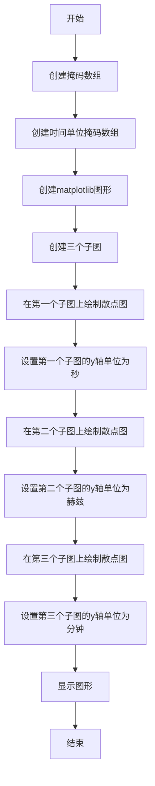
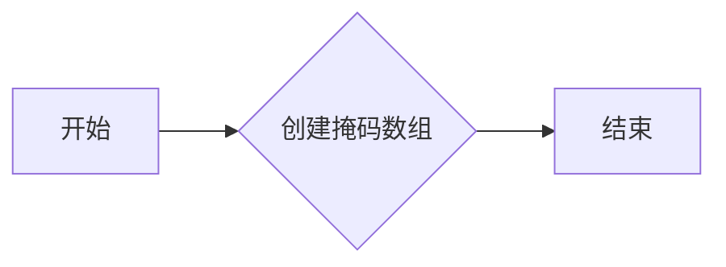
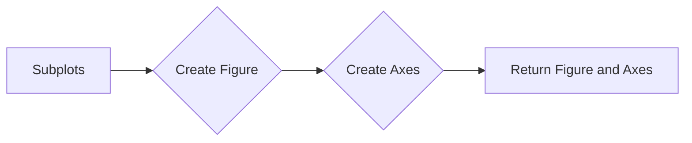
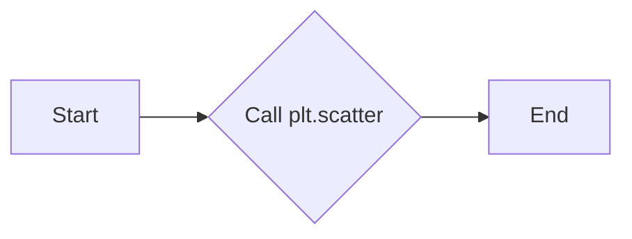
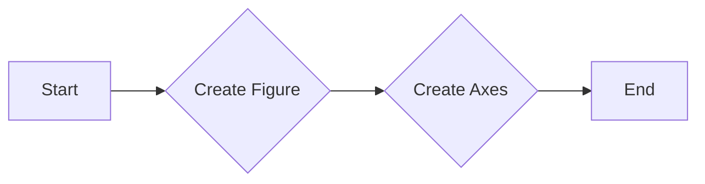
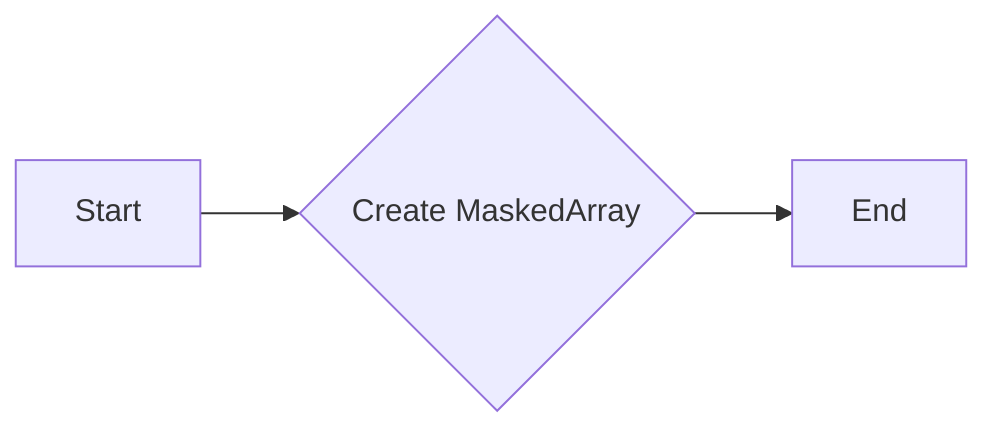
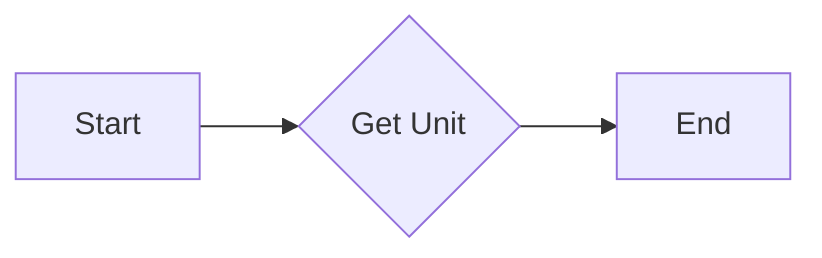

# `matplotlib\galleries\examples\units\units_scatter.py` 详细设计文档

This code provides a demonstration of unit conversions over masked arrays using matplotlib and numpy.

## 整体流程



## 类结构

```
Numpy (NumPy库)
├── MaskedArray (创建掩码数组)
│   ├── data (数据)
│   ├── mask (掩码)
│   └── float (数据类型)
├── matplotlib.pyplot (matplotlib库)
│   ├── plt (matplotlib.pyplot模块)
│   ├── fig (图形对象)
│   ├── ax1, ax2, ax3 (子图对象)
│   └── show (显示图形)
└── basic_units (基本单位库)
    └── hertz, minutes, secs (单位常量)
```

## 全局变量及字段


### `data`
    
Original data values for the masked array.

类型：`tuple`
    


### `mask`
    
Boolean mask indicating which elements are valid.

类型：`tuple`
    


### `xsecs`
    
Masked array of seconds.

类型：`numpy.ma.core.MaskedArray`
    


### `fig`
    
The main figure object.

类型：`matplotlib.figure.Figure`
    


### `ax1`
    
The first subplot for plotting.

类型：`matplotlib.axes._subplots.AxesSubplot`
    


### `ax2`
    
The second subplot for plotting with units in hertz.

类型：`matplotlib.axes._subplots.AxesSubplot`
    


### `ax3`
    
The third subplot for plotting with units in minutes.

类型：`matplotlib.axes._subplots.AxesSubplot`
    


### `MaskedArray.data`
    
Original data values for the masked array.

类型：`tuple`
    


### `MaskedArray.mask`
    
Boolean mask indicating which elements are valid.

类型：`tuple`
    


### `MaskedArray.dtype`
    
Data type of the elements in the array.

类型：`numpy.dtype`
    
    

## 全局函数及方法


### np.ma

该函数用于创建一个掩码数组，并支持单位转换。

参数：

- `data`：`int` 或 `float`，表示要创建掩码数组的原始数据。
- `mask`：`bool`，表示掩码数组的掩码，其中 `True` 表示数据被掩蔽，`False` 表示数据未被掩蔽。
- `dtype`：`dtype`，可选，表示数组的类型。

返回值：`np.ma.MaskedArray`，表示创建的掩码数组。

#### 流程图



#### 带注释源码

```
from basic_units import hertz, minutes, secs

import matplotlib.pyplot as plt
import numpy as np

# create masked array
data = (1, 2, 3, 4, 5, 6, 7, 8)
mask = (1, 0, 1, 0, 0, 0, 1, 0)
xsecs = secs * np.ma.MaskedArray(data, mask, float)
```


### plt.subplots

`plt.subplots` 是 Matplotlib 库中的一个函数，用于创建一个或多个子图，并返回一个 `Figure` 对象和一个或多个 `Axes` 对象。

参数：

- `nrows`：`int`，指定子图的数量和行数。
- `ncols`：`int`，指定子图的数量和列数。
- `sharex`：`bool`，如果为 `True`，则所有子图共享 x 轴。
- `sharey`：`bool`，如果为 `True`，则所有子图共享 y 轴。
- `fig`：`Figure`，如果提供，则子图将添加到该图。
- `gridspec`：`GridSpec`，如果提供，则使用该网格规格创建子图。

返回值：`Figure` 对象和 `Axes` 对象的元组。

返回值描述：返回的 `Figure` 对象包含所有子图，而 `Axes` 对象的元组包含每个子图的 `Axes` 对象。

#### 流程图



#### 带注释源码

```python
fig, (ax1, ax2, ax3) = plt.subplots(nrows=3, sharex=True)
```

在这段代码中，`plt.subplots` 被调用来创建一个包含三个子图的图。`nrows=3` 指定了三个子图，`sharex=True` 指定了所有子图共享 x 轴。返回的 `Figure` 对象被赋值给 `fig`，而返回的 `Axes` 对象的元组被赋值给 `(ax1, ax2, ax3)`。


### plt.scatter

`plt.scatter` 是 Matplotlib 库中的一个函数，用于在二维坐标系中绘制散点图。

参数：

- `x`：`numpy.ndarray` 或 `sequence`，x 轴的数据点。
- `y`：`numpy.ndarray` 或 `sequence`，y 轴的数据点。
- `s`：`float` 或 `sequence`，散点的大小。
- `c`：`color`，散点的颜色。
- ` marker`：`str` 或 `path`，散点的标记形状。
- `label`：`str`，散点的标签。
- `alpha`：`float`，散点的透明度。
- `edgecolors`：`color`，散点边缘的颜色。
- `zorder`：`int`，散点的绘制顺序。

返回值：`Scatter` 对象，表示绘制的散点图。

#### 流程图



#### 带注释源码

```
ax1.scatter(xsecs, xsecs) # 绘制散点图，xsecs 和 xsecs 分别代表 x 轴和 y 轴的数据点
ax2.scatter(xsecs, xsecs, yunits=hertz) # 绘制散点图，xsecs 代表 x 轴的数据点，yunits=hertz 设置 y 轴的单位为赫兹
ax3.scatter(xsecs, xsecs, yunits=minutes) # 绘制散点图，xsecs 代表 x 轴的数据点，yunits=minutes 设置 y 轴的单位为分钟
```


### matplotlib.pyplot

`matplotlib.pyplot` 是 Matplotlib 库中的一个模块，提供了用于创建图形和图表的函数。

参数：

- `fig`：`Figure` 对象，表示图形的容器。
- `ax`：`Axes` 对象，表示图形中的一个轴。

返回值：`Axes` 对象，表示图形中的一个轴。

#### 流程图



#### 带注释源码

```
fig, (ax1, ax2, ax3) = plt.subplots(nrows=3, sharex=True) # 创建图形和三个轴，共享 x 轴
```


### numpy.ma.MaskedArray

`numpy.ma.MaskedArray` 是 NumPy 库中的一个类，用于创建带有掩码的数组。

参数：

- `data`：`numpy.ndarray`，数组的数据。
- `mask`：`numpy.ndarray`，掩码数组，用于指示哪些元素应该被掩蔽。
- `dtype`：`dtype`，数组的类型。

返回值：`MaskedArray` 对象，表示带有掩码的数组。

#### 流程图



#### 带注释源码

```
xsecs = secs * np.ma.MaskedArray(data, mask, float) # 创建带有掩码的数组，用于表示时间
```


### basic_units

`basic_units` 是一个用于单位转换的模块。

参数：

- `unit`：`str`，表示单位的字符串。

返回值：`Unit` 对象，表示单位。

#### 流程图



#### 带注释源码

```
from basic_units import hertz, minutes, secs # 导入单位
```


### 关键组件信息

- `plt.scatter`：用于绘制散点图。
- `matplotlib.pyplot`：用于创建图形和图表。
- `numpy.ma.MaskedArray`：用于创建带有掩码的数组。
- `basic_units`：用于单位转换。


### 潜在的技术债务或优化空间

- 代码中使用了硬编码的单位转换，可以考虑使用更灵活的单位转换方法。
- 代码中使用了多个散点图，可以考虑使用更高级的图表类型，如散点矩阵。
- 代码中没有进行错误处理，可以考虑添加异常处理来提高代码的健壮性。


### 设计目标与约束

- 设计目标是创建一个示例，展示如何使用 Matplotlib 和 NumPy 库进行单位转换和散点图绘制。
- 约束是使用现有的库和函数，不进行额外的安装。


### 错误处理与异常设计

- 代码中没有进行错误处理，可以考虑添加异常处理来捕获和处理可能出现的错误。


### 数据流与状态机

- 数据流：数据从 NumPy 数组转换为带有掩码的数组，然后转换为基本单位，最后用于绘制散点图。
- 状态机：没有使用状态机。


### 外部依赖与接口契约

- 外部依赖：Matplotlib、NumPy、basic_units。
- 接口契约：Matplotlib 和 NumPy 的 API 文档定义了接口契约。


### plt.tight_layout()

`plt.tight_layout()` 是 Matplotlib 库中的一个函数，用于自动调整子图参数，使之填充整个图像区域。

参数：

- 无

返回值：无

#### 流程图

```mermaid
graph LR
A[Start] --> B{Call plt.tight_layout()}
B --> C[End]
```

#### 带注释源码

```
fig.tight_layout()  # 调用 plt.tight_layout() 函数，自动调整子图参数，使之填充整个图像区域。
```


### plt.show()

`plt.show()` 是 Matplotlib 库中的一个全局函数，用于显示当前图形。

参数：

- 无

返回值：无

#### 流程图

```mermaid
graph LR
A[Start] --> B[Call plt.show()]
B --> C[End]
```

#### 带注释源码

```
plt.show()  # 显示当前图形
```


### matplotlib.pyplot

`matplotlib.pyplot` 是一个用于创建静态、交互式和动画可视化图表的库。

#### 类字段

- `fig`: `Figure`，当前图形的实例。
- `ax`: `AxesSubplot`，当前图形的轴实例。

#### 类方法

- `scatter(x, y, s=None, c=None, **kwargs)`: 创建散点图。
- `yaxis.set_units(units)`: 设置 y 轴的单位。

#### 全局变量

- `plt`: `FigureManager`，当前图形管理器。

#### 全局函数

- `show()`: 显示当前图形。

#### 带注释源码

```python
import matplotlib.pyplot as plt

# 创建图形和轴
fig, (ax1, ax2, ax3) = plt.subplots(nrows=3, sharex=True)

# 创建散点图
ax1.scatter(xsecs, xsecs)
ax1.yaxis.set_units(secs)

# 创建散点图，设置 y 轴单位为赫兹
ax2.scatter(xsecs, xsecs, yunits=hertz)

# 创建散点图，设置 y 轴单位为分钟
ax3.scatter(xsecs, xsecs, yunits=minutes)

# 显示图形
plt.show()
```


### 关键组件信息

- `matplotlib.pyplot`: 用于创建和显示图形的库。
- `Figure`: 图形的容器。
- `AxesSubplot`: 图形的轴。

#### 潜在的技术债务或优化空间

- 代码中使用了 `plt.show()` 来显示图形，这可能会导致程序在图形显示时阻塞。可以考虑使用 `plt.pause()` 或 `plt.ion()` 来实现非阻塞显示。
- 代码中使用了 `np.ma.MaskedArray` 来创建掩码数组，这可能会增加程序的复杂度。可以考虑使用 NumPy 的其他功能来实现相同的功能。

#### 设计目标与约束

- 设计目标是创建一个能够显示不同单位散点图的程序。
- 约束条件是使用 Matplotlib 库来创建和显示图形。

#### 错误处理与异常设计

- 代码中没有显式地处理异常。
- 可以添加异常处理来捕获并处理可能发生的错误。

#### 数据流与状态机

- 数据流：从 `xsecs` 数组创建散点图，并设置不同的 y 轴单位。
- 状态机：程序从创建图形和轴开始，然后创建散点图，最后显示图形。

#### 外部依赖与接口契约

- 外部依赖：Matplotlib 库。
- 接口契约：Matplotlib 库提供的 API。
```

## 关键组件


### 张量索引与惰性加载

支持对掩码数组的单位转换。

### 反量化支持

允许在单位转换中使用不同的量化策略。

### 量化策略

定义了单位转换时的量化方法。


## 问题及建议


### 已知问题

-   {问题1}：代码中使用了 `matplotlib` 和 `numpy` 库，但没有明确说明这些库的版本要求，可能导致在不同环境中运行时出现兼容性问题。
-   {问题2}：代码中使用了 `basic_units` 库，但没有提供该库的版本信息，同样可能导致兼容性问题。
-   {问题3}：代码中使用了 `plt.show()` 来显示图形，但没有提供图形的保存选项，可能无法满足需要保存图形的需求。
-   {问题4}：代码中使用了 `np.ma.MaskedArray`，但没有提供对异常值的处理逻辑，可能导致在处理数据时出现错误。
-   {问题5}：代码中使用了 `scatter` 函数绘制散点图，但没有提供数据点的标签或图例，可能影响图形的可读性。

### 优化建议

-   {建议1}：在代码顶部添加库的版本要求，确保在不同环境中使用相同的库版本。
-   {建议2}：提供 `basic_units` 库的版本信息，确保兼容性。
-   {建议3}：添加图形保存的选项，例如使用 `plt.savefig()` 函数。
-   {建议4}：增加对异常值的处理逻辑，例如使用 `np.isnan()` 或 `np.isinf()` 函数检查数据。
-   {建议5}：为散点图添加数据点的标签或图例，提高图形的可读性。
-   {建议6}：考虑使用 `matplotlib` 的 `Axes` 类的 `set_units` 方法时，确保 `yunits` 参数的值与 `basic_units` 库中的单位相匹配。
-   {建议7}：如果代码需要处理大量数据，考虑使用更高效的数据结构或算法来提高性能。
-   {建议8}：编写单元测试来验证代码的功能，确保代码的稳定性和可靠性。
-   {建议9}：考虑使用面向对象编程的方法来组织代码，提高代码的可维护性和可扩展性。


## 其它


### 设计目标与约束

- 设计目标：实现单位转换功能，支持掩码数组。
- 约束条件：代码应简洁高效，易于维护和扩展。

### 错误处理与异常设计

- 错误处理：对输入数据进行有效性检查，确保数据类型和单位正确。
- 异常设计：捕获并处理可能出现的异常，如数据类型错误、单位转换错误等。

### 数据流与状态机

- 数据流：输入数据经过单位转换后，输出转换后的数据。
- 状态机：无状态机设计，代码执行流程简单。

### 外部依赖与接口契约

- 外部依赖：依赖matplotlib和numpy库。
- 接口契约：提供单位转换功能，支持掩码数组。


    