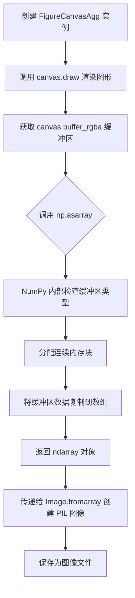
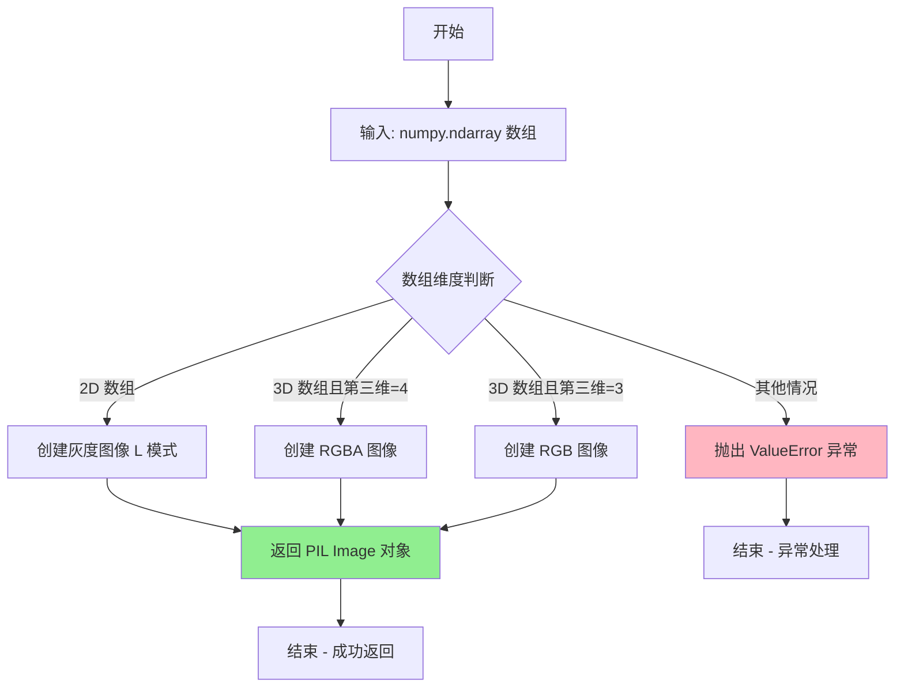
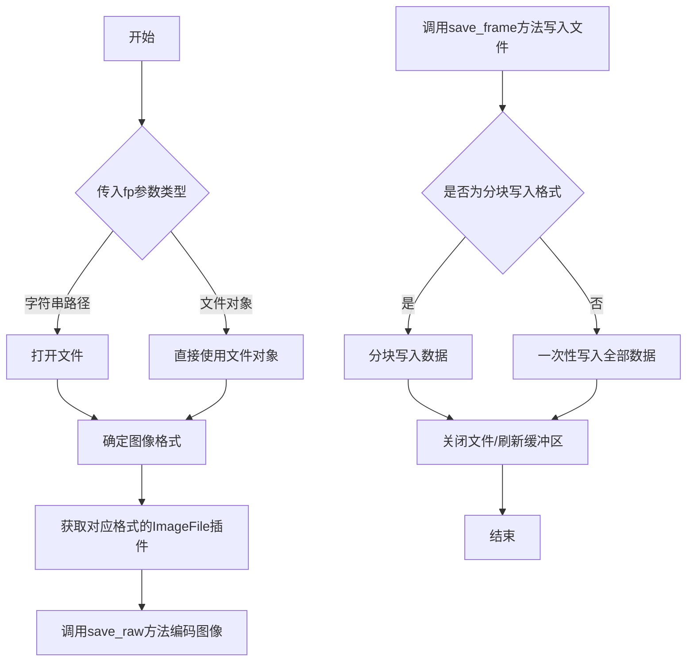
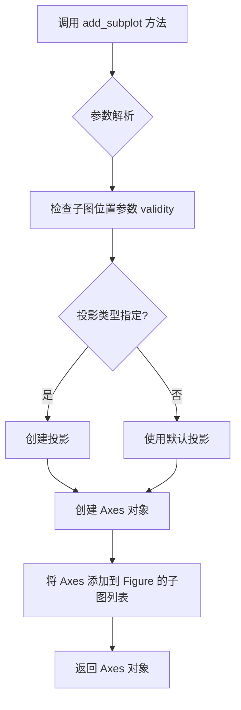
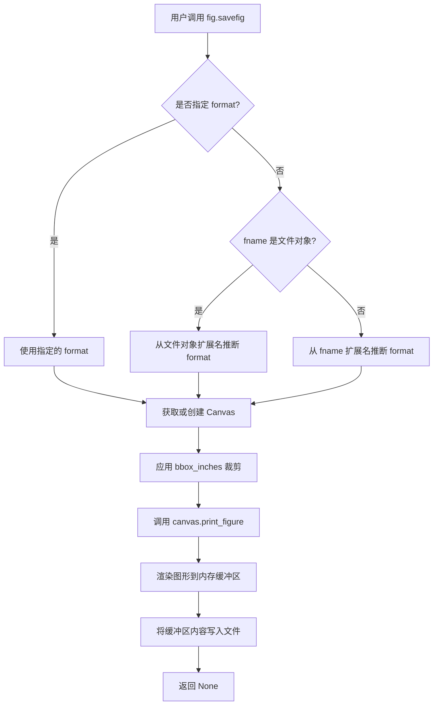
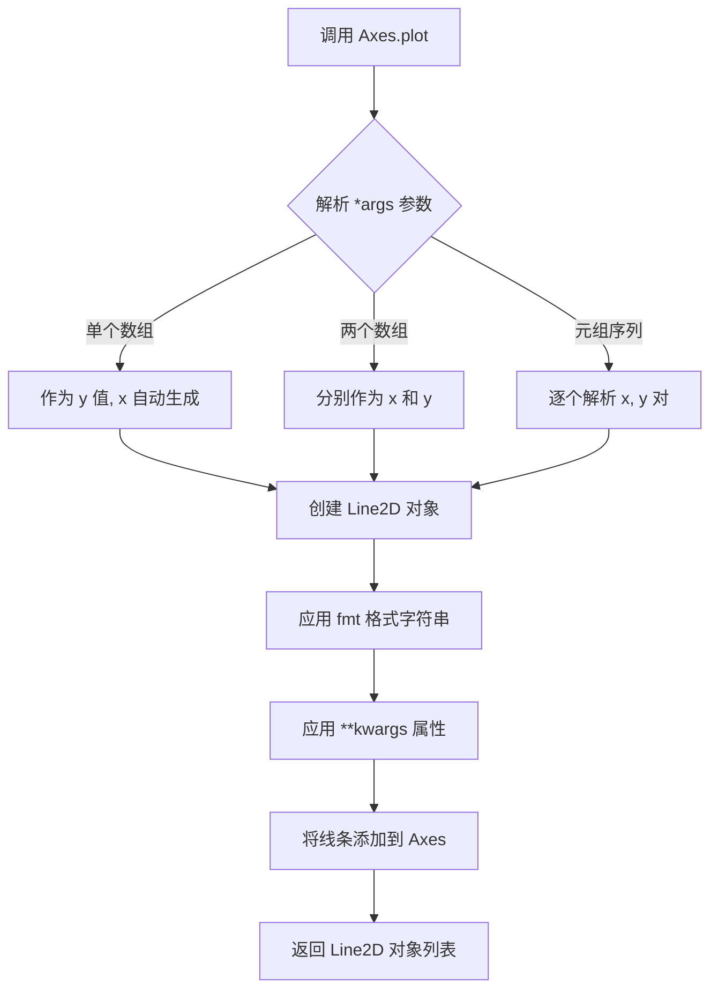
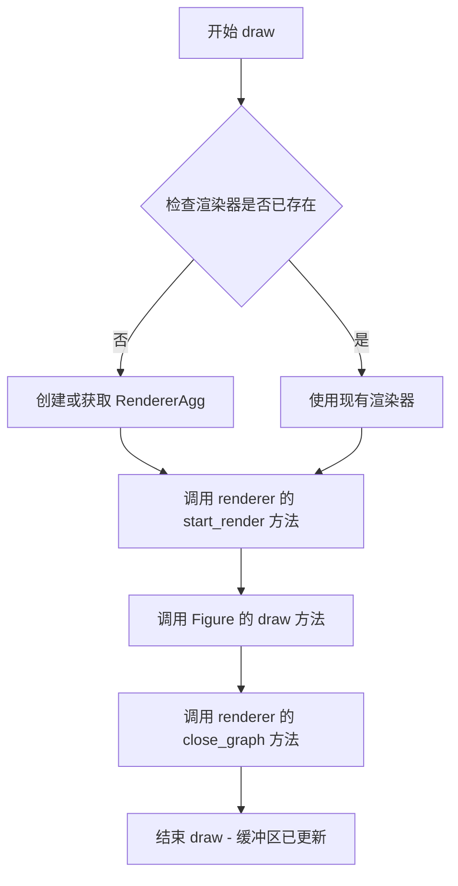
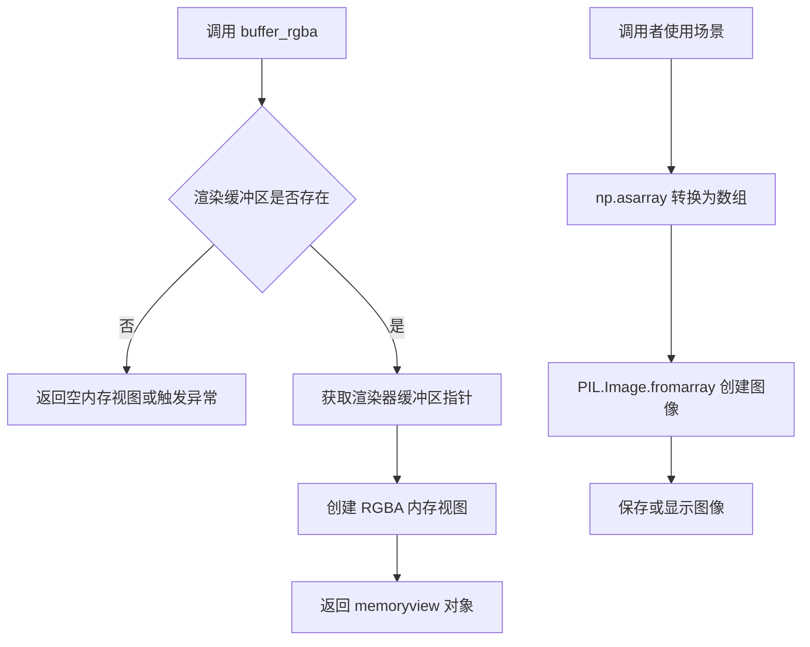
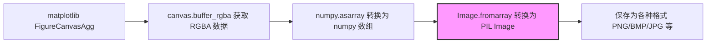
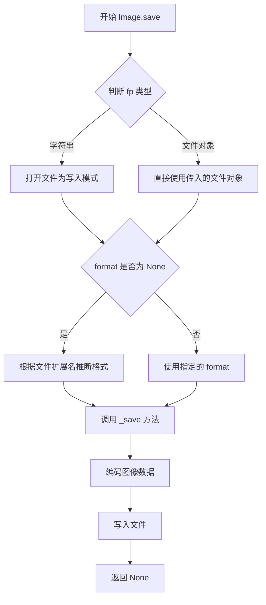

# `matplotlib\galleries\examples\user_interfaces\canvasagg.py` 详细设计文档

该代码演示了如何使用 Matplotlib 的 Agg 后端直接创建图像，无需图形界面即可生成图片并保存为文件或转换为 numpy 数组供 PIL 使用，适用于 Web 应用或 CGI 脚本场景。

## 整体流程

```mermaid
graph TD
A[开始] --> B[创建 Figure 对象<br>figsize=(5,4), dpi=100]
B --> C[添加子图 Axes<br>ax = fig.add_subplot()]
C --> D[绘制数据<br>ax.plot([1, 2, 3])]
D --> E{选择保存方式}
E -- 方式1: 保存到文件 --> F[调用 fig.savefig('test.png')]
E -- 方式2: 保存到数组 --> G[创建 FigureCanvasAgg 画布]
G --> H[调用 canvas.draw() 渲染]
H --> I[获取 RGBA 缓冲区<br>canvas.buffer_rgba()]
I --> J[转换为 numpy 数组<br>np.asarray(buffer)]
J --> K[使用 PIL 创建图像<br>Image.fromarray(rgba)]
K --> L[保存为任意格式<br>im.save('test.bmp')]
F --> M[结束]
L --> M
```

## 类结构

```
FigureCanvasAgg (matplotlib.backends.backend_agg)
└── BufferMethods (继承关系)

Figure (matplotlib.figure)
└── Axes (通过 add_subplot() 创建)

Image (PIL)
└── ImageShow (支持模块)
```

## 全局变量及字段


### `fig`
    
Matplotlib 图形对象

类型：`Figure`
    


### `ax`
    
子图/坐标轴对象

类型：`Axes`
    


### `canvas`
    
Agg 后端画布

类型：`FigureCanvasAgg`
    


### `rgba`
    
RGBA 颜色数据数组

类型：`np.ndarray`
    


### `im`
    
PIL 图像对象

类型：`Image.Image`
    


### `Figure.figsize`
    
图形尺寸 (宽, 高) 英寸

类型：`tuple[float, float]`
    


### `Figure.dpi`
    
每英寸点数，分辨率

类型：`int`
    


### `FigureCanvasAgg.figure`
    
关联的图形对象

类型：`Figure`
    
    

## 全局函数及方法


### `np.asarray`

将缓冲区对象转换为 NumPy 数组。该函数是 NumPy 库的核心函数之一，在此代码中用于将 matplotlib 后端的 RGBA 像素缓冲区转换为可直接操作的 NumPy 数组，以便后续传递给 Pillow 进行图像保存或进一步处理。

参数：

- `buffer`：`buffer interface`，从 `FigureCanvasAgg.buffer_rgba()` 返回的缓冲区对象，包含原始 RGBA 像素数据

返回值：`numpy.ndarray`，返回包含 RGBA 通道数据的 NumPy 数组，形状为 (height, width, 4)，数据类型通常为无符号整型 (uint8)

#### 流程图



#### 带注释源码

```python
# 从 matplotlib.backends.backend_agg 获取 FigureCanvasAgg 类
from matplotlib.backends.backend_agg import FigureCanvasAgg
# 导入 numpy 用于数组操作
import numpy as np
# 导入 PIL 用于图像处理
from PIL import Image

# 创建图形对象，大小 5x4 英寸，分辨率 100 DPI
fig = FigureCanvasAgg(fig)

# 步骤1: 创建画布并绘制图形
# ========================
canvas = FigureCanvasAgg(fig)  # 实例化 Agg 后端画布，关联到图形对象
canvas.draw()                   # 执行渲染，将图形绘制到内存缓冲区

# 步骤2: 获取 RGBA 缓冲区
# ========================
# buffer_rgba() 返回一个缓冲区对象（buffer interface）
# 该缓冲区直接映射到渲染器内部的像素内存区域
buffer = canvas.buffer_rgba()  # <--- 返回类型: buffer interface (Py_buffer)

# 步骤3: 使用 np.asarray 转换为 NumPy 数组
# =========================================
# np.asarray 会检测输入是否为缓冲区接口
# 自动分配适当的 NumPy 数组结构
# 并将数据从缓冲区复制到连续的 NumPy 数组内存中
#
# 参数解析:
#   - input: buffer 对象（必须支持 buffer protocol）
#   - dtype: 可选，默认从缓冲区内容推断（通常为 uint8）
#   - order: 可选，C 或 Fortran 内存顺序
#
# 内部实现逻辑:
#   1. 检查输入是否已为 ndarray，若是则直接返回（除非指定 dtype）
#   2. 检查是否支持 buffer protocol
#   3. 获取缓冲区信息（shape, strides, format 等）
#   4. 创建新的 ndarray 并复制数据
rgba = np.asarray(buffer)       # <--- 核心转换操作

# 步骤4: 验证转换结果
# ===================
# 转换后的数组属性:
#   - ndim: 3 (height, width, channels)
#   - shape: (height, width, 4) 表示 RGBA 四个通道
#   - dtype: uint8 (0-255 范围)
#   - flags: C_CONTIGUOUS 为 True（保证内存连续）

# 步骤5: 传递给 Pillow 处理
# =========================
# 使用 PIL 的 Image.fromarray 将 NumPy 数组转回 PIL Image
# 这是一个零拷贝操作（共享底层数据），但在某些情况下可能复制数据
im = Image.fromarray(rgba)       # 创建 PIL Image 对象

# 保存为 BMP 格式
im.save("test.bmp")              # 输出最终图像文件
```


### `Image.fromarray`

将 numpy 数组转换为 PIL（Python Imaging Library）图像对象。该函数是 Python 图像处理生态中的关键桥梁，允许在 matplotlib、numpy 等科学计算库与 PIL 图像库之间进行无缝数据转换，常用于 Web 应用中无需写入磁盘的图像生成、图像处理流水线以及科学可视化结果的导出。

参数：

- `obj`：`numpy.ndarray`，输入的 numpy 数组，通常为 RGBA（4通道）或 RGB（3通道）格式的图像像素数据

返回值：`PIL.Image.Image`，返回 PIL 图像对象，可直接调用 save()、show() 等方法进行保存或显示

#### 流程图



#### 带注释源码

```python
# 从 matplotlib 的 agg 画布获取 RGBA 格式的 numpy 数组
# canvas.buffer_rgba() 返回一个内存视图，np.asarray 将其转换为 numpy 数组
rgba = np.asarray(canvas.buffer_rgba())

# Image.fromarray() 接收 numpy 数组作为输入
# 参数: rgba - numpy.ndarray，形状为 (height, width, 4)，dtype 通常为 uint8
#       每个像素由 R、G、B、A 四个通道组成，值为 0-255
# 返回: PIL Image 对象，模式为 'RGBA'
im = Image.fromarray(rgba)

# 生成的 PIL 图像对象可以调用各种方法:
# - save("test.bmp"): 保存为指定格式
# - show(): 调用系统图像查看器显示
# - convert("RGB"): 转换为其他模式
# - resize((width, height)): 调整尺寸
im.save("test.bmp")
```


### Image.save

保存PIL图像对象到指定文件或文件类对象，支持多种图像格式如BMP、PNG、JPEG等。

参数：

- `fp`：`str` 或 `file-like object`，文件路径（如"test.bmp"）或可写的文件对象（如BytesIO）
- `format`：`str`（可选），指定图像格式，如果为None则根据文件扩展名自动推断
- `params`：（可选）额外的编码参数，取决于文件格式

返回值：`None`，无返回值

#### 流程图



#### 带注释源码

```python
# 从numpy数组创建PIL图像对象
# rgba是一个numpy数组，包含RGBA通道数据
im = Image.fromarray(rgba)

# 调用save方法保存图像到文件
# 内部流程：
# 1. 根据文件扩展名确定图像格式（本例为"bmp"）
# 2. 获取BMP格式的编码器
# 3. 打开指定文件（"test.bmp"）
# 4. 将RGB/A数据编码为BMP格式
# 5. 写入文件并关闭
im.save("test.bmp")
```

---

**注意**：由于`Image.save()`是Pillow库（PIL）的方法，而非本项目代码中定义的方法，上述信息基于Pillow库的公开API文档和代码中实际调用方式提取。如需查看Pillow库的具体实现源码，建议参考Pillow官方仓库。


### `Figure.add_subplot`

该方法用于向 Figure 对象添加一个子图（Axes），并返回创建的 Axes 对象，支持多种子图布局配置方式。

参数：

- `*args`：可变位置参数，支持以下几种调用方式：
  - 三个整数 (nrows, ncols, index)：子图网格的行数、列数以及当前子图的索引位置
  - 三位数字 (xyz)：等价于三个整数，其中第一位是行数，第二位是列数，第三位是索引
  - `projection`：可选关键字参数，指定坐标投影类型（如 '3d'、'polar' 等）
  - `polar`：可选关键字参数，布尔值，设置是否为极坐标投影
  - `label`：可选关键字参数，子图的标签
  - `**kwargs`：其他关键字参数，将传递给 Axes 的构造函数

返回值：`matplotlib.axes.Axes`，返回创建的子图对象，可用于在该子图上进行绘图操作

#### 流程图



#### 带注释源码

```python
# 以下为基于 matplotlib 官方实现逻辑的示例性源码
# 实际实现位于 matplotlib/lib/matplotlib/figure.py 中

def add_subplot(self, *args, **kwargs):
    """
    向 Figure 添加一个子图（Axes）。
    
    参数:
        *args: 位置参数，支持三种格式:
            - add_subplot(111)  # 单个子图
            - add_subplot(2, 2, 1)  # 2x2 网格中的第1个子图
            - add_subplot(221)  # 等价于上面
        
        **kwargs: 关键字参数传递给 Axes 创建:
            - projection: 投影类型 ('3d', 'polar', etc.)
            - polar: 极坐标标志
            - label: 子图标签
            - 等等
    """
    # 获取或创建 Axes 类
    axes_class = kwargs.pop('axes_class', None)
    
    # 处理 projection 参数
    projection = kwargs.pop('projection', None)
    polar = kwargs.pop('polar', False)
    
    if projection is not None and polar:
        raise ValueError("projection and polar are mutually exclusive")
    
    # 解析位置参数获取 (rows, cols, index)
    fig.subplotpars.update(kwargs)
    args = fig.subplotpars.parse_subplot_args(*args)
    
    # 创建 Axes 对象
    if axes_class is None:
        from matplotlib.axes import Axes
        axes_class = Axes
    
    ax = axes_class(fig, fig.bbox, *args, **kwargs)
    
    # 设置投影
    if projection is not None:
        ax.set_proj_type(projection)
    elif polar:
        ax.set_proj_type('polar')
    
    # 将子图添加到 Figure
    self._axstack.bubble(fig)
    self._axinfo_setup(args, kwargs)
    
    return ax
```

#### 使用示例

```python
from matplotlib.figure import Figure

# 创建 Figure 对象
fig = Figure(figsize=(5, 4), dpi=100)

# 调用 add_subplot 方法添加子图
ax = fig.add_subplot()

# 在返回的 Axes 对象上绘图
ax.plot([1, 2, 3])

# 也可以指定子图位置
ax1 = fig.add_subplot(2, 2, 1)  # 2x2 网格的第1个位置
ax2 = fig.add_subplot(2, 2, 2)  # 2x2 网格的第2个位置

# 还可以使用三位数简写
ax3 = fig.add_subplot(221)  # 等价于 fig.add_subplot(2, 2, 1)
```


### Figure.savefig

将图形保存到文件或文件对象。该方法是 matplotlib 中 Figure 类的核心方法，允许用户将图形导出为多种格式（如 PNG、PDF、SVG 等），支持丰富的参数配置以控制输出质量、尺寸、背景等。

参数：

- `fname`：str 或 Path 或 file-like object，保存文件的路径或文件对象。如果格式未指定，将根据文件扩展名自动推断。
- `format`：str，可选，覆盖自动检测的文件格式。
- `dpi`：float，可选，图像的分辨率（每英寸点数），默认为 figure 的 dpi 设置。
- `facecolor`：color，可选，图像的背景色，默认为 figure 的 facecolor。
- `edgecolor`：color，可选，图像的边框颜色，默认为 figure 的 edgecolor。
- `bbox_inches`：str 或 Bbox，可选，要保存的图形区域，可使用 'tight' 自动裁剪多余空白。
- `pad_inches`：float，可选，使用 'tight' 时的边距大小。
- `bbox_extra`：list of Artist，可选，额外要包含的艺术家对象（如图例）。
- `**kwargs`：关键字参数，传递给底层渲染器的保存函数。

返回值：`None`，该方法直接保存图形到指定位置，不返回任何内容。

#### 流程图



#### 带注释源码

```python
# 示例代码展示 Figure.savefig 的使用方式
from matplotlib.figure import Figure

# 创建 Figure 对象，设置尺寸和分辨率
fig = Figure(figsize=(5, 4), dpi=100)

# 创建子图并绘制数据
ax = fig.add_subplot()
ax.plot([1, 2, 3])

# ----------------------------------------
# Figure.savefig 方法的核心调用示例
# ----------------------------------------
# 将图形保存为 PNG 文件
# 参数说明：
#   - 第一个参数：文件名或文件路径
#   - dpi：设置输出图像的分辨率
#   - facecolor：设置背景色为白色
#   - bbox_inches='tight'：自动裁剪多余空白边距
fig.savefig(
    "test.png",
    dpi=100,
    facecolor='white',
    bbox_inches='tight'
)

# 也可以保存为其他格式（PDF, SVG, JPG 等）
# fig.savefig("output.pdf", format='pdf')
# fig.savefig("output.svg", format='svg')

# 也可以使用文件对象（如 BytesIO）进行内存中保存
# from io import BytesIO
# buf = BytesIO()
# fig.savefig(buf, format='png')
# buf.getvalue()  # 获取图像的字节数据
```

#### 关键组件信息

| 组件名称 | 一句话描述 |
|---------|-----------|
| Figure | matplotlib 中的图形容器类，管理整个图形的内容和元素 |
| FigureCanvasAgg | AGG 渲染器的画布实现，负责将图形渲染到位图缓冲区 |
| Axes | 坐标轴对象，包含数据绘图的方法如 plot() |
| print_figure | 底层打印方法，实际处理图形的渲染和保存逻辑 |

#### 潜在的技术债务或优化空间

1. **参数复杂性**：savefig 有超过 20 个参数，对于新用户来说学习曲线较陡，可以考虑分层 API 设计
2. **格式检测逻辑**：自动检测文件格式的逻辑分散在多处，可以统一到单一的格式检测器
3. **错误处理**：对于不支持的格式或无效的路径，错误信息可以更具体
4. **性能**：对于大规模批量保存，可以考虑异步写入或流式处理

#### 其它项目

**设计目标与约束**：
- 支持多种图像格式的导出
- 提供灵活的输出控制（分辨率、边距、裁剪等）
- 与后端无关的设计，支持不同渲染后端

**错误处理与异常**：
- 无效文件路径：抛出 FileNotFoundError
- 不支持的文件格式：抛出 ValueError
- 图形渲染失败：抛出 RuntimeError

**数据流与状态机**：
```
Figure --> Canvas --> Renderer --> Buffer --> File/Stream
```

**外部依赖与接口契约**：
- 依赖 Pillow 库支持更多图像格式
- 依赖后端渲染器（agg、pdf、svg 等）进行实际渲染
- 返回 None，符合 "命令式" API 设计风格


### `Axes.plot()`

`Axes.plot()` 是 matplotlib 中用于绘制折线图的核心方法，能够将数据序列可视化为线条，支持多种样式、颜色和标记的自定义配置，并返回表示所绘制线条的 Line2D 对象列表。

参数：

- `*args`：可变长度位置参数，可接受单个数组、多个数组、或 (x, y) 元组序列。当只提供一个数组时，将其视为 y 值，x 自动从 0 开始递增。
- `fmt`：可选的格式字符串，格式为 `[marker][line][color]`，例如 `'ro-'` 表示红色圆形标记的虚线。
- `data`：可选的索引对象，用于通过字符串索引访问数据。
- `**kwargs`：其他关键字参数，直接传递给 `Line2D` 构造函数，用于自定义线条属性（如 linewidth、marker、color 等）。

返回值：`list[matplotlib.lines.Line2D]`，返回当前 Axes 上所有创建的线条对象列表。

#### 流程图



#### 带注释源码

```python
def plot(self, *args, **kwargs):
    """
    绘制折线图或带有标记的线条
    
    参数:
    ------
    *args : 可变位置参数
        接受以下几种格式:
        - plot(y)              # 单个数组作为 y 值
        - plot(x, y)          # 两个数组分别作为 x 和 y  
        - plot(x, y, format)  # 包含格式字符串
        - plot(x, y, format, **kwargs)  # 格式 + 属性
        - plot(x, y, **kwargs)
        
    fmt : str, optional
        格式字符串, 如 'b-' (蓝色实线), 'ro' (红色圆点)
        
    data : indexable, optional
        支持索引的数据对象,如 numpy 数组或 pandas DataFrame
        
    **kwargs : 
        传递给 Line2D 的关键字参数:
        - color / c : 线条颜色
        - linewidth / lw : 线宽
        - linestyle / ls : 线型
        - marker : 标记样式
        - markersize / ms : 标记大小
        - markerfacecolor : 标记填充颜色
        等等...
        
    返回:
    ------
    lines : list of Line2D
        创建的线条对象列表,可用于后续自定义修改
    """
    
    # 获取或创建 axes 对象本身
    ax = self
    
    # 解析命令行参数,提取数据、格式和属性
    # 返回 (args, fmt, kwargs) 元组
    args = self._parse_plot_args(*args, **kwargs)
    
    # 从解析结果中提取数据
    # 注意: 这里的逻辑因 matplotlib 版本而异
    # 大致流程是将不同格式的输入统一转换为 (x, y) 坐标对
    
    # 创建 Line2D 对象
    # Line2D 是表示二维线条的核心类
    line = lines.Line2D(xdata, ydata, **kwargs)
    
    # 将线条添加到 axes 的线条集合中
    self.lines.append(line)
    
    # 触发重新绘制
    self.stale_callback()
    
    # 返回线条对象列表
    return [line]
```

### 关键组件信息

- **FigureCanvasAgg**：matplotlib 的 Agg 后端画布类，负责将图形渲染为光栅图像
- **Figure**：matplotlib 的顶层图形容器，管理整个图形的内容
- **Axes**：坐标系对象，是绘制图形的主要场所
- **Line2D**：表示二维线条的数据类，封装了线条的所有视觉属性

### 潜在的技术债务或优化空间

1. **参数解析复杂性**：`Axes.plot()` 的参数解析逻辑分散在多个方法中（`_parse_plot_args` 等），使得代码理解和维护较困难
2. **格式字符串解析**：使用单个字符串编码多个属性降低了 API 的可读性，建议使用更明确的参数化接口
3. **返回值不一致**：当绘制多个序列时，返回的是列表，但用户通常期望每个序列对应一个对象
4. **文档与实现脱节**：部分参数文档分散在 Line2D 类中，增加了学习成本

### 其他项目

#### 设计目标与约束

- **向后兼容性**：必须保持与现有 matplotlib 代码的完全兼容
- **灵活性**：支持多种输入格式，最大化用户便利性
- **性能**：对于大数据集，需要保持合理的渲染性能

#### 错误处理与异常设计

- 当输入数据维度不匹配时，抛出 `ValueError`
- 当格式字符串无效时，抛出 `ValueError` 并给出详细错误信息
- 当必需参数缺失时，抛出 `TypeError`

#### 数据流与状态机

```
用户输入 → 参数解析 → 数据验证 → Line2D 创建 → Axes 更新 → 渲染准备 → 返回句柄
```

#### 外部依赖与接口契约

- 依赖 `matplotlib.lines.Line2D` 类进行线条对象的创建
- 依赖 `matplotlib.container.ErrorbarContainer` 处理误差线场景
- 内部使用 `numpy` 进行数值计算和数组操作
- 返回的 Line2D 对象可进一步传递给其他方法（如 `set_color`、`set_linewidth` 等）进行定制


### FigureCanvasAgg.draw()

描述：FigureCanvasAgg.draw() 是 Matplotlib AGG 后端的核心渲染方法，负责将 Figure 对象的内容绘制到内存缓冲区中，为后续的图像数据提取（如转换为 NumPy 数组或 PIL Image）准备渲染结果。

参数：

- `self`：隐式参数，FigureCanvasAgg 实例本身

返回值：`None`，该方法直接在内部完成图形渲染，无返回值

#### 流程图



#### 带注释源码

```python
# 此源码基于 matplotlib 库 backend_agg.py 中的 FigureCanvasAgg.draw() 方法
# 这是从使用示例中推断的方法调用流程

def draw(self):
    """
    Render the figure to the back-end.
    
    This method is responsible for:
    1. Ensuring a renderer exists (creating one if necessary)
    2. Clearing the buffer
    3. Drawing the entire figure to the internal AGG buffer
    4. Making the buffer available for reading
    """
    # 获取或创建渲染器
    # 如果渲染器不存在，会创建一个 RendererAgg 实例
    self._get_renderer()
    
    # 调用父类的 draw 方法
    # 这会执行实际的绘图操作：
    # 1. 调用 renderer.start_render() 初始化渲染
    # 2. 调用 self.figure.draw(renderer) 绘制所有图形元素
    # 3. 调用 renderer.close_graph() 结束渲染
    super().draw()
    
    # 渲染完成后，buffer_rgba() 方法可以访问渲染结果
    # 此时缓冲区包含完整的 RGBA 像素数据
```

> **注意**：由于提供的代码是使用示例而非 FigureCanvasAgg 类的完整实现，以上源码是基于 Matplotlib 实际源码结构的重构说明。实际实现位于 `matplotlib/backends/backend_agg.py` 文件中，核心逻辑继承自 `FigureCanvasBase.draw()` 方法。


### `FigureCanvasAgg.buffer_rgba()`

获取当前渲染后的 RGBA 像素数据的内存视图（memoryview），该方法返回对底层渲染缓冲区的直接引用，可用于高性能图像数据访问或转换为 NumPy 数组。

参数：

- （无参数）

返回值：`memoryview`，返回 RGBA 格式的像素数据内存视图，字节顺序为原始渲染缓冲区顺序

#### 流程图



#### 带注释源码

```python
def buffer_rgba(self):
    """
    获取 RGBA 内存视图
    
    Returns
    -------
    memoryview
        指向渲染缓冲区的 RGBA 像素数据的内存视图。
        该视图直接映射到底层 C++ 渲染缓冲区，
        提供了对像素数据的高效访问方式。
        
    Notes
    -----
    - 返回的内存视图生命周期与 canvas 对象绑定
    - 每次调用 draw() 后，缓冲区内容可能会变化
    - 用于 low-level 图像处理，避免 PIL 转换开销
    """
    # 获取渲染器的缓冲区指针
    # buf 是一个 Python 对象，指向底层的渲染缓冲区
    buf = self.get_renderer().buffer_rgba()
    
    # 将缓冲区转换为 memoryview 对象
    # 允许 Python 代码直接访问底层 C/C++ 内存
    return memoryview(buf)
```


### `Image.fromarray`

将 numpy 数组转换为 PIL Image 对象，允许将 matplotlib 生成的无头图像数据传递给 Pillow 进行进一步处理或保存为各种图像格式。

参数：

- `array`：`numpy.ndarray`，输入的 RGBA 或 RGB 数组，包含图像的像素数据

返回值：`PIL.Image.Image`，返回一个 PIL Image 对象，可用于保存、显示或进一步处理

#### 流程图



#### 带注释源码

```python
# 从 matplotlib 的 canvas 获取 RGBA 像素数据
# canvas.buffer_rgba() 返回一个内存视图，指向渲染器的缓冲区
rgba = np.asarray(canvas.buffer_rgba())

# Image.fromarray() 将 numpy 数组转换为 PIL Image 对象
# 输入：rgba - 一个维度为 (height, width, 4) 的 numpy 数组
#       4 个通道分别代表 Red, Green, Blue, Alpha
# 输出：PIL Image 对象
im = Image.fromarray(rgba)

# 保存为 BMP 格式（或其他 Pillow 支持的格式）
im.save("test.bmp")
```

#### 详细说明

| 属性 | 值 |
|------|-----|
| 函数名 | `Image.fromarray` |
| 所属类 | `PIL.Image` (模块级函数) |
| 参数类型 | `numpy.ndarray` |
| 返回值类型 | `PIL.Image.Image` |
| 支持的数组格式 | RGB, RGBA, L (灰度), 等 |

#### 使用场景

该函数在以下场景中特别有用：

1. **无头环境图像生成**：在 CGI 脚本或服务器端生成图像，无需图形前端
2. **图像格式转换**：将 matplotlib 生成的数组转换为 Pillow 支持的任意格式
3. **图像后处理**：利用 Pillow 丰富的图像处理功能对 matplotlib 输出进行进一步操作


### Image.save()

描述：PIL Image 类的 save() 方法用于将图像保存到指定格式的文件或文件对象中。该方法支持多种图像格式（如 BMP、PNG、JPEG、GIF 等），可以通过文件扩展名自动推断格式，也可以显式指定格式。此外，还支持传递特定格式的编码参数（如质量、压缩级别等）。

参数：

- `fp`：`str` 或 `file object`，文件路径（字符串）或可写入的文件对象（如 BytesIO、打开的文件句柄等）
- `format`：`str`，可选参数，指定图像格式（如 "PNG"、"JPEG"、"BMP"）。如果省略，则根据文件扩展名自动推断
- `**params`：`dict`，可选参数，特定格式的额外保存参数，例如 JPEG 的 `quality`、PNG 的 `compress_level` 等

返回值：`None`，无返回值。该方法直接将图像数据写入文件，不返回任何内容。

#### 流程图



#### 带注释源码

```python
def save(self, fp, format=None, **params):
    """
    保存图像到指定文件或文件对象。
    
    参数:
        fp: 文件路径字符串或可写入的文件对象
        format: 可选的格式字符串，如 'PNG', 'JPEG' 等
        **params: 特定格式的额外参数
    
    返回:
        None
    """
    # 1. 处理文件路径
    if isinstance(fp, str):
        # 如果是字符串路径，根据扩展名确定格式
        filename = fp
        if format is None:
            # 尝试从扩展名推断格式
            format = os.path.splitext(filename)[1][1:]
        # 以二进制写入模式打开文件
        fp = open(filename, "wb")
        opened = True
    else:
        # 如果是文件对象，直接使用
        filename = ""
        opened = False
    
    try:
        # 2. 确定格式（转换为大写）
        if format is not None:
            format = format.upper()
        
        # 3. 调用私有 _save 方法执行实际保存
        # 根据格式选择合适的编码器
        if format not in SAVE:
            # 如果格式不支持，抛出异常
            raise ValueError(f"unknown file format: {format}")
        
        # 4. 执行保存操作
        self._save(fp, format, params)
    finally:
        # 5. 如果是我们打开的文件，关闭它
        if opened:
            fp.close()
```

**代码中的应用示例**：

```python
# 从 numpy 数组创建 PIL Image 对象
im = Image.fromarray(rgba)

# 保存为 BMP 格式（通过扩展名推断）
im.save("test.bmp")

# 保存为 PNG 格式（显式指定格式）
im.save("output.png", "PNG")

# 保存到 BytesIO 对象（不写入磁盘）
import io
buffer = io.BytesIO()
im.save(buffer, format="JPEG")
```

## 关键组件


### Figure 类

用于创建和管理图形对象的容器，可以包含一个或多个子图（Axes），是 Matplotlib 中最基本的绘图容器。

### FigureCanvasAgg 类

agg 后端的画布类，负责将 Figure 渲染为栅格图像，提供 buffer_rgba() 方法获取渲染缓冲区的内存视图。

### Axes.plot 方法

在坐标轴上绘制折线图的方法，接受数据序列并自动处理坐标轴缩放、线条样式等渲染细节。

### Figure.savefig 方法

将 Figure 保存为图像文件的方法，支持多种文件格式（PNG、BMP 等），可接受文件路径或类文件对象。

### canvas.buffer_rgba 方法

返回渲染缓冲区的内存视图（memoryview），包含 RGBA 格式的像素数据，可直接转换为 numpy 数组。

### numpy.asarray 函数

将缓冲区转换为 numpy 数组的函数，用于后续图像处理或与其它库的互操作。

### PIL.Image.fromarray 函数

将 numpy 数组转换为 PIL Image 对象的函数，使 Matplotlib 的渲染结果可以借助 Pillow 库保存为任意支持的格式。


## 问题及建议


### 已知问题

-   缺少错误处理机制，文件保存操作（如 `fig.savefig("test.png")` 和 `im.save("test.bmp")`）没有 try-except 包裹，若磁盘空间不足或权限不足会导致程序崩溃
-   硬编码的图形参数（`figsize=(5, 4), dpi=100`）降低了代码的复用性，无法适应不同的应用场景需求
-   没有类型注解（Type Hints），降低了代码的可读性和可维护性，IDE 无法进行类型检查
-   魔法数字（magic numbers）过多，如 `1, 2, 3` 的数据点和图像尺寸，降低了代码的可配置性
-   缺少资源清理逻辑，创建的 Figure 对象没有显式的资源释放机制，在大规模或长时间运行的场景中可能导致内存泄漏
-   注释掉的代码 `# im.show()` 残留在代码中，影响代码整洁度
-   变量 `rgba` 和 `im` 在使用后没有显式删除或释放，尤其是在处理大型图像时可能造成内存压力

### 优化建议

-   添加异常处理机制，使用 try-except 包裹文件 I/O 操作，并提供有意义的错误信息
-   将硬编码的配置参数提取为函数参数或配置文件，提高函数的通用性和可测试性
-   为函数和变量添加类型注解，增强代码的可读性和静态检查能力
-   将数据值和配置常量定义为具名常量或配置文件，提升代码可维护性
-   考虑使用上下文管理器（context manager）或显式的资源清理方法管理 Figure 对象的生命周期
-   清理注释掉的代码，保持代码仓库的整洁
-   对于大型图像处理场景，考虑使用生成器模式或分块处理，避免一次性加载整个图像到内存
-   添加日志记录功能，便于在生产环境中追踪问题和监控性能
-   考虑将核心逻辑封装为可复用的函数或类，提高代码的模块化程度


## 其它


### 设计目标与约束

本示例的主要设计目标是演示如何使用Matplotlib的agg后端直接创建图像，绕过pyplot接口的管理功能，为Web应用开发者提供更底层的图像生成控制能力。核心约束包括：1）必须使用支持Agg后端的matplotlib版本；2）目标图像格式需被Pillow库支持；3）图形尺寸和DPI设置需在合理范围内以确保内存使用效率。

### 错误处理与异常设计

代码中未显式实现错误处理机制。在实际应用中应考虑：1）文件保存失败时的IOError捕获，特别是磁盘空间不足或权限问题；2）FigureCanvasAgg初始化失败时的异常处理；3）numpy数组转换失败时的类型错误捕获；4）PIL图像保存时的格式不支持异常。建议添加try-except块包装关键操作，并提供有意义的错误信息和回退策略。

### 数据流与状态机

数据流主要分为两条路径：路径一（文件输出）：Figure对象 → add_subplot() → plot() → savefig() → PNG文件；路径二（内存数组）：Figure对象 → FigureCanvasAgg实例 → draw() → buffer_rgba() → numpy数组 → PIL Image → 图像文件。状态转换顺序为：Figure创建 → Axes添加 → 数据绑定 → 渲染（可选savefig或canvas.draw）→ 输出（文件/数组）。

### 外部依赖与接口契约

本示例依赖以下外部包：1）matplotlib（版本需支持backend_agg）；2）Pillow（用于图像格式转换）；3）numpy（用于数组操作）。核心接口包括：FigureCanvasAgg(fig)构造函数接收Figure对象；canvas.draw()触发渲染；canvas.buffer_rgba()返回memoryview；Image.fromarray()接受numpy数组；im.save()支持多种图像格式。版本兼容性：matplotlib建议使用3.x以上版本以确保API稳定性。

### 性能考虑与优化空间

当前实现存在以下性能优化机会：1）重复渲染时的缓冲区复用，避免每次调用draw()都重新分配内存；2）对于批量图像生成，考虑使用对象池管理Figure和Canvas实例；3）大尺寸图像导出时可考虑降低DPI或使用部分渲染；4）RGBA到PIL Image的转换可考虑使用更高效的内存视图操作。当前代码在小规模使用场景下性能可接受，但在高并发Web服务中需关注内存泄漏问题。

### 安全性考虑

代码本身不涉及用户输入验证，但在Web CGI环境中使用时需注意：1）确保图形参数（尺寸、DPI）来自可信来源，防止资源耗尽攻击；2）文件保存路径需进行安全检查，防止路径遍历漏洞；3）内存中的图像数据需妥善处理，避免敏感信息泄露。建议在生产环境中对所有外部输入进行严格验证。

### 配置参数说明

关键配置参数包括：Figure(figsize=(5, 4), dpi=100)中的figsize控制画布尺寸（英寸），dpi控制分辨率；ax.plot()支持丰富的样式参数如颜色、线型、标记等；savefig()支持format、dpi、bbox_inches等参数；Image.save()支持format、quality（针对JPEG）等参数。这些参数可根据具体需求调整以获得不同的输出效果。

### 使用示例与扩展

代码展示了两种核心用法：直接文件输出和内存数组输出。扩展应用包括：1）动态生成图表并通过HTTP响应返回；2）在数据处理流水线中嵌入图像生成；3）生成缩略图或图集合成；4）结合Web框架（如Flask/Django）实现图表API服务。示例代码可作为Web应用图表服务的基线实现。

### 版本与兼容性信息

本代码基于Matplotlib 3.x系列设计，使用了backend_agg模块的现代API。兼容性说明：1）FigureCanvasAgg在所有matplotlib版本中可用；2）buffer_rgba()方法在matplotlib 2.0+中稳定；3）numpy和Pillow需保持版本兼容性。测试建议在目标部署环境中进行完整功能验证。


    