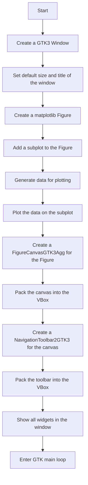
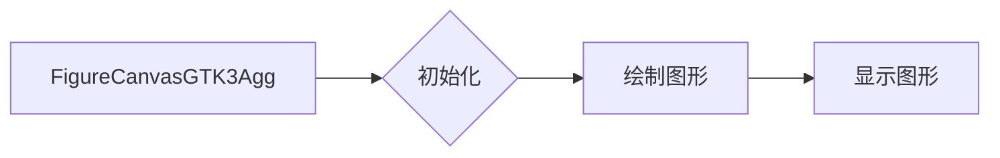
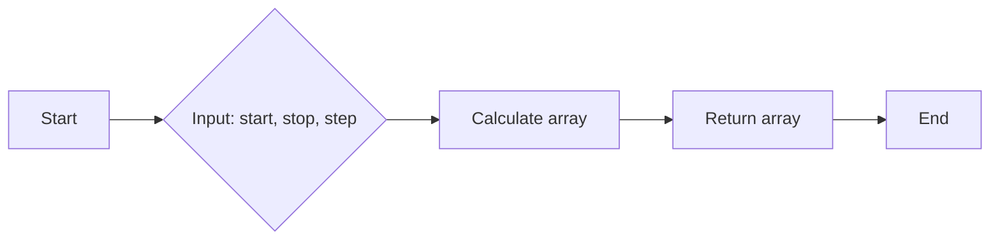
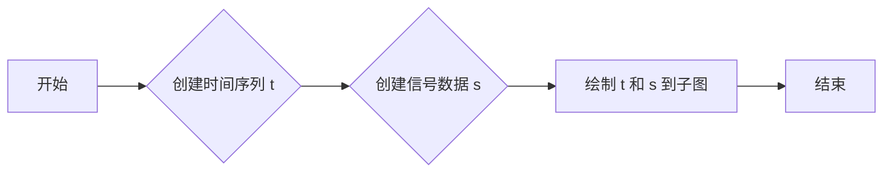
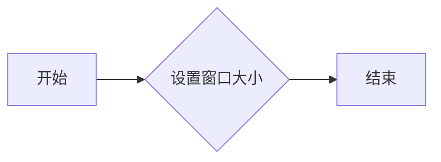
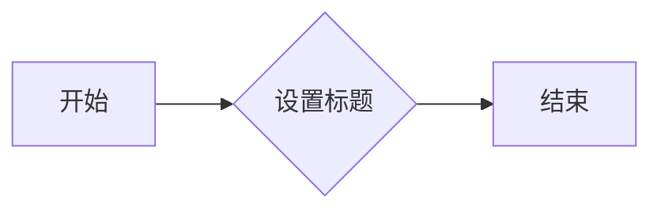
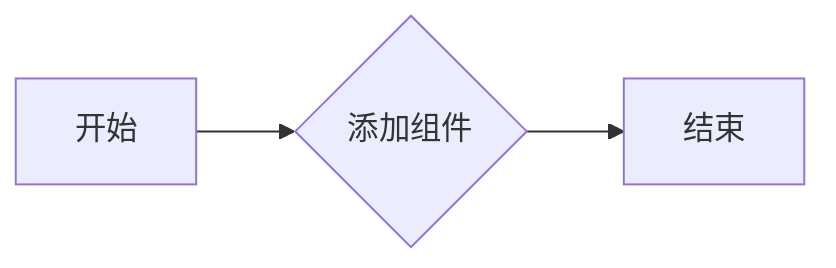
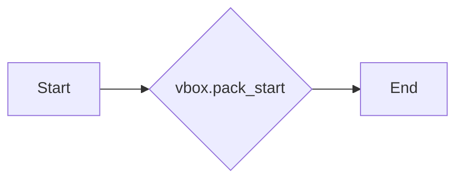
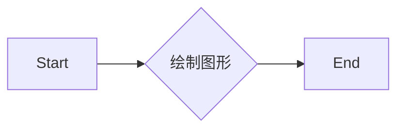
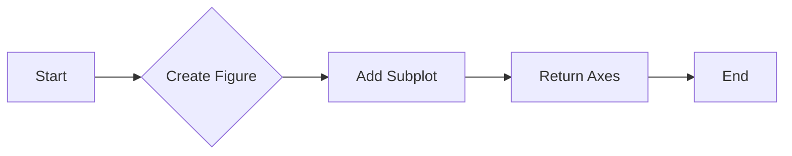

# `matplotlib\galleries\examples\user_interfaces\embedding_in_gtk3_panzoom_sgskip.py` 详细设计文档

This code demonstrates embedding a matplotlib figure within a GTK3 window using pygobject, creating a simple GUI application with a navigation toolbar for interactive plotting.

## 整体流程



## 类结构

```
Window (GTK3)
├── VBox (Container)
│   ├── FigureCanvasGTK3Agg (matplotlib)
│   └── NavigationToolbar2GTK3 (matplotlib)
└── Figure (matplotlib)
```

## 全局变量及字段


### `win`
    
The main window of the application.

类型：`Gtk.Window`
    


### `vbox`
    
A vertical box container for widgets.

类型：`Gtk.VBox`
    


### `canvas`
    
The canvas widget for rendering the matplotlib figure.

类型：`matplotlib.backends.backend_gtk3agg.FigureCanvasGTK3Agg`
    


### `toolbar`
    
The navigation toolbar for the canvas.

类型：`matplotlib.backends.backend_gtk3.NavigationToolbar2GTK3`
    


### `fig`
    
The matplotlib figure object.

类型：`matplotlib.figure.Figure`
    


### `ax`
    
The axes object in the figure.

类型：`matplotlib.axes._subplots.AxesSubplot`
    


### `t`
    
The time array for the plot.

类型：`numpy.ndarray`
    


### `s`
    
The sine values for the plot.

类型：`numpy.ndarray`
    


### `Gtk.Window.win`
    
The main window of the application.

类型：`Gtk.Window`
    


### `Gtk.VBox.vbox`
    
A vertical box container for widgets.

类型：`Gtk.VBox`
    


### `matplotlib.backends.backend_gtk3agg.FigureCanvasGTK3Agg.canvas`
    
The canvas widget for rendering the matplotlib figure.

类型：`matplotlib.backends.backend_gtk3agg.FigureCanvasGTK3Agg`
    


### `matplotlib.backends.backend_gtk3.NavigationToolbar2GTK3.toolbar`
    
The navigation toolbar for the canvas.

类型：`matplotlib.backends.backend_gtk3.NavigationToolbar2GTK3`
    


### `matplotlib.figure.Figure.fig`
    
The matplotlib figure object.

类型：`matplotlib.figure.Figure`
    


### `matplotlib.axes._subplots.AxesSubplot.ax`
    
The axes object in the figure.

类型：`matplotlib.axes._subplots.AxesSubplot`
    


### `numpy.ndarray.t`
    
The time array for the plot.

类型：`numpy.ndarray`
    


### `numpy.ndarray.s`
    
The sine values for the plot.

类型：`numpy.ndarray`
    
    

## 全局函数及方法


### gi.require_version('Gtk', '3.0')

该函数用于设置GI库的版本要求。

参数：

- `Gtk`：`str`，表示要设置的GI库名称。
- `'3.0'`：`str`，表示要设置的GI库版本。

返回值：无

#### 流程图

```mermaid
graph LR
A[gi.require_version('Gtk', '3.0')] --> B{设置GI库版本}
B --> C[完成]
```

#### 带注释源码

```
gi.require_version('Gtk', '3.0')
```


### NavigationToolbar2GTK3

NavigationToolbar2GTK3 is a class that provides a navigation toolbar for matplotlib figures embedded in GTK3 applications using pygobject.

参数：

- `canvas`：`FigureCanvasGTK3Agg`，The canvas widget that contains the matplotlib figure.
- ...

返回值：`NavigationToolbarGTK3`，An instance of the NavigationToolbarGTK3 class that can be used to interact with the matplotlib figure.

#### 流程图


#### 带注释源码

```python
from gi.repository import Gtk

# Create a Figure object
fig = Figure(figsize=(5, 4), dpi=100)
ax = fig.add_subplot(1, 1, 1)
t = np.arange(0.0, 3.0, 0.01)
s = np.sin(2*np.pi*t)
ax.plot(t, s)

# Create a FigureCanvasGTK3Agg object
canvas = FigureCanvas(fig)  # a Gtk.DrawingArea

# Create a NavigationToolbar2GTK3 object
toolbar = NavigationToolbar(canvas)

# Pack the canvas into a VBox
vbox.pack_start(canvas, True, True, 0)

# Pack the toolbar into the VBox
vbox.pack_start(toolbar, False, False, 0)

# Show all widgets
win.show_all()

# Enter the GTK main loop
Gtk.main()
```


### FigureCanvasGTK3Agg

`FigureCanvasGTK3Agg` 是一个用于在 GTK3 环境中嵌入 Matplotlib 图形的类。

参数：

- `fig`：`Figure`，Matplotlib 图形对象，用于绘制图形。

返回值：无

#### 流程图



#### 带注释源码

```python
from matplotlib.backends.backend_gtk3agg import FigureCanvasGTK3Agg as FigureCanvas

class FigureCanvasGTK3Agg(FigureCanvas):
    def __init__(self, fig):
        """
        初始化 FigureCanvasGTK3Agg 对象。

        :param fig: Matplotlib 图形对象。
        """
        FigureCanvas.__init__(self, fig)
```


### Figure(figsize=(5, 4), dpi=100)

创建一个matplotlib图形对象。

参数：

- `figsize`：`tuple`，图形的尺寸，单位为英寸。
- `dpi`：`int`，图形的分辨率，单位为每英寸点数。

返回值：`Figure`，matplotlib图形对象。

#### 流程图


#### 带注释源码

```
fig = Figure(figsize=(5, 4), dpi=100)
```


### np.arange

`np.arange` 是 NumPy 库中的一个函数，用于生成一个沿指定间隔的数组。

参数：

- `start`：`int`，数组的起始值。
- `stop`：`int`，数组的结束值（不包括此值）。
- `step`：`int`，数组的步长，默认为 1。

返回值：`numpy.ndarray`，一个沿指定间隔的数组。

#### 流程图



#### 带注释源码

```
t = np.arange(0.0, 3.0, 0.01)
# t is an array of values from 0.0 to 2.99, with a step of 0.01
```


### np.sin

计算输入参数的正弦值。

参数：

- `x`：`numpy.ndarray`，输入的数值数组，用于计算正弦值。

返回值：`numpy.ndarray`，与输入数组相同形状的正弦值数组。

#### 流程图

```mermaid
graph LR
A[Start] --> B{Is x a numpy.ndarray?}
B -- Yes --> C[Calculate sin(x)]
B -- No --> D[Error: Invalid input type]
C --> E[Return sin(x)]
E --> F[End]
```

#### 带注释源码

```python
import numpy as np

def np_sin(x):
    """
    Calculate the sine of the input array.

    Parameters:
    - x: numpy.ndarray, the input array to calculate the sine of.

    Returns:
    - numpy.ndarray, the sine of the input array.
    """
    return np.sin(x)
```


### plot

`plot` 函数用于在matplotlib的子图上绘制数据。

参数：

- `t`：`numpy.ndarray`，时间序列数据。
- `s`：`numpy.ndarray`，与时间序列相对应的信号数据。

返回值：无

#### 流程图



#### 带注释源码

```python
# 创建时间序列 t
t = np.arange(0.0, 3.0, 0.01)

# 创建信号数据 s
s = np.sin(2*np.pi*t)

# 绘制 t 和 s 到子图
ax.plot(t, s)
```


### win.connect("delete-event", Gtk.main_quit)

该函数连接了一个信号到窗口对象 `win`，当窗口接收到删除事件（如用户点击关闭按钮）时，会触发 `Gtk.main_quit` 函数，从而退出 GTK 主循环。

参数：

- `delete-event`：`str`，表示连接的信号名称。
- `Gtk.main_quit`：`function`，当窗口接收到删除事件时调用的函数。

返回值：`None`，该函数不返回任何值。

#### 流程图

```mermaid
graph LR
A[Window] --> B{接收到"delete-event"}
B --> C[调用 Gtk.main_quit]
```

#### 带注释源码

```
win.connect("delete-event", Gtk.main_quit)
```


### `set_default_size`

设置窗口的默认大小。

参数：

- `width`：`int`，窗口的默认宽度。
- `height`：`int`，窗口的默认高度。

返回值：`None`，无返回值。

#### 流程图



#### 带注释源码

```python
# 设置窗口的默认大小
win.set_default_size(400, 300)
```


### `set_title`

设置窗口的标题。

参数：

- `title`：`str`，窗口的标题字符串。

返回值：`None`，无返回值。

#### 流程图



#### 带注释源码

```python
# 设置窗口的标题
win.set_title("Embedded in GTK3")
```


### Window.add

该函数将一个组件添加到窗口的垂直盒子（VBox）中。

参数：

- `canvas`：`FigureCanvasGTK3Agg`，matplotlib的绘图区域，用于显示图形。
- `expand`：`bool`，指示组件是否应该扩展以填充可用空间。
- `fill`：`bool`，指示组件是否应该填充其分配的空间。
- `padding`：`int`，组件周围的填充空间。

返回值：`None`，没有返回值。

#### 流程图



#### 带注释源码

```
vbox.pack_start(canvas, True, True, 0)
```


### win.show_all()

`win.show_all()` 是一个调用，它属于 `Gtk.Window` 类。

描述：

该函数用于显示窗口中的所有子部件，包括那些默认不显示的。

参数：

- 无

返回值：无

#### 流程图

```mermaid
graph LR
A[win.show_all()] --> B{显示所有子部件}
```

#### 带注释源码

```
win.show_all()  # 显示窗口中的所有子部件
```


### vbox.pack_start

`vbox.pack_start` 是一个方法，用于将一个 widget 添加到垂直盒布局（VBox）中。

参数：

- `canvas`：`FigureCanvasGTK3Agg`，表示一个绘图区域，用于显示 matplotlib 图形。
- `True`：`bool`，表示是否填充空间，这里设置为 True，表示 canvas 将填充整个可用空间。
- `True`：`bool`，表示是否调整大小，这里设置为 True，表示 canvas 将根据其内容调整大小。
- `0`：`int`，表示边距，这里设置为 0，表示没有边距。

返回值：`None`，该方法没有返回值。

#### 流程图



#### 带注释源码

```
# Add canvas to vbox
canvas = FigureCanvas(fig)  # a Gtk.DrawingArea
vbox.pack_start(canvas, True, True, 0)
```


### FigureCanvasGTK3Agg.plot

该函数用于在matplotlib的GTK3后端中绘制图形。

参数：

- `self`：`FigureCanvasGTK3Agg`，当前绘图画布的实例
- `fig`：`Figure`，matplotlib的Figure对象，包含要绘制的图形

返回值：无

#### 流程图



#### 带注释源码

```
from matplotlib.backends.backend_gtk3agg import FigureCanvasGTK3Agg as FigureCanvas
from matplotlib.figure import Figure

class FigureCanvasGTK3Agg(FigureCanvas):
    def __init__(self, figure):
        FigureCanvas.__init__(self, figure)
        # 初始化绘图画布

    def draw(self):
        # 绘制图形的方法
        pass

    def plot(self, fig):
        # 绘制图形
        ax = fig.add_subplot(1, 1, 1)
        t = np.arange(0.0, 3.0, 0.01)
        s = np.sin(2*np.pi*t)
        ax.plot(t, s)
        self.draw()  # 重新绘制画布
```


### Figure.add_subplot

`Figure.add_subplot` 是 `matplotlib.figure.Figure` 类的一个方法，用于添加一个子图到当前的 Figure 对象中。

参数：

- `nrows`：`int`，子图所在的行数。
- `ncols`：`int`，子图所在的列数。
- `index`：`int`，子图在当前行中的索引。

返回值：`matplotlib.axes.Axes`，返回创建的子图对象。

#### 流程图



#### 带注释源码

```python
from matplotlib.figure import Figure

# 创建一个 Figure 对象
fig = Figure(figsize=(5, 4), dpi=100)

# 使用 add_subplot 方法添加一个子图
ax = fig.add_subplot(1, 1, 1)

# ... 在这里可以添加更多的绘图代码 ...
```


### Figure

`Figure` 是 `matplotlib.figure.Figure` 类，用于创建一个图形，可以包含多个子图。

字段：

- `figsize`：`tuple`，图形的尺寸（宽，高）。
- `dpi`：`int`，图形的分辨率（每英寸点数）。

方法：

- `add_subplot`：添加一个子图到当前 Figure 对象中。

全局变量：

- `win`：`Gtk.Window`，主窗口对象。

全局函数：

- `gi.require_version`：设置 gi 库的版本。
- `Gtk`：`gi.repository.Gtk`，GTK 库的接口。
- `NavigationToolbar2GTK3`：`matplotlib.backends.backend_gtk3.NavigationToolbar2GTK3`，导航工具栏类。
- `FigureCanvasGTK3Agg`：`matplotlib.backends.backend_gtk3agg.FigureCanvasGTK3Agg`，图形画布类。

关键组件信息：

- `Figure`：图形对象，包含子图。
- `Axes`：子图对象，用于绘制图形。

潜在的技术债务或优化空间：

- 代码中使用了硬编码的尺寸和分辨率，可以考虑使用配置文件或参数来动态设置。
- 代码中使用了全局变量，可以考虑使用类或模块来封装变量，提高代码的可维护性。

设计目标与约束：

- 设计目标是创建一个嵌入在 GTK3 窗口中的图形界面。
- 约束是使用 pygobject 和 matplotlib 库。

错误处理与异常设计：

- 代码中没有显式的错误处理机制，可以考虑添加异常处理来提高代码的健壮性。

数据流与状态机：

- 数据流从用户输入到图形绘制，再到窗口显示。
- 状态机包括创建图形、添加子图、绘制图形和显示窗口。

外部依赖与接口契约：

- 代码依赖于 GTK3、pygobject、matplotlib 和 numpy 库。
- 接口契约包括图形和子图的创建、绘制和显示。
```

## 关键组件


### 张量索引与惰性加载

张量索引与惰性加载是用于在代码中处理大型数据集时，只对需要的数据进行计算和存储，从而提高效率和减少内存消耗的技术。

### 反量化支持

反量化支持是指代码能够处理和转换不同量化的数据，使得模型在不同的量化策略下能够正常运行。

### 量化策略

量化策略是指在模型训练和部署过程中，将浮点数转换为固定点数的过程，以减少模型的存储和计算需求，提高效率。


## 问题及建议


### 已知问题

-   {问题1} 缺乏异常处理：代码中没有对可能出现的异常情况进行处理，例如GTK或matplotlib库的初始化失败。
-   {问题2} 缺乏用户交互：代码仅展示了如何将matplotlib嵌入GTK3中，但没有提供用户交互功能，如保存图像或调整参数。
-   {问题3} 缺乏资源管理：代码中没有显示如何管理图形资源，例如在窗口关闭时释放matplotlib图形资源。

### 优化建议

-   {建议1} 添加异常处理：在代码中添加异常处理逻辑，确保在库初始化失败或其他错误发生时能够优雅地处理。
-   {建议2} 增加用户交互功能：实现保存图像、调整绘图参数等用户交互功能，提升用户体验。
-   {建议3} 管理图形资源：在窗口关闭事件中添加代码来释放matplotlib图形资源，避免内存泄漏。
-   {建议4} 使用配置文件：考虑使用配置文件来存储绘图参数，以便用户可以自定义绘图设置。
-   {建议5} 添加文档和注释：为代码添加详细的文档和注释，帮助其他开发者理解代码结构和功能。


## 其它


### 设计目标与约束

- 设计目标：实现一个使用GTK3和pygobject嵌入matplotlib图表的窗口。
- 约束：必须使用GTK3和pygobject库，图表数据为正弦波。

### 错误处理与异常设计

- 错误处理：程序应能够捕获并处理GTK和matplotlib可能抛出的异常。
- 异常设计：使用try-except块捕获异常，并给出用户友好的错误信息。

### 数据流与状态机

- 数据流：程序从numpy生成正弦波数据，matplotlib绘制图表，GTK3显示窗口。
- 状态机：程序从初始化到显示窗口，再到退出，是一个简单的状态转换过程。

### 外部依赖与接口契约

- 外部依赖：程序依赖于GTK3、pygobject、numpy和matplotlib库。
- 接口契约：GTK3和matplotlib库的API必须遵循，确保程序正确运行。

### 安全性与隐私

- 安全性：确保程序不会暴露系统安全漏洞。
- 隐私：程序不涉及用户数据收集，不涉及隐私问题。

### 性能考量

- 性能考量：程序应尽可能高效地处理绘图和窗口显示，避免不必要的资源消耗。

### 可维护性与可扩展性

- 可维护性：代码结构清晰，易于理解和维护。
- 可扩展性：设计允许未来添加更多图表类型或功能。

### 用户界面与体验

- 用户界面：窗口布局简洁，易于操作。
- 用户体验：程序启动迅速，图表显示清晰。

### 测试与验证

- 测试：程序应通过单元测试和集成测试，确保功能正确。
- 验证：通过实际运行和用户反馈验证程序性能和稳定性。

### 文档与帮助

- 文档：提供详细的设计文档和用户手册。
- 帮助：提供在线帮助和常见问题解答。

### 版本控制与发布

- 版本控制：使用版本控制系统管理代码变更。
- 发布：遵循版本发布流程，确保软件质量。


    