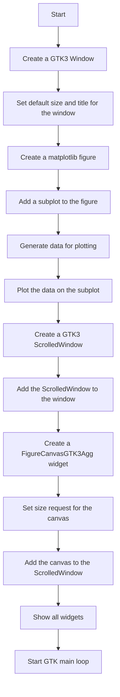
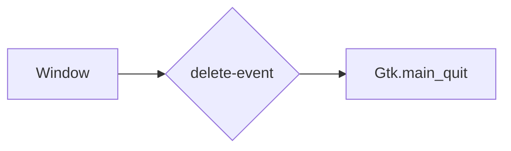
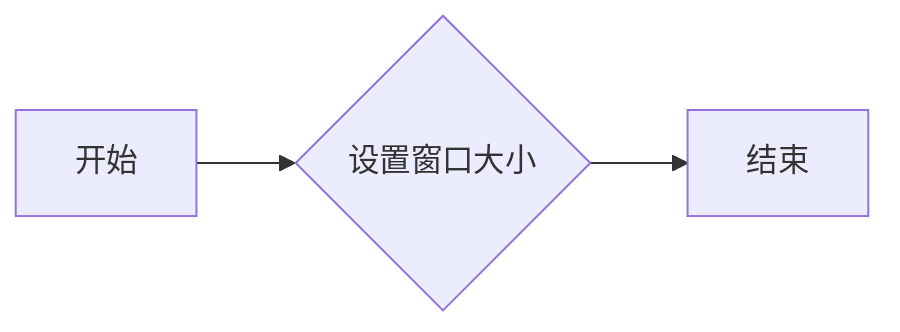
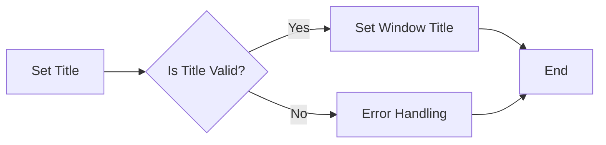
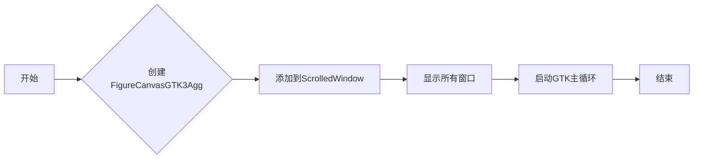
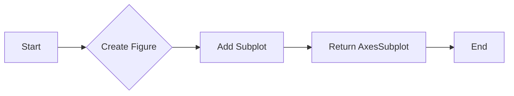
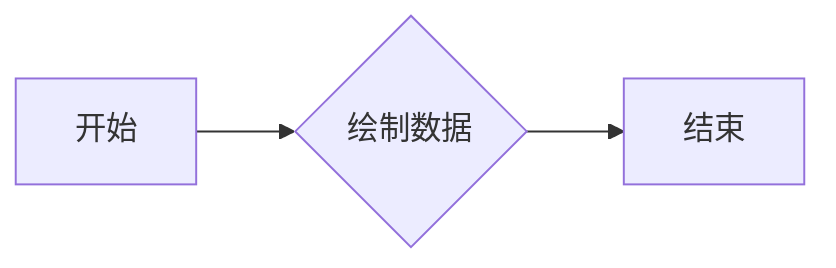
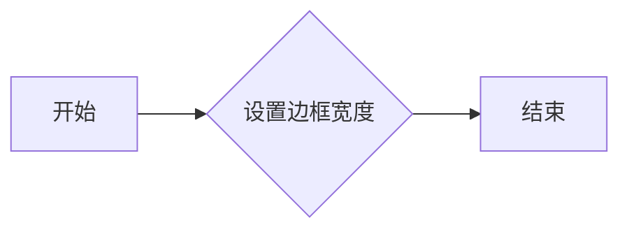
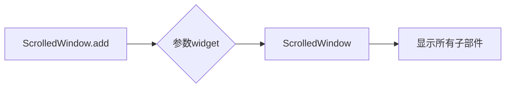
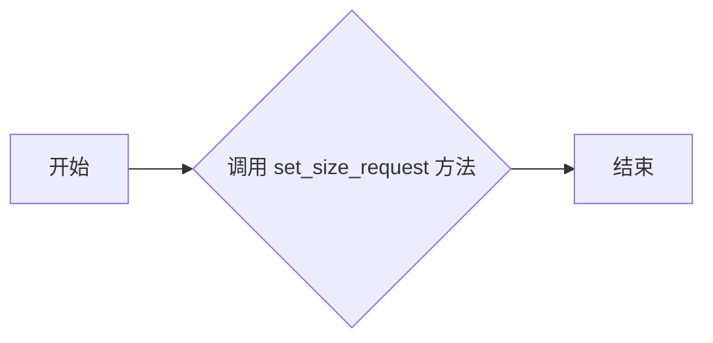

# `matplotlib\galleries\examples\user_interfaces\embedding_in_gtk3_sgskip.py` 详细设计文档

This code demonstrates embedding a matplotlib figure into a GTK3 application using pygobject.

## 整体流程



## 类结构

```
Window (GTK3)
├── Figure (matplotlib)
│   ├── Subplot (matplotlib)
│   └── Data (numpy)
└── ScrolledWindow (GTK3)
```

## 全局变量及字段


### `win`
    
The main window of the application.

类型：`Gtk.Window`
    


### `fig`
    
The matplotlib figure object containing the plot.

类型：`matplotlib.figure.Figure`
    


### `ax`
    
The matplotlib subplot object where the plot is drawn.

类型：`matplotlib.axes._subplots.AxesSubplot`
    


### `sw`
    
The scrolled window that contains the canvas widget.

类型：`Gtk.ScrolledWindow`
    


### `canvas`
    
The canvas widget that displays the matplotlib figure.

类型：`matplotlib.backends.backend_gtk3agg.FigureCanvasGTK3Agg`
    


### `t`
    
The time values for the plot.

类型：`numpy.ndarray`
    


### `s`
    
The sine values for the plot.

类型：`numpy.ndarray`
    


### `Gtk.Window.win`
    
The main window of the application.

类型：`Gtk.Window`
    


### `matplotlib.figure.Figure.fig`
    
The matplotlib figure object containing the plot.

类型：`matplotlib.figure.Figure`
    


### `matplotlib.axes._subplots.AxesSubplot.ax`
    
The matplotlib subplot object where the plot is drawn.

类型：`matplotlib.axes._subplots.AxesSubplot`
    


### `Gtk.ScrolledWindow.sw`
    
The scrolled window that contains the canvas widget.

类型：`Gtk.ScrolledWindow`
    


### `matplotlib.backends.backend_gtk3agg.FigureCanvasGTK3Agg.canvas`
    
The canvas widget that displays the matplotlib figure.

类型：`matplotlib.backends.backend_gtk3agg.FigureCanvasGTK3Agg`
    
    

## 全局函数及方法


### `win.connect("delete-event", Gtk.main_quit)`

该函数将一个删除事件（当窗口被关闭时触发）连接到`Gtk.main_quit`函数，用于退出GTK主循环。

参数：

- `delete-event`：`str`，表示触发事件的信号名称。
- `Gtk.main_quit`：`function`，当窗口关闭时调用的函数，用于退出GTK主循环。

返回值：`None`，没有返回值。

#### 流程图



#### 带注释源码

```
win.connect("delete-event", Gtk.main_quit)
```


### `set_default_size`

设置窗口的默认大小。

参数：

- `width`：`int`，窗口的默认宽度。
- `height`：`int`，窗口的默认高度。

返回值：`None`，无返回值。

#### 流程图



#### 带注释源码

```python
# 设置窗口的默认大小
win.set_default_size(400, 300)
```


### `win.set_title`

设置窗口的标题。

参数：

- `title`：`str`，窗口的标题字符串。

返回值：`None`，没有返回值。

#### 流程图



#### 带注释源码

```python
# Set the title of the window
win.set_title("Embedded in GTK3")
```


### Window.add

该函数将一个`FigureCanvasGTK3Agg`小部件添加到`Gtk.ScrolledWindow`中。

参数：

- `sw`：`Gtk.ScrolledWindow`，描述了要添加小部件的滚动窗口。

返回值：无

#### 流程图



#### 带注释源码

```python
# 创建FigureCanvasGTK3Agg
canvas = FigureCanvas(fig)  # a Gtk.DrawingArea

# 添加到ScrolledWindow
sw.add(canvas)
```


### win.show_all()

`win.show_all()` 是一个方法，它属于 `Gtk.Window` 类。此方法用于显示窗口及其所有子窗口。

参数：

- 无

返回值：无

#### 流程图

```mermaid
graph LR
A[win.show_all()] --> B{显示窗口}
B --> C[显示所有子窗口]
```

#### 带注释源码

```
win.show_all()  # 显示窗口及其所有子窗口
```


### Figure.figsize

`Figure.figsize` 是一个属性，用于设置matplotlib图形的大小。

参数：

- `figsize`：`tuple`，图形的宽度和高度，单位为英寸。

返回值：无，`figsize` 是一个属性，用于设置图形的大小。

#### 流程图

```mermaid
graph LR
A[Set figsize] --> B{tuple(width, height)}
B --> C[Apply to figure]
```

#### 带注释源码

```
fig = Figure(figsize=(5, 4), dpi=100)
```

在这段代码中，`Figure` 类的 `figsize` 属性被设置为 `(5, 4)`，这意味着图形的宽度为5英寸，高度为4英寸。`dpi=100` 参数指定了图形的分辨率。


### Figure.add_subplot

`Figure.add_subplot` 是 `matplotlib.figure.Figure` 类的一个方法，用于向 `Figure` 对象中添加一个 `AxesSubplot` 对象。

参数：

- `nrows`：`int`，指定子图在行方向上的数量。
- `ncols`：`int`，指定子图在列方向上的数量。
- `sharex`：`bool`，指定是否共享 x 轴。
- `sharey`：`bool`，指定是否共享 y 轴。
- `rowspan`：`int`，指定子图在行方向上的跨行数。
- `colspan`：`int`，指定子图在列方向上的跨列数。
- `fig`：`Figure`，指定父图对象。
- `gridspec`：`GridSpec`，指定网格布局。

参数描述：
- `nrows` 和 `ncols` 用于确定子图在图中的布局。
- `sharex` 和 `sharey` 用于控制子图是否共享 x 轴或 y 轴。
- `rowspan` 和 `colspan` 用于控制子图在网格中的跨行或跨列。

返回值：`AxesSubplot`，返回创建的子图对象。

#### 流程图



#### 带注释源码

```python
from matplotlib.figure import Figure

class Figure:
    # ... other methods and attributes ...

    def add_subplot(self, nrows=1, ncols=1, sharex=None, sharey=None, rowspan=1, colspan=1, fig=None, gridspec=None):
        """
        Add an AxesSubplot to this Figure.

        Parameters
        ----------
        nrows : int, optional
            Number of rows of subplots.
        ncols : int, optional
            Number of columns of subplots.
        sharex : bool, optional
            If True, all subplots will share the same x-axis.
        sharey : bool, optional
            If True, all subplots will share the same y-axis.
        rowspan : int, optional
            Number of rows this subplot will span.
        colspan : int, optional
            Number of columns this subplot will span.
        fig : Figure, optional
            The parent Figure object.
        gridspec : GridSpec, optional
            The GridSpec object to use for the subplot layout.

        Returns
        -------
        AxesSubplot
            The new AxesSubplot object.
        """
        # ... implementation ...
        return AxesSubplot()
```


### Subplot.plot

`Subplot.plot` 是一个matplotlib绘图函数，用于在matplotlib的子图（subplot）上绘制数据。

参数：

- `t`：`numpy.ndarray`，时间序列数据，用于x轴。
- `s`：`numpy.ndarray`，与时间序列相对应的y轴数据。

返回值：无

#### 流程图



#### 带注释源码

```python
# 导入必要的库
import numpy as np

# 创建时间序列数据
t = np.arange(0.0, 3.0, 0.01)
s = np.sin(2*np.pi*t)

# 在子图上绘制数据
ax.plot(t, s)
```


### `set_border_width`

`set_border_width` 方法用于设置滚动窗口的边框宽度。

参数：

- `width`：`int`，边框的宽度，以像素为单位。

返回值：`None`，此方法不返回任何值。

#### 流程图



#### 带注释源码

```python
# A scrolled window border goes outside the scrollbars and viewport
sw.set_border_width(10)
```


### ScrolledWindow.add

将一个FigureCanvasGTK3Agg小部件添加到ScrolledWindow中。

参数：

- `widget`：`Gtk.Widget`，要添加到ScrolledWindow中的小部件。

返回值：`None`，没有返回值。

#### 流程图



#### 带注释源码

```
sw.add(canvas)  # 将canvas小部件添加到ScrolledWindow中
```


### FigureCanvasGTK3Agg.set_size_request

`FigureCanvasGTK3Agg.set_size_request` 方法用于设置 FigureCanvasGTK3Agg 小部件的大小请求。

参数：

- `width`：`int`，表示请求的宽度。
- `height`：`int`，表示请求的高度。

参数描述：

- `width`：指定小部件的宽度请求。
- `height`：指定小部件的高度请求。

返回值：`None`，此方法不返回任何值。

#### 流程图



#### 带注释源码

```
canvas = FigureCanvas(fig)  # a Gtk.DrawingArea
canvas.set_size_request(800, 600)  # 设置 canvas 的大小请求为 800x600
```


## 关键组件


### 张量索引与惰性加载

张量索引与惰性加载是指在处理大型数据集时，只对需要的数据进行索引和加载，以减少内存消耗和提高处理速度。

### 反量化支持

反量化支持是指对量化后的数据进行反量化处理，以便恢复原始数据精度。

### 量化策略

量化策略是指在模型训练和推理过程中，对模型参数进行量化处理，以减少模型大小和提高推理速度。


## 问题及建议


### 已知问题

-   {问题1} 缺乏异常处理：代码中没有对可能出现的异常情况进行处理，例如GTK或matplotlib库的初始化失败。
-   {问题2} 硬编码尺寸：窗口和画布的尺寸被硬编码为固定值，这可能导致在不同分辨率或屏幕尺寸的设备上显示效果不佳。
-   {问题3} 缺乏用户交互：当前代码仅展示了静态的图形，没有提供用户交互功能，例如缩放、平移或添加新的图形元素。

### 优化建议

-   {建议1} 添加异常处理：在代码中添加异常处理逻辑，确保在库初始化失败或其他错误发生时能够优雅地处理。
-   {建议2} 使用相对尺寸：使用相对尺寸或比例因子来设置窗口和画布的尺寸，以便在不同设备上保持一致的显示效果。
-   {建议3} 实现用户交互：扩展代码以支持用户交互，例如通过按钮或键盘快捷键来控制图形的显示和操作。
-   {建议4} 模块化代码：将代码分解为更小的模块或函数，以提高代码的可读性和可维护性。
-   {建议5} 使用配置文件：允许用户通过配置文件自定义图形的显示参数，例如颜色、线型等。


## 其它


### 设计目标与约束

- 设计目标：实现一个使用GTK3和pygobject库将matplotlib图形嵌入到GTK3窗口中的示例。
- 约束：代码必须使用GTK3和pygobject库，并且图形必须能够响应窗口大小变化。

### 错误处理与异常设计

- 错误处理：代码中未包含显式的错误处理机制，但应确保所有外部库调用都进行了异常处理。
- 异常设计：对于可能出现的异常，如GTK或matplotlib库的初始化失败，应提供适当的错误消息和恢复策略。

### 数据流与状态机

- 数据流：代码中的数据流从matplotlib的绘图操作开始，通过FigureCanvasGTK3Agg传递到GTK窗口中。
- 状态机：代码中没有明确的状态机，但窗口的显示和关闭由GTK事件循环控制。

### 外部依赖与接口契约

- 外部依赖：代码依赖于GTK3、pygobject、numpy和matplotlib库。
- 接口契约：GTK和matplotlib库的API必须遵循其官方文档中的约定。


    