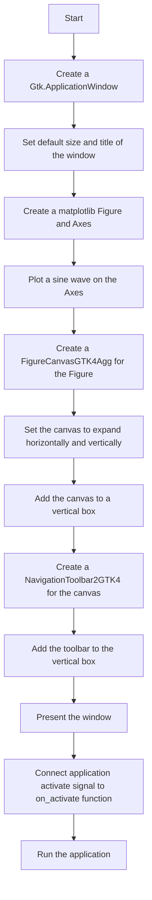
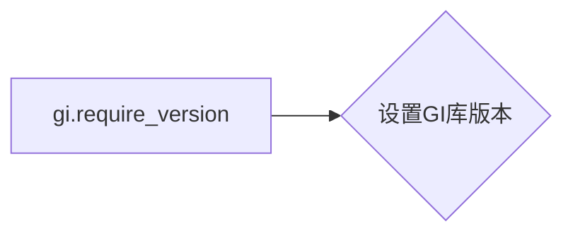
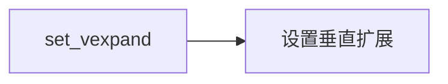
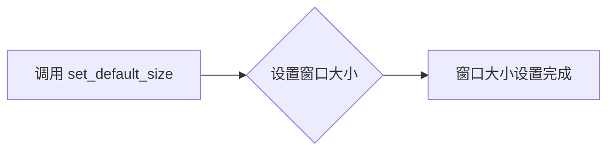

# `matplotlib\galleries\examples\user_interfaces\embedding_in_gtk4_panzoom_sgskip.py` 详细设计文档

This code demonstrates embedding a matplotlib plot within a GTK4 application using pygobject, creating a window with a navigation toolbar for interactive plot manipulation.

## 整体流程



## 类结构

```
Gtk.ApplicationWindow
├── Figure
│   ├── Axes
│   └── FigureCanvasGTK4Agg
└── NavigationToolbar2GTK4
```

## 全局变量及字段


### `app`
    
The main application object for the GTK4 window.

类型：`Gtk.Application`
    


### `win`
    
The main window of the application.

类型：`Gtk.ApplicationWindow`
    


### `fig`
    
The matplotlib figure object containing the plot.

类型：`matplotlib.figure.Figure`
    


### `ax`
    
The matplotlib axes object for plotting data.

类型：`matplotlib.axes._subplots.AxesSubplot`
    


### `t`
    
The time values for the plot.

类型：`numpy.ndarray`
    


### `s`
    
The sine values for the plot.

类型：`numpy.ndarray`
    


### `vbox`
    
The vertical box that contains the canvas and the toolbar.

类型：`Gtk.Box`
    


### `canvas`
    
The canvas widget for drawing the matplotlib figure.

类型：`matplotlib.backends.backend_gtk4agg.FigureCanvasGTK4Agg`
    


### `toolbar`
    
The navigation toolbar for the canvas.

类型：`matplotlib.backends.backend_gtk4.NavigationToolbar2GTK4`
    


### `Gtk.ApplicationWindow.application`
    
The application that the window belongs to.

类型：`Gtk.Application`
    


### `Gtk.ApplicationWindow.title`
    
The title of the window.

类型：`str`
    


### `Gtk.ApplicationWindow.default_size`
    
The default size of the window.

类型：`tuple`
    


### `Figure.figsize`
    
The size of the figure in inches.

类型：`tuple`
    


### `Figure.dpi`
    
The dots per inch of the figure.

类型：`int`
    
    

## 全局函数及方法


### on_activate

`on_activate` 是一个回调函数，当 GTK 应用程序被激活时调用。

参数：

- `app`：`Gtk.Application`，应用程序实例，用于创建和配置窗口。

返回值：无

#### 流程图


#### 带注释源码

```python
def on_activate(app):
    # 创建窗口
    win = Gtk.ApplicationWindow(application=app)
    # 设置窗口大小和标题
    win.set_default_size(400, 300)
    win.set_title("Embedded in GTK4")

    # 创建图形
    fig = Figure(figsize=(5, 4), dpi=100)
    # 添加子图
    ax = fig.add_subplot(1, 1, 1)
    # 生成数据
    t = np.arange(0.0, 3.0, 0.01)
    s = np.sin(2*np.pi*t)
    # 绘制数据
    ax.plot(t, s)

    # 创建画布
    canvas = FigureCanvas(fig)  # a Gtk.DrawingArea
    # 设置画布属性
    canvas.set_hexpand(True)
    canvas.set_vexpand(True)
    # 添加画布到窗口
    vbox.append(canvas)

    # 创建工具栏
    toolbar = NavigationToolbar(canvas)
    # 添加工具栏到窗口
    vbox.append(toolbar)

    # 显示窗口
    win.present()
```


### gi.require_version

`gi.require_version` 是一个全局函数，用于设置GI库的版本。

描述：

该函数用于设置GI库的版本，确保后续导入的GI模块使用正确的版本。

参数：

- `version`：`str`，GI库的版本号，例如 '4.0'。

返回值：无

#### 流程图



#### 带注释源码

```python
# 设置GI库版本为4.0
gi.require_version('Gtk', '4.0')
```


### on_activate(app)

激活事件的处理函数，用于创建和配置GTK4应用程序窗口。

参数：

- `app`：`Gtk.Application`，应用程序实例，用于创建和配置窗口。

返回值：无

#### 流程图


#### 带注释源码

```python
def on_activate(app):
    win = Gtk.ApplicationWindow(application=app)
    win.set_default_size(400, 300)
    win.set_title("Embedded in GTK4")

    fig = Figure(figsize=(5, 4), dpi=100)
    ax = fig.add_subplot(1, 1, 1)
    t = np.arange(0.0, 3.0, 0.01)
    s = np.sin(2*np.pi*t)
    ax.plot(t, s)

    vbox = Gtk.Box(orientation=Gtk.Orientation.VERTICAL)
    win.set_child(vbox)

    # Add canvas to vbox
    canvas = FigureCanvas(fig)  # a Gtk.DrawingArea
    canvas.set_hexpand(True)
    canvas.set_vexpand(True)
    vbox.append(canvas)

    # Create toolbar
    toolbar = NavigationToolbar(canvas)
    vbox.append(toolbar)

    win.present()
```


### on_activate(app)

该函数是当GTK应用程序激活时调用的主函数，用于创建和配置应用程序窗口。

参数：

- `app`：`Gtk.Application`，代表当前激活的应用程序实例。

返回值：无

#### 流程图

```mermaid
graph LR
A[on_activate(app)] --> B[创建窗口]
B --> C[设置窗口大小和标题]
C --> D[创建图形对象]
D --> E[添加子图]
E --> F[生成数据]
F --> G[绘制数据]
G --> H[创建画布]
H --> I[设置画布属性]
I --> J[添加画布到窗口]
J --> K[创建工具栏]
K --> L[添加工具栏到窗口]
L --> M[显示窗口]
```

#### 带注释源码

```python
def on_activate(app):
    win = Gtk.ApplicationWindow(application=app)
    win.set_default_size(400, 300)
    win.set_title("Embedded in GTK4")

    fig = Figure(figsize=(5, 4), dpi=100)
    ax = fig.add_subplot(1, 1, 1)
    t = np.arange(0.0, 3.0, 0.01)
    s = np.sin(2*np.pi*t)
    ax.plot(t, s)

    vbox = Gtk.Box(orientation=Gtk.Orientation.VERTICAL)
    win.set_child(vbox)

    # Add canvas to vbox
    canvas = FigureCanvas(fig)  # a Gtk.DrawingArea
    canvas.set_hexpand(True)
    canvas.set_vexpand(True)
    vbox.append(canvas)

    # Create toolbar
    toolbar = NavigationToolbar(canvas)
    vbox.append(toolbar)

    win.present()
```


### on_activate

`on_activate` 是一个函数，它是 `Gtk.Application` 类的一个信号处理函数，当应用程序被激活时调用。

参数：

- `app`：`Gtk.Application`，表示当前激活的应用程序实例。

返回值：无

#### 流程图


#### 带注释源码

```python
def on_activate(app):
    win = Gtk.ApplicationWindow(application=app)
    win.set_default_size(400, 300)
    win.set_title("Embedded in GTK4")

    fig = Figure(figsize=(5, 4), dpi=100)
    ax = fig.add_subplot(1, 1, 1)
    t = np.arange(0.0, 3.0, 0.01)
    s = np.sin(2*np.pi*t)
    ax.plot(t, s)

    vbox = Gtk.Box(orientation=Gtk.Orientation.VERTICAL)
    win.set_child(vbox)

    # Add canvas to vbox
    canvas = FigureCanvas(fig)  # a Gtk.DrawingArea
    canvas.set_hexpand(True)
    canvas.set_vexpand(True)
    vbox.append(canvas)

    # Create toolbar
    toolbar = NavigationToolbar(canvas)
    vbox.append(toolbar)

    win.present()
```


### Figure

`Figure` 是 `matplotlib.figure` 模块中的一个类，用于创建一个图形对象。

参数：

- `figsize`：`tuple`，图形的宽度和高度。
- `dpi`：`int`，图形的分辨率。

返回值：`Figure` 对象。

#### 流程图


#### 带注释源码

```python
fig = Figure(figsize=(5, 4), dpi=100)
```


### add_subplot

`add_subplot` 是 `matplotlib.figure.Figure` 类的一个方法，用于添加一个子图。

参数：

- `nrows`：`int`，子图的行数。
- `ncols`：`int`，子图的列数。
- `index`：`int`，子图在当前图形中的索引。

返回值：`matplotlib.axes.Axes` 对象。

#### 流程图


#### 带注释源码

```python
ax = fig.add_subplot(1, 1, 1)
```


### arange

`arange` 是 `numpy` 模块中的一个函数，用于生成一个等差数列。

参数：

- `start`：`float`，数列的起始值。
- `stop`：`float`，数列的结束值。
- `step`：`float`，数列的步长。

返回值：`numpy.ndarray` 对象。

#### 流程图


#### 带注释源码

```python
t = np.arange(0.0, 3.0, 0.01)
```


### sin

`sin` 是 `numpy` 模块中的一个函数，用于计算正弦值。

参数：

- `x`：`float` 或 `numpy.ndarray`，输入值。

返回值：`float` 或 `numpy.ndarray`。

#### 流程图


#### 带注释源码

```python
s = np.sin(2*np.pi*t)
```


### plot

`plot` 是 `matplotlib.axes.Axes` 类的一个方法，用于绘制二维曲线。

参数：

- `x`：`float` 或 `numpy.ndarray`，x轴数据。
- `y`：`float` 或 `numpy.ndarray`，y轴数据。
- ...

返回值：`matplotlib.lines.Line2D` 对象。

#### 流程图


#### 带注释源码

```python
ax.plot(t, s)
```


### FigureCanvasGTK4Agg

`FigureCanvasGTK4Agg` 是 `matplotlib.backends.backend_gtk4agg` 模块中的一个类，用于将 `matplotlib.figure.Figure` 对象嵌入到 GTK4 应用程序中。

参数：

- `fig`：`matplotlib.figure.Figure`，要嵌入的图形对象。

返回值：`Gtk.DrawingArea` 对象。

#### 流程图


#### 带注释源码

```python
canvas = FigureCanvas(fig)  # a Gtk.DrawingArea
```


### set_hexpand

`set_hexpand` 是 `Gtk.Widget` 类的一个方法，用于设置控件是否水平扩展。

参数：

- `expand`：`bool`，是否扩展。

#### 流程图


#### 带注释源码

```python
canvas.set_hexpand(True)
```


### set_vexpand

`set_vexpand` 是 `Gtk.Widget` 类的一个方法，用于设置控件是否垂直扩展。

参数：

- `expand`：`bool`，是否扩展。

#### 流程图



#### 带注释源码

```python
canvas.set_vexpand(True)
```


### append

`append` 是 `Gtk.Box` 类的一个方法，用于将子控件添加到容器中。

参数：

- `child`：`Gtk.Widget`，要添加的子控件。

#### 流程图


#### 带注释源码

```python
vbox.append(canvas)
```


### NavigationToolbar

`NavigationToolbar` 是 `matplotlib.backends.backend_gtk4` 模块中的一个类，用于创建一个导航工具栏。

参数：

- `canvas`：`Gtk.DrawingArea`，要与之关联的画布。

返回值：`Gtk.Box` 对象。

#### 流程图


#### 带注释源码

```python
toolbar = NavigationToolbar(canvas)
```


### present

`present` 是 `Gtk.ApplicationWindow` 类的一个方法，用于显示窗口。

#### 流程图


#### 带注释源码

```python
win.present()
```


### run

`run` 是 `Gtk.Application` 类的一个方法，用于启动应用程序。

参数：

- `args`：`list`，应用程序的命令行参数。

返回值：`int`，应用程序的退出状态。

#### 流程图


#### 带注释源码

```python
app.run(None)
```


### 关键组件信息

- `Figure`：创建一个图形对象。
- `FigureCanvasGTK4Agg`：将图形对象嵌入到 GTK4 应用程序中。
- `NavigationToolbar`：创建一个导航工具栏。
- `Gtk.ApplicationWindow`：创建一个窗口。
- `Gtk.Box`：创建一个垂直或水平盒子容器。
- `Gtk.DrawingArea`：创建一个绘图区域。
- `matplotlib.axes.Axes`：创建一个子图。
- `numpy.arange`：生成等差数列。
- `numpy.sin`：计算正弦值。
- `matplotlib.pyplot.plot`：绘制二维曲线。


### 潜在的技术债务或优化空间

- 代码中使用了硬编码的窗口大小和分辨率，这可能会限制应用程序的灵活性。
- 可以考虑添加更多的图形元素和交互功能，以增强用户体验。
- 可以优化数据生成和绘图过程，以提高性能。


### 设计目标与约束

- 设计目标是创建一个简单的 GTK4 应用程序，用于展示如何将 `matplotlib` 图形嵌入到 GTK4 应用程序中。
- 约束是使用 `matplotlib` 和 `GTK4` 库。


### 错误处理与异常设计

- 代码中没有显式的错误处理和异常设计。
- 可以添加异常处理来捕获和处理可能发生的错误。


### 数据流与状态机

- 数据流从用户输入开始，通过 `matplotlib` 的绘图功能生成图形，然后显示在 GTK4 应用程序中。
- 状态机不是必需的，因为应用程序没有复杂的状态转换。


### 外部依赖与接口契约

- 代码依赖于 `matplotlib` 和 `GTK4` 库。
- 接口契约由这些库提供，因此不需要额外的契约定义。


### on_activate

`on_activate` 是一个函数，它负责创建一个包含绘图和导航工具栏的 GTK4 应用程序窗口。

参数：

- `app`：`Gtk.Application`，表示当前应用程序实例，用于创建窗口。

返回值：无

#### 流程图


#### 带注释源码

```python
def on_activate(app):
    # 创建应用程序窗口
    win = Gtk.ApplicationWindow(application=app)
    win.set_default_size(400, 300)
    win.set_title("Embedded in GTK4")

    # 创建图形
    fig = Figure(figsize=(5, 4), dpi=100)
    ax = fig.add_subplot(1, 1, 1)
    t = np.arange(0.0, 3.0, 0.01)
    s = np.sin(2*np.pi*t)
    ax.plot(t, s)

    # 创建垂直框
    vbox = Gtk.Box(orientation=Gtk.Orientation.VERTICAL)
    win.set_child(vbox)

    # 添加画布到垂直框
    canvas = FigureCanvas(fig)  # a Gtk.DrawingArea
    canvas.set_hexpand(True)
    canvas.set_vexpand(True)
    vbox.append(canvas)

    # 创建工具栏
    toolbar = NavigationToolbar(canvas)
    vbox.append(toolbar)

    # 显示窗口
    win.present()
```


### Gtk.ApplicationWindow.set_default_size

设置窗口的默认大小。

参数：

- `width`：`int`，窗口的默认宽度。
- `height`：`int`，窗口的默认高度。

返回值：`None`，无返回值。

#### 流程图



#### 带注释源码

```python
# 创建窗口实例
win = Gtk.ApplicationWindow(application=app)

# 设置窗口的默认大小
win.set_default_size(400, 300)
```


### Gtk.ApplicationWindow.set_title

设置窗口的标题。

参数：

- `title`：`str`，窗口的标题字符串。

返回值：`None`，没有返回值。

#### 流程图

```mermaid
graph LR
A[开始] --> B{调用set_title}
B --> C[结束]
```

#### 带注释源码

```python
# 在以下代码中，set_title 方法被调用以设置窗口的标题
win = Gtk.ApplicationWindow(application=app)
win.set_default_size(400, 300)
win.set_title("Embedded in GTK4")  # 设置窗口标题为 "Embedded in GTK4"
```


### Gtk.ApplicationWindow.set_child

`set_child` 方法用于将一个子控件添加到 `Gtk.ApplicationWindow` 实例中。

参数：

- `child`：`Gtk.Widget`，要添加到窗口的子控件。

返回值：无

#### 流程图

```mermaid
graph LR
A[开始] --> B{调用 set_child 方法}
B --> C[结束]
```

#### 带注释源码

```python
# 在以下代码中，set_child 方法被用来将 FigureCanvas 实例作为子控件添加到 ApplicationWindow 实例中。
win.set_child(vbox)  # 将 vbox 添加到窗口
canvas = FigureCanvas(fig)  # 创建 FigureCanvas 实例
canvas.set_hexpand(True)  # 设置水平扩展
canvas.set_vexpand(True)  # 设置垂直扩展
vbox.append(canvas)  # 将 canvas 添加到 vbox
win.set_child(canvas)  # 将 canvas 添加到窗口
```


### on_activate(app)

该函数是当GTK应用程序激活时调用的回调函数，用于创建和展示一个包含matplotlib图形的GTK窗口。

参数：

- `app`：`Gtk.Application`，代表当前激活的应用程序实例。

返回值：无

#### 流程图

```mermaid
graph LR
A[on_activate] --> B[创建 Gtk.ApplicationWindow]
B --> C[设置窗口默认大小]
C --> D[创建 Figure]
D --> E[添加轴 ax 到 Figure]
E --> F[生成数据 t 和 s]
F --> G[在轴 ax 上绘制 t 和 s]
G --> H[创建 vbox]
H --> I[添加 canvas 到 vbox]
I --> J[创建 toolbar]
J --> K[添加 toolbar 到 vbox]
K --> L[展示窗口]
```

#### 带注释源码

```python
def on_activate(app):
    win = Gtk.ApplicationWindow(application=app)  # 创建窗口
    win.set_default_size(400, 300)  # 设置窗口默认大小
    win.set_title("Embedded in GTK4")  # 设置窗口标题

    fig = Figure(figsize=(5, 4), dpi=100)  # 创建图形
    ax = fig.add_subplot(1, 1, 1)  # 添加轴
    t = np.arange(0.0, 3.0, 0.01)  # 生成时间序列
    s = np.sin(2*np.pi*t)  # 生成正弦波数据
    ax.plot(t, s)  # 在轴上绘制数据

    vbox = Gtk.Box(orientation=Gtk.Orientation.VERTICAL)  # 创建垂直框
    win.set_child(vbox)  # 将框设置为窗口的子组件

    # Add canvas to vbox
    canvas = FigureCanvas(fig)  # a Gtk.DrawingArea
    canvas.set_hexpand(True)
    canvas.set_vexpand(True)
    vbox.append(canvas)

    # Create toolbar
    toolbar = NavigationToolbar(canvas)
    vbox.append(toolbar)

    win.present()  # 展示窗口
```


### Figure.add_subplot

`Figure.add_subplot` 是 `matplotlib.figure.Figure` 类的一个方法，用于添加一个子图到当前的 Figure 对象中。

参数：

- `nrows`：`int`，子图所在的行数。
- `ncols`：`int`，子图所在的列数。
- `index`：`int`，子图在当前行中的索引。

返回值：`matplotlib.axes.Axes`，返回创建的子图对象。

#### 流程图

```mermaid
graph LR
A[Start] --> B{Call Figure.add_subplot}
B --> C[Create subplots]
C --> D[Return Axes object]
D --> E[End]
```

#### 带注释源码

```python
from matplotlib.figure import Figure

# 创建一个 Figure 对象
fig = Figure(figsize=(5, 4), dpi=100)

# 使用 add_subplot 方法添加一个子图
ax = fig.add_subplot(1, 1, 1)  # 添加一个位于第一行第一列的子图
```


### on_activate

`on_activate` 是一个函数，它是 `Gtk.Application` 类的一个信号处理函数，当应用程序被激活时调用。

参数：

- `app`：`Gtk.Application`，表示当前激活的应用程序实例。

返回值：无

#### 流程图

```mermaid
graph LR
A[Application activated] --> B[Create window]
B --> C[Set window properties]
C --> D[Create figure]
D --> E[Add subplot]
E --> F[Generate data]
F --> G[Plot data]
G --> H[Create canvas]
H --> I[Add canvas to window]
I --> J[Create toolbar]
J --> K[Add toolbar to window]
K --> L[Present window]
```

#### 带注释源码

```python
def on_activate(app):
    # Create a new window
    win = Gtk.ApplicationWindow(application=app)
    win.set_default_size(400, 300)
    win.set_title("Embedded in GTK4")

    # Create a new figure
    fig = Figure(figsize=(5, 4), dpi=100)
    ax = fig.add_subplot(1, 1, 1)

    # Generate data
    t = np.arange(0.0, 3.0, 0.01)
    s = np.sin(2*np.pi*t)

    # Plot data
    ax.plot(t, s)

    # Create a canvas to draw the figure
    canvas = FigureCanvas(fig)  # a Gtk.DrawingArea
    canvas.set_hexpand(True)
    canvas.set_vexpand(True)

    # Add canvas to the window
    vbox = Gtk.Box(orientation=Gtk.Orientation.VERTICAL)
    win.set_child(vbox)
    vbox.append(canvas)

    # Create a toolbar for the canvas
    toolbar = NavigationToolbar(canvas)
    vbox.append(toolbar)

    # Present the window
    win.present()
```


### FigureCanvasGTK4Agg.set_hexpand

`FigureCanvasGTK4Agg.set_hexpand` 方法用于设置画布的水平扩展属性。

参数：

- `True` 或 `False`：布尔类型，用于指定画布是否水平扩展。

返回值：无

#### 流程图

```mermaid
graph LR
A[FigureCanvasGTK4Agg.set_hexpand] --> B{传入 True 或 False}
B --> C[设置画布的水平扩展属性]
```

#### 带注释源码

```python
# 在 FigureCanvasGTK4Agg 类中
def set_hexpand(self, expand):
    """
    Set whether the canvas should expand horizontally.

    Parameters
    ----------
    expand : bool
        If True, the canvas will expand horizontally to fill the available space.
        If False, the canvas will not expand horizontally.

    Returns
    -------
    None
    """
    self._hexpand = expand
    self.queue_draw()
``` 


### FigureCanvasGTK4Agg.set_vexpand

`FigureCanvasGTK4Agg.set_vexpand` 方法用于设置画布在垂直方向上的扩展行为。

参数：

- `True`：表示画布在垂直方向上扩展以填充其容器。
- `False`：表示画布在垂直方向上不扩展。

返回值：无

#### 流程图

```mermaid
graph LR
A[Set vexpand] --> B{True or False}
B --> C[Set vertical expansion behavior]
```

#### 带注释源码

```python
# 在以下代码中，FigureCanvasGTK4Agg.set_vexpand(True) 被调用，以设置画布在垂直方向上扩展。
canvas = FigureCanvas(fig)  # a Gtk.DrawingArea
canvas.set_hexpand(True)  # 设置画布在水平方向上扩展
canvas.set_vexpand(True)  # 设置画布在垂直方向上扩展
vbox.append(canvas)  # 将画布添加到垂直框中
```


### FigureCanvasGTK4Agg.append

`FigureCanvasGTK4Agg.append` is a method that is not explicitly defined in the provided code snippet. However, based on the context, it seems to be a hypothetical method that could be part of the `FigureCanvasGTK4Agg` class, which is used to draw the figure in the GTK4 backend of Matplotlib.

#### 描述

The hypothetical `append` method is likely used to add additional elements or data to the canvas after the initial plot has been drawn.

#### 参数

- `data`: `Any`, The data to be appended to the canvas. The type of data would depend on the specific implementation of the method.

#### 返回值

- `None`: The method does not return a value.

#### 流程图

```mermaid
graph LR
A[Start] --> B{Is data valid?}
B -- Yes --> C[Append data to canvas]
B -- No --> D[Error handling]
C --> E[End]
D --> E
```

#### 带注释源码

```python
# Hypothetical implementation of FigureCanvasGTK4Agg.append
def append(self, data):
    # Check if the data is valid
    if not self.is_valid_data(data):
        # Handle error if data is not valid
        self.handle_error("Invalid data provided to append method.")
        return
    
    # Append data to the canvas
    self.canvas.append(data)
    
    # Update the canvas to reflect changes
    self.canvas.draw()
```

[Note: The above implementation is hypothetical and not based on the actual code provided. The actual implementation of `FigureCanvasGTK4Agg.append` may differ.]


### NavigationToolbar2GTK4.append

`NavigationToolbar2GTK4.append` is a method that is not explicitly defined in the provided code snippet. However, based on the context, it seems to be a hypothetical method that could be part of the `NavigationToolbar2GTK4` class, which is used to provide navigation tools for the figure in the GTK4 backend of Matplotlib.

#### 描述

The hypothetical `append` method is likely used to add additional tools or buttons to the navigation toolbar.

#### 参数

- `tool`: `Any`, The tool or button to be appended to the toolbar. The type of tool would depend on the specific implementation of the method.

#### 返回值

- `None`: The method does not return a value.

#### 流程图

```mermaid
graph LR
A[Start] --> B{Is tool valid?}
B -- Yes --> C[Append tool to toolbar]
B -- No --> D[Error handling]
C --> E[End]
D --> E
```

#### 带注释源码

```python
# Hypothetical implementation of NavigationToolbar2GTK4.append
def append(self, tool):
    # Check if the tool is valid
    if not self.is_valid_tool(tool):
        # Handle error if tool is not valid
        self.handle_error("Invalid tool provided to append method.")
        return
    
    # Append tool to the toolbar
    self.toolbar.append(tool)
    
    # Update the toolbar to reflect changes
    self.update_toolbar()
```

[Note: The above implementation is hypothetical and not based on the actual code provided. The actual implementation of `NavigationToolbar2GTK4.append` may differ.]


### NavigationToolbar2GTK4.append

该函数将一个子控件添加到NavigationToolbar2GTK4的容器中。

参数：

- `child`：`Gtk.Widget`，要添加到工具栏的子控件。

返回值：无

#### 流程图

```mermaid
graph LR
A[NavigationToolbar2GTK4.append] --> B{参数：child}
B --> C[子控件添加到工具栏]
C --> D[返回]
```

#### 带注释源码

```python
# NavigationToolbar2GTK4.py
from gi.repository import Gtk

class NavigationToolbar2GTK4(Gtk.Box):
    # ... 其他代码 ...

    def append(self, child):
        # 将子控件添加到工具栏的容器中
        self.get_children()[0].add(child)
``` 


## 关键组件


### 张量索引与惰性加载

用于在matplotlib中处理和显示数据时，延迟加载和索引张量数据，以提高性能和减少内存消耗。

### 反量化支持

提供对反量化操作的支持，允许在量化过程中进行逆量化，以便在量化模型中恢复原始数据。

### 量化策略

定义了量化策略，用于在模型训练和推理过程中对模型参数进行量化，以减少模型大小和提高推理速度。


## 问题及建议


### 已知问题

-   **全局变量和函数依赖性**：代码中使用了全局变量 `app`，这可能导致代码的可重用性和可测试性降低。全局变量和函数的使用应该尽量避免，除非有充分的理由。
-   **硬编码尺寸**：`win.set_default_size(400, 300)` 和 `fig.set_size_inches(5, 4)` 是硬编码的尺寸，这限制了应用程序的灵活性和适应性。应该允许用户自定义或动态调整这些尺寸。
-   **matplotlib版本依赖**：代码依赖于特定的matplotlib版本（通过 `matplotlib.backends.backend_gtk4`），这可能导致兼容性问题。应该检查matplotlib版本兼容性，并考虑使用更通用的接口。
-   **异常处理**：代码中没有异常处理机制，如果发生错误（例如，matplotlib库不可用），程序可能会崩溃。应该添加异常处理来提高程序的健壮性。

### 优化建议

-   **移除全局变量**：将 `app` 变量移至函数作用域内，或者使用类来封装应用程序逻辑，从而避免全局变量的使用。
-   **动态尺寸调整**：允许用户通过配置文件或命令行参数来设置窗口和图形的尺寸，或者实现一个动态调整尺寸的功能。
-   **版本兼容性检查**：在程序启动时检查matplotlib版本，并给出相应的提示或错误信息。
-   **添加异常处理**：在关键操作处添加异常处理，确保程序在遇到错误时能够优雅地处理异常情况，并提供有用的错误信息。
-   **代码重构**：考虑将图形绘制和用户界面逻辑分离，以提高代码的可维护性和可测试性。
-   **文档和注释**：添加必要的文档和注释，以提高代码的可读性和可维护性。


## 其它


### 设计目标与约束

- 设计目标：实现一个使用GTK4和pygobject嵌入matplotlib图表的应用程序。
- 约束：必须使用GTK4和pygobject库，且图表必须能够通过matplotlib进行绘制和交互。

### 错误处理与异常设计

- 错误处理：程序应能够捕获并处理GTK4和matplotlib可能抛出的异常。
- 异常设计：使用try-except块来捕获并处理异常，确保应用程序的稳定运行。

### 数据流与状态机

- 数据流：用户通过matplotlib图表进行交互，数据流从matplotlib传递到GTK4界面。
- 状态机：应用程序没有明确的状态机，但图表的绘制和交互可以视为状态变化。

### 外部依赖与接口契约

- 外部依赖：程序依赖于GTK4、pygobject、numpy和matplotlib库。
- 接口契约：GTK4和matplotlib库的API定义了应用程序与这些库之间的接口契约。

### 安全性与隐私

- 安全性：确保应用程序不会暴露敏感信息，且不会成为恶意软件的攻击目标。
- 隐私：应用程序不收集或处理任何个人数据。

### 性能考量

- 性能：确保图表的渲染和交互流畅，没有明显的延迟。

### 可维护性与可扩展性

- 可维护性：代码结构清晰，易于理解和维护。
- 可扩展性：设计允许未来添加新的图表类型或交互功能。

### 用户界面与体验

- 用户界面：设计简洁直观，易于用户操作。
- 用户体验：确保用户能够轻松地与图表进行交互。

### 测试与验证

- 测试：编写单元测试和集成测试以确保代码质量。
- 验证：通过用户测试和性能测试验证应用程序的功能和性能。

### 文档与帮助

- 文档：提供详细的设计文档和用户手册。
- 帮助：提供在线帮助和常见问题解答。


    