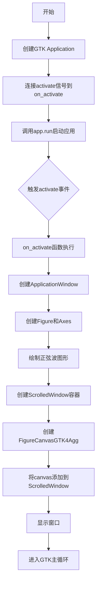

# `matplotlib\galleries\examples\user_interfaces\embedding_in_gtk4_sgskip.py` 详细设计文档

这是一个演示如何使用PyGObject将matplotlib的FigureCanvasGTK4Agg小部件嵌入到GTK4应用程序中的示例代码。程序创建一个GTK应用窗口，在其中显示一个包含正弦波图形的可滚动画布。

## 整体流程



## 类结构

```
Application (GTK4应用)
├── ApplicationWindow (GTK4窗口)
├── ScrolledWindow (GTK4滚动窗口)
└── FigureCanvasGTK4Agg (matplotlib GTK4Agg后端)
    └── Figure (matplotlib图形)
        └── Axes (坐标轴)
```

## 全局变量及字段


### `app`
    
GTK应用程序实例，用于管理应用程序的生命周期和激活事件

类型：`Gtk.Application`
    


    

## 全局函数及方法


### `on_activate`

这是一个 GTK 应用程序的激活回调函数，用于在 GTK4 窗口中嵌入并显示 matplotlib 绘制的正弦波图表。

参数：

-  `app`：`Gtk.Application`，GTK 应用程序实例，该函数作为 `activate` 信号的处理器

返回值：`None`，无返回值

#### 流程图

```mermaid
flowchart TD
    A[开始 on_activate] --> B[接收 app 参数: Gtk.Application]
    B --> C[创建 Gtk.ApplicationWindow]
    C --> D[设置窗口默认大小 400x300]
    D --> E[设置窗口标题 "Embedded in GTK4"]
    E --> F[创建 matplotlib Figure figsize=(5,4) dpi=100]
    F --> G[创建子图 ax = fig.add_subplot]
    G --> H[生成正弦波数据 t=0到3.0]
    H --> I[绘制正弦曲线 ax.plot]
    I --> J[创建 Gtk.ScrolledWindow]
    J --> K[设置 ScrolledWindow 边距上下左右各10]
    K --> L[创建 FigureCanvasGTK4Agg 包装 Figure]
    L --> M[设置 canvas 大小请求 800x600]
    M --> N[将 canvas 添加为 ScrolledWindow 的子组件]
    N --> O[调用 win.present 显示窗口]
    O --> P[结束]
```

#### 带注释源码

```python
def on_activate(app):
    """
    GTK 应用程序激活回调函数
    用于创建嵌入 matplotlib 图表的 GTK4 窗口
    """
    # 创建一个 GTK 应用窗口，关联到应用程序
    win = Gtk.ApplicationWindow(application=app)
    # 设置窗口默认尺寸为 400x300 像素
    win.set_default_size(400, 300)
    # 设置窗口标题
    win.set_title("Embedded in GTK4")

    # 创建 matplotlib 图形对象， figsize 指定尺寸，dpi 指定分辨率
    fig = Figure(figsize=(5, 4), dpi=100)
    # 在图形中添加一个子图（axes）
    ax = fig.add_subplot()
    # 生成时间序列数据：从 0 到 3.0，步长 0.01
    t = np.arange(0.0, 3.0, 0.01)
    # 计算正弦波数据：2*pi*t 的正弦值
    s = np.sin(2*np.pi*t)
    # 在子图上绘制正弦曲线
    ax.plot(t, s)

    # 创建一个带有滚动条的容器窗口
    # margin_top/bottom/start/end 设置内容与滚动条之间的边距
    sw = Gtk.ScrolledWindow(margin_top=10, margin_bottom=10,
                            margin_start=10, margin_end=10)
    # 将 ScrolledWindow 设置为窗口的子组件
    win.set_child(sw)

    # 创建支持 GTK4 的 matplotlib 画布，包装 Figure 对象
    # FigureCanvas 继承自 Gtk.DrawingArea
    canvas = FigureCanvas(fig)
    # 设置画布的最小尺寸请求为 800x600
    canvas.set_size_request(800, 600)
    # 将画布设置为 ScrolledWindow 的子组件（内容区域）
    sw.set_child(canvas)

    # 呈现并显示窗口
    win.present()
```

## 关键组件


### Gtk.Application

GTK4应用对象，管理应用生命周期，application_id为'org.matplotlib.examples.EmbeddingInGTK4'，通过connect连接activate信号启动应用。

### Gtk.ApplicationWindow

GTK4应用窗口，设置为默认大小400x300，标题为"Embedded in GTK4"，作为所有GTK组件的容器。

### matplotlib.figure.Figure

matplotlib图表对象，创建大小为5x4英寸、DPI为100的图表，用于承载绘图内容。

### matplotlib.axes.Axes

图表的坐标轴对象，通过add_subplot()创建，用于绘制数据曲线。

### numpy.ndarray

使用numpy.arange生成的时间序列数据，范围0.0到3.0，步长0.01，作为正弦波的x轴数据。

### 正弦波数据计算

使用numpy.sin(2*np.pi*t)计算正弦波y轴数据，频率为1Hz，用于在图表上绘制波形。

### Gtk.ScrolledWindow

滚动窗口容器，设置上下左右边距各为10像素，用于包含画布并提供滚动功能。

### FigureCanvasGTK4Agg

GTK4Agg后端的画布对象，继承自Gtk.DrawingArea，将matplotlib图表渲染为GTK4可显示的部件。

### 应用入口与事件循环

通过app.run(None)启动GTK主事件循环，处理用户交互和窗口渲染事件。


## 问题及建议


### 已知问题

- 窗口默认尺寸（400x300）小于画布请求尺寸（800x600），导致滚动窗口在小窗口下立即显示滚动条，初始用户体验不佳
- 缺少对 `gi.require_version()` 返回值的错误处理，若GTK4不可用会导致静默失败或导入错误
- 缺少对Matplotlib后端加载失败的错误处理，`FigureCanvasGTK4Agg` 可能因环境问题导入失败
- 硬编码的窗口尺寸、边距和绘图数据降低了代码的可复用性
- `on_activate` 回调函数未处理窗口关闭事件，可能导致资源未正确释放
- 缺少类型注解（type hints），降低了代码的可维护性和IDE支持
- 缺少函数文档字符串，不利于后续维护和理解
- `np.sin(2*np.pi*t)` 表达式可读性欠佳，缺乏适当的空格分隔

### 优化建议

- 将窗口默认尺寸调整为至少800x600以匹配画布请求尺寸，或将画布请求尺寸减小
- 添加版本检查失败的异常捕获，处理 `gi.require_version()` 可能抛出的 `ValueError`
- 封装画布创建和数据绘图逻辑为独立函数，添加必要的try-except异常处理
- 将硬编码配置值（尺寸、边距、标题等）提取为常量或配置参数
- 为 `on_activate` 函数添加类型注解 `(app: Gtk.Application) -> None`
- 添加窗口销毁信号处理：使用 `win.connect('destroy', lambda _: app.quit())`
- 考虑添加 DPI 感知处理：`fig.set_dpi(gtk_widget_get_scale_factor() * 100)`
- 为主函数添加 docstring 说明应用功能


## 其它


### 设计目标与约束

本示例旨在演示如何将matplotlib图表嵌入到GTK4应用程序中。设计目标包括：1）使用GTK4的新API和pygobject绑定；2）将matplotlib渲染的画布放入Gtk.ScrolledWindow实现可滚动显示；3）创建基本的正弦波数据可视化。约束条件为需要安装pygobject、GTK4库和matplotlib，且仅适用于支持GTK4的操作系统。

### 错误处理与异常设计

代码中未包含显式的错误处理机制。潜在异常包括：1）gi.require_version('Gtk', '4.0')可能抛出gi.VersionError若系统GTK版本不足；2）FigureCanvasGTK4Agg导入失败若matplotlib后端不可用；3）numpy.arange和numpy.sin在内存不足时可能引发MemoryError。建议在实际应用中添加强制版本检查、异常捕获和用户友好的错误提示。

### 数据流与状态机

数据流：numpy生成时间序列数据(0.0-3.0秒) → numpy计算正弦值 → matplotlib.axes.Axes.plot()绑定数据到图形 → FigureCanvasGTK4Agg渲染Figure为GTK可绘制区域 → Gtk.ScrolledWindow显示画布。状态机：Application启动 → activate信号触发 → 创建窗口和组件 → 展示窗口 → 事件循环运行。

### 外部依赖与接口契约

主要依赖：gi(Pygobject)用于GTK绑定、numpy用于数值计算、matplotlib用于图表渲染、GTK4库本身。接口契约：FigureCanvasGTK4Agg接受Figure对象作为构造参数，返回实现了Gtk.DrawingArea接口的widget；Gtk.Application.run()接受None或命令行参数列表；on_activate回调接受Application实例作为唯一参数。

### 性能考虑

当前实现使用静态数据生成，一次性绘制。在大数据量场景下性能瓶颈包括：numpy数组内存占用、Gtk.DrawingArea重绘开销、ScrolledWindow滚动时重新渲染。建议：对于实时数据使用blitting技术仅更新变化区域；大数据集考虑降采样或使用Line2D的set_data方法而非重绘。

### 平台兼容性

本示例仅适用于Linux和其他支持GTK4的Unix-like系统。Windows和macOS原生不支持GTK4，需通过MSYS2或第三方GTK端口运行。代码使用GTK4新API，与GTK3不完全兼容。Python版本建议3.8+以获得最佳兼容性。

### 用户界面交互流程

用户启动应用 → Gtk.Application激活 → on_activate回调执行 → 创建Gtk.ApplicationWindow → 设置窗口属性 → 创建Figure和Axes → 生成并绑定数据 → 创建ScrolledWindow → 创建FigureCanvas并设为ScrolledWindow子控件 → 窗口呈现给用户 → 应用进入GTK主事件循环等待用户交互(窗口关闭、调整大小、滚动等)。

### 配置与扩展性

当前硬编码配置：窗口默认尺寸(400x300)、画布尺寸(800x600)、Figure大小(5x4英寸)、DPI(100)。可通过参数化on_activate函数或创建配置类实现可配置化。扩展方向：添加交互工具栏(放大、缩小、保存)、支持多子图布局、添加动态数据更新定时器、实现图表类型切换(柱状图、散点图等)。

    