# `matplotlib\galleries\examples\user_interfaces\embedding_in_qt_sgskip.py` 详细设计文档

一个使用Qt框架嵌入Matplotlib画布的GUI应用程序，通过两个画布（静态和动态）展示数学函数图形，动态画布使用定时器实现实时更新显示正弦波形。

## 整体流程

```mermaid
graph TD
    A[程序启动] --> B{检查QApplication实例是否存在}
    B -- 否 --> C[创建新的QApplication]
    B -- 是 --> D[复用现有实例]
    C --> E[创建ApplicationWindow实例]
    D --> E
    E --> F[调用app.show显示主窗口]
    F --> G[激活并提升窗口]
    G --> H[进入Qt事件循环 qapp.exec]
    H --> I[初始化时创建两个定时器]
    I --> J[data_timer每1ms调用_update_ydata更新数据]
    I --> K[drawing_timer每20ms调用_update_canvas重绘]
    J --> L[数据更新: ydata = sin(xdata + time.time())]
    K --> M[画布更新: set_data + draw_idle]
```

## 类结构

```
ApplicationWindow (QtWidgets.QMainWindow)
├── 静态画布分支
│   ├── static_canvas (FigureCanvas)
│   ├── static_ax (Axes)
│   └── NavigationToolbar
└── 动态画布分支
    ├── dynamic_canvas (FigureCanvas)
    ├── dynamic_ax (Axes)
    ├── _line (Line2D)
    ├── xdata (ndarray)
    ├── ydata (ndarray)
    ├── data_timer (Timer)
    └── drawing_timer (Timer)
```

## 全局变量及字段


### `qapp`
    
Qt应用程序实例，用于管理Qt应用程序的控制流和主要设置

类型：`QtWidgets.QApplication`
    


### `app`
    
ApplicationWindow应用主窗口实例，包含主UI界面和绘图画布

类型：`ApplicationWindow`
    


### `ApplicationWindow._main`
    
主窗口中央部件，作为所有子部件的容器

类型：`QtWidgets.QWidget`
    


### `ApplicationWindow._static_ax`
    
静态图形坐标轴，用于显示静态的tan(t)函数图形

类型：`matplotlib.axes.Axes`
    


### `ApplicationWindow._dynamic_ax`
    
动态图形坐标轴，用于显示动态更新的正弦波曲线

类型：`matplotlib.axes.Axes`
    


### `ApplicationWindow.xdata`
    
x轴数据数组，从0到10共101个等间距点

类型：`numpy.ndarray`
    


### `ApplicationWindow.ydata`
    
y轴数据数组，存储随时间变化的正弦波数据

类型：`numpy.ndarray`
    


### `ApplicationWindow._line`
    
动态曲线线条对象，表示坐标轴上的正弦波曲线

类型：`matplotlib.lines.Line2D`
    


### `ApplicationWindow.data_timer`
    
数据更新定时器，间隔1毫秒触发数据更新回调

类型：`matplotlib.backend_bases.Timer`
    


### `ApplicationWindow.drawing_timer`
    
画布重绘定时器，间隔20毫秒触发画布重绘回调

类型：`matplotlib.backend_bases.Timer`
    
    

## 全局函数及方法


### `if __name__ == "__main__":` (主程序入口)

这是程序的主入口点，负责初始化Qt应用程序并启动GUI。虽然没有独立的命令行参数处理函数，但通过`sys.argv`将命令行参数传递给Qt应用程序。

参数：

- 无独立参数（通过`sys.argv`获取命令行参数）

返回值：无返回值（启动Qt事件循环）

#### 流程图

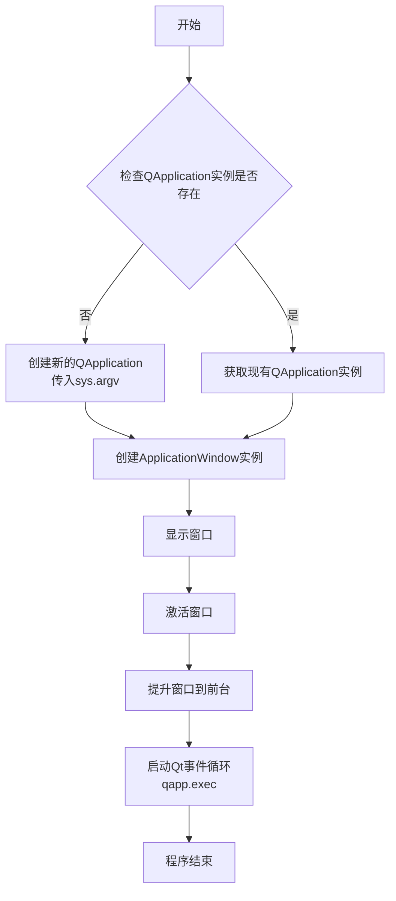

#### 带注释源码

```python
if __name__ == "__main__":
    # 检查是否已经存在运行的QApplication实例（例如从IDE运行时）
    # 这样可以避免在同一个程序中创建多个QApplication导致崩溃
    qapp = QtWidgets.QApplication.instance()
    
    # 如果没有现成的QApplication实例，则创建一个新的
    # sys.argv 通常包含命令行参数，会被Qt用于设置应用程序属性
    # 例如：应用程序名称、图标、样式等
    if not qapp:
        qapp = QtWidgets.QApplication(sys.argv)

    # 创建主应用程序窗口实例
    app = ApplicationWindow()
    
    # 显示窗口（默认隐藏，需要显式调用show）
    app.show()
    
    # 激活窗口，使其获得焦点
    app.activateWindow()
    
    # 将窗口提升到所有窗口的前面
    app.raise_()
    
    # 启动Qt事件循环，开始处理GUI事件
    # 程序将在此处阻塞，直到用户关闭应用程序
    qapp.exec()
```

#### 补充说明

| 项目 | 描述 |
|------|------|
| **sys.argv 用途** | 将命令行参数传递给Qt系统，用于应用程序的初始化配置（如应用程序名称、样式主题等） |
| **QApplication.instance()** | 单例模式获取Qt应用程序实例，确保整个进程只有一个QApplication |
| **activateWindow()** | 在多窗口环境中激活当前窗口 |
| **raise_()** | 将窗口提升到所有其他窗口的顶层 |
| **exec() vs exec_()** | Qt 5中使用exec()，Qt 6中使用exec_()以避免与Python关键字冲突 |


### `time.time`

获取当前时间的时间戳（Unix 时间戳），返回自 1970-01-01 00:00:00（UTC）以来经过的秒数作为一个浮点数。在本代码中，它被用于动态计算正弦波的相位偏移，以实现图形的实时动画效果。

参数：

- 无

返回值：`float`，返回自纪元以来的当前时间（秒），通常精确到微秒级别。

#### 流程图

该流程图展示了 `time.time` 在 `ApplicationWindow._update_ydata` 方法中的调用流程及其内部逻辑（简化版）。

```mermaid
graph TD
    subgraph ApplicationWindow
    A[_update_ydata 方法] -->|调用| B(time.time)
    end
    
    subgraph time 模块 (Python 标准库)
    B --> C{获取系统时钟}
    C --> D[返回自 Epoch 后的秒数]
    end
    
    D --> E[作为参数参与 np.sin 计算]
    E --> F[更新 ydata]
    
    style B fill:#f9f,stroke:#333,stroke-width:2px
    style C fill:#ff9,stroke:#333,stroke-width:1px
```

#### 带注释源码

以下是 `time.time` 在项目中的导入及具体使用上下文：

```python
import time  # 1. 导入 Python 标准库中的 time 模块

class ApplicationWindow(QtWidgets.QMainWindow):
    # ... (类的初始化和其他方法)

    def _update_ydata(self):
        """
        更新动态图表的 Y 轴数据。
        利用正弦函数结合时间戳产生动态波形。
        """
        # 2. 调用 time.time() 获取当前时间戳（浮点数，单位：秒）
        #    这个值作为变量传入 np.sin，用于不断偏移正弦波的相位，从而产生移动效果
        self.ydata = np.sin(self.xdata + time.time())
```


### `ApplicationWindow.__init__`

这是Qt应用程序的主窗口类初始化方法，负责设置GUI界面、创建静态和动态图表、初始化定时器以实现动态数据更新和绘制。方法内部使用了NumPy的`linspace`函数生成时间序列数据，使用`tan`和`sin`函数计算数学曲线数据。

参数：

- `self`：隐含参数，类型为`ApplicationWindow`，表示类的实例本身

返回值：无（返回`None`），该方法为构造函数，仅执行初始化操作不返回任何值

#### 流程图

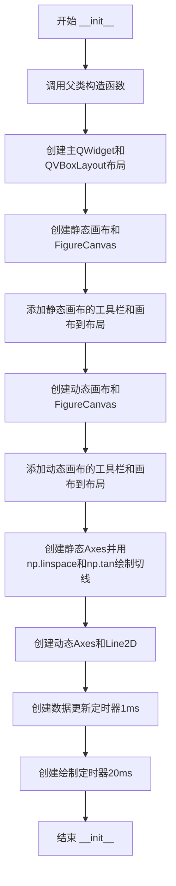

#### 带注释源码

```python
def __init__(self):
    # 调用父类QtWidgets.QMainWindow的构造函数，初始化Qt窗口基类
    super().__init__()
    # 创建主QWidget部件，作为窗口的中心部件
    self._main = QtWidgets.QWidget()
    # 设置主部件为中心部件
    self.setCentralWidget(self._main)
    # 创建垂直布局管理器
    layout = QtWidgets.QVBoxLayout(self._main)

    # 创建静态画布，使用Figure设置画布大小为5x3英寸
    static_canvas = FigureCanvas(Figure(figsize=(5, 3)))
    # 添加导航工具栏到布局（作为普通widget而非toolbar以兼容不同Qt绑定）
    layout.addWidget(NavigationToolbar(static_canvas, self))
    # 将静态画布添加到布局
    layout.addWidget(static_canvas)

    # 创建动态画布，同样大小为5x3英寸
    dynamic_canvas = FigureCanvas(Figure(figsize=(5, 3)))
    # 添加动态画布到布局
    layout.addWidget(dynamic_canvas)
    # 添加动态画布的导航工具栏
    layout.addWidget(NavigationToolbar(dynamic_canvas, self))

    # 获取静态画布的子图Axes对象
    self._static_ax = static_canvas.figure.subplots()
    # 使用np.linspace生成0到10之间等间距的501个点作为时间轴
    t = np.linspace(0, 10, 501)
    # 在静态Axes上绘制tan(t)曲线，使用"."标记
    self._static_ax.plot(t, np.tan(t), ".")

    # 获取动态画布的子图Axes对象
    self._dynamic_ax = dynamic_canvas.figure.subplots()
    # 使用np.linspace生成0到10之间等间距的101个点作为x数据
    self.xdata = np.linspace(0, 10, 101)
    # 初始化y数据
    self._update_ydata()
    # 创建Line2D对象并绑定到动态Axes，初始显示xdata和ydata
    self._line, = self._dynamic_ax.plot(self.xdata, self.ydata)
    # 创建数据更新定时器，间隔1毫秒，用于高频数据获取
    self.data_timer = dynamic_canvas.new_timer(1)
    # 添加回调函数_update_ydata到数据定时器
    self.data_timer.add_callback(self._update_ydata)
    # 启动数据更新定时器
    self.data_timer.start()
    # 创建绘制定时器，间隔20毫秒（50Hz刷新率）
    self.drawing_timer = dynamic_canvas.new_timer(20)
    # 添加回调函数_update_canvas到绘制定时器
    self.drawing_timer.add_callback(self._update_canvas)
    # 启动绘制定时器
    self.drawing_timer.start()
```

---

### `ApplicationWindow._update_ydata`

该方法用于更新动态图表的y轴数据，通过NumPy的`sin`函数计算随时间变化的正弦波形，实现数据动态演示效果。

参数：

- `self`：隐含参数，类型为`ApplicationWindow`，表示类的实例本身

返回值：无（返回`None`），该方法直接修改实例属性`self.ydata`的值

#### 流程图

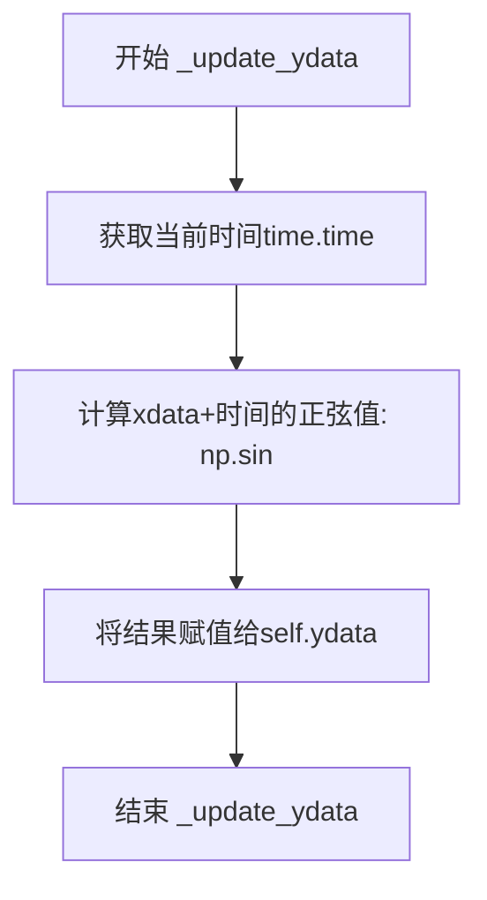

#### 带注释源码

```python
def _update_ydata(self):
    # 根据时间更新y数据：计算self.xdata与当前时间之和的正弦值
    # 这样可以使正弦波随时间推移而产生相位移动，形成波动效果
    self.ydata = np.sin(self.xdata + time.time())
```

---

### NumPy数值计算模块总结

在上述代码中，NumPy（`np`）主要使用了以下三个核心函数：

1. **np.linspace(start, stop, num)**：生成从start到stop之间等间距的num个样本点
   - 参数类型：start和stop为float或int，num为int
   - 返回类型：numpy.ndarray

2. **np.tan(x)**：计算输入数组x中每个元素的正切值
   - 参数类型：x为numpy.ndarray或类似数组对象
   - 返回类型：numpy.ndarray

3. **np.sin(x)**：计算输入数组x中每个元素的正弦值
   - 参数类型：x为numpy.ndarray或类似数组对象
   - 返回类型：numpy.ndarray

这些函数共同构成了该Qt数据可视化应用中的数值计算基础，提供了从数据生成到数学变换的完整支持。


### FigureCanvas

FigureCanvas 是 Matplotlib 的 Qt 后端画布类，负责在 Qt 应用程序中渲染 Matplotlib 图形，将 Figure 对象转换为 Qt 可显示的组件，并处理图形更新和交互事件。

参数：

- `figure`：`matplotlib.figure.Figure`，要渲染的 Matplotlib 图形对象
- `p`：`QtCore.QPaintDevice`，可选，绘制的 Qt 设备，默认为 None

返回值：`FigureCanvas`，返回创建的 Qt 后端画布实例

#### 流程图

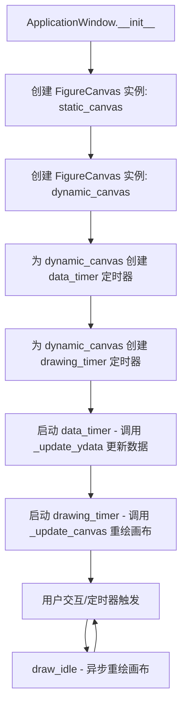

#### 带注释源码

```python
class ApplicationWindow(QtWidgets.QMainWindow):
    def __init__(self):
        super().__init__()
        self._main = QtWidgets.QWidget()
        self.setCentralWidget(self._main)
        layout = QtWidgets.QVBoxLayout(self._main)

        # 创建静态画布：FigureCanvas 接收 Figure 对象作为参数
        # figsize 参数指定图形大小（英寸）
        static_canvas = FigureCanvas(Figure(figsize=(5, 3)))
        
        # 添加导航工具栏（Qt 后端特有组件）
        layout.addWidget(NavigationToolbar(static_canvas, self))
        
        # 将画布添加到布局
        layout.addWidget(static_canvas)

        # 创建动态画布（用于实时数据可视化）
        dynamic_canvas = FigureCanvas(Figure(figsize=(5, 3)))
        layout.addWidget(dynamic_canvas)
        layout.addWidget(NavigationToolbar(dynamic_canvas, self))

        # 获取静态坐标轴并绑定数据
        self._static_ax = static_canvas.figure.subplots()
        t = np.linspace(0, 10, 501)
        self._static_ax.plot(t, np.tan(t), ".")

        # 获取动态坐标轴并绑定数据
        self._dynamic_ax = dynamic_canvas.figure.subplots()
        self.xdata = np.linspace(0, 10, 101)
        self._update_ydata()
        self._line, = self._dynamic_ax.plot(self.xdata, self.ydata)

        # data_timer: 1ms 间隔，用于快速更新数据
        # new_timer 方法是 FigureCanvas 提供的 Qt 定时器封装
        self.data_timer = dynamic_canvas.new_timer(1)
        self.data_timer.add_callback(self._update_ydata)
        self.data_timer.start()

        # drawing_timer: 20ms 间隔（约 50Hz），平衡 GUI 响应和性能
        self.drawing_timer = dynamic_canvas.new_timer(20)
        self.drawing_timer.add_callback(self._update_canvas)
        self.drawing_timer.start()

    def _update_ydata(self):
        """根据时间计算新的正弦波数据"""
        self.ydata = np.sin(self.xdata + time.time())

    def _update_canvas(self):
        """更新线条数据并触发画布重绘"""
        self._line.set_data(self.xdata, self.ydata)
        # draw_idle(): 异步重绘，仅在必要时重绘
        # 相对于同步的 draw() 方法，更适合高频更新场景
        self._line.figure.canvas.draw_idle()
```

---

### ApplicationWindow

Qt 主窗口类，封装了 Matplotlib 图形嵌入 Qt 应用程序的完整逻辑，包括静态和动态两种可视化模式。

参数（构造函数）：

- 无（继承自 QtWidgets.QMainWindow）

返回值：无

#### 流程图

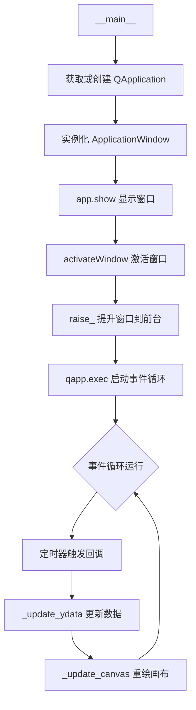

#### 带注释源码

```python
# 检查是否已存在 QApplication 实例（IDE 环境下可能已存在）
qapp = QtWidgets.QApplication.instance()
if not qapp:
    qapp = QtWidgets.QApplication(sys.argv)

app = ApplicationWindow()
app.show()
app.activateWindow()
app.raise_()
qapp.exec()  # 启动 Qt 事件循环
```

---

### 关键组件信息

| 组件名称 | 描述 |
|---------|------|
| FigureCanvas (backend_qtagg) | Matplotlib Qt 后端画布类，负责将 Figure 渲染到 Qt 控件中 |
| NavigationToolbar2QT | Qt 后端的导航工具栏，提供缩放、保存等交互功能 |
| Figure | Matplotlib 顶层图形容器，包含坐标轴、图例等元素 |
| QTimer (via new_timer) | Qt 定时器封装，用于驱动动态数据更新和重绘 |
| draw_idle() | 异步延迟重绘方法，避免频繁重绘导致的性能问题 |

---

### 潜在的技术债务或优化空间

1. **定时器精度问题**：使用 QTimer 的 Python 包装可能存在精度限制，对于亚毫秒级实时数据采集场景可能不足
2. **数据更新频率**：data_timer 设置为 1ms，但实际数据更新可能受 Python GIL 和计算复杂度限制
3. **内存管理**：定时器回调中创建的对象需确保及时释放，避免内存泄漏
4. **错误处理缺失**：缺少对 QApplication 实例创建失败、FigureCanvas 初始化异常等的处理

---

### 其它说明

- **设计目标**：演示在 Qt 应用程序中嵌入 Matplotlib 画布，支持静态绑图和动态数据可视化
- **约束**：需提前安装 matplotlib、numpy 及任一 Qt 绑定库（PyQt6/PySide6/PyQt5/PySide2）
- **错误处理**：当前实现未包含异常捕获机制
- **外部依赖**：matplotlib.backends.backend_qtagg、matplotlib.backends.qt_compat、numpy


### `NavigationToolbar`

`NavigationToolbar` 是 Matplotlib 的 Qt 后端提供的导航工具栏类，用于在 Qt 应用中为 Matplotlib 画布添加工具栏，提供交互式图形控制功能（如平移、缩放、保存图片等）。该类继承自 `matplotlib.backends.backend_qt.NavigationToolbar2QT`，在代码中作为 `NavigationToolbar2QT` 的别名被导入和使用。

参数：

-  `canvas`：`FigureCanvas`，Matplotlib 的 Qt 画布对象，工具栏将关联到此画布并提供交互控制
-  `parent`：`QWidget`，Qt 父 widget 对象，通常为应用程序的主窗口

返回值：`NavigationToolbar2QT`，返回导航工具栏实例，是一个 QWidget 子类，可直接添加到 Qt 布局中进行显示

#### 流程图

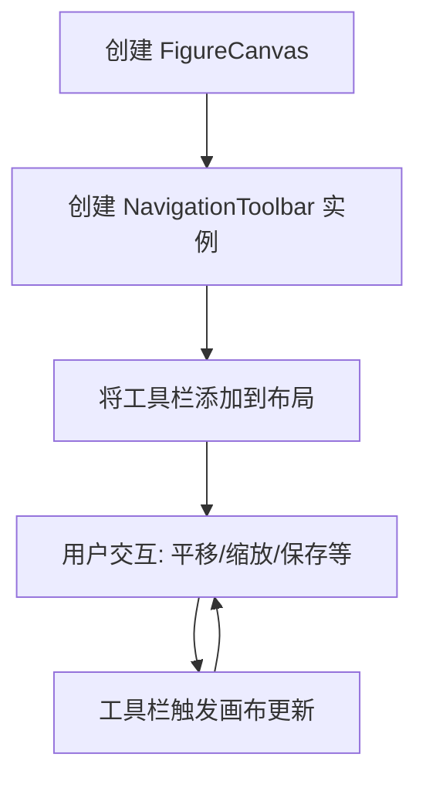

#### 带注释源码

```
# 从 Matplotlib Qt 后端导入导航工具栏类
# NavigationToolbar2QT 是 Qt 实现的导航工具栏基类
# 此处作为 NavigationToolbar 别名引入，便于使用
from matplotlib.backends.backend_qtagg import NavigationToolbar2QT as NavigationToolbar

# 在 ApplicationWindow.__init__ 中使用 NavigationToolbar
# 创建静态画布的工具栏
layout.addWidget(NavigationToolbar(static_canvas, self))
# 参数说明:
#   - static_canvas: FigureCanvas 实例，关联的 Matplotlib 画布
#   - self: 父窗口对象（ApplicationWindow 继承自 QMainWindow）

# 创建动态画布的工具栏
layout.addWidget(NavigationToolbar(dynamic_canvas, self))

# NavigationToolbar 提供的标准功能包括:
# - Home: 返回初始视图
# - Back: 后退到上一个视图
# - Forward: 前进到下一个视图
# - Pan: 拖动平移模式
# - Zoom: 矩形缩放模式
# - Subplots: 调整子图布局
# - Save: 保存图表为图像文件
```


### `ApplicationWindow.__init__`

这是应用程序的主窗口类构造函数，初始化Qt主窗口并设置两个Matplotlib画布：一个用于显示静态图表，另一个用于显示动态更新的正弦波图形。构造函数中创建了布局、两个FigureCanvas画布、导航工具栏以及两个定时器（分别用于数据更新和画布重绘）。

参数：

- 无显式参数（继承自QtWidgets.QMainWindow）

返回值：`None`，构造函数无返回值

#### 流程图

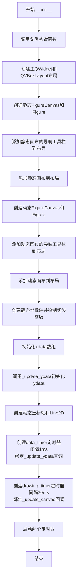

#### 带注释源码

```python
def __init__(self):
    # 调用父类QtWidgets.QMainWindow的构造函数，初始化Qt窗口
    super().__init__()
    
    # 创建一个主QWidget作为中心部件
    self._main = QtWidgets.QWidget()
    # 将主部件设置为窗口的中心部件
    self.setCentralWidget(self._main)
    
    # 创建垂直布局管理器
    layout = QtWidgets.QVBoxLayout(self._main)

    # 创建静态画布， figsize=(5, 3) 表示画布大小为5x3英寸
    static_canvas = FigureCanvas(Figure(figsize=(5, 3)))
    
    # 将静态画布的导航工具栏添加到布局
    # 注意：这里直接作为普通widget添加，而不是使用addToolBar
    # 因为PyQt6与其他绑定的addToolBar存在不兼容问题
    layout.addWidget(NavigationToolbar(static_canvas, self))
    
    # 将静态画布添加到布局
    layout.addWidget(static_canvas)

    # 创建动态画布
    dynamic_canvas = FigureCanvas(Figure(figsize=(5, 3)))
    
    # 添加动态画布到布局
    layout.addWidget(dynamic_canvas)
    
    # 添加动态画布的导航工具栏到布局
    layout.addWidget(NavigationToolbar(dynamic_canvas, self))

    # 获取静态坐标轴并绘制切线函数
    self._static_ax = static_canvas.figure.subplots()
    t = np.linspace(0, 10, 501)  # 创建从0到10的501个点
    self._static_ax.plot(t, np.tan(t), ".")  # 绘制切线函数，使用点标记

    # 获取动态坐标轴
    self._dynamic_ax = dynamic_canvas.figure.subplots()
    
    # 初始化xdata数组，从0到10共101个点
    self.xdata = np.linspace(0, 10, 101)
    
    # 调用_update_ydata初始化ydata数据
    self._update_ydata()
    
    # 创建Line2D对象用于动态绘图
    self._line, = self._dynamic_ax.plot(self.xdata, self.ydata)
    
    # 创建数据更新定时器，间隔为1ms（尽可能快地获取数据）
    # 注意：定时器必须是self的属性，否则会被垃圾回收器清理
    self.data_timer = dynamic_canvas.new_timer(1)
    self.data_timer.add_callback(self._update_ydata)
    self.data_timer.start()
    
    # 创建绘图定时器，间隔为20ms（50Hz刷新率）
    # 50Hz的刷新率足以让GUI感觉流畅，
    # 同时不会因需要处理过多事件而导致GUI过载
    self.drawing_timer = dynamic_canvas.new_timer(20)
    self.drawing_timer.add_callback(self._update_canvas)
    self.drawing_timer.start()
```

---

### `ApplicationWindow._update_ydata`

此方法用于更新动态图表的y轴数据，通过将正弦波与当前时间相加来产生移动效果。它作为data_timer定时器的回调函数，每隔1ms被调用一次，以实现数据的实时更新。

参数：

- 无参数

返回值：`None`，无返回值

#### 流程图

```mermaid
flowchart TD
    A[开始 _update_ydata] --> B[获取当前时间time.time]
    B --> C[计算新ydata<br/>np.sin(self.xdata + 当前时间)]
    C --> D[将结果存储到self.ydata]
    D --> E[结束]
```

#### 带注释源码

```python
def _update_ydata(self):
    # Shift the sinusoid as a function of time.
    # 随着时间移动正弦波
    # 使用time.time()获取当前时间戳，使正弦波随时间平移
    self.ydata = np.sin(self.xdata + time.time())
```

---

### `ApplicationWindow._update_canvas`

此方法用于更新动态图表的显示，作为drawing_timer定时器的回调函数，每隔20ms（50Hz）被调用一次。它使用`draw_idle()`方法进行高效的异步重绘，比同步的`draw()`方法更安全且性能更好。

参数：

- 无参数

返回值：`None`，无返回值

#### 流程图

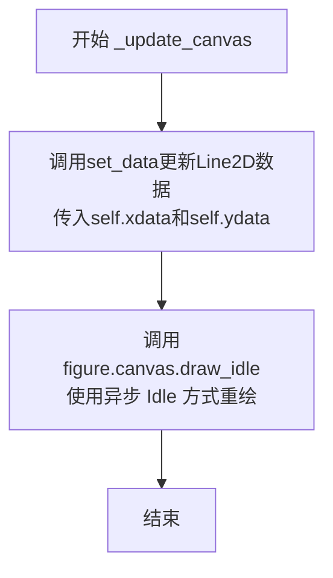

#### 带注释源码

```python
def _update_canvas(self):
    # 使用set_data方法更新线条的数据点
    self._line.set_data(self.xdata, self.ydata)
    
    # 使用draw_idle()进行异步重绘
    # 对于大多数绘图频率，使用同步的draw()方法是安全的，
    # 但使用draw_idle()更安全，因为它会在下一次GUI空闲时重绘，
    # 避免过于频繁的重绘导致性能问题
    self._line.figure.canvas.draw_idle()
```


### Figure

Figure 是 Matplotlib 的核心图形类，用于创建和管理图表对象。在本代码中，Figure 实例作为 Qt 应用中的画布核心，负责承载图形内容并与 FigureCanvas 结合实现图形渲染。

参数：

- 无（构造函数参数通过 kwargs 传入）

返回值：`Figure` 实例

#### 流程图

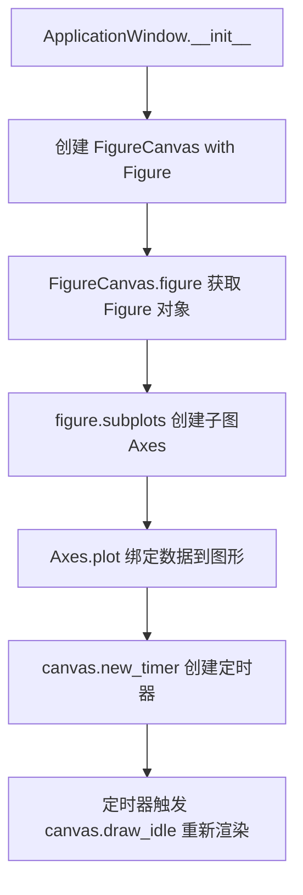

#### 带注释源码

```python
# 在 ApplicationWindow.__init__ 中创建静态画布
static_canvas = FigureCanvas(Figure(figsize=(5, 3)))  # 创建 5x3 英寸的 Figure

# 在 ApplicationWindow.__init__ 中创建动态画布
dynamic_canvas = FigureCanvas(Figure(figsize=(5, 3)))

# 获取 Figure 对象并创建子图
self._static_ax = static_canvas.figure.subplots()  # 调用 Figure.subplots() 方法
self._dynamic_ax = dynamic_canvas.figure.subplots()

# 访问 Figure 的 canvas 属性进行绘制
self._line.figure.canvas.draw_idle()  # Figure.canvas 返回关联的 FigureCanvas
```

### FigureCanvas

FigureCanvas 是将 Figure 渲染到 Qt 控件的画布类，负责图形显示和交互。

参数：

- `figure`：`Figure`，要渲染的图形对象

返回值：`FigureCanvas` 实例

#### 流程图

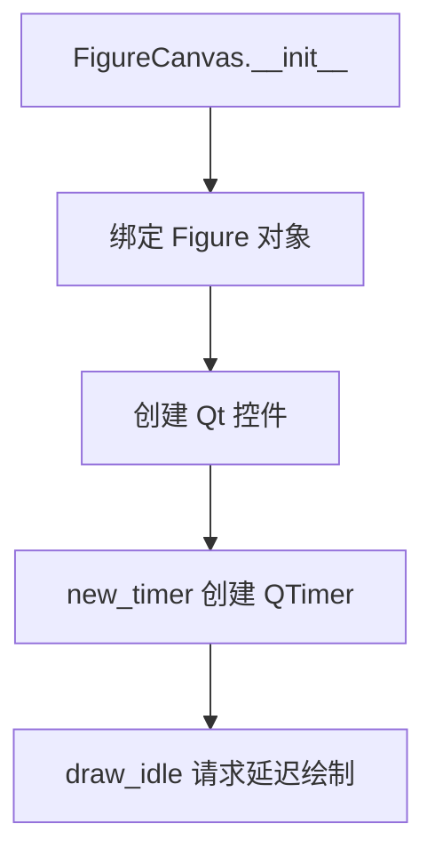

#### 带注释源码

```python
# 创建静态画布
static_canvas = FigureCanvas(Figure(figsize=(5, 3)))
layout.addWidget(static_canvas)  # 添加到 Qt 布局

# 创建动态画布
dynamic_canvas = FigureCanvas(Figure(figsize=(5, 3)))
layout.addWidget(dynamic_canvas)

# 使用 canvas 的 timer 功能
self.data_timer = dynamic_canvas.new_timer(1)  # 创建 1ms 间隔的定时器
self.data_timer.add_callback(self._update_ydata)  # 添加数据更新回调
self.data_timer.start()  # 启动定时器
```

### ApplicationWindow

ApplicationWindow 是主应用窗口类，继承自 QtWidgets.QMainWindow，负责管理整个 Qt 应用的图形界面和动态更新逻辑。

参数：

- 无

返回值：`ApplicationWindow` 实例

#### 流程图

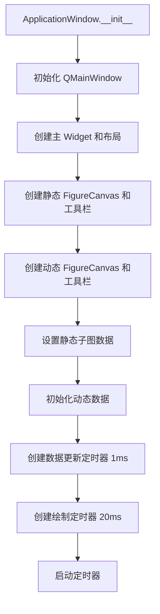

#### 带注释源码

```python
class ApplicationWindow(QtWidgets.QMainWindow):
    def __init__(self):
        super().__init__()
        self._main = QtWidgets.QWidget()
        self.setCentralWidget(self._main)
        layout = QtWidgets.QVBoxLayout(self._main)

        # 创建静态画布（只绘制一次）
        static_canvas = FigureCanvas(Figure(figsize=(5, 3)))
        layout.addWidget(NavigationToolbar(static_canvas, self))
        layout.addWidget(static_canvas)

        # 创建动态画布（持续更新）
        dynamic_canvas = FigureCanvas(Figure(figsize=(5, 3)))
        layout.addWidget(dynamic_canvas)
        layout.addWidget(NavigationToolbar(dynamic_canvas, self))

        # 设置静态子图
        self._static_ax = static_canvas.figure.subplots()
        t = np.linspace(0, 10, 501)
        self._static_ax.plot(t, np.tan(t), ".")

        # 设置动态子图
        self._dynamic_ax = dynamic_canvas.figure.subplots()
        self.xdata = np.linspace(0, 10, 101)
        self._update_ydata()
        self._line, = self._dynamic_ax.plot(self.xdata, self.ydata)

        # 数据更新定时器（1ms 间隔，尽可能快速获取数据）
        self.data_timer = dynamic_canvas.new_timer(1)
        self.data_timer.add_callback(self._update_ydata)
        self.data_timer.start()

        # 绘制定时器（20ms 间隔，约 50Hz，平衡流畅性和性能）
        self.drawing_timer = dynamic_canvas.new_timer(20)
        self.drawing_timer.add_callback(self._update_canvas)
        self.drawing_timer.start()

    def _update_ydata(self):
        """更新动态图形的数据（正弦波随时间移动）"""
        self.ydata = np.sin(self.xdata + time.time())

    def _update_canvas(self):
        """更新画布显示"""
        self._line.set_data(self.xdata, self.ydata)
        # 使用 draw_idle() 进行延迟绘制，比同步 draw() 更安全
        self._line.figure.canvas.draw_idle()
```


### `ApplicationWindow.__init__`

该方法是Qt主窗口的初始化方法，负责设置UI布局、创建静态和动态Matplotlib画布、配置导航工具栏、绑定定时器以实现数据实时更新与绘制。

参数：

- `self`：实例方法隐含参数，表示当前`ApplicationWindow`类的实例

返回值：无（`None`），构造函数不返回任何值，仅完成对象初始化

#### 流程图

```mermaid
flowchart TD
    A[开始 __init__] --> B[调用父类 QMainWindow 初始化]
    B --> C[创建主 QWidget 和垂直布局]
    C --> D[创建静态 FigureCanvas 和 Figure]
    D --> E[添加静态画布的导航工具栏和画布到布局]
    E --> F[创建动态 FigureCanvas 和 Figure]
    F --> G[添加动态画布到布局和导航工具栏]
    G --> H[在静态画布上绘制 tan(t) 静态曲线]
    H --> I[在动态画布上设置 Line2D 初始数据]
    I --> J[创建数据更新定时器 1ms 间隔]
    J --> K[创建绘制更新定时器 20ms 间隔]
    K --> L[启动两个定时器]
    L --> M[结束 __init__]
```

#### 带注释源码

```python
def __init__(self):
    # 调用父类 QtWidgets.QMainWindow 的初始化方法
    super().__init__()
    
    # 创建主中央部件
    self._main = QtWidgets.QWidget()
    # 将主部件设置为中央部件
    self.setCentralWidget(self._main)
    # 创建垂直布局管理器
    layout = QtWidgets.QVBoxLayout(self._main)

    # ========== 静态画布部分 ==========
    # 创建静态画布，图形尺寸为 5x3 英寸
    static_canvas = FigureCanvas(Figure(figsize=(5, 3)))
    # 添加导航工具栏（作为普通 widget，因 PyQt6 兼容性问题）
    layout.addWidget(NavigationToolbar(static_canvas, self))
    # 将静态画布添加到布局
    layout.addWidget(static_canvas)

    # ========== 动态画布部分 ==========
    # 创建动态画布，图形尺寸为 5x3 英寸
    dynamic_canvas = FigureCanvas(Figure(figsize=(5, 3)))
    # 添加动态画布到布局
    layout.addWidget(dynamic_canvas)
    # 添加动态画布的导航工具栏
    layout.addWidget(NavigationToolbar(dynamic_canvas, self))

    # ========== 静态数据绘图 ==========
    # 获取静态画布的子图 axes
    self._static_ax = static_canvas.figure.subplots()
    # 生成 0-10 范围的 501 个采样点
    t = np.linspace(0, 10, 501)
    # 绘制 tan(t) 散点图
    self._static_ax.plot(t, np.tan(t), ".")

    # ========== 动态数据绘图准备 ==========
    # 获取动态画布的子图 axes
    self._dynamic_ax = dynamic_canvas.figure.subplots()
    # 生成 0-10 范围的 101 个 x 数据点
    self.xdata = np.linspace(0, 10, 101)
    # 初始化 y 数据
    self._update_ydata()
    # 创建 Line2D 对象并绑定到动态 axes
    self._line, = self._dynamic_ax.plot(self.xdata, self.ydata)
    # 注意：定时器必须是 self 的属性，防止被垃圾回收器回收

    # ========== 数据更新定时器 (高频) ==========
    # 创建 1ms 间隔的定时器用于数据更新（尽可能快速获取数据）
    self.data_timer = dynamic_canvas.new_timer(1)
    # 添加数据更新回调函数
    self.data_timer.add_callback(self._update_ydata)
    # 启动数据更新定时器
    self.data_timer.start()

    # ========== 绘制更新定时器 (50Hz) ==========
    # 创建 20ms 间隔的定时器用于绘制更新 (50Hz)
    self.drawing_timer = dynamic_canvas.new_timer(20)
    # 添加画布绘制回调函数
    self.drawing_timer.add_callback(self._update_canvas)
    # 启动绘制更新定时器
    self.drawing_timer.start()
```


### `ApplicationWindow._update_ydata`

该私有方法用于根据当前时间动态更新正弦波的Y轴数据，使静态的正弦曲线随时间推移产生水平平移的动画效果。

参数：

- `self`：`ApplicationWindow`，调用此方法的窗口实例，用于访问类属性 `xdata` 和 `ydata`

返回值：`None`，该方法为void方法，不返回任何值，直接修改实例属性 `self.ydata`

#### 流程图

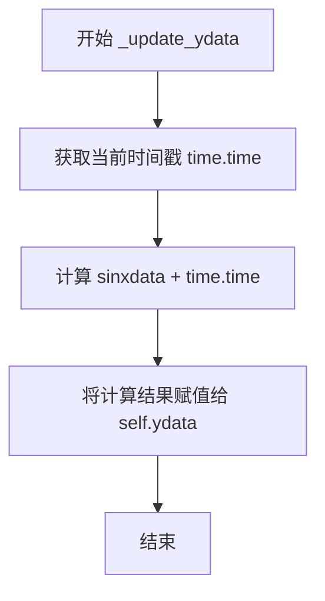

#### 带注释源码

```python
def _update_ydata(self):
    # 根据时间偏移正弦波，实现波形的动态移动效果
    # self.xdata: numpy数组，存储x轴数据点（0到10之间的101个点）
    # time.time(): 返回当前Unix时间戳（浮点数）
    # np.sin(): 对self.xdata + time.time()的结果进行正弦运算
    # 每次调用时由于time.time()不同，产生的正弦波相位不同
    # 从而实现波形随时间水平移动的视觉效果
    self.ydata = np.sin(self.xdata + time.time())
```


### `ApplicationWindow._update_canvas`

更新Line2D数据并触发画布重绘的私有方法，用于在定时器回调中刷新动态图形的显示内容。

参数：
- 无（仅使用 `self` 实例属性）

返回值：`None`，无返回值（Python 方法默认返回 None）

#### 流程图

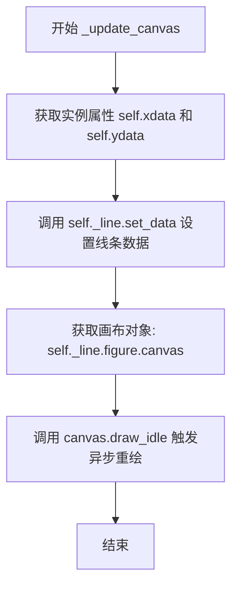

#### 带注释源码

```python
def _update_canvas(self):
    """
    更新Line2D数据并触发画布重绘。
    
    该方法在 drawing_timer (20ms 周期) 回调中被调用，
    负责将最新的数据应用到图形线条并触发重绘。
    """
    # 将 xdata 和 ydata 设置到 Line2D 对象
    # self.xdata: numpy 数组，包含 x 轴数据点
    # self.ydata: numpy 数组，包含 y 轴数据点（随时间变化）
    self._line.set_data(self.xdata, self.ydata)
    
    # 触发画布的异步重绘
    # draw_idle() 是异步绘制方法，比同步的 draw() 更加高效
    # 它会在下一个适当的时间进行重绘，避免频繁的绘制操作
    # 注释建议：对于大多数绘制频率，使用同步 draw() 是安全的，
    # 但 draw_idle() 更加安全，能避免 GUI 过载
    self._line.figure.canvas.draw_idle()
```

## 关键组件


### Qt应用程序框架

Qt主窗口类ApplicationWindow，继承自QtWidgets.QMainWindow，负责创建和管理整个Qt应用程序的生命周期、窗口布局以及事件循环。

### Matplotlib嵌入组件

FigureCanvas和Figure类，负责在Qt环境中渲染Matplotlib图形，将Matplotlib的绘图能力与Qt的GUI框架进行桥接。

### 静态图表组件

static_canvas和_static_ax，用于显示静态的tan函数图形，数据在初始化时固定，不随时间变化。

### 动态图表组件

dynamic_canvas和_dynamic_ax，配合Line2D对象，用于显示随时间变化的正弦波图形，支持实时数据更新和重绘。

### 数据更新定时器

data_timer，使用dynamic_canvas.new_timer(1)创建，周期为1毫秒，负责以最快速度获取最新的正弦波数据并更新ydata属性。

### 绘图更新定时器

drawing_timer，使用dynamic_canvas.new_timer(20)创建，周期为20毫秒（50Hz），负责调用draw_idle()方法更新画布，实现平滑的GUI动画效果。

### 导航工具栏

NavigationToolbar2QT，提供交互式工具条，支持缩放、平移等Matplotlib图形的交互操作。

### 数据模型

xdata和ydata属性，存储动态图表的横坐标和纵坐标数据，其中xdata为固定的时间序列，ydata随time.time()动态更新。


## 问题及建议


### 已知问题

- **缺少资源清理机制**：程序退出时未停止 `data_timer` 和 `drawing_timer`，可能导致后台线程继续运行或资源未释放
- **硬编码的魔法数字**：画布尺寸 `(5, 3)`、数据点数量 `501`、`101`、计时器间隔 `1ms` 和 `20ms` 等数值散落在代码中，缺乏可配置性
- **无错误处理**：缺少对 `np.linspace`、`new_timer`、Qt 组件等可能异常的捕获和处理
- **无类型注解**：代码未使用 Python 类型提示，影响可维护性和 IDE 辅助功能
- **缺少文档字符串**：`ApplicationWindow` 类及其方法缺乏详细的文档说明
- **重复代码模式**：两个 `NavigationToolbar` 的添加逻辑基本相同，可抽取为复用方法
- **窗口属性缺失**：未设置窗口标题、图标、大小策略等 UI 元数据
- **未重写关闭事件**：未实现 `closeEvent` 方法进行资源清理和状态保存
- **潜在线程安全隐患**：`time.time()` 调用与计时器回调的线程关系未明确，虽然当前实现运行在主线程，但设计不够清晰

### 优化建议

- **添加资源清理**：实现 `closeEvent` 方法，在窗口关闭时停止所有计时器并释放资源
- **提取配置常量**：将画布尺寸、数据点数、刷新频率等定义为类属性或配置常量
- **增强错误处理**：为关键操作添加 try-except 块，特别是数据计算和绘图更新部分
- **补充类型注解**：为方法参数和返回值添加类型提示，提升代码可读性
- **完善文档**：为类和公开方法添加 docstring，说明功能、参数和返回值
- **抽取公共逻辑**：将工具栏和画布的创建逻辑封装为私有方法
- **完善 UI 属性**：设置窗口标题、默认大小、最小尺寸等，提升用户体验
- **优化定时器策略**：考虑使用 `QRunnable` 优化数据获取，或将定时器配置外部化以便调优


## 其它


### 设计目标与约束

该程序旨在展示如何在Qt应用程序中嵌入Matplotlib画布，实现静态和动态数据可视化。设计约束包括：需兼容多种Qt绑定（PyQt6、PySide6、PyQt5、PySide2），通过QT_API环境变量选择绑定；GUI刷新频率需在用户友好性和性能之间取得平衡，数据更新频率尽可能高但绘制频率控制在50Hz以避免GUI过载。

### 错误处理与异常设计

代码主要依赖Qt和Matplotlib的异常处理机制。未进行显式的异常捕获，主要风险点包括：QApplication实例可能已存在导致冲突；Matplotlib后端初始化失败；定时器回调中的异常可能导致定时器失效。改进建议：在__main__块中添加QApplication实例检查的异常处理；为定时器回调添加try-except保护；考虑添加后端初始化验证。

### 数据流与状态机

数据流分为两条路径：静态数据显示路径为初始化数据→_static_ax.plot()→静态画布渲染；动态数据显示路径为time.time()→_update_ydata()更新ydata→_update_canvas()更新Line2D数据→draw_idle()重绘。状态机包含：应用启动状态（初始化Qt和画布）→运行状态（定时器触发数据更新和绘制）→退出状态（Qt事件循环结束）。

### 外部依赖与接口契约

核心依赖包括：matplotlib.backends.backend_qtagg（FigureCanvas和NavigationToolbar）；matplotlib.backends.qt_compat（QtWidgets兼容性层）；matplotlib.figure（Figure类）；numpy（数值计算）；Qt绑定（PyQt6/PySide6/PyQt5/PySide2）。接口契约：FigureCanvas需配合Figure使用；new_timer()方法接受毫秒级间隔参数；定时器回调需为无参数函数。

### 性能考虑与优化空间

当前实现存在以下性能特征：数据更新定时器间隔1ms（理论1000Hz更新）；绘制定时器间隔20ms（50Hz刷新）；使用draw_idle()避免阻塞。优化空间包括：数据更新频率过高（1ms）可能导致不必要的计算开销，建议调整至5-10ms；可考虑使用QRunnable实现数据获取以进一步提升性能；静态画布的NavigationToolbar在不同Qt绑定间存在兼容性问题，可考虑自定义工具栏实现；定时器对象需保持为实例属性以避免垃圾回收。

### 线程模型

当前采用单线程模型，所有操作均在主Qt事件循环中执行。数据更新和绘制均在主线程完成，通过Qt定时器（QTimer）触发回调。这种模型简化了线程安全问题，但数据计算密集时可能影响UI响应性。如需后台数据处理，可考虑使用QThread或QRunnable。

### 资源管理

关键资源包括：QApplication实例（全局唯一，需在__main__中检查是否已存在）；定时器对象（data_timer和drawing_timer需保持引用否则被垃圾回收）；FigureCanvas和Figure对象（由Qt父子对象机制管理内存）。当前实现中定时器作为实例属性避免了垃圾回收问题，但Figure对象未显式管理生命周期。

### UI布局结构

主窗口结构为：QMainWindow作为根→QWidget作为中心部件→QVBoxLayout垂直布局。布局顺序：静态画布的工具栏→静态画布→动态画布的工具栏→动态画布。静态区域显示tan函数曲线，动态区域显示实时更新的正弦波动画。

    