# `matplotlib\galleries\examples\user_interfaces\embedding_in_tk_sgskip.py` 详细设计文档

This code embeds a Matplotlib plot within a Tkinter GUI application, allowing users to interact with the plot and update its frequency using a slider.

## 整体流程

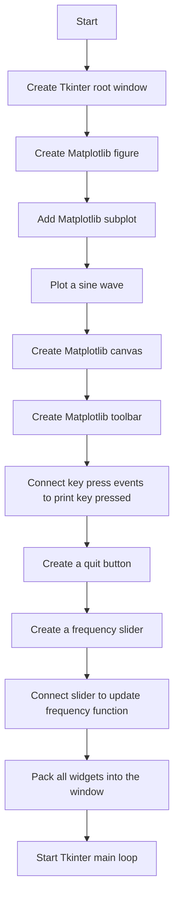

## 类结构

```
Tkinter (root window)
├── Matplotlib (figure)
│   ├── Subplot (sine wave plot)
│   └── Canvas (for rendering the plot)
│       └── Toolbar (for plot manipulation)
└── Widgets (quit button, frequency slider)
```

## 全局变量及字段


### `root`
    
The main window of the Tk application.

类型：`tkinter.Tk`
    


### `fig`
    
The figure object containing the plot.

类型：`matplotlib.figure.Figure`
    


### `ax`
    
The axes object containing the plot.

类型：`matplotlib.axes._subplots.AxesSubplot`
    


### `line`
    
The line object representing the plot in the axes.

类型：`matplotlib.lines.Line2D`
    


### `canvas`
    
The canvas widget that displays the figure.

类型：`matplotlib.backends.backend_tkagg.FigureCanvasTkAgg`
    


### `toolbar`
    
The toolbar widget for the canvas.

类型：`matplotlib.backends.backend_tkagg.NavigationToolbar2Tk`
    


### `button_quit`
    
The quit button that closes the application.

类型：`tkinter.Button`
    


### `slider_update`
    
The slider widget that updates the frequency of the plot.

类型：`tkinter.Scale`
    


### `t`
    
The time array used in the plot.

类型：`numpy.ndarray`
    


### `np`
    
The NumPy module, providing support for large, multi-dimensional arrays and matrices, along with a large library of high-level mathematical functions to operate on these arrays.

类型：`numpy`
    


### `key_press_handler`
    
The function that handles key press events in the plot canvas.

类型：`function`
    


### `tkinter.Tk.root`
    
The main window of the Tk application.

类型：`tkinter.Tk`
    


### `matplotlib.figure.Figure.fig`
    
The figure object containing the plot.

类型：`matplotlib.figure.Figure`
    


### `matplotlib.axes._subplots.AxesSubplot.ax`
    
The axes object containing the plot.

类型：`matplotlib.axes._subplots.AxesSubplot`
    


### `matplotlib.lines.Line2D.line`
    
The line object representing the plot in the axes.

类型：`matplotlib.lines.Line2D`
    


### `matplotlib.backends.backend_tkagg.FigureCanvasTkAgg.canvas`
    
The canvas widget that displays the figure.

类型：`matplotlib.backends.backend_tkagg.FigureCanvasTkAgg`
    


### `matplotlib.backends.backend_tkagg.NavigationToolbar2Tk.toolbar`
    
The toolbar widget for the canvas.

类型：`matplotlib.backends.backend_tkagg.NavigationToolbar2Tk`
    


### `tkinter.Button.button_quit`
    
The quit button that closes the application.

类型：`tkinter.Button`
    


### `tkinter.Scale.slider_update`
    
The slider widget that updates the frequency of the plot.

类型：`tkinter.Scale`
    


### `numpy.ndarray.t`
    
The time array used in the plot.

类型：`numpy.ndarray`
    


### `numpy.np`
    
The NumPy module, providing support for large, multi-dimensional arrays and matrices, along with a large library of high-level mathematical functions to operate on these arrays.

类型：`numpy`
    


### `function.key_press_handler`
    
The function that handles key press events in the plot canvas.

类型：`function`
    
    

## 全局函数及方法


### update_frequency

This function updates the frequency of the sine wave displayed in the plot.

参数：

- `new_val`：`float`，The new frequency value entered by the user.

返回值：`None`，This function does not return a value.

#### 流程图

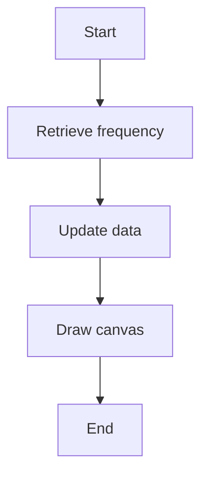

#### 带注释源码

```python
def update_frequency(new_val):
    # retrieve frequency
    f = float(new_val)

    # update data
    y = 2 * np.sin(2 * np.pi * f * t)
    line.set_data(t, y)

    # required to update canvas and attached toolbar!
    canvas.draw()
```


### `Tk.wm_title`

设置Tkinter窗口的标题。

参数：

- `title`：`str`，要设置的窗口标题

返回值：`None`，无返回值

#### 流程图

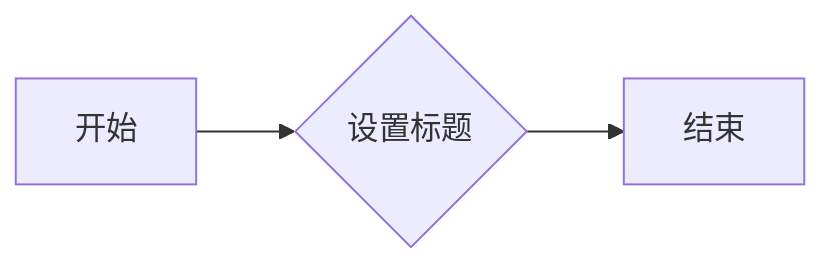

#### 带注释源码

```python
root = tkinter.Tk()
root.wm_title("Embedded in Tk")
```


### `root.destroy`

销毁Tkinter根窗口实例。

参数：

- 无

返回值：无

#### 流程图

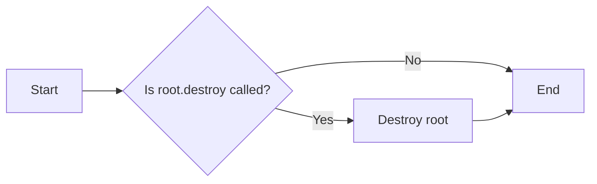

#### 带注释源码

```python
button_quit = tkinter.Button(master=root, text="Quit", command=root.destroy)
```


### `tkinter.mainloop()`

`tkinter.mainloop()` 是一个用于启动 Tkinter 事件循环的函数，它等待并处理各种事件，如鼠标点击、键盘输入等，直到窗口被关闭。

参数：

- 无

返回值：无

#### 流程图

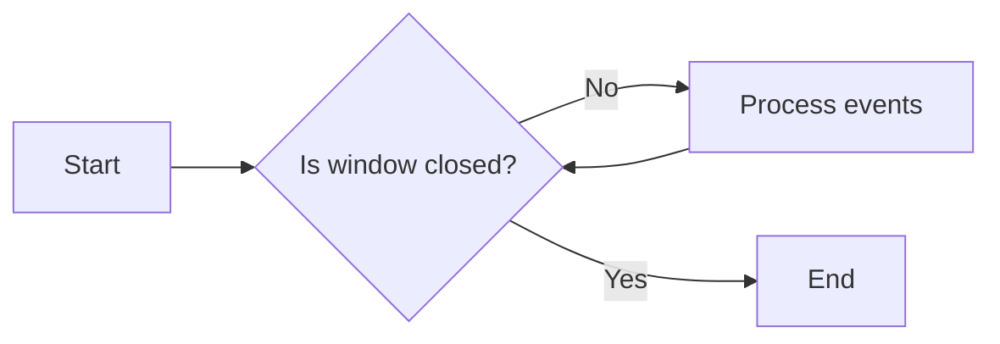

#### 带注释源码

```
tkinter.mainloop()
```


### Figure.add_subplot

`Figure.add_subplot` 是 `matplotlib.figure.Figure` 类的一个方法，用于向 Matplotlib 图形中添加一个子图。

参数：

- `nrows`：`int`，子图行数。
- `ncols`：`int`，子图列数。
- `sharex`：`bool`，是否共享 x 轴。
- `sharey`：`bool`，是否共享 y 轴。
- `rowspan`：`int`，子图在行方向上的跨行数。
- `colspan`：`int`，子图在列方向上的跨列数。
- `fig`：`matplotlib.figure.Figure`，父图对象。
- `gridspec`：`matplotlib.gridspec.GridSpec`，用于定义子图布局的网格规格对象。

参数描述：

- `nrows`：指定子图的行数。
- `ncols`：指定子图的列数。
- `sharex`：如果为 `True`，则所有子图共享 x 轴。
- `sharey`：如果为 `True`，则所有子图共享 y 轴。
- `rowspan`：指定子图在行方向上的跨行数。
- `colspan`：指定子图在列方向上的跨列数。
- `fig`：父图对象，用于添加子图。
- `gridspec`：用于定义子图布局的网格规格对象。

返回值：`matplotlib.axes.Axes`，子图对象。

返回值描述：返回一个 `Axes` 对象，该对象可以用于绘制图形。

#### 流程图

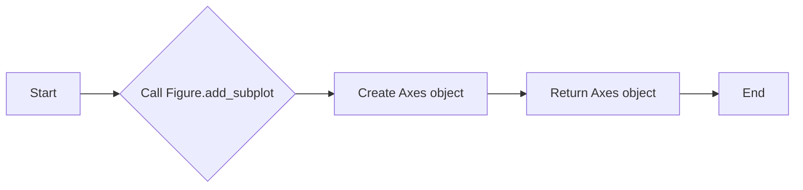

#### 带注释源码

```python
ax = fig.add_subplot()
```


### `Figure.get_tk_widget`

获取与该matplotlib.figure.Figure实例关联的Tkinter widget。

参数：

- 无

返回值：`tkinter.Widget`，返回与Figure实例关联的Tkinter widget。

#### 流程图

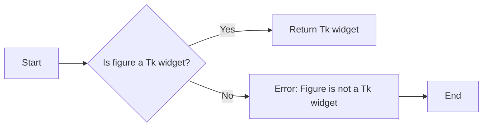

#### 带注释源码

```python
# ... (import statements and other code)

class Figure:
    # ... (other methods and code)

    def get_tk_widget(self):
        """
        Get the Tkinter widget associated with this Figure instance.

        Returns:
            tkinter.Widget: The Tkinter widget associated with the Figure instance.
        """
        # Check if the figure has a Tk widget associated with it
        if hasattr(self, '_tk_widget'):
            return self._tk_widget
        else:
            raise AttributeError("Figure is not a Tk widget")

# ... (rest of the code)
```


### `draw`

`draw` 方法是 `matplotlib.backends.backend_tkagg.FigureCanvasTkAgg` 类的一个实例方法，用于更新画布上的图形。

参数：

- `None`：无参数，该方法直接在实例上调用。

返回值：`None`，该方法不返回任何值，它只是更新画布上的图形。

#### 流程图

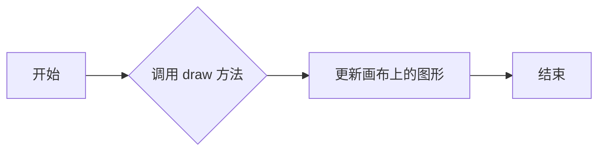

#### 带注释源码

```python
# 在 FigureCanvasTkAgg 实例上调用 draw 方法来更新画布上的图形
canvas.draw()
```


### `mpl_connect`

连接matplotlib的事件到Tkinter的事件处理函数。

参数：

- `event_type`：`str`，事件类型，例如 "key_press_event"
- `handler`：`callable`，处理事件的函数

返回值：`None`

#### 流程图

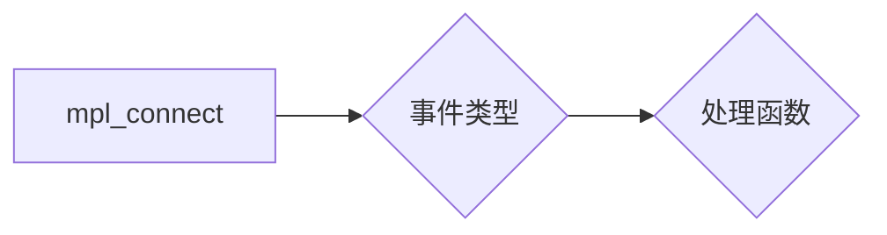

#### 带注释源码

```python
canvas.mpl_connect(
    "key_press_event", lambda event: print(f"you pressed {event.key}"))
canvas.mpl_connect("key_press_event", key_press_handler)
```


### `FigureCanvasTkAgg.get_tk_widget`

返回Tkinter控件，该控件是matplotlib图形的根Tkinter组件。

参数：

- 无

返回值：`Tkinter.Tk`，Tkinter控件，该控件是matplotlib图形的根Tkinter组件。

#### 流程图

```mermaid
graph LR
A[Start] --> B{Call get_tk_widget()}
B --> C[Return Tk widget]
C --> D[End]
```

#### 带注释源码

```python
# ... (import statements and other code)

class FigureCanvasTkAgg(FigureCanvasBase):
    # ... (other methods and code)

    def get_tk_widget(self):
        """
        Return the Tk widget that is the root of the Tk widget hierarchy for this canvas.
        """
        return self._tkcanvas

# ... (rest of the code)
```


### NavigationToolbar2Tk.update

该函数更新Tkinter界面中的matplotlib工具栏。

参数：

- `self`：`NavigationToolbar2Tk`，当前工具栏实例
- ...

返回值：无

#### 流程图

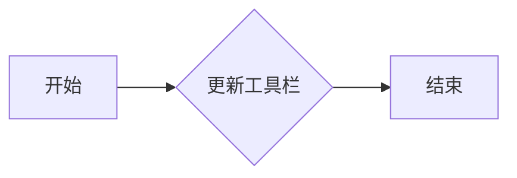

#### 带注释源码

```python
def update(self):
    # Update the toolbar's state and appearance based on the current figure and
    # axes state.

    # Update the state of the toolbar's buttons and menu items.
    self.update_buttons()

    # Update the state of the toolbar's menu items.
    self.update_menu()

    # Update the state of the toolbar's canvas.
    self.canvas.draw()
```


### `NavigationToolbar2Tk.pack`

`NavigationToolbar2Tk.pack` 是 `matplotlib.backends.backend_tkagg.NavigationToolbar2Tk` 类的一个方法，用于将工具栏添加到 Tkinter 应用程序的主窗口中。

参数：

- `side`：`str`，指定工具栏在容器中的位置（例如 'top', 'bottom', 'left', 'right'）。
- `fill`：`str`，指定工具栏如何填充其容器空间（例如 'none', 'both', 'x', 'y'）。
- `expand`：`bool`，指定工具栏是否应该扩展以填充其容器空间。

返回值：无

#### 流程图

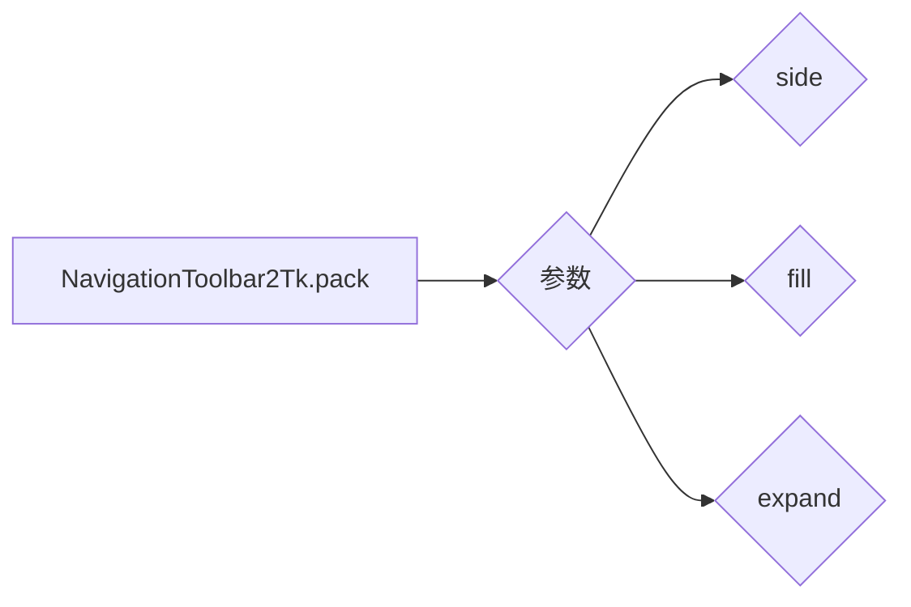

#### 带注释源码

```python
# pack_toolbar=False will make it easier to use a layout manager later on.
toolbar = NavigationToolbar2Tk(canvas, root, pack_toolbar=False)
toolbar.update()

# Packing order is important. Widgets are processed sequentially and if there
# is no space left, because the window is too small, they are not displayed.
# The canvas is rather flexible in its size, so we pack it last which makes
# sure the UI controls are displayed as long as possible.
toolbar.pack(side=tkinter.BOTTOM, fill=tkinter.X)
```


### `tkinter.Button.pack`

`tkinter.Button.pack` 是一个用于将按钮布局到 Tkinter 窗口中的方法。

参数：

- `side`：`str`，指定按钮在容器中的位置（TOP, BOTTOM, LEFT, RIGHT, or BASELINE）。
- `fill`：`str`，指定按钮如何填充其容器空间（X, Y, BOTH, or NEITHER）。
- `expand`：`bool`，指定按钮是否应该扩展以填充可用空间。
- `padx`：`int`，指定按钮在容器中的水平填充。
- `pady`：`int`，指定按钮在容器中的垂直填充。

返回值：`None`，该方法不返回任何值。

#### 流程图

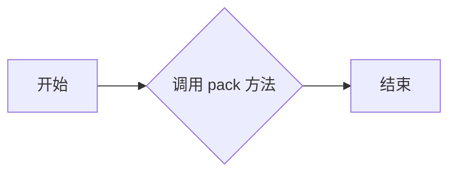

#### 带注释源码

```python
button_quit.pack(side=tkinter.BOTTOM)
```

在这段代码中，`button_quit` 是一个 `tkinter.Button` 对象，它被布局到窗口的底部。`pack` 方法被调用，并传递了 `side=tkinter.BOTTOM` 参数，这表示按钮将位于容器的底部。


### update_frequency(new_val)

更新频率值并重新绘制图表。

参数：

- `new_val`：`str`，新的频率值，用于计算正弦波的新频率。

返回值：`None`，没有返回值。

#### 流程图

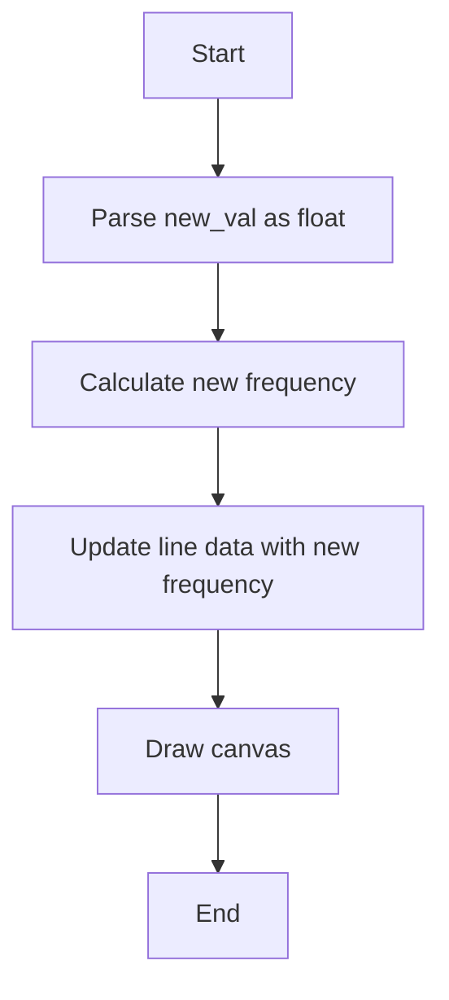

#### 带注释源码

```python
def update_frequency(new_val):
    # retrieve frequency
    f = float(new_val)

    # update data
    y = 2 * np.sin(2 * np.pi * f * t)
    line.set_data(t, y)

    # required to update canvas and attached toolbar!
    canvas.draw()
```


### `tkinter.Scale.pack`

`tkinter.Scale.pack` 是一个Tkinter方法，用于将一个Scale小部件打包到Tkinter窗口的布局中。

参数：

- `side`：`str`，指定小部件在容器中的位置（例如，'top', 'bottom', 'left', 'right', 'top', 'bottom', 'left', 'right'）。
- `fill`：`str`，指定小部件是否填充其容器（例如，'none', 'both', 'x', 'y'）。
- `expand`：`bool`，指定小部件是否应该扩展以填充可用空间。

返回值：无

#### 流程图

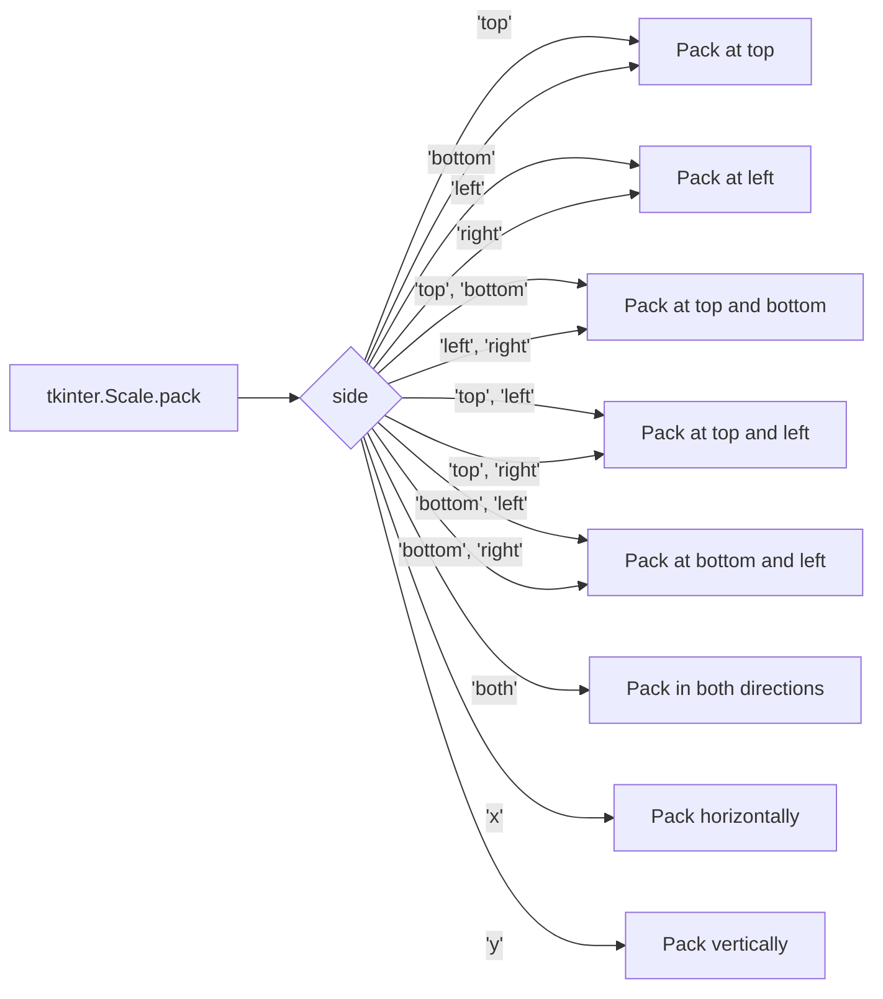

#### 带注释源码

```
slider_update.pack(side=tkinter.BOTTOM, fill=tkinter.BOTH, expand=True)
```

在这段代码中，`slider_update` 是一个Scale小部件，`pack` 方法被调用以将其打包到Tkinter窗口中。`side=tkinter.BOTTOM` 指定小部件应该放在容器的底部，`fill=tkinter.BOTH` 指定小部件应该填充其容器的水平和垂直方向，`expand=True` 指定小部件应该扩展以填充可用空间。


### update_frequency(new_val)

更新频率值并重新绘制图表。

参数：

- `new_val`：`str`，新的频率值，从滑块获取。

返回值：无

#### 流程图


#### 带注释源码

```python
def update_frequency(new_val):
    # retrieve frequency
    f = float(new_val)

    # update data
    y = 2 * np.sin(2 * np.pi * f * t)
    line.set_data(t, y)

    # required to update canvas and attached toolbar!
    canvas.draw()
```


## 关键组件


### 张量索引与惰性加载

张量索引与惰性加载机制允许在需要时才计算或访问数据，从而提高内存使用效率和计算效率。

### 反量化支持

反量化支持使得代码能够处理未量化或混合量化的张量，增加了代码的灵活性和适用性。

### 量化策略

量化策略定义了如何将浮点数张量转换为固定点数表示，以减少内存使用和加速计算。


## 问题及建议


### 已知问题

-   {问题1}：代码中使用了全局变量 `root`，这可能导致代码的可重入性和可测试性降低。全局变量通常不是最佳实践，特别是在大型或复杂的应用程序中。
-   {问题2}：`update_frequency` 函数中直接修改了 `line.set_data` 的数据，而没有使用任何锁或同步机制，这可能导致在多线程环境中出现数据竞争问题。
-   {问题3}：代码中没有进行任何错误处理，例如，如果用户输入的频率值不是一个有效的数字，程序可能会崩溃。

### 优化建议

-   {建议1}：将全局变量 `root` 移除，并使用类或函数参数来传递它，以提高代码的可重入性和可测试性。
-   {建议2}：在修改共享资源（如 `line.set_data`）之前，使用锁或其他同步机制来避免数据竞争。
-   {建议3}：在 `update_frequency` 函数中添加错误处理，确保用户输入的频率值是有效的，并在出现错误时提供适当的反馈。
-   {建议4}：考虑使用事件驱动的方式来更新图表，而不是在每次滑动条更新时都重新绘制整个图表，这可以提高性能。
-   {建议5}：在代码中添加适当的注释，以提高代码的可读性和可维护性。


## 其它


### 设计目标与约束

- 设计目标：实现一个基于Tkinter的图形界面，用于展示和交互简单的数学函数图形。
- 约束条件：使用Matplotlib库进行图形绘制，界面应简洁易用，支持频率调整。

### 错误处理与异常设计

- 错误处理：在`update_frequency`函数中，对输入的频率值进行类型检查，确保其为浮点数。
- 异常设计：未使用try-except块，但应考虑在输入非法值时提供用户反馈。

### 数据流与状态机

- 数据流：用户通过滑动条调整频率，触发`update_frequency`函数，更新图形数据并重新绘制。
- 状态机：程序运行时，状态保持不变，直到用户交互（如调整滑动条）。

### 外部依赖与接口契约

- 外部依赖：Tkinter、Matplotlib、NumPy。
- 接口契约：`update_frequency`函数接收频率值，更新图形数据并重新绘制。

### 用户界面交互

- 用户界面交互：用户通过滑动条调整频率，图形实时更新显示。

### 性能考量

- 性能考量：图形更新依赖于滑动条的实时调整，应确保更新效率。

### 安全性考量

- 安全性考量：程序未处理用户输入的潜在安全问题，如输入非数字字符。

### 可维护性与可扩展性

- 可维护性：代码结构清晰，易于理解和维护。
- 可扩展性：可以通过添加更多图形或功能来扩展程序。

### 测试与验证

- 测试与验证：应编写单元测试以确保程序功能正确，并验证用户界面交互。

### 文档与注释

- 文档与注释：代码中包含必要的注释，但可能需要更详细的文档来解释设计决策和功能。

### 代码风格与规范

- 代码风格与规范：代码遵循PEP 8风格指南，以提高可读性和一致性。


    