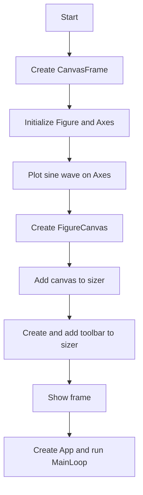
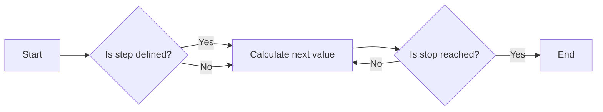
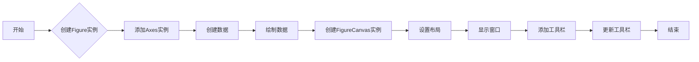
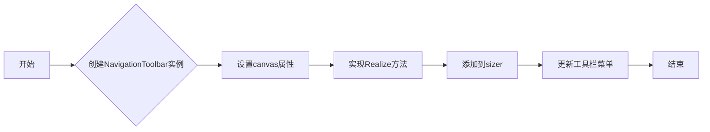
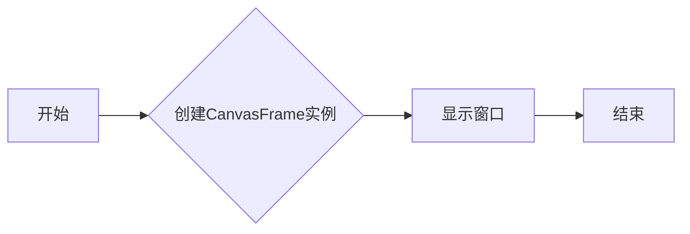
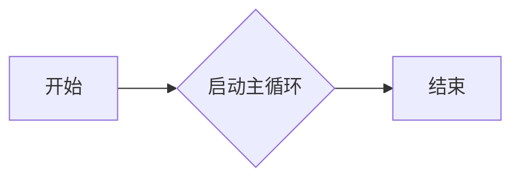
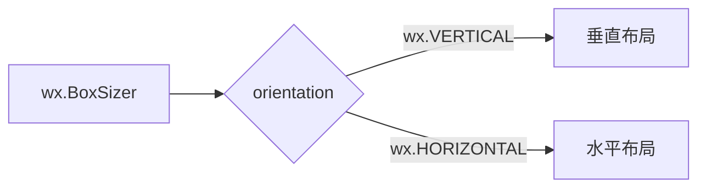
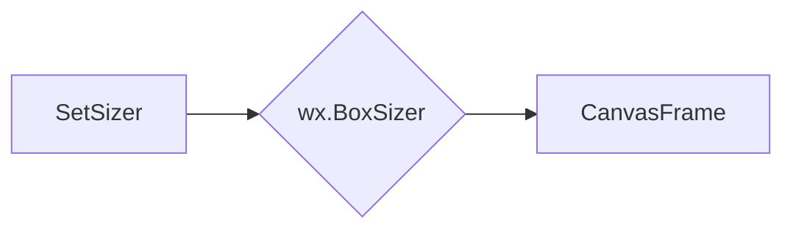
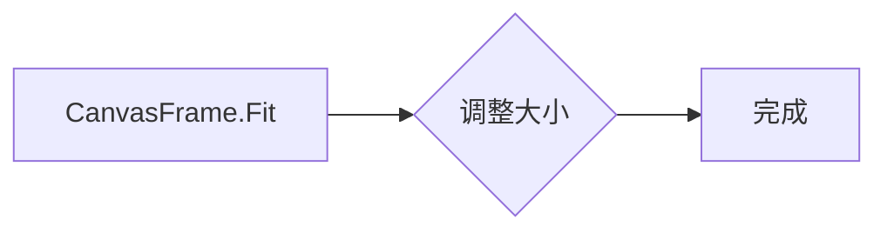
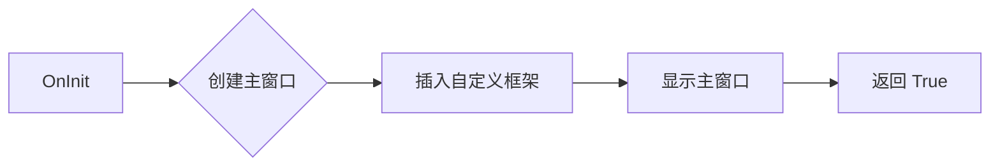

# `matplotlib\galleries\examples\user_interfaces\embedding_in_wx2_sgskip.py` 详细设计文档

This code creates a wxPython application with a canvas for plotting a sine wave using matplotlib.

## 整体流程



## 类结构

```
CanvasFrame (wx.Frame)
├── Figure (matplotlib.figure.Figure)
│   ├── Axes (matplotlib.axes.Axes)
│   └── Canvas (FigureCanvasWxAgg)
└── Toolbar (NavigationToolbar2WxAgg)
```

## 全局变量及字段


### `np`
    
Numpy module for numerical operations.

类型：`module`
    


### `wx`
    
wxPython module for creating GUI applications.

类型：`module`
    


### `wx.lib.mixins.inspection`
    
wxPython module for inspection mixins.

类型：`module`
    


### `matplotlib.backends.backend_wxagg`
    
Matplotlib backend for wxAgg.

类型：`module`
    


### `matplotlib.figure`
    
Matplotlib figure module.

类型：`module`
    


### `FigureCanvasWxAgg`
    
Matplotlib canvas class for wxAgg backend.

类型：`class`
    


### `NavigationToolbar2WxAgg`
    
Matplotlib navigation toolbar class for wxAgg backend.

类型：`class`
    


### `CanvasFrame.figure`
    
Matplotlib figure object.

类型：`Figure`
    


### `CanvasFrame.axes`
    
Matplotlib axes object for plotting.

类型：`AxesSubplot`
    


### `CanvasFrame.canvas`
    
Matplotlib canvas for rendering the figure.

类型：`FigureCanvasWxAgg`
    


### `CanvasFrame.sizer`
    
wxPython sizer for layout management.

类型：`BoxSizer`
    


### `CanvasFrame.toolbar`
    
Matplotlib navigation toolbar for interactive manipulation of the plot.

类型：`NavigationToolbar2WxAgg`
    
    

## 全局函数及方法


### np.arange

`np.arange` 是 NumPy 库中的一个函数，用于生成一个沿指定间隔的数字序列。

参数：

- `start`：`int`，序列的起始值。
- `stop`：`int`，序列的结束值（不包括此值）。
- `step`：`int`，序列中相邻元素之间的间隔，默认为 1。

返回值：`numpy.ndarray`，一个沿指定间隔的数字序列。

#### 流程图



#### 带注释源码

```python
t = np.arange(0.0, 3.0, 0.01)
# t is now an array of values from 0.0 to 3.0 with a step of 0.01
```


### np.sin

计算输入参数的正弦值。

参数：

- `x`：`numpy.ndarray`，输入的数值数组，用于计算正弦值。

返回值：`numpy.ndarray`，与输入数组相同形状的正弦值数组。

#### 流程图

```mermaid
graph LR
A[Start] --> B{Is x a numpy.ndarray?}
B -- Yes --> C[Calculate sin(x)]
C --> D[End]
B -- No --> E[Error: Invalid input type]
E --> D
```

#### 带注释源码

```python
import numpy as np

def sin(x):
    """
    Calculate the sine of the elements of an array.
    
    Parameters:
    - x: numpy.ndarray, the input array of numbers.
    
    Returns:
    - numpy.ndarray: an array containing the sine of each element in x.
    """
    return np.sin(x)
```


### CanvasFrame.__init__

初始化CanvasFrame类，创建一个包含matplotlib图形的wx.Frame窗口。

参数：

- `None`：无参数，使用默认构造函数。
- `size`：`tuple`，指定窗口的大小。

返回值：无返回值。

#### 流程图


#### 带注释源码

```python
def __init__(self):
    super().__init__(None, -1, 'CanvasFrame', size=(550, 350))

    self.figure = Figure()
    self.axes = self.figure.add_subplot()
    t = np.arange(0.0, 3.0, 0.01)
    s = np.sin(2 * np.pi * t)

    self.axes.plot(t, s)
    self.canvas = FigureCanvas(self, -1, self.figure)

    self.sizer = wx.BoxSizer(wx.VERTICAL)
    self.sizer.Add(self.canvas, 1, wx.LEFT | wx.TOP | wx.EXPAND)
    self.SetSizer(self.sizer)
    self.Fit()

    self.add_toolbar()  # comment this out for no toolbar
```

### CanvasFrame.add_toolbar

添加matplotlib的NavigationToolbar到CanvasFrame窗口。

参数：

- `None`：无参数。

返回值：无返回值。

#### 流程图


#### 带注释源码

```python
def add_toolbar(self):
    self.toolbar = NavigationToolbar(self.canvas)
    self.toolbar.Realize()
    # By adding toolbar in sizer, we are able to put it at the bottom
    # of the frame - so appearance is closer to GTK version.
    self.sizer.Add(self.toolbar, 0, wx.LEFT | wx.EXPAND)
    # update the axes menu on the toolbar
    self.toolbar.update()
```

### App.OnInit

初始化App类，创建CanvasFrame窗口并显示。

参数：

- `None`：无参数。

返回值：`True`，表示初始化成功。

#### 流程图


#### 带注释源码

```python
def OnInit(self):
    """Create the main window and insert the custom frame."""
    self.Init()
    frame = CanvasFrame()
    frame.Show(True)

    return True
```

### App.MainLoop

启动wxPython的事件循环。

参数：

- `None`：无参数。

返回值：无返回值。

#### 流程图


#### 带注释源码

```python
if __name__ == "__main__":
    app = App()
    app.MainLoop()
```


### `CanvasFrame.__init__`

初始化 `CanvasFrame` 类的构造函数。

参数：

- `None`：无参数，构造函数自动调用父类构造函数。

返回值：无返回值。

#### 流程图



#### 带注释源码

```python
def __init__(self):
    super().__init__(None, -1, 'CanvasFrame', size=(550, 350))

    self.figure = Figure()
    self.axes = self.figure.add_subplot()
    t = np.arange(0.0, 3.0, 0.01)
    s = np.sin(2 * np.pi * t)

    self.axes.plot(t, s)
    self.canvas = FigureCanvas(self, -1, self.figure)

    self.sizer = wx.BoxSizer(wx.VERTICAL)
    self.sizer.Add(self.canvas, 1, wx.LEFT | wx.TOP | wx.EXPAND)
    self.SetSizer(self.sizer)
    self.Fit()

    self.add_toolbar()  # comment this out for no toolbar
```

### `CanvasFrame.add_toolbar`

添加工具栏到 `CanvasFrame`。

参数：

- `None`：无参数。

返回值：无返回值。

#### 流程图



#### 带注释源码

```python
def add_toolbar(self):
    self.toolbar = NavigationToolbar(self.canvas)
    self.toolbar.Realize()
    # By adding toolbar in sizer, we are able to put it at the bottom
    # of the frame - so appearance is closer to GTK version.
    self.sizer.Add(self.toolbar, 0, wx.LEFT | wx.EXPAND)
    # update the axes menu on the toolbar
    self.toolbar.update()
```

### `App.OnInit`

初始化 `App` 类的 `OnInit` 方法。

参数：

- `None`：无参数，构造函数自动调用父类构造函数。

返回值：`True`，表示初始化成功。

#### 流程图



#### 带注释源码

```python
def OnInit(self):
    """Create the main window and insert the custom frame."""
    self.Init()
    frame = CanvasFrame()
    frame.Show(True)

    return True
```

### `App.MainLoop`

启动 `App` 类的主循环。

参数：

- `None`：无参数。

返回值：无返回值。

#### 流程图



#### 带注释源码

```python
if __name__ == "__main__":
    app = App()
    app.MainLoop()
```


### `CanvasFrame.add_toolbar()`

`add_toolbar` 方法是 `CanvasFrame` 类的一个方法，用于添加一个导航工具栏到画布框架中。

参数：

- 无

返回值：无

#### 流程图


#### 带注释源码

```python
def add_toolbar(self):
    self.toolbar = NavigationToolbar(self.canvas)
    self.toolbar.Realize()
    # By adding toolbar in sizer, we are able to put it at the bottom
    # of the frame - so appearance is closer to GTK version.
    self.sizer.Add(self.toolbar, 0, wx.LEFT | wx.EXPAND)
    # update the axes menu on the toolbar
    self.toolbar.update()
```


### NavigationToolbar2WxAgg

NavigationToolbar2WxAgg is a class from the matplotlib.backends.backend_wxagg module that provides a set of tools for navigating and interacting with a matplotlib figure in a wxPython application.

参数：

- `canvas`：`FigureCanvasWxAgg`，The canvas widget that contains the figure.
- `parent`：`wx.Window`，The parent window for the toolbar.

返回值：`None`，No return value.

#### 流程图


#### 带注释源码

```python
from matplotlib.backends.backend_wxagg import NavigationToolbar2WxAgg as NavigationToolbar

class CanvasFrame(wx.Frame):
    # ... other methods ...

    def add_toolbar(self):
        self.toolbar = NavigationToolbar(self.canvas)  # Initialize the toolbar with the canvas
        self.toolbar.Realize()  # Realize the toolbar
        # By adding toolbar in sizer, we are able to put it at the bottom
        # of the frame - so appearance is closer to GTK version.
        self.sizer.Add(self.toolbar, 0, wx.LEFT | wx.EXPAND)  # Add toolbar to sizer
        # update the axes menu on the toolbar
        self.toolbar.update()  # Update the axes menu
```


### wx.BoxSizer

wx.BoxSizer 是一个用于wxWidgets框架中的布局管理器，它允许开发者以垂直或水平方式排列窗口中的控件。

参数：

- `orientation`：`wx.VERTICAL` 或 `wx.HORIZONTAL`，指定布局的方向。
- `proportion`：`int`，指定子控件在布局中的比例。
- `flag`：`wx.Window`，指定子控件的布局标志。

返回值：`wx.BoxSizer`，一个BoxSizer对象，用于管理子控件的布局。

#### 流程图



#### 带注释源码

```python
class wx.BoxSizer(wx.BoxSizer):
    def __init__(self, orientation=wx.VERTICAL, proportion=0, flag=0):
        # 初始化BoxSizer对象
        wx.BoxSizer.__init__(self, orientation, proportion, flag)
```


### `CanvasFrame.add_toolbar()`

`CanvasFrame.add_toolbar()` 方法用于添加一个导航工具栏到 `CanvasFrame` 实例中。

参数：

- 无

返回值：无

#### 流程图


#### 带注释源码

```python
def add_toolbar(self):
    self.toolbar = NavigationToolbar(self.canvas)
    self.toolbar.Realize()
    # By adding toolbar in sizer, we are able to put it at the bottom
    # of the frame - so appearance is closer to GTK version.
    self.sizer.Add(self.toolbar, 0, wx.LEFT | wx.EXPAND)
    # update the axes menu on the toolbar
    self.toolbar.update()
```


### `CanvasFrame.add_toolbar`

`CanvasFrame` 类的 `add_toolbar` 方法用于添加一个导航工具栏到画布框架中。

参数：

- `self`：`CanvasFrame` 类的实例，表示当前对象

返回值：无

#### 流程图


#### 带注释源码

```python
def add_toolbar(self):
    self.toolbar = NavigationToolbar(self.canvas)
    self.toolbar.Realize()
    # By adding toolbar in sizer, we are able to put it at the bottom
    # of the frame - so appearance is closer to GTK version.
    self.sizer.Add(self.toolbar, 0, wx.LEFT | wx.EXPAND)
    # update the axes menu on the toolbar
    self.toolbar.update()
```


### CanvasFrame.SetSizer

该函数用于设置CanvasFrame窗口的布局管理器。

参数：

- `sizer`：`wx.BoxSizer`，用于管理CanvasFrame窗口的布局。

返回值：无

#### 流程图



#### 带注释源码

```python
def SetSizer(self, sizer):
    # Set the layout manager for the frame
    self.sizer = sizer
    # Add the canvas to the sizer
    self.sizer.Add(self.canvas, 1, wx.LEFT | wx.TOP | wx.EXPAND)
    # Add the toolbar to the sizer (if it exists)
    if self.toolbar:
        self.sizer.Add(self.toolbar, 0, wx.LEFT | wx.EXPAND)
    # Fit the frame to the sizer
    self.Fit()
``` 


### CanvasFrame.Fit

Fit the frame to its contents.

参数：

- `None`：无参数，该方法自动调整窗口大小以适应其子组件。

返回值：`None`，无返回值。

#### 流程图



#### 带注释源码

```python
def Fit(self):
    # 调用基类的Fit方法，以适应其子组件
    super().Fit()
```


### `App.OnInit`

初始化应用程序，创建主窗口并插入自定义框架。

参数：

- `self`：`App` 类的实例，表示当前应用程序对象。

返回值：`True`，表示初始化成功。

#### 流程图



#### 带注释源码

```python
class App(WIT.InspectableApp):
    def OnInit(self):
        """Create the main window and insert the custom frame."""
        self.Init()  # 初始化应用程序
        frame = CanvasFrame()  # 创建自定义框架
        frame.Show(True)  # 显示主窗口
        return True  # 返回 True 表示初始化成功
```


### App.OnInit

初始化应用程序，创建主窗口并插入自定义框架。

参数：

- `self`：`App` 类的实例，表示当前应用程序对象。

返回值：`True`，表示初始化成功。

#### 流程图


#### 带注释源码

```python
class App(WIT.InspectableApp):
    def OnInit(self):
        """Create the main window and insert the custom frame."""
        self.Init()  # 初始化应用程序
        frame = CanvasFrame()  # 创建自定义框架
        frame.Show(True)  # 显示主窗口
        return True  # 返回 True 表示初始化成功
```


### app.MainLoop

`app.MainLoop` 是 `App` 类的一个方法，它是 wxPython 应用程序的主事件循环。

参数：

- 无

返回值：`None`，该方法不返回任何值，它负责启动并运行应用程序的事件循环。

#### 流程图

```mermaid
graph LR
A[Start MainLoop] --> B[Event Loop]
B --> C{Is Event Pending?}
C -- Yes --> D[Process Event]
C -- No --> E[Wait for Event]
D --> C
E --> C
```

#### 带注释源码

```
if __name__ == "__main__":
    app = App()
    app.MainLoop()  # Start the main event loop
```

在这个代码片段中，`MainLoop` 方法被调用以启动 wxPython 应用程序的事件循环。这个循环负责处理所有的事件，如鼠标点击、键盘输入等，直到应用程序被显式关闭。`MainLoop` 方法本身不返回任何值，它是一个无限循环，直到应用程序被关闭。


### CanvasFrame.__init__

This method initializes the `CanvasFrame` class, creating a window with a matplotlib plot embedded using wxPython.

参数：

- `None`：`None`，The default constructor for the `wx.Frame` class.
- `size`：`(550, 350)`，`tuple`，The size of the window.
- `title`：`'CanvasFrame'`，`str`，The title of the window.

返回值：`None`，`None`，This method does not return a value.

#### 流程图

```mermaid
graph LR
A[Start] --> B[Create Figure]
B --> C[Add Axes]
C --> D[Plot Data]
D --> E[Create Canvas]
E --> F[Add Canvas to Sizer]
F --> G[Set Sizer]
G --> H[Fit Window]
H --> I[Add Toolbar]
I --> J[Realize Toolbar]
J --> K[Update Toolbar]
K --> L[End]
```

#### 带注释源码

```python
def __init__(self, parent=None, id=-1, title='CanvasFrame', size=(550, 350)):
    super().__init__(parent, id, title, size)

    self.figure = Figure()  # Create a new matplotlib figure
    self.axes = self.figure.add_subplot()  # Add an axes to the figure
    t = np.arange(0.0, 3.0, 0.01)  # Create an array of time values
    s = np.sin(2 * np.pi * t)  # Calculate the sine of the time values
    self.axes.plot(t, s)  # Plot the sine function on the axes

    self.canvas = FigureCanvas(self, -1, self.figure)  # Create a canvas to display the figure
    self.sizer = wx.BoxSizer(wx.VERTICAL)  # Create a vertical box sizer
    self.sizer.Add(self.canvas, 1, wx.LEFT | wx.TOP | wx.EXPAND)  # Add the canvas to the sizer
    self.SetSizer(self.sizer)  # Set the sizer for the window
    self.Fit()  # Fit the window to the sizer

    self.add_toolbar()  # Add a toolbar to the window
```


### CanvasFrame.add_toolbar

This method adds a toolbar to the CanvasFrame.

参数：

- `self`：`CanvasFrame`，The instance of the CanvasFrame class.

返回值：`None`，No return value.

#### 流程图

```mermaid
graph LR
A[Start] --> B{Create toolbar}
B --> C[Add toolbar to sizer]
C --> D[Update toolbar]
D --> E[End]
```

#### 带注释源码

```python
def add_toolbar(self):
    self.toolbar = NavigationToolbar(self.canvas)
    self.toolbar.Realize()
    # By adding toolbar in sizer, we are able to put it at the bottom
    # of the frame - so appearance is closer to GTK version.
    self.sizer.Add(self.toolbar, 0, wx.LEFT | wx.EXPAND)
    # update the axes menu on the toolbar
    self.toolbar.update()
```


### App.OnInit

`OnInit` 方法是 `App` 类的一个方法，它是 `wx.App` 类的一个子类 `WIT.InspectableApp` 的方法。此方法用于初始化应用程序，创建主窗口，并显示它。

参数：

- 无

返回值：`True`，表示初始化成功

#### 流程图

```mermaid
graph LR
A[OnInit] --> B{创建主窗口}
B --> C[显示主窗口]
C --> D[返回 True]
```

#### 带注释源码

```python
class App(WIT.InspectableApp):
    def OnInit(self):
        """Create the main window and insert the custom frame."""
        self.Init()  # 初始化应用程序
        frame = CanvasFrame()  # 创建主窗口
        frame.Show(True)  # 显示主窗口
        return True  # 返回 True 表示初始化成功
```


## 关键组件


### 张量索引与惰性加载

用于在matplotlib的wxagg后端中处理张量数据，支持延迟加载以提高性能。

### 反量化支持

提供对量化策略的反量化支持，允许在量化过程中进行逆操作。

### 量化策略

定义了量化过程中的策略，包括量化位宽、精度等参数。


## 问题及建议


### 已知问题

-   **全局变量和函数的使用**：代码中使用了全局变量和函数，这可能导致代码的可维护性和可读性降低。例如，`App` 类被定义在全局作用域中，这可能会与其他模块中的 `App` 类冲突。
-   **代码注释**：代码中缺少详细的注释，这可能会使得其他开发者难以理解代码的意图和功能。
-   **代码结构**：代码结构较为简单，可能缺乏模块化和分层设计，这可能会影响代码的可扩展性和可维护性。

### 优化建议

-   **避免全局变量和函数**：将 `App` 类移动到模块作用域中，以避免全局命名空间污染。
-   **增加代码注释**：在代码中添加详细的注释，解释代码的功能和设计决策。
-   **模块化和分层设计**：将代码分解为更小的模块，并按照功能进行分层，以提高代码的可维护性和可扩展性。
-   **使用配置文件**：如果应用程序需要配置选项，考虑使用配置文件来管理这些选项，而不是在代码中硬编码。
-   **异常处理**：添加异常处理机制，以处理可能出现的错误情况，并确保应用程序的健壮性。
-   **代码审查**：定期进行代码审查，以发现潜在的问题并提高代码质量。


## 其它


### 设计目标与约束

- 设计目标：实现一个使用wxPython和matplotlib的图形界面应用程序，用于展示matplotlib图形。
- 约束条件：应用程序应支持基本的绘图功能，如绘制正弦波，并应具备一个工具栏以提供用户交互。

### 错误处理与异常设计

- 错误处理：应用程序应能够捕获并处理可能发生的异常，如matplotlib绘图错误或wxPython界面错误。
- 异常设计：使用try-except块来捕获和处理异常，确保应用程序在出现错误时不会崩溃。

### 数据流与状态机

- 数据流：用户通过界面与matplotlib图形交互，数据流从用户操作到matplotlib图形的绘制。
- 状态机：应用程序没有复杂的状态机，主要状态包括初始化、绘制图形和显示工具栏。

### 外部依赖与接口契约

- 外部依赖：应用程序依赖于wxPython、matplotlib和numpy库。
- 接口契约：wxPython和matplotlib库提供了必要的接口，用于创建图形界面和绘制图形。

### 安全性与隐私

- 安全性：应用程序没有直接的安全风险，但应确保依赖库的安全性。
- 隐私：应用程序不涉及用户数据，因此没有隐私问题。

### 性能考量

- 性能考量：应用程序应快速响应用户操作，特别是在绘制图形时。
- 优化空间：可以通过优化matplotlib图形的绘制过程来提高性能。

### 可维护性与可扩展性

- 可维护性：代码结构清晰，易于理解和维护。
- 可扩展性：可以通过添加新的绘图函数和工具栏按钮来扩展应用程序的功能。

### 用户文档与帮助

- 用户文档：提供用户手册，说明如何使用应用程序。
- 帮助系统：集成帮助系统，提供在线帮助文档。

### 测试与验证

- 测试：编写单元测试和集成测试，确保应用程序的功能正确无误。
- 验证：通过用户测试和性能测试来验证应用程序的稳定性和性能。

### 部署与分发

- 部署：提供安装指南，确保用户可以轻松安装应用程序。
- 分发：通过官方网站或其他渠道分发应用程序。


    