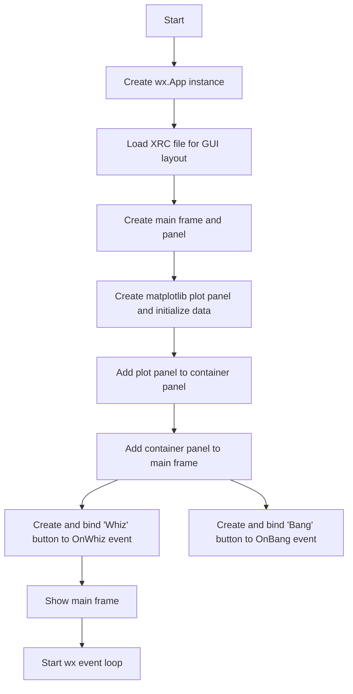
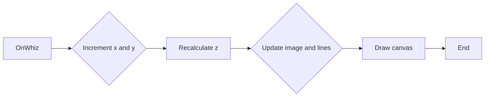
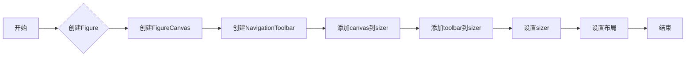
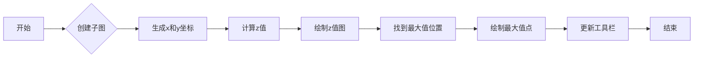
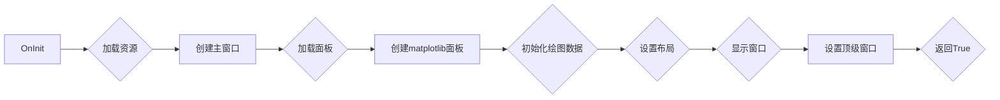
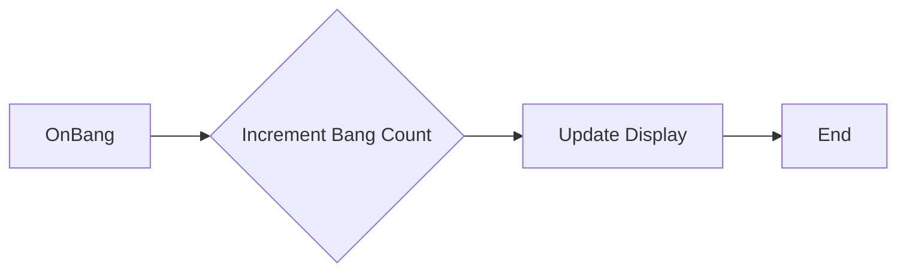

# `matplotlib\galleries\examples\user_interfaces\embedding_in_wx3_sgskip.py` 详细设计文档

This code creates a wxPython application with a matplotlib plot embedded within it. It includes a main frame with a plot panel, toolbar, and buttons for manipulating the plot.

## 整体流程



## 类结构

```
MyApp (wx.App subclass)
├── PlotPanel (wx.Panel subclass)
│   ├── fig (matplotlib.figure.Figure)
│   ├── canvas (matplotlib.backends.backend_wxagg.FigureCanvasWxAgg)
│   ├── toolbar (matplotlib.backends.backend_wxagg.NavigationToolbar2WxAgg)
│   ├── x (numpy.ndarray)
│   ├── y (numpy.ndarray)
│   ├── z (numpy.ndarray)
│   └── im (matplotlib.pyplot.imshow)
│       └── lines (list of matplotlib.pyplot.plot)
└── MyApp (wx.App)
```

## 全局变量及字段


### `ERR_TOL`
    
Floating point tolerance for peak detection in the plot data.

类型：`float`
    


### `PlotPanel.fig`
    
Matplotlib Figure object used for plotting.

类型：`Figure`
    


### `PlotPanel.canvas`
    
Matplotlib canvas for rendering the plot.

类型：`FigureCanvasWxAgg`
    


### `PlotPanel.toolbar`
    
Matplotlib toolbar for interacting with the plot.

类型：`NavigationToolbar2WxAgg`
    


### `PlotPanel.x`
    
Numpy array representing the x-axis values for the plot.

类型：`ndarray`
    


### `PlotPanel.y`
    
Numpy array representing the y-axis values for the plot.

类型：`ndarray`
    


### `PlotPanel.z`
    
Numpy array representing the z-axis values for the plot.

类型：`ndarray`
    


### `PlotPanel.im`
    
Matplotlib image object representing the plot data.

类型：`AxesImage`
    


### `PlotPanel.lines`
    
Matplotlib line object representing the peaks in the plot data.

类型：`Line2D`
    


### `MyApp.res`
    
wxWidgets XML resource object for loading the GUI layout.

类型：`XmlResource`
    


### `MyApp.frame`
    
wxWidgets frame that contains the main GUI elements.

类型：`wx.Frame`
    


### `MyApp.panel`
    
wxWidgets panel that serves as the main content area of the frame.

类型：`wx.Panel`
    


### `MyApp.plotpanel`
    
PlotPanel instance used in the main frame.

类型：`PlotPanel`
    


### `MyApp.bang_count`
    
wxWidgets control for displaying and updating the number of 'bang' button presses.

类型：`wx control`
    
    

## 全局函数及方法


### OnWhiz

This method updates the plot data by incrementing the x and y coordinates and recalculating the z values.

参数：

- `event`：`wx.Event`，The event that triggered the method call.

返回值：`None`，This method does not return any value.

#### 流程图



#### 带注释源码

```python
def OnWhiz(self, event):
    # Increment x and y coordinates
    self.x += np.pi / 15
    self.y += np.pi / 20
    # Recalculate z values
    z = np.sin(self.x) + np.cos(self.y)
    self.im.set_array(z)
    # Update ymax_i and xmax_i
    zmax = np.max(z) - ERR_TOL
    ymax_i, xmax_i = np.nonzero(z >= zmax)
    if self.im.origin == 'upper':
        ymax_i = z.shape[0] - ymax_i
    self.lines[0].set_data(xmax_i, ymax_i)
    # Draw the canvas
    self.canvas.draw()
```


### OnBang

`OnBang` 方法是 `MyApp` 类的一个方法，它被绑定到一个按钮事件，用于增加一个名为 "bang_count" 的控件的值。

参数：

- `event`：`wx.Event`，表示触发事件的按钮点击事件。

返回值：无

#### 流程图

```mermaid
graph LR
A[OnBang] --> B{增加 bang_count 值}
B --> C[更新 bang_count 控件显示}
```

#### 带注释源码

```python
def OnBang(self, event):
    bang_count = xrc.XRCCTRL(self.frame, "bang_count")
    bangs = bang_count.GetValue()
    bangs = int(bangs) + 1
    bang_count.SetValue(str(bangs))
``` 


### PlotPanel.__init__

初始化PlotPanel类，创建matplotlib图形界面。

参数：

- `parent`：`wx.Panel`，父窗口对象

返回值：无

#### 流程图



#### 带注释源码

```python
def __init__(self, parent):
    super().__init__(parent, -1)

    self.fig = Figure((5, 4), 75)  # 创建Figure对象
    self.canvas = FigureCanvas(self, -1, self.fig)  # 创建FigureCanvas对象
    self.toolbar = NavigationToolbar(self.canvas)  # 创建NavigationToolbar对象
    self.toolbar.Realize()  # 实现toolbar

    # Now put all into a sizer
    sizer = wx.BoxSizer(wx.VERTICAL)
    # This way of adding to sizer allows resizing
    sizer.Add(self.canvas, 1, wx.LEFT | wx.TOP | wx.GROW)
    # Best to allow the toolbar to resize!
    sizer.Add(self.toolbar, 0, wx.GROW)
    self.SetSizer(sizer)
    self.Fit()  # 设置布局
``` 


### PlotPanel.init_plot_data

初始化绘图数据，创建一个二维正弦余弦图，并标记出最大值的位置。

参数：

- 无

返回值：无

#### 流程图



#### 带注释源码

```python
def init_plot_data(self):
    ax = self.fig.add_subplot()  # 创建一个子图

    x = np.arange(120.0) * 2 * np.pi / 60.0  # 生成x坐标
    y = np.arange(100.0) * 2 * np.pi / 50.0  # 生成y坐标
    self.x, self.y = np.meshgrid(x, y)  # 创建x和y的网格
    z = np.sin(self.x) + np.cos(self.y)  # 计算z值

    self.im = ax.imshow(z, cmap="RdBu", origin='lower')  # 绘制z值图

    zmax = np.max(z) - ERR_TOL  # 找到最大值
    ymax_i, xmax_i = np.nonzero(z >= zmax)  # 找到最大值的位置
    if self.im.origin == 'upper':
        ymax_i = z.shape[0] - ymax_i  # 如果坐标是上对齐的，调整y坐标
    self.lines = ax.plot(xmax_i, ymax_i, 'ko')  # 绘制最大值点

    self.toolbar.update()  # 更新工具栏
``` 


### PlotPanel.GetToolBar

返回PlotPanel中使用的工具栏对象。

参数：

- 无

返回值：`wx.ToolBar`，PlotPanel中使用的工具栏对象

#### 流程图


#### 带注释源码

```python
def GetToolBar(self):
    # You will need to override GetToolBar if you are using an
    # unmanaged toolbar in your frame
    return self.toolbar
```


### PlotPanel.OnWhiz

This method updates the plot data by shifting the x and y coordinates and recalculates the z values, then updates the image and lines on the plot.

参数：

- `event`：`wx.Event`，The event that triggered the method. This is typically a button click event.

返回值：`None`，This method does not return any value.

#### 流程图


#### 带注释源码

```python
def OnWhiz(self, event):
    # Increment x and y coordinates
    self.x += np.pi / 15
    self.y += np.pi / 20
    # Calculate new z values based on updated coordinates
    z = np.sin(self.x) + np.cos(self.y)
    # Update the image array with new z values
    self.im.set_array(z)

    # Calculate new maximum z value and corresponding indices
    zmax = np.max(z) - ERR_TOL
    ymax_i, xmax_i = np.nonzero(z >= zmax)
    # Adjust indices if image origin is upper
    if self.im.origin == 'upper':
        ymax_i = z.shape[0] - ymax_i
    # Update lines data with new indices
    self.lines[0].set_data(xmax_i, ymax_i)

    # Redraw the canvas with updated data
    self.canvas.draw()
``` 


### MyApp.OnInit

初始化应用程序，加载GUI界面，并设置事件绑定。

参数：

- `event`：`wx.Event`，事件对象，用于处理GUI事件。

返回值：`bool`，如果初始化成功则返回True，否则返回False。

#### 流程图



#### 带注释源码

```python
def OnInit(self):
    xrcfile = cbook.get_sample_data('embedding_in_wx3.xrc',
                                    asfileobj=False)
    print('loading', xrcfile)

    self.res = xrc.XmlResource(xrcfile)

    # main frame and panel --------
    self.frame = self.res.LoadFrame(None, "MainFrame")
    self.panel = xrc.XRCCTRL(self.frame, "MainPanel")

    # matplotlib panel -------------
    plot_container = xrc.XRCCTRL(self.frame, "plot_container_panel")
    sizer = wx.BoxSizer(wx.VERTICAL)

    self.plotpanel = PlotPanel(plot_container)
    self.plotpanel.init_plot_data()

    # wx boilerplate
    sizer.Add(self.plotpanel, 1, wx.EXPAND)
    plot_container.SetSizer(sizer)

    # whiz button ------------------
    whiz_button = xrc.XRCCTRL(self.frame, "whiz_button")
    whiz_button.Bind(wx.EVT_BUTTON, self.plotpanel.OnWhiz)

    # bang button ------------------
    bang_button = xrc.XRCCTRL(self.frame, "bang_button")
    bang_button.Bind(wx.EVT_BUTTON, self.OnBang)

    # final setup ------------------
    self.frame.Show()
    self.SetTopWindow(self.frame)

    return True
```


### MyApp.OnBang

This method handles the button click event for the "Bang" button in the application. It increments the count of "Bangs" and updates the display.

参数：

- `event`：`wx.Event`，The event object that was triggered by the button click.

返回值：`None`，This method does not return any value.

#### 流程图



#### 带注释源码

```python
def OnBang(self, event):
    bang_count = xrc.XRCCTRL(self.frame, "bang_count")
    bangs = bang_count.GetValue()
    bangs = int(bangs) + 1
    bang_count.SetValue(str(bangs))
```


## 关键组件


### 张量索引与惰性加载

张量索引与惰性加载是代码中用于处理和访问数据结构的关键组件，它允许在需要时才计算或加载数据，从而提高性能和效率。

### 反量化支持

反量化支持是代码中用于处理和转换数据的关键组件，它允许将量化后的数据转换回原始精度，以便进行进一步处理或分析。

### 量化策略

量化策略是代码中用于优化数据表示和存储的关键组件，它通过减少数据精度来减少内存使用和计算需求，同时保持足够的精度以满足应用需求。


## 问题及建议


### 已知问题

-   **全局变量 `ERR_TOL`**：该全局变量用于峰值检测中的浮点数容差，但将其定义为全局变量可能会在多线程环境中引起问题，因为它可以被任何线程修改。
-   **类 `PlotPanel` 中的 `init_plot_data` 方法**：该方法中使用了 `self.x` 和 `self.y` 作为全局变量，这可能导致在多实例化 `PlotPanel` 时出现冲突。
-   **类 `MyApp` 中的 `OnBang` 方法**：该方法直接修改了 `bang_count` 控件的值，而没有进行任何错误检查，这可能导致在用户输入非数字时程序崩溃。

### 优化建议

-   **全局变量 `ERR_TOL`**：考虑将 `ERR_TOL` 作为类属性或方法参数传递，以避免全局变量的使用。
-   **类 `PlotPanel` 中的 `init_plot_data` 方法**：将 `self.x` 和 `self.y` 作为局部变量或类属性初始化，以避免在多实例化时发生冲突。
-   **类 `MyApp` 中的 `OnBang` 方法**：在修改 `bang_count` 控件之前，添加错误检查以确保用户输入的是有效的数字。
-   **代码注释**：代码中缺少必要的注释，建议添加详细的注释来解释代码的功能和逻辑。
-   **代码风格**：代码风格不一致，建议使用 PEP 8 标准来统一代码风格。
-   **异常处理**：代码中缺少异常处理，建议添加异常处理来捕获和处理可能发生的错误。
-   **代码复用**：代码中存在重复的代码片段，例如 `OnWhiz` 和 `OnBang` 方法中的绘图逻辑，建议将这些逻辑提取到单独的方法中以提高代码复用性。


## 其它


### 设计目标与约束

- 设计目标：
  - 实现一个使用matplotlib和wxPython进行图形显示的应用程序。
  - 提供一个交互式的绘图界面，允许用户通过按钮操作图形。
  - 使用XRC文件定义GUI布局，以便于界面设计和修改。
- 约束：
  - 必须使用matplotlib和wxPython库。
  - GUI布局必须通过XRC文件定义。
  - 应用程序必须能够处理用户交互，如按钮点击。

### 错误处理与异常设计

- 错误处理：
  - 使用try-except块捕获可能发生的异常，如文件读取错误、图形绘制错误等。
  - 提供用户友好的错误消息，指导用户如何解决问题。
- 异常设计：
  - 定义自定义异常类，用于处理特定类型的错误。
  - 异常类应提供足够的信息，以便于调试和修复。

### 数据流与状态机

- 数据流：
  - 用户通过按钮点击触发事件，事件处理函数更新图形数据。
  - 图形数据通过matplotlib的绘图函数绘制到界面上。
- 状态机：
  - 应用程序没有明确的状态机，但可以通过事件处理函数控制应用程序的行为。

### 外部依赖与接口契约

- 外部依赖：
  - matplotlib：用于图形绘制。
  - wxPython：用于创建GUI。
  - numpy：用于数学运算。
- 接口契约：
  - PlotPanel类负责图形的绘制和更新。
  - MyApp类负责应用程序的初始化和事件处理。
  - XRC文件定义了GUI布局和控件。


    