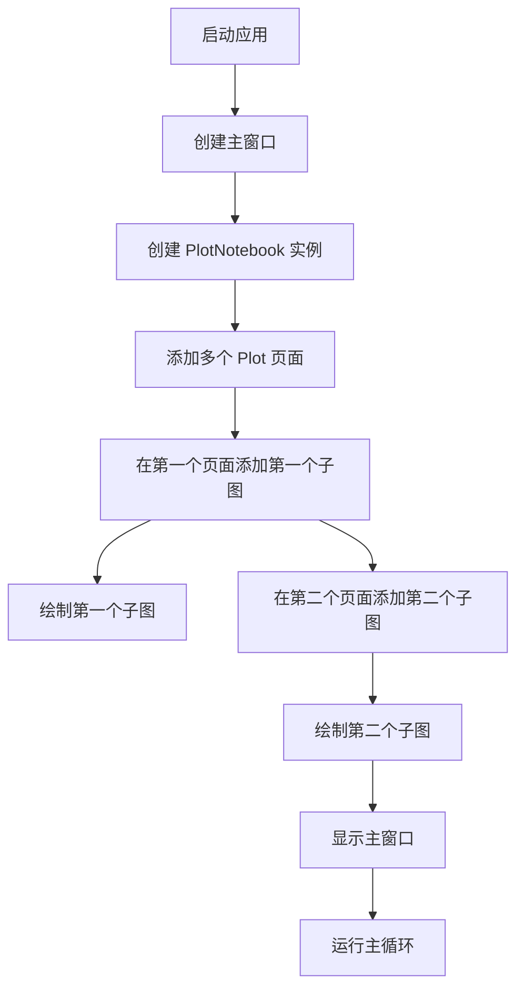
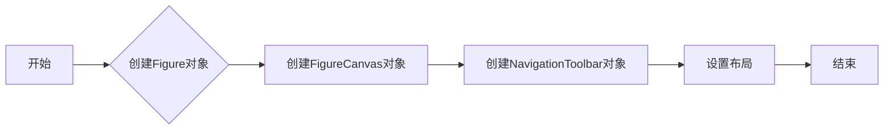
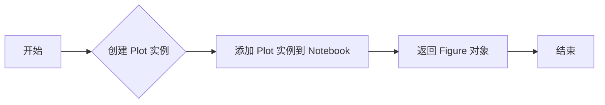
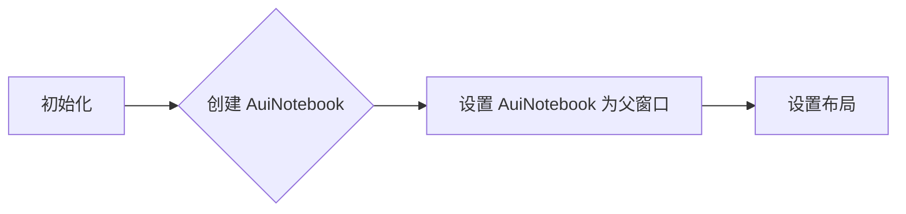
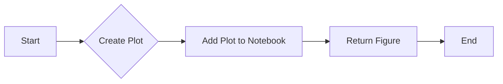

# `matplotlib\galleries\examples\user_interfaces\embedding_in_wx5_sgskip.py` 详细设计文档

This code provides a wxPython-based application for plotting graphs using matplotlib. It includes a Plot class for creating plots and a PlotNotebook class for managing multiple plots in a notebook interface.

## 整体流程



## 类结构

```
Plot (绘图面板类)
├── PlotNotebook (笔记本面板类)
└── demo (全局函数)
```

## 全局变量及字段


### `app`
    
The application object for wxPython.

类型：`wx.App`
    


### `frame`
    
The main window frame of the application.

类型：`wx.Frame`
    


### `plotter`
    
The notebook panel containing multiple plot pages.

类型：`PlotNotebook`
    


### `axes1`
    
The first subplot for plotting in the notebook.

类型：`matplotlib.axes._subplots.AxesSubplot`
    


### `axes2`
    
The second subplot for plotting in the notebook.

类型：`matplotlib.axes._subplots.AxesSubplot`
    


### `{'name': 'Plot', 'fields': ['figure', 'canvas', 'toolbar', 'sizer'], 'methods': ['__init__', 'add']}.figure`
    
The matplotlib figure object for the Plot class.

类型：`matplotlib.figure.Figure`
    


### `{'name': 'Plot', 'fields': ['figure', 'canvas', 'toolbar', 'sizer'], 'methods': ['__init__', 'add']}.canvas`
    
The canvas widget for the Plot class to display the matplotlib figure.

类型：`matplotlib.backends.backend_wxagg.FigureCanvasWxAgg`
    


### `{'name': 'Plot', 'fields': ['figure', 'canvas', 'toolbar', 'sizer'], 'methods': ['__init__', 'add']}.toolbar`
    
The navigation toolbar for the Plot class to interact with the matplotlib figure.

类型：`matplotlib.backends.backend_wxagg.NavigationToolbar2WxAgg`
    


### `{'name': 'Plot', 'fields': ['figure', 'canvas', 'toolbar', 'sizer'], 'methods': ['__init__', 'add']}.sizer`
    
The sizer for the Plot class to manage the layout of its children.

类型：`wx.BoxSizer`
    


### `{'name': 'PlotNotebook', 'fields': ['nb', 'sizer'], 'methods': ['__init__', 'add']}.nb`
    
The AUI notebook for the PlotNotebook class to contain multiple pages.

类型：`wx.lib.agw.aui.AuiNotebook`
    


### `{'name': 'PlotNotebook', 'fields': ['nb', 'sizer'], 'methods': ['__init__', 'add']}.sizer`
    
The sizer for the PlotNotebook class to manage the layout of its children.

类型：`wx.BoxSizer`
    


### `Plot.figure`
    
The matplotlib figure object for the Plot class.

类型：`matplotlib.figure.Figure`
    


### `Plot.canvas`
    
The canvas widget for the Plot class to display the matplotlib figure.

类型：`matplotlib.backends.backend_wxagg.FigureCanvasWxAgg`
    


### `Plot.toolbar`
    
The navigation toolbar for the Plot class to interact with the matplotlib figure.

类型：`matplotlib.backends.backend_wxagg.NavigationToolbar2WxAgg`
    


### `Plot.sizer`
    
The sizer for the Plot class to manage the layout of its children.

类型：`wx.BoxSizer`
    


### `PlotNotebook.nb`
    
The AUI notebook for the PlotNotebook class to contain multiple pages.

类型：`wx.lib.agw.aui.AuiNotebook`
    


### `PlotNotebook.sizer`
    
The sizer for the PlotNotebook class to manage the layout of its children.

类型：`wx.BoxSizer`
    
    

## 全局函数及方法


### demo()

该函数创建一个包含两个绘图区域的窗口，并展示如何使用matplotlib在wxPython中绘制图形。

参数：

- 无

返回值：无

#### 流程图


#### 带注释源码

```python
def demo():
    # Create a wx.App instance
    app = wit.InspectableApp()
    # Create a wx.Frame instance
    frame = wx.Frame(None, -1, 'Plotter')
    # Create a PlotNotebook instance
    plotter = PlotNotebook(frame)
    # Add 'figure 1' to the Notebook and get the axes
    axes1 = plotter.add('figure 1').add_subplot()
    # Plot data on axes1
    axes1.plot([1, 2, 3], [2, 1, 4])
    # Add 'figure 2' to the Notebook and get the axes
    axes2 = plotter.add('figure 2').add_subplot()
    # Plot data on axes2
    axes2.plot([1, 2, 3, 4, 5], [2, 1, 4, 2, 3])
    # Show the Frame
    frame.Show()
    # Start the MainLoop
    app.MainLoop()
``` 


### Plot.__init__

初始化Plot类，创建一个matplotlib图形界面。

参数：

- `parent`：`wx.Panel`，父窗口对象。
- `id`：`int`，窗口ID，默认为-1。
- `dpi`：`int`，图形的DPI（每英寸点数），默认为None。
- `**kwargs`：`dict`，额外的关键字参数。

返回值：无

#### 流程图



#### 带注释源码

```python
def __init__(self, parent, id=-1, dpi=None, **kwargs):
    super().__init__(parent, id=id, **kwargs)
    self.figure = Figure(dpi=dpi, figsize=(2, 2))
    self.canvas = FigureCanvas(self, -1, self.figure)
    self.toolbar = NavigationToolbar(self.canvas)
    self.toolbar.Realize()
    sizer = wx.BoxSizer(wx.VERTICAL)
    sizer.Add(self.canvas, 1, wx.EXPAND)
    sizer.Add(self.toolbar, 0, wx.LEFT | wx.EXPAND)
    self.SetSizer(sizer)
```


### Plot.add

`Plot.add` 方法是 `Plot` 类的一个实例方法，用于向 `PlotNotebook` 中添加一个新的 `Plot` 页面。

参数：

- `name`：`str`，默认为 `"plot"`，用于设置新添加的 `Plot` 页面的名称。

返回值：`matplotlib.figure.Figure`，返回新添加的 `Plot` 页面的 `Figure` 对象。

#### 流程图



#### 带注释源码

```python
def add(self, name="plot"):
    page = Plot(self.nb)  # 创建 Plot 实例
    self.nb.AddPage(page, name)  # 添加 Plot 实例到 Notebook
    return page.figure  # 返回 Figure 对象
``` 


### `PlotNotebook.__init__`

初始化 `PlotNotebook` 类的构造函数，创建一个 AuiNotebook 控件用于容纳多个绘图页面。

参数：

- `parent`：`wx.Panel`，父窗口对象
- `id`：`int`，窗口的 ID，默认为 -1

返回值：无

#### 流程图



#### 带注释源码

```python
class PlotNotebook(wx.Panel):
    def __init__(self, parent, id=-1):
        super().__init__(parent, id=id)
        self.nb = aui.AuiNotebook(self)  # 创建 AuiNotebook 控件
        sizer = wx.BoxSizer()
        sizer.Add(self.nb, 1, wx.EXPAND)  # 设置布局
        self.SetSizer(sizer)
```


### PlotNotebook.add

`PlotNotebook.add` 方法用于向 `PlotNotebook` 实例中添加一个新的 `Plot` 页面。

参数：

- `name`：`str`，默认为 `"plot"`，用于设置新页面的标签名称。

返回值：`matplotlib.figure.Figure`，返回新创建的 `Figure` 对象。

#### 流程图



#### 带注释源码

```python
def add(self, name="plot"):
    # 创建一个新的 Plot 页面
    page = Plot(self.nb)
    # 将新页面添加到 Notebook 中，并设置标签名称
    self.nb.AddPage(page, name)
    # 返回新创建的 Figure 对象
    return page.figure
``` 


## 关键组件


### 张量索引与惰性加载

张量索引与惰性加载是处理大型数据集时常用的技术，它允许在需要时才计算或加载数据，从而提高效率。

### 反量化支持

反量化支持是指系统对量化操作的反向操作的支持，允许在量化后的模型上进行反向传播，以恢复原始的浮点数值。

### 量化策略

量化策略是指将浮点数转换为固定点数表示的方法，通常用于减少模型的存储和计算需求，提高运行效率。


## 问题及建议


### 已知问题

-   **全局变量和函数的使用**：代码中使用了全局变量和函数，如`demo()`函数，这可能导致代码的可维护性和可测试性降低。
-   **matplotlib的依赖性**：代码依赖于matplotlib库，这可能会限制代码的可移植性，因为matplotlib不是wxPython的一部分。
-   **硬编码的尺寸**：在`Plot`类的初始化中，硬编码了图形的尺寸（`figsize=(2, 2)`），这可能会限制图形的可定制性。
-   **异常处理**：代码中没有显示的异常处理机制，这可能导致程序在遇到错误时崩溃。

### 优化建议

-   **移除全局变量和函数**：将全局变量和函数封装在类中，以提高代码的模块化和可测试性。
-   **使用抽象基类**：创建一个抽象基类，其中包含matplotlib的依赖性，这样可以在不同的环境中重用代码。
-   **提供尺寸参数**：为`Plot`类提供尺寸参数，以便用户可以自定义图形的尺寸。
-   **添加异常处理**：在代码中添加异常处理，以捕获和处理可能发生的错误，提高程序的健壮性。
-   **代码注释和文档**：添加代码注释和文档，以提高代码的可读性和可维护性。
-   **单元测试**：编写单元测试来验证代码的功能，确保代码的质量和稳定性。
-   **使用配置文件**：使用配置文件来存储用户设置和图形参数，以便用户可以自定义应用程序的行为。


## 其它


### 设计目标与约束

- 设计目标：实现一个基于wxPython和matplotlib的绘图工具，用于创建和展示多个图表。
- 约束条件：使用wxPython框架进行GUI设计，使用matplotlib进行数据可视化。

### 错误处理与异常设计

- 错误处理：在代码中应包含异常处理机制，捕获并处理可能出现的错误，如文件读取错误、绘图错误等。
- 异常设计：定义自定义异常类，以便于在代码中更清晰地处理特定类型的错误。

### 数据流与状态机

- 数据流：数据从用户输入或外部源传入，经过处理和可视化展示。
- 状态机：根据用户操作或程序逻辑，状态机可以切换不同的界面或图表展示状态。

### 外部依赖与接口契约

- 外部依赖：代码依赖于wxPython和matplotlib库，这些库需要正确安装和配置。
- 接口契约：定义清晰的接口规范，确保不同模块之间的交互和依赖关系明确。

### 用户界面与交互设计

- 用户界面：设计直观易用的用户界面，包括图表创建、编辑和展示功能。
- 交互设计：提供用户友好的交互方式，如拖放、点击等，以增强用户体验。

### 性能优化与资源管理

- 性能优化：对代码进行性能分析和优化，确保程序运行流畅。
- 资源管理：合理管理资源，如内存和文件操作，避免资源泄漏。

### 安全性与隐私保护

- 安全性：确保程序在运行过程中不会受到恶意攻击，如SQL注入、跨站脚本攻击等。
- 隐私保护：保护用户数据的安全，避免数据泄露。

### 可维护性与可扩展性

- 可维护性：编写清晰、易于理解的代码，便于后续维护和更新。
- 可扩展性：设计模块化的代码结构，方便添加新功能或修改现有功能。

### 测试与质量保证

- 测试：编写单元测试和集成测试，确保代码质量和功能正确性。
- 质量保证：通过代码审查和持续集成，确保代码质量和开发效率。

### 文档与帮助

- 文档：编写详细的用户手册和开发文档，帮助用户和开发者理解和使用程序。
- 帮助：提供在线帮助或离线帮助文档，方便用户查询和解决问题。


    