# `matplotlib\galleries\examples\user_interfaces\fourier_demo_wx_sgskip.py` 详细设计文档

This code implements a graphical user interface (GUI) application that demonstrates the Fourier transform using sliders to adjust frequency and amplitude of a waveform.

## 整体流程

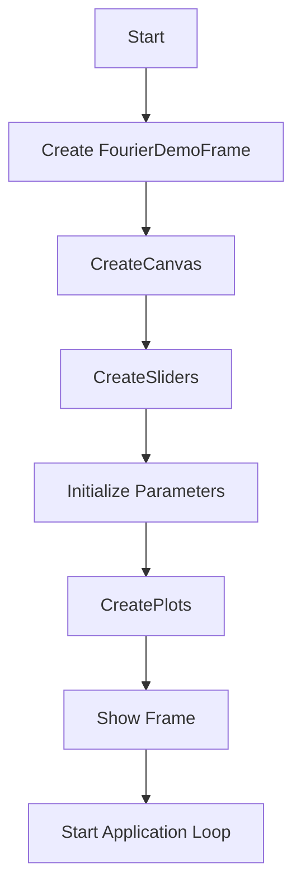

## 类结构

```
FourierDemoFrame (主窗口类)
├── Knob (抽象基类)
│   ├── setKnob
├── Param (参数类)
│   ├── __init__
│   ├── attach
│   ├── set
│   └── constrain
├── SliderGroup (Knob子类)
│   ├── __init__
│   ├── sliderHandler
│   ├── sliderTextHandler
│   └── setKnob
└── App (wx.App子类)
    ├── OnInit
```

## 全局变量及字段


### `lines`
    
List of line objects representing the waveforms in the plot.

类型：`list of matplotlib.lines.Line2D`
    


### `figure`
    
Figure object containing the plot.

类型：`matplotlib.figure.Figure`
    


### `canvas`
    
Canvas object for rendering the plot in wx.

类型：`matplotlib.backends.backend_wxagg.FigureCanvasWxAgg`
    


### `state`
    
Current state of the mouse interaction, e.g., 'frequency', 'time', or ''.

类型：`str`
    


### `mouseInfo`
    
Tuple containing information about the mouse position and the initial parameters for the interaction.

类型：`tuple`
    


### `f0`
    
Parameter object representing the frequency of the waveform.

类型：`Param`
    


### `A`
    
Parameter object representing the amplitude of the waveform.

类型：`Param`
    


### `frequencySliderGroup`
    
SliderGroup object for the frequency slider.

类型：`SliderGroup`
    


### `amplitudeSliderGroup`
    
SliderGroup object for the amplitude slider.

类型：`SliderGroup`
    


### `Param.minimum`
    
Minimum value for the parameter.

类型：`float`
    


### `Param.maximum`
    
Maximum value for the parameter.

类型：`float`
    


### `Param.value`
    
Current value of the parameter.

类型：`float`
    


### `Param.knobs`
    
List of Knob objects that are attached to this parameter.

类型：`list of Knob`
    


### `SliderGroup.sliderLabel`
    
Static text label for the slider.

类型：`wx.StaticText`
    


### `SliderGroup.sliderText`
    
Text control for entering the slider value directly.

类型：`wx.TextCtrl`
    


### `SliderGroup.slider`
    
Slider widget for adjusting the parameter value.

类型：`wx.Slider`
    


### `SliderGroup.sizer`
    
Sizer for layout of the slider components.

类型：`wx.BoxSizer`
    


### `SliderGroup.param`
    
Parameter object that the slider is controlling.

类型：`Param`
    
    

## 全局函数及方法


### compute

This function computes the frequency domain and time domain waveforms based on the given frequency and amplitude parameters.

参数：

- `f0`：`float`，The frequency of the waveform.
- `A`：`float`，The amplitude of the waveform.

返回值：`tuple`，A tuple containing the frequency domain data (`f`, `X`) and the time domain data (`t`, `x`).

#### 流程图

```mermaid
graph LR
A[Start] --> B[Compute frequency domain data]
B --> C[Compute time domain data]
C --> D[Return (f, X, t, x)]
D --> E[End]
```

#### 带注释源码

```python
def compute(self, f0, A):
    f = np.arange(-6., 6., 0.02)
    t = np.arange(-2., 2., 0.01)
    x = A * np.cos(2 * np.pi * f0 * t) * np.exp(-np.pi * t ** 2)
    X = A / 2 * \
        (np.exp(-np.pi * (f - f0) ** 2) + np.exp(-np.pi * (f + f0) ** 2))
    return f, X, t, x
```


### Knob.setKnob

This method sets the value of the knob.

参数：

- `value`：`float`，The new value for the knob.

返回值：`None`，No return value.

#### 流程图

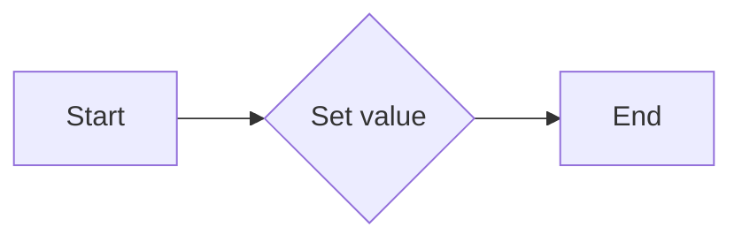

#### 带注释源码

```python
def setKnob(self, value):
    pass  # Placeholder for setting the value of the knob
```


### Param.__init__

This method initializes a `Param` instance with an initial value, minimum, and maximum constraints.

参数：

- `initialValue`：`None` 或 `float`，The initial value of the parameter.
- `minimum`：`float`，The minimum allowed value of the parameter.
- `maximum`：`float`，The maximum allowed value of the parameter.

返回值：`None`，This method does not return a value.

#### 流程图

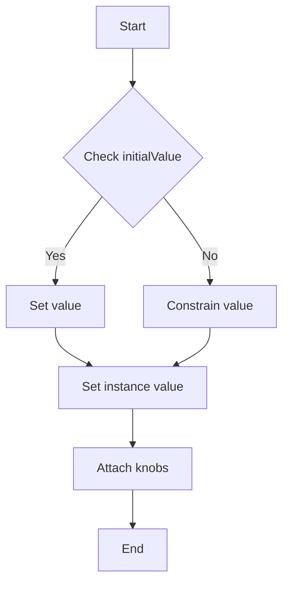

#### 带注释源码

```python
def __init__(self, initialValue=None, minimum=0., maximum=1.):
    self.minimum = minimum
    self.maximum = maximum
    if initialValue != self.constrain(initialValue):
        raise ValueError('illegal initial value')
    self.value = initialValue
    self.knobs = []

    # Set the initial value of the parameter, constrained by minimum and maximum.
    if initialValue != self.constrain(initialValue):
        raise ValueError('illegal initial value')

    # Attach all knobs to the parameter.
    for feedbackKnob in self.knobs:
        if feedbackKnob != knob:
            feedbackKnob.setKnob(self.value)
```


### Param.attach

Attach a Knob instance to the Param instance.

参数：

- `knob`：`Knob`，The Knob instance to be attached to the Param instance.

返回值：`None`，No return value.

#### 流程图

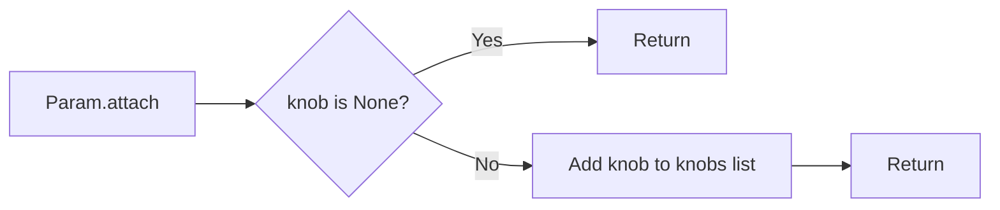

#### 带注释源码

```python
def attach(self, knob):
    self.knobs += [knob]
```


### Param.set

This method updates the value of the parameter and notifies other attached knobs about the change.

参数：

- `value`：`float`，The new value for the parameter.
- `knob`：`Knob`，Optional. The knob that triggered the change. If provided, it will not be notified of the change.

返回值：`float`，The constrained value of the parameter.

#### 流程图

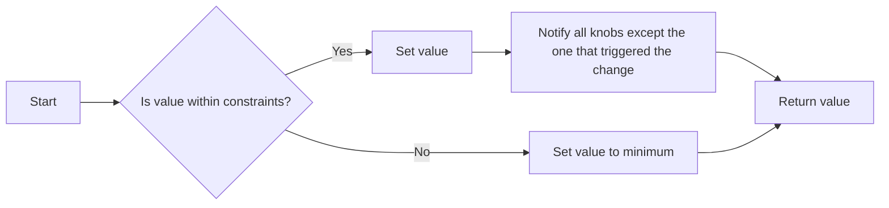

#### 带注释源码

```python
def set(self, value, knob=None):
    self.value = value
    self.value = self.constrain(value)
    for feedbackKnob in self.knobs:
        if feedbackKnob != knob:
            feedbackKnob.setKnob(self.value)
    return self.value
``` 


### Param.constrain

This method is used to constrain the value of a parameter to be within a specified range.

参数：

- `value`：`float`，The value to be constrained.
...

返回值：`float`，The constrained value.

#### 流程图

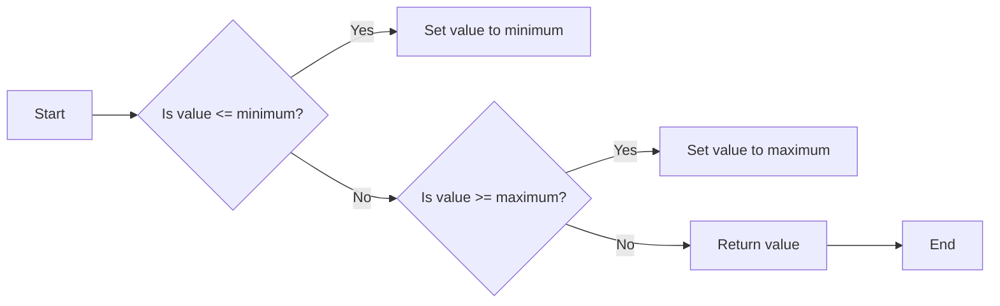

#### 带注释源码

```python
def constrain(self, value):
    if value <= self.minimum:
        value = self.minimum
    if value >= self.maximum:
        value = self.maximum
    return value
```


### SliderGroup.__init__

This method initializes a `SliderGroup` instance, which is a subclass of `Knob`. It creates the GUI elements for a slider and text control, sets up the slider range, and binds event handlers for slider and text control events.

参数：

- `parent`：`wx.Window`，The parent window for the slider group.
- `label`：`str`，The label for the slider.
- `param`：`Param`，The `Param` instance that the slider is associated with.

返回值：`None`，This method does not return a value.

#### 流程图

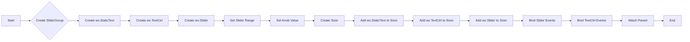

#### 带注释源码

```python
def __init__(self, parent, label, param):
    self.sliderLabel = wx.StaticText(parent, label=label)
    self.sliderText = wx.TextCtrl(parent, -1, style=wx.TE_PROCESS_ENTER)
    self.slider = wx.Slider(parent, -1)
    # self.slider.SetMax(param.maximum*1000)
    self.slider.SetRange(0, int(param.maximum * 1000))
    self.setKnob(param.value)

    sizer = wx.BoxSizer(wx.HORIZONTAL)
    sizer.Add(self.sliderLabel, 0,
              wx.EXPAND | wx.ALL,
              border=2)
    sizer.Add(self.sliderText, 0,
              wx.EXPAND | wx.ALL,
              border=2)
    sizer.Add(self.slider, 1, wx.EXPAND)
    self.sizer = sizer

    self.slider.Bind(wx.EVT_SLIDER, self.sliderHandler)
    self.sliderText.Bind(wx.EVT_TEXT_ENTER, self.sliderTextHandler)

    self.param = param
    self.param.attach(self)
``` 


### SliderGroup.sliderHandler

This method handles the slider event when the slider value changes.

参数：

- `event`：`wx.SliderEvent`，The event object that was triggered by the slider.

返回值：`None`，No return value.

#### 流程图

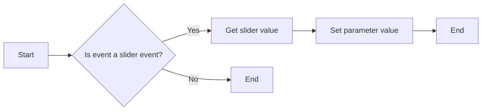

#### 带注释源码

```python
def sliderHandler(self, event):
    # Get the slider value from the event
    value = event.GetInt() / 1000.
    # Set the parameter value
    self.param.set(value)
```


### SliderGroup.sliderTextHandler

This method handles the event when the Enter key is pressed in the text control associated with the slider. It updates the parameter value based on the text entered by the user.

参数：

- `event`：`wx.EVT_TEXT_ENTER`，This is the event object that contains information about the event.

返回值：`None`，This method does not return any value.

#### 流程图

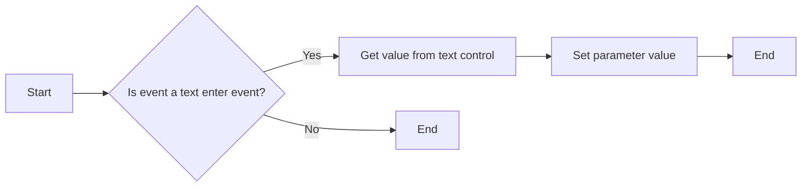

#### 带注释源码

```python
def sliderTextHandler(self, event):
    value = float(self.sliderText.GetValue())
    self.param.set(value)
```


### SliderGroup.setKnob

This method updates the slider's text and position based on the value of the parameter it is controlling.

参数：

- `value`：`float`，The new value of the parameter to be set on the slider.

返回值：`None`，This method does not return a value.

#### 流程图

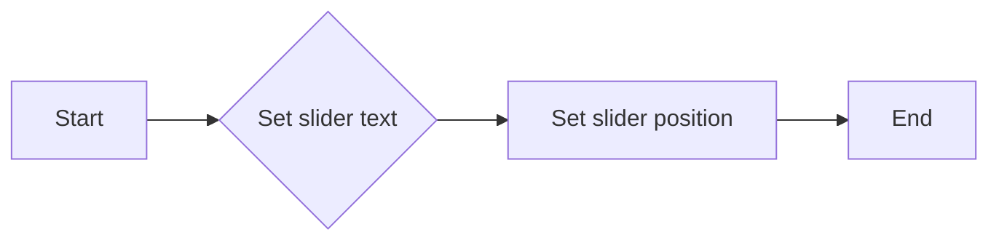

#### 带注释源码

```python
def setKnob(self, value):
    # Set the slider text to the new value formatted as a string
    self.sliderText.SetValue(f'{value:g}')
    # Set the slider position to the new value scaled to the slider's range
    self.slider.SetValue(int(value * 1000))
```


### FourierDemoFrame.__init__

This method initializes the `FourierDemoFrame` class, which is a wxWidgets application frame for demonstrating Fourier transformations.

参数：

- `*args`：可变参数列表，用于传递给父类 `wx.Frame` 的构造函数。
- `**kwargs`：关键字参数字典，用于传递给父类 `wx.Frame` 的构造函数。

返回值：无

#### 流程图

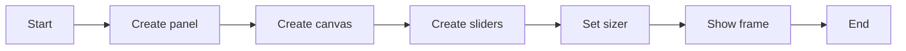

#### 带注释源码

```python
def __init__(self, *args, **kwargs):
    super().__init__(*args, **kwargs)
    panel = wx.Panel(self)

    # create the GUI elements
    self.createCanvas(panel)
    self.createSliders(panel)

    # place them in a sizer for the Layout
    sizer = wx.BoxSizer(wx.VERTICAL)
    sizer.Add(self.canvas, 1, wx.EXPAND)
    sizer.Add(self.frequencySliderGroup.sizer, 0,
              wx.EXPAND | wx.ALL, border=5)
    sizer.Add(self.amplitudeSliderGroup.sizer, 0,
              wx.EXPAND | wx.ALL, border=5)
    panel.SetSizer(sizer)
```


### FourierDemoFrame.createCanvas

This method creates the canvas for the Fourier Demo application, which includes setting up the matplotlib figure and canvas, and initializing the parameters for frequency and amplitude.

参数：

- `parent`：`wx.Panel`，The parent panel where the canvas will be placed.

返回值：`None`，This method does not return any value.

#### 流程图

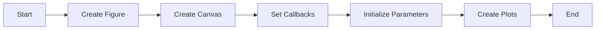

#### 带注释源码

```python
def createCanvas(self, parent):
    self.lines = []
    self.figure = Figure()
    self.canvas = FigureCanvas(parent, -1, self.figure)
    self.canvas.callbacks.connect('button_press_event', self.mouseDown)
    self.canvas.callbacks.connect('motion_notify_event', self.mouseMotion)
    self.canvas.callbacks.connect('button_release_event', self.mouseUp)
    self.state = ''
    self.mouseInfo = (None, None, None, None)
    self.f0 = Param(2., minimum=0., maximum=6.)
    self.A = Param(1., minimum=0.01, maximum=2.)
    self.createPlots()
    # Not sure I like having two params attached to the same Knob,
    # but that is what we have here... it works but feels kludgy -
    # although maybe it's not too bad since the knob changes both params
    # at the same time (both f0 and A are affected during a drag)
    self.f0.attach(self)
    self.A.attach(self)
```


### FourierDemoFrame.createSliders

This method creates the sliders for the frequency and amplitude parameters in the Fourier Demo GUI.

参数：

- `panel`：`wx.Panel`，The parent panel where the sliders will be placed.

返回值：`None`，This method does not return a value.

#### 流程图

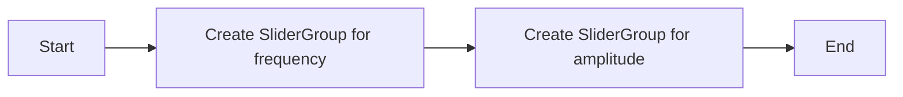

#### 带注释源码

```python
def createSliders(self, panel):
    # Create a slider group for frequency
    self.frequencySliderGroup = SliderGroup(
        panel,
        label='Frequency f0:',
        param=self.f0)
    
    # Create a slider group for amplitude
    self.amplitudeSliderGroup = SliderGroup(panel, label=' Amplitude a:', param=self.A)
```


### FourierDemoFrame.mouseDown

This method handles the mouse down event on the canvas of the FourierDemoFrame class. It determines whether the mouse click is on the frequency domain or time domain waveform and updates the state and mouse information accordingly.

参数：

- `event`：`matplotlib.backend_wxagg.event.Event`，The event object containing information about the mouse down event.

返回值：`None`，This method does not return any value.

#### 流程图

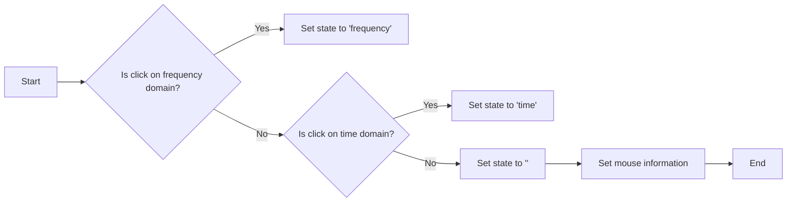

#### 带注释源码

```python
def mouseDown(self, event):
    if self.lines[0].contains(event)[0]:
        self.state = 'frequency'
    elif self.lines[1].contains(event)[0]:
        self.state = 'time'
    else:
        self.state = ''
    self.mouseInfo = (event.xdata, event.ydata,
                      max(self.f0.value, .1),
                      self.A.value)
```


### FourierDemoFrame.mouseMotion

This method handles the mouse motion event in the FourierDemoFrame class. It updates the frequency or amplitude of the waveform based on the mouse movement within the plot area.

参数：

- `event`：`matplotlib.backend_wxagg.event.Event`，The mouse motion event object.

返回值：`None`，This method does not return any value.

#### 流程图

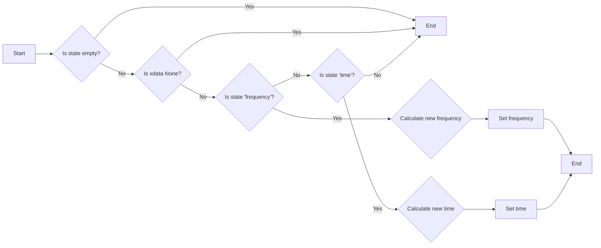

#### 带注释源码

```python
def mouseMotion(self, event):
    if self.state == '':
        return
    x, y = event.xdata, event.ydata
    if x is None:  # outside the Axes
        return
    x0, y0, f0Init, AInit = self.mouseInfo
    self.A.set(AInit + (AInit * (y - y0) / y0), self)
    if self.state == 'frequency':
        self.f0.set(f0Init + (f0Init * (x - x0) / x0))
    elif self.state == 'time':
        if (x - x0) / x0 != -1.:
            self.f0.set(1. / (1. / f0Init + (1. / f0Init * (x - x0) / x0)))
```


### FourierDemoFrame.mouseUp

This method handles the mouse button release event on the canvas of the FourierDemoFrame class. It resets the state of the mouse interaction.

参数：

- `event`：`wx.MouseEvent`，The event object that contains information about the mouse event.

返回值：`None`，This method does not return any value.

#### 流程图

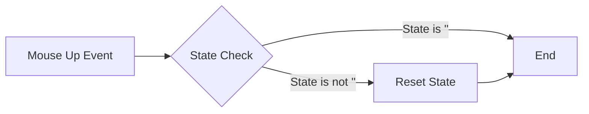

#### 带注释源码

```python
def mouseUp(self, event):
    # Reset the state to ''
    self.state = ''
```


### FourierDemoFrame.createPlots

This method creates the subplots, waveforms, and labels for the Fourier Demo application. It initializes the plots with the initial frequency and amplitude values.

参数：

- 无

返回值：无

#### 流程图

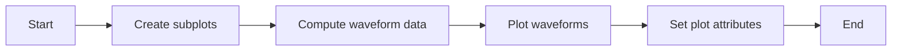

#### 带注释源码

```python
def createPlots(self):
    # This method creates the subplots, waveforms and labels.
    # Later, when the waveforms or sliders are dragged, only the
    # waveform data will be updated (not here, but below in setKnob).
    self.subplot1, self.subplot2 = self.figure.subplots(2)
    x1, y1, x2, y2 = self.compute(self.f0.value, self.A.value)
    color = (1., 0., 0.)
    self.lines += self.subplot1.plot(x1, y1, color=color, linewidth=2)
    self.lines += self.subplot2.plot(x2, y2, color=color, linewidth=2)
    # Set some plot attributes
    self.subplot1.set_title(
        "Click and drag waveforms to change frequency and amplitude",
        fontsize=12)
    self.subplot1.set_ylabel("Frequency Domain Waveform X(f)", fontsize=8)
    self.subplot1.set_xlabel("frequency f", fontsize=8)
    self.subplot2.set_ylabel("Time Domain Waveform x(t)", fontsize=8)
    self.subplot2.set_xlabel("time t", fontsize=8)
    self.subplot1.set_xlim(-6, 6)
    self.subplot1.set_ylim(0, 1)
    self.subplot2.set_xlim(-2, 2)
    self.subplot2.set_ylim(-2, 2)
    self.subplot1.text(0.05, .95,
                       r'$X(f) = \mathcal{F}\{x(t)\}$',
                       verticalalignment='top',
                       transform=self.subplot1.transAxes)
    self.subplot2.text(0.05, .95,
                       r'$x(t) = a \cdot \cos(2\pi f_0 t) e^{-\pi t^2}$',
                       verticalalignment='top',
                       transform=self.subplot2.transAxes)
```


### FourierDemoFrame.compute

This method computes the frequency and time domain waveforms based on the given frequency (f0) and amplitude (A).

参数：

- `f0`：`float`，The frequency of the waveform.
- `A`：`float`，The amplitude of the waveform.

返回值：`tuple`，A tuple containing the frequency and time domain waveforms.

#### 流程图

```mermaid
graph LR
A[Start] --> B{Compute frequency domain waveform X(f)}
B --> C{Compute time domain waveform x(t)}
C --> D[End]
```

#### 带注释源码

```python
def compute(self, f0, A):
    f = np.arange(-6., 6., 0.02)  # Frequency range
    t = np.arange(-2., 2., 0.01)  # Time range
    x = A * np.cos(2 * np.pi * f0 * t) * np.exp(-np.pi * t ** 2)  # Time domain waveform
    X = A / 2 * (np.exp(-np.pi * (f - f0) ** 2) + np.exp(-np.pi * (f + f0) ** 2))  # Frequency domain waveform
    return f, X, t, x  # Return the computed waveforms
```


### FourierDemoFrame.setKnob

This method updates the waveform data displayed in the plot based on the current values of the frequency and amplitude parameters.

参数：

- `value`：`None`，This parameter is ignored as the method updates the waveform data based on the state of the parameters.

返回值：`None`，This method does not return any value.

#### 流程图

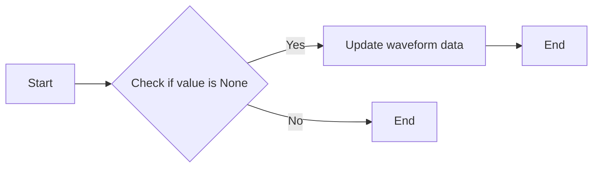

#### 带注释源码

```python
def setKnob(self, value):
    # Note, we ignore value arg here and just go by state of the params
    x1, y1, x2, y2 = self.compute(self.f0.value, self.A.value)
    # update the data of the two waveforms
    self.lines[0].set(xdata=x1, ydata=y1)
    self.lines[1].set(xdata=x2, ydata=y2)
    # make the canvas draw its contents again with the new data
    self.canvas.draw()
```


### App.OnInit

初始化应用程序框架。

参数：

- 无

返回值：`bool`，表示初始化是否成功

#### 流程图

```mermaid
graph LR
A[OnInit] --> B{初始化框架}
B --> C{显示框架}
C --> D{返回True}
```

#### 带注释源码

```python
class App(wx.App):
    def OnInit(self):
        # 创建主框架实例
        self.frame1 = FourierDemoFrame(parent=None, title="Fourier Demo",
                                       size=(640, 480))
        # 显示主框架
        self.frame1.Show()
        # 返回True表示初始化成功
        return True
```

## 关键组件


### 张量索引与惰性加载

张量索引与惰性加载是代码中用于处理和访问数据结构的关键组件。它们允许在需要时才计算或加载数据，从而提高性能和效率。

### 反量化支持

反量化支持是代码中用于处理和转换数据的关键组件。它允许将量化数据转换回原始精度，以便进行进一步处理或分析。

### 量化策略

量化策略是代码中用于优化数据表示和存储的关键组件。它通过减少数据精度来减少内存使用和计算需求，同时保持足够的精度以满足应用需求。


## 问题及建议


### 已知问题

-   **重复参数控制**: `f0` 和 `A` 两个参数被同一个 `Knob` 控制可能会引起混淆，因为它们同时响应同一个 `Knob` 的变化，这可能导致难以追踪的副作用。
-   **硬编码的数值**: 在 `createPlots` 方法中，硬编码了一些数值，如 `xlim`, `ylim` 和 `xlabel`, `ylabel` 的值，这不利于代码的可维护性和可扩展性。
-   **事件处理**: 事件处理（如鼠标按下、移动和释放）在 `FourierDemoFrame` 类中直接处理，这可能导致类职责过重，违反了单一职责原则。
-   **全局变量**: `self.lines` 在 `FourierDemoFrame` 类中作为全局变量使用，这违反了封装原则，并可能导致代码难以测试和维护。

### 优化建议

-   **分离参数控制**: 将 `f0` 和 `A` 的控制分离，为每个参数创建单独的 `Knob`，这样每个参数的变化可以独立追踪。
-   **参数化数值**: 将 `createPlots` 方法中的硬编码数值替换为参数，以便于调整和扩展。
-   **事件处理分离**: 将事件处理逻辑分离到单独的事件处理类或方法中，以减少 `FourierDemoFrame` 类的职责。
-   **使用属性**: 将 `self.lines` 转换为属性，以提供更好的封装和访问控制。
-   **异常处理**: 在代码中添加异常处理，以处理潜在的运行时错误，如输入值错误或图形库错误。
-   **代码注释**: 添加更多的代码注释，以提高代码的可读性和可维护性。
-   **单元测试**: 编写单元测试来验证代码的功能，确保代码的稳定性和可靠性。
-   **性能优化**: 分析代码的性能瓶颈，并采取相应的优化措施，如减少不必要的计算或使用更高效的算法。
-   **代码风格**: 考虑使用代码风格指南来统一代码风格，以提高代码的可读性和一致性。
-   **文档**: 编写详细的文档，包括代码的功能、使用方法和维护指南。


## 其它


### 设计目标与约束

- 设计目标：
  - 创建一个用户友好的界面，允许用户通过滑动条和拖动波形来调整频率和振幅。
  - 实现傅里叶变换的实时可视化，展示频率域和时间域的波形。
  - 确保参数值在合理的范围内，避免非法值。

- 约束：
  - 使用wxWidgets库创建GUI，确保跨平台兼容性。
  - 使用NumPy库进行数学计算，确保高效的数据处理。
  - 限制参数值的范围，避免超出物理意义。

### 错误处理与异常设计

- 错误处理：
  - 当用户输入非法值时，抛出`ValueError`异常。
  - 当用户尝试设置超出参数范围的值时，自动将其限制在范围内。

- 异常设计：
  - 使用try-except块捕获和处理可能发生的异常。
  - 提供清晰的错误信息，帮助用户理解问题所在。

### 数据流与状态机

- 数据流：
  - 用户通过滑动条或拖动波形来改变参数值。
  - 参数值的变化通过`set`方法传递给所有关联的knobs。
  - knobs更新其显示值，并触发绘图组件的更新。

- 状态机：
  - 状态机用于跟踪鼠标事件，确定用户是在调整频率还是振幅。
  - 状态包括：'frequency'、'time'和''（无操作）。

### 外部依赖与接口契约

- 外部依赖：
  - wxWidgets库：用于创建GUI。
  - NumPy库：用于数学计算。
  - Matplotlib库：用于绘图。

- 接口契约：
  - `Knob`类提供了一个`setKnob`方法，用于更新knob的显示值。
  - `Param`类提供了一个`set`方法，用于设置参数值并更新所有knobs。
  - `FourierDemoFrame`类负责创建GUI元素，并处理用户交互。
  - `App`类负责启动应用程序。


    