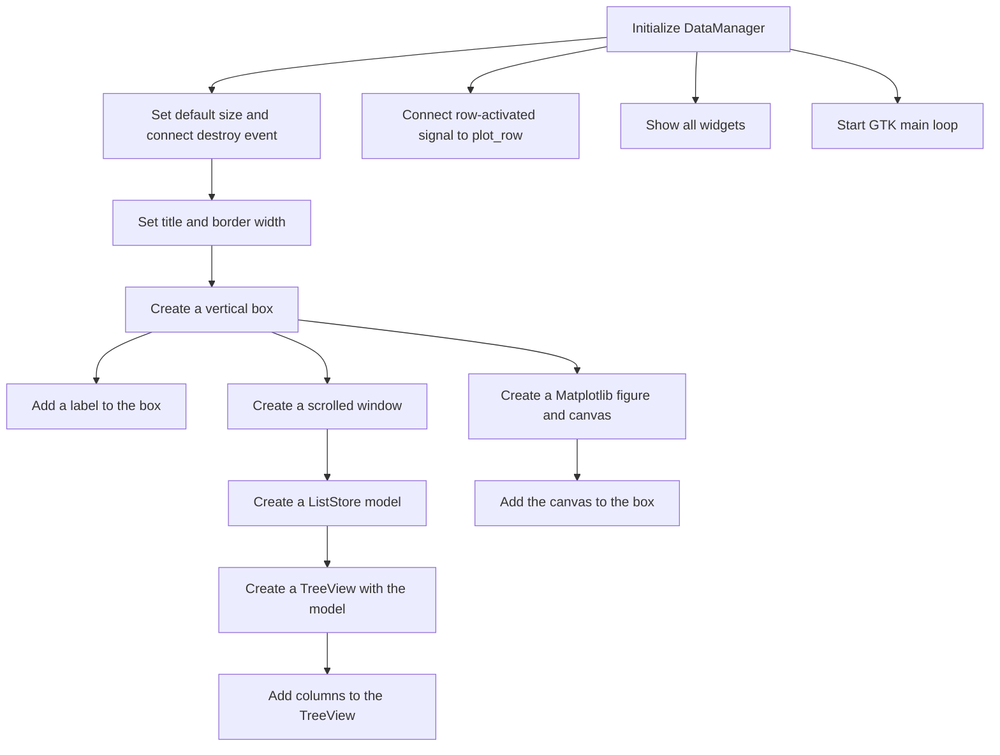
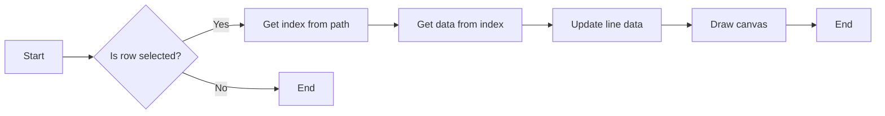
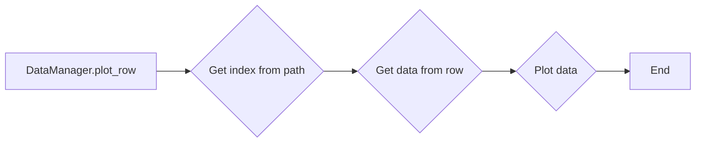
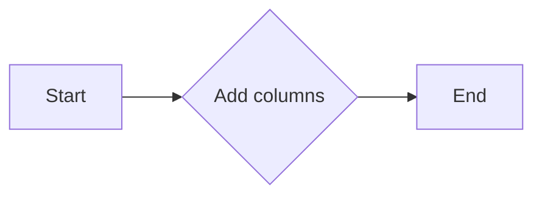

```mermaid
graph LR
A[Start] --> B{Create Window}
B --> C[Set Default Size]
C --> D[Connect Destroy Signal]
D --> E[Set Title]
E --> F[Set Border Width]
F --> G[Create VBox]
G --> H[Add Label]
H --> I[Create ScrolledWindow]
I --> J[Set Shadow Type]
I --> K[Set Policy]
K --> L[Create Model]
L --> M[Create TreeView]
M --> N[Connect Row Activated Signal]
N --> O[Add ScrolledWindow to VBox]
O --> P[Create Figure]
P --> Q[Add Subplot]
Q --> R[Plot First Row]
R --> S[Add TreeView to ScrolledWindow]
S --> T[Add Columns]
T --> U[Create ListStore]
U --> V[Append Rows]
V --> W[Return Model]
W --> X[Add Model to TreeView]
X --> Y[Add Events]
Y --> Z[Show All]
Z --> AA[End]
```

# `matplotlib\galleries\examples\user_interfaces\gtk3_spreadsheet_sgskip.py` 详细设计文档

This code demonstrates embedding Matplotlib into a GTK3 application for data visualization. It allows users to double-click on a row in a treeview to plot the corresponding data points.

## 整体流程



## 类结构

```
DataManager (主类)
├── Gtk.Window
│   ├── num_rows
│   ├── num_cols
│   ├── data
│   ├── __init__
│   ├── plot_row
│   ├── add_columns
│   └── create_model
```

## 全局变量及字段


### `manager`
    
The main application window and data manager instance.

类型：`DataManager`
    


### `num_rows`
    
The number of rows in the data matrix.

类型：`int`
    


### `num_cols`
    
The number of columns in the data matrix.

类型：`int`
    


### `data`
    
The data matrix containing random numbers for plotting.

类型：`numpy.ndarray`
    


### `DataManager.num_rows`
    
The number of rows in the data matrix.

类型：`int`
    


### `DataManager.num_cols`
    
The number of columns in the data matrix.

类型：`int`
    


### `DataManager.data`
    
The data matrix containing random numbers for plotting.

类型：`numpy.ndarray`
    
    

## 全局函数及方法


### `DataManager.plot_row`

This method is responsible for plotting the data from a selected row in the treeview.

参数：

- `treeview`：`Gtk.TreeView`，The treeview widget that contains the data to be plotted.
- `path`：`str`，The path of the selected row in the treeview.
- `view_column`：`Gtk.TreeViewColumn`，The column of the selected row.

返回值：`None`，This method does not return any value.

#### 流程图



#### 带注释源码

```python
def plot_row(self, treeview, path, view_column):
    ind, = path  # get the index into data
    points = self.data[ind, :]
    self.line.set_ydata(points)
    self.canvas.draw()
```


### DataManager.__init__

初始化`DataManager`类，创建一个窗口，并设置其布局和组件。

参数：

- `self`：`DataManager`类的实例，用于访问类的属性和方法。

返回值：无

#### 流程图



#### 带注释源码

```python
def __init__(self):
    super().__init__()
    self.set_default_size(600, 600)
    self.connect('destroy', lambda win: Gtk.main_quit())
    self.set_title('GtkListStore demo')
    self.set_border_width(8)
    vbox = Gtk.VBox(homogeneous=False, spacing=8)
    self.add(vbox)
    label = Gtk.Label(label='Double click a row to plot the data')
    vbox.pack_start(label, False, False, 0)
    sw = Gtk.ScrolledWindow()
    sw.set_shadow_type(Gtk.ShadowType.ETCHED_IN)
    sw.set_policy(Gtk.PolicyType.NEVER, Gtk.PolicyType.AUTOMATIC)
    vbox.pack_start(sw, True, True, 0)
    model = self.create_model()
    self.treeview = Gtk.TreeView(model=model)
    fig = Figure(figsize=(6, 4))
    self.canvas = FigureCanvas(fig)  # a Gtk.DrawingArea
    vbox.pack_start(self.canvas, True, True, 0)
    ax = fig.add_subplot()
    self.line, = ax.plot(self.data[0, :], 'go')  # plot the first row
    self.treeview.connect('row-activated', self.plot_row)
    sw.add(self.treeview)
    self.add_columns()
    self.add_events(Gdk.EventMask.BUTTON_PRESS_MASK |
                    Gdk.EventMask.KEY_PRESS_MASK |
                    Gdk.EventMask.KEY_RELEASE_MASK)
```


### DataManager.plot_row

This method is responsible for plotting the data from a specific row in the data matrix.

参数：

- `treeview`：`Gtk.TreeView`，The TreeView widget that contains the data to be plotted.
- `path`：`Gtk.TreePath`，The path of the selected row in the TreeView.
- `view_column`：`Gtk.TreeViewColumn`，The column of the selected row in the TreeView.

返回值：`None`，This method does not return any value.

#### 流程图



#### 带注释源码

```python
def plot_row(self, treeview, path, view_column):
    # Get the index into data from the path
    ind, = path  # get the index into data
    # Get the data from the row
    points = self.data[ind, :]
    # Update the line with new data
    self.line.set_ydata(points)
    # Redraw the canvas with the updated plot
    self.canvas.draw()
```


### DataManager.add_columns

`DataManager.add_columns` 是 `DataManager` 类的一个方法，用于向 `Gtk.TreeView` 添加列。

参数：

- 无

返回值：无

#### 流程图



#### 带注释源码

```python
def add_columns(self):
    # 循环添加列到treeview
    for i in range(self.num_cols):
        column = Gtk.TreeViewColumn(str(i), Gtk.CellRendererText(), text=i)
        self.treeview.append_column(column)
``` 


### DataManager.create_model

该函数创建并返回一个`Gtk.ListStore`对象，用于存储数据并在树视图中显示。

参数：

- 无

返回值：`Gtk.ListStore`，一个用于存储数据的列表存储对象。

#### 流程图


#### 带注释源码

```python
def create_model(self):
    # 创建一个包含指定列类型的 ListStore
    types = [float] * self.num_cols
    store = Gtk.ListStore(*types)
    
    # 填充数据到 ListStore
    for row in self.data:
        store.append(tuple(row))
    
    # 返回创建的 ListStore
    return store
``` 


## 关键组件


### 张量索引与惰性加载

支持对大型数据集进行索引和惰性加载，以优化内存使用和提升性能。

### 反量化支持

提供对反量化操作的支持，允许在量化过程中进行逆量化，以保持数据的精度。

### 量化策略

实现多种量化策略，如均匀量化、斜坡量化等，以适应不同的应用场景和性能需求。


## 问题及建议


### 已知问题

-   **内存使用**：`data` 字段在 `DataManager` 类中是一个大型的 NumPy 数组，它存储了 20 行和 10 列的随机浮点数。如果数据集变得更大，这可能会导致内存使用增加。
-   **代码重复**：`add_columns` 方法中重复了创建列的代码，这可以通过将列创建逻辑提取到一个单独的方法中并调用它来减少。
-   **错误处理**：代码中没有错误处理机制，如果发生异常（例如，在绘图或创建模型时），应用程序可能会崩溃。
-   **代码风格**：代码风格不一致，例如，变量命名和缩进不一致。

### 优化建议

-   **内存优化**：考虑使用更小的数据集或实现数据加载和卸载机制，以减少内存占用。
-   **代码重构**：将重复的代码提取到单独的方法中，以提高代码的可维护性和可读性。
-   **错误处理**：添加异常处理来捕获和处理可能发生的错误，以提高应用程序的健壮性。
-   **代码风格**：统一代码风格，以提高代码的可读性和一致性。
-   **用户交互**：提供用户反馈，例如，在数据更新时显示消息或动画，以提高用户体验。
-   **性能优化**：考虑使用更高效的绘图方法，例如，只在数据发生变化时重绘图表。


## 其它


### 设计目标与约束

- 设计目标：
  - 实现一个基于GTK3的电子表格界面，用于展示和交互数据。
  - 集成Matplotlib库，以便在电子表格中双击行时绘制数据图表。
  - 提供一个用户友好的界面，允许用户通过双击行来更新图表数据。

- 约束：
  - 使用GTK3和Matplotlib库进行界面和图表的展示。
  - 数据存储和展示需要高效且易于操作。
  - 界面设计应简洁直观，便于用户理解和使用。

### 错误处理与异常设计

- 错误处理：
  - 在初始化GTK界面时，捕获并处理可能的异常，如库版本不匹配。
  - 在数据更新和图表绘制过程中，捕获并处理可能的异常，如数据类型错误。

- 异常设计：
  - 使用try-except语句捕获和处理异常。
  - 提供用户友好的错误消息，帮助用户理解问题所在。

### 数据流与状态机

- 数据流：
  - 用户通过双击电子表格中的行来触发数据更新。
  - 更新后的数据用于重新绘制图表。

- 状态机：
  - 界面初始化为默认状态，显示初始数据和图表。
  - 用户交互（如双击行）触发状态变化，更新数据和图表。

### 外部依赖与接口契约

- 外部依赖：
  - GTK3库：用于创建和管理用户界面。
  - Gdk库：提供底层的图形显示功能。
  - Matplotlib库：用于生成和展示图表。

- 接口契约：
  - DataManager类负责管理电子表格和图表的交互。
  - create_model方法负责创建和返回数据模型。
  - add_columns方法负责添加电子表格的列。
  - plot_row方法负责根据用户选择的数据行绘制图表。

    