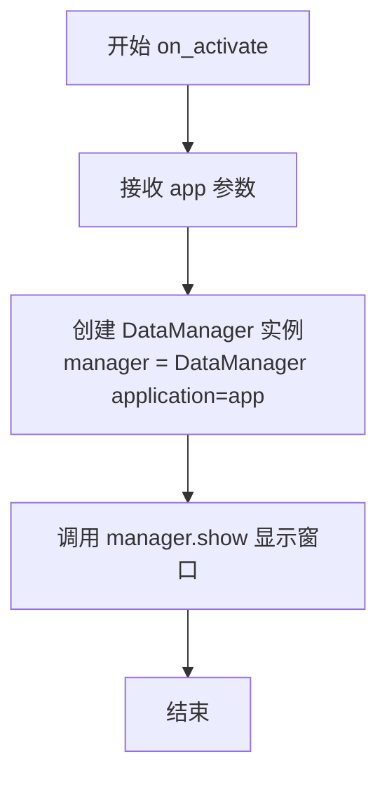
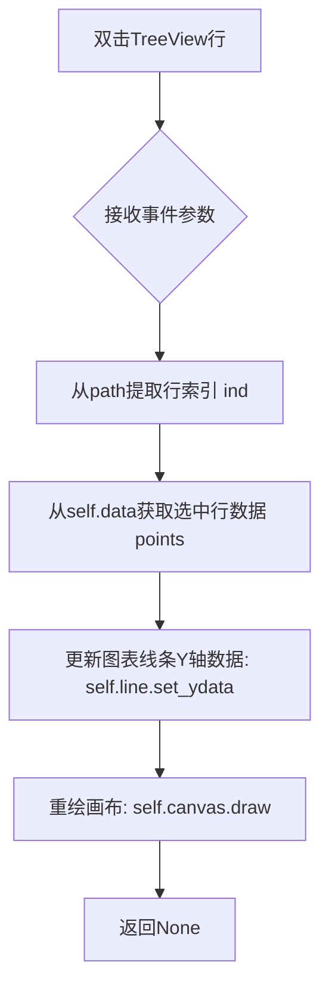

# `matplotlib\galleries\examples\user_interfaces\gtk4_spreadsheet_sgskip.py` 详细设计文档

这是一个使用GTK4和Matplotlib构建的电子表格应用程序，通过TreeView展示数据网格，用户双击任意行时会在底部图表中实时绘制该行数据，实现数据可视化交互。

## 整体流程

```mermaid
graph TD
    A[程序启动] --> B[Gtk.Application创建]
B --> C[activate信号触发]
C --> D[on_activate函数调用]
D --> E[创建DataManager实例]
E --> F[DataManager.__init__初始化]
F --> G[创建GTK组件: Box, Label, ScrolledWindow, TreeView]
G --> H[创建Matplotlib Figure和Canvas]
H --> I[create_model创建数据模型]
I --> J[add_columns添加表格列]
J --> K{用户交互}]
K -->|双击某行| L[plot_row方法被调用]
L --> M[获取选中行数据]
M --> N[更新图表数据]
N --> O[canvas.draw重绘图表]
```

## 类结构

```
DataManager (Gtk.ApplicationWindow)
└── 包含: TreeView, FigureCanvas, ListStore
```

## 全局变量及字段


### `app`
    
全局应用实例，用于管理GTK应用程序的生命周期和信号连接

类型：`Gtk.Application`
    


### `DataManager.num_rows`
    
数据行数，类属性，定义为20行

类型：`int`
    


### `DataManager.num_cols`
    
数据列数，类属性，定义为10列

类型：`int`
    


### `DataManager.data`
    
随机生成的表格数据，类属性，存储20x10的随机浮点数数组

类型：`ndarray`
    


### `DataManager.treeview`
    
树形视图控件，实例属性，用于显示表格数据

类型：`Gtk.TreeView`
    


### `DataManager.canvas`
    
Matplotlib画布，实例属性，用于渲染图表

类型：`FigureCanvas`
    


### `DataManager.line`
    
图表线条对象，实例属性，表示Matplotlib中的线条元素

类型：`Line2D`
    
    

## 全局函数及方法


### `on_activate`

`on_activate`是GTK应用激活时的回调函数，负责创建DataManager窗口（继承自Gtk.ApplicationWindow）并将其显示出来。该函数是应用的入口点，在Gtk.Application的activate信号触发时被调用，初始化主窗口并展示给用户。

参数：

- `app`：`Gtk.Application`，触发激活信号的应用实例本身，用于作为DataManager的application参数

返回值：`None`，该函数没有返回值，仅通过副作用（创建和显示窗口）完成功能

#### 流程图



#### 带注释源码

```python
def on_activate(app):
    """
    GTK应用激活时的回调函数
    
    参数:
        app: Gtk.Application - 触发activate信号的应用实例
        
    返回值:
        None
    """
    # 创建DataManager窗口实例，传入application参数使其成为app的子窗口
    manager = DataManager(application=app)
    
    # 调用show方法使窗口可见并显示在屏幕上
    manager.show()
```


### `DataManager.__init__`

初始化 GTK4 应用程序窗口，创建电子表格界面、TreeView 表格组件、Matplotlib 图表画布，并完成所有 UI 组件的布局与绑定。

参数：

- `self`：`DataManager`，当前 DataManager 类的实例本身
- `*args`：可变位置参数，传递给父类 Gtk.ApplicationWindow 的位置参数
- `**kwargs`：可变关键字参数，传递给父类 Gtk.ApplicationWindow 的关键字参数

返回值：`None`，无返回值，该方法为构造函数，仅完成对象的初始化工作

#### 流程图

```mermaid
flowchart TD
    A[__init__ 开始] --> B[调用父类构造函数 super().__init__]
    B --> C[设置窗口默认大小 600x600]
    C --> D[设置窗口标题 'GtkListStore demo']
    D --> E[创建垂直布局的 Box 容器]
    E --> F[创建提示标签并添加到容器]
    F --> G[创建 ScrolledWindow 滚动窗口]
    G --> H[调用 create_model 创建数据模型]
    H --> I[创建 TreeView 树视图并绑定模型]
    I --> J[连接 row-activated 信号到 plot_row 方法]
    J --> K[将 TreeView 添加到滚动窗口]
    K --> L[创建 Matplotlib Figure 图表对象]
    L --> M[创建 FigureCanvas 画布]
    M --> N[添加子图并绘制第一行数据]
    N --> O[调用 add_columns 添加表格列]
    O --> P[__init__ 结束]
```

#### 带注释源码

```python
def __init__(self, *args, **kwargs):
    # 调用父类 Gtk.ApplicationWindow 的构造函数
    # *args 和 **kwargs 允许传递 application 参数等
    super().__init__(*args, **kwargs)
    
    # 设置窗口的默认大小为 600x600 像素
    self.set_default_size(600, 600)

    # 设置窗口标题
    self.set_title('GtkListStore demo')

    # 创建一个垂直方向的 Box 容器用于布局
    # orientation: VERTICAL 表示垂直排列
    # homogeneous: False 表示子组件不必等高
    # spacing: 8 表示子组件之间的间距为 8 像素
    vbox = Gtk.Box(orientation=Gtk.Orientation.VERTICAL, homogeneous=False,
                   spacing=8)
    # 将 Box 容器设置为窗口的子组件
    self.set_child(vbox)

    # 创建一个提示标签，说明双击行可绘制数据
    label = Gtk.Label(label='Double click a row to plot the data')
    # 将标签添加到垂直容器中
    vbox.append(label)

    # 创建滚动窗口，用于容纳 TreeView
    sw = Gtk.ScrolledWindow()
    sw.set_has_frame(True)  # 设置有边框
    # 设置滚动策略：水平永不滚动，垂直自动滚动
    sw.set_policy(Gtk.PolicyType.NEVER, Gtk.PolicyType.AUTOMATIC)
    sw.set_hexpand(True)  # 水平可扩展
    sw.set_vexpand(True)  # 垂直可扩展
    vbox.append(sw)  # 将滚动窗口添加到容器

    # 调用 create_model 方法创建 Gtk.ListStore 数据模型
    model = self.create_model()
    
    # 创建 TreeView 树视图并绑定数据模型
    self.treeview = Gtk.TreeView(model=model)
    # 连接 row-activated 信号（双击行）到 plot_row 方法
    self.treeview.connect('row-activated', self.plot_row)
    # 将 TreeView 设置为滚动窗口的子组件
    sw.set_child(self.treeview)

    # ===== Matplotlib 相关初始化 =====
    # 创建 Figure 对象，设置尺寸为 6x4 英寸，使用 constrained 布局
    fig = Figure(figsize=(6, 4), layout='constrained')

    # 创建 FigureCanvas（GTK4 的绘图区域）
    self.canvas = FigureCanvas(fig)
    self.canvas.set_hexpand(True)  # 画布水平可扩展
    self.canvas.set_vexpand(True)  # 画布垂直可扩展
    vbox.append(self.canvas)  # 将画布添加到容器
    
    # 添加子图，获取 axes 对象
    ax = fig.add_subplot()
    # 绘制第一行数据，使用绿色圆点标记
    # self.line 用于后续更新数据时引用该线条对象
    self.line, = ax.plot(self.data[0, :], 'go')

    # 调用 add_columns 方法为 TreeView 添加列
    self.add_columns()
```


### `DataManager.plot_row`

处理用户双击TreeView行的事件，根据选中行的索引更新图表数据并重绘画布。

参数：

- `self`：`DataManager`，当前DataManager实例本身
- `treeview`：`Gtk.TreeView`，触发双击事件的TreeView控件实例
- `path`：`Gtk.TreePath`，双击行的路径对象，用于获取数据索引
- `view_column`：`Gtk.TreeViewColumn`，双击所在的列对象（当前未使用）

返回值：`None`，该方法直接修改实例属性（图表数据）并通过GTK事件循环更新UI，无显式返回值

#### 流程图



#### 带注释源码

```python
def plot_row(self, treeview, path, view_column):
    """
    处理TreeView行双击事件，更新Matplotlib图表数据
    
    参数:
        treeview: 触发双击事件的TreeView对象（GTK信号提供）
        path: GTK TreePath对象，表示选中行的路径索引
        view_column: 双击的列对象（当前方法未使用该参数）
    """
    
    ind, = path  # 从TreePath中解包获取行索引（整数）
    # path是一个只包含单个整数的元组，如(5,)表示第5行
    
    points = self.data[ind, :]  # 根据索引从数据矩阵中提取对应行的所有列数据
    # data是形状为(num_rows, num_cols)的numpy数组
    
    self.line.set_ydata(points)  # 更新matplotlib线条对象的Y轴数据
    # self.line是AxesLine2D对象，代表图表中的线条
    
    self.canvas.draw()  # 强制重绘GTK4画布以显示更新后的图表
    # 调用GTK事件循环刷新绘图区域
```


### `DataManager.add_columns`

该方法负责为界面上的 `Gtk.TreeView` 组件动态创建并附加指定数量的列，每一列对应底层数据模型中的一个字段，从而在表格中展示数据。

参数：

- `self`：`DataManager`（实例），指向窗口对象，提供了 `treeview`（视图对象）和 `num_cols`（列数）属性。

返回值：`None`，该方法无返回值，直接修改了 UI 组件 `treeview` 的内部状态。

#### 流程图

```mermaid
graph TD
    A([Start add_columns]) --> B{Loop i from 0 to num_cols - 1}
    B -->|Yes| C[Create Column Object]
    C --> D[Initialize Gtk.TreeViewColumn<br/>Title: str(i)]
    E[Initialize Gtk.CellRendererText] --> D
    D --> F[Bind Data Index<br/>text=i]
    F --> G[Append Column to TreeView]
    G --> B
    B -->|No| H([End])
```

#### 带注释源码

```python
def add_columns(self):
    """
    为 self.treeview 添加列。
    遍历从 0 到 num_cols 的索引，为每个索引创建一个对应的表格列。
    """
    # 循环遍历列的索引
    for i in range(self.num_cols):
        # 创建 Gtk.TreeViewColumn
        # 参数1 (str(i)): 列的标题，这里使用数字字符串作为标题
        # 参数2 (Gtk.CellRendererText()): 单元格渲染器，用于显示文本内容
        # 参数3 (text=i): 属性映射，指定该列显示模型中第 i 列的数据
        column = Gtk.TreeViewColumn(str(i), Gtk.CellRendererText(), text=i)
        
        # 将新创建的列对象添加到 TreeView 组件中
        self.treeview.append_column(column)
```


### `DataManager.create_model`

该方法创建一个GTK ListStore数据模型，将DataManager中存储的随机数据填充到列表存储中，并返回该模型供TreeView组件使用。

参数：
- `self`：DataManager实例，方法所属对象的引用

返回值：`Gtk.ListStore`，包含所有行数据的列表存储模型，可绑定到TreeView进行显示和交互

#### 流程图

```mermaid
flowchart TD
    A[开始 create_model] --> B[创建类型列表: types = [float] * num_cols]
    B --> C[创建ListStore: Gtk.ListStore(*types)]
    C --> D{遍历 data 中的每一行}
    D -->|是| E[在store中插入新行: store.insert(-1)]
    E --> F[设置行数据: store.set]
    F --> D
    D -->|否| G[返回 store]
    G --> H[结束]
    
    style A fill:#e1f5fe
    style H fill:#e1f5fe
    style C fill:#fff3e0
    style G fill:#e8f5e9
```

#### 带注释源码

```python
def create_model(self):
    """
    创建GTK ListStore数据模型，将随机数据填充到列表存储中
    
    Returns:
        Gtk.ListStore: 包含所有行数据的列表存储模型
    """
    # 创建类型列表，每个列都是float类型
    types = [float] * self.num_cols
    
    # 创建ListStore，传入列类型参数
    store = Gtk.ListStore(*types)
    
    # 遍历数据中的每一行
    for row in self.data:
        # Gtk.ListStore.append在PyGObject中有bug，因此手动插入
        # insert(-1)表示在末尾插入新行，返回迭代器it
        it = store.insert(-1)
        
        # 使用字典形式设置行数据，键为列索引，值为对应的数据值
        # enumerate(row)生成(索引, 值)元组
        store.set(it, {i: val for i, val in enumerate(row)})
    
    # 返回创建好的ListStore模型
    return store
```

## 关键组件


### DataManager类

主应用窗口类，继承自Gtk.ApplicationWindow，负责管理整个电子表格应用的UI布局、数据模型和Matplotlib图表集成。

### TreeView组件

GTK树形视图组件，用于以表格形式显示电子表格数据，支持行激活事件以触发图表更新。

### ListStore数据模型

GTK列表存储模型，用于存储电子表格中的浮点数数据，每行对应一个数据行。

### Matplotlib图表组件

包含Figure画布和Axes子图，用于可视化电子表格中被选中的行数据，以折线图形式展示。

### plot_row方法

处理TreeView行激活事件的方法，获取选中行的索引并更新Matplotlib图表中的数据点。

### create_model方法

创建GTK ListStore数据模型的方法，将numpy数组数据转换为GTK可用的列表存储格式。

### on_activate回调函数

GTK应用激活回调函数，创建并显示DataManager主窗口。


## 问题及建议


### 已知问题

- **类字段误用**：`num_rows`、`num_cols`、`data`被定义为类字段而非实例字段，导致所有`DataManager`实例共享同一份数据，如果创建多个窗口会互相影响
- **全局变量污染**：`app`作为全局变量存在，违反了封装原则，且在模块被导入时就会执行，可能导致意外行为
- **注释暴露已知问题**：代码注释中提到"Gtk.ListStore.append is broken in PyGObject, so insert manually"，这是一个已知的workaround，说明依赖库存在兼容性问题
- **硬编码值过多**：窗口大小(600x600)、图形尺寸(6x4)、数据行列数(20x10)等均为硬编码，缺乏配置灵活性
- **无错误处理**：整个应用没有任何try-except异常处理，缺乏输入验证（如`path`解包时的空路径检查）
- **重复绘制开销**：`plot_row`方法中每次调用`self.canvas.draw()`都会重绘整个画布，对于频繁更新场景性能不佳

### 优化建议

- 将`num_rows`、`num_cols`、`data`改为实例字段，在`__init__`中初始化，使每个窗口实例拥有独立的数据副本
- 使用应用级单例模式或依赖注入管理`Gtk.Application`对象，避免全局变量
- 将硬编码的配置值提取为类常量或配置文件，使用`dataclass`或`namedtuple`管理配置
- 为关键方法添加参数校验和异常捕获，特别是涉及索引访问的`plot_row`方法
- 考虑使用`FigureCanvas`的低级API或`ax.relim()`+`ax.autoscale_view()`组合替代全画布重绘
- 添加类型注解提高代码可读性和IDE支持，考虑使用`dataclasses`重构`DataManager`类的数据结构

## 其它


### 设计目标与约束

本项目旨在演示如何在GTK4应用程序中嵌入Matplotlib图表，并通过TreeView控件实现数据可视化交互。设计目标是创建一个简单的电子表格应用，用户可以通过双击表格中的任意行来动态更新绑定的图表数据。技术约束方面，需要使用GTK4、Matplotlib、numpy等库，并确保在Python 3环境中运行。性能约束上，由于数据规模较小（20行×10列），无需考虑大数据量的优化处理。

### 错误处理与异常设计

代码中的错误处理机制相对简单，主要依赖GTK和Matplotlib的内部异常处理。在数据操作方面，`random()`函数可能抛出内存分配异常，`ListStore`的`insert`和`set`方法在数据格式错误时可能引发异常。当前实现未显式捕获异常，建议在生产环境中添加try-except块处理数据索引越界、类型转换错误等情况。对于`path`解包时的空路径情况，GTK的信号传递机制已经过良好测试，但建议添加防御性检查以确保`ind`值的有效性。

### 数据流与状态机

应用的数据流遵循以下路径：初始化时通过`numpy.random`生成二维数组数据→创建Gtk.ListStore模型→绑定到TreeView显示→用户双击触发`plot_row`信号→从数据数组中提取对应行数据→更新Matplotlib图表的线条数据→重绘画布。状态机方面，应用主要包含两种状态：初始显示状态（显示第一行数据的图表）和交互更新状态（用户双击后更新图表）。TreeView的选择模型和ListStore的数据模型保持同步，确保UI与数据的一致性。

### 外部依赖与接口契约

本项目依赖以下外部库：`gi.repository.Gtk`（版本4.0）用于UI框架，`gi.repository.Gdk`（版本4.0）用于图形设备接口，`numpy.random`用于生成测试数据，`matplotlib.backends.backend_gtk4agg.FigureCanvas`用于在GTK4中嵌入Matplotlib图表，`matplotlib.figure.Figure`用于创建图表对象。接口契约方面，`DataManager`类继承`Gtk.ApplicationWindow`，通过`application`参数与`Gtk.Application`进行绑定。`on_activate`函数是GTK应用的入口点，接受`Gtk.Application`实例作为参数并返回`None`。

### 用户交互流程

用户启动应用后，首先看到包含表格和图表的主窗口。表格默认显示随机生成的20行×10列数据，图表默认显示第一行数据（绿色圆点）。用户可以通过鼠标滚轮滚动查看更多数据行。当用户双击表格中的任意一行时，`row-activated`信号被触发，应用提取该行对应的数据数组，更新Matplotlib图表中的线条数据，并重新绘制画布以显示更新后的图表。整个交互过程是同步的，用户界面会短暂阻塞直至图表重绘完成。

### 性能考虑与优化空间

当前实现的主要性能瓶颈在于每次双击后调用`self.canvas.draw()`进行全量重绘，对于更大的数据集或更复杂的图表可以考虑使用`ax.relim()`和`ax.autoscale_view()`结合`canvas.draw_idle()`实现增量更新。ListStore的创建过程中使用了手动插入方式（注释提到`Gtk.ListStore.append`在PyGObject中存在bug），在大数据量场景下可以考虑使用批量插入优化。图表对象在初始化时创建并保持引用，避免了重复创建的开销，但也可以考虑在数据变化较大时销毁旧图以释放内存。

### 安全性考虑

当前代码未涉及用户输入验证、网络通信或敏感数据处理，安全性风险较低。但建议在生产环境中注意：避免直接将不可信数据绑定到UI控件；对用户提供的文件路径或数据格式进行验证；考虑使用虚拟环境隔离依赖库版本。由于代码运行在本地桌面环境，暂无XSS、注入等Web应用常见的安全威胁。

### 可扩展性设计

类设计遵循了基本的面向对象原则，`DataManager`类可以作为基类扩展更多功能。可能的扩展方向包括：添加数据编辑功能（通过CellRendererText的可编辑属性）；支持导入/导出CSV文件；添加数据过滤和排序功能；实现多图表联动显示。当前将`data`作为类属性绑定，修改为实例属性可以支持多窗口独立数据。TreeView的列动态生成机制已经支持灵活调整列数。

### 测试策略建议

由于涉及GTK GUI组件，测试建议分为单元测试和集成测试两部分。单元测试可针对`create_model()`方法验证ListStore的数据完整性，针对`plot_row()`方法验证图表更新逻辑（可通过mock FigureCanvas避免实际GUI渲染）。集成测试建议使用`Gtk.test`框架或`pytest`配合`pytest-gtk`进行GUI自动化测试，验证双击交互后图表是否正确更新。测试数据建议使用固定种子生成以确保可重复性。

### 配置与常量定义

当前代码中的配置常量分散在类定义中：`num_rows=20`、`num_cols=10`定义数据规模，`Figure(figsize=(6,4),layout='constrained')`定义图表尺寸。建议将可配置参数抽取到类外部的配置文件或常量类中，例如窗口默认尺寸(600,600)、图表样式('go'表示绿色圆点)、应用ID('org.matplotlib.examples.GTK4Spreadsheet')等，以便于后续维护和配置调整。


    