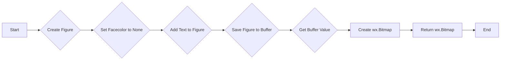
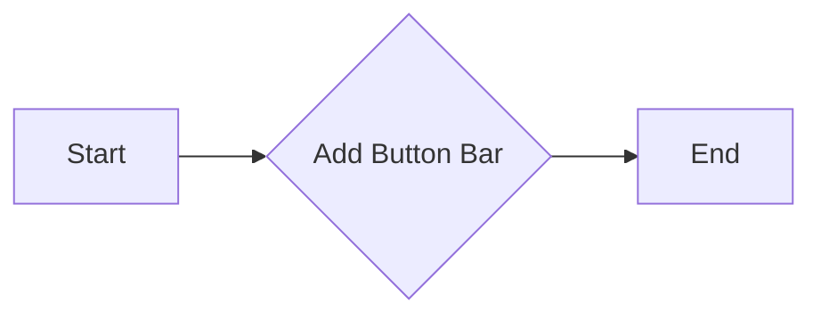
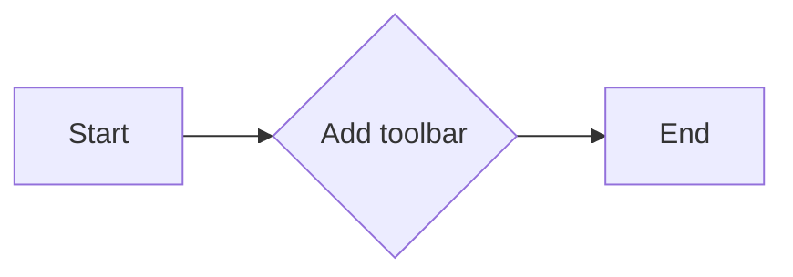
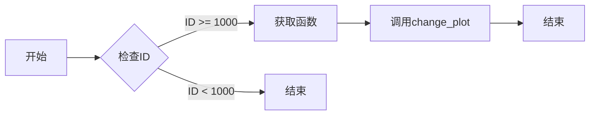
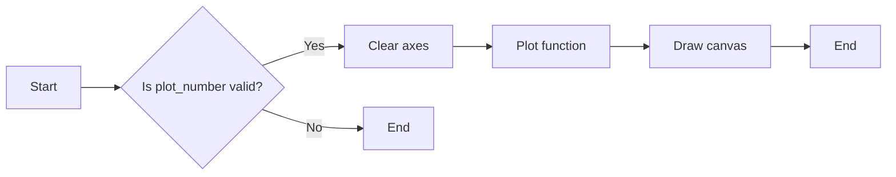
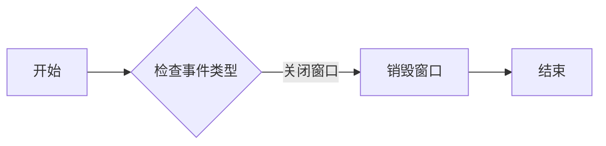
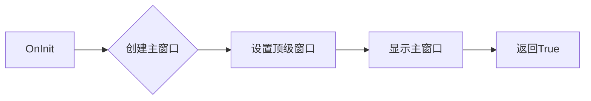

# `matplotlib\galleries\examples\user_interfaces\mathtext_wx_sgskip.py` 详细设计文档

This code provides a wxPython application that displays mathematical expressions as images in a GUI window, allowing users to select different mathematical functions to plot.

## 整体流程

```mermaid
graph TD
    A[Start] --> B[Create wx.Frame]
    B --> C[Initialize figure and axes]
    C --> D[Add canvas to frame]
    D --> E[Add button bar with function buttons]
    E --> F[Add toolbar (optional)]
    F --> G[Set menu bar with File and Functions]
    G --> H[Show frame]
    H --> I[Main loop]
    I --> J[End]
```

## 类结构

```
CanvasFrame (wx.Frame)
├── MyApp (wx.App)
```

## 全局变量及字段


### `IS_WIN`
    
Flag indicating whether the platform is Windows.

类型：`bool`
    


### `functions`
    
List of tuples containing math expressions and their corresponding functions.

类型：`list of tuples`
    


### `CanvasFrame.figure`
    
The matplotlib figure object used for plotting.

类型：`matplotlib.figure.Figure`
    


### `CanvasFrame.axes`
    
The matplotlib axes object used for plotting.

类型：`matplotlib.axes._subplots.AxesSubplot`
    


### `CanvasFrame.canvas`
    
The canvas widget for rendering the matplotlib figure.

类型：`matplotlib.backends.backend_wxagg.FigureCanvasWxAgg`
    


### `CanvasFrame.button_bar`
    
The panel containing the button bar for changing plots.

类型：`wx.Panel`
    


### `CanvasFrame.button_bar_sizer`
    
The sizer for the button bar panel.

类型：`wx.BoxSizer`
    


### `CanvasFrame.sizer`
    
The main sizer for the frame layout.

类型：`wx.BoxSizer`
    


### `CanvasFrame.toolbar`
    
The navigation toolbar for the canvas.

类型：`matplotlib.backends.backend_wx.NavigationToolbar2Wx`
    


### `CanvasFrame.menuBar`
    
The menu bar for the frame.

类型：`wx.MenuBar`
    


### `MyApp.topWindow`
    
The top-level window of the application.

类型：`wx.Frame`
    
    

## 全局函数及方法


### mathtext_to_wxbitmap

Converts mathematical text to a wx.Bitmap for display in wxPython controls.

参数：

- `s`：`str`，The mathematical text to be converted.

返回值：`wx.Bitmap`，A wx.Bitmap object containing the rendered mathematical text.

#### 流程图



#### 带注释源码

```python
def mathtext_to_wxbitmap(s):
    # We draw the text at position (0, 0) but then rely on
    # ``facecolor="none"`` and ``bbox_inches="tight", pad_inches=0`` to get a
    # transparent mask that is then loaded into a wx.Bitmap.
    fig = Figure(facecolor="none")
    text_color = (
        np.array(wx.SystemSettings.GetColour(wx.SYS_COLOUR_WINDOWTEXT)) / 255)
    fig.text(0, 0, s, fontsize=10, color=text_color)
    buf = BytesIO()
    fig.savefig(buf, format="png", dpi=150, bbox_inches="tight", pad_inches=0)
    s = buf.getvalue()
    return wx.Bitmap.NewFromPNGData(s, len(s))
```


### CanvasFrame.__init__

初始化CanvasFrame类，创建一个包含matplotlib图形的wxPython窗口。

参数：

- `parent`：`wx.Frame`，父窗口对象。
- `title`：`str`，窗口标题。

返回值：无

#### 流程图

```mermaid
classDiagram
    CanvasFrame <|-- wx.Frame
    CanvasFrame {
        Figure figure
        FigureCanvas canvas
        wx.BoxSizer sizer
        wx.MenuBar menuBar
        wx.Panel button_bar
        wx.BoxSizer button_bar_sizer
        wx.Panel toolbar
        wx.BoxSizer toolbar_sizer
        wx.Button button_bar_button
        wx.Button toolbar_button
    }
    CanvasFrame {
        +__init__(parent: wx.Frame, title: str)
        +add_buttonbar()
        +add_toolbar()
        +SetMenuBar(menuBar: wx.MenuBar)
        +SetSizer(sizer: wx.BoxSizer)
        +Fit()
    }
```

#### 带注释源码

```python
def __init__(self, parent, title):
    super().__init__(parent, -1, title, size=(550, 350))

    self.figure = Figure(facecolor="none")
    self.axes = self.figure.add_subplot()

    self.canvas = FigureCanvas(self, -1, self.figure)

    self.change_plot(0)

    self.sizer = wx.BoxSizer(wx.VERTICAL)
    self.add_buttonbar()
    self.sizer.Add(self.canvas, 1, wx.LEFT | wx.TOP | wx.GROW)
    self.add_toolbar()  # comment this out for no toolbar

    menuBar = wx.MenuBar()

    # File Menu
    menu = wx.Menu()
    m_exit = menu.Append(
        wx.ID_EXIT, "E&xit\tAlt-X", "Exit this simple sample")
    menuBar.Append(menu, "&File")
    self.Bind(wx.EVT_MENU, self.OnClose, m_exit)

    if IS_WIN:
        # Equation Menu
        menu = wx.Menu()
        for i, (mt, func) in enumerate(functions):
            bm = mathtext_to_wxbitmap(mt)
            item = wx.MenuItem(menu, 1000 + i, " ")
            item.SetBitmap(bm)
            menu.Append(item)
            self.Bind(wx.EVT_MENU, self.OnChangePlot, item)
        menuBar.Append(menu, "&Functions")

    self.SetMenuBar(menuBar)

    self.SetSizer(self.sizer)
    self.Fit()
```


### CanvasFrame.add_buttonbar

This method adds a button bar to the CanvasFrame, which contains bitmap buttons representing mathematical functions.

参数：

- 无

返回值：无

#### 流程图



#### 带注释源码

```python
def add_buttonbar(self):
    self.button_bar = wx.Panel(self)
    self.button_bar_sizer = wx.BoxSizer(wx.HORIZONTAL)
    self.sizer.Add(self.button_bar, 0, wx.LEFT | wx.TOP | wx.GROW)

    for i, (mt, func) in enumerate(functions):
        bm = mathtext_to_wxbitmap(mt)
        button = wx.BitmapButton(self.button_bar, 1000 + i, bm)
        self.button_bar_sizer.Add(button, 1, wx.GROW)
        self.Bind(wx.EVT_BUTTON, self.OnChangePlot, button)

    self.button_bar.SetSizer(self.button_bar_sizer)
``` 


### CanvasFrame.add_toolbar

This method adds a toolbar to the `CanvasFrame` window.

参数：

- 无

返回值：无

#### 流程图



#### 带注释源码

```python
def add_toolbar(self):
    """Copied verbatim from embedding_wx2.py"""
    self.toolbar = NavigationToolbar2Wx(self.canvas)
    self.toolbar.Realize()
    # By adding toolbar in sizer, we are able to put it at the bottom
    # of the frame - so appearance is closer to GTK version.
    self.sizer.Add(self.toolbar, 0, wx.LEFT | wx.EXPAND)
    # update the axes menu on the toolbar
    self.toolbar.update()
```


### CanvasFrame.OnChangePlot

该函数用于根据事件ID来改变绘图内容。

参数：

- `event`：`wx.Event`，事件对象，包含触发事件的按钮ID。

返回值：无

#### 流程图



#### 带注释源码

```python
def OnChangePlot(self, event):
    self.change_plot(event.GetId() - 1000)
```


### CanvasFrame.change_plot

This method updates the plot displayed in the canvas based on the selected function.

参数：

- `plot_number`：`int`，The index of the function to plot. This corresponds to the index in the `functions` list.

返回值：`None`，This method does not return a value.

#### 流程图



#### 带注释源码

```python
def change_plot(self, plot_number):
    t = np.arange(1.0, 3.0, 0.01)
    s = functions[plot_number][1](t)
    self.axes.clear()
    self.axes.plot(t, s)
    self.canvas.draw()
```


### CanvasFrame.OnClose

此方法用于处理关闭窗口的事件。

参数：

- `event`：`wx.Event`，包含有关事件的信息。

返回值：无

#### 流程图



#### 带注释源码

```python
def OnClose(self, event):
    # 销毁窗口
    self.Destroy()
``` 


### MyApp.OnInit

初始化应用程序并创建主窗口。

参数：

- `None`：无参数

返回值：`True`，表示初始化成功

#### 流程图



#### 带注释源码

```python
class MyApp(wx.App):
    def OnInit(self):
        frame = CanvasFrame(None, "wxPython mathtext demo app")
        self.SetTopWindow(frame)
        frame.Show(True)
        return True
```

## 关键组件


### 张量索引与惰性加载

张量索引与惰性加载是代码中用于处理数学函数和图形绘制的核心组件。它们允许在不需要立即计算整个数据集的情况下，仅对所需的部分进行计算和渲染。

### 反量化支持

反量化支持是代码中用于处理数学表达式和函数的核心组件。它允许将数学表达式转换为可计算的数值形式，并支持各种数学运算。

### 量化策略

量化策略是代码中用于优化数学运算和图形渲染的核心组件。它通过减少数据精度和优化计算过程来提高性能和效率。


## 问题及建议


### 已知问题

-   **全局变量和函数的重复使用**：`mathtext_to_wxbitmap` 函数被多次调用，每次都创建一个新的 `Figure` 对象，这可能导致不必要的资源消耗。可以考虑将这个函数修改为类方法或全局函数，以便重用 `Figure` 对象。
-   **硬编码的字体大小**：在 `mathtext_to_wxbitmap` 函数中，字体大小被硬编码为 10。这可能不适合所有用户界面，应该允许用户自定义字体大小。
-   **菜单项的重复**：在 Windows 平台上，菜单项通过 `wx.MenuItem` 创建，并设置了相同的 ID。这可能导致菜单项无法正确显示。
-   **按钮的重复**：在 `add_buttonbar` 方法中，按钮通过 `wx.BitmapButton` 创建，并设置了相同的 ID。这可能导致按钮无法正确显示。

### 优化建议

-   **重用 `Figure` 对象**：将 `mathtext_to_wxbitmap` 函数修改为类方法或全局函数，并在其中重用 `Figure` 对象，以减少资源消耗。
-   **允许用户自定义字体大小**：添加一个参数到 `mathtext_to_wxbitmap` 函数，允许用户指定字体大小。
-   **修复菜单项和按钮的 ID**：为每个菜单项和按钮分配唯一的 ID，以确保它们可以正确显示。
-   **使用更现代的 wxPython 组件**：考虑使用更现代的 wxPython 组件，如 `wx.Button` 和 `wx.StaticBitmap`，以提供更好的用户体验。
-   **异常处理**：添加异常处理来捕获可能发生的错误，例如文件读取错误或绘图错误。
-   **代码注释**：添加代码注释以解释代码的功能和目的，以提高代码的可读性和可维护性。
-   **单元测试**：编写单元测试以确保代码的正确性和稳定性。
-   **性能优化**：分析代码的性能瓶颈，并对其进行优化，以提高应用程序的响应速度。
-   **国际化**：考虑将应用程序本地化为其他语言，以扩大其受众。
-   **文档**：编写详细的文档，包括安装指南、使用说明和代码示例，以帮助用户更好地使用应用程序。


## 其它


### 设计目标与约束

- 设计目标：
  - 实现一个wxPython应用程序，用于显示数学公式。
  - 提供一个用户界面，允许用户选择不同的数学函数。
  - 使用matplotlib库来生成数学公式的图像。
- 约束：
  - 必须使用wxPython和matplotlib库。
  - 应用程序必须能够在Windows和Linux操作系统上运行。

### 错误处理与异常设计

- 错误处理：
  - 在用户尝试执行无效操作时，应用程序应提供友好的错误消息。
  - 在加载或处理数据时，应捕获并处理可能发生的异常。
- 异常设计：
  - 使用try-except块来捕获和处理异常。
  - 定义自定义异常类，以提供更具体的错误信息。

### 数据流与状态机

- 数据流：
  - 用户选择数学函数，应用程序生成相应的图像。
  - 图像通过matplotlib库生成，并显示在wxPython窗口中。
- 状态机：
  - 应用程序具有一个主状态，其中用户可以浏览和选择数学函数。
  - 当用户选择一个函数时，应用程序进入一个生成和显示图像的状态。

### 外部依赖与接口契约

- 外部依赖：
  - wxPython库：用于创建图形用户界面。
  - matplotlib库：用于生成数学公式的图像。
  - numpy库：用于数学计算。
- 接口契约：
  - wxPython控件和事件处理程序之间的接口。
  - matplotlib图形和轴对象之间的接口。
  - numpy数组操作和数学函数之间的接口。


    