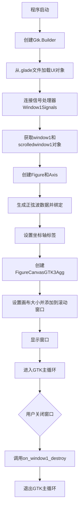
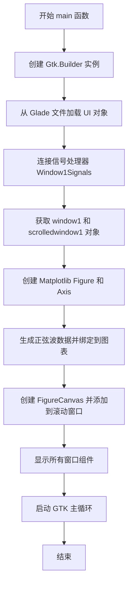
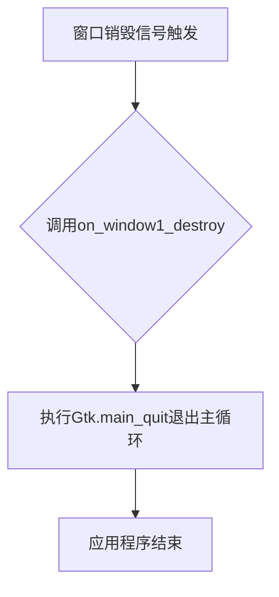

# `matplotlib\galleries\examples\user_interfaces\mpl_with_glade3_sgskip.py` 详细设计文档

这是一个将Matplotlib图表嵌入GTK+3 GUI应用程序的示例程序，通过Glade构建的窗口加载UI，并在滚动窗口中显示正弦波形的Matplotlib图表。

## 整体流程



## 类结构

```
Window1Signals (信号处理类)
└── main() (主函数)
```

## 全局变量及字段


### `builder`
    
GTK构建器对象，用于从Glade文件加载UI定义

类型：`Gtk.Builder`
    


### `window`
    
从Glade文件加载的主窗口对象

类型：`Gtk.Window`
    


### `sw`
    
从Glade文件加载的滚动窗口容器，用于承载画布

类型：`Gtk.ScrolledWindow`
    


### `figure`
    
Matplotlib图形对象，定义图形尺寸和分辨率

类型：`matplotlib.figure.Figure`
    


### `axis`
    
Matplotlib坐标轴对象，用于绘制数据

类型：`matplotlib.axes.Axes`
    


### `t`
    
时间数组，范围0.0到3.0秒，步长0.01秒

类型：`numpy.ndarray`
    


### `s`
    
正弦波电压值数组，由2π频率的正弦函数生成

类型：`numpy.ndarray`
    


### `canvas`
    
GTK3兼容的Matplotlib画布，嵌入GTK小部件

类型：`FigureCanvasGTK3Agg`
    


### `Window1Signals.on_window1_destroy`
    
处理窗口销毁信号的回调方法，退出GTK主循环

类型：`method`
    
    

## 全局函数及方法


### `main`

该函数是应用程序的入口点，负责初始化GTK构建器，加载Glade UI文件，创建Matplotlib图表（正弦波可视化），将其嵌入到GTK滚动窗口中，并启动GTK主循环以显示GUI。

参数：

- 无

返回值：`None`，无返回值

#### 流程图



#### 带注释源码

```python
def main():
    """
    应用程序主函数，初始化GTK窗口、加载Glade UI、
    创建Matplotlib图表并嵌入到GTK界面中
    """
    # 创建GTK构建器对象，用于解析Glade UI文件
    builder = Gtk.Builder()
    
    # 从Glade文件加载UI对象（window1和所有子对象）
    builder.add_objects_from_file(
        str(Path(__file__).parent / "mpl_with_glade3.glade"),  # 构建Glade文件路径
        ("window1", ""))  # 指定要加载的顶级对象
    
    # 将信号处理器连接到构建器
    # Window1Signals类处理窗口销毁等事件
    builder.connect_signals(Window1Signals())
    
    # 从构建器获取window和scrolledwindow对象
    window = builder.get_object("window1")
    sw = builder.get_object("scrolledwindow1")

    # ===== Matplotlib 特定代码开始 =====
    # 创建图形对象，设置尺寸为8x6英寸，分辨率71 DPI
    figure = Figure(figsize=(8, 6), dpi=71)
    
    # 添加子图（Axes）到图形对象
    axis = figure.add_subplot()
    
    # 生成时间序列数据（0到3秒，步长0.01秒）
    t = np.arange(0.0, 3.0, 0.01)
    
    # 计算正弦波电压值（2π频率）
    s = np.sin(2*np.pi*t)
    
    # 绘制正弦曲线到坐标轴
    axis.plot(t, s)

    # 设置X轴标签（时间）
    axis.set_xlabel('time [s]')
    # 设置Y轴标签（电压）
    axis.set_ylabel('voltage [V]')

    # 创建GTK3兼容的Matplotlib画布（基于GTK3Agg后端）
    canvas = FigureCanvas(figure)  # 返回 Gtk.DrawingArea
    
    # 设置画布的最小尺寸为800x600像素
    canvas.set_size_request(800, 600)
    
    # 将画布添加到滚动窗口中
    sw.add(canvas)
    # ===== Matplotlib 特定代码结束 =====

    # 显示窗口及其所有子组件
    window.show_all()
    
    # 启动GTK主循环，开始处理GUI事件
    Gtk.main()
```


### `Window1Signals.on_window1_destroy`

该函数是GTK信号处理器，当window1窗口被销毁时自动调用，用于安全退出GTK主循环并关闭应用程序。

参数：

- `self`：Window1Signals，方法所属的类实例
- `widget`：Gtk.Widget，触发销毁信号的GTK组件（这里是window1窗口）

返回值：`None`，无返回值

#### 流程图



#### 带注释源码

```python
class Window1Signals:
    def on_window1_destroy(self, widget):
        """
        GTK信号处理器：处理window1窗口销毁事件
        
        此方法在Glade设计的UI文件中与window1的destroy信号连接。
        当用户关闭窗口或调用destroy()方法时，GTK会触发此信号。
        
        参数:
            self: Window1Signals类的实例本身
            widget: 触发信号的GTK组件对象（window1）
        
        返回值:
            None: 无返回值，此方法仅执行副作用（退出应用）
        """
        Gtk.main_quit()  # 退出GTK主循环，终止应用程序
```


## 关键组件


### Window1Signals 类

处理 GTK 窗口信号的类，包含窗口销毁事件处理方法，用于退出 GTK 主循环。

### main() 函数

主程序入口点，负责构建 GTK 窗口、加载 Glade UI 文件、连接信号、创建 Matplotlib 图表并显示。

### Matplotlib 图表组件

包含 Figure（画布容器）、Axis（坐标轴）、Plot（正弦波曲线 plot）以及 FigureCanvasGTK3Agg（GTK3 兼容的绘图区域），用于在 GTK 窗口中渲染正弦波可视化。

### GTK 构建器组件

使用 Gtk.Builder 从 Glade 文件加载 UI 定义，通过 builder.add_objects_from_file 加载窗口和控件，get_object 方法获取具体控件对象。

### 信号连接机制

通过 builder.connect_signals 将 Glade 中的控件信号连接到 Window1Signals 类的方法，实现事件处理与业务逻辑的分离。


## 问题及建议


### 已知问题

-   **硬编码的 Glade 文件路径和对象名**：文件路径使用 `Path(__file__).parent / "mpl_with_glade3.glade"` 拼接，`"window1"` 和 `"scrolledwindow1"` 等对象名硬编码，缺乏配置化和错误提示
-   **完全缺失错误处理**：没有 try-except 块处理 Glade 文件不存在、对象获取失败、Matplotlib 绘图异常等情况，程序会以不友好的方式崩溃
-   **违反单一职责原则**：`main()` 函数承担了 UI 构建、图表创建、窗口显示等多重职责，代码耦合度高，难以测试和复用
-   **类型提示缺失**：所有函数参数和返回值都没有类型注解，不利于静态分析和 IDE 支持
-   **资源管理不当**：Matplotlib 的 `Figure` 对象创建后没有明确的销毁逻辑，可能导致内存泄漏；`canvas` 添加到 `sw` 时也没有考虑后续清理
-   **配置硬编码**：图表尺寸 `figsize=(8, 6)`、DPI 值 `71`、数据范围 `0.0, 3.0, 0.01` 等参数全部硬编码，缺乏灵活性和可配置性
-   **类设计不完整**：`Window1Signals` 类仅包含信号处理方法，但没有文档注释，且信号类与业务逻辑分离不够清晰
-   **数值计算无验证**：`np.arange` 和 `np.sin` 的计算结果没有进行边界检查或验证

### 优化建议

-   添加完整的异常处理机制，使用 try-except 捕获 Glade 文件加载失败、对象获取为 None、Matplotlib 绘图异常等情况，并给出友好的错误提示
-   将 `main()` 函数重构为多个单一职责函数：`load_ui()`、`create_plot()`、`setup_window()`，并提取配置常量或配置文件
-   为所有函数添加类型注解，提升代码可读性和可维护性
-   实现资源管理协议，如使用上下文管理器或在类中实现 `__del__` 方法确保 Figure 对象被正确释放
-   将硬编码的配置值提取为模块级常量或配置文件（YAML/JSON），便于后期调整
-   考虑使用 dataclass 或 namedtuple 封装图表配置参数
-   为 `Window1Signals` 类和 `main()` 函数添加文档字符串，说明其职责和使用方式
-   添加日志记录功能，替代简单的 print 语句，便于问题排查和运行监控

## 其它


### 设计目标与约束

本项目旨在演示如何在GTK+3应用程序中集成Matplotlib图表，通过Glade 3设计的UI界面展示正弦波可视化图形。设计约束包括：使用Python 3.x、GTK+3.0、Matplotlib以及Glade 3进行UI设计，目标是创建一个简单的演示程序，展示从.glade文件加载UI并嵌入Matplotlib画布的基本流程。

### 错误处理与异常设计

代码中错误处理较为简单，主要通过GTK的信号机制处理窗口销毁事件（on_window1_destroy调用Gtk.main_quit()）。潜在的异常包括：.glade文件不存在或路径错误时Gtk.Builder会抛出异常、Matplotlib导入失败、numpy导入失败等。改进建议：添加try-except块捕获文件加载异常，验证依赖库可用性，提供用户友好的错误提示对话框。

### 数据流与状态机

数据流从numpy生成正弦波数据开始，经过Matplotlib的Figure和Axis对象处理，最终渲染到GTK的DrawingArea上。状态机较为简单：初始化状态（加载UI和依赖）→ 配置状态（创建Figure和绑定数据）→ 运行状态（显示窗口并进入GTK主循环）→ 退出状态（调用main_quit()退出）。

### 外部依赖与接口契约

主要外部依赖包括：gi.repository.Gtk（GTK+3.0库）、matplotlib.backends.backend_gtk3agg.FigureCanvasGTK3Agg（Matplotlib GTK3后端）、matplotlib.figure.Figure（Matplotlib图表）、numpy（数值计算）。接口契约：main()函数无参数无返回值，Window1Signals类提供on_window1_destroy信号处理方法，.glade文件必须包含window1和scrolledwindow1对象。

### 安全性考虑

代码未涉及用户输入验证或敏感数据处理，安全性风险较低。但需注意：.glade文件路径使用Path(__file__).parent相对路径，应确保文件存在；代码直接运行，未对异常情况进行保护。

### 性能考虑

Figure的dpi设置为71，尺寸为8x6英寸，canvas大小为800x600像素。数据点数量为300个（0.0到3.0步长0.01），渲染性能良好。潜在优化：对于大数据集，可考虑降采样或使用交互式后端；FigureCanvas使用GTK3Agg后端，适合静态图像渲染。

### 可维护性与扩展性

代码结构简单，main()函数包含所有逻辑，耦合度较高。改进建议：将Matplotlib相关代码封装为独立类（如PlotWidget），便于在不同窗口中复用；将.glade文件加载和信号连接抽象为工具函数；使用配置类管理Figure参数（尺寸、dpi等）。

### 测试考虑

当前代码缺少单元测试。测试策略建议：测试Window1Signals类的信号处理方法、测试Matplotlib Figure对象创建和配置、测试canvas正确添加到scrolledwindow、测试异常情况（如.glade文件缺失）的处理。可使用pytest和mock框架进行GTK组件的单元测试。

### 配置文件与资源

主要资源文件为mpl_with_glade3.glade（GTK Builder UI定义文件），必须与Python脚本位于同一目录。该.glade文件应定义window1（主窗口）和scrolledwindow1（用于放置Matplotlib画布的滚动窗口）两个对象。

### 版本兼容性信息

代码明确指定gi.require_version('Gtk', '3.0')，确保使用GTK3而非GTK4。依赖版本要求：Python 3.x、PyGObject、GTK+3.0、Matplotlib、numpy。注意事项：若迁移到GTK4或Python 2.x需要相应代码调整。

    